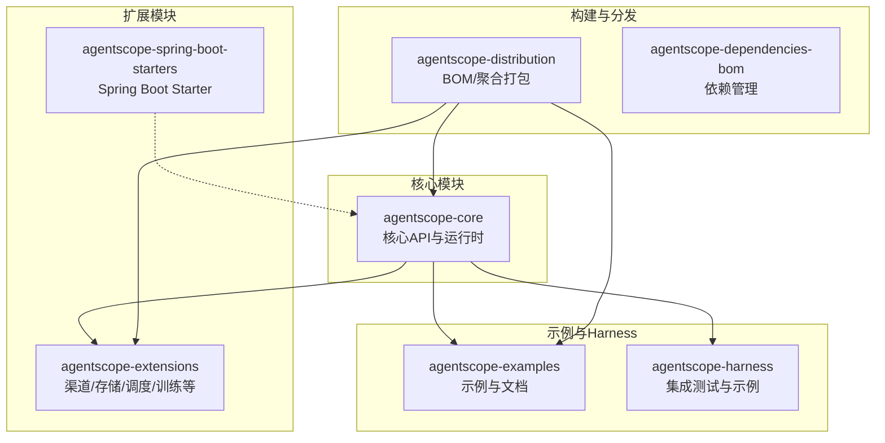
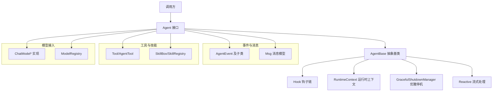
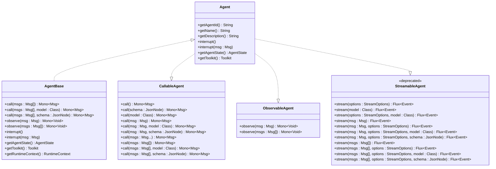
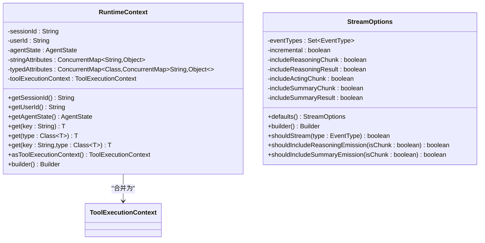
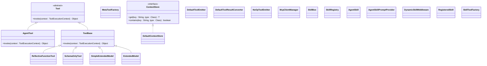
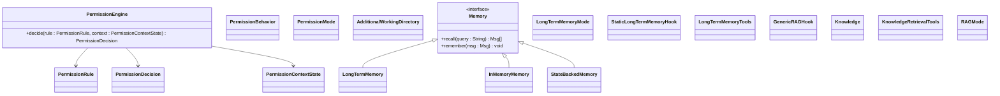
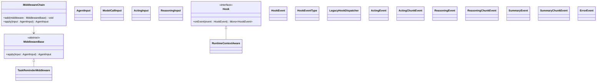
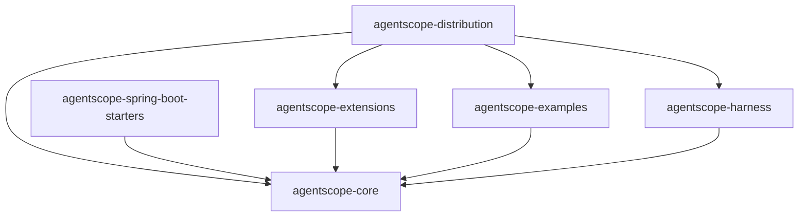

# API参考

<cite>
**本文引用的文件**
- [Version.java](file://agentscope-core/src/main/java/io/agentscope/core/Version.java)
- [Agent.java](file://agentscope-core/src/main/java/io/agentscope/core/agent/Agent.java)
- [AgentBase.java](file://agentscope-core/src/main/java/io/agentscope/core/agent/AgentBase.java)
- [CallableAgent.java](file://agentscope-core/src/main/java/io/agentscope/core/agent/CallableAgent.java)
- [ObservableAgent.java](file://agentscope-core/src/main/java/io/agentscope/core/agent/ObservableAgent.java)
- [StreamableAgent.java](file://agentscope-core/src/main/java/io/agentscope/core/agent/StreamableAgent.java)
- [RuntimeContext.java](file://agentscope-core/src/main/java/io/agentscope/core/agent/RuntimeContext.java)
- [StreamOptions.java](file://agentscope-core/src/main/java/io/agentscope/core/agent/StreamOptions.java)
- [Event.java](file://agentscope-core/src/main/java/io/agentscope/core/agent/Event.java)
- [EventType.java](file://agentscope-core/src/main/java/io/agentscope/core/agent/EventType.java)
- [EventSource.java](file://agentscope-core/src/main/java/io/agentscope/core/agent/EventSource.java)
- [ReActAgent.java](file://agentscope-core/src/main/java/io/agentscope/core/ReActAgent.java)
- [CompositeAgentException.java](file://agentscope-core/src/main/java/io/agentscope/core/exception/CompositeAgentException.java)
- [Msg.java](file://agentscope-core/src/main/java/io/agentscope/core/message/Msg.java)
- [MsgRole.java](file://agentscope-core/src/main/java/io/agentscope/core/message/MsgRole.java)
- [Toolkit.java](file://agentscope-core/src/main/java/io/agentscope/core/tool/Toolkit.java)
- [Hook.java](file://agentscope-core/src/main/java/io/agentscope/core/hook/Hook.java)
- [AgentEvent.java](file://agentscope-core/src/main/java/io/agentscope/core/event/AgentEvent.java)
- [AgentEventType.java](file://agentscope-core/src/main/java/io/agentscope/core/event/AgentEventType.java)
- [AgentStartEvent.java](file://agentscope-core/src/main/java/io/agentscope/core/event/AgentStartEvent.java)
- [AgentEndEvent.java](file://agentscope-core/src/main/java/io/agentscope/core/event/AgentEndEvent.java)
- [ModelCallStartEvent.java](file://agentscope-core/src/main/java/io/agentscope/core/event/ModelCallStartEvent.java)
- [ModelCallEndEvent.java](file://agentscope-core/src/main/java/io/agentscope/core/event/ModelCallEndEvent.java)
- [ToolCallStartEvent.java](file://agentscope-core/src/main/java/io/agentscope/core/event/ToolCallStartEvent.java)
- [ToolCallEndEvent.java](file://agentscope-core/src/main/java/io/agentscope/core/event/ToolCallEndEvent.java)
- [TextBlockStartEvent.java](file://agentscope-core/src/main/java/io/agentscope/core/event/TextBlockStartEvent.java)
- [TextBlockDeltaEvent.java](file://agentscope-core/src/main/java/io/agentscope/core/event/TextBlockDeltaEvent.java)
- [TextBlockEndEvent.java](file://agentscope-core/src/main/java/io/agentscope/core/event/TextBlockEndEvent.java)
- [ThinkingBlockStartEvent.java](file://agentscope-core/src/main/java/io/agentscope/core/event/ThinkingBlockStartEvent.java)
- [ThinkingBlockDeltaEvent.java](file://agentscope-core/src/main/java/io/agentscope/core/event/ThinkingBlockDeltaEvent.java)
- [ThinkingBlockEndEvent.java](file://agentscope-core/src/main/java/io/agentscope/core/event/ThinkingBlockEndEvent.java)
- [ToolResultStartEvent.java](file://agentscope-core/src/main/java/io/agentscope/core/event/ToolResultStartEvent.java)
- [ToolResultDataDeltaEvent.java](file://agentscope-core/src/main/java/io/agentscope/core/event/ToolResultDataDeltaEvent.java)
- [ToolResultEndEvent.java](file://agentscope-core/src/main/java/io/agentscope/core/event/ToolResultEndEvent.java)
- [DataBlockStartEvent.java](file://agentscope-core/src/main/java/io/agentscope/core/event/DataBlockStartEvent.java)
- [DataBlockDeltaEvent.java](file://agentscope-core/src/main/java/io/agentscope/core/event/DataBlockDeltaEvent.java)
- [DataBlockEndEvent.java](file://agentscope-core/src/main/java/io/agentscope/core/event/DataBlockEndEvent.java)
- [HintBlockEvent.java](file://agentscope-core/src/main/java/io/agentscope/core/event/HintBlockEvent.java)
- [RequireUserConfirmEvent.java](file://agentscope-core/src/main/java/io/agentscope/core/event/RequireUserConfirmEvent.java)
- [UserConfirmResultEvent.java](file://agentscope-core/src/main/java/io/agentscope/core/event/UserConfirmResultEvent.java)
- [ExceedMaxItersEvent.java](file://agentscope-core/src/main/java/io/agentscope/core/event/ExceedMaxItersEvent.java)
- [RequestStopEvent.java](file://agentscope-core/src/main/java/io/agentscope/core/event/RequestStopEvent.java)
- [SubagentExposedEvent.java](file://agentscope-core/src/main/java/io/agentscope/core/event/SubagentExposedEvent.java)
- [CustomEvent.java](file://agentscope-core/src/main/java/io/agentscope/core/event/CustomEvent.java)
- [OpenAICredential.java](file://agentscope-core/src/main/java/io/agentscope/core/credential/OpenAICredential.java)
- [DashScopeCredential.java](file://agentscope-core/src/main/java/io/agentscope/core/credential/DashScopeCredential.java)
- [GeminiCredential.java](file://agentscope-core/src/main/java/io/agentscope/core/credential/GeminiCredential.java)
- [AnthropicCredential.java](file://agentscope-core/src/main/java/io/agentscope/core/credential/AnthropicCredential.java)
- [DeepSeekCredential.java](file://agentscope-core/src/main/java/io/agentscope/core/credential/DeepSeekCredential.java)
- [KimiCredential.java](file://agentscope-core/src/main/java/io/agentscope/core/credential/KimiCredential.java)
- [OllamaCredential.java](file://agentscope-core/src/main/java/io/agentscope/core/credential/OllamaCredential.java)
- [XAICredential.java](file://agentscope-core/src/main/java/io/agentscope/core/credential/XAICredential.java)
- [CredentialBase.java](file://agentscope-core/src/main/java/io/agentscope/core/credential/CredentialBase.java)
- [ModelCard.java](file://agentscope-core/src/main/java/io/agentscope/core/credential/ModelCard.java)
- [OpenAIChatModel.java](file://agentscope-core/src/main/java/io/agentscope/core/model/OpenAIChatModel.java)
- [DashScopeChatModel.java](file://agentscope-core/src/main/java/io/agentscope/core/model/DashScopeChatModel.java)
- [GeminiChatModel.java](file://agentscope-core/src/main/java/io/agentscope/core/model/GeminiChatModel.java)
- [AnthropicChatModel.java](file://agentscope-core/src/main/java/io/agentscope/core/model/AnthropicChatModel.java)
- [OllamaChatModel.java](file://agentscope-core/src/main/java/io/agentscope/core/model/OllamaChatModel.java)
- [ChatModelBase.java](file://agentscope-core/src/main/java/io/agentscope/core/model/ChatModelBase.java)
- [ChatResponse.java](file://agentscope-core/src/main/java/io/agentscope/core/model/ChatResponse.java)
- [ChatUsage.java](file://agentscope-core/src/main/java/io/agentscope/core/model/ChatUsage.java)
- [EndpointType.java](file://agentscope-core/src/main/java/io/agentscope/core/model/EndpointType.java)
- [ExecutionConfig.java](file://agentscope-core/src/main/java/io/agentscope/core/model/ExecutionConfig.java)
- [GenerateOptions.java](file://agentscope-core/src/main/java/io/agentscope/core/model/GenerateOptions.java)
- [ToolChoice.java](file://agentscope-core/src/main/java/io/agentscope/core/model/ToolChoice.java)
- [ToolSchema.java](file://agentscope-core/src/main/java/io/agentscope/core/model/ToolSchema.java)
- [ModelRegistry.java](file://agentscope-core/src/main/java/io/agentscope/core/model/ModelRegistry.java)
- [ModelException.java](file://agentscope-core/src/main/java/io/agentscope/core/model/ModelException.java)
- [ModelUtils.java](file://agentscope-core/src/main/java/io/agentscope/core/model/ModelUtils.java)
- [SkillBox.java](file://agentscope-core/src/main/java/io/agentscope/core/skill/SkillBox.java)
- [SkillRegistry.java](file://agentscope-core/src/main/java/io/agentscope/core/skill/SkillRegistry.java)
- [AgentSkill.java](file://agentscope-core/src/main/java/io/agentscope/core/skill/AgentSkill.java)
- [AgentSkillPromptProvider.java](file://agentscope-core/src/main/java/io/agentscope/core/skill/AgentSkillPromptProvider.java)
- [DynamicSkillMiddleware.java](file://agentscope-core/src/main/java/io/agentscope/core/skill/DynamicSkillMiddleware.java)
- [RegisteredSkill.java](file://agentscope-core/src/main/java/io/agentscope/core/skill/RegisteredSkill.java)
- [SkillToolFactory.java](file://agentscope-core/src/main/java/io/agentscope/core/skill/SkillToolFactory.java)
- [AgentState.java](file://agentscope-core/src/main/java/io/agentscope/core/state/AgentState.java)
- [AgentStateStore.java](file://agentscope-core/src/main/java/io/agentscope/core/state/AgentStateStore.java)
- [InMemoryAgentStateStore.java](file://agentscope-core/src/main/java/io/agentscope/core/state/InMemoryAgentStateStore.java)
- [JsonFileAgentStateStore.java](file://agentscope-core/src/main/java/io/agentscope/core/state/JsonFileAgentStateStore.java)
- [PlanModeContextState.java](file://agentscope-core/src/main/java/io/agentscope/core/state/PlanModeContextState.java)
- [TaskContextState.java](file://agentscope-core/src/main/java/io/agentscope/core/state/TaskContextState.java)
- [ToolContextState.java](file://agentscope-core/src/main/java/io/agentscope/core/state/ToolContextState.java)
- [SessionInfo.java](file://agentscope-core/src/main/java/io/agentscope/core/state/SessionInfo.java)
- [PermissionEngine.java](file://agentscope-core/src/main/java/io/agentscope/core/permission/PermissionEngine.java)
- [PermissionRule.java](file://agentscope-core/src/main/java/io/agentscope/core/permission/PermissionRule.java)
- [PermissionDecision.java](file://agentscope-core/src/main/java/io/agentscope/core/permission/PermissionDecision.java)
- [PermissionContextState.java](file://agentscope-core/src/main/java/io/agentscope/core/permission/PermissionContextState.java)
- [PermissionBehavior.java](file://agentscope-core/src/main/java/io/agentscope/core/permission/PermissionBehavior.java)
- [PermissionMode.java](file://agentscope-core/src/main/java/io/agentscope/core/permission/PermissionMode.java)
- [AdditionalWorkingDirectory.java](file://agentscope-core/src/main/java/io/agentscope/core/permission/AdditionalWorkingDirectory.java)
- [GracefulShutdownManager.java](file://agentscope-core/src/main/java/io/agentscope/core/shutdown/GracefulShutdownManager.java)
- [GracefulShutdownConfig.java](file://agentscope-core/src/main/java/io/agentscope/core/shutdown/GracefulShutdownConfig.java)
- [GracefulShutdownMiddleware.java](file://agentscope-core/src/main/java/io/agentscope/core/shutdown/GracefulShutdownMiddleware.java)
- [ShutdownSessionBinding.java](file://agentscope-core/src/main/java/io/agentscope/core/shutdown/ShutdownSessionBinding.java)
- [ShutdownState.java](file://agentscope-core/src/main/java/io/agentscope/core/shutdown/ShutdownState.java)
- [ShutdownStateSaver.java](file://agentscope-core/src/main/java/io/agentscope/core/shutdown/ShutdownStateSaver.java)
- [ActiveRequestContext.java](file://agentscope-core/src/main/java/io/agentscope/core/shutdown/ActiveRequestContext.java)
- [AgentShuttingDownException.java](file://agentscope-core/src/main/java/io/agentscope/core/shutdown/AgentShuttingDownException.java)
- [PartialReasoningPolicy.java](file://agentscope-core/src/main/java/io/agentscope/core/shutdown/PartialReasoningPolicy.java)
- [InterruptContext.java](file://agentscope-core/src/main/java/io/agentscope/core/interruption/InterruptContext.java)
- [InterruptControl.java](file://agentscope-core/src/main/java/io/agentscope/core/interruption/InterruptControl.java)
- [InterruptSource.java](file://agentscope-core/src/main/java/io/agentscope/core/interruption/InterruptSource.java)
- [Memory.java](file://agentscope-core/src/main/java/io/agentscope/core/memory/Memory.java)
- [LongTermMemory.java](file://agentscope-core/src/main/java/io/agentscope/core/memory/LongTermMemory.java)
- [LongTermMemoryMode.java](file://agentscope-core/src/main/java/io/agentscope/core/memory/LongTermMemoryMode.java)
- [StaticLongTermMemoryHook.java](file://agentscope-core/src/main/java/io/agentscope/core/memory/StaticLongTermMemoryHook.java)
- [InMemoryMemory.java](file://agentscope-core/src/main/java/io/agentscope/core/memory/InMemoryMemory.java)
- [StateBackedMemory.java](file://agentscope-core/src/main/java/io/agentscope/core/memory/StateBackedMemory.java)
- [LongTermMemoryTools.java](file://agentscope-core/src/main/java/io/agentscope/core/memory/LongTermMemoryTools.java)
- [GenericRAGHook.java](file://agentscope-core/src/main/java/io/agentscope/core/rag/GenericRAGHook.java)
- [Knowledge.java](file://agentscope-core/src/main/java/io/agentscope/core/rag/Knowledge.java)
- [KnowledgeRetrievalTools.java](file://agentscope-core/src/main/java/io/agentscope/core/rag/KnowledgeRetrievalTools.java)
- [RAGMode.java](file://agentscope-core/src/main/java/io/agentscope/core/rag/RAGMode.java)
- [McpClientManager.java](file://agentscope-core/src/main/java/io/agentscope/core/tool/McpClientManager.java)
- [MetaToolFactory.java](file://agentscope-core/src/main/java/io/agentscope/core/tool/MetaToolFactory.java)
- [ReflectiveFunctionTool.java](file://agentscope-core/src/main/java/io/agentscope/core/tool/ReflectiveFunctionTool.java)
- [SchemaOnlyTool.java](file://agentscope-core/src/main/java/io/agentscope/core/tool/SchemaOnlyTool.java)
- [SimpleExtendedModel.java](file://agentscope-core/src/main/java/io/agentscope/core/tool/SimpleExtendedModel.java)
- [ExtendedModel.java](file://agentscope-core/src/main/java/io/agentscope/core/tool/ExtendedModel.java)
- [ContextStore.java](file://agentscope-core/src/main/java/io/agentscope/core/tool/ContextStore.java)
- [DefaultContextStore.java](file://agentscope-core/src/main/java/io/agentscope/core/tool/DefaultContextStore.java)
- [DefaultToolEmitter.java](file://agentscope-core/src/main/java/io/agentscope/core/tool/DefaultToolEmitter.java)
- [DefaultToolResultConverter.java](file://agentscope-core/src/main/java/io/agentscope/core/tool/DefaultToolResultConverter.java)
- [NoOpToolEmitter.java](file://agentscope-core/src/main/java/io/agentscope/core/tool/NoOpToolEmitter.java)
- [ToolBase.java](file://agentscope-core/src/main/java/io/agentscope/core/tool/ToolBase.java)
- [Tool.java](file://agentscope-core/src/main/java/io/agentscope/core/tool/Tool.java)
- [AgentTool.java](file://agentscope-core/src/main/java/io/agentscope/core/tool/AgentTool.java)
- [SkillToolGroup.java](file://agentscope-core/src/main/java/io/agentscope/core/tool/SkillToolGroup.java)
- [RegisteredToolFunction.java](file://agentscope-core/src/main/java/io/agentscope/core/tool/RegisteredToolFunction.java)
- [MiddlewareBase.java](file://agentscope-core/src/main/java/io/agentscope/core/middleware/MiddlewareBase.java)
- [MiddlewareChain.java](file://agentscope-core/src/main/java/io/agentscope/core/middleware/MiddlewareChain.java)
- [AgentInput.java](file://agentscope-core/src/main/java/io/agentscope/core/middleware/AgentInput.java)
- [ModelCallInput.java](file://agentscope-core/src/main/java/io/agentscope/core/middleware/ModelCallInput.java)
- [ActingInput.java](file://agentscope-core/src/main/java/io/agentscope/core/middleware/ActingInput.java)
- [ReasoningInput.java](file://agentscope-core/src/main/java/io/agentscope/core/middleware/ReasoningInput.java)
- [TaskReminderMiddleware.java](file://agentscope-core/src/main/java/io/agentscope/core/middleware/TaskReminderMiddleware.java)
- [MediaUtils.java](file://agentscope-core/src/main/java/io/agentscope/core/formatter/MediaUtils.java)
- [Formatter.java](file://agentscope-core/src/main/java/io/agentscope/core/formatter/Formatter.java)
- [FormatterException.java](file://agentscope-core/src/main/java/io/agentscope/core/formatter/FormatterException.java)
- [ResponseFormat.java](file://agentscope-core/src/main/java/io/agentscope/core/formatter/ResponseFormat.java)
- [AbstractBaseFormatter.java](file://agentscope-core/src/main/java/io/agentscope/core/formatter/AbstractBaseFormatter.java)
- [LegacyHookDispatcher.java](file://agentscope-core/src/main/java/io/agentscope/core/hook/LegacyHookDispatcher.java)
- [HookEvent.java](file://agentscope-core/src/main/java/io/agentscope/core/hook/HookEvent.java)
- [HookEventType.java](file://agentscope-core/src/main/java/io/agentscope/core/hook/HookEventType.java)
- [Hook.java](file://agentscope-core/src/main/java/io/agentscope/core/hook/Hook.java)
- [ActingEvent.java](file://agentscope-core/src/main/java/io/agentscope/core/hook/ActingEvent.java)
- [ActingChunkEvent.java](file://agentscope-core/src/main/java/io/agentscope/core/hook/ActingChunkEvent.java)
- [ReasoningEvent.java](file://agentscope-core/src/main/java/io/agentscope/core/hook/ReasoningEvent.java)
- [ReasoningChunkEvent.java](file://agentscope-core/src/main/java/io/agentscope/core/hook/ReasoningChunkEvent.java)
- [SummaryEvent.java](file://agentscope-core/src/main/java/io/agentscope/core/hook/SummaryEvent.java)
- [SummaryChunkEvent.java](file://agentscope-core/src/main/java/io/agentscope/core/hook/SummaryChunkEvent.java)
- [ErrorEvent.java](file://agentscope-core/src/main/java/io/agentscope/core/hook/ErrorEvent.java)
- [RuntimeContextAware.java](file://agentscope-core/src/main/java/io/agentscope/core/hook/RuntimeContextAware.java)
- [TracerRegistry.java](file://agentscope-core/src/main/java/io/agentscope/core/tracing/TracerRegistry.java)
- [SubagentEventBus.java](file://agentscope-core/src/main/java/io/agentscope/core/agent/SubagentEventBus.java)
- [StreamingHook.java](file://agentscope-core/src/main/java/io/agentscope/core/agent/StreamingHook.java)
- [pom.xml](file://agentscope-core/pom.xml)
</cite>

## 目录
1. [简介](#简介)
2. [项目结构](#项目结构)
3. [核心组件](#核心组件)
4. [架构总览](#架构总览)
5. [详细组件分析](#详细组件分析)
6. [依赖分析](#依赖分析)
7. [性能考虑](#性能考虑)
8. [故障排查指南](#故障排查指南)
9. [结论](#结论)
10. [附录](#附录)

## 简介
本API参考面向AgentScope Java框架，系统梳理核心API、扩展API与运行时API，覆盖代理（Agent）体系、消息与事件模型、工具与技能、权限与内存、模型接入、挂起与优雅停机、钩子与中间件、格式化器与追踪等模块。文档以“模块化+分层”的方式组织，既适合快速查阅，也便于深入理解设计与实现。

## 项目结构
AgentScope Java采用多模块布局：核心模块提供基础能力，扩展模块提供渠道、存储、调度、训练等能力，示例与测试模块用于演示与验证。核心API主要集中在agentscope-core模块中，其他模块在agentscope-extensions与agentscope-examples下。

图示来源
- [pom.xml](file://agentscope-core/pom.xml)

章节来源
- [pom.xml](file://agentscope-core/pom.xml)

## 核心组件
本节聚焦核心API，包括代理接口与抽象基类、消息与事件、运行时上下文、流式选项与事件、版本信息等。

- 代理接口族
  - Agent：统一代理接口，组合可调用、可观察与可流式能力。
  - CallableAgent：定义call系列方法，支持列表输入、单消息、变长参数、结构化输出（类或JSON Schema）。
  - ObservableAgent：定义observe系列方法，支持接收消息但不生成回复。
  - StreamableAgent：已弃用，v2推荐使用ReActAgent.streamEvents提供的细粒度事件流。

- 代理抽象基类
  - AgentBase：提供生命周期钩子、订阅管理、中断处理、状态绑定、序列化门控、优雅停机集成等通用能力；具体代理实现在此基础上扩展。

- 运行时上下文
  - RuntimeContext：一次调用的会话级元数据，包含用户/会话标识、AgentState、属性存储、工具执行上下文等；提供typed/string双层属性访问与合并为工具上下文的能力。

- 流式与事件
  - StreamOptions：控制事件类型过滤、增量/累积模式、推理/摘要/行动块的包含策略。
  - Event/EventType/EventSource：v1事件模型（已弃用），保留用于兼容旧实现；v2推荐使用AgentEvent及其子类。

- 版本信息
  - Version：提供版本号与统一User-Agent字符串，便于统计与识别。

章节来源
- [Agent.java:47-114](file://agentscope-core/src/main/java/io/agentscope/core/agent/Agent.java#L47-L114)
- [CallableAgent.java:35-139](file://agentscope-core/src/main/java/io/agentscope/core/agent/CallableAgent.java#L35-L139)
- [ObservableAgent.java:36-53](file://agentscope-core/src/main/java/io/agentscope/core/agent/ObservableAgent.java#L36-L53)
- [StreamableAgent.java:44-193](file://agentscope-core/src/main/java/io/agentscope/core/agent/StreamableAgent.java#L44-L193)
- [AgentBase.java:92-1036](file://agentscope-core/src/main/java/io/agentscope/core/agent/AgentBase.java#L92-L1036)
- [RuntimeContext.java:33-386](file://agentscope-core/src/main/java/io/agentscope/core/agent/RuntimeContext.java#L33-L386)
- [StreamOptions.java:62-371](file://agentscope-core/src/main/java/io/agentscope/core/agent/StreamOptions.java#L62-L371)
- [Event.java:60-220](file://agentscope-core/src/main/java/io/agentscope/core/agent/Event.java#L60-L220)
- [EventType.java:28-100](file://agentscope-core/src/main/java/io/agentscope/core/agent/EventType.java#L28-L100)
- [EventSource.java:113-274](file://agentscope-core/src/main/java/io/agentscope/core/agent/EventSource.java#L113-L274)
- [Version.java:24-46](file://agentscope-core/src/main/java/io/agentscope/core/Version.java#L24-L46)

## 架构总览
AgentScope采用“代理+事件+工具+模型”的分层架构，结合钩子与中间件实现横切关注点，通过运行时上下文贯穿一次调用的全生命周期。

图示来源
- [Agent.java:47-114](file://agentscope-core/src/main/java/io/agentscope/core/agent/Agent.java#L47-L114)
- [AgentBase.java:92-1036](file://agentscope-core/src/main/java/io/agentscope/core/agent/AgentBase.java#L92-L1036)
- [RuntimeContext.java:33-386](file://agentscope-core/src/main/java/io/agentscope/core/agent/RuntimeContext.java#L33-L386)
- [Hook.java](file://agentscope-core/src/main/java/io/agentscope/core/hook/Hook.java)
- [AgentEvent.java](file://agentscope-core/src/main/java/io/agentscope/core/event/AgentEvent.java)
- [Msg.java](file://agentscope-core/src/main/java/io/agentscope/core/message/Msg.java)
- [Tool.java](file://agentscope-core/src/main/java/io/agentscope/core/tool/Tool.java)
- [SkillBox.java](file://agentscope-core/src/main/java/io/agentscope/core/skill/SkillBox.java)
- [OpenAIChatModel.java](file://agentscope-core/src/main/java/io/agentscope/core/model/OpenAIChatModel.java)
- [ModelRegistry.java](file://agentscope-core/src/main/java/io/agentscope/core/model/ModelRegistry.java)

## 详细组件分析

### 代理接口与抽象基类
- 继承与组合关系
  - Agent组合CallableAgent、StreamableAgent、ObservableAgent，统一代理能力边界。
  - AgentBase实现Agent，提供生命周期、钩子、订阅、中断、序列化门控、优雅停机等基础设施。

- 关键方法与职责
  - call系列：支持列表/单消息/变长参数/结构化输出（类或JSON Schema）。
  - observe系列：被动接收消息，常用于协作场景。
  - interrupt：外部中断入口，内部通过React模式在检查点传播。
  - getAgentState/getToolkit：运行时状态与工具集访问点。

图示来源
- [Agent.java:47-114](file://agentscope-core/src/main/java/io/agentscope/core/agent/Agent.java#L47-L114)
- [CallableAgent.java:35-139](file://agentscope-core/src/main/java/io/agentscope/core/agent/CallableAgent.java#L35-L139)
- [ObservableAgent.java:36-53](file://agentscope-core/src/main/java/io/agentscope/core/agent/ObservableAgent.java#L36-L53)
- [StreamableAgent.java:44-193](file://agentscope-core/src/main/java/io/agentscope/core/agent/StreamableAgent.java#L44-L193)
- [AgentBase.java:92-1036](file://agentscope-core/src/main/java/io/agentscope/core/agent/AgentBase.java#L92-L1036)

章节来源
- [Agent.java:47-114](file://agentscope-core/src/main/java/io/agentscope/core/agent/Agent.java#L47-L114)
- [CallableAgent.java:35-139](file://agentscope-core/src/main/java/io/agentscope/core/agent/CallableAgent.java#L35-L139)
- [ObservableAgent.java:36-53](file://agentscope-core/src/main/java/io/agentscope/core/agent/ObservableAgent.java#L36-L53)
- [StreamableAgent.java:44-193](file://agentscope-core/src/main/java/io/agentscope/core/agent/StreamableAgent.java#L44-L193)
- [AgentBase.java:92-1036](file://agentscope-core/src/main/java/io/agentscope/core/agent/AgentBase.java#L92-L1036)

### 运行时上下文与流式选项
- RuntimeContext
  - 会话级字段：userId/sessionId。
  - 属性存储：stringAttributes（并发Map）与typedAttributes（按类型分桶的并发Map）。
  - 工具上下文：可合并为ToolExecutionContext，优先级为RuntimeContext自身 > 默认可变ContextStore > 嵌套ToolExecutionContext。
  - 解析辅助：resolveAgentState提供并发安全的状态解析。

- StreamOptions
  - 事件类型集合：支持ALL与细分类型过滤。
  - 增量/累积模式：控制每次发射的新内容或累计内容。
  - 推理/行动/摘要块过滤：分别控制chunk与result的包含策略。

图示来源
- [RuntimeContext.java:33-386](file://agentscope-core/src/main/java/io/agentscope/core/agent/RuntimeContext.java#L33-L386)
- [StreamOptions.java:62-371](file://agentscope-core/src/main/java/io/agentscope/core/agent/StreamOptions.java#L62-L371)

章节来源
- [RuntimeContext.java:33-386](file://agentscope-core/src/main/java/io/agentscope/core/agent/RuntimeContext.java#L33-L386)
- [StreamOptions.java:62-371](file://agentscope-core/src/main/java/io/agentscope/core/agent/StreamOptions.java#L62-L371)

### 事件与消息模型
- v1事件模型（已弃用）
  - Event：携带类型、消息体、是否最后一条、来源（EventSource）。
  - EventType：REASONING/TOOL_RESULT/HINT/AGENT_RESULT/SUMMARY/ALL。
  - EventSource：描述子代理来源路径、深度、会话ID等。

- v2事件模型（推荐）
  - AgentEvent及子类：AgentStartEvent、AgentEndEvent、ModelCallStartEvent/EndEvent、ToolCallStartEvent/EndEvent、TextBlock*/ThinkingBlock*、ToolResult*、DataBlock*、HintBlockEvent、RequireUserConfirmEvent、UserConfirmResultEvent、ExceedMaxItersEvent、RequestStopEvent、SubagentExposedEvent、CustomEvent等。

```mermaid
classDiagram
class AgentEvent {
<<abstract>>
+getType() AgentEventType
+getMessage() Msg
+isLast() boolean
+getSource() EventSource
}
class AgentStartEvent
class AgentEndEvent
class ModelCallStartEvent
class ModelCallEndEvent
class ToolCallStartEvent
class ToolCallEndEvent
class TextBlockStartEvent
class TextBlockDeltaEvent
class TextBlockEndEvent
class ThinkingBlockStartEvent
class ThinkingBlockDeltaEvent
class ThinkingBlockEndEvent
class ToolResultStartEvent
class ToolResultDataDeltaEvent
class ToolResultEndEvent
class DataBlockStartEvent
class DataBlockDeltaEvent
class DataBlockEndEvent
class HintBlockEvent
class RequireUserConfirmEvent
class UserConfirmResultEvent
class ExceedMaxItersEvent
class RequestStopEvent
class SubagentExposedEvent
class CustomEvent
AgentEvent <|-- AgentStartEvent
AgentEvent <|-- AgentEndEvent
AgentEvent <|-- ModelCallStartEvent
AgentEvent <|-- ModelCallEndEvent
AgentEvent <|-- ToolCallStartEvent
AgentEvent <|-- ToolCallEndEvent
AgentEvent <|-- TextBlockStartEvent
AgentEvent <|-- TextBlockDeltaEvent
AgentEvent <|-- TextBlockEndEvent
AgentEvent <|-- ThinkingBlockStartEvent
AgentEvent <|-- ThinkingBlockDeltaEvent
AgentEvent <|-- ThinkingBlockEndEvent
AgentEvent <|-- ToolResultStartEvent
AgentEvent <|-- ToolResultDataDeltaEvent
AgentEvent <|-- ToolResultEndEvent
AgentEvent <|-- DataBlockStartEvent
AgentEvent <|-- DataBlockDeltaEvent
AgentEvent <|-- DataBlockEndEvent
AgentEvent <|-- HintBlockEvent
AgentEvent <|-- RequireUserConfirmEvent
AgentEvent <|-- UserConfirmResultEvent
AgentEvent <|-- ExceedMaxItersEvent
AgentEvent <|-- RequestStopEvent
AgentEvent <|-- SubagentExposedEvent
AgentEvent <|-- CustomEvent
```

图示来源
- [AgentEvent.java](file://agentscope-core/src/main/java/io/agentscope/core/event/AgentEvent.java)
- [AgentStartEvent.java](file://agentscope-core/src/main/java/io/agentscope/core/event/AgentStartEvent.java)
- [AgentEndEvent.java](file://agentscope-core/src/main/java/io/agentscope/core/event/AgentEndEvent.java)
- [ModelCallStartEvent.java](file://agentscope-core/src/main/java/io/agentscope/core/event/ModelCallStartEvent.java)
- [ModelCallEndEvent.java](file://agentscope-core/src/main/java/io/agentscope/core/event/ModelCallEndEvent.java)
- [ToolCallStartEvent.java](file://agentscope-core/src/main/java/io/agentscope/core/event/ToolCallStartEvent.java)
- [ToolCallEndEvent.java](file://agentscope-core/src/main/java/io/agentscope/core/event/ToolCallEndEvent.java)
- [TextBlockStartEvent.java](file://agentscope-core/src/main/java/io/agentscope/core/event/TextBlockStartEvent.java)
- [TextBlockDeltaEvent.java](file://agentscope-core/src/main/java/io/agentscope/core/event/TextBlockDeltaEvent.java)
- [TextBlockEndEvent.java](file://agentscope-core/src/main/java/io/agentscope/core/event/TextBlockEndEvent.java)
- [ThinkingBlockStartEvent.java](file://agentscope-core/src/main/java/io/agentscope/core/event/ThinkingBlockStartEvent.java)
- [ThinkingBlockDeltaEvent.java](file://agentscope-core/src/main/java/io/agentscope/core/event/ThinkingBlockDeltaEvent.java)
- [ThinkingBlockEndEvent.java](file://agentscope-core/src/main/java/io/agentscope/core/event/ThinkingBlockEndEvent.java)
- [ToolResultStartEvent.java](file://agentscope-core/src/main/java/io/agentscope/core/event/ToolResultStartEvent.java)
- [ToolResultDataDeltaEvent.java](file://agentscope-core/src/main/java/io/agentscope/core/event/ToolResultDataDeltaEvent.java)
- [ToolResultEndEvent.java](file://agentscope-core/src/main/java/io/agentscope/core/event/ToolResultEndEvent.java)
- [DataBlockStartEvent.java](file://agentscope-core/src/main/java/io/agentscope/core/event/DataBlockStartEvent.java)
- [DataBlockDeltaEvent.java](file://agentscope-core/src/main/java/io/agentscope/core/event/DataBlockDeltaEvent.java)
- [DataBlockEndEvent.java](file://agentscope-core/src/main/java/io/agentscope/core/event/DataBlockEndEvent.java)
- [HintBlockEvent.java](file://agentscope-core/src/main/java/io/agentscope/core/event/HintBlockEvent.java)
- [RequireUserConfirmEvent.java](file://agentscope-core/src/main/java/io/agentscope/core/event/RequireUserConfirmEvent.java)
- [UserConfirmResultEvent.java](file://agentscope-core/src/main/java/io/agentscope/core/event/UserConfirmResultEvent.java)
- [ExceedMaxItersEvent.java](file://agentscope-core/src/main/java/io/agentscope/core/event/ExceedMaxItersEvent.java)
- [RequestStopEvent.java](file://agentscope-core/src/main/java/io/agentscope/core/event/RequestStopEvent.java)
- [SubagentExposedEvent.java](file://agentscope-core/src/main/java/io/agentscope/core/event/SubagentExposedEvent.java)
- [CustomEvent.java](file://agentscope-core/src/main/java/io/agentscope/core/event/CustomEvent.java)

章节来源
- [Event.java:60-220](file://agentscope-core/src/main/java/io/agentscope/core/agent/Event.java#L60-L220)
- [EventType.java:28-100](file://agentscope-core/src/main/java/io/agentscope/core/agent/EventType.java#L28-L100)
- [EventSource.java:113-274](file://agentscope-core/src/main/java/io/agentscope/core/agent/EventSource.java#L113-L274)
- [AgentEvent.java](file://agentscope-core/src/main/java/io/agentscope/core/event/AgentEvent.java)
- [AgentEventType.java](file://agentscope-core/src/main/java/io/agentscope/core/event/AgentEventType.java)

### 模型接入与凭证
- 凭证体系
  - CredentialBase：凭证基类。
  - OpenAICredential、DashScopeCredential、GeminiCredential、AnthropicCredential、DeepSeekCredential、KimiCredential、OllamaCredential、XAICredential：各平台凭证实现。
  - ModelCard：模型卡片信息。

- 模型实现
  - OpenAIChatModel、DashScopeChatModel、GeminiChatModel、AnthropicChatModel、OllamaChatModel：各平台聊天模型实现。
  - ChatModelBase：模型抽象基类。
  - ChatResponse/ChatUsage：响应与用量。
  - EndpointType/ExecutionConfig/GenerateOptions/ToolChoice/ToolSchema：模型调用相关配置。
  - ModelRegistry：模型注册表。
  - ModelException/ModelUtils：异常与工具。

```mermaid
classDiagram
class CredentialBase
class OpenAICredential
class DashScopeCredential
class GeminiCredential
class AnthropicCredential
class DeepSeekCredential
class KimiCredential
class OllamaCredential
class XAICredential
class ModelCard
class ChatModelBase {
+call(msgs : Msg[]) Mono~ChatResponse~
+callStructured(msgs : Msg[], schema : JsonNode) Mono~ChatResponse~
}
class OpenAIChatModel
class DashScopeChatModel
class GeminiChatModel
class AnthropicChatModel
class OllamaChatModel
class ModelRegistry {
+register(name : String, model : ChatModelBase)
+get(name : String) ChatModelBase
}
CredentialBase <|-- OpenAICredential
CredentialBase <|-- DashScopeCredential
CredentialBase <|-- GeminiCredential
CredentialBase <|-- AnthropicCredential
CredentialBase <|-- DeepSeekCredential
CredentialBase <|-- KimiCredential
CredentialBase <|-- OllamaCredential
CredentialBase <|-- XAICredential
ChatModelBase <|-- OpenAIChatModel
ChatModelBase <|-- DashScopeChatModel
ChatModelBase <|-- GeminiChatModel
ChatModelBase <|-- AnthropicChatModel
ChatModelBase <|-- OllamaChatModel
```

图示来源
- [CredentialBase.java](file://agentscope-core/src/main/java/io/agentscope/core/credential/CredentialBase.java)
- [OpenAICredential.java](file://agentscope-core/src/main/java/io/agentscope/core/credential/OpenAICredential.java)
- [DashScopeCredential.java](file://agentscope-core/src/main/java/io/agentscope/core/credential/DashScopeCredential.java)
- [GeminiCredential.java](file://agentscope-core/src/main/java/io/agentscope/core/credential/GeminiCredential.java)
- [AnthropicCredential.java](file://agentscope-core/src/main/java/io/agentscope/core/credential/AnthropicCredential.java)
- [DeepSeekCredential.java](file://agentscope-core/src/main/java/io/agentscope/core/credential/DeepSeekCredential.java)
- [KimiCredential.java](file://agentscope-core/src/main/java/io/agentscope/core/credential/KimiCredential.java)
- [OllamaCredential.java](file://agentscope-core/src/main/java/io/agentscope/core/credential/OllamaCredential.java)
- [XAICredential.java](file://agentscope-core/src/main/java/io/agentscope/core/credential/XAICredential.java)
- [ModelCard.java](file://agentscope-core/src/main/java/io/agentscope/core/credential/ModelCard.java)
- [OpenAIChatModel.java](file://agentscope-core/src/main/java/io/agentscope/core/model/OpenAIChatModel.java)
- [DashScopeChatModel.java](file://agentscope-core/src/main/java/io/agentscope/core/model/DashScopeChatModel.java)
- [GeminiChatModel.java](file://agentscope-core/src/main/java/io/agentscope/core/model/GeminiChatModel.java)
- [AnthropicChatModel.java](file://agentscope-core/src/main/java/io/agentscope/core/model/AnthropicChatModel.java)
- [OllamaChatModel.java](file://agentscope-core/src/main/java/io/agentscope/core/model/OllamaChatModel.java)
- [ChatModelBase.java](file://agentscope-core/src/main/java/io/agentscope/core/model/ChatModelBase.java)
- [ChatResponse.java](file://agentscope-core/src/main/java/io/agentscope/core/model/ChatResponse.java)
- [ChatUsage.java](file://agentscope-core/src/main/java/io/agentscope/core/model/ChatUsage.java)
- [EndpointType.java](file://agentscope-core/src/main/java/io/agentscope/core/model/EndpointType.java)
- [ExecutionConfig.java](file://agentscope-core/src/main/java/io/agentscope/core/model/ExecutionConfig.java)
- [GenerateOptions.java](file://agentscope-core/src/main/java/io/agentscope/core/model/GenerateOptions.java)
- [ToolChoice.java](file://agentscope-core/src/main/java/io/agentscope/core/model/ToolChoice.java)
- [ToolSchema.java](file://agentscope-core/src/main/java/io/agentscope/core/model/ToolSchema.java)
- [ModelRegistry.java](file://agentscope-core/src/main/java/io/agentscope/core/model/ModelRegistry.java)
- [ModelException.java](file://agentscope-core/src/main/java/io/agentscope/core/model/ModelException.java)
- [ModelUtils.java](file://agentscope-core/src/main/java/io/agentscope/core/model/ModelUtils.java)

章节来源
- [CredentialBase.java](file://agentscope-core/src/main/java/io/agentscope/core/credential/CredentialBase.java)
- [OpenAICredential.java](file://agentscope-core/src/main/java/io/agentscope/core/credential/OpenAICredential.java)
- [DashScopeCredential.java](file://agentscope-core/src/main/java/io/agentscope/core/credential/DashScopeCredential.java)
- [GeminiCredential.java](file://agentscope-core/src/main/java/io/agentscope/core/credential/GeminiCredential.java)
- [AnthropicCredential.java](file://agentscope-core/src/main/java/io/agentscope/core/credential/AnthropicCredential.java)
- [DeepSeekCredential.java](file://agentscope-core/src/main/java/io/agentscope/core/credential/DeepSeekCredential.java)
- [KimiCredential.java](file://agentscope-core/src/main/java/io/agentscope/core/credential/KimiCredential.java)
- [OllamaCredential.java](file://agentscope-core/src/main/java/io/agentscope/core/credential/OllamaCredential.java)
- [XAICredential.java](file://agentscope-core/src/main/java/io/agentscope/core/credential/XAICredential.java)
- [ModelCard.java](file://agentscope-core/src/main/java/io/agentscope/core/credential/ModelCard.java)
- [OpenAIChatModel.java](file://agentscope-core/src/main/java/io/agentscope/core/model/OpenAIChatModel.java)
- [DashScopeChatModel.java](file://agentscope-core/src/main/java/io/agentscope/core/model/DashScopeChatModel.java)
- [GeminiChatModel.java](file://agentscope-core/src/main/java/io/agentscope/core/model/GeminiChatModel.java)
- [AnthropicChatModel.java](file://agentscope-core/src/main/java/io/agentscope/core/model/AnthropicChatModel.java)
- [OllamaChatModel.java](file://agentscope-core/src/main/java/io/agentscope/core/model/OllamaChatModel.java)
- [ChatModelBase.java](file://agentscope-core/src/main/java/io/agentscope/core/model/ChatModelBase.java)
- [ChatResponse.java](file://agentscope-core/src/main/java/io/agentscope/core/model/ChatResponse.java)
- [ChatUsage.java](file://agentscope-core/src/main/java/io/agentscope/core/model/ChatUsage.java)
- [EndpointType.java](file://agentscope-core/src/main/java/io/agentscope/core/model/EndpointType.java)
- [ExecutionConfig.java](file://agentscope-core/src/main/java/io/agentscope/core/model/ExecutionConfig.java)
- [GenerateOptions.java](file://agentscope-core/src/main/java/io/agentscope/core/model/GenerateOptions.java)
- [ToolChoice.java](file://agentscope-core/src/main/java/io/agentscope/core/model/ToolChoice.java)
- [ToolSchema.java](file://agentscope-core/src/main/java/io/agentscope/core/model/ToolSchema.java)
- [ModelRegistry.java](file://agentscope-core/src/main/java/io/agentscope/core/model/ModelRegistry.java)
- [ModelException.java](file://agentscope-core/src/main/java/io/agentscope/core/model/ModelException.java)
- [ModelUtils.java](file://agentscope-core/src/main/java/io/agentscope/core/model/ModelUtils.java)

### 工具与技能
- 工具体系
  - Tool/AgentTool：工具基类与代理工具。
  - ToolBase：工具抽象基类。
  - MetaToolFactory/ReflectiveFunctionTool/SchemaOnlyTool/SimpleExtendedModel/ExtendedModel：工具工厂与扩展模型。
  - ContextStore/DefaultContextStore：上下文存储。
  - DefaultToolEmitter/DefaultToolResultConverter/NoOpToolEmitter：工具发射与结果转换。
  - McpClientManager：MCP客户端管理。

- 技能体系
  - SkillBox/SkillRegistry：技能容器与注册表。
  - AgentSkill/AgentSkillPromptProvider：技能与提示提供者。
  - DynamicSkillMiddleware：动态技能中间件。
  - RegisteredSkill/SkillToolFactory：已注册技能与工具工厂。

图示来源
- [Tool.java](file://agentscope-core/src/main/java/io/agentscope/core/tool/Tool.java)
- [AgentTool.java](file://agentscope-core/src/main/java/io/agentscope/core/tool/AgentTool.java)
- [ToolBase.java](file://agentscope-core/src/main/java/io/agentscope/core/tool/ToolBase.java)
- [MetaToolFactory.java](file://agentscope-core/src/main/java/io/agentscope/core/tool/MetaToolFactory.java)
- [ReflectiveFunctionTool.java](file://agentscope-core/src/main/java/io/agentscope/core/tool/ReflectiveFunctionTool.java)
- [SchemaOnlyTool.java](file://agentscope-core/src/main/java/io/agentscope/core/tool/SchemaOnlyTool.java)
- [SimpleExtendedModel.java](file://agentscope-core/src/main/java/io/agentscope/core/tool/SimpleExtendedModel.java)
- [ExtendedModel.java](file://agentscope-core/src/main/java/io/agentscope/core/tool/ExtendedModel.java)
- [ContextStore.java](file://agentscope-core/src/main/java/io/agentscope/core/tool/ContextStore.java)
- [DefaultContextStore.java](file://agentscope-core/src/main/java/io/agentscope/core/tool/DefaultContextStore.java)
- [DefaultToolEmitter.java](file://agentscope-core/src/main/java/io/agentscope/core/tool/DefaultToolEmitter.java)
- [DefaultToolResultConverter.java](file://agentscope-core/src/main/java/io/agentscope/core/tool/DefaultToolResultConverter.java)
- [NoOpToolEmitter.java](file://agentscope-core/src/main/java/io/agentscope/core/tool/NoOpToolEmitter.java)
- [McpClientManager.java](file://agentscope-core/src/main/java/io/agentscope/core/tool/McpClientManager.java)
- [SkillBox.java](file://agentscope-core/src/main/java/io/agentscope/core/skill/SkillBox.java)
- [SkillRegistry.java](file://agentscope-core/src/main/java/io/agentscope/core/skill/SkillRegistry.java)
- [AgentSkill.java](file://agentscope-core/src/main/java/io/agentscope/core/skill/AgentSkill.java)
- [AgentSkillPromptProvider.java](file://agentscope-core/src/main/java/io/agentscope/core/skill/AgentSkillPromptProvider.java)
- [DynamicSkillMiddleware.java](file://agentscope-core/src/main/java/io/agentscope/core/skill/DynamicSkillMiddleware.java)
- [RegisteredSkill.java](file://agentscope-core/src/main/java/io/agentscope/core/skill/RegisteredSkill.java)
- [SkillToolFactory.java](file://agentscope-core/src/main/java/io/agentscope/core/skill/SkillToolFactory.java)

章节来源
- [Tool.java](file://agentscope-core/src/main/java/io/agentscope/core/tool/Tool.java)
- [AgentTool.java](file://agentscope-core/src/main/java/io/agentscope/core/tool/AgentTool.java)
- [ToolBase.java](file://agentscope-core/src/main/java/io/agentscope/core/tool/ToolBase.java)
- [MetaToolFactory.java](file://agentscope-core/src/main/java/io/agentscope/core/tool/MetaToolFactory.java)
- [ReflectiveFunctionTool.java](file://agentscope-core/src/main/java/io/agentscope/core/tool/ReflectiveFunctionTool.java)
- [SchemaOnlyTool.java](file://agentscope-core/src/main/java/io/agentscope/core/tool/SchemaOnlyTool.java)
- [SimpleExtendedModel.java](file://agentscope-core/src/main/java/io/agentscope/core/tool/SimpleExtendedModel.java)
- [ExtendedModel.java](file://agentscope-core/src/main/java/io/agentscope/core/tool/ExtendedModel.java)
- [ContextStore.java](file://agentscope-core/src/main/java/io/agentscope/core/tool/ContextStore.java)
- [DefaultContextStore.java](file://agentscope-core/src/main/java/io/agentscope/core/tool/DefaultContextStore.java)
- [DefaultToolEmitter.java](file://agentscope-core/src/main/java/io/agentscope/core/tool/DefaultToolEmitter.java)
- [DefaultToolResultConverter.java](file://agentscope-core/src/main/java/io/agentscope/core/tool/DefaultToolResultConverter.java)
- [NoOpToolEmitter.java](file://agentscope-core/src/main/java/io/agentscope/core/tool/NoOpToolEmitter.java)
- [McpClientManager.java](file://agentscope-core/src/main/java/io/agentscope/core/tool/McpClientManager.java)
- [SkillBox.java](file://agentscope-core/src/main/java/io/agentscope/core/skill/SkillBox.java)
- [SkillRegistry.java](file://agentscope-core/src/main/java/io/agentscope/core/skill/SkillRegistry.java)
- [AgentSkill.java](file://agentscope-core/src/main/java/io/agentscope/core/skill/AgentSkill.java)
- [AgentSkillPromptProvider.java](file://agentscope-core/src/main/java/io/agentscope/core/skill/AgentSkillPromptProvider.java)
- [DynamicSkillMiddleware.java](file://agentscope-core/src/main/java/io/agentscope/core/skill/DynamicSkillMiddleware.java)
- [RegisteredSkill.java](file://agentscope-core/src/main/java/io/agentscope/core/skill/RegisteredSkill.java)
- [SkillToolFactory.java](file://agentscope-core/src/main/java/io/agentscope/core/skill/SkillToolFactory.java)

### 权限与内存
- 权限引擎
  - PermissionEngine：权限决策引擎。
  - PermissionRule/PermissionDecision/PermissionContextState/PermissionBehavior/PermissionMode/AdditionalWorkingDirectory：权限规则、行为、模式与工作目录扩展。

- 内存与长期记忆
  - Memory/LongTermMemory/LongTermMemoryMode/StaticLongTermMemoryHook/InMemoryMemory/StateBackedMemory/LongTermMemoryTools：内存抽象与实现。
  - RAG：GenericRAGHook/Knowledge/KnowledgeRetrievalTools/RAGMode：检索增强生成。

图示来源
- [PermissionEngine.java](file://agentscope-core/src/main/java/io/agentscope/core/permission/PermissionEngine.java)
- [PermissionRule.java](file://agentscope-core/src/main/java/io/agentscope/core/permission/PermissionRule.java)
- [PermissionDecision.java](file://agentscope-core/src/main/java/io/agentscope/core/permission/PermissionDecision.java)
- [PermissionContextState.java](file://agentscope-core/src/main/java/io/agentscope/core/permission/PermissionContextState.java)
- [PermissionBehavior.java](file://agentscope-core/src/main/java/io/agentscope/core/permission/PermissionBehavior.java)
- [PermissionMode.java](file://agentscope-core/src/main/java/io/agentscope/core/permission/PermissionMode.java)
- [AdditionalWorkingDirectory.java](file://agentscope-core/src/main/java/io/agentscope/core/permission/AdditionalWorkingDirectory.java)
- [Memory.java](file://agentscope-core/src/main/java/io/agentscope/core/memory/Memory.java)
- [LongTermMemory.java](file://agentscope-core/src/main/java/io/agentscope/core/memory/LongTermMemory.java)
- [LongTermMemoryMode.java](file://agentscope-core/src/main/java/io/agentscope/core/memory/LongTermMemoryMode.java)
- [StaticLongTermMemoryHook.java](file://agentscope-core/src/main/java/io/agentscope/core/memory/StaticLongTermMemoryHook.java)
- [InMemoryMemory.java](file://agentscope-core/src/main/java/io/agentscope/core/memory/InMemoryMemory.java)
- [StateBackedMemory.java](file://agentscope-core/src/main/java/io/agentscope/core/memory/StateBackedMemory.java)
- [LongTermMemoryTools.java](file://agentscope-core/src/main/java/io/agentscope/core/memory/LongTermMemoryTools.java)
- [GenericRAGHook.java](file://agentscope-core/src/main/java/io/agentscope/core/rag/GenericRAGHook.java)
- [Knowledge.java](file://agentscope-core/src/main/java/io/agentscope/core/rag/Knowledge.java)
- [KnowledgeRetrievalTools.java](file://agentscope-core/src/main/java/io/agentscope/core/rag/KnowledgeRetrievalTools.java)
- [RAGMode.java](file://agentscope-core/src/main/java/io/agentscope/core/rag/RAGMode.java)

章节来源
- [PermissionEngine.java](file://agentscope-core/src/main/java/io/agentscope/core/permission/PermissionEngine.java)
- [PermissionRule.java](file://agentscope-core/src/main/java/io/agentscope/core/permission/PermissionRule.java)
- [PermissionDecision.java](file://agentscope-core/src/main/java/io/agentscope/core/permission/PermissionDecision.java)
- [PermissionContextState.java](file://agentscope-core/src/main/java/io/agentscope/core/permission/PermissionContextState.java)
- [PermissionBehavior.java](file://agentscope-core/src/main/java/io/agentscope/core/permission/PermissionBehavior.java)
- [PermissionMode.java](file://agentscope-core/src/main/java/io/agentscope/core/permission/PermissionMode.java)
- [AdditionalWorkingDirectory.java](file://agentscope-core/src/main/java/io/agentscope/core/permission/AdditionalWorkingDirectory.java)
- [Memory.java](file://agentscope-core/src/main/java/io/agentscope/core/memory/Memory.java)
- [LongTermMemory.java](file://agentscope-core/src/main/java/io/agentscope/core/memory/LongTermMemory.java)
- [LongTermMemoryMode.java](file://agentscope-core/src/main/java/io/agentscope/core/memory/LongTermMemoryMode.java)
- [StaticLongTermMemoryHook.java](file://agentscope-core/src/main/java/io/agentscope/core/memory/StaticLongTermMemoryHook.java)
- [InMemoryMemory.java](file://agentscope-core/src/main/java/io/agentscope/core/memory/InMemoryMemory.java)
- [StateBackedMemory.java](file://agentscope-core/src/main/java/io/agentscope/core/memory/StateBackedMemory.java)
- [LongTermMemoryTools.java](file://agentscope-core/src/main/java/io/agentscope/core/memory/LongTermMemoryTools.java)
- [GenericRAGHook.java](file://agentscope-core/src/main/java/io/agentscope/core/rag/GenericRAGHook.java)
- [Knowledge.java](file://agentscope-core/src/main/java/io/agentscope/core/rag/Knowledge.java)
- [KnowledgeRetrievalTools.java](file://agentscope-core/src/main/java/io/agentscope/core/rag/KnowledgeRetrievalTools.java)
- [RAGMode.java](file://agentscope-core/src/main/java/io/agentscope/core/rag/RAGMode.java)

### 中间件与钩子
- 中间件
  - MiddlewareBase/MiddlewareChain：中间件基类与链。
  - AgentInput/ModelCallInput/ActingInput/ReasoningInput：输入封装。
  - TaskReminderMiddleware：任务提醒中间件。

- 钩子
  - Hook/HookEvent/HookEventType：钩子接口与事件类型。
  - LegacyHookDispatcher：遗留钩子分发器。
  - ActingEvent/ActingChunkEvent/ReasoningEvent/ReasoningChunkEvent/SummaryEvent/SummaryChunkEvent/ErrorEvent/RuntimeContextAware：各类钩子事件与运行时上下文感知。

图示来源
- [MiddlewareBase.java](file://agentscope-core/src/main/java/io/agentscope/core/middleware/MiddlewareBase.java)
- [MiddlewareChain.java](file://agentscope-core/src/main/java/io/agentscope/core/middleware/MiddlewareChain.java)
- [AgentInput.java](file://agentscope-core/src/main/java/io/agentscope/core/middleware/AgentInput.java)
- [ModelCallInput.java](file://agentscope-core/src/main/java/io/agentscope/core/middleware/ModelCallInput.java)
- [ActingInput.java](file://agentscope-core/src/main/java/io/agentscope/core/middleware/ActingInput.java)
- [ReasoningInput.java](file://agentscope-core/src/main/java/io/agentscope/core/middleware/ReasoningInput.java)
- [TaskReminderMiddleware.java](file://agentscope-core/src/main/java/io/agentscope/core/middleware/TaskReminderMiddleware.java)
- [Hook.java](file://agentscope-core/src/main/java/io/agentscope/core/hook/Hook.java)
- [HookEvent.java](file://agentscope-core/src/main/java/io/agentscope/core/hook/HookEvent.java)
- [HookEventType.java](file://agentscope-core/src/main/java/io/agentscope/core/hook/HookEventType.java)
- [LegacyHookDispatcher.java](file://agentscope-core/src/main/java/io/agentscope/core/hook/LegacyHookDispatcher.java)
- [ActingEvent.java](file://agentscope-core/src/main/java/io/agentscope/core/hook/ActingEvent.java)
- [ActingChunkEvent.java](file://agentscope-core/src/main/java/io/agentscope/core/hook/ActingChunkEvent.java)
- [ReasoningEvent.java](file://agentscope-core/src/main/java/io/agentscope/core/hook/ReasoningEvent.java)
- [ReasoningChunkEvent.java](file://agentscope-core/src/main/java/io/agentscope/core/hook/ReasoningChunkEvent.java)
- [SummaryEvent.java](file://agentscope-core/src/main/java/io/agentscope/core/hook/SummaryEvent.java)
- [SummaryChunkEvent.java](file://agentscope-core/src/main/java/io/agentscope/core/hook/SummaryChunkEvent.java)
- [ErrorEvent.java](file://agentscope-core/src/main/java/io/agentscope/core/hook/ErrorEvent.java)
- [RuntimeContextAware.java](file://agentscope-core/src/main/java/io/agentscope/core/hook/RuntimeContextAware.java)

章节来源
- [MiddlewareBase.java](file://agentscope-core/src/main/java/io/agentscope/core/middleware/MiddlewareBase.java)
- [MiddlewareChain.java](file://agentscope-core/src/main/java/io/agentscope/core/middleware/MiddlewareChain.java)
- [AgentInput.java](file://agentscope-core/src/main/java/io/agentscope/core/middleware/AgentInput.java)
- [ModelCallInput.java](file://agentscope-core/src/main/java/io/agentscope/core/middleware/ModelCallInput.java)
- [ActingInput.java](file://agentscope-core/src/main/java/io/agentscope/core/middleware/ActingInput.java)
- [ReasoningInput.java](file://agentscope-core/src/main/java/io/agentscope/core/middleware/ReasoningInput.java)
- [TaskReminderMiddleware.java](file://agentscope-core/src/main/java/io/agentscope/core/middleware/TaskReminderMiddleware.java)
- [Hook.java](file://agentscope-core/src/main/java/io/agentscope/core/hook/Hook.java)
- [HookEvent.java](file://agentscope-core/src/main/java/io/agentscope/core/hook/HookEvent.java)
- [HookEventType.java](file://agentscope-core/src/main/java/io/agentscope/core/hook/HookEventType.java)
- [LegacyHookDispatcher.java](file://agentscope-core/src/main/java/io/agentscope/core/hook/LegacyHookDispatcher.java)
- [ActingEvent.java](file://agentscope-core/src/main/java/io/agentscope/core/hook/ActingEvent.java)
- [ActingChunkEvent.java](file://agentscope-core/src/main/java/io/agentscope/core/hook/ActingChunkEvent.java)
- [ReasoningEvent.java](file://agentscope-core/src/main/java/io/agentscope/core/hook/ReasoningEvent.java)
- [ReasoningChunkEvent.java](file://agentscope-core/src/main/java/io/agentscope/core/hook/ReasoningChunkEvent.java)
- [SummaryEvent.java](file://agentscope-core/src/main/java/io/agentscope/core/hook/SummaryEvent.java)
- [SummaryChunkEvent.java](file://agentscope-core/src/main/java/io/agentscope/core/hook/SummaryChunkEvent.java)
- [ErrorEvent.java](file://agentscope-core/src/main/java/io/agentscope/core/hook/ErrorEvent.java)
- [RuntimeContextAware.java](file://agentscope-core/src/main/java/io/agentscope/core/hook/RuntimeContextAware.java)

### 格式化器与追踪
- 格式化器
  - Formatter/FormatterException/ResponseFormat/MediaUtils/AbstractBaseFormatter：格式化器接口、异常、响应格式与媒体工具。

- 追踪
  - TracerRegistry：追踪注册表。

章节来源
- [Formatter.java](file://agentscope-core/src/main/java/io/agentscope/core/formatter/Formatter.java)
- [FormatterException.java](file://agentscope-core/src/main/java/io/agentscope/core/formatter/FormatterException.java)
- [ResponseFormat.java](file://agentscope-core/src/main/java/io/agentscope/core/formatter/ResponseFormat.java)
- [MediaUtils.java](file://agentscope-core/src/main/java/io/agentscope/core/formatter/MediaUtils.java)
- [AbstractBaseFormatter.java](file://agentscope-core/src/main/java/io/agentscope/core/formatter/AbstractBaseFormatter.java)
- [TracerRegistry.java](file://agentscope-core/src/main/java/io/agentscope/core/tracing/TracerRegistry.java)

### 优雅停机与中断
- 优雅停机
  - GracefulShutdownManager/GracefulShutdownConfig/GracefulShutdownMiddleware/ShutdownSessionBinding/ShutdownState/ShutdownStateSaver/ActiveRequestContext/AgentShuttingDownException/PartialReasoningPolicy：优雅停机管理、配置、中间件、会话绑定、状态保存、活动请求上下文、异常与部分推理策略。

- 中断
  - InterruptContext/InterruptControl/InterruptSource：中断上下文、控制与来源。

章节来源
- [GracefulShutdownManager.java](file://agentscope-core/src/main/java/io/agentscope/core/shutdown/GracefulShutdownManager.java)
- [GracefulShutdownConfig.java](file://agentscope-core/src/main/java/io/agentscope/core/shutdown/GracefulShutdownConfig.java)
- [GracefulShutdownMiddleware.java](file://agentscope-core/src/main/java/io/agentscope/core/shutdown/GracefulShutdownMiddleware.java)
- [ShutdownSessionBinding.java](file://agentscope-core/src/main/java/io/agentscope/core/shutdown/ShutdownSessionBinding.java)
- [ShutdownState.java](file://agentscope-core/src/main/java/io/agentscope/core/shutdown/ShutdownState.java)
- [ShutdownStateSaver.java](file://agentscope-core/src/main/java/io/agentscope/core/shutdown/ShutdownStateSaver.java)
- [ActiveRequestContext.java](file://agentscope-core/src/main/java/io/agentscope/core/shutdown/ActiveRequestContext.java)
- [AgentShuttingDownException.java](file://agentscope-core/src/main/java/io/agentscope/core/shutdown/AgentShuttingDownException.java)
- [PartialReasoningPolicy.java](file://agentscope-core/src/main/java/io/agentscope/core/shutdown/PartialReasoningPolicy.java)
- [InterruptContext.java](file://agentscope-core/src/main/java/io/agentscope/core/interruption/InterruptContext.java)
- [InterruptControl.java](file://agentscope-core/src/main/java/io/agentscope/core/interruption/InterruptControl.java)
- [InterruptSource.java](file://agentscope-core/src/main/java/io/agentscope/core/interruption/InterruptSource.java)

### 使用示例与代码片段路径
以下示例均以“代码片段路径”形式给出，避免直接粘贴源码：

- 创建并调用一个代理
  - 示例路径：[AgentBase.java:190-216](file://agentscope-core/src/main/java/io/agentscope/core/agent/AgentBase.java#L190-L216)
  - 说明：通过call(List<Msg>)发起调用，内部走生命周期runLifecycle，支持结构化输出与钩子链。

- 观察消息而不回复
  - 示例路径：[ObservableAgent.java:36-53](file://agentscope-core/src/main/java/io/agentscope/core/agent/ObservableAgent.java#L36-L53)
  - 说明：使用observe接收消息，适用于多智能体协作与共享上下文。

- 流式事件（v1 Event）
  - 示例路径：[StreamableAgent.java:165-192](file://agentscope-core/src/main/java/io/agentscope/core/agent/StreamableAgent.java#L165-L192)
  - 说明：已弃用，建议使用ReActAgent.streamEvents(...)获取细粒度事件流。

- 使用RuntimeContext传递会话与工具上下文
  - 示例路径：[RuntimeContext.java:253-264](file://agentscope-core/src/main/java/io/agentscope/core/agent/RuntimeContext.java#L253-L264)
  - 说明：asToolExecutionContext将运行时上下文合并为工具执行上下文。

- 结构化输出调用
  - 示例路径：[CallableAgent.java:126-138](file://agentscope-core/src/main/java/io/agentscope/core/agent/CallableAgent.java#L126-L138)
  - 说明：支持Class或JsonNode两种结构化输出方式。

- 事件过滤与增量模式
  - 示例路径：[StreamOptions.java:274-368](file://agentscope-core/src/main/java/io/agentscope/core/agent/StreamOptions.java#L274-L368)
  - 说明：通过Builder配置事件类型、增量/累积模式与推理/行动/摘要块包含策略。

- 认证与模型调用
  - 示例路径：[OpenAICredential.java](file://agentscope-core/src/main/java/io/agentscope/core/credential/OpenAICredential.java)
  - 示例路径：[OpenAIChatModel.java](file://agentscope-core/src/main/java/io/agentscope/core/model/OpenAIChatModel.java)
  - 说明：凭据与模型实现分离，便于切换不同平台。

- 工具与技能
  - 示例路径：[ReflectiveFunctionTool.java](file://agentscope-core/src/main/java/io/agentscope/core/tool/ReflectiveFunctionTool.java)
  - 示例路径：[SkillBox.java](file://agentscope-core/src/main/java/io/agentscope/core/skill/SkillBox.java)
  - 说明：反射函数工具与技能盒组合，支持动态加载与执行。

- 权限与内存
  - 示例路径：[PermissionEngine.java](file://agentscope-core/src/main/java/io/agentscope/core/permission/PermissionEngine.java)
  - 示例路径：[LongTermMemory.java](file://agentscope-core/src/main/java/io/agentscope/core/memory/LongTermMemory.java)
  - 说明：权限决策与长期记忆，保障安全与上下文持久化。

- 钩子与中间件
  - 示例路径：[MiddlewareChain.java](file://agentscope-core/src/main/java/io/agentscope/core/middleware/MiddlewareChain.java)
  - 示例路径：[Hook.java](file://agentscope-core/src/main/java/io/agentscope/core/hook/Hook.java)
  - 说明：中间件链与钩子事件，实现横切逻辑。

- 追踪与格式化
  - 示例路径：[TracerRegistry.java](file://agentscope-core/src/main/java/io/agentscope/core/tracing/TracerRegistry.java)
  - 示例路径：[Formatter.java](file://agentscope-core/src/main/java/io/agentscope/core/formatter/Formatter.java)
  - 说明：追踪注册与格式化器接口。

- 优雅停机与中断
  - 示例路径：[GracefulShutdownManager.java](file://agentscope-core/src/main/java/io/agentscope/core/shutdown/GracefulShutdownManager.java)
  - 示例路径：[InterruptContext.java](file://agentscope-core/src/main/java/io/agentscope/core/interruption/InterruptContext.java)
  - 说明：优雅停机与中断控制，保证服务稳定。

## 依赖分析
- 模块间依赖
  - agentscope-core为核心，被agentscope-extensions与agentscope-examples依赖。
  - Spring Boot Starter模块依赖agentscope-core以提供便捷集成。
  - 分发模块（agentscope-distribution）聚合核心与扩展模块。

- 外部依赖
  - Reactor：响应式流式处理。
  - Jackson：消息与事件序列化。
  - 其他HTTP客户端与工具库由具体模型实现引入。

图示来源
- [pom.xml](file://agentscope-core/pom.xml)

章节来源
- [pom.xml](file://agentscope-core/pom.xml)

## 性能考虑
- 流式与增量模式
  - 使用StreamOptions的增量模式减少重复传输，提升UI交互体验。
  - 合理选择事件类型过滤，避免不必要的事件开销。

- 并发与序列化
  - AgentBase对同一会话键采用串行化门控，避免并发写入冲突。
  - 钩子列表使用CopyOnWrite结构，保证读多写少场景下的线程安全。

- 工具与技能
  - 动态技能中间件按需注册，避免无谓的工具扫描与加载。
  - 工具发射器与结果转换器应尽量复用实例，减少对象创建。

- 模型调用
  - 使用ModelRegistry集中管理模型实例，避免重复初始化。
  - 在高并发场景下合理设置超时与重试策略。

- 内存与RAG
  - 长期记忆与检索工具应配合缓存策略，降低查询延迟。
  - RAG模式下注意知识召回质量与上下文长度限制。

## 故障排查指南
- 代理调用异常
  - 检查CompositeAgentException以定位复合错误。
  - 关注ModelException与工具执行异常，核对凭证与网络配置。

- 事件流问题
  - v1 Event已弃用，建议迁移到ReActAgent.streamEvents(...)获取细粒度事件。
  - 若事件丢失，确认StreamOptions过滤条件与增量模式设置。

- 中断与优雅停机
  - 使用InterruptContext与InterruptControl进行中断控制。
  - 优雅停机期间注意PartialReasoningPolicy与ActiveRequestContext的配置。

- 权限与内存
  - 权限决策失败时检查PermissionRule与PermissionContextState。
  - 长期记忆不可用时检查存储后端与静态钩子配置。

章节来源
- [CompositeAgentException.java](file://agentscope-core/src/main/java/io/agentscope/core/exception/CompositeAgentException.java)
- [ModelException.java](file://agentscope-core/src/main/java/io/agentscope/core/model/ModelException.java)
- [Event.java:60-220](file://agentscope-core/src/main/java/io/agentscope/core/agent/Event.java#L60-L220)
- [EventType.java:28-100](file://agentscope-core/src/main/java/io/agentscope/core/agent/EventType.java#L28-L100)
- [EventSource.java:113-274](file://agentscope-core/src/main/java/io/agentscope/core/agent/EventSource.java#L113-L274)
- [InterruptContext.java](file://agentscope-core/src/main/java/io/agentscope/core/interruption/InterruptContext.java)
- [InterruptControl.java](file://agentscope-core/src/main/java/io/agentscope/core/interruption/InterruptControl.java)
- [GracefulShutdownManager.java](file://agentscope-core/src/main/java/io/agentscope/core/shutdown/GracefulShutdownManager.java)
- [ActiveRequestContext.java](file://agentscope-core/src/main/java/io/agentscope/core/shutdown/ActiveRequestContext.java)
- [PermissionEngine.java](file://agentscope-core/src/main/java/io/agentscope/core/permission/PermissionEngine.java)
- [LongTermMemory.java](file://agentscope-core/src/main/java/io/agentscope/core/memory/LongTermMemory.java)

## 结论
AgentScope Java提供了从代理、消息、事件到工具、模型、权限、内存、中间件与钩子的完整API体系。v2推荐使用细粒度事件流与结构化输出能力，同时保持与v1的兼容性。通过合理的配置与最佳实践，可在复杂多智能体场景中实现高性能、可观测与可维护的系统。

## 附录
- 版本信息
  - Version.VERSION：当前版本号。
  - Version.getUserAgent()：统一User-Agent字符串，包含框架版本、Java版本与操作系统信息。

章节来源
- [Version.java:24-46](file://agentscope-core/src/main/java/io/agentscope/core/Version.java#L24-L46)