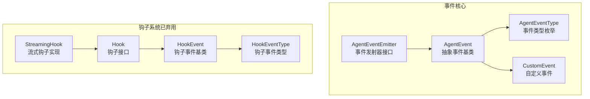
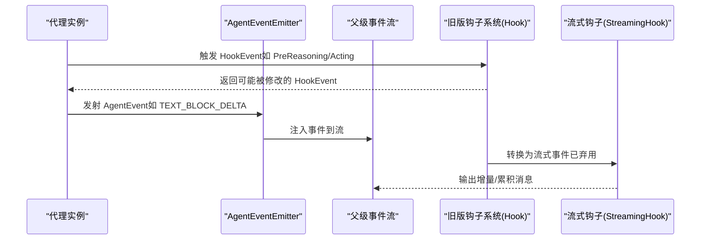
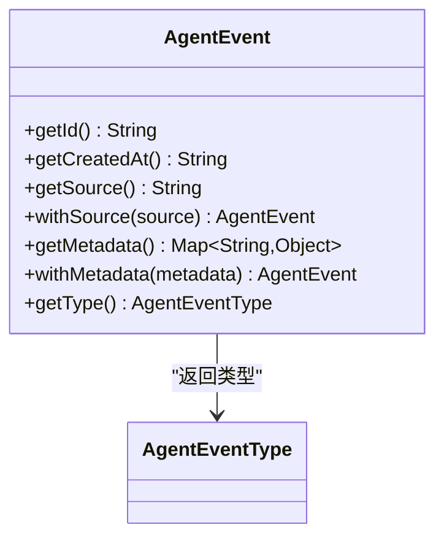
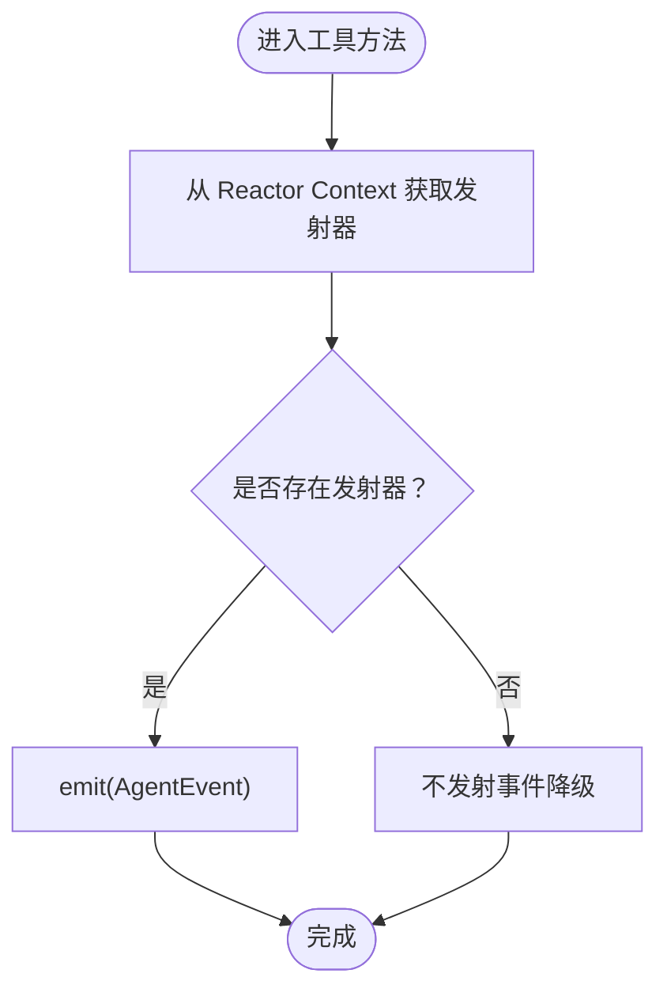
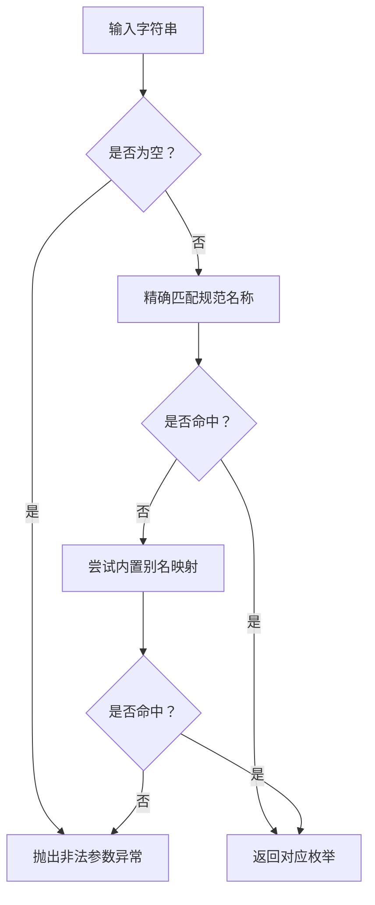
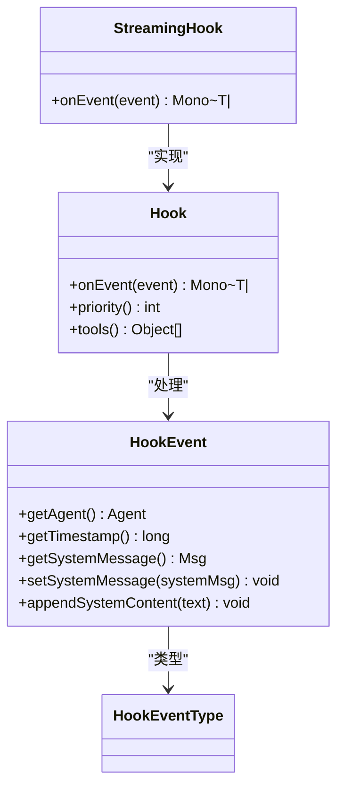
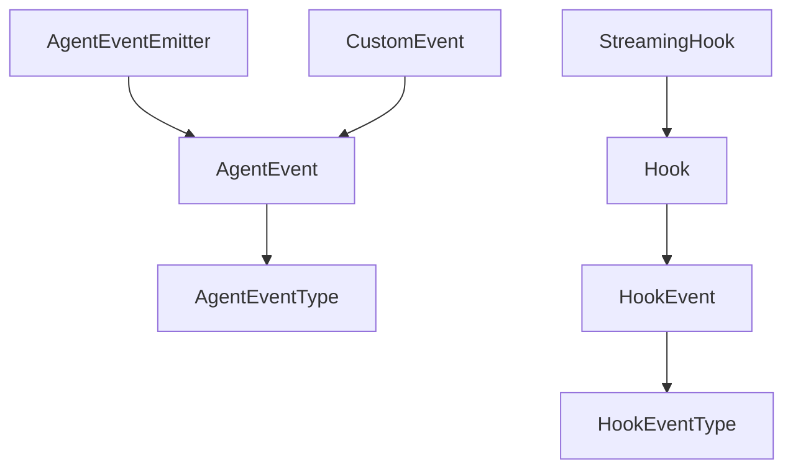

# 事件API

<cite>
**本文引用的文件**
- [AgentEvent.java](file://agentscope-core/src/main/java/io/agentscope/core/event/AgentEvent.java)
- [AgentEventEmitter.java](file://agentscope-core/src/main/java/io/agentscope/core/event/AgentEventEmitter.java)
- [AgentEventType.java](file://agentscope-core/src/main/java/io/agentscope/core/event/AgentEventType.java)
- [CustomEvent.java](file://agentscope-core/src/main/java/io/agentscope/core/event/CustomEvent.java)
- [Hook.java](file://agentscope-core/src/main/java/io/agentscope/core/hook/Hook.java)
- [HookEvent.java](file://agentscope-core/src/main/java/io/agentscope/core/hook/HookEvent.java)
- [HookEventType.java](file://agentscope-core/src/main/java/io/agentscope/core/hook/HookEventType.java)
- [StreamingHook.java](file://agentscope-core/src/main/java/io/agentscope/core/agent/StreamingHook.java)
</cite>

## 目录
1. [简介](#简介)
2. [项目结构](#项目结构)
3. [核心组件](#核心组件)
4. [架构总览](#架构总览)
5. [详细组件分析](#详细组件分析)
6. [依赖分析](#依赖分析)
7. [性能考虑](#性能考虑)
8. [故障排查指南](#故障排查指南)
9. [结论](#结论)
10. [附录](#附录)

## 简介
本文件为 AgentScope 事件系统的详细 API 参考，覆盖以下主题：
- AgentEvent 事件接口与通用属性
- AgentEventEmitter 事件发射器（在流式执行上下文中注入）
- AgentEventType 事件类型枚举及兼容性处理
- 自定义事件类型与事件处理器开发指南
- 事件生命周期、事件传播与事件监听
- 事件序列化/反序列化与事件溯源相关接口

同时，文档对已弃用的 Hook 钩子系统与 StreamingHook 流式钩子进行说明，帮助从旧版本迁移至新的中间件体系。

## 项目结构
事件系统主要位于 agentscope-core 模块的 event 与 hook 包中，并辅以 agent 包中的 StreamingHook（已弃用）用于历史兼容。

图表来源
- [AgentEvent.java:72-139](file://agentscope-core/src/main/java/io/agentscope/core/event/AgentEvent.java#L72-L139)
- [AgentEventType.java:40-137](file://agentscope-core/src/main/java/io/agentscope/core/event/AgentEventType.java#L40-L137)
- [AgentEventEmitter.java:39-98](file://agentscope-core/src/main/java/io/agentscope/core/event/AgentEventEmitter.java#L39-L98)
- [CustomEvent.java](file://agentscope-core/src/main/java/io/agentscope/core/event/CustomEvent.java)
- [Hook.java:122-192](file://agentscope-core/src/main/java/io/agentscope/core/hook/Hook.java#L122-L192)
- [HookEvent.java:77-212](file://agentscope-core/src/main/java/io/agentscope/core/hook/HookEvent.java#L77-L212)
- [HookEventType.java:29-66](file://agentscope-core/src/main/java/io/agentscope/core/hook/HookEventType.java#L29-L66)
- [StreamingHook.java:49-170](file://agentscope-core/src/main/java/io/agentscope/core/agent/StreamingHook.java#L49-L170)

章节来源
- [AgentEvent.java:1-139](file://agentscope-core/src/main/java/io/agentscope/core/event/AgentEvent.java#L1-L139)
- [AgentEventEmitter.java:1-98](file://agentscope-core/src/main/java/io/agentscope/core/event/AgentEventEmitter.java#L1-L98)
- [AgentEventType.java:1-137](file://agentscope-core/src/main/java/io/agentscope/core/event/AgentEventType.java#L1-L137)
- [CustomEvent.java](file://agentscope-core/src/main/java/io/agentscope/core/event/CustomEvent.java)
- [Hook.java:1-192](file://agentscope-core/src/main/java/io/agentscope/core/hook/Hook.java#L1-L192)
- [HookEvent.java:1-212](file://agentscope-core/src/main/java/io/agentscope/core/hook/HookEvent.java#L1-L212)
- [HookEventType.java:1-66](file://agentscope-core/src/main/java/io/agentscope/core/hook/HookEventType.java#L1-L66)
- [StreamingHook.java:1-170](file://agentscope-core/src/main/java/io/agentscope/core/agent/StreamingHook.java#L1-L170)

## 核心组件
本节概述事件系统的关键接口与职责：
- AgentEvent：所有细粒度代理事件的抽象基类，统一携带唯一标识、创建时间、来源路径与可选元数据。
- AgentEventType：事件类型枚举，支持序列化/反序列化与历史别名映射。
- AgentEventEmitter：在流式执行上下文中注入的事件发射器接口，允许工具代码向父级事件流注入事件。
- Hook/HookEvent/HookEventType：旧版钩子系统（已弃用），提供统一事件模型与优先级机制；StreamingHook 作为其内部流式适配实现。
- CustomEvent：自定义事件类型，便于扩展业务事件。

章节来源
- [AgentEvent.java:72-139](file://agentscope-core/src/main/java/io/agentscope/core/event/AgentEvent.java#L72-L139)
- [AgentEventType.java:40-137](file://agentscope-core/src/main/java/io/agentscope/core/event/AgentEventType.java#L40-L137)
- [AgentEventEmitter.java:39-98](file://agentscope-core/src/main/java/io/agentscope/core/event/AgentEventEmitter.java#L39-L98)
- [Hook.java:122-192](file://agentscope-core/src/main/java/io/agentscope/core/hook/Hook.java#L122-L192)
- [HookEvent.java:77-212](file://agentscope-core/src/main/java/io/agentscope/core/hook/HookEvent.java#L77-L212)
- [HookEventType.java:29-66](file://agentscope-core/src/main/java/io/agentscope/core/hook/HookEventType.java#L29-L66)
- [StreamingHook.java:49-170](file://agentscope-core/src/main/java/io/agentscope/core/agent/StreamingHook.java#L49-L170)
- [CustomEvent.java](file://agentscope-core/src/main/java/io/agentscope/core/event/CustomEvent.java)

## 架构总览
下图展示事件系统在运行时的交互关系：代理在执行过程中产生 AgentEvent，通过 AgentEventEmitter 注入到父级流中；旧版 Hook 系统通过 HookEvent 统一拦截与修改执行过程；StreamingHook 将旧版事件转换为流式输出。

图表来源
- [AgentEventEmitter.java:39-98](file://agentscope-core/src/main/java/io/agentscope/core/event/AgentEventEmitter.java#L39-L98)
- [Hook.java:122-192](file://agentscope-core/src/main/java/io/agentscope/core/hook/Hook.java#L122-L192)
- [StreamingHook.java:49-170](file://agentscope-core/src/main/java/io/agentscope/core/agent/StreamingHook.java#L49-L170)

## 详细组件分析

### AgentEvent 事件接口
- 基本属性
  - 唯一标识：每个事件生成时自动分配，保证全局唯一。
  - 创建时间：事件创建的时间戳字符串。
  - 来源路径：标识事件来自哪个代理层级（父子关系），用于事件溯源与转发。
  - 元数据：键值对形式的附加信息，支持链式设置。
- 类型分发
  - 使用 Jackson 的多态反序列化，通过 type 字段识别具体事件类型。
  - 内置多种细粒度事件类型（启动/结束、文本/思考/数据块、工具调用与结果、用户确认、外部执行等）。
- 方法
  - getId/getCreatedAt：获取标识与时间。
  - getSource/withSource：设置并返回来源路径，便于子代理事件转发。
  - getMetadata/withMetadata：设置并返回元数据。
  - getType：由子类实现，返回对应 AgentEventType。

图表来源
- [AgentEvent.java:72-139](file://agentscope-core/src/main/java/io/agentscope/core/event/AgentEvent.java#L72-L139)
- [AgentEventType.java:40-137](file://agentscope-core/src/main/java/io/agentscope/core/event/AgentEventType.java#L40-L137)

章节来源
- [AgentEvent.java:72-139](file://agentscope-core/src/main/java/io/agentscope/core/event/AgentEvent.java#L72-L139)

### AgentEventEmitter 事件发射器
- 上下文键
  - CONTEXT_KEY：存储在 Reactor Context 中的主发射器键。
  - FORWARDING_CONTEXT_KEY：子代理上下文中注入的转发发射器键，用于为子事件打上来源路径。
- 能力
  - emit(AgentEvent)：线程安全地将事件注入父级流。
  - fromContext(ctx)/fromForwardingContext(ctx)：从 Reactor Context 中检索发射器，若不在流式上下文则返回空。
- 使用场景
  - 工具方法在流式管道内可通过上下文获取发射器，注入自定义事件（如子代理暴露事件）。
  - 在非流式调用（call）时，上下文不存在发射器，应优雅降级。

图表来源
- [AgentEventEmitter.java:77-96](file://agentscope-core/src/main/java/io/agentscope/core/event/AgentEventEmitter.java#L77-L96)

章节来源
- [AgentEventEmitter.java:39-98](file://agentscope-core/src/main/java/io/agentscope/core/event/AgentEventEmitter.java#L39-L98)

### AgentEventType 事件类型枚举
- 语义范围
  - 代理生命周期：开始/结束/结果。
  - 推理与思考：文本块、思考块的起始/增量/结束。
  - 数据块：二进制/数据块的起始/增量/结束。
  - 工具调用与结果：起始/增量/结束与结果文本/数据增量。
  - 控制与交互：超出最大迭代、需要用户确认、请求停止、外部执行、子代理暴露、提示块、自定义事件。
- 序列化/反序列化
  - 正常序列化：输出规范名称。
  - 历史兼容：支持旧版别名映射，确保旧 JSON 负载可被正确解析。
- 解析策略
  - 优先匹配规范名称；否则尝试内置别名映射；否则抛出非法参数异常。

图表来源
- [AgentEventType.java:113-135](file://agentscope-core/src/main/java/io/agentscope/core/event/AgentEventType.java#L113-L135)

章节来源
- [AgentEventType.java:40-137](file://agentscope-core/src/main/java/io/agentscope/core/event/AgentEventType.java#L40-L137)

### 自定义事件类型与事件处理器
- 自定义事件
  - 使用 CustomEvent 表示自定义事件类型，便于扩展业务事件。
  - 在 AgentEvent 的多态注册中，CustomEvent 对应类型名为 CUSTOM。
- 开发指南
  - 定义新事件类型：在 AgentEventType 中添加新枚举值，并在 AgentEvent 的 @JsonSubTypes 中注册。
  - 实现事件类：继承 AgentEvent，实现 getType 并填充必要字段。
  - 处理器开发：在监听端根据 getType 或 Jackson 多态反序列化自动识别事件类型。
  - 元数据与来源：通过 withMetadata 与 withSource 设置元数据与来源路径，便于溯源与过滤。

章节来源
- [CustomEvent.java](file://agentscope-core/src/main/java/io/agentscope/core/event/CustomEvent.java)
- [AgentEvent.java:36-71](file://agentscope-core/src/main/java/io/agentscope/core/event/AgentEvent.java#L36-L71)
- [AgentEventType.java:89](file://agentscope-core/src/main/java/io/agentscope/core/event/AgentEventType.java#L89)

### 事件生命周期、事件传播与事件监听
- 生命周期
  - 代理启动：触发 AGENT_START。
  - 推理阶段：触发 THINKING_BLOCK_START/DELTA/END 与 TEXT_BLOCK_START/DELTA/END。
  - 工具调用：触发 TOOL_CALL_START/DELTA/END 与 TOOL_RESULT_START/TEXT_DELTA/DATA_DELTA/END。
  - 结束阶段：触发 AGENT_END/AGENT_RESULT。
  - 控制事件：如 EXCEED_MAX_ITERS、REQUIRE_USER_CONFIRM、REQUEST_STOP、EXTERNAL_EXECUTION_RESULT 等。
- 传播
  - 子代理事件通过 withSource 标记来源路径，父级流聚合后保持事件顺序与层次关系。
  - 在流式上下文中，工具可通过 AgentEventEmitter 注入自定义事件。
- 监听
  - 通过 Jackson 多态反序列化自动识别事件类型，按类型分支处理。
  - 支持基于类型过滤与路由，结合元数据实现条件监听。

章节来源
- [AgentEvent.java:36-71](file://agentscope-core/src/main/java/io/agentscope/core/event/AgentEvent.java#L36-L71)
- [AgentEventEmitter.java:67-82](file://agentscope-core/src/main/java/io/agentscope/core/event/AgentEventEmitter.java#L67-L82)

### 事件序列化、反序列化与事件溯源
- 序列化
  - 所有事件均包含 type 字段，使用 Jackson 多态派发。
  - 事件类型采用规范名称序列化，避免歧义。
- 反序列化
  - 支持历史别名映射，兼容旧版本 JSON。
  - 解析失败时抛出非法参数异常，便于定位问题。
- 事件溯源
  - 通过 source 字段记录事件来源路径，结合 id 与 createdAt 实现端到端追踪。
  - 元数据可用于附加上下文信息（如会话 ID、任务 ID 等）。

章节来源
- [AgentEvent.java:35-71](file://agentscope-core/src/main/java/io/agentscope/core/event/AgentEvent.java#L35-L71)
- [AgentEventType.java:113-135](file://agentscope-core/src/main/java/io/agentscope/core/event/AgentEventType.java#L113-L135)
- [AgentEvent.java:106-132](file://agentscope-core/src/main/java/io/agentscope/core/event/AgentEvent.java#L106-L132)

### Hook 钩子系统与 StreamingHook 流式钩子（已弃用）
- Hook 接口
  - onEvent：统一接收所有 HookEvent，支持模式匹配与修改（取决于事件是否提供 setter）。
  - priority：钩子优先级（数值越小优先级越高），同优先级按注册顺序执行。
  - tools：可选注册工具集。
- HookEvent/HookEventType
  - 提供统一的系统消息管理（systemMsg）与时间戳、代理上下文访问。
  - 事件类型涵盖预处理、推理、行动、摘要与错误等阶段。
- StreamingHook
  - 将旧版 HookEvent 转换为流式事件，支持增量/累积两种模式。
  - 已弃用，推荐使用新的中间件体系与 AgentEventEmitter 进行事件流控制。

图表来源
- [Hook.java:122-192](file://agentscope-core/src/main/java/io/agentscope/core/hook/Hook.java#L122-L192)
- [HookEvent.java:77-212](file://agentscope-core/src/main/java/io/agentscope/core/hook/HookEvent.java#L77-L212)
- [HookEventType.java:29-66](file://agentscope-core/src/main/java/io/agentscope/core/hook/HookEventType.java#L29-L66)
- [StreamingHook.java:49-170](file://agentscope-core/src/main/java/io/agentscope/core/agent/StreamingHook.java#L49-L170)

章节来源
- [Hook.java:122-192](file://agentscope-core/src/main/java/io/agentscope/core/hook/Hook.java#L122-L192)
- [HookEvent.java:77-212](file://agentscope-core/src/main/java/io/agentscope/core/hook/HookEvent.java#L77-L212)
- [HookEventType.java:29-66](file://agentscope-core/src/main/java/io/agentscope/core/hook/HookEventType.java#L29-L66)
- [StreamingHook.java:49-170](file://agentscope-core/src/main/java/io/agentscope/core/agent/StreamingHook.java#L49-L170)

## 依赖分析
事件系统与钩子系统的依赖关系如下：

图表来源
- [AgentEvent.java:72-139](file://agentscope-core/src/main/java/io/agentscope/core/event/AgentEvent.java#L72-L139)
- [AgentEventType.java:40-137](file://agentscope-core/src/main/java/io/agentscope/core/event/AgentEventType.java#L40-L137)
- [AgentEventEmitter.java:39-98](file://agentscope-core/src/main/java/io/agentscope/core/event/AgentEventEmitter.java#L39-L98)
- [CustomEvent.java](file://agentscope-core/src/main/java/io/agentscope/core/event/CustomEvent.java)
- [Hook.java:122-192](file://agentscope-core/src/main/java/io/agentscope/core/hook/Hook.java#L122-L192)
- [HookEvent.java:77-212](file://agentscope-core/src/main/java/io/agentscope/core/hook/HookEvent.java#L77-L212)
- [HookEventType.java:29-66](file://agentscope-core/src/main/java/io/agentscope/core/hook/HookEventType.java#L29-L66)
- [StreamingHook.java:49-170](file://agentscope-core/src/main/java/io/agentscope/core/agent/StreamingHook.java#L49-L170)

章节来源
- [AgentEvent.java:72-139](file://agentscope-core/src/main/java/io/agentscope/core/event/AgentEvent.java#L72-L139)
- [AgentEventEmitter.java:39-98](file://agentscope-core/src/main/java/io/agentscope/core/event/AgentEventEmitter.java#L39-L98)
- [AgentEventType.java:40-137](file://agentscope-core/src/main/java/io/agentscope/core/event/AgentEventType.java#L40-L137)
- [CustomEvent.java](file://agentscope-core/src/main/java/io/agentscope/core/event/CustomEvent.java)
- [Hook.java:122-192](file://agentscope-core/src/main/java/io/agentscope/core/hook/Hook.java#L122-L192)
- [HookEvent.java:77-212](file://agentscope-core/src/main/java/io/agentscope/core/hook/HookEvent.java#L77-L212)
- [HookEventType.java:29-66](file://agentscope-core/src/main/java/io/agentscope/core/hook/HookEventType.java#L29-L66)
- [StreamingHook.java:49-170](file://agentscope-core/src/main/java/io/agentscope/core/agent/StreamingHook.java#L49-L170)

## 性能考虑
- 线程安全：事件发射器的 emit 方法可在任意线程调用，底层实现保证线程安全。
- 序列化开销：事件类型使用短字符串标识，Jackson 多态派发成本可控；建议在高并发场景避免过度嵌套元数据。
- 事件溯源：来源路径与元数据会增加序列化体积，建议仅保留必要字段。
- 钩子系统（已弃用）：StreamingHook 会进行内容合并与增量计算，注意在大流量场景下的内存占用。

## 故障排查指南
- 事件类型解析失败
  - 现象：反序列化抛出非法参数异常。
  - 排查：检查 type 字段是否为规范名称或受支持的历史别名；确认自定义事件已在多态注册中声明。
- 上下文缺失导致无法发射事件
  - 现象：fromContext 返回空，工具方法未发出事件。
  - 排查：确认当前执行处于流式上下文；若为非流式调用，需降级处理。
- 系统消息注入冲突
  - 现象：直接向输入消息列表注入 SYSTEM 角色消息导致异常。
  - 排查：改用 HookEvent 提供的系统消息管理方法（设置或追加内容块）。

章节来源
- [AgentEventType.java:113-135](file://agentscope-core/src/main/java/io/agentscope/core/event/AgentEventType.java#L113-L135)
- [AgentEventEmitter.java:77-96](file://agentscope-core/src/main/java/io/agentscope/core/event/AgentEventEmitter.java#L77-L96)
- [HookEvent.java:168-210](file://agentscope-core/src/main/java/io/agentscope/core/hook/HookEvent.java#L168-L210)

## 结论
AgentScope 事件系统通过统一的 AgentEvent 抽象与 AgentEventType 枚举，提供了细粒度、可扩展且具备历史兼容性的事件模型。配合 AgentEventEmitter，可在流式执行上下文中灵活注入事件，满足事件溯源与实时监听需求。旧版 Hook 与 StreamingHook 已标记弃用，建议迁移到新的中间件体系以获得更清晰的职责分离与更好的可维护性。

## 附录
- 最佳实践
  - 事件命名：遵循规范名称，避免使用历史别名。
  - 元数据设计：最小化冗余，集中管理与校验。
  - 来源路径：始终使用 withSource 标记子代理事件，便于回溯。
  - 自定义事件：在 AgentEvent 的多态注册中声明类型映射，确保序列化/反序列化一致。