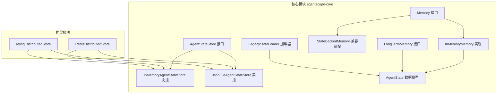
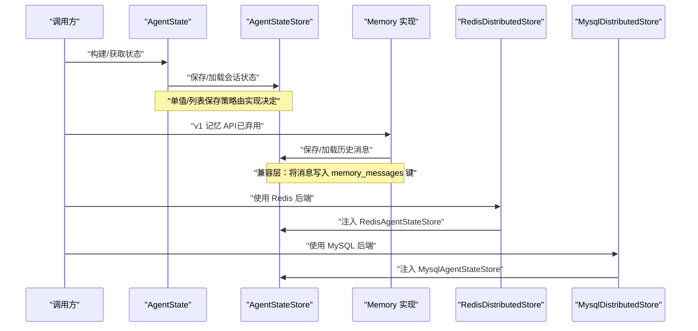
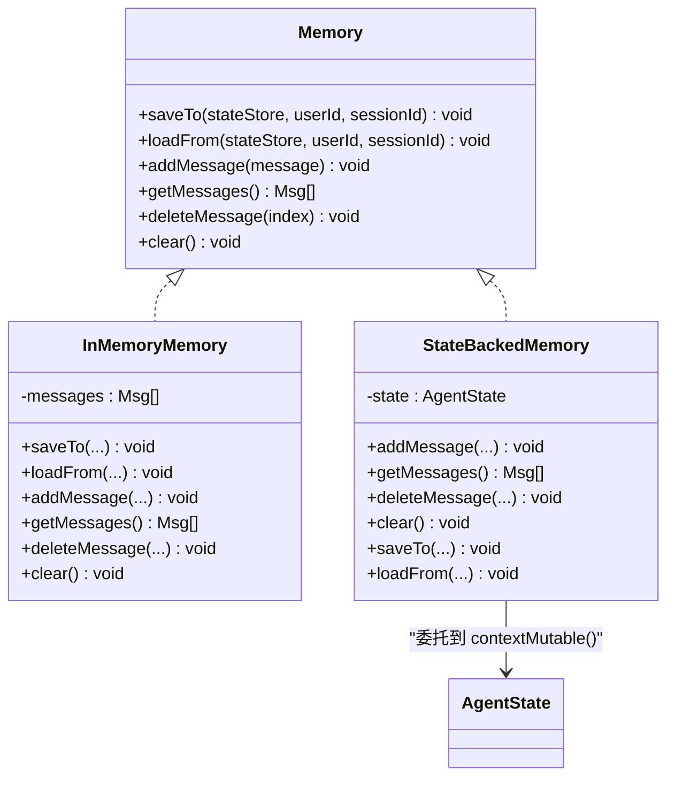
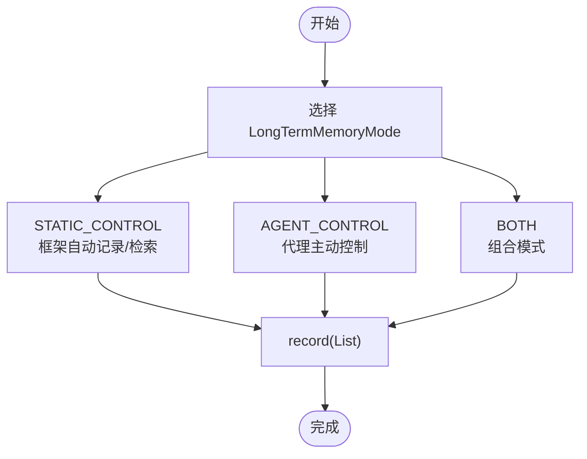
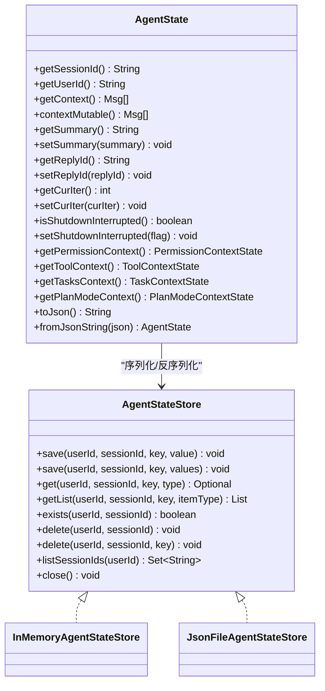
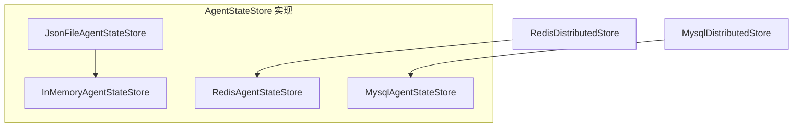
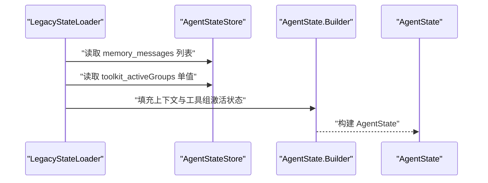
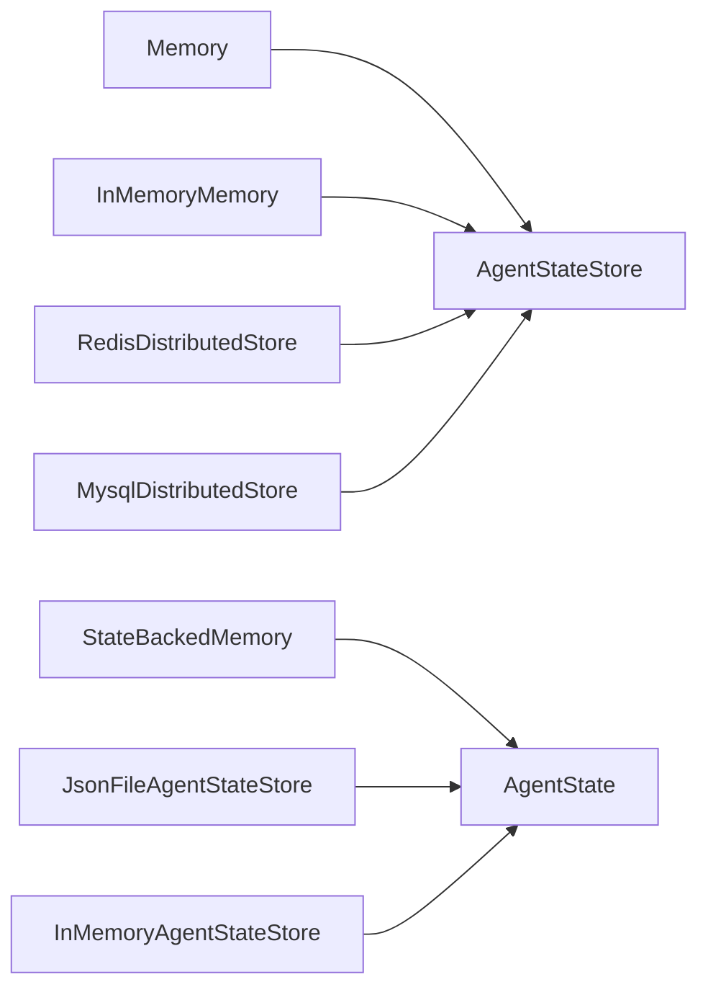

# 内存API

<cite>
**本文引用的文件**
- [Memory.java](file://agentscope-core/src/main/java/io/agentscope/core/memory/Memory.java)
- [InMemoryMemory.java](file://agentscope-core/src/main/java/io/agentscope/core/memory/InMemoryMemory.java)
- [LongTermMemory.java](file://agentscope-core/src/main/java/io/agentscope/core/memory/LongTermMemory.java)
- [StateBackedMemory.java](file://agentscope-core/src/main/java/io/agentscope/core/memory/StateBackedMemory.java)
- [LongTermMemoryMode.java](file://agentscope-core/src/main/java/io/agentscope/core/memory/LongTermMemoryMode.java)
- [AgentState.java](file://agentscope-core/src/main/java/io/agentscope/core/state/AgentState.java)
- [AgentStateStore.java](file://agentscope-core/src/main/java/io/agentscope/core/state/AgentStateStore.java)
- [InMemoryAgentStateStore.java](file://agentscope-core/src/main/java/io/agentscope/core/state/InMemoryAgentStateStore.java)
- [JsonFileAgentStateStore.java](file://agentscope-core/src/main/java/io/agentscope/core/state/JsonFileAgentStateStore.java)
- [LegacyStateLoader.java](file://agentscope-core/src/main/java/io/agentscope/core/state/LegacyStateLoader.java)
- [RedisDistributedStore.java](file://agentscope-extensions/agentscope-extensions-redis/src/main/java/io/agentscope/extensions/redis/RedisDistributedStore.java)
- [MysqlDistributedStore.java](file://agentscope-extensions/agentscope-extensions-mysql/src/main/java/io/agentscope/extensions/mysql/MysqlDistributedStore.java)
</cite>

## 目录
1. [简介](#简介)
2. [项目结构](#项目结构)
3. [核心组件](#核心组件)
4. [架构总览](#架构总览)
5. [详细组件分析](#详细组件分析)
6. [依赖分析](#依赖分析)
7. [性能考虑](#性能考虑)
8. [故障排查指南](#故障排查指南)
9. [结论](#结论)
10. [附录](#附录)

## 简介
本文件为 AgentScope 内存管理系统的完整 API 参考文档，覆盖以下主题：
- Memory 接口与 InMemoryMemory 实现：面向 v1 的对话历史记忆 API，以及与 AgentState 的兼容适配。
- 长期记忆 LongTermMemory：v1 中跨会话的记忆能力，现已弃用，保留用于兼容。
- AgentState 与 AgentStateStore：v2 的状态管理模型，包括会话持久化、状态恢复与并发安全。
- 存储后端差异：内存、JSON 文件、Redis、MySQL 等后端的 API 行为与特性对比。
- 内存清理、压缩与性能优化：基于现有实现的建议与接口使用要点。

## 项目结构
围绕内存与状态管理的核心代码位于 agentscope-core 模块的 memory 与 state 包中，并通过扩展模块提供 Redis 与 MySQL 的分布式存储集成。

**图表来源**
- [Memory.java:35-79](file://agentscope-core/src/main/java/io/agentscope/core/memory/Memory.java#L35-L79)
- [InMemoryMemory.java:37-135](file://agentscope-core/src/main/java/io/agentscope/core/memory/InMemoryMemory.java#L37-L135)
- [LongTermMemory.java:71-112](file://agentscope-core/src/main/java/io/agentscope/core/memory/LongTermMemory.java#L71-L112)
- [StateBackedMemory.java:36-80](file://agentscope-core/src/main/java/io/agentscope/core/memory/StateBackedMemory.java#L36-L80)
- [AgentStateStore.java:61-167](file://agentscope-core/src/main/java/io/agentscope/core/state/AgentStateStore.java#L61-L167)
- [InMemoryAgentStateStore.java:46-195](file://agentscope-core/src/main/java/io/agentscope/core/state/InMemoryAgentStateStore.java#L46-L195)
- [JsonFileAgentStateStore.java:66-397](file://agentscope-core/src/main/java/io/agentscope/core/state/JsonFileAgentStateStore.java#L66-L397)
- [AgentState.java:59-424](file://agentscope-core/src/main/java/io/agentscope/core/state/AgentState.java#L59-L424)
- [LegacyStateLoader.java:30-68](file://agentscope-core/src/main/java/io/agentscope/core/state/LegacyStateLoader.java#L30-L68)
- [RedisDistributedStore.java:56-110](file://agentscope-extensions/agentscope-extensions-redis/src/main/java/io/agentscope/extensions/redis/RedisDistributedStore.java#L56-L110)
- [MysqlDistributedStore.java:54-92](file://agentscope-extensions/agentscope-extensions-mysql/src/main/java/io/agentscope/extensions/mysql/MysqlDistributedStore.java#L54-L92)

**章节来源**
- [Memory.java:35-79](file://agentscope-core/src/main/java/io/agentscope/core/memory/Memory.java#L35-L79)
- [AgentStateStore.java:61-167](file://agentscope-core/src/main/java/io/agentscope/core/state/AgentStateStore.java#L61-L167)

## 核心组件
- Memory 接口：定义 v1 对话历史记忆的保存/加载、消息增删查清等操作；已弃用，仅保留写入镜像以兼容旧版。
- InMemoryMemory：线程安全的内存实现，支持与 AgentStateStore 的序列化/反序列化。
- LongTermMemory 接口：定义长期记忆的记录与检索（Mono 异步），已弃用。
- StateBackedMemory：将 Memory 调用委托到 AgentState.contextMutable()，保持向后兼容。
- AgentState：v2 的会话运行时状态，包含上下文缓冲、摘要、权限/工具/任务/计划模式上下文等。
- AgentStateStore 接口：统一的状态持久化抽象，支持单值与列表两种存储策略。
- InMemoryAgentStateStore：内存态实现，适合单进程、非分布式场景。
- JsonFileAgentStateStore：文件系统实现，支持增量追加与哈希校验，保证列表写入的原子性与一致性。
- LegacyStateLoader：从 v1 会话键迁移数据到 AgentState 的工具类。

**章节来源**
- [InMemoryMemory.java:37-135](file://agentscope-core/src/main/java/io/agentscope/core/memory/InMemoryMemory.java#L37-L135)
- [StateBackedMemory.java:36-80](file://agentscope-core/src/main/java/io/agentscope/core/memory/StateBackedMemory.java#L36-L80)
- [AgentState.java:59-424](file://agentscope-core/src/main/java/io/agentscope/core/state/AgentState.java#L59-L424)
- [AgentStateStore.java:61-167](file://agentscope-core/src/main/java/io/agentscope/core/state/AgentStateStore.java#L61-L167)
- [InMemoryAgentStateStore.java:46-195](file://agentscope-core/src/main/java/io/agentscope/core/state/InMemoryAgentStateStore.java#L46-L195)
- [JsonFileAgentStateStore.java:66-397](file://agentscope-core/src/main/java/io/agentscope/core/state/JsonFileAgentStateStore.java#L66-L397)
- [LegacyStateLoader.java:30-68](file://agentscope-core/src/main/java/io/agentscope/core/state/LegacyStateLoader.java#L30-L68)

## 架构总览
下图展示 v2 状态模型与 v1 记忆接口的关系，以及存储后端的可插拔性。

**图表来源**
- [AgentState.java:59-424](file://agentscope-core/src/main/java/io/agentscope/core/state/AgentState.java#L59-L424)
- [AgentStateStore.java:61-167](file://agentscope-core/src/main/java/io/agentscope/core/state/AgentStateStore.java#L61-L167)
- [Memory.java:35-79](file://agentscope-core/src/main/java/io/agentscope/core/memory/Memory.java#L35-L79)
- [RedisDistributedStore.java:56-110](file://agentscope-extensions/agentscope-extensions-redis/src/main/java/io/agentscope/extensions/redis/RedisDistributedStore.java#L56-L110)
- [MysqlDistributedStore.java:54-92](file://agentscope-extensions/agentscope-extensions-mysql/src/main/java/io/agentscope/extensions/mysql/MysqlDistributedStore.java#L54-L92)

## 详细组件分析

### Memory 接口与 InMemoryMemory 实现
- 设计目标：为 v1 提供统一的记忆接口，支持消息的添加、查询、删除与清空，并提供与 AgentStateStore 的双向持久化能力。
- 线程安全：内部使用并发安全集合，确保多线程环境下的读写一致性。
- 兼容性：保留 saveTo/loadFrom 以兼容 v1 会话键 memory_messages；新代码应直接使用 AgentState。

**图表来源**
- [Memory.java:35-79](file://agentscope-core/src/main/java/io/agentscope/core/memory/Memory.java#L35-L79)
- [InMemoryMemory.java:37-135](file://agentscope-core/src/main/java/io/agentscope/core/memory/InMemoryMemory.java#L37-L135)
- [StateBackedMemory.java:36-80](file://agentscope-core/src/main/java/io/agentscope/core/memory/StateBackedMemory.java#L36-L80)

**章节来源**
- [Memory.java:35-79](file://agentscope-core/src/main/java/io/agentscope/core/memory/Memory.java#L35-L79)
- [InMemoryMemory.java:37-135](file://agentscope-core/src/main/java/io/agentscope/core/memory/InMemoryMemory.java#L37-L135)
- [StateBackedMemory.java:36-80](file://agentscope-core/src/main/java/io/agentscope/core/memory/StateBackedMemory.java#L36-L80)

### 长期记忆 LongTermMemory（已弃用）
- 设计目标：提供跨会话的记忆能力，支持记录与检索。
- 使用方式：通过 LongTermMemoryMode 控制框架自动管理或代理控制。
- 现状：已在 v2 移除，建议在应用层自行处理跨会话持久化。

**图表来源**
- [LongTermMemory.java:71-112](file://agentscope-core/src/main/java/io/agentscope/core/memory/LongTermMemory.java#L71-L112)
- [LongTermMemoryMode.java:54-71](file://agentscope-core/src/main/java/io/agentscope/core/memory/LongTermMemoryMode.java#L54-L71)

**章节来源**
- [LongTermMemory.java:71-112](file://agentscope-core/src/main/java/io/agentscope/core/memory/LongTermMemory.java#L71-L112)
- [LongTermMemoryMode.java:54-71](file://agentscope-core/src/main/java/io/agentscope/core/memory/LongTermMemoryMode.java#L54-L71)

### AgentState 与 AgentStateStore
- AgentState：不可变数据模型，提供会话标识、用户标识、上下文缓冲、摘要、迭代计数、中断信号、权限/工具/任务/计划上下文等字段；支持 JSON 序列化/反序列化。
- AgentStateStore：统一的状态持久化接口，支持单值与列表两类存储；具体行为由实现决定（如增量追加 vs 全量替换）。

**图表来源**
- [AgentState.java:59-424](file://agentscope-core/src/main/java/io/agentscope/core/state/AgentState.java#L59-L424)
- [AgentStateStore.java:61-167](file://agentscope-core/src/main/java/io/agentscope/core/state/AgentStateStore.java#L61-L167)
- [InMemoryAgentStateStore.java:46-195](file://agentscope-core/src/main/java/io/agentscope/core/state/InMemoryAgentStateStore.java#L46-L195)
- [JsonFileAgentStateStore.java:66-397](file://agentscope-core/src/main/java/io/agentscope/core/state/JsonFileAgentStateStore.java#L66-L397)

**章节来源**
- [AgentState.java:59-424](file://agentscope-core/src/main/java/io/agentscope/core/state/AgentState.java#L59-L424)
- [AgentStateStore.java:61-167](file://agentscope-core/src/main/java/io/agentscope/core/state/AgentStateStore.java#L61-L167)
- [InMemoryAgentStateStore.java:46-195](file://agentscope-core/src/main/java/io/agentscope/core/state/InMemoryAgentStateStore.java#L46-L195)
- [JsonFileAgentStateStore.java:66-397](file://agentscope-core/src/main/java/io/agentscope/core/state/JsonFileAgentStateStore.java#L66-L397)

### 存储后端差异与集成
- 内存态（InMemoryAgentStateStore）：线程安全，适合单进程测试/开发；重启即丢失。
- 文件态（JsonFileAgentStateStore）：原子写入、UTF-8、增量追加与哈希校验，适合本地持久化。
- Redis（RedisDistributedStore）：通过 RedisAgentStateStore 提供分布式会话状态；可与工作区 KV、沙箱快照/锁协同。
- MySQL（MysqlDistributedStore）：通过 MysqlAgentStateStore 提供关系型持久化；可与工作区 JDBC KV、沙箱快照/锁协同。

**图表来源**
- [InMemoryAgentStateStore.java:46-195](file://agentscope-core/src/main/java/io/agentscope/core/state/InMemoryAgentStateStore.java#L46-L195)
- [JsonFileAgentStateStore.java:66-397](file://agentscope-core/src/main/java/io/agentscope/core/state/JsonFileAgentStateStore.java#L66-L397)
- [RedisDistributedStore.java:56-110](file://agentscope-extensions/agentscope-extensions-redis/src/main/java/io/agentscope/extensions/redis/RedisDistributedStore.java#L56-L110)
- [MysqlDistributedStore.java:54-92](file://agentscope-extensions/agentscope-extensions-mysql/src/main/java/io/agentscope/extensions/mysql/MysqlDistributedStore.java#L54-L92)

**章节来源**
- [RedisDistributedStore.java:56-110](file://agentscope-extensions/agentscope-extensions-redis/src/main/java/io/agentscope/extensions/redis/RedisDistributedStore.java#L56-L110)
- [MysqlDistributedStore.java:54-92](file://agentscope-extensions/agentscope-extensions-mysql/src/main/java/io/agentscope/extensions/mysql/MysqlDistributedStore.java#L54-L92)

### 状态恢复与迁移
- LegacyStateLoader：从 v1 会话键 memory_messages 与 toolkit_activeGroups 迁移到 AgentState。
- 建议流程：启动时检测是否存在 v1 数据，若存在则使用 LegacyStateLoader 构建 AgentState，随后按需保存为新格式。

**图表来源**
- [LegacyStateLoader.java:30-68](file://agentscope-core/src/main/java/io/agentscope/core/state/LegacyStateLoader.java#L30-L68)
- [AgentState.java:59-424](file://agentscope-core/src/main/java/io/agentscope/core/state/AgentState.java#L59-L424)

**章节来源**
- [LegacyStateLoader.java:30-68](file://agentscope-core/src/main/java/io/agentscope/core/state/LegacyStateLoader.java#L30-L68)

## 依赖分析
- 组件耦合
  - Memory 与 AgentStateStore：InMemoryMemory 通过 saveTo/loadFrom 与状态存储交互，实现 v1 会话键的持久化。
  - StateBackedMemory：完全委托给 AgentState.contextMutable()，避免重复存储。
  - AgentStateStore 的实现（InMemoryAgentStateStore、JsonFileAgentStateStore）对上层透明，便于切换后端。
- 外部依赖
  - RedisDistributedStore 与 MysqlDistributedStore 将 AgentStateStore 与其他分布式能力（KV、快照、执行守卫）整合。

**图表来源**
- [Memory.java:35-79](file://agentscope-core/src/main/java/io/agentscope/core/memory/Memory.java#L35-L79)
- [InMemoryMemory.java:37-135](file://agentscope-core/src/main/java/io/agentscope/core/memory/InMemoryMemory.java#L37-L135)
- [StateBackedMemory.java:36-80](file://agentscope-core/src/main/java/io/agentscope/core/memory/StateBackedMemory.java#L36-L80)
- [AgentStateStore.java:61-167](file://agentscope-core/src/main/java/io/agentscope/core/state/AgentStateStore.java#L61-L167)
- [RedisDistributedStore.java:56-110](file://agentscope-extensions/agentscope-extensions-redis/src/main/java/io/agentscope/extensions/redis/RedisDistributedStore.java#L56-L110)
- [MysqlDistributedStore.java:54-92](file://agentscope-extensions/agentscope-extensions-mysql/src/main/java/io/agentscope/extensions/mysql/MysqlDistributedStore.java#L54-L92)

**章节来源**
- [AgentStateStore.java:61-167](file://agentscope-core/src/main/java/io/agentscope/core/state/AgentStateStore.java#L61-L167)

## 性能考虑
- 列表写入策略
  - InMemoryAgentStateStore：全量替换，适合小规模、频繁更新的场景。
  - JsonFileAgentStateStore：基于哈希判断是否需要全量重写，否则增量追加，减少磁盘 IO。
- 并发与线程安全
  - InMemoryAgentStateStore 使用并发容器，适合高并发读写。
  - InMemoryMemory 使用 CopyOnWriteArrayList，读多写少场景更友好。
- I/O 与原子性
  - JsonFileAgentStateStore 采用临时文件 + 原子移动，避免部分写入导致的数据损坏。
- 分布式一致性
  - Redis/MySQL 后端由各自客户端/连接池负责并发与事务，需结合业务场景合理设置超时与重试。

[本节为通用指导，不直接分析具体文件]

## 故障排查指南
- 会话键不匹配
  - v1 会话键：memory_messages、toolkit_activeGroups；v2 建议直接使用 AgentState。
  - 若仍需兼容，确认 InMemoryMemory.saveTo/loadFrom 的键前缀与 LegacyStateLoader 的读取一致。
- 文件系统异常
  - JsonFileAgentStateStore 在保存/加载失败时抛出运行时异常，检查根目录权限与磁盘空间。
- 列表状态未更新
  - 确认 save(List) 是否触发增量追加或全量重写；必要时检查 .hash 文件与行数统计逻辑。
- 清理与回收
  - 使用 JsonFileAgentStateStore.clearAllSessions() 或相应后端的批量删除接口进行清理。
- 并发冲突
  - 多线程环境下优先使用 AgentState.contextMutable() 的线程安全集合；避免外部直接修改共享列表。

**章节来源**
- [JsonFileAgentStateStore.java:66-397](file://agentscope-core/src/main/java/io/agentscope/core/state/JsonFileAgentStateStore.java#L66-L397)
- [InMemoryAgentStateStore.java:46-195](file://agentscope-core/src/main/java/io/agentscope/core/state/InMemoryAgentStateStore.java#L46-L195)
- [InMemoryMemory.java:37-135](file://agentscope-core/src/main/java/io/agentscope/core/memory/InMemoryMemory.java#L37-L135)

## 结论
- v2 推荐使用 AgentState 作为会话状态载体，配合 AgentStateStore 实现灵活的持久化与恢复。
- v1 的 Memory/LongTermMemory 已弃用，迁移至应用层或自定义后端实现跨会话持久化。
- 不同存储后端在性能、可靠性与运维复杂度上各有侧重，应根据部署环境与数据特征选择。

[本节为总结性内容，不直接分析具体文件]

## 附录

### API 规范速查（v2）
- AgentState
  - 关键字段：sessionId、userId、context（只读视图与可变句柄）、summary、replyId、curIter、shutdownInterrupted、权限/工具/任务/计划上下文。
  - 方法：toJson/fromJsonString、contextMutable、各字段 getter/setter。
- AgentStateStore
  - 单值：save/get
  - 列表：save/getList
  - 生命周期：exists/delete/delete(key)/listSessionIds/close
- InMemoryAgentStateStore / JsonFileAgentStateStore
  - InMemoryAgentStateStore：线程安全、内存态、重启丢失。
  - JsonFileAgentStateStore：原子写入、UTF-8、增量追加、哈希校验、批量清理。

**章节来源**
- [AgentState.java:59-424](file://agentscope-core/src/main/java/io/agentscope/core/state/AgentState.java#L59-L424)
- [AgentStateStore.java:61-167](file://agentscope-core/src/main/java/io/agentscope/core/state/AgentStateStore.java#L61-L167)
- [InMemoryAgentStateStore.java:46-195](file://agentscope-core/src/main/java/io/agentscope/core/state/InMemoryAgentStateStore.java#L46-L195)
- [JsonFileAgentStateStore.java:66-397](file://agentscope-core/src/main/java/io/agentscope/core/state/JsonFileAgentStateStore.java#L66-L397)