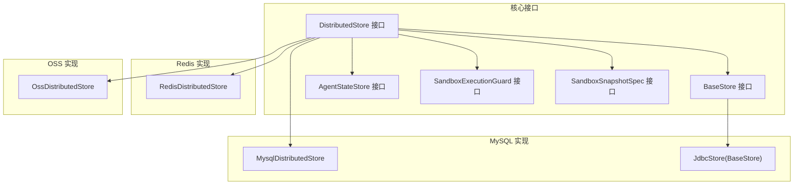
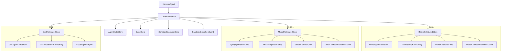
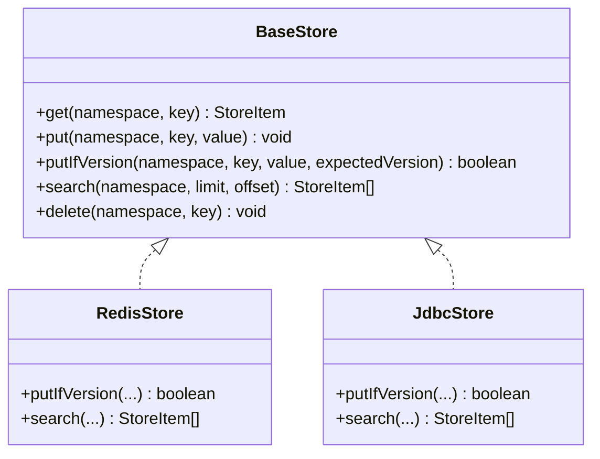
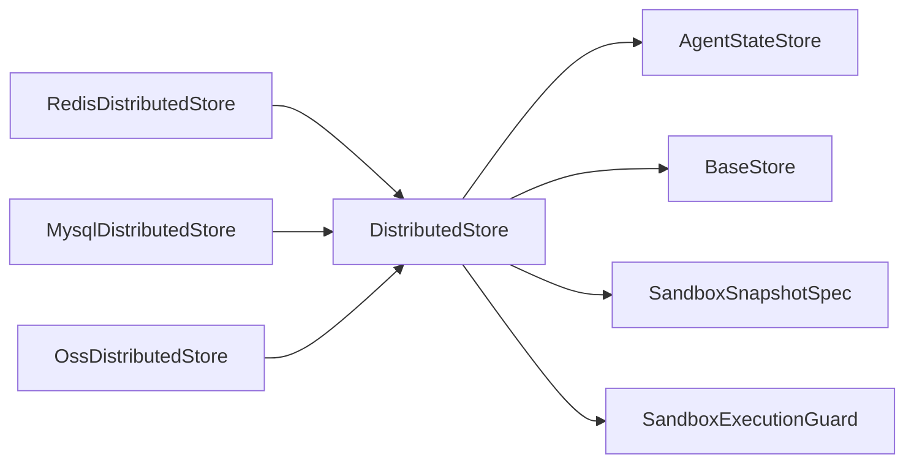

# 内存存储后端

<cite>
**本文引用的文件**
- [RedisDistributedStore.java](file://agentscope-extensions/agentscope-extensions-redis/src/main/java/io/agentscope/extensions/redis/RedisDistributedStore.java)
- [MysqlDistributedStore.java](file://agentscope-extensions/agentscope-extensions-mysql/src/main/java/io/agentscope/extensions/mysql/MysqlDistributedStore.java)
- [OssDistributedStore.java](file://agentscope-extensions/agentscope-extensions-oss/src/main/java/io/agentscope/extensions/oss/OssDistributedStore.java)
- [DistributedStore.java](file://agentscope-harness/src/main/java/io/agentscope/harness/agent/DistributedStore.java)
- [BaseStore.java](file://agentscope-harness/src/main/java/io/agentscope/harness/agent/filesystem/remote/store/BaseStore.java)
- [AgentStateStore.java](file://agentscope-core/src/main/java/io/agentscope/core/state/AgentStateStore.java)
- [JdbcStore.java](file://agentscope-extensions/agentscope-extensions-mysql/src/main/java/io/agentscope/extensions/mysql/store/JdbcStore.java)
- [going-to-production.md](file://docs/v2/zh/docs/others/going-to-production.md)
- [SandboxExecutionGuard.java](file://agentscope-harness/src/main/java/io/agentscope/harness/agent/sandbox/SandboxExecutionGuard.java)
- [SandboxSnapshotSpec.java](file://agentscope-harness/src/main/java/io/agentscope/harness/agent/sandbox/snapshot/SandboxSnapshotSpec.java)
</cite>

## 目录
1. [简介](#简介)
2. [项目结构](#项目结构)
3. [核心组件](#核心组件)
4. [架构总览](#架构总览)
5. [详细组件分析](#详细组件分析)
6. [依赖分析](#依赖分析)
7. [性能考量](#性能考量)
8. [故障排查指南](#故障排查指南)
9. [结论](#结论)
10. [附录](#附录)

## 简介
本文件为 AgentScope 内存存储后端的综合 API 参考文档，聚焦于 Redis、MySQL、OSS 等分布式存储后端的 API 差异与使用方式。内容涵盖：
- 各存储后端的配置参数与连接管理
- 事务与并发控制能力
- 性能特性、容量限制与扩展性
- 存储后端切换、迁移与备份的 API 规范
- 错误处理、重试机制与监控指标
- 不同场景下的后端选择建议与最佳实践

## 项目结构
AgentScope 将“分布式存储”抽象为统一的 DistributedStore 接口，具体实现分别由 Redis、MySQL、OSS 扩展模块提供。BaseStore 作为远程工作区文件系统的小型键值存储后端，AgentStateStore 负责会话状态持久化，SandboxExecutionGuard 提供沙箱执行的分布式互斥，SandboxSnapshotSpec 负责沙箱快照持久化。

图示来源
- [DistributedStore.java:69-121](file://agentscope-harness/src/main/java/io/agentscope/harness/agent/DistributedStore.java#L69-L121)
- [BaseStore.java:27-96](file://agentscope-harness/src/main/java/io/agentscope/harness/agent/filesystem/remote/store/BaseStore.java#L27-L96)
- [AgentStateStore.java:22-60](file://agentscope-core/src/main/java/io/agentscope/core/state/AgentStateStore.java#L22-L60)
- [RedisDistributedStore.java:56-109](file://agentscope-extensions/agentscope-extensions-redis/src/main/java/io/agentscope/extensions/redis/RedisDistributedStore.java#L56-L109)
- [MysqlDistributedStore.java:54-91](file://agentscope-extensions/agentscope-extensions-mysql/src/main/java/io/agentscope/extensions/mysql/MysqlDistributedStore.java#L54-L91)
- [OssDistributedStore.java:39-85](file://agentscope-extensions/agentscope-extensions-oss/src/main/java/io/agentscope/extensions/oss/OssDistributedStore.java#L39-L85)
- [JdbcStore.java:74-117](file://agentscope-extensions/agentscope-extensions-mysql/src/main/java/io/agentscope/extensions/mysql/store/JdbcStore.java#L74-L117)

章节来源
- [DistributedStore.java:28-68](file://agentscope-harness/src/main/java/io/agentscope/harness/agent/DistributedStore.java#L28-L68)
- [BaseStore.java:27-96](file://agentscope-harness/src/main/java/io/agentscope/harness/agent/filesystem/remote/store/BaseStore.java#L27-L96)
- [AgentStateStore.java:22-60](file://agentscope-core/src/main/java/io/agentscope/core/state/AgentStateStore.java#L22-L60)

## 核心组件
- DistributedStore：统一装配 AgentStateStore、BaseStore、SandboxSnapshotSpec、SandboxExecutionGuard 的入口。可由 Redis/Mysql/OSS 实现类提供，或通过 Builder 组合不同后端。
- BaseStore：面向远程工作区文件系统的键值存储，支持 get/put/putIfVersion/search/delete 等操作，其中 putIfVersion 提供 CAS 保障。
- AgentStateStore：面向会话状态的持久化接口，提供保存、读取、删除、列表等方法。
- SandboxExecutionGuard：沙箱执行的分布式互斥接口，默认空实现，Redis/MySQL 实现提供基于 SET NX PX 或 GET_LOCK 的分布式锁。
- SandboxSnapshotSpec：沙箱快照持久化的规范，OSS/MySQL 实现可将大对象（如容器工作区压缩包）持久化到对象存储或数据库 BLOB。

章节来源
- [DistributedStore.java:69-121](file://agentscope-harness/src/main/java/io/agentscope/harness/agent/DistributedStore.java#L69-L121)
- [BaseStore.java:27-96](file://agentscope-harness/src/main/java/io/agentscope/harness/agent/filesystem/remote/store/BaseStore.java#L27-L96)
- [AgentStateStore.java:61-167](file://agentscope-core/src/main/java/io/agentscope/core/state/AgentStateStore.java#L61-L167)
- [SandboxExecutionGuard.java:58-94](file://agentscope-harness/src/main/java/io/agentscope/harness/agent/sandbox/SandboxExecutionGuard.java#L58-L94)
- [SandboxSnapshotSpec.java:28-37](file://agentscope-harness/src/main/java/io/agentscope/harness/agent/sandbox/snapshot/SandboxSnapshotSpec.java#L28-L37)

## 架构总览
下图展示三种后端的装配与职责分工：

图示来源
- [DistributedStore.java:69-121](file://agentscope-harness/src/main/java/io/agentscope/harness/agent/DistributedStore.java#L69-L121)
- [RedisDistributedStore.java:56-109](file://agentscope-extensions/agentscope-extensions-redis/src/main/java/io/agentscope/extensions/redis/RedisDistributedStore.java#L56-L109)
- [MysqlDistributedStore.java:54-91](file://agentscope-extensions/agentscope-extensions-mysql/src/main/java/io/agentscope/extensions/mysql/MysqlDistributedStore.java#L54-L91)
- [OssDistributedStore.java:39-85](file://agentscope-extensions/agentscope-extensions-oss/src/main/java/io/agentscope/extensions/oss/OssDistributedStore.java#L39-L85)

## 详细组件分析

### Redis 分布式存储后端
- 组件装配
  - AgentStateStore：RedisAgentStateStore
  - BaseStore：RedisStore
  - SandboxSnapshotSpec：RedisSnapshotSpec
  - SandboxExecutionGuard：RedisSandboxExecutionGuard
- 连接与前缀
  - 使用 Jedis 客户端，支持自定义 key 前缀（默认以 agentscope: 开头）
- 并发与事务
  - BaseStore 的 CAS 通过 Lua 脚本实现原子更新
  - 前缀搜索使用 ZRANGEBYLEX
  - 沙箱执行锁通过 Redis SET NX PX 租约实现
- 适用场景
  - 默认主推；多副本共享；高并发 KV 场景

章节来源
- [RedisDistributedStore.java:56-109](file://agentscope-extensions/agentscope-extensions-redis/src/main/java/io/agentscope/extensions/redis/RedisDistributedStore.java#L56-L109)
- [going-to-production.md:143-151](file://docs/v2/zh/docs/others/going-to-production.md#L143-L151)

### MySQL 分布式存储后端
- 组件装配
  - AgentStateStore：MysqlAgentStateStore
  - BaseStore：JdbcStore（支持 MySQL/PostgreSQL/SQLite/H2）
  - SandboxSnapshotSpec：JdbcSnapshotSpec
  - SandboxExecutionGuard：JdbcSandboxExecutionGuard（基于 GET_LOCK）
- 连接与模式
  - 使用 DataSource；支持自动方言检测
  - BaseStore 支持建表初始化（生产环境通常由迁移工具管理）
- 并发与事务
  - BaseStore 的 CAS 通过单语句条件 UPDATE 实现，create-if-absent 通过主键冲突判断
  - 支持跨 JVM 共享写入
- 适用场景
  - 已有关系型基础设施；需要联表查询或与业务库共库

章节来源
- [MysqlDistributedStore.java:54-91](file://agentscope-extensions/agentscope-extensions-mysql/src/main/java/io/agentscope/extensions/mysql/MysqlDistributedStore.java#L54-L91)
- [JdbcStore.java:38-73](file://agentscope-extensions/agentscope-extensions-mysql/src/main/java/io/agentscope/extensions/mysql/store/JdbcStore.java#L38-L73)
- [going-to-production.md:143-151](file://docs/v2/zh/docs/others/going-to-production.md#L143-L151)

### OSS 分布式存储后端
- 组件装配
  - AgentStateStore：OssAgentStateStore
  - BaseStore：OssBaseStore
  - SandboxSnapshotSpec：OssSnapshotSpec
  - 注意：不建议将 OSS 作为高频小 KV 的 BaseStore（见“不要把 OSS 当 KV 用”）
- 连接与前缀
  - 使用 OSS 客户端、Bucket 名称与对象 key 前缀
- 并发与事务
  - BaseStore 未实现 CAS；适合大对象快照与状态存储
- 适用场景
  - 大对象（如沙箱工作区压缩包）持久化；跨节点共享卷

章节来源
- [OssDistributedStore.java:39-85](file://agentscope-extensions/agentscope-extensions-oss/src/main/java/io/agentscope/extensions/oss/OssDistributedStore.java#L39-L85)
- [going-to-production.md:172-181](file://docs/v2/zh/docs/others/going-to-production.md#L172-L181)

### BaseStore API 对比（Redis vs MySQL）
- 通用能力
  - get/put/putIfVersion/search/delete
- Redis 特性
  - putIfVersion：Lua 原子 CAS
  - search：ZRANGEBYLEX 前缀扫描
- MySQL 特性
  - putIfVersion：单语句条件 UPDATE；create-if-absent 通过主键冲突判断
  - search：LIKE 前缀匹配（带转义）
- 并发安全
  - 两者均支持多 JVM 并发写入的安全性

图示来源
- [BaseStore.java:27-96](file://agentscope-harness/src/main/java/io/agentscope/harness/agent/filesystem/remote/store/BaseStore.java#L27-L96)
- [JdbcStore.java:177-219](file://agentscope-extensions/agentscope-extensions-mysql/src/main/java/io/agentscope/extensions/mysql/store/JdbcStore.java#L177-L219)

章节来源
- [BaseStore.java:27-96](file://agentscope-harness/src/main/java/io/agentscope/harness/agent/filesystem/remote/store/BaseStore.java#L27-L96)
- [JdbcStore.java:177-219](file://agentscope-extensions/agentscope-extensions-mysql/src/main/java/io/agentscope/extensions/mysql/store/JdbcStore.java#L177-L219)

### AgentStateStore API（通用）
- 关键能力
  - save/get/getList/exists/delete/delete(key)/listSessionIds/close
- 用户标识
  - userId 可为空（匿名/单租户），sessionId 必须非空非空白
- 行为差异
  - 不同实现对 list 的增量策略不同（例如 JsonFileAgentStateStore 增量追加，InMemoryAgentStateStore 全量替换）

章节来源
- [AgentStateStore.java:61-167](file://agentscope-core/src/main/java/io/agentscope/core/state/AgentStateStore.java#L61-L167)

### 沙箱执行守卫与快照
- SandboxExecutionGuard
  - tryEnter 返回 SandboxLease；默认空实现；Redis/MySQL 提供分布式锁
- SandboxSnapshotSpec
  - build(snapshotId) 创建快照实例；OSS/MySQL 实现可将大对象持久化

章节来源
- [SandboxExecutionGuard.java:58-94](file://agentscope-harness/src/main/java/io/agentscope/harness/agent/sandbox/SandboxExecutionGuard.java#L58-L94)
- [SandboxSnapshotSpec.java:28-37](file://agentscope-harness/src/main/java/io/agentscope/harness/agent/sandbox/snapshot/SandboxSnapshotSpec.java#L28-L37)

## 依赖分析
- DistributedStore 是装配中心，优先通过实现类一次性注入；也可通过 Builder 组合不同后端组件
- BaseStore 与 AgentStateStore 为必配项；SandboxSnapshotSpec 与 SandboxExecutionGuard 为可选增强
- Redis/Mysql/OSS 三类实现分别提供各自生态的最佳实践组件

图示来源
- [DistributedStore.java:69-121](file://agentscope-harness/src/main/java/io/agentscope/harness/agent/DistributedStore.java#L69-L121)
- [RedisDistributedStore.java:56-109](file://agentscope-extensions/agentscope-extensions-redis/src/main/java/io/agentscope/extensions/redis/RedisDistributedStore.java#L56-L109)
- [MysqlDistributedStore.java:54-91](file://agentscope-extensions/agentscope-extensions-mysql/src/main/java/io/agentscope/extensions/mysql/MysqlDistributedStore.java#L54-L91)
- [OssDistributedStore.java:39-85](file://agentscope-extensions/agentscope-extensions-oss/src/main/java/io/agentscope/extensions/oss/OssDistributedStore.java#L39-L85)

章节来源
- [DistributedStore.java:134-155](file://agentscope-harness/src/main/java/io/agentscope/harness/agent/DistributedStore.java#L134-L155)

## 性能考量
- Redis
  - 优势：低延迟、原子 CAS、前缀搜索效率高、多副本共享
  - 适用：高频小 KV（记忆、会话快照、任务记录）
- MySQL
  - 优势：强一致、SQL 查询灵活、与业务库共存
  - 适用：已有关系型基础设施、需要联表或复杂查询
- OSS
  - 优势：成本低、容量大、适合大对象
  - 适用：沙箱工作区快照、跨节点共享卷
- 命名空间与隔离
  - RemoteFilesystemSpec 将工作区切分为多个命名空间段，并按 IsolationScope 切桶，避免 key 撞车

章节来源
- [going-to-production.md:143-197](file://docs/v2/zh/docs/others/going-to-production.md#L143-L197)

## 故障排查指南
- 连接与配置
  - Redis：确认 Jedis 客户端可用、key 前缀唯一且不冲突
  - MySQL：确认 DataSource 正常、方言正确、表已初始化或由迁移工具管理
  - OSS：确认 Bucket 权限、对象 key 前缀、网络连通性
- 并发冲突
  - BaseStore CAS 失败时需重试（读取当前版本、本地计算新值、再次尝试）
- 错误处理
  - JdbcStore 在 putIfVersion(create-if-absent) 时通过主键冲突判断是否失败
  - 异常统一包装为运行时异常，便于上层感知
- 监控指标
  - 建议关注请求延迟、吞吐、CAS 失败率、连接池占用、对象存储请求耗时与错误码

章节来源
- [JdbcStore.java:177-219](file://agentscope-extensions/agentscope-extensions-mysql/src/main/java/io/agentscope/extensions/mysql/store/JdbcStore.java#L177-L219)
- [BaseStore.java:74-77](file://agentscope-harness/src/main/java/io/agentscope/harness/agent/filesystem/remote/store/BaseStore.java#L74-L77)

## 结论
- 选择建议
  - 默认首选 Redis（高并发、低延迟、原子 CAS、前缀搜索）
  - 已有关系型基础设施或需要联表查询时选 MySQL
  - 大对象与跨节点共享卷使用 OSS
- 最佳实践
  - 避免将 OSS 作为高频小 KV 的 BaseStore
  - 使用 DistributedStore 一键装配，或通过 Builder 组合不同后端
  - 明确命名空间与隔离策略，防止 key 撞车
  - 为沙箱执行配置分布式互斥，确保全局隔离场景下的串行化

## 附录

### API 规范：存储后端切换、迁移与备份
- 切换
  - 通过 DistributedStore 实现类或 Builder 组合进行切换
  - 保持 AgentStateStore 与 BaseStore 的契约不变，即可平滑迁移
- 迁移
  - 会话状态迁移：AgentStateStore 提供 listSessionIds 与 get/save，可按用户维度批量迁移
  - 文件系统数据迁移：BaseStore 的 search 支持分页遍历，结合 putIfVersion 实现幂等写入
- 备份
  - Redis：快照持久化（RDB/AOF）或外部备份
  - MySQL：逻辑/物理备份、Binlog 恢复
  - OSS：版本控制与生命周期策略，定期归档

章节来源
- [DistributedStore.java:134-155](file://agentscope-harness/src/main/java/io/agentscope/harness/agent/DistributedStore.java#L134-L155)
- [AgentStateStore.java:147-157](file://agentscope-core/src/main/java/io/agentscope/core/state/AgentStateStore.java#L147-L157)
- [BaseStore.java:80-87](file://agentscope-harness/src/main/java/io/agentscope/harness/agent/filesystem/remote/store/BaseStore.java#L80-L87)