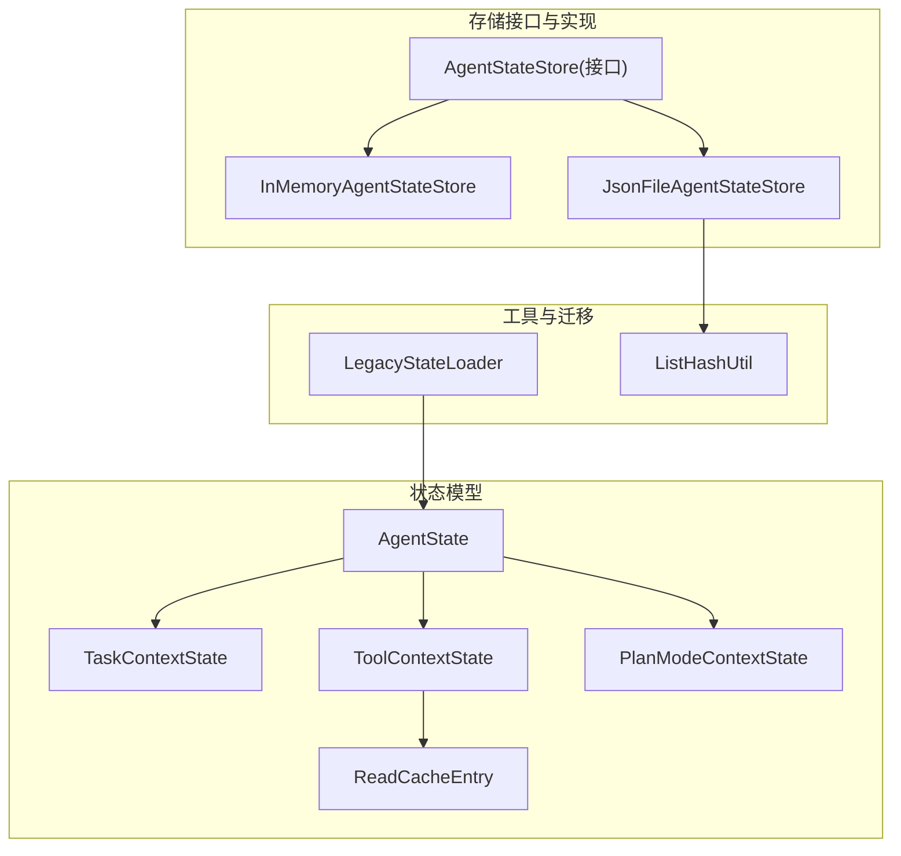
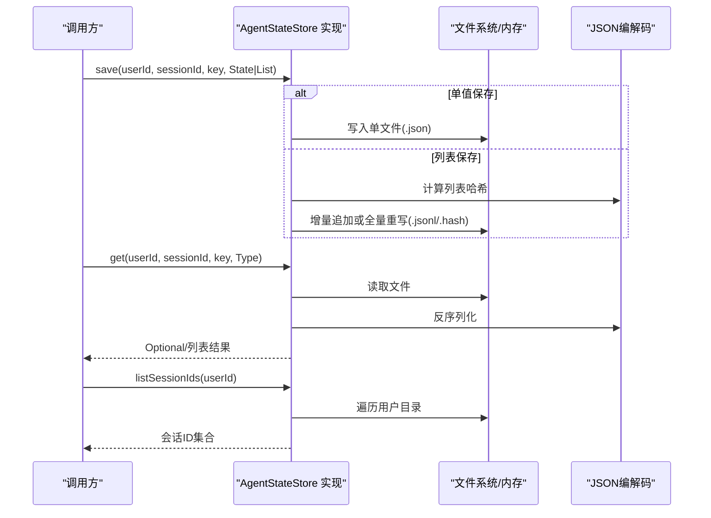
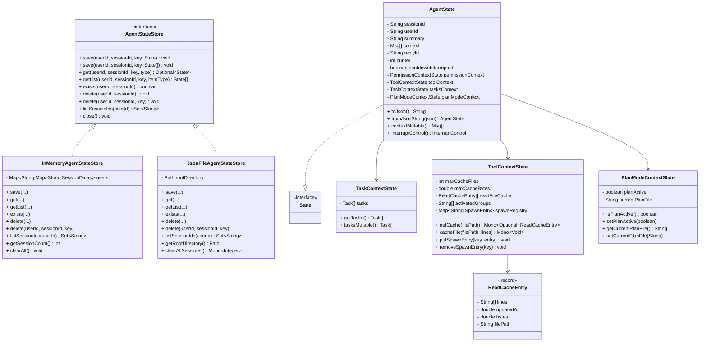
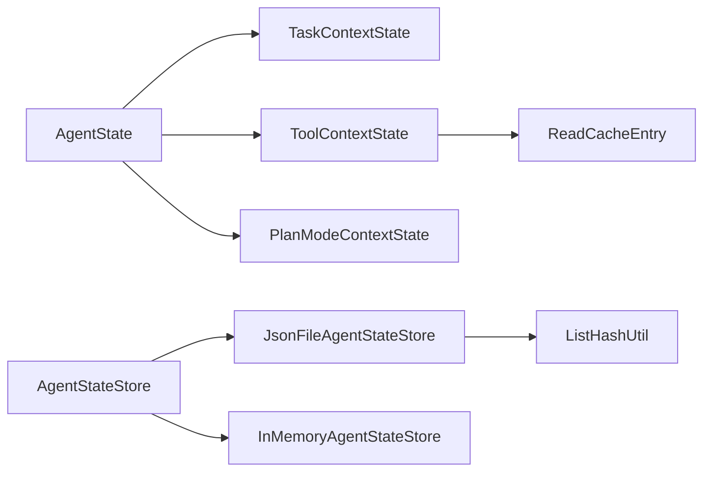

# 状态管理API

<cite>
**本文引用的文件**
- [AgentState.java](file://agentscope-core/src/main/java/io/agentscope/core/state/AgentState.java)
- [AgentStateStore.java](file://agentscope-core/src/main/java/io/agentscope/core/state/AgentStateStore.java)
- [InMemoryAgentStateStore.java](file://agentscope-core/src/main/java/io/agentscope/core/state/InMemoryAgentStateStore.java)
- [JsonFileAgentStateStore.java](file://agentscope-core/src/main/java/io/agentscope/core/state/JsonFileAgentStateStore.java)
- [LegacyStateLoader.java](file://agentscope-core/src/main/java/io/agentscope/core/state/LegacyStateLoader.java)
- [State.java](file://agentscope-core/src/main/java/io/agentscope/core/state/State.java)
- [TaskContextState.java](file://agentscope-core/src/main/java/io/agentscope/core/state/TaskContextState.java)
- [ToolContextState.java](file://agentscope-core/src/main/java/io/agentscope/core/state/ToolContextState.java)
- [PlanModeContextState.java](file://agentscope-core/src/main/java/io/agentscope/core/state/PlanModeContextState.java)
- [ListHashUtil.java](file://agentscope-core/src/main/java/io/agentscope/core/state/ListHashUtil.java)
- [ReadCacheEntry.java](file://agentscope-core/src/main/java/io/agentscope/core/state/ReadCacheEntry.java)
- [AgentStateTest.java](file://agentscope-core/src/test/java/io/agentscope/core/state/AgentStateTest.java)
- [InMemoryAgentStateStoreTest.java](file://agentscope-core/src/test/java/io/agentscope/core/state/InMemoryAgentStateStoreTest.java)
</cite>

## 目录
1. [简介](#简介)
2. [项目结构](#项目结构)
3. [核心组件](#核心组件)
4. [架构总览](#架构总览)
5. [详细组件分析](#详细组件分析)
6. [依赖分析](#依赖分析)
7. [性能考量](#性能考量)
8. [故障排查指南](#故障排查指南)
9. [结论](#结论)
10. [附录](#附录)

## 简介
本文件为 AgentScope 状态管理系统提供详细的 API 文档，聚焦以下目标：
- AgentState 数据结构与状态字段管理
- AgentStateStore 接口的状态持久化方法（保存、加载、删除、列出）
- InMemoryAgentStateStore 与 JsonFileAgentStateStore 的实现差异
- 状态序列化/反序列化与版本兼容性策略
- 状态快照、回滚与并发访问控制
- 存储性能优化与故障恢复机制

## 项目结构
状态管理相关代码位于 agentscope-core 模块的 io.agentscope.core.state 包中，核心文件如下：
- AgentState：单个智能体运行时状态的可变载体
- AgentStateStore：状态持久化接口
- InMemoryAgentStateStore：内存态实现
- JsonFileAgentStateStore：文件系统实现
- LegacyStateLoader：v1 到 v2 的迁移加载器
- 上下文子状态：TaskContextState、ToolContextState、PlanModeContextState
- 工具类：ListHashUtil（列表哈希与增量写入）、ReadCacheEntry（文件读缓存条目）
- State 标记接口：所有可持久化状态对象的基接口

图表来源
- [AgentState.java:1-424](file://agentscope-core/src/main/java/io/agentscope/core/state/AgentState.java#L1-L424)
- [AgentStateStore.java:1-167](file://agentscope-core/src/main/java/io/agentscope/core/state/AgentStateStore.java#L1-L167)
- [InMemoryAgentStateStore.java:1-195](file://agentscope-core/src/main/java/io/agentscope/core/state/InMemoryAgentStateStore.java#L1-L195)
- [JsonFileAgentStateStore.java:1-397](file://agentscope-core/src/main/java/io/agentscope/core/state/JsonFileAgentStateStore.java#L1-L397)
- [LegacyStateLoader.java:1-68](file://agentscope-core/src/main/java/io/agentscope/core/state/LegacyStateLoader.java#L1-L68)
- [ListHashUtil.java:1-172](file://agentscope-core/src/main/java/io/agentscope/core/state/ListHashUtil.java#L1-L172)
- [ReadCacheEntry.java:1-44](file://agentscope-core/src/main/java/io/agentscope/core/state/ReadCacheEntry.java#L1-L44)

章节来源
- [AgentState.java:1-424](file://agentscope-core/src/main/java/io/agentscope/core/state/AgentState.java#L1-L424)
- [AgentStateStore.java:1-167](file://agentscope-core/src/main/java/io/agentscope/core/state/AgentStateStore.java#L1-L167)

## 核心组件
- AgentState：承载会话级状态，包括摘要、消息上下文、回复标识、当前推理迭代次数、关闭中断标记、权限上下文、工具上下文、任务上下文、计划模式上下文等；提供 JSON 序列化/反序列化与 Builder 构建。
- AgentStateStore：统一的状态持久化接口，定义按 (userId, sessionId, key) 维度的保存、加载、删除、列出等操作。
- InMemoryAgentStateStore：基于并发映射的内存实现，适合单进程、无需跨重启持久化的场景。
- JsonFileAgentStateStore：基于文件系统的实现，采用原子写入、UTF-8、JSON/JSONL 存储、列表哈希校验以支持增量追加或全量重写。
- LegacyStateLoader：从 v1 会话键迁移至 v2 AgentState 的加载器。
- 上下文子状态：TaskContextState（任务集合）、ToolContextState（工具组激活与文件读缓存注册表）、PlanModeContextState（计划模式开关与当前计划文件）。

章节来源
- [AgentState.java:31-424](file://agentscope-core/src/main/java/io/agentscope/core/state/AgentState.java#L31-L424)
- [AgentStateStore.java:22-167](file://agentscope-core/src/main/java/io/agentscope/core/state/AgentStateStore.java#L22-L167)
- [InMemoryAgentStateStore.java:26-195](file://agentscope-core/src/main/java/io/agentscope/core/state/InMemoryAgentStateStore.java#L26-L195)
- [JsonFileAgentStateStore.java:41-397](file://agentscope-core/src/main/java/io/agentscope/core/state/JsonFileAgentStateStore.java#L41-L397)
- [LegacyStateLoader.java:22-68](file://agentscope-core/src/main/java/io/agentscope/core/state/LegacyStateLoader.java#L22-L68)
- [TaskContextState.java:24-75](file://agentscope-core/src/main/java/io/agentscope/core/state/TaskContextState.java#L24-L75)
- [ToolContextState.java:36-293](file://agentscope-core/src/main/java/io/agentscope/core/state/ToolContextState.java#L36-L293)
- [PlanModeContextState.java:23-98](file://agentscope-core/src/main/java/io/agentscope/core/state/PlanModeContextState.java#L23-L98)

## 架构总览
AgentState 作为顶层状态对象，聚合多个子上下文；AgentStateStore 抽象了持久化能力，具体由内存与文件实现提供；JsonFileAgentStateStore 使用 ListHashUtil 进行列表变更检测，支持增量写入与全量重写；LegacyStateLoader 提供版本兼容迁移。

图表来源
- [AgentStateStore.java:63-157](file://agentscope-core/src/main/java/io/agentscope/core/state/AgentStateStore.java#L63-L157)
- [JsonFileAgentStateStore.java:98-241](file://agentscope-core/src/main/java/io/agentscope/core/state/JsonFileAgentStateStore.java#L98-L241)
- [InMemoryAgentStateStore.java:54-132](file://agentscope-core/src/main/java/io/agentscope/core/state/InMemoryAgentStateStore.java#L54-L132)
- [ListHashUtil.java:76-170](file://agentscope-core/src/main/java/io/agentscope/core/state/ListHashUtil.java#L76-L170)

## 详细组件分析

### AgentState 数据结构与字段管理
- 关键字段
  - 会话标识：sessionId（必填，缺省自动生成）
  - 用户标识：userId（可空，匿名/单租户）
  - 摘要：summary（字符串）
  - 上下文：context（消息列表，提供防御性拷贝与可变句柄）
  - 回复标识：replyId（每次生成新值，支持显式设置）
  - 当前迭代：curIter（整数）
  - 关闭中断：shutdownInterrupted（布尔）
  - 权限上下文：permissionContext（可替换）
  - 工具上下文：toolContext（含激活组、文件读缓存、子代理注册表）
  - 任务上下文：tasksContext（任务列表）
  - 计划模式上下文：planModeContext（是否启用计划模式、当前计划文件）

- 字段访问与修改
  - 提供 getter/setter 以及 Builder 辅助方法（如 addMessage）
  - contextMutable 返回可变列表，便于在不重建对象的情况下就地修改
  - interruptControl 提供运行时中断信号（非序列化）

- 序列化/反序列化
  - toJson()/fromJsonString() 使用统一 JSON 编解码
  - Jackson 注解保证字段顺序与忽略特定运行时字段

- 版本兼容
  - 通过 @JsonPropertyOrder 控制序列化顺序
  - 反序列化构造器接受部分字段，缺失字段回退到默认值

章节来源
- [AgentState.java:31-340](file://agentscope-core/src/main/java/io/agentscope/core/state/AgentState.java#L31-L340)
- [AgentStateTest.java:35-168](file://agentscope-core/src/test/java/io/agentscope/core/state/AgentStateTest.java#L35-L168)

### AgentStateStore 接口与持久化方法
- 方法族
  - save(userId, sessionId, key, State)：单值保存（完整替换）
  - save(userId, sessionId, key, List<State>)：列表保存（实现决定策略）
  - get(userId, sessionId, key, Class<T>)：单值加载（Optional）
  - getList(userId, sessionId, key, Class<T>)：列表加载
  - exists(userId, sessionId)：会话存在性检查
  - delete(userId, sessionId)：删除整个会话
  - delete(userId, sessionId, key)：删除会话内指定键
  - listSessionIds(userId)：列出会话ID集合
  - close()：资源清理（默认空实现）

- 键空间与命名约定
  - (userId, sessionId) 作为槽位键，实现可自行组合为存储键
  - 支持匿名用户（userId 为空）与具名用户分隔

- 列表写入策略说明
  - InMemoryAgentStateStore：全量替换
  - JsonFileAgentStateStore：增量追加或全量重写（见下节）

章节来源
- [AgentStateStore.java:22-167](file://agentscope-core/src/main/java/io/agentscope/core/state/AgentStateStore.java#L22-L167)

### InMemoryAgentStateStore 实现
- 存储结构
  - 三层嵌套映射：users → sessionId → SessionData
  - SessionData 内部维护两个映射：单值状态与列表状态
  - 使用 ConcurrentHashMap 保证线程安全

- 行为特征
  - 单值保存：setSingleState(key, value)
  - 列表保存：setListState(key, List.copyOf(values))（全量替换）
  - 加载：按类型断言后返回 Optional/列表
  - 删除：支持整体会话删除与单键删除
  - 列表：返回用户命名空间下的会话ID集合
  - 工具：getSessionCount()、clearAll()

- 并发与一致性
  - 所有读写均在内部映射上进行并发安全操作
  - 不保证跨进程/跨实例持久性

章节来源
- [InMemoryAgentStateStore.java:26-195](file://agentscope-core/src/main/java/io/agentscope/core/state/InMemoryAgentStateStore.java#L26-L195)
- [InMemoryAgentStateStoreTest.java:40-218](file://agentscope-core/src/test/java/io/agentscope/core/state/InMemoryAgentStateStoreTest.java#L40-L218)

### JsonFileAgentStateStore 实现
- 文件布局与命名
  - 根目录下按用户分桶（匿名使用固定目录名），再按会话目录组织
  - 单值状态：key.json
  - 列表状态：key.jsonl（每行一条 JSON）
  - 列表哈希：key.hash（用于增量写入判断）

- 写入策略（save 列表）
  - 计算当前列表哈希
  - 读取已存哈希与现有行数
  - 若需全量重写则整写，否则仅追加新增项
  - 更新哈希文件
  - 原子写入：临时文件 + 原子移动

- 读取策略（get/getList）
  - 单值：读取 UTF-8 文本并反序列化
  - 列表：逐行解析 JSONL

- 其他能力
  - exists/delete/delete(key)/listSessionIds
  - 安全路径编码：对不安全字符进行 Base64(URL) 编码
  - 清理：支持异步清理所有会话目录

- 性能特性
  - 列表增量写入减少 IO
  - 哈希校验避免不必要的全量重写
  - 原子写确保数据一致性

章节来源
- [JsonFileAgentStateStore.java:41-397](file://agentscope-core/src/main/java/io/agentscope/core/state/JsonFileAgentStateStore.java#L41-L397)

### 列表哈希与版本兼容（ListHashUtil）
- 哈希计算
  - 对小列表全采样，大列表按四分位采样，包含列表长度与采样元素的哈希
  - 返回十六进制字符串

- 变更判定
  - needsFullRewrite：综合当前大小、已有数量、前缀哈希与存储哈希判断是否需要全量重写
  - hasChanged：比较当前哈希与存储哈希

- 在 JsonFileAgentStateStore 中的应用
  - 通过 .hash 文件与 .jsonl 前缀对比，决定增量追加或全量重写

章节来源
- [ListHashUtil.java:20-172](file://agentscope-core/src/main/java/io/agentscope/core/state/ListHashUtil.java#L20-L172)
- [JsonFileAgentStateStore.java:110-133](file://agentscope-core/src/main/java/io/agentscope/core/state/JsonFileAgentStateStore.java#L110-L133)

### LegacyStateLoader（v1 到 v2 迁移）
- 功能
  - 从旧会话键 memory_messages 与 toolkit_activeGroups 构造新的 AgentState
  - 不修改原始数据，后续保存自动采用新格式

- 使用场景
  - 启动时检测并迁移历史会话，保证平滑升级

章节来源
- [LegacyStateLoader.java:22-68](file://agentscope-core/src/main/java/io/agentscope/core/state/LegacyStateLoader.java#L22-L68)

### 上下文子状态详解
- TaskContextState
  - 任务列表的只读视图与可变视图分离
- ToolContextState
  - 工具激活组、文件读缓存（LRU，带字节上限与条目上限）、子代理注册表
  - 提供异步缓存查询与写入（阻塞在弹性调度器）
- PlanModeContextState
  - 计划模式开关与当前编辑的计划文件路径

章节来源
- [TaskContextState.java:24-75](file://agentscope-core/src/main/java/io/agentscope/core/state/TaskContextState.java#L24-L75)
- [ToolContextState.java:36-293](file://agentscope-core/src/main/java/io/agentscope/core/state/ToolContextState.java#L36-L293)
- [PlanModeContextState.java:23-98](file://agentscope-core/src/main/java/io/agentscope/core/state/PlanModeContextState.java#L23-L98)
- [ReadCacheEntry.java:23-44](file://agentscope-core/src/main/java/io/agentscope/core/state/ReadCacheEntry.java#L23-L44)

### 类关系图（代码级）

图表来源
- [AgentState.java:59-424](file://agentscope-core/src/main/java/io/agentscope/core/state/AgentState.java#L59-L424)
- [AgentStateStore.java:61-167](file://agentscope-core/src/main/java/io/agentscope/core/state/AgentStateStore.java#L61-L167)
- [InMemoryAgentStateStore.java:46-195](file://agentscope-core/src/main/java/io/agentscope/core/state/InMemoryAgentStateStore.java#L46-L195)
- [JsonFileAgentStateStore.java:66-397](file://agentscope-core/src/main/java/io/agentscope/core/state/JsonFileAgentStateStore.java#L66-L397)
- [TaskContextState.java:30-75](file://agentscope-core/src/main/java/io/agentscope/core/state/TaskContextState.java#L30-L75)
- [ToolContextState.java:49-293](file://agentscope-core/src/main/java/io/agentscope/core/state/ToolContextState.java#L49-L293)
- [PlanModeContextState.java:37-98](file://agentscope-core/src/main/java/io/agentscope/core/state/PlanModeContextState.java#L37-L98)
- [ReadCacheEntry.java:31-44](file://agentscope-core/src/main/java/io/agentscope/core/state/ReadCacheEntry.java#L31-L44)

## 依赖分析
- 耦合关系
  - AgentState 依赖多个上下文子状态，形成强聚合关系
  - AgentStateStore 是抽象接口，InMemoryAgentStateStore 与 JsonFileAgentStateStore 分别实现不同存储介质
  - JsonFileAgentStateStore 依赖 ListHashUtil 进行列表变更检测
  - ToolContextState 依赖 Reactor 调度器执行文件系统操作，避免阻塞

- 外部依赖
  - JSON 编解码：统一通过 JsonUtils 获取编解码器
  - 文件系统：NIO.2（原子写、目录遍历、行读取）
  - 并发：ConcurrentHashMap、synchronized 保护缓存列表

图表来源
- [AgentState.java:61-103](file://agentscope-core/src/main/java/io/agentscope/core/state/AgentState.java#L61-L103)
- [JsonFileAgentStateStore.java:110-133](file://agentscope-core/src/main/java/io/agentscope/core/state/JsonFileAgentStateStore.java#L110-L133)
- [ToolContextState.java:184-241](file://agentscope-core/src/main/java/io/agentscope/core/state/ToolContextState.java#L184-L241)

章节来源
- [AgentState.java:18-30](file://agentscope-core/src/main/java/io/agentscope/core/state/AgentState.java#L18-L30)
- [JsonFileAgentStateStore.java:18-40](file://agentscope-core/src/main/java/io/agentscope/core/state/JsonFileAgentStateStore.java#L18-L40)
- [ToolContextState.java:33-35](file://agentscope-core/src/main/java/io/agentscope/core/state/ToolContextState.java#L33-L35)

## 性能考量
- 列表写入优化
  - JsonFileAgentStateStore 通过哈希与行数判断，优先增量追加，减少磁盘写放大
  - 原子写入避免部分写导致的数据损坏
- 内存态优势
  - InMemoryAgentStateStore 读写延迟低，适合短生命周期或单实例场景
- 文件系统与缓存
  - ToolContextState 的文件读缓存采用 LRU 与字节总量限制，防止内存膨胀
  - 异步读取与写入避免阻塞主线程
- 序列化成本
  - AgentState 使用 Jackson 注解控制字段顺序与忽略运行时字段，降低序列化体积

[本节为通用性能讨论，不直接分析具体文件]

## 故障排查指南
- 常见问题与定位
  - 会话不存在：检查 userId/sessionId 是否正确，确认 listSessionIds 结果
  - 列表未增长：确认 save 列表时传入的是完整列表，JsonFileAgentStateStore 仅在新增项时追加
  - 增量写失败：核对 .hash 文件是否存在且可读，必要时允许全量重写
  - 内存泄漏/缓存异常：检查 ToolContextState 的缓存配置与活跃组设置
  - 序列化异常：确认状态对象实现了 State 接口且具备合适的 Jackson 注解

- 排查步骤
  - 使用 exists 检查会话是否存在
  - 使用 get/getList 读取并验证内容
  - 对于文件存储，检查根目录结构与权限
  - 对于内存存储，使用 getSessionCount/clearAll 辅助诊断

章节来源
- [JsonFileAgentStateStore.java:204-241](file://agentscope-core/src/main/java/io/agentscope/core/state/JsonFileAgentStateStore.java#L204-L241)
- [InMemoryAgentStateStore.java:104-142](file://agentscope-core/src/main/java/io/agentscope/core/state/InMemoryAgentStateStore.java#L104-L142)
- [ToolContextState.java:184-241](file://agentscope-core/src/main/java/io/agentscope/core/state/ToolContextState.java#L184-L241)

## 结论
AgentScope 的状态管理以 AgentState 为核心，结合 AgentStateStore 接口与多种实现，提供了灵活、可扩展且高性能的状态持久化方案。内存实现适合快速原型与单实例部署，文件实现兼顾可靠性与增量优化。通过上下文子状态与迁移加载器，系统在功能与兼容性之间取得平衡，并通过异步与原子写入提升整体稳定性。

[本节为总结性内容，不直接分析具体文件]

## 附录

### API 规范速查
- 保存
  - 单值：save(userId, sessionId, key, State)
  - 列表：save(userId, sessionId, key, List<State>)
- 加载
  - 单值：get(userId, sessionId, key, Class<T>) → Optional<T>
  - 列表：getList(userId, sessionId, key, Class<T>) → List<T>
- 元操作
  - exists(userId, sessionId) → boolean
  - delete(userId, sessionId[, key])
  - listSessionIds(userId) → Set<String>
  - close()

章节来源
- [AgentStateStore.java:63-157](file://agentscope-core/src/main/java/io/agentscope/core/state/AgentStateStore.java#L63-L157)

### 状态序列化/反序列化与版本兼容
- 序列化
  - AgentState.toJson()/fromJsonString() 使用统一 JSON 编解码
  - Jackson 注解控制字段顺序与忽略运行时字段
- 反序列化
  - 支持部分字段，缺失字段回退默认值
- 版本兼容
  - LegacyStateLoader 将 v1 的 memory_messages 与 toolkit_activeGroups 映射到 v2 的 AgentState

章节来源
- [AgentState.java:273-288](file://agentscope-core/src/main/java/io/agentscope/core/state/AgentState.java#L273-L288)
- [LegacyStateLoader.java:48-66](file://agentscope-core/src/main/java/io/agentscope/core/state/LegacyStateLoader.java#L48-L66)

### 快照、回滚与并发控制
- 快照
  - 单值：直接保存当前 AgentState 或其子上下文
  - 列表：保存完整列表，JsonFileAgentStateStore 通过哈希实现增量快照
- 回滚
  - 通过覆盖保存实现“回滚”到之前的快照
  - 列表回滚建议保留历史哈希或采用多版本文件策略（需自定义实现）
- 并发控制
  - InMemoryAgentStateStore：ConcurrentHashMap + synchronized 保护
  - JsonFileAgentStateStore：原子写入，避免并发写冲突

章节来源
- [JsonFileAgentStateStore.java:110-133](file://agentscope-core/src/main/java/io/agentscope/core/state/JsonFileAgentStateStore.java#L110-L133)
- [InMemoryAgentStateStore.java:170-193](file://agentscope-core/src/main/java/io/agentscope/core/state/InMemoryAgentStateStore.java#L170-L193)

### 测试参考
- AgentState 行为验证：默认值、不可变视图、可变视图、setter、JSON 往返
- InMemoryAgentStateStore 行为验证：保存/加载/删除/列出/计数/清空

章节来源
- [AgentStateTest.java:35-168](file://agentscope-core/src/test/java/io/agentscope/core/state/AgentStateTest.java#L35-L168)
- [InMemoryAgentStateStoreTest.java:40-218](file://agentscope-core/src/test/java/io/agentscope/core/state/InMemoryAgentStateStoreTest.java#L40-L218)