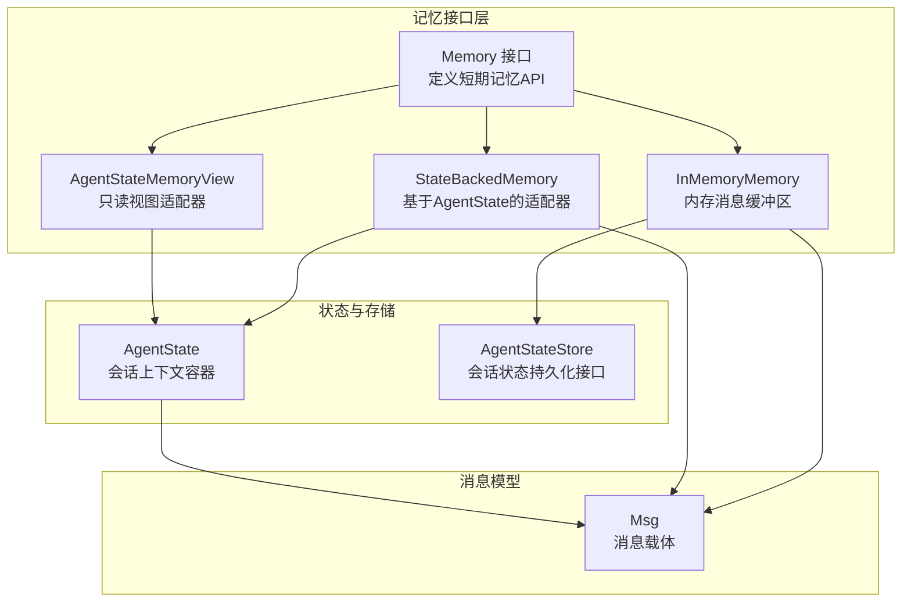
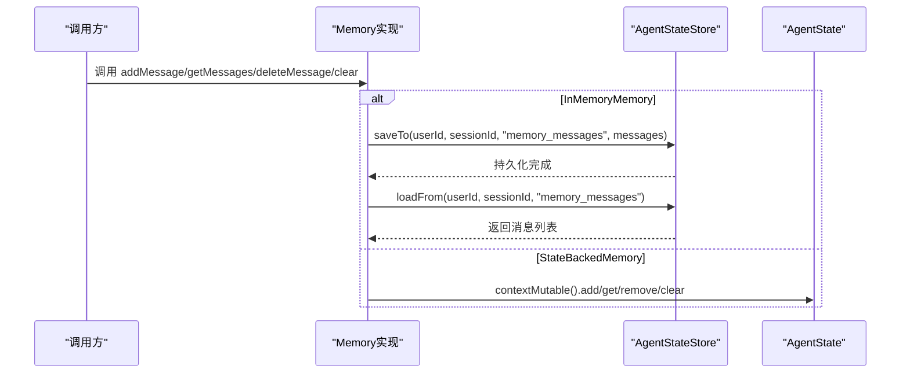
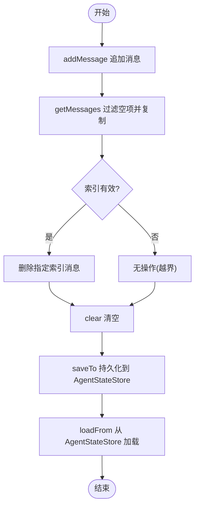
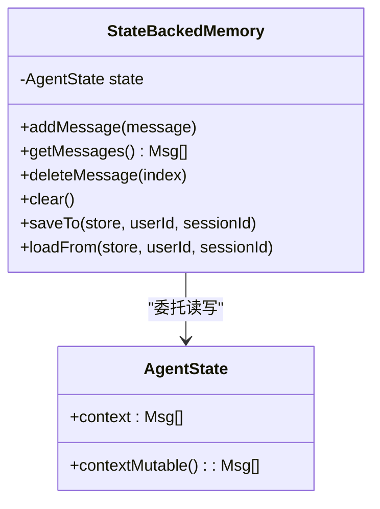
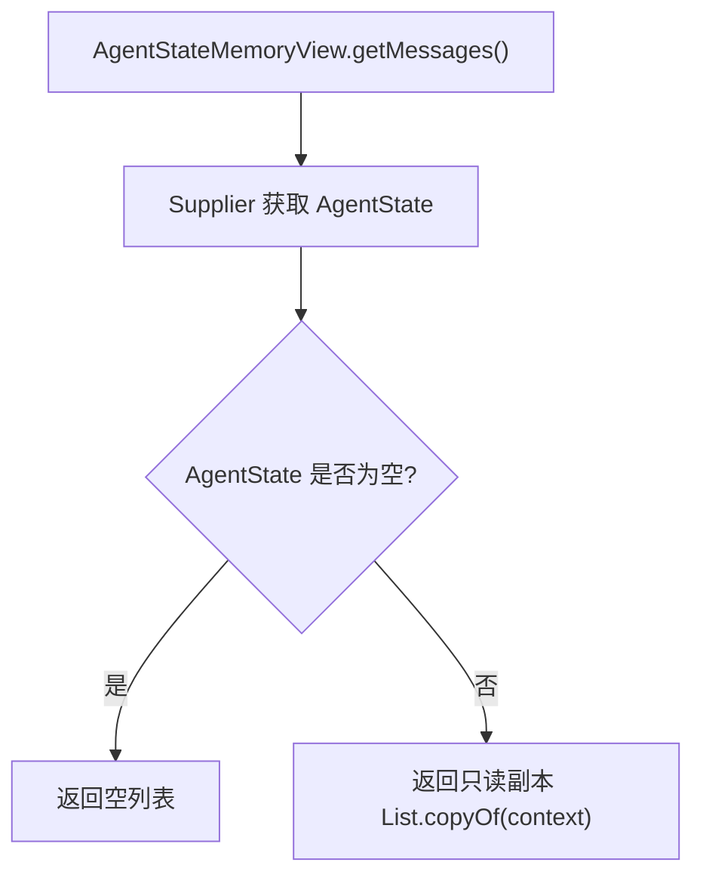
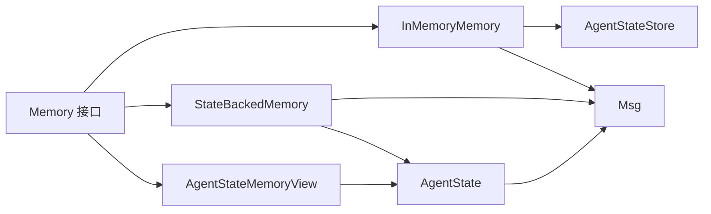

# 短期记忆API

<cite>
**本文档引用的文件**
- [InMemoryMemory.java](file://agentscope-core/src/main/java/io/agentscope/core/memory/InMemoryMemory.java)
- [StateBackedMemory.java](file://agentscope-core/src/main/java/io/agentscope/core/memory/StateBackedMemory.java)
- [Memory.java](file://agentscope-core/src/main/java/io/agentscope/core/memory/Memory.java)
- [AgentStateMemoryView.java](file://agentscope-core/src/main/java/io/agentscope/core/memory/AgentStateMemoryView.java)
- [AgentState.java](file://agentscope-core/src/main/java/io/agentscope/core/state/AgentState.java)
- [AgentStateStore.java](file://agentscope-core/src/main/java/io/agentscope/core/state/AgentStateStore.java)
- [Msg.java](file://agentscope-core/src/main/java/io/agentscope/core/message/Msg.java)
- [LongTermMemory.java](file://agentscope-core/src/main/java/io/agentscope/core/memory/LongTermMemory.java)
- [StaticLongTermMemoryHook.java](file://agentscope-core/src/main/java/io/agentscope/core/memory/StaticLongTermMemoryHook.java)
- [InMemoryMemoryTest.java](file://agentscope-core/src/test/java/io/agentscope/core/legacy/memory/InMemoryMemoryTest.java)
- [InMemoryMemoryNewApiTest.java](file://agentscope-core/src/test/java/io/agentscope/core/legacy/memory/InMemoryMemoryNewApiTest.java)
</cite>

## 目录
1. [简介](#简介)
2. [项目结构](#项目结构)
3. [核心组件](#核心组件)
4. [架构总览](#架构总览)
5. [详细组件分析](#详细组件分析)
6. [依赖关系分析](#依赖关系分析)
7. [性能考虑](#性能考虑)
8. [故障排查指南](#故障排查指南)
9. [结论](#结论)
10. [附录](#附录)

## 简介
本文件面向AgentScope短期记忆系统，聚焦以下目标：
- 深入解析InMemoryMemory的实现细节：消息缓冲区管理、线程安全、持久化策略（通过AgentStateStore）以及与会话状态的集成方式。
- 记录StateBackedMemory的状态驱动记忆机制：如何委托AgentState上下文进行读写。
- 明确短期记忆的生命周期管理、消息添加与删除的API规范。
- 提供内存使用监控、自动清理与性能优化相关的接口说明与最佳实践。
- 给出短期记忆与会话状态集成的具体示例路径。

## 项目结构
短期记忆相关代码位于agentscope-core模块的memory与state包中，并与消息类型Msg、状态存储AgentStateStore紧密协作。下图展示与短期记忆API直接相关的文件关系：

图表来源
- [Memory.java:35-78](file://agentscope-core/src/main/java/io/agentscope/core/memory/Memory.java#L35-L78)
- [InMemoryMemory.java:37-134](file://agentscope-core/src/main/java/io/agentscope/core/memory/InMemoryMemory.java#L37-L134)
- [StateBackedMemory.java:36-79](file://agentscope-core/src/main/java/io/agentscope/core/memory/StateBackedMemory.java#L36-L79)
- [AgentStateMemoryView.java:43-86](file://agentscope-core/src/main/java/io/agentscope/core/memory/AgentStateMemoryView.java#L43-L86)
- [AgentState.java:59-188](file://agentscope-core/src/main/java/io/agentscope/core/state/AgentState.java#L59-L188)
- [AgentStateStore.java:61-166](file://agentscope-core/src/main/java/io/agentscope/core/state/AgentStateStore.java#L61-L166)
- [Msg.java:67-152](file://agentscope-core/src/main/java/io/agentscope/core/message/Msg.java#L67-L152)

章节来源
- [Memory.java:22-78](file://agentscope-core/src/main/java/io/agentscope/core/memory/Memory.java#L22-L78)
- [InMemoryMemory.java:26-134](file://agentscope-core/src/main/java/io/agentscope/core/memory/InMemoryMemory.java#L26-L134)
- [StateBackedMemory.java:24-79](file://agentscope-core/src/main/java/io/agentscope/core/memory/StateBackedMemory.java#L24-L79)
- [AgentStateMemoryView.java:25-86](file://agentscope-core/src/main/java/io/agentscope/core/memory/AgentStateMemoryView.java#L25-L86)
- [AgentState.java:31-188](file://agentscope-core/src/main/java/io/agentscope/core/state/AgentState.java#L31-L188)
- [AgentStateStore.java:22-166](file://agentscope-core/src/main/java/io/agentscope/core/state/AgentStateStore.java#L22-L166)
- [Msg.java:40-152](file://agentscope-core/src/main/java/io/agentscope/core/message/Msg.java#L40-L152)

## 核心组件
- Memory接口：定义短期记忆的标准API，包括消息增删查、清空以及与AgentStateStore的保存/加载能力。该接口在2.0版本已标记为仅向后兼容。
- InMemoryMemory：基于CopyOnWriteArrayList的线程安全内存消息缓冲区，支持保存到/从AgentStateStore加载；适合临时会话或轻量级场景。
- StateBackedMemory：将所有读写委托给AgentState.contextMutable()，作为v1遗留代码的兼容适配器。
- AgentStateMemoryView：只读适配器，按调用时点代理AgentState.getContext()，不支持任何修改操作。
- AgentState：会话级运行时状态容器，其中context为对话历史缓冲区，提供contextMutable()以原位修改。
- AgentStateStore：会话状态持久化接口，支持保存/加载列表值（如memory_messages），并提供exists/delete/list等能力。
- Msg：消息载体，承载角色、内容块、元数据与用量统计等信息。

章节来源
- [Memory.java:22-78](file://agentscope-core/src/main/java/io/agentscope/core/memory/Memory.java#L22-L78)
- [InMemoryMemory.java:26-134](file://agentscope-core/src/main/java/io/agentscope/core/memory/InMemoryMemory.java#L26-L134)
- [StateBackedMemory.java:24-79](file://agentscope-core/src/main/java/io/agentscope/core/memory/StateBackedMemory.java#L24-L79)
- [AgentStateMemoryView.java:25-86](file://agentscope-core/src/main/java/io/agentscope/core/memory/AgentStateMemoryView.java#L25-L86)
- [AgentState.java:31-188](file://agentscope-core/src/main/java/io/agentscope/core/state/AgentState.java#L31-L188)
- [AgentStateStore.java:22-166](file://agentscope-core/src/main/java/io/agentscope/core/state/AgentStateStore.java#L22-L166)
- [Msg.java:40-152](file://agentscope-core/src/main/java/io/agentscope/core/message/Msg.java#L40-L152)

## 架构总览
短期记忆在2.0版本的定位已发生演进：对话历史不再由独立Memory持有，而是直接存放在AgentState.context中。短期记忆API仍保留以兼容旧版用户代码，但推荐直接使用AgentState上下文。

图表来源
- [InMemoryMemory.java:62-81](file://agentscope-core/src/main/java/io/agentscope/core/memory/InMemoryMemory.java#L62-L81)
- [StateBackedMemory.java:44-65](file://agentscope-core/src/main/java/io/agentscope/core/memory/StateBackedMemory.java#L44-L65)
- [AgentStateStore.java:72-117](file://agentscope-core/src/main/java/io/agentscope/core/state/AgentStateStore.java#L72-L117)
- [AgentState.java:186-188](file://agentscope-core/src/main/java/io/agentscope/core/state/AgentState.java#L186-L188)

## 详细组件分析

### InMemoryMemory：内存消息缓冲区与持久化
- 数据结构与并发
  - 使用CopyOnWriteArrayList维护消息列表，读多写少场景下保证读取线程安全且无需显式同步。
  - 删除操作对索引进行边界检查，越界视为无操作，避免异常传播。
- 消息缓冲区管理
  - addMessage：追加消息至尾部。
  - getMessages：过滤空条目并返回新列表副本，确保外部不可变性。
  - deleteMessage：按索引删除，越界无操作。
  - clear：清空全部消息。
- 窗口大小限制
  - 当前实现未内置窗口大小限制逻辑；若需窗口控制，建议在业务侧对contextMutable()进行截断或在AgentStateStore层面做增量写入策略。
- 内存清理策略
  - 清理主要通过clear或重新加载覆盖；对于超长会话，可结合AgentStateStore的增量写入特性减少全量序列化开销。
- 与AgentStateStore的集成
  - saveTo/loadFrom负责将消息列表持久化到键"memory_messages"，便于跨进程/重启恢复。
  - 即使为空也会保存，确保“清空”状态被持久化；加载时会替换当前内存内容。
- 与会话状态集成示例
  - 参考测试用例中的保存/加载流程，验证消息列表的持久化与恢复行为。

图表来源
- [InMemoryMemory.java:92-133](file://agentscope-core/src/main/java/io/agentscope/core/memory/InMemoryMemory.java#L92-L133)
- [AgentStateStore.java:72-117](file://agentscope-core/src/main/java/io/agentscope/core/state/AgentStateStore.java#L72-L117)

章节来源
- [InMemoryMemory.java:26-134](file://agentscope-core/src/main/java/io/agentscope/core/memory/InMemoryMemory.java#L26-L134)
- [InMemoryMemoryTest.java:38-176](file://agentscope-core/src/test/java/io/agentscope/core/legacy/memory/InMemoryMemoryTest.java#L38-L176)
- [InMemoryMemoryNewApiTest.java:51-113](file://agentscope-core/src/test/java/io/agentscope/core/legacy/memory/InMemoryMemoryNewApiTest.java#L51-L113)

### StateBackedMemory：状态驱动的记忆机制
- 设计动机
  - 将所有读写委托给AgentState.contextMutable()，保持与2.0架构一致，同时为遗留代码提供透明适配。
- 行为特征
  - addMessage/getMessages/deleteMessage/clear均直接作用于AgentState.contextMutable()。
  - saveTo/loadFrom同样将消息列表保存到"memory_messages"键，实现与InMemoryMemory相同的持久化语义。
- 使用建议
  - 新代码应直接使用AgentState.getContext()/contextMutable()，避免通过适配器间接访问。

图表来源
- [StateBackedMemory.java:36-79](file://agentscope-core/src/main/java/io/agentscope/core/memory/StateBackedMemory.java#L36-L79)
- [AgentState.java:186-188](file://agentscope-core/src/main/java/io/agentscope/core/state/AgentState.java#L186-L188)

章节来源
- [StateBackedMemory.java:24-79](file://agentscope-core/src/main/java/io/agentscope/core/memory/StateBackedMemory.java#L24-L79)
- [AgentState.java:31-188](file://agentscope-core/src/main/java/io/agentscope/core/state/AgentState.java#L31-L188)

### AgentStateMemoryView：只读短期记忆视图
- 设计目的
  - 为遗留钩子/工具（如StaticLongTermMemoryHook）提供只读代理，避免破坏AgentState上下文。
- 行为约束
  - 仅支持getMessages；其他写操作抛出UnsupportedOperationException。
  - 通过Supplier延迟解析AgentState，允许在Agent尚未绑定时实例化视图。
- 适用场景
  - 需要读取上下文但不允许修改的历史查询场景。

图表来源
- [AgentStateMemoryView.java:51-55](file://agentscope-core/src/main/java/io/agentscope/core/memory/AgentStateMemoryView.java#L51-L55)

章节来源
- [AgentStateMemoryView.java:25-86](file://agentscope-core/src/main/java/io/agentscope/core/memory/AgentStateMemoryView.java#L25-L86)

### 与会话状态集成示例
- 通过AgentStateStore保存/加载短期记忆
  - InMemoryMemory.saveTo/loadFrom演示了将消息列表保存到"memory_messages"键，并在后续会话加载恢复。
  - 测试用例验证了空内存、增量保存、替换加载等行为。
- 与AgentState的直接集成
  - 新代码应优先使用AgentState.getContext()/contextMutable()进行消息读写，避免额外适配层。
  - 长期记忆（LongTermMemory）在2.0版本已废弃，跨会话持久化建议在应用层通过AgentStateStore实现。

章节来源
- [InMemoryMemoryNewApiTest.java:51-113](file://agentscope-core/src/test/java/io/agentscope/core/legacy/memory/InMemoryMemoryNewApiTest.java#L51-L113)
- [AgentStateStore.java:72-117](file://agentscope-core/src/main/java/io/agentscope/core/state/AgentStateStore.java#L72-L117)
- [AgentState.java:179-188](file://agentscope-core/src/main/java/io/agentscope/core/state/AgentState.java#L179-L188)
- [LongTermMemory.java:66-68](file://agentscope-core/src/main/java/io/agentscope/core/memory/LongTermMemory.java#L66-L68)

## 依赖关系分析
短期记忆API的耦合关系如下：
- Memory接口与具体实现（InMemoryMemory、StateBackedMemory、AgentStateMemoryView）解耦。
- InMemoryMemory依赖AgentStateStore进行持久化；StateBackedMemory依赖AgentState上下文。
- Msg作为消息载体被上述组件共同使用。

图表来源
- [Memory.java:35-78](file://agentscope-core/src/main/java/io/agentscope/core/memory/Memory.java#L35-L78)
- [InMemoryMemory.java:37-134](file://agentscope-core/src/main/java/io/agentscope/core/memory/InMemoryMemory.java#L37-L134)
- [StateBackedMemory.java:36-79](file://agentscope-core/src/main/java/io/agentscope/core/memory/StateBackedMemory.java#L36-L79)
- [AgentStateMemoryView.java:43-86](file://agentscope-core/src/main/java/io/agentscope/core/memory/AgentStateMemoryView.java#L43-L86)
- [AgentStateStore.java:61-166](file://agentscope-core/src/main/java/io/agentscope/core/state/AgentStateStore.java#L61-L166)
- [AgentState.java:59-188](file://agentscope-core/src/main/java/io/agentscope/core/state/AgentState.java#L59-L188)
- [Msg.java:67-152](file://agentscope-core/src/main/java/io/agentscope/core/message/Msg.java#L67-L152)

章节来源
- [Memory.java:22-78](file://agentscope-core/src/main/java/io/agentscope/core/memory/Memory.java#L22-L78)
- [InMemoryMemory.java:26-134](file://agentscope-core/src/main/java/io/agentscope/core/memory/InMemoryMemory.java#L26-L134)
- [StateBackedMemory.java:24-79](file://agentscope-core/src/main/java/io/agentscope/core/memory/StateBackedMemory.java#L24-L79)
- [AgentStateMemoryView.java:25-86](file://agentscope-core/src/main/java/io/agentscope/core/memory/AgentStateMemoryView.java#L25-L86)
- [AgentStateStore.java:22-166](file://agentscope-core/src/main/java/io/agentscope/core/state/AgentStateStore.java#L22-L166)
- [AgentState.java:31-188](file://agentscope-core/src/main/java/io/agentscope/core/state/AgentState.java#L31-L188)
- [Msg.java:40-152](file://agentscope-core/src/main/java/io/agentscope/core/message/Msg.java#L40-L152)

## 性能考虑
- 并发与线程安全
  - InMemoryMemory使用CopyOnWriteArrayList，适合高读低写场景；频繁删除/插入可能带来写时复制成本。
- 序列化与I/O
  - saveTo/loadFrom会序列化整段消息列表；对于长会话，建议采用增量写入策略（如JsonFileAgentStateStore的行增量特性）以降低I/O压力。
- 内存占用
  - 消息数量与内容块大小直接影响内存占用；建议在业务层对contextMutable()进行窗口裁剪或定期压缩。
- 异步与背压
  - 长期记忆记录在旧钩子中可通过专用调度器异步执行，避免阻塞主事件链；短期记忆本身不涉及此类异步路径。

章节来源
- [InMemoryMemory.java:88-133](file://agentscope-core/src/main/java/io/agentscope/core/memory/InMemoryMemory.java#L88-L133)
- [AgentStateStore.java:76-92](file://agentscope-core/src/main/java/io/agentscope/core/state/AgentStateStore.java#L76-L92)
- [StaticLongTermMemoryHook.java:80-86](file://agentscope-core/src/main/java/io/agentscope/core/memory/StaticLongTermMemoryHook.java#L80-L86)

## 故障排查指南
- 常见问题与处理
  - 越界删除：deleteMessage对无效索引不做操作，不会抛异常。若出现“删除无效”，请检查索引是否超出范围。
  - 空内存加载：loadFrom在无持久化数据时不会报错，返回空列表。确认保存键名与会话标识正确。
  - 只读适配器：AgentStateMemoryView不支持写操作，调用会抛出UnsupportedOperationException。请改用AgentState.contextMutable()。
  - 线程安全：InMemoryMemory的读操作是线程安全的，但多次并发写入可能导致写时复制开销增大。建议在业务层合并批量写入。
- 测试参考
  - 单元测试覆盖了消息添加、过滤空项、越界删除、清空、并发操作等场景，可作为回归验证的基准。

章节来源
- [InMemoryMemoryTest.java:88-176](file://agentscope-core/src/test/java/io/agentscope/core/legacy/memory/InMemoryMemoryTest.java#L88-L176)
- [InMemoryMemoryNewApiTest.java:100-131](file://agentscope-core/src/test/java/io/agentscope/core/legacy/memory/InMemoryMemoryNewApiTest.java#L100-L131)
- [AgentStateMemoryView.java:58-85](file://agentscope-core/src/main/java/io/agentscope/core/memory/AgentStateMemoryView.java#L58-L85)

## 结论
- 在2.0架构下，短期记忆不再由独立的Memory对象持有，对话历史直接位于AgentState.context中。
- InMemoryMemory与StateBackedMemory提供了向后兼容的API，便于从1.x迁移；新代码应直接使用AgentState上下文。
- 通过AgentStateStore可实现会话级别的持久化与恢复；建议结合增量写入策略优化I/O性能。
- 若需要长期记忆能力，应在应用层通过AgentStateStore实现跨会话持久化，而非依赖已废弃的LongTermMemory。

## 附录
- API规范摘要
  - addMessage：追加消息至缓冲区。
  - getMessages：返回非空消息列表副本。
  - deleteMessage：按索引删除，越界无操作。
  - clear：清空缓冲区。
  - saveTo/loadFrom：将消息列表保存/加载到AgentStateStore的"memory_messages"键。
- 最佳实践
  - 对于长会话，建议在业务层对contextMutable()进行窗口裁剪或定期压缩。
  - 使用AgentStateStore的增量写入特性，减少全量序列化带来的性能损耗。
  - 避免在只读视图上执行写操作；如需修改，请使用AgentState.contextMutable()。