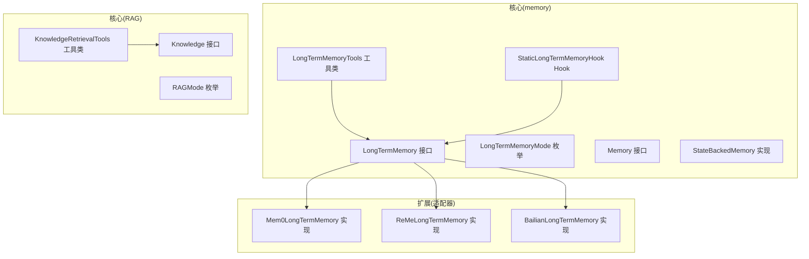
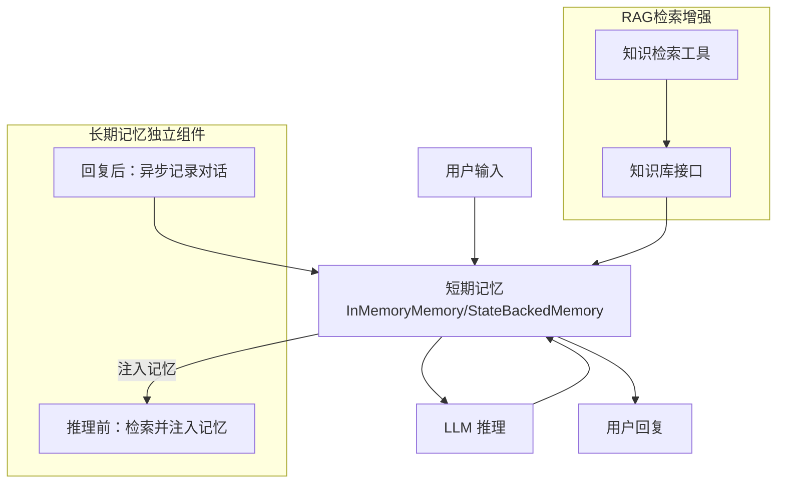
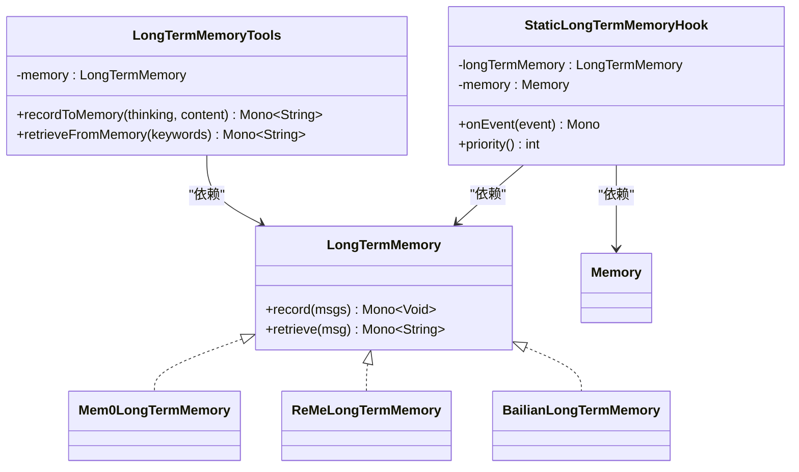

# 长期记忆API

<cite>
**本文引用的文件**
- [LongTermMemory.java](file://agentscope-core/src/main/java/io/agentscope/core/memory/LongTermMemory.java)
- [LongTermMemoryMode.java](file://agentscope-core/src/main/java/io/agentscope/core/memory/LongTermMemoryMode.java)
- [LongTermMemoryTools.java](file://agentscope-core/src/main/java/io/agentscope/core/memory/LongTermMemoryTools.java)
- [StaticLongTermMemoryHook.java](file://agentscope-core/src/main/java/io/agentscope/core/memory/StaticLongTermMemoryHook.java)
- [Memory.java](file://agentscope-core/src/main/java/io/agentscope/core/memory/Memory.java)
- [StateBackedMemory.java](file://agentscope-core/src/main/java/io/agentscope/core/memory/StateBackedMemory.java)
- [Mem0LongTermMemory.java](file://agentscope-extensions/agentscope-extensions-mem/agentscope-extensions-mem0/src/main/java/io/agentscope/core/memory/mem0/Mem0LongTermMemory.java)
- [BailianLongTermMemory.java](file://agentscope-extensions/agentscope-extensions-mem/agentscope-extensions-memory-bailian/src/main/java/io/agentscope/core/memory/bailian/BailianLongTermMemory.java)
- [ReMeLongTermMemory.java](file://agentscope-extensions/agentscope-extensions-mem/agentscope-extensions-reme/src/main/java/io/agentscope/core/memory/reme/ReMeLongTermMemory.java)
- [Knowledge.java](file://agentscope-core/src/main/java/io/agentscope/core/rag/Knowledge.java)
- [KnowledgeRetrievalTools.java](file://agentscope-core/src/main/java/io/agentscope/core/rag/KnowledgeRetrievalTools.java)
- [RAGMode.java](file://agentscope-core/src/main/java/io/agentscope/core/rag/RAGMode.java)
</cite>

## 目录
1. [简介](#简介)
2. [项目结构](#项目结构)
3. [核心组件](#核心组件)
4. [架构总览](#架构总览)
5. [详细组件分析](#详细组件分析)
6. [依赖分析](#依赖分析)
7. [性能考虑](#性能考虑)
8. [故障排查指南](#故障排查指南)
9. [结论](#结论)
10. [附录](#附录)

## 简介
本文件为 AgentScope 长期记忆系统的完整 API 参考文档。尽管自 2.0 版本起“长期记忆”与“Hook”体系已废弃，但本仓库仍保留了 v1 的核心接口与多种适配器实现，便于理解其设计思想与迁移路径。本文档覆盖以下主题：
- LongTermMemory 接口与核心方法（记录、检索）
- LongTermMemoryMode 枚举的三种模式及其行为
- LongTermMemoryTools 工具类提供的代理工具函数
- RAG 集成、向量搜索与知识检索的 API 规范
- 多存储后端适配器（Mem0、ReMe、Bailian）的接口说明
- 性能优化、缓存策略与数据同步机制

## 项目结构
围绕长期记忆与检索增强生成（RAG）的相关文件主要分布在 core 与 extensions 模块中：
- core/memory：定义长期记忆接口、模式、工具与 Hook
- core/rag：定义知识库接口、检索工具与 RAG 模式
- extensions：各厂商/服务的适配器实现（Mem0、ReMe、Bailian）

图表来源
- [LongTermMemory.java:71-111](file://agentscope-core/src/main/java/io/agentscope/core/memory/LongTermMemory.java#L71-L111)
- [LongTermMemoryMode.java:54-70](file://agentscope-core/src/main/java/io/agentscope/core/memory/LongTermMemoryMode.java#L54-L70)
- [LongTermMemoryTools.java:67-215](file://agentscope-core/src/main/java/io/agentscope/core/memory/LongTermMemoryTools.java#L67-L215)
- [StaticLongTermMemoryHook.java:78-300](file://agentscope-core/src/main/java/io/agentscope/core/memory/StaticLongTermMemoryHook.java#L78-L300)
- [Memory.java:35-78](file://agentscope-core/src/main/java/io/agentscope/core/memory/Memory.java#L35-L78)
- [StateBackedMemory.java:36-79](file://agentscope-core/src/main/java/io/agentscope/core/memory/StateBackedMemory.java#L36-L79)
- [Knowledge.java:34-58](file://agentscope-core/src/main/java/io/agentscope/core/rag/Knowledge.java#L34-L58)
- [KnowledgeRetrievalTools.java:57-216](file://agentscope-core/src/main/java/io/agentscope/core/rag/KnowledgeRetrievalTools.java#L57-L216)
- [RAGMode.java:32-56](file://agentscope-core/src/main/java/io/agentscope/core/rag/RAGMode.java#L32-L56)
- [Mem0LongTermMemory.java:113-439](file://agentscope-extensions/agentscope-extensions-mem/agentscope-extensions-mem0/src/main/java/io/agentscope/core/memory/mem0/Mem0LongTermMemory.java#L113-L439)
- [ReMeLongTermMemory.java:66-306](file://agentscope-extensions/agentscope-extensions-mem/agentscope-extensions-reme/src/main/java/io/agentscope/core/memory/reme/ReMeLongTermMemory.java#L66-L306)
- [BailianLongTermMemory.java:77-491](file://agentscope-extensions/agentscope-extensions-mem/agentscope-extensions-memory-bailian/src/main/java/io/agentscope/core/memory/bailian/BailianLongTermMemory.java#L77-L491)

章节来源
- [LongTermMemory.java:1-112](file://agentscope-core/src/main/java/io/agentscope/core/memory/LongTermMemory.java#L1-L112)
- [LongTermMemoryMode.java:1-71](file://agentscope-core/src/main/java/io/agentscope/core/memory/LongTermMemoryMode.java#L1-L71)
- [LongTermMemoryTools.java:1-216](file://agentscope-core/src/main/java/io/agentscope/core/memory/LongTermMemoryTools.java#L1-L216)
- [StaticLongTermMemoryHook.java:1-301](file://agentscope-core/src/main/java/io/agentscope/core/memory/StaticLongTermMemoryHook.java#L1-L301)
- [Memory.java:1-79](file://agentscope-core/src/main/java/io/agentscope/core/memory/Memory.java#L1-L79)
- [StateBackedMemory.java:1-80](file://agentscope-core/src/main/java/io/agentscope/core/memory/StateBackedMemory.java#L1-L80)
- [Knowledge.java:1-59](file://agentscope-core/src/main/java/io/agentscope/core/rag/Knowledge.java#L1-L59)
- [KnowledgeRetrievalTools.java:1-217](file://agentscope-core/src/main/java/io/agentscope/core/rag/KnowledgeRetrievalTools.java#L1-L217)
- [RAGMode.java:1-57](file://agentscope-core/src/main/java/io/agentscope/core/rag/RAGMode.java#L1-L57)
- [Mem0LongTermMemory.java:1-440](file://agentscope-extensions/agentscope-extensions-mem/agentscope-extensions-mem0/src/main/java/io/agentscope/core/memory/mem0/Mem0LongTermMemory.java#L1-L440)
- [ReMeLongTermMemory.java:1-307](file://agentscope-extensions/agentscope-extensions-mem/agentscope-extensions-reme/src/main/java/io/agentscope/core/memory/reme/ReMeLongTermMemory.java#L1-L307)
- [BailianLongTermMemory.java:1-492](file://agentscope-extensions/agentscope-extensions-mem/agentscope-extensions-memory-bailian/src/main/java/io/agentscope/core/memory/bailian/BailianLongTermMemory.java#L1-L492)

## 核心组件
- LongTermMemory 接口：定义长期记忆的记录与检索两大核心方法，返回 Reactor Mono，保证非阻塞集成。
- LongTermMemoryMode 枚举：定义三种集成模式（AGENT_CONTROL、STATIC_CONTROL、BOTH），控制框架与 Agent 对记忆的参与程度。
- LongTermMemoryTools 工具类：将核心 API 适配为 Agent 可直接使用的工具函数，提供“记录到记忆”和“从记忆检索”两个工具。
- StaticLongTermMemoryHook：在 STATIC_CONTROL/BOTH 模式下自动执行记忆检索与记录，作为 Hook 注入到推理流程中。
- Memory/StateBackedMemory：短期记忆接口与基于 AgentState 的适配器，保留对 v1 的兼容性。

章节来源
- [LongTermMemory.java:71-111](file://agentscope-core/src/main/java/io/agentscope/core/memory/LongTermMemory.java#L71-L111)
- [LongTermMemoryMode.java:54-70](file://agentscope-core/src/main/java/io/agentscope/core/memory/LongTermMemoryMode.java#L54-L70)
- [LongTermMemoryTools.java:67-215](file://agentscope-core/src/main/java/io/agentscope/core/memory/LongTermMemoryTools.java#L67-L215)
- [StaticLongTermMemoryHook.java:78-300](file://agentscope-core/src/main/java/io/agentscope/core/memory/StaticLongTermMemoryHook.java#L78-L300)
- [Memory.java:35-78](file://agentscope-core/src/main/java/io/agentscope/core/memory/Memory.java#L35-L78)
- [StateBackedMemory.java:36-79](file://agentscope-core/src/main/java/io/agentscope/core/memory/StateBackedMemory.java#L36-L79)

## 架构总览
v1 的长期记忆与短期记忆协同工作：短期记忆承载当前会话上下文，长期记忆作为独立组件在推理前后完成“召回/存储”的职责；RAG 则提供知识库检索能力，支持通用（Hook 自动注入）与代理主导（工具触发）两种模式。

图表来源
- [StaticLongTermMemoryHook.java:144-199](file://agentscope-core/src/main/java/io/agentscope/core/memory/StaticLongTermMemoryHook.java#L144-L199)
- [StaticLongTermMemoryHook.java:201-262](file://agentscope-core/src/main/java/io/agentscope/core/memory/StaticLongTermMemoryHook.java#L201-L262)
- [KnowledgeRetrievalTools.java:119-167](file://agentscope-core/src/main/java/io/agentscope/core/rag/KnowledgeRetrievalTools.java#L119-L167)
- [Knowledge.java:34-58](file://agentscope-core/src/main/java/io/agentscope/core/rag/Knowledge.java#L34-L58)

## 详细组件分析

### LongTermMemory 接口
- 方法
  - record(List<Msg>): 异步记录消息到长期记忆，框架在回复后自动调用（STATIC/BOTH 模式）。
  - retrieve(Msg): 异步根据查询消息检索相关记忆，框架在推理前自动调用（STATIC/BOTH 模式）。
- 设计要点
  - 返回 Mono<Void>/Mono<String>，确保与 Reactor 非阻塞生态无缝集成。
  - 输入过滤：空列表与空文本被安全处理；压缩历史标记会被过滤，避免冗余存储。
  - 适配器层负责角色映射与元数据组织（如 Mem0 的 agentId/userId/runId、metadata）。

章节来源
- [LongTermMemory.java:71-111](file://agentscope-core/src/main/java/io/agentscope/core/memory/LongTermMemory.java#L71-L111)

### LongTermMemoryMode 枚举
- AGENT_CONTROL：由 Agent 通过工具函数自主决策何时记录/检索。
- STATIC_CONTROL：框架自动在推理前注入记忆、回复后记录对话，无需 Agent 干预。
- BOTH：组合模式，兼顾自动注入与 Agent 主导控制。
- 选择建议
  - 复杂 Agent 或需精细控制：AGENT_CONTROL
  - 简化接入或全面覆盖：STATIC_CONTROL
  - 推荐默认：BOTH

章节来源
- [LongTermMemoryMode.java:54-70](file://agentscope-core/src/main/java/io/agentscope/core/memory/LongTermMemoryMode.java#L54-L70)

### LongTermMemoryTools 工具类
- 工具函数
  - recordToMemory(thinking, content): 将 Agent 的思考与事实清单写入长期记忆。
  - retrieveFromMemory(keywords): 基于关键词检索记忆，并包裹为可注入提示的文本。
- 行为特性
  - 输入校验：空内容/关键词返回友好提示。
  - 错误兜底：异常转换为字符串提示，不中断 Agent 流程。
  - 包裹格式：检索结果统一包裹为特定标签，便于模型识别。

章节来源
- [LongTermMemoryTools.java:67-215](file://agentscope-core/src/main/java/io/agentscope/core/memory/LongTermMemoryTools.java#L67-L215)

### StaticLongTermMemoryHook（Hook）
- 事件处理
  - PreCallEvent：抽取最后一条用户消息作为查询，调用 retrieve 并将结果以系统消息形式注入短期记忆。
  - PostCallEvent：读取短期记忆全部消息，调用 record 异步持久化。
- 调度与容错
  - 异步记录：使用受限弹性调度器（1 worker，队列容量 3），饱和时丢弃新任务并记录日志。
  - 错误抑制：检索/记录失败仅记录警告，不影响主流程。
- 优先级：高优先级（50），确保在其他 Hook 之前执行。

章节来源
- [StaticLongTermMemoryHook.java:78-300](file://agentscope-core/src/main/java/io/agentscope/core/memory/StaticLongTermMemoryHook.java#L78-L300)

### Memory 与 StateBackedMemory（短期记忆）
- Memory 接口：提供消息增删查清与持久化/加载能力，面向 v1 的会话持久化。
- StateBackedMemory：将 Memory 调用委托至 AgentState.contextMutable()，保持 v1 代码访问短期历史的兼容性。

章节来源
- [Memory.java:35-78](file://agentscope-core/src/main/java/io/agentscope/core/memory/Memory.java#L35-L78)
- [StateBackedMemory.java:36-79](file://agentscope-core/src/main/java/io/agentscope/core/memory/StateBackedMemory.java#L36-L79)

### RAG 相关组件
- Knowledge 接口：统一的知识库添加文档与检索 API，返回嵌入相似度匹配的结果。
- KnowledgeRetrievalTools：提供检索工具，支持限制数量、会话历史注入与格式化输出。
- RAGMode 枚举：GENERIC（Hook 自动注入）、AGENTIC（工具触发）、NONE（禁用）。

章节来源
- [Knowledge.java:34-58](file://agentscope-core/src/main/java/io/agentscope/core/rag/Knowledge.java#L34-L58)
- [KnowledgeRetrievalTools.java:57-216](file://agentscope-core/src/main/java/io/agentscope/core/rag/KnowledgeRetrievalTools.java#L57-L216)
- [RAGMode.java:32-56](file://agentscope-core/src/main/java/io/agentscope/core/rag/RAGMode.java#L32-L56)

### 存储后端适配器

#### Mem0 长期记忆
- 特性
  - 基于向量嵌入的语义检索
  - LLM 助力的记忆抽取与推断
  - 多租户隔离：agentId、userId、runId 与自定义 metadata
  - 非阻塞异步操作
- 关键参数
  - apiBaseUrl、apiKey、apiType（平台/自托管）、timeout
  - metadata：自定义过滤与标注
- 数据流
  - record：过滤无效消息 → 构造请求 → 调用客户端添加
  - retrieve：构建带过滤条件的搜索请求 → 获取结果并拼接

章节来源
- [Mem0LongTermMemory.java:113-439](file://agentscope-extensions/agentscope-extensions-mem/agentscope-extensions-mem0/src/main/java/io/agentscope/core/memory/mem0/Mem0LongTermMemory.java#L113-L439)

#### ReMe 长期记忆
- 特性
  - LLM 助力的记忆抽取与摘要
  - 工作空间隔离（userId 映射为 workspaceId）
  - 支持轨迹式对话结构
- 关键参数
  - apiBaseUrl、userId、timeout
- 数据流
  - record：过滤消息 → 构造轨迹 → 客户端添加
  - retrieve：按查询与工作空间搜索 → 合并答案/记忆片段

章节来源
- [ReMeLongTermMemory.java:66-306](file://agentscope-extensions/agentscope-extensions-mem/agentscope-extensions-reme/src/main/java/io/agentscope/core/memory/reme/ReMeLongTermMemory.java#L66-L306)

#### Bailian 长期记忆
- 特性
  - 语义检索与 LLM 抽取
  - 多租户隔离：userId、memoryLibraryId、projectId、profileSchema
  - 可选重排、判断、改写等增强开关
- 关键参数
  - apiKey、apiBaseUrl、userId、memoryLibraryId、projectId、profileSchema、topK、minScore、rerank/judge/rewrite 开关、metadata、HTTP 传输
- 数据流
  - record：严格过滤 USER/纯 ASSISTANT → 构造请求 → 添加
  - retrieve：构造查询 → 搜索 → 拼接内容

章节来源
- [BailianLongTermMemory.java:77-491](file://agentscope-extensions/agentscope-extensions-mem/agentscope-extensions-memory-bailian/src/main/java/io/agentscope/core/memory/bailian/BailianLongTermMemory.java#L77-L491)

## 依赖分析
- 组件耦合
  - LongTermMemoryTools 依赖 LongTermMemory 接口，解耦 Agent 与具体存储实现。
  - StaticLongTermMemoryHook 依赖 LongTermMemory 与 Memory，承担框架侧的自动记忆管理。
  - 各适配器实现均遵循 LongTermMemory 接口，保证替换透明。
- 外部依赖
  - RAG 相关组件依赖知识库接口与检索配置对象。
  - 扩展适配器依赖各自服务的客户端与网络传输层。

图表来源
- [LongTermMemory.java:71-111](file://agentscope-core/src/main/java/io/agentscope/core/memory/LongTermMemory.java#L71-L111)
- [LongTermMemoryTools.java:67-215](file://agentscope-core/src/main/java/io/agentscope/core/memory/LongTermMemoryTools.java#L67-L215)
- [StaticLongTermMemoryHook.java:78-300](file://agentscope-core/src/main/java/io/agentscope/core/memory/StaticLongTermMemoryHook.java#L78-L300)
- [Mem0LongTermMemory.java:113-439](file://agentscope-extensions/agentscope-extensions-mem/agentscope-extensions-mem0/src/main/java/io/agentscope/core/memory/mem0/Mem0LongTermMemory.java#L113-L439)
- [ReMeLongTermMemory.java:66-306](file://agentscope-extensions/agentscope-extensions-mem/agentscope-extensions-reme/src/main/java/io/agentscope/core/memory/reme/ReMeLongTermMemory.java#L66-L306)
- [BailianLongTermMemory.java:77-491](file://agentscope-extensions/agentscope-extensions-mem/agentscope-extensions-memory-bailian/src/main/java/io/agentscope/core/memory/bailian/BailianLongTermMemory.java#L77-L491)

## 性能考虑
- 异步与背压
  - Hook 的异步记录采用受限弹性调度器（1 worker，队列容量 3），避免全局调度器过载与无界排队。
  - 记录任务饱和时丢弃并记录警告，保证主线程不被阻塞。
- I/O 与超时
  - 扩展适配器普遍支持超时配置（如 Mem0/ReMe 的 timeout），建议根据网络环境合理设置。
- 检索参数
  - topK/minScore/rerank/judge/rewrite 等参数影响检索质量与延迟，应结合业务场景权衡。
- 缓存策略
  - v1 的长期记忆未内置应用层缓存；若需提升检索性能，可在应用层对检索结果进行短期缓存（注意一致性与失效策略）。

章节来源
- [StaticLongTermMemoryHook.java:85-86](file://agentscope-core/src/main/java/io/agentscope/core/memory/StaticLongTermMemoryHook.java#L85-L86)
- [StaticLongTermMemoryHook.java:229-248](file://agentscope-core/src/main/java/io/agentscope/core/memory/StaticLongTermMemoryHook.java#L229-L248)
- [Mem0LongTermMemory.java:378-381](file://agentscope-extensions/agentscope-extensions-mem/agentscope-extensions-mem0/src/main/java/io/agentscope/core/memory/mem0/Mem0LongTermMemory.java#L378-L381)
- [ReMeLongTermMemory.java:291-293](file://agentscope-extensions/agentscope-extensions-mem/agentscope-extensions-reme/src/main/java/io/agentscope/core/memory/reme/ReMeLongTermMemory.java#L291-L293)
- [BailianLongTermMemory.java:411-413](file://agentscope-extensions/agentscope-extensions-mem/agentscope-extensions-memory-bailian/src/main/java/io/agentscope/core/memory/bailian/BailianLongTermMemory.java#L411-L413)

## 故障排查指南
- 记录失败
  - 现象：检索正常但记录报错或无效果。
  - 排查：检查 API 密钥、基础地址、超时设置；确认消息过滤逻辑是否导致空请求。
- 检索为空
  - 现象：检索返回空结果。
  - 排查：确认查询文本非空；检查元数据过滤条件（如 Mem0 的 metadata、Bailian 的 memoryLibraryId/projectId）是否正确。
- Hook 影响响应速度
  - 现象：Agent 响应变慢。
  - 排查：确认是否开启异步记录；检查队列是否饱和；适当增大超时或减少并发。
- 兼容性问题
  - 现象：v1 代码无法直接运行。
  - 说明：2.0 起长期记忆与 Hook 体系已移除，请使用中间件替代 Hook，或在应用层自行整合检索与持久化。

章节来源
- [StaticLongTermMemoryHook.java:191-198](file://agentscope-core/src/main/java/io/agentscope/core/memory/StaticLongTermMemoryHook.java#L191-L198)
- [StaticLongTermMemoryHook.java:249-261](file://agentscope-core/src/main/java/io/agentscope/core/memory/StaticLongTermMemoryHook.java#L249-L261)
- [Mem0LongTermMemory.java:149-153](file://agentscope-extensions/agentscope-extensions-mem/agentscope-extensions-mem0/src/main/java/io/agentscope/core/memory/mem0/Mem0LongTermMemory.java#L149-L153)
- [BailianLongTermMemory.java:102-107](file://agentscope-extensions/agentscope-extensions-mem/agentscope-extensions-memory-bailian/src/main/java/io/agentscope/core/memory/bailian/BailianLongTermMemory.java#L102-L107)

## 结论
- v1 的长期记忆体系通过 LongTermMemory 接口与多种适配器实现了跨服务的一致抽象，配合 StaticLongTermMemoryHook 提供了开箱即用的自动记忆管理。
- RAG 能力通过 Knowledge 接口与工具类实现，支持通用与代理主导两种模式。
- 2.0 版本起，长期记忆与 Hook 体系已废弃，迁移建议：
  - 将 Hook 的记忆注入与记录逻辑迁移到中间件；
  - 将检索与持久化整合到应用层；
  - 使用 AgentState 上下文替代 v1 的 Memory。

## 附录

### API 规范速查

- 长期记忆接口
  - record(List<Msg>): 异步记录消息
  - retrieve(Msg): 异步检索相关记忆
- 模式配置
  - AGENT_CONTROL：Agent 主动控制
  - STATIC_CONTROL：框架自动控制
  - BOTH：两者结合
- 工具函数
  - recordToMemory(thinking, content): 记录到长期记忆
  - retrieveFromMemory(keywords): 从长期记忆检索
- RAG 接口
  - Knowledge.addDocuments(List<Document>): 添加文档
  - Knowledge.retrieve(query, config): 检索文档
  - RAGMode.GENERIC/AGENTIC/NONE: 模式枚举

章节来源
- [LongTermMemory.java:71-111](file://agentscope-core/src/main/java/io/agentscope/core/memory/LongTermMemory.java#L71-L111)
- [LongTermMemoryMode.java:54-70](file://agentscope-core/src/main/java/io/agentscope/core/memory/LongTermMemoryMode.java#L54-L70)
- [LongTermMemoryTools.java:103-214](file://agentscope-core/src/main/java/io/agentscope/core/memory/LongTermMemoryTools.java#L103-L214)
- [Knowledge.java:34-58](file://agentscope-core/src/main/java/io/agentscope/core/rag/Knowledge.java#L34-L58)
- [RAGMode.java:32-56](file://agentscope-core/src/main/java/io/agentscope/core/rag/RAGMode.java#L32-L56)