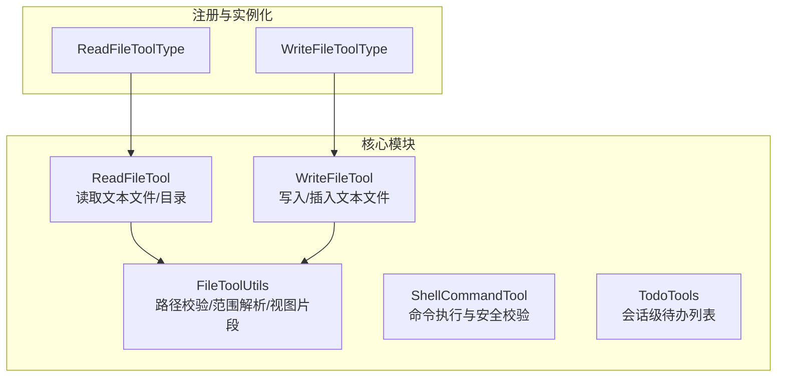
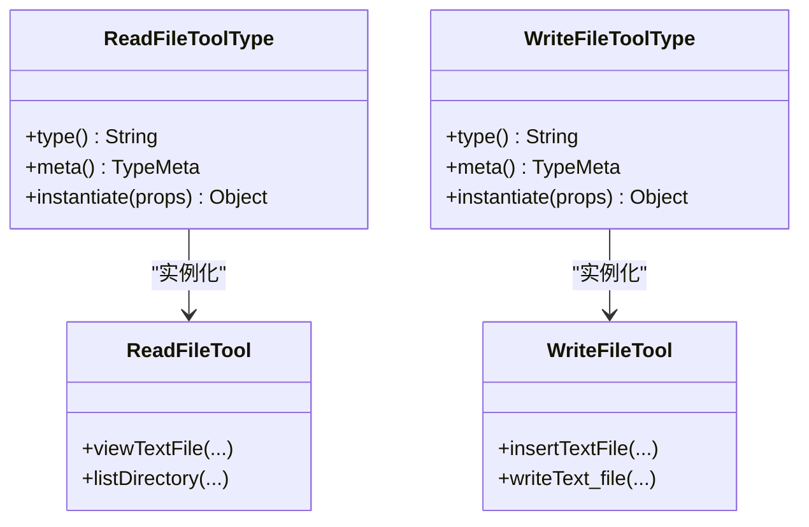
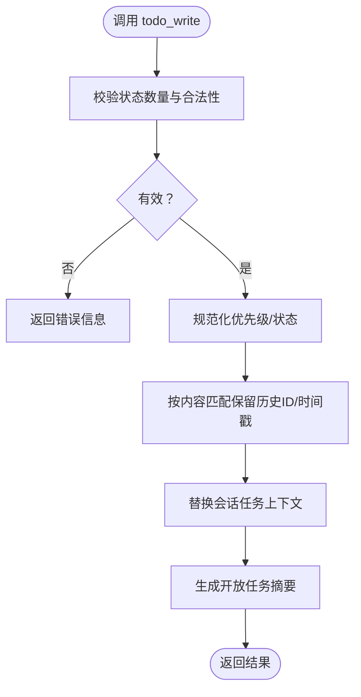
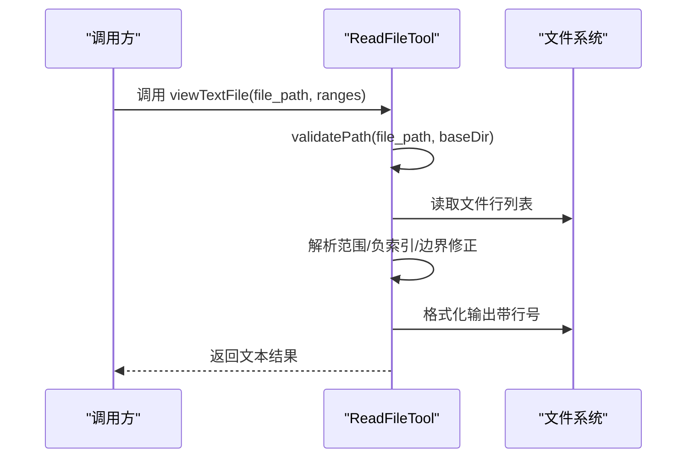
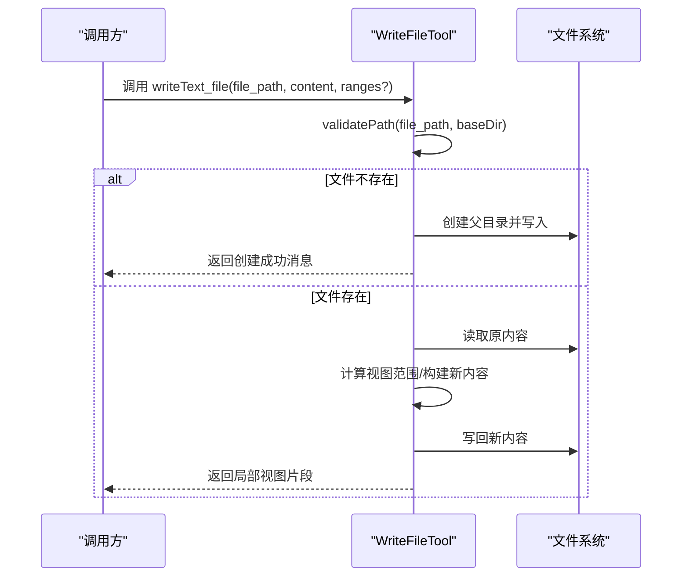
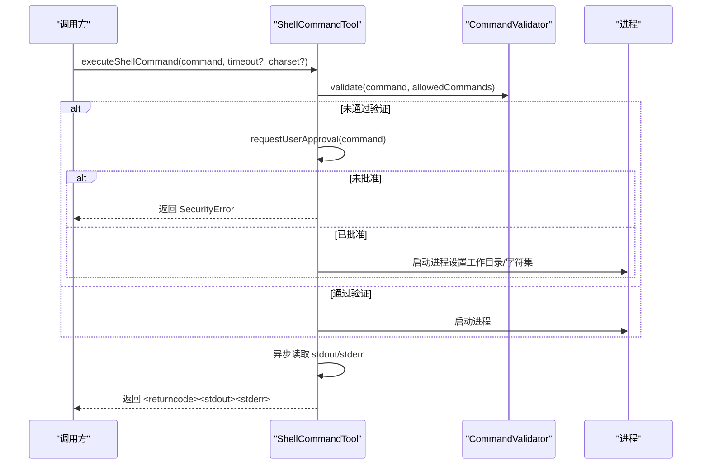
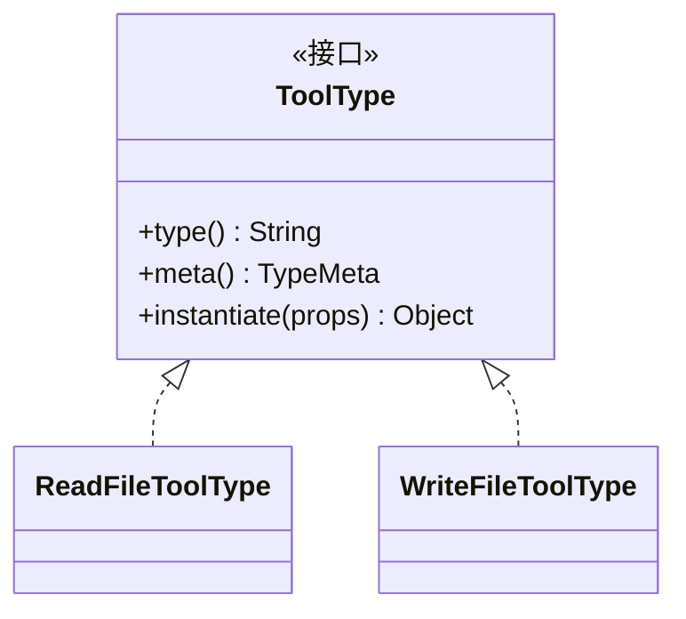
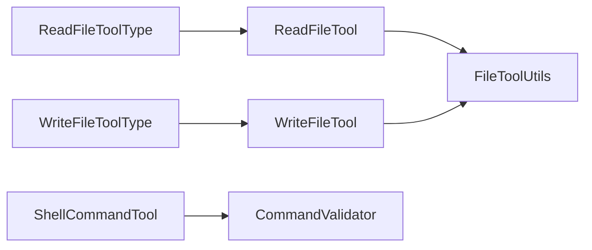

# 内置工具

<cite>
**本文引用的文件**
- [ReadFileTool.java](file://agentscope-core/src/main/java/io/agentscope/core/tool/file/ReadFileTool.java)
- [WriteFileTool.java](file://agentscope-core/src/main/java/io/agentscope/core/tool/file/WriteFileTool.java)
- [FileToolUtils.java](file://agentscope-core/src/main/java/io/agentscope/core/tool/file/FileToolUtils.java)
- [ShellCommandTool.java](file://agentscope-core/src/main/java/io/agentscope/core/tool/coding/ShellCommandTool.java)
- [TodoTools.java](file://agentscope-core/src/main/java/io/agentscope/core/tool/builtin/TodoTools.java)
- [ReadFileToolType.java](file://agentscope-builder-saton/src/main/java/io/agentscope/builder/saton/factory/service/tool/impl/ReadFileToolType.java)
- [WriteFileToolType.java](file://agentscope-builder-saton/src/main/java/io/agentscope/builder/saton/factory/service/tool/impl/WriteFileToolType.java)
- [ToolFactoryTest.java](file://agentscope-builder-saton/src/test/java/io/agentscope/builder/saton/factory/service/tool/ToolFactoryTest.java)
- [filesystem.md](file://docs/v1/en/docs/harness/filesystem.md)
</cite>

## 目录
1. [简介](#简介)
2. [项目结构](#项目结构)
3. [核心组件](#核心组件)
4. [架构总览](#架构总览)
5. [详细组件分析](#详细组件分析)
6. [依赖分析](#依赖分析)
7. [性能考虑](#性能考虑)
8. [故障排查指南](#故障排查指南)
9. [结论](#结论)
10. [附录](#附录)

## 简介
本文件为 AgentScope 内置工具集合的完整 API 参考与设计说明，重点覆盖以下工具与能力：
- 待办事项工具：TodoTools 的功能特性、使用方法与状态管理规则
- 文件读写工具：ReadFileTool 与 WriteFileTool 的操作接口、范围选择与安全限制
- 命令执行工具：ShellCommandTool 的白名单、审批回调、超时与字符集等配置
- 设计原则与扩展机制：基于注解与工厂的统一注册与实例化模式
- 安全策略与权限控制：路径校验、工作目录限制、命令白名单与输出格式化
- 与自定义工具的集成与替代策略：通过类型元数据与参数模式对接

## 项目结构
内置工具主要位于 agentscope-core 模块的 tool 子包中，并在 agentscope-builder-saton 中提供类型注册与实例化能力。文件系统相关工具与安全限制在文档中有进一步说明。

**图表来源**
- [ReadFileTool.java:48-357](file://agentscope-core/src/main/java/io/agentscope/core/tool/file/ReadFileTool.java#L48-L357)
- [WriteFileTool.java:43-406](file://agentscope-core/src/main/java/io/agentscope/core/tool/file/WriteFileTool.java#L43-L406)
- [FileToolUtils.java:28-161](file://agentscope-core/src/main/java/io/agentscope/core/tool/file/FileToolUtils.java#L28-L161)
- [ShellCommandTool.java:73-800](file://agentscope-core/src/main/java/io/agentscope/core/tool/coding/ShellCommandTool.java#L73-L800)
- [TodoTools.java:49-262](file://agentscope-core/src/main/java/io/agentscope/core/tool/builtin/TodoTools.java#L49-L262)
- [ReadFileToolType.java:12-45](file://agentscope-builder-saton/src/main/java/io/agentscope/builder/saton/factory/service/tool/impl/ReadFileToolType.java#L12-L45)
- [WriteFileToolType.java:12-37](file://agentscope-builder-saton/src/main/java/io/agentscope/builder/saton/factory/service/tool/impl/WriteFileToolType.java#L12-L37)

**章节来源**
- [ReadFileTool.java:1-357](file://agentscope-core/src/main/java/io/agentscope/core/tool/file/ReadFileTool.java#L1-L357)
- [WriteFileTool.java:1-406](file://agentscope-core/src/main/java/io/agentscope/core/tool/file/WriteFileTool.java#L1-L406)
- [FileToolUtils.java:1-161](file://agentscope-core/src/main/java/io/agentscope/core/tool/file/FileToolUtils.java#L1-L161)
- [ShellCommandTool.java:1-800](file://agentscope-core/src/main/java/io/agentscope/core/tool/coding/ShellCommandTool.java#L1-L800)
- [TodoTools.java:1-262](file://agentscope-core/src/main/java/io/agentscope/core/tool/builtin/TodoTools.java#L1-L262)
- [ReadFileToolType.java:1-45](file://agentscope-builder-saton/src/main/java/io/agentscope/builder/saton/factory/service/tool/impl/ReadFileToolType.java#L1-L45)
- [WriteFileToolType.java:1-37](file://agentscope-builder-saton/src/main/java/io/agentscope/builder/saton/factory/service/tool/impl/WriteFileToolType.java#L1-L37)

## 核心组件
- 待办事项工具（TodoTools）
  - 提供 todo_write 接口，接收“完整更新后的待办列表”，替换当前会话上下文中的任务集合
  - 强制单个进行中任务约束，支持状态：pending、in_progress、completed；支持优先级字段
  - 结合中间件自动回显最新列表，持久化于 AgentStateStore
- 文件读取工具（ReadFileTool）
  - 支持查看指定行范围或末尾若干行，支持目录枚举
  - 可选 baseDir 限制，防止路径穿越；路径校验由 FileToolUtils 统一处理
- 文件写入工具（WriteFileTool）
  - 支持整文件覆盖、按行范围替换、在指定行号插入内容
  - 新建文件时自动创建父目录；变更后返回局部视图片段用于确认
- 命令执行工具（ShellCommandTool）
  - 平台化命令验证器（Windows/Unix），默认 UTF-8 输出解码
  - 白名单控制、多命令分隔符检测、用户审批回调、超时控制、异步流读取避免死锁
  - 可配置工作目录与字符集，输出以特定 XML 标签包裹返回

**章节来源**
- [TodoTools.java:49-262](file://agentscope-core/src/main/java/io/agentscope/core/tool/builtin/TodoTools.java#L49-L262)
- [ReadFileTool.java:48-357](file://agentscope-core/src/main/java/io/agentscope/core/tool/file/ReadFileTool.java#L48-L357)
- [WriteFileTool.java:43-406](file://agentscope-core/src/main/java/io/agentscope/core/tool/file/WriteFileTool.java#L43-L406)
- [FileToolUtils.java:28-161](file://agentscope-core/src/main/java/io/agentscope/core/tool/file/FileToolUtils.java#L28-L161)
- [ShellCommandTool.java:73-800](file://agentscope-core/src/main/java/io/agentscope/core/tool/coding/ShellCommandTool.java#L73-L800)

## 架构总览
内置工具通过统一的注解与工厂机制进行注册与实例化，类型元数据描述工具名称、显示名、描述与参数模式，测试用例验证类型注册与模式完整性。

**图表来源**
- [ReadFileToolType.java:12-45](file://agentscope-builder-saton/src/main/java/io/agentscope/builder/saton/factory/service/tool/impl/ReadFileToolType.java#L12-L45)
- [WriteFileToolType.java:12-37](file://agentscope-builder-saton/src/main/java/io/agentscope/builder/saton/factory/service/tool/impl/WriteFileToolType.java#L12-L37)
- [ReadFileTool.java:48-357](file://agentscope-core/src/main/java/io/agentscope/core/tool/file/ReadFileTool.java#L48-L357)
- [WriteFileTool.java:43-406](file://agentscope-core/src/main/java/io/agentscope/core/tool/file/WriteFileTool.java#L43-L406)

**章节来源**
- [ToolFactoryTest.java:16-67](file://agentscope-builder-saton/src/test/java/io/agentscope/builder/saton/factory/service/tool/ToolFactoryTest.java#L16-L67)
- [ReadFileToolType.java:1-45](file://agentscope-builder-saton/src/main/java/io/agentscope/builder/saton/factory/service/tool/impl/ReadFileToolType.java#L1-L45)
- [WriteFileToolType.java:1-37](file://agentscope-builder-saton/src/main/java/io/agentscope/builder/saton/factory/service/tool/impl/WriteFileToolType.java#L1-L37)

## 详细组件分析

### 待办事项工具（TodoTools）
- 功能要点
  - 单接口 todo_write：每次传入完整的新列表，工具内部替换现有任务集合
  - 状态约束：同一时刻仅允许一个 in_progress 任务；状态值需合法
  - 优先级：支持 high/medium/low，保留到任务元数据
  - 渲染输出：统计开放任务数并以 Markdown 风格标记展示
- 使用建议
  - 当任务步骤较多或需要持续跟踪进度时启用
  - 完成一步即刻更新状态，避免批量完成导致状态不一致
- 参数与行为
  - 输入：List<TodoItem>，包含 content/status/priority
  - 输出：渲染后的文本摘要，便于模型与用户确认

**图表来源**
- [TodoTools.java:92-173](file://agentscope-core/src/main/java/io/agentscope/core/tool/builtin/TodoTools.java#L92-L173)

**章节来源**
- [TodoTools.java:49-262](file://agentscope-core/src/main/java/io/agentscope/core/tool/builtin/TodoTools.java#L49-L262)

### 文件读取工具（ReadFileTool）
- 能力概览
  - 查看文件全文或指定行范围（含负索引从末尾开始）
  - 列出目录内容，返回绝对路径清单
- 安全与限制
  - 可选 baseDir 限制访问范围，防止路径穿越
  - 路径解析与校验由 FileToolUtils.validatePath 执行
- 典型场景
  - 日志/配置文件检查、代码片段审阅、目录结构探索

**图表来源**
- [ReadFileTool.java:89-215](file://agentscope-core/src/main/java/io/agentscope/core/tool/file/ReadFileTool.java#L89-L215)
- [FileToolUtils.java:49-79](file://agentscope-core/src/main/java/io/agentscope/core/tool/file/FileToolUtils.java#L49-L79)

**章节来源**
- [ReadFileTool.java:48-357](file://agentscope-core/src/main/java/io/agentscope/core/tool/file/ReadFileTool.java#L48-L357)
- [FileToolUtils.java:28-161](file://agentscope-core/src/main/java/io/agentscope/core/tool/file/FileToolUtils.java#L28-L161)

### 文件写入工具（WriteFileTool）
- 能力概览
  - 整文件覆盖：未提供范围时直接覆盖
  - 行范围替换：在 [start,end] 区间内替换内容
  - 插入内容：在指定行号插入新行，其余行下移
- 安全与限制
  - 可选 baseDir 限制访问范围
  - 新建文件时自动创建父目录
  - 返回局部视图片段用于确认变更前后对比
- 最佳实践
  - 大范围替换前先确认原文件长度变化，利用视图片段核对
  - 插入行号越界时自动追加至末尾，避免意外截断

**图表来源**
- [WriteFileTool.java:244-393](file://agentscope-core/src/main/java/io/agentscope/core/tool/file/WriteFileTool.java#L244-L393)
- [FileToolUtils.java:118-159](file://agentscope-core/src/main/java/io/agentscope/core/tool/file/FileToolUtils.java#L118-L159)

**章节来源**
- [WriteFileTool.java:43-406](file://agentscope-core/src/main/java/io/agentscope/core/tool/file/WriteFileTool.java#L43-L406)
- [FileToolUtils.java:28-161](file://agentscope-core/src/main/java/io/agentscope/core/tool/file/FileToolUtils.java#L28-L161)

### 命令执行工具（ShellCommandTool）
- 安全特性
  - 平台化命令验证器（Windows/Unix），默认 UTF-8 输出解码
  - 白名单控制与多命令分隔符检测，阻止命令拼接攻击
  - 用户审批回调：非白名单命令需经人工批准
  - 工作目录限制：可限定命令执行的工作目录
- 性能与可靠性
  - 异步流读取线程池，避免 stdout/stderr 缓冲区阻塞导致死锁
  - 超时控制，默认 300 秒，异常时强制终止进程并返回部分输出
  - 字符集可按命令覆盖，适配不同编码环境
- 输出格式
  - 返回 XML 标签包裹的 returncode/stdout/stderr，便于上层解析

**图表来源**
- [ShellCommandTool.java:425-542](file://agentscope-core/src/main/java/io/agentscope/core/tool/coding/ShellCommandTool.java#L425-L542)
- [ShellCommandTool.java:552-719](file://agentscope-core/src/main/java/io/agentscope/core/tool/coding/ShellCommandTool.java#L552-L719)

**章节来源**
- [ShellCommandTool.java:73-800](file://agentscope-core/src/main/java/io/agentscope/core/tool/coding/ShellCommandTool.java#L73-L800)

### 设计原则与扩展机制
- 注解驱动：工具方法通过 @Tool 注解暴露名称、描述与只读/并发安全属性
- 工厂与类型：通过 ToolType 实现类注册工具类型与参数模式，工厂根据类型与属性实例化具体工具
- 统一模式：类型元数据包含 displayName/description/schema，确保前端与运行时一致
- 测试保障：单元测试验证类型注册、模式完整性与实例化行为

**图表来源**
- [ReadFileToolType.java:12-45](file://agentscope-builder-saton/src/main/java/io/agentscope/builder/saton/factory/service/tool/impl/ReadFileToolType.java#L12-L45)
- [WriteFileToolType.java:12-37](file://agentscope-builder-saton/src/main/java/io/agentscope/builder/saton/factory/service/tool/impl/WriteFileToolType.java#L12-L37)

**章节来源**
- [ToolFactoryTest.java:16-67](file://agentscope-builder-saton/src/test/java/io/agentscope/builder/saton/factory/service/tool/ToolFactoryTest.java#L16-L67)
- [ReadFileToolType.java:1-45](file://agentscope-builder-saton/src/main/java/io/agentscope/builder/saton/factory/service/tool/impl/ReadFileToolType.java#L1-L45)
- [WriteFileToolType.java:1-37](file://agentscope-builder-saton/src/main/java/io/agentscope/builder/saton/factory/service/tool/impl/WriteFileToolType.java#L1-L37)

## 依赖分析
- ReadFileTool 与 WriteFileTool 共享 FileToolUtils 进行路径校验、范围解析与视图片段生成
- ShellCommandTool 依赖平台化命令验证器与异步流读取线程池，保证安全性与稳定性
- 类型注册与实例化依赖 Spring 组件扫描与工厂模式，测试用例验证类型与模式一致性

**图表来源**
- [ReadFileTool.java:48-357](file://agentscope-core/src/main/java/io/agentscope/core/tool/file/ReadFileTool.java#L48-L357)
- [WriteFileTool.java:43-406](file://agentscope-core/src/main/java/io/agentscope/core/tool/file/WriteFileTool.java#L43-L406)
- [FileToolUtils.java:28-161](file://agentscope-core/src/main/java/io/agentscope/core/tool/file/FileToolUtils.java#L28-L161)
- [ShellCommandTool.java:73-800](file://agentscope-core/src/main/java/io/agentscope/core/tool/coding/ShellCommandTool.java#L73-L800)
- [ReadFileToolType.java:12-45](file://agentscope-builder-saton/src/main/java/io/agentscope/builder/saton/factory/service/tool/impl/ReadFileType.java#L12-L45)
- [WriteFileToolType.java:12-37](file://agentscope-builder-saton/src/main/java/io/agentscope/builder/saton/factory/service/tool/impl/WriteFileToolType.java#L12-L37)

**章节来源**
- [ReadFileTool.java:1-357](file://agentscope-core/src/main/java/io/agentscope/core/tool/file/ReadFileTool.java#L1-L357)
- [WriteFileTool.java:1-406](file://agentscope-core/src/main/java/io/agentscope/core/tool/file/WriteFileTool.java#L1-L406)
- [FileToolUtils.java:1-161](file://agentscope-core/src/main/java/io/agentscope/core/tool/file/FileToolUtils.java#L1-L161)
- [ShellCommandTool.java:1-800](file://agentscope-core/src/main/java/io/agentscope/core/tool/coding/ShellCommandTool.java#L1-L800)
- [ReadFileToolType.java:1-45](file://agentscope-builder-saton/src/main/java/io/agentscope/builder/saton/factory/service/tool/impl/ReadFileToolType.java#L1-L45)
- [WriteFileToolType.java:1-37](file://agentscope-builder-saton/src/main/java/io/agentscope/builder/saton/factory/service/tool/impl/WriteFileToolType.java#L1-L37)

## 性能考虑
- 文件读写
  - 大文件读取建议使用行范围查询，避免一次性加载全部内容
  - 写入大范围替换时，建议先计算视图范围，减少不必要的字符串拼接
- 命令执行
  - 设置合理超时，避免长时间阻塞
  - 对可能产生大量输出的命令，注意 stdout/stderr 异步读取带来的内存占用
  - 在 Windows/Unix 环境下根据实际编码选择合适的字符集

[本节为通用指导，无需列出具体文件来源]

## 故障排查指南
- 路径访问被拒绝
  - 现象：抛出访问被拒绝或路径为空的异常
  - 排查：确认 baseDir 是否正确设置；相对路径是否在 baseDir 下
  - 参考：路径校验逻辑与异常信息
- 范围格式无效
  - 现象：返回范围格式错误提示
  - 排查：确认范围字符串格式为 "[start,end]" 或 "start,end"
- 命令未获批准
  - 现象：返回 SecurityError，stderr 包含原因
  - 排查：检查白名单配置与审批回调是否正确设置
- 命令超时
  - 现象：返回 TimeoutError，stderr 包含超时信息
  - 排查：适当提高超时阈值或优化命令执行逻辑
- 输出乱码
  - 现象：命令输出出现乱码
  - 排查：在调用时覆盖字符集，或在构造函数中设置合适的字符集

**章节来源**
- [FileToolUtils.java:49-79](file://agentscope-core/src/main/java/io/agentscope/core/tool/file/FileToolUtils.java#L49-L79)
- [ReadFileTool.java:154-162](file://agentscope-core/src/main/java/io/agentscope/core/tool/file/ReadFileTool.java#L154-L162)
- [WriteFileTool.java:315-324](file://agentscope-core/src/main/java/io/agentscope/core/tool/file/WriteFileTool.java#L315-L324)
- [ShellCommandTool.java:502-520](file://agentscope-core/src/main/java/io/agentscope/core/tool/coding/ShellCommandTool.java#L502-L520)
- [ShellCommandTool.java:525-541](file://agentscope-core/src/main/java/io/agentscope/core/tool/coding/ShellCommandTool.java#L525-L541)
- [ShellCommandTool.java:432-441](file://agentscope-core/src/main/java/io/agentscope/core/tool/coding/ShellCommandTool.java#L432-L441)

## 结论
AgentScope 内置工具以统一的注解与工厂机制实现标准化注册与实例化，围绕安全（路径限制、命令白名单、审批回调）与可用性（范围查询、视图片段、异步流读取）构建了稳健的工具体系。通过 TodoTools 的会话级任务管理与 Read/Write File 工具的文本操作能力，以及 ShellCommandTool 的安全命令执行，能够满足多数自动化与开发辅助场景的需求。建议在生产环境中始终启用白名单与审批流程，并结合 baseDir 与工作目录限制强化沙箱安全。

[本节为总结性内容，无需列出具体文件来源]

## 附录

### 安全策略与权限控制
- 路径与目录限制
  - baseDir 限制：所有文件操作限定在 baseDir 内，防止路径穿越
  - 目录枚举：仅返回绝对路径，避免泄露内部结构
- 命令执行安全
  - 白名单：仅允许预设命令直接执行
  - 多命令检测：阻断 "&", "|", ";" 等拼接攻击
  - 审批回调：非白名单命令需人工批准
  - 工作目录：可限定命令执行目录
- 输出与字符集
  - 命令输出统一标签包裹，便于解析
  - 支持按命令覆盖字符集，适配不同编码

**章节来源**
- [ReadFileTool.java:56-77](file://agentscope-core/src/main/java/io/agentscope/core/tool/file/ReadFileTool.java#L56-L77)
- [WriteFileTool.java:51-72](file://agentscope-core/src/main/java/io/agentscope/core/tool/file/WriteFileTool.java#L51-L72)
- [ShellCommandTool.java:100-222](file://agentscope-core/src/main/java/io/agentscope/core/tool/coding/ShellCommandTool.java#L100-L222)
- [filesystem.md:40-74](file://docs/v1/en/docs/harness/filesystem.md#L40-L74)

### 使用示例与最佳实践
- 待办事项
  - 场景：多步骤任务规划与进度跟踪
  - 建议：保持单个 in_progress 任务，完成后立即更新状态
- 文件读取
  - 场景：查看日志/配置片段、目录结构探索
  - 建议：使用行范围查询大文件，避免全量读取
- 文件写入
  - 场景：批量替换、插入新内容
  - 建议：先确认范围与行号，利用视图片段核对变更
- 命令执行
  - 场景：系统运维脚本、构建命令
  - 建议：配置白名单与审批回调，设置合理超时与字符集

[本节为通用指导，无需列出具体文件来源]

### 与自定义工具的集成与替代策略
- 集成方式
  - 通过 ToolType 实现类注册自定义工具类型与参数模式
  - 工厂根据类型与属性实例化工具，保持与内置工具一致的生命周期与调度
- 替代策略
  - 若内置工具无法满足需求，可基于相同注解与接口规范实现自定义工具
  - 保持参数模式与输出格式一致，便于前端与上层系统复用

**章节来源**
- [ReadFileToolType.java:12-45](file://agentscope-builder-saton/src/main/java/io/agentscope/builder/saton/factory/service/tool/impl/ReadFileToolType.java#L12-L45)
- [WriteFileToolType.java:12-37](file://agentscope-builder-saton/src/main/java/io/agentscope/builder/saton/factory/service/tool/impl/WriteFileToolType.java#L12-L37)
- [ToolFactoryTest.java:22-38](file://agentscope-builder-saton/src/test/java/io/agentscope/builder/saton/factory/service/tool/ToolFactoryTest.java#L22-L38)