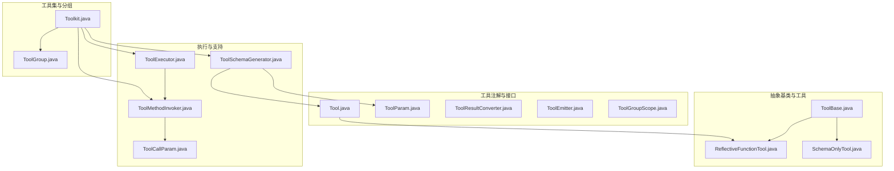
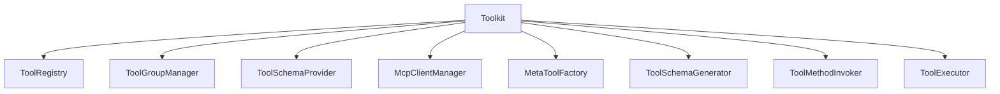
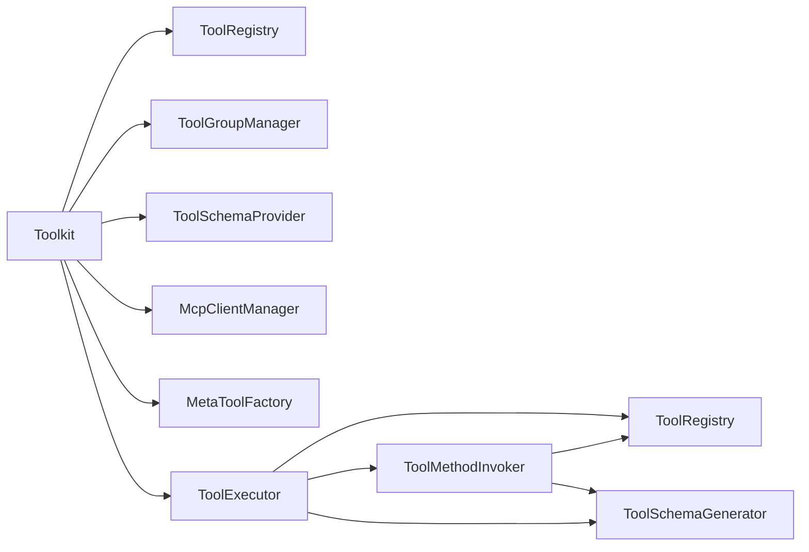
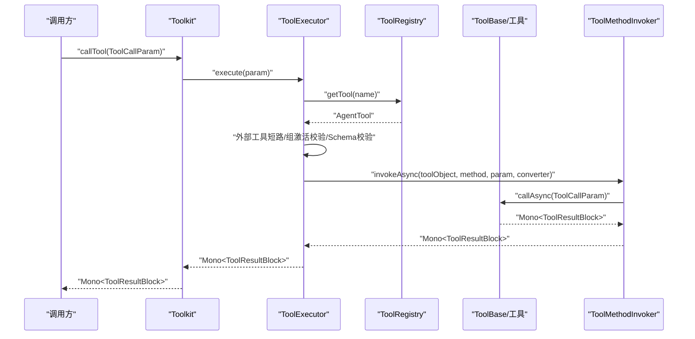

# 工具API

<cite>
**本文引用的文件**
- [Tool.java](file://agentscope-core/src/main/java/io/agentscope/core/tool/Tool.java)
- [ToolBase.java](file://agentscope-core/src/main/java/io/agentscope/core/tool/ToolBase.java)
- [Toolkit.java](file://agentscope-core/src/main/java/io/agentscope/core/tool/Toolkit.java)
- [ToolGroup.java](file://agentscope-core/src/main/java/io/agentscope/core/tool/ToolGroup.java)
- [ToolParam.java](file://agentscope-core/src/main/java/io/agentscope/core/tool/ToolParam.java)
- [ToolResultConverter.java](file://agentscope-core/src/main/java/io/agentscope/core/tool/ToolResultConverter.java)
- [ReflectiveFunctionTool.java](file://agentscope-core/src/main/java/io/agentscope/core/tool/ReflectiveFunctionTool.java)
- [SchemaOnlyTool.java](file://agentscope-core/src/main/java/io/agentscope/core/tool/SchemaOnlyTool.java)
- [ToolCallParam.java](file://agentscope-core/src/main/java/io/agentscope/core/tool/ToolCallParam.java)
- [ToolEmitter.java](file://agentscope-core/src/main/java/io/agentscope/core/tool/ToolEmitter.java)
- [ToolExecutor.java](file://agentscope-core/src/main/java/io/agentscope/core/tool/ToolExecutor.java)
- [ToolMethodInvoker.java](file://agentscope-core/src/main/java/io/agentscope/core/tool/ToolMethodInvoker.java)
- [ToolSchemaGenerator.java](file://agentscope-core/src/main/java/io/agentscope/core/tool/ToolSchemaGenerator.java)
- [ToolGroupScope.java](file://agentscope-core/src/main/java/io/agentscope/core/tool/ToolGroupScope.java)
</cite>

## 目录
1. [简介](#简介)
2. [项目结构](#项目结构)
3. [核心组件](#核心组件)
4. [架构总览](#架构总览)
5. [详细组件分析](#详细组件分析)
6. [依赖分析](#依赖分析)
7. [性能考虑](#性能考虑)
8. [故障排查指南](#故障排查指南)
9. [结论](#结论)
10. [附录](#附录)

## 简介
本文件为 AgentScope 工具系统的完整 API 参考，覆盖 Tool 接口、ToolBase 基类、Toolkit 工具集、ToolGroup 组管理、工具函数与反射工具、工具执行上下文、工具验证与结果转换、以及流式处理等关键能力。文档面向开发者与集成者，既提供高层概览也给出代码级细节与可视化图示，帮助快速理解与正确使用工具体系。

## 项目结构
工具模块位于 agentscope-core 模块下，核心文件包括：
- 注解与接口：Tool、ToolParam、ToolResultConverter、ToolEmitter、ToolGroupScope
- 抽象基类：ToolBase
- 工具集与分组：Toolkit、ToolGroup
- 执行与调度：ToolExecutor、ToolMethodInvoker、ToolSchemaGenerator
- 特殊工具：ReflectiveFunctionTool（注解驱动）、SchemaOnlyTool（外部工具）
- 调用参数：ToolCallParam

图表来源
- [Tool.java:1-194](file://agentscope-core/src/main/java/io/agentscope/core/tool/Tool.java#L1-L194)
- [ToolParam.java:1-105](file://agentscope-core/src/main/java/io/agentscope/core/tool/ToolParam.java#L1-L105)
- [ToolResultConverter.java:1-59](file://agentscope-core/src/main/java/io/agentscope/core/tool/ToolResultConverter.java#L1-L59)
- [ToolEmitter.java:1-72](file://agentscope-core/src/main/java/io/agentscope/core/tool/ToolEmitter.java#L1-L72)
- [ToolGroupScope.java:1-43](file://agentscope-core/src/main/java/io/agentscope/core/tool/ToolGroupScope.java#L1-L43)
- [ToolBase.java:1-342](file://agentscope-core/src/main/java/io/agentscope/core/tool/ToolBase.java#L1-L342)
- [ReflectiveFunctionTool.java:1-175](file://agentscope-core/src/main/java/io/agentscope/core/tool/ReflectiveFunctionTool.java#L1-L175)
- [SchemaOnlyTool.java:1-140](file://agentscope-core/src/main/java/io/agentscope/core/tool/SchemaOnlyTool.java#L1-L140)
- [Toolkit.java:1-1032](file://agentscope-core/src/main/java/io/agentscope/core/tool/Toolkit.java#L1-L1032)
- [ToolGroup.java:1-258](file://agentscope-core/src/main/java/io/agentscope/core/tool/ToolGroup.java#L1-L258)
- [ToolExecutor.java:1-487](file://agentscope-core/src/main/java/io/agentscope/core/tool/ToolExecutor.java#L1-L487)
- [ToolMethodInvoker.java:1-400](file://agentscope-core/src/main/java/io/agentscope/core/tool/ToolMethodInvoker.java#L1-L400)
- [ToolSchemaGenerator.java:1-153](file://agentscope-core/src/main/java/io/agentscope/core/tool/ToolSchemaGenerator.java#L1-L153)
- [ToolCallParam.java:1-260](file://agentscope-core/src/main/java/io/agentscope/core/tool/ToolCallParam.java#L1-L260)

章节来源
- [Toolkit.java:37-65](file://agentscope-core/src/main/java/io/agentscope/core/tool/Toolkit.java#L37-L65)

## 核心组件
- Tool 注解：用于标注可被代理调用的方法，声明名称、描述、严格模式、只读、并发安全、外部工具、状态注入、危险路径配置及结果转换器。
- ToolParam 注解：为工具方法参数提供元数据（名称、是否必需、描述），用于生成 JSON Schema。
- ToolResultConverter 接口：自定义工具返回值到 ToolResultBlock 的转换逻辑。
- ToolEmitter 接口：在工具执行期间发送中间进度/消息，不参与 LLM 结果。
- ToolBase 抽象类：实现 AgentTool，提供权限检查、规则匹配、危险路径检测、构建器等能力。
- Toolkit 工具集：统一注册、检索、执行工具；管理工具组、MCP 客户端、元工具；提供流式回调、执行配置。
- ToolGroup 工具组：命名工具集合，支持激活状态与作用域（META/EXTERNAL）。
- ReflectiveFunctionTool：基于 @Tool 注解生成的工具包装，桥接注解与 ToolBase 合约。
- SchemaOnlyTool：仅含 Schema 的外部工具，触发挂起以交由外部执行。
- ToolExecutor：统一执行器，负责单/批量执行、超时重试、并发分区、关闭保护、流式回调合并。
- ToolMethodInvoker：反射调用与参数转换，自动注入 ToolEmitter、Agent、RuntimeContext、AgentState 等。
- ToolSchemaGenerator：从方法签名生成 JSON Schema，支持泛型与 $defs 提升。
- ToolCallParam：封装工具调用所需参数（ToolUseBlock、输入、Agent、运行时上下文、发射器）。

章节来源
- [Tool.java:24-194](file://agentscope-core/src/main/java/io/agentscope/core/tool/Tool.java#L24-L194)
- [ToolParam.java:24-105](file://agentscope-core/src/main/java/io/agentscope/core/tool/ToolParam.java#L24-L105)
- [ToolResultConverter.java:21-59](file://agentscope-core/src/main/java/io/agentscope/core/tool/ToolResultConverter.java#L21-L59)
- [ToolEmitter.java:20-72](file://agentscope-core/src/main/java/io/agentscope/core/tool/ToolEmitter.java#L20-L72)
- [ToolBase.java:34-342](file://agentscope-core/src/main/java/io/agentscope/core/tool/ToolBase.java#L34-L342)
- [Toolkit.java:37-1032](file://agentscope-core/src/main/java/io/agentscope/core/tool/Toolkit.java#L37-L1032)
- [ToolGroup.java:22-258](file://agentscope-core/src/main/java/io/agentscope/core/tool/ToolGroup.java#L22-L258)
- [ReflectiveFunctionTool.java:28-175](file://agentscope-core/src/main/java/io/agentscope/core/tool/ReflectiveFunctionTool.java#L28-L175)
- [SchemaOnlyTool.java:26-140](file://agentscope-core/src/main/java/io/agentscope/core/tool/SchemaOnlyTool.java#L26-L140)
- [ToolExecutor.java:40-487](file://agentscope-core/src/main/java/io/agentscope/core/tool/ToolExecutor.java#L40-L487)
- [ToolMethodInvoker.java:34-400](file://agentscope-core/src/main/java/io/agentscope/core/tool/ToolMethodInvoker.java#L34-L400)
- [ToolSchemaGenerator.java:28-153](file://agentscope-core/src/main/java/io/agentscope/core/tool/ToolSchemaGenerator.java#L28-L153)
- [ToolCallParam.java:26-260](file://agentscope-core/src/main/java/io/agentscope/core/tool/ToolCallParam.java#L26-L260)

## 架构总览
工具系统围绕 Toolkit 展开，通过注册器、分组管理器、Schema 提供器、MCP 管理器协同工作；执行链路由 ToolExecutor 驱动，结合 ToolMethodInvoker 进行反射调用与参数转换，并通过 ToolResultConverter 输出标准化结果。

图表来源
- [Toolkit.java:66-117](file://agentscope-core/src/main/java/io/agentscope/core/tool/Toolkit.java#L66-L117)

章节来源
- [Toolkit.java:37-117](file://agentscope-core/src/main/java/io/agentscope/core/tool/Toolkit.java#L37-L117)

## 详细组件分析

### Tool 注解与 ToolParam 参数注解
- Tool 注解关键属性
  - name：工具名，默认使用方法名；建议 snake_case。
  - description：工具描述，用于 LLM 决策。
  - strict：启用严格模式，增强参数 Schema 强制性。
  - readOnly：只读工具，便于权限策略。
  - concurrencySafe：并发安全标记，影响并行执行策略。
  - externalTool：外部工具标记，触发挂起而非本地执行。
  - stateInjected：是否注入 AgentState。
  - dangerousFiles/dangerousDirectories：敏感文件/目录白名单扩展。
  - converter：自定义结果转换器类型。
- ToolParam 关键属性
  - name：必需，参数名（Java 不保留运行时常量名时必须显式指定）。
  - required：是否必需。
  - description：参数描述，帮助 LLM 选择合适值。

章节来源
- [Tool.java:60-194](file://agentscope-core/src/main/java/io/agentscope/core/tool/Tool.java#L60-L194)
- [ToolParam.java:59-105](file://agentscope-core/src/main/java/io/agentscope/core/tool/ToolParam.java#L59-L105)

### ToolResultConverter 自定义转换器
- 接口职责：将工具方法返回值转换为 ToolResultBlock，便于 LLM 消费。
- 使用方式：在 @Tool 中指定 converter 类型；默认使用 DefaultToolResultConverter。
- 实现要点：控制序列化、过滤敏感信息、添加元数据、压缩大输出等。

章节来源
- [ToolResultConverter.java:21-59](file://agentscope-core/src/main/java/io/agentscope/core/tool/ToolResultConverter.java#L21-L59)
- [Toolkit.java:396-435](file://agentscope-core/src/main/java/io/agentscope/core/tool/Toolkit.java#L396-L435)

### ToolBase 抽象基类与工具安全/权限
- 核心字段：name、description、inputSchema、readOnly、concurrencySafe、externalTool、stateInjected、mcp/mcpName。
- 权限检查：checkPermissions(Map, PermissionContextState) 默认放行，子类可覆盖细粒度策略。
- 规则匹配与建议：matchRule/generateSuggestions 支持基于规则的策略与建议生成。
- 危险路径检测：isDangerousPath 对文件名与路径段进行大小写无关匹配，并解析符号链接。
- 构建器：builder() 提供 fluent 配置，支持危险文件/目录列表定制。

章节来源
- [ToolBase.java:34-342](file://agentscope-core/src/main/java/io/agentscope/core/tool/ToolBase.java#L34-L342)

### ReflectiveFunctionTool 与 SchemaOnlyTool
- ReflectiveFunctionTool
  - 将 @Tool 方法包装为 ToolBase 子类，校验 stateInjected 与方法签名一致性。
  - 生成参数 Schema 并继承 @Tool 的安全/严格标志。
  - 调用委托给 ToolMethodInvoker，支持同步/异步返回类型。
- SchemaOnlyTool
  - 仅包含 Schema 的外部工具，调用时抛出 ToolSuspendException，交由外部执行。

章节来源
- [ReflectiveFunctionTool.java:28-175](file://agentscope-core/src/main/java/io/agentscope/core/tool/ReflectiveFunctionTool.java#L28-L175)
- [SchemaOnlyTool.java:26-140](file://agentscope-core/src/main/java/io/agentscope/core/tool/SchemaOnlyTool.java#L26-L140)

### Toolkit 工具集与工具组管理
- 注册
  - registerTool(Object)：扫描对象中 @Tool 方法或直接注册 AgentTool。
  - registerAgentTool(AgentTool)：注册已实现的工具实例。
  - registerSchema/ registerSchemas：注册外部工具 Schema。
  - registration()：流式注册器，支持组、扩展模型、预设参数、MCP 客户端等。
- 查询与可用性
  - getTool(String)/getToolNames()：按名获取工具或列出所有工具名。
  - isExternalTool(String)：判断是否外部工具。
  - getToolSchemas()/getToolSchemas(Collection)：生成工具 Schema 列表，支持按活跃组过滤。
- 执行
  - callTool(ToolCallParam)：单次执行。
  - callTools(List, ExecutionConfig, Agent, RuntimeContext)：批量执行，支持并行/串行、超时与重试合并配置。
- 流式回调
  - setChunkCallback/BiConsumer：用户回调；setInternalChunkCallback：框架内部回调。
- 工具组
  - createToolGroup(...)：创建组（可指定作用域 META/EXTERNAL）。
  - registerToolGroup(ToolGroup)：注册自定义组实例。
  - updateToolGroups(List, boolean)：批量激活/停用。
  - getActiveGroups/setActiveGroups/getToolGroup(String)：查询与设置活跃组。
  - removeTool/removeToolGroups/removeToolIfSame：删除工具/组。
- 元工具
  - registerMetaTool()：注册 reset_equipped_tools 元工具，允许动态管理组。
- 运行时参数
  - updateToolPresetParameters：动态更新预设参数。
- 深拷贝
  - copy()：深拷贝工具集，保留用户回调。

章节来源
- [Toolkit.java:119-785](file://agentscope-core/src/main/java/io/agentscope/core/tool/Toolkit.java#L119-L785)

### ToolGroup 工具组与 ToolGroupScope
- ToolGroup
  - 名称、描述、激活状态、作用域、工具集合。
  - addTool/removeTool/containsTool：组内工具增删查。
  - copy：深拷贝组。
- ToolGroupScope
  - META：由元工具管理，替换语义（仅保留明确列出的组）。
  - EXTERNAL：由开发者代码管理，不受元工具影响。

章节来源
- [ToolGroup.java:22-258](file://agentscope-core/src/main/java/io/agentscope/core/tool/ToolGroup.java#L22-L258)
- [ToolGroupScope.java:18-43](file://agentscope-core/src/main/java/io/agentscope/core/tool/ToolGroupScope.java#L18-L43)

### ToolCallParam 工具调用参数
- 字段：toolUseBlock、input、agent、runtimeContext、emitter。
- 构建器：builder()/builder(ToolCallParam) 支持复制与修改。
- 兼容性：getContext() 已废弃，推荐使用 getRuntimeContext()。

章节来源
- [ToolCallParam.java:26-260](file://agentscope-core/src/main/java/io/agentscope/core/tool/ToolCallParam.java#L26-L260)

### ToolExecutor 执行器与并发/超时/重试
- 单次执行 execute(ToolCallParam)：查找工具、外部工具短路、组激活校验、Schema 校验、上下文合并、参数合并、调用工具、异常转 ToolResultBlock。
- 批量执行 executeAll(...)：支持并行/串行、安全工具连续并发、关闭保护、超时与重试。
- 回调合并：用户回调与内部回调可同时存在，互不影响。
- 调度：默认使用 boundedElastic，也可传入自定义 ExecutorService。

章节来源
- [ToolExecutor.java:58-487](file://agentscope-core/src/main/java/io/agentscope/core/tool/ToolExecutor.java#L58-L487)

### ToolMethodInvoker 反射调用与参数转换
- 返回类型支持：同步、CompletableFuture、Mono。
- 自动注入：ToolEmitter、Agent、AgentState（优先来自 RuntimeContext）、RuntimeContext、ToolExecutionContext（已废弃）。
- 用户上下文 POJO：非 @ToolParam、非基础类型、非框架消息类型的参数从 RuntimeContext 解析。
- 类型转换：优先使用 JsonCodec 保持泛型，回退字符串到基本类型的解析。
- 错误处理：捕获 ToolSuspendException 并上抛，其余错误包装为 ToolResultBlock.error。

章节来源
- [ToolMethodInvoker.java:34-400](file://agentscope-core/src/main/java/io/agentscope/core/tool/ToolMethodInvoker.java#L34-L400)

### ToolSchemaGenerator Schema 生成
- 从方法签名提取参数，生成 OpenAI 兼容的 JSON Schema。
- 支持泛型类型与 $defs 提升，避免重复定义冲突。
- 支持排除参数（如预设参数）不出现在 Schema 中。

章节来源
- [ToolSchemaGenerator.java:28-153](file://agentscope-core/src/main/java/io/agentscope/core/tool/ToolSchemaGenerator.java#L28-L153)

### 流式处理与工具发射
- ToolEmitter：工具执行期间发送中间块到钩子，不参与 LLM 结果。
- 回调合并：用户回调与内部回调分别触发，互不阻塞。
- 挂起机制：外部工具抛出 ToolSuspendException，由执行器转换为 Suspended 结果。

章节来源
- [ToolEmitter.java:20-72](file://agentscope-core/src/main/java/io/agentscope/core/tool/ToolEmitter.java#L20-L72)
- [ToolExecutor.java:122-157](file://agentscope-core/src/main/java/io/agentscope/core/tool/ToolExecutor.java#L122-L157)

## 依赖分析
- Toolkit 作为门面，聚合多个子系统：注册器、分组管理器、Schema 提供器、MCP 管理器、元工具工厂与执行器。
- ReflectiveFunctionTool 与 SchemaOnlyTool 均继承 ToolBase，复用权限与安全能力。
- ToolExecutor 依赖 ToolRegistry、ToolGroupManager、ToolMethodInvoker、ToolResultConverter。
- ToolMethodInvoker 依赖 ToolResultConverter、JsonUtils、异常工具与类型信息。

图表来源
- [Toolkit.java:66-117](file://agentscope-core/src/main/java/io/agentscope/core/tool/Toolkit.java#L66-L117)
- [ToolExecutor.java:58-95](file://agentscope-core/src/main/java/io/agentscope/core/tool/ToolExecutor.java#L58-L95)
- [ToolMethodInvoker.java:34-44](file://agentscope-core/src/main/java/io/agentscope/core/tool/ToolMethodInvoker.java#L34-L44)

章节来源
- [Toolkit.java:66-117](file://agentscope-core/src/main/java/io/agentscope/core/tool/Toolkit.java#L66-L117)
- [ToolExecutor.java:58-95](file://agentscope-core/src/main/java/io/agentscope/core/tool/ToolExecutor.java#L58-L95)
- [ToolMethodInvoker.java:34-44](file://agentscope-core/src/main/java/io/agentscope/core/tool/ToolMethodInvoker.java#L34-L44)

## 性能考虑
- 并发安全：concurrencySafe=true 的工具在并行模式下可连续并发执行，减少串行等待。
- 分区策略：unsafe 工具或未知 AgentTool 会形成独立串行槽位，避免共享状态冲突。
- 调度：默认 boundedElastic 适合 I/O 密集；可注入自定义线程池提升吞吐。
- 超时与重试：合理设置 ExecutionConfig 的超时与最大尝试次数，避免长时间阻塞。
- 序列化：使用 JsonCodec 保持泛型类型，减少二次转换成本。
- 外部工具：外部工具不占用本地资源，但需注意挂起后的外部执行延迟。

## 故障排查指南
- 工具未找到：executeCore 返回 ToolResultBlock.error("Tool not found: ...")。
- 参数校验失败：ToolValidator.validateInput 返回错误信息，提示修正参数。
- 工具未激活：组未激活导致 Unauthorized tool call，检查 getActiveGroups 与 updateToolGroups。
- 外部工具：isExternalTool 返回 true 时，调用将抛出 ToolSuspendException，需外部接管执行。
- 并发冲突：将共享状态工具标记为 concurrencySafe=false，或在并行模式下自动分区。
- 回调异常：chunk 回调失败会被记录为警告，不影响主流程，检查回调实现。
- 关闭保护：系统优雅关闭信号会取消执行并返回超时错误。

章节来源
- [ToolExecutor.java:184-291](file://agentscope-core/src/main/java/io/agentscope/core/tool/ToolExecutor.java#L184-L291)
- [Toolkit.java:311-325](file://agentscope-core/src/main/java/io/agentscope/core/tool/Toolkit.java#L311-L325)

## 结论
AgentScope 工具系统通过注解驱动与抽象基类统一了工具的注册、验证、执行与管理，配合工具组与元工具实现了灵活的动态控制；执行器提供了完善的并发、超时、重试与流式回调能力。开发者可基于 ToolBase 快速实现安全、可控、可观测的工具，并通过 Toolkit 进行集中编排与运维。

## 附录

### 自定义工具开发指南
- 继承 ToolBase 或使用 @Tool 注解
  - 若使用 @Tool：确保所有参数均标注 ToolParam（除 ToolEmitter），返回类型为 String/Mono 等。
  - 若继承 ToolBase：使用 builder() 配置 name/description/inputSchema/readOnly/concurrencySafe/externalTool/stateInjected/mcp/mcpName。
- 权限与安全
  - 在 checkPermissions 中实现细粒度策略；必要时扩展危险文件/目录列表。
  - 对可能破坏性的操作（如文件系统、命令执行）设置 readOnly=false 并谨慎授权。
- 结果转换
  - 如需过滤敏感信息或格式化输出，实现 ToolResultConverter 并在 @Tool 中指定。
- 流式输出
  - 在方法签名中声明 ToolEmitter 参数，使用 emitter.emit 发送中间块。
- 外部工具
  - 设置 externalTool=true 或使用 SchemaOnlyTool，调用将被挂起交由外部执行。

章节来源
- [Tool.java:45-51](file://agentscope-core/src/main/java/io/agentscope/core/tool/Tool.java#L45-L51)
- [ToolBase.java:196-216](file://agentscope-core/src/main/java/io/agentscope/core/tool/ToolBase.java#L196-L216)
- [ReflectiveFunctionTool.java:68-126](file://agentscope-core/src/main/java/io/agentscope/core/tool/ReflectiveFunctionTool.java#L68-L126)
- [SchemaOnlyTool.java:124-138](file://agentscope-core/src/main/java/io/agentscope/core/tool/SchemaOnlyTool.java#L124-L138)

### 工具调用序列图（单次执行）

图表来源
- [Toolkit.java:490-492](file://agentscope-core/src/main/java/io/agentscope/core/tool/Toolkit.java#L490-L492)
- [ToolExecutor.java:167-291](file://agentscope-core/src/main/java/io/agentscope/core/tool/ToolExecutor.java#L167-L291)
- [ToolMethodInvoker.java:55-125](file://agentscope-core/src/main/java/io/agentscope/core/tool/ToolMethodInvoker.java#L55-L125)
- [ReflectiveFunctionTool.java:160-165](file://agentscope-core/src/main/java/io/agentscope/core/tool/ReflectiveFunctionTool.java#L160-L165)