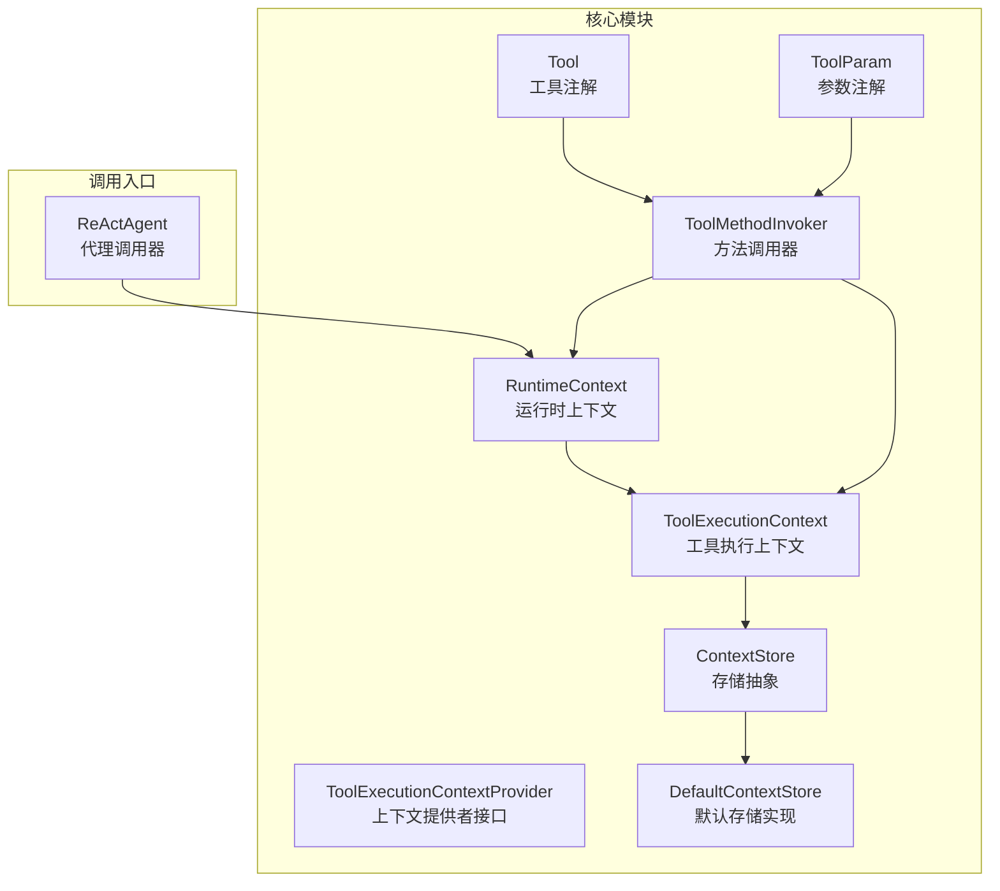
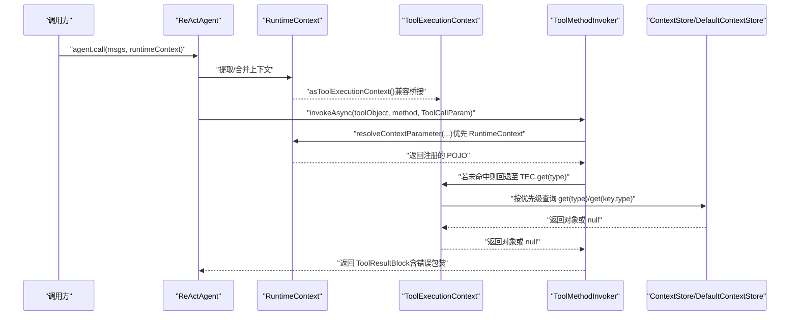
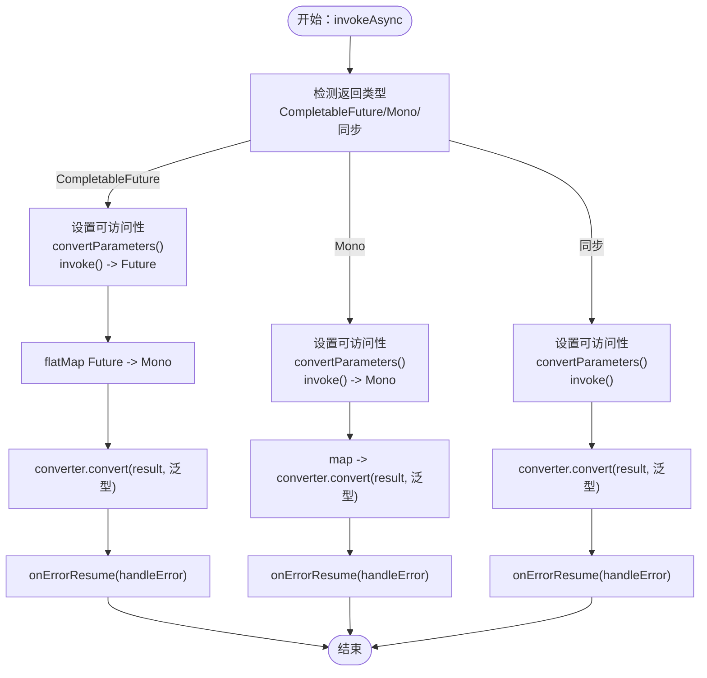
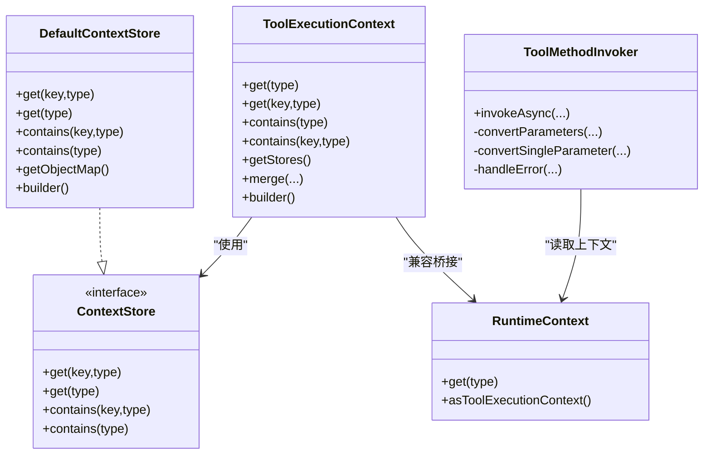

# 工具执行上下文

<cite>
**本文引用的文件**
- [ToolExecutionContext.java](file://agentscope-core/src/main/java/io/agentscope/core/tool/ToolExecutionContext.java)
- [ToolExecutionContextProvider.java](file://agentscope-core/src/main/java/io/agentscope/core/tool/ToolExecutionContextProvider.java)
- [ToolMethodInvoker.java](file://agentscope-core/src/main/java/io/agentscope/core/tool/ToolMethodInvoker.java)
- [ContextStore.java](file://agentscope-core/src/main/java/io/agentscope/core/tool/ContextStore.java)
- [DefaultContextStore.java](file://agentscope-core/src/main/java/io/agentscope/core/tool/DefaultContextStore.java)
- [Tool.java](file://agentscope-core/src/main/java/io/agentscope/core/tool/Tool.java)
- [ToolParam.java](file://agentscope-core/src/main/java/io/agentscope/core/tool/ToolParam.java)
- [RuntimeContext.java](file://agentscope-core/src/main/java/io/agentscope/core/agent/RuntimeContext.java)
- [ToolExecutionContextTest.java](file://agentscope-core/src/test/java/io/agentscope/core/tool/ToolExecutionContextTest.java)
- [tool.md（v2 英文）](file://docs/v2/en/docs/building-blocks/tool.md)
- [tool.md（v2 中文）](file://docs/v2/zh/docs/building-blocks/tool.md)
- [ReActAgent.java](file://agentscope-core/src/main/java/io/agentscope/core/ReActAgent.java)
</cite>

## 目录
1. [简介](#简介)
2. [项目结构](#项目结构)
3. [核心组件](#核心组件)
4. [架构总览](#架构总览)
5. [组件详解](#组件详解)
6. [依赖关系分析](#依赖关系分析)
7. [性能与并发特性](#性能与并发特性)
8. [故障排查指南](#故障排查指南)
9. [结论](#结论)
10. [附录：自定义上下文提供者开发示例](#附录自定义上下文提供者开发示例)

## 简介
本文件为 AgentScope 工具执行上下文系统的完整 API 参考文档，聚焦以下主题：
- ToolExecutionContext 工具执行上下文的属性与方法、参数传递、状态管理与生命周期控制
- ToolExecutionContextProvider 执行上下文提供者的实现机制与扩展方式
- ToolMethodInvoker 方法调用器的反射机制与调用流程
- 上下文中工具参数的解析、类型转换与验证规则
- 上下文隔离、并发控制与错误恢复的实现指南
- 自定义上下文提供者的开发示例

注意：ToolExecutionContext 与 ToolExecutionContextProvider 均已标记为弃用，推荐使用 RuntimeContext 进行上下文注入与参数传递。

## 项目结构
围绕工具执行上下文的核心代码位于 agentscope-core 模块的 tool 包中，配合 agent 包中的 RuntimeContext 提供统一的上下文能力；ReActAgent 在调用链路中负责合并与传递上下文。

图表来源
- [ToolExecutionContext.java:52-311](file://agentscope-core/src/main/java/io/agentscope/core/tool/ToolExecutionContext.java#L52-L311)
- [ToolExecutionContextProvider.java:114-136](file://agentscope-core/src/main/java/io/agentscope/core/tool/ToolExecutionContextProvider.java#L114-L136)
- [ToolMethodInvoker.java:38-400](file://agentscope-core/src/main/java/io/agentscope/core/tool/ToolMethodInvoker.java#L38-L400)
- [ContextStore.java:54-119](file://agentscope-core/src/main/java/io/agentscope/core/tool/ContextStore.java#L54-L119)
- [DefaultContextStore.java:33-290](file://agentscope-core/src/main/java/io/agentscope/core/tool/DefaultContextStore.java#L33-L290)
- [Tool.java:60-194](file://agentscope-core/src/main/java/io/agentscope/core/tool/Tool.java#L60-L194)
- [ToolParam.java:62-105](file://agentscope-core/src/main/java/io/agentscope/core/tool/ToolParam.java#L62-L105)
- [RuntimeContext.java:19-400](file://agentscope-core/src/main/java/io/agentscope/core/agent/RuntimeContext.java#L19-L400)
- [ReActAgent.java:234-3659](file://agentscope-core/src/main/java/io/agentscope/core/ReActAgent.java#L234-L3659)

章节来源
- [ToolExecutionContext.java:23-51](file://agentscope-core/src/main/java/io/agentscope/core/tool/ToolExecutionContext.java#L23-L51)
- [RuntimeContext.java:27-308](file://agentscope-core/src/main/java/io/agentscope/core/agent/RuntimeContext.java#L27-L308)

## 核心组件
- ToolExecutionContext：两层架构（外部接口 + 存储层），按优先级链路解析业务上下文对象（Call → Agent → Toolkit → Spring）。支持单实例与多实例注册，提供合并能力。
- ToolExecutionContextProvider：用于从外部源（如 Spring 容器、ThreadLocal）解析 ToolExecutionContext 或自定义 POJO。
- ToolMethodInvoker：基于反射的方法调用器，负责参数解析、类型转换、异步返回处理与错误包装。
- ContextStore/DefaultContextStore：上下文对象的存储抽象与内存实现，支持按类型与键检索。
- Tool/ToolParam：工具方法与参数注解，驱动 JSON Schema 生成与参数校验。
- RuntimeContext：当前推荐的上下文载体，ToolExecutionContext 作为兼容桥接存在。

章节来源
- [ToolExecutionContext.java:52-311](file://agentscope-core/src/main/java/io/agentscope/core/tool/ToolExecutionContext.java#L52-L311)
- [ToolExecutionContextProvider.java:114-136](file://agentscope-core/src/main/java/io/agentscope/core/tool/ToolExecutionContextProvider.java#L114-L136)
- [ToolMethodInvoker.java:38-400](file://agentscope-core/src/main/java/io/agentscope/core/tool/ToolMethodInvoker.java#L38-L400)
- [ContextStore.java:54-119](file://agentscope-core/src/main/java/io/agentscope/core/tool/ContextStore.java#L54-L119)
- [DefaultContextStore.java:33-290](file://agentscope-core/src/main/java/io/agentscope/core/tool/DefaultContextStore.java#L33-L290)
- [Tool.java:60-194](file://agentscope-core/src/main/java/io/agentscope/core/tool/Tool.java#L60-L194)
- [ToolParam.java:62-105](file://agentscope-core/src/main/java/io/agentscope/core/tool/ToolParam.java#L62-L105)
- [RuntimeContext.java:19-400](file://agentscope-core/src/main/java/io/agentscope/core/agent/RuntimeContext.java#L19-L400)

## 架构总览
工具调用的上下文流转如下：

图表来源
- [ReActAgent.java:617-618](file://agentscope-core/src/main/java/io/agentscope/core/ReActAgent.java#L617-L618)
- [RuntimeContext.java:301-308](file://agentscope-core/src/main/java/io/agentscope/core/agent/RuntimeContext.java#L301-L308)
- [ToolMethodInvoker.java:149-274](file://agentscope-core/src/main/java/io/agentscope/core/tool/ToolMethodInvoker.java#L149-L274)
- [ToolExecutionContext.java:71-98](file://agentscope-core/src/main/java/io/agentscope/core/tool/ToolExecutionContext.java#L71-L98)
- [DefaultContextStore.java:64-90](file://agentscope-core/src/main/java/io/agentscope/core/tool/DefaultContextStore.java#L64-L90)

## 组件详解

### ToolExecutionContext（工具执行上下文）
- 作用与定位
  - 两层架构：外部接口 + 存储层（ContextStore）
  - 优先级链路：调用层（Call）→ 代理层（Agent）→ 工具集（Toolkit）→ Spring（IoC 容器，最高优先）
  - 兼容桥接：通过 RuntimeContext.asToolExecutionContext() 使用
- 关键方法
  - get(type)/get(key,type)：按类型或键+类型检索对象
  - contains(type)/contains(key,type)：判断是否存在
  - getStores()：获取存储列表（不可变）
  - merge(contexts...)：合并多个上下文，保持优先级顺序
  - builder()/register()/addStore()/build()：构建与注册
- 生命周期与隔离
  - 合并后形成不可变链路，避免并发修改
  - 支持多实例（键控）与单实例（类型控）混合场景
- 弃用提示
  - 建议使用 RuntimeContext 注册 POJO 并在工具方法中自动注入

章节来源
- [ToolExecutionContext.java:52-311](file://agentscope-core/src/main/java/io/agentscope/core/tool/ToolExecutionContext.java#L52-L311)
- [ContextStore.java:54-119](file://agentscope-core/src/main/java/io/agentscope/core/tool/ContextStore.java#L54-L119)
- [DefaultContextStore.java:33-290](file://agentscope-core/src/main/java/io/agentscope/core/tool/DefaultContextStore.java#L33-L290)
- [RuntimeContext.java:301-308](file://agentscope-core/src/main/java/io/agentscope/core/agent/RuntimeContext.java#L301-L308)

### ToolExecutionContextProvider（上下文提供者）
- 作用与定位
  - 从外部源解析 ToolExecutionContext 或自定义 POJO
  - 典型集成：Spring 容器、ThreadLocal、请求作用域等
- 关键方法
  - resolveContext(Class<T> targetType)：按目标类型解析
- 扩展方式
  - 实现接口并在应用启动时注册（例如通过 Spring 配置）
  - 将 Spring Bean 转换为 ToolExecutionContext 或直接返回自定义 POJO
- 弃用提示
  - 建议通过 RuntimeContext 注入，无需外部提供者

章节来源
- [ToolExecutionContextProvider.java:114-136](file://agentscope-core/src/main/java/io/agentscope/core/tool/ToolExecutionContextProvider.java#L114-L136)

### ToolMethodInvoker（方法调用器）
- 作用与定位
  - 反射调用工具方法，处理参数解析、类型转换、异步返回与错误包装
- 参数解析与注入策略
  - 自动注入：ToolEmitter、Agent、AgentState、RuntimeContext、ToolExecutionContext（兼容）
  - 用户 POJO：从 RuntimeContext 解析；否则从输入映射转换
  - 工具输入：带 @ToolParam 的参数从输入映射按名称解析
- 类型转换与验证
  - 直接赋值：当原始类型匹配且非泛型时
  - JSON 转换：使用 JsonCodec 保留泛型信息
  - 字符串回退：对基本类型进行字符串解析
- 异步与错误处理
  - 支持返回 CompletableFuture/Mono：转为 Mono 流水线
  - 错误包装：捕获异常并封装为 ToolResultBlock.error(...)
  - 特殊异常：ToolSuspendException 会在链路中正确传播
- 返回值转换
  - 使用 ToolResultConverter 将结果转换为 ToolResultBlock

图表来源
- [ToolMethodInvoker.java:55-125](file://agentscope-core/src/main/java/io/agentscope/core/tool/ToolMethodInvoker.java#L55-L125)
- [ToolMethodInvoker.java:149-198](file://agentscope-core/src/main/java/io/agentscope/core/tool/ToolMethodInvoker.java#L149-L198)
- [ToolMethodInvoker.java:283-337](file://agentscope-core/src/main/java/io/agentscope/core/tool/ToolMethodInvoker.java#L283-L337)
- [ToolMethodInvoker.java:349-380](file://agentscope-core/src/main/java/io/agentscope/core/tool/ToolMethodInvoker.java#L349-L380)

章节来源
- [ToolMethodInvoker.java:38-400](file://agentscope-core/src/main/java/io/agentscope/core/tool/ToolMethodInvoker.java#L38-L400)

### 参数解析、类型转换与验证规则
- 参数分类
  - 自动注入参数：ToolEmitter、Agent、AgentState、RuntimeContext、ToolExecutionContext（兼容）
  - 用户 POJO：从 RuntimeContext.get(type) 解析；需满足“非 @ToolParam、非基础类型、非框架消息类型、非 java.*”
  - 工具输入参数：带 @ToolParam 的参数，按名称从输入映射解析
- 类型转换
  - 直接赋值：类型兼容且非泛型
  - JSON 转换：保留泛型类型信息
  - 字符串回退：基本类型字符串解析
- 验证与约束
  - @ToolParam.required 控制是否必须提供
  - @Tool.strict 控制严格模式（由模型端实现）
  - 工具方法签名与返回类型需符合要求（见 Tool 注解）

章节来源
- [ToolMethodInvoker.java:149-274](file://agentscope-core/src/main/java/io/agentscope/core/tool/ToolMethodInvoker.java#L149-L274)
- [ToolParam.java:62-105](file://agentscope-core/src/main/java/io/agentscope/core/tool/ToolParam.java#L62-L105)
- [Tool.java:60-194](file://agentscope-core/src/main/java/io/agentscope/core/tool/Tool.java#L60-L194)

### 上下文隔离、并发控制与错误恢复
- 上下文隔离
  - 合并后的 ToolExecutionContext 为不可变链路，避免并发写入
  - 多实例通过键区分，类型单一实例通过默认键区分
- 并发控制
  - @Tool.concurrencySafe 控制工具方法是否允许并行调用
  - 框架在批处理内对非并发安全工具进行串行化
- 错误恢复
  - 调用器将异常包装为 ToolResultBlock.error(...)
  - ToolSuspendException 在链路中传播，交由上层处理挂起逻辑

章节来源
- [ToolExecutionContext.java:148-166](file://agentscope-core/src/main/java/io/agentscope/core/tool/ToolExecutionContext.java#L148-L166)
- [ToolMethodInvoker.java:349-380](file://agentscope-core/src/main/java/io/agentscope/core/tool/ToolMethodInvoker.java#L349-L380)
- [Tool.java:117-118](file://agentscope-core/src/main/java/io/agentscope/core/tool/Tool.java#L117-L118)

### 自定义上下文提供者的开发示例
- Spring 集成
  - 在请求作用域中定义 POJO（如 UserContext）
  - 实现 ToolExecutionContextProvider，从 Spring 容器解析 ToolExecutionContext 或自定义 POJO
  - 在配置类中注册 Provider，并调用 ToolExecutionContext.setContextProvider(...)
- ThreadLocal 示例
  - 在请求入口设置 ToolExecutionContext 或自定义 POJO
  - 实现 ToolExecutionContextProvider，从 ThreadLocal 解析并返回

章节来源
- [ToolExecutionContextProvider.java:25-112](file://agentscope-core/src/main/java/io/agentscope/core/tool/ToolExecutionContextProvider.java#L25-L112)

## 依赖关系分析
- 组件耦合
  - ToolMethodInvoker 依赖 RuntimeContext、ToolResultConverter、JsonUtils 等
  - ToolExecutionContext 依赖 ContextStore/DefaultContextStore
  - ReActAgent 在调用链中合并 RuntimeContext 与 ToolExecutionContext
- 外部依赖
  - Spring（可选）：通过 ToolExecutionContextProvider 集成
  - Reactor/Mono：异步返回与错误处理

图表来源
- [ToolExecutionContext.java:52-311](file://agentscope-core/src/main/java/io/agentscope/core/tool/ToolExecutionContext.java#L52-L311)
- [ContextStore.java:54-119](file://agentscope-core/src/main/java/io/agentscope/core/tool/ContextStore.java#L54-L119)
- [DefaultContextStore.java:33-290](file://agentscope-core/src/main/java/io/agentscope/core/tool/DefaultContextStore.java#L33-L290)
- [ToolMethodInvoker.java:38-400](file://agentscope-core/src/main/java/io/agentscope/core/tool/ToolMethodInvoker.java#L38-L400)
- [RuntimeContext.java:19-400](file://agentscope-core/src/main/java/io/agentscope/core/agent/RuntimeContext.java#L19-L400)

章节来源
- [ToolExecutionContext.java:52-311](file://agentscope-core/src/main/java/io/agentscope/core/tool/ToolExecutionContext.java#L52-L311)
- [ToolMethodInvoker.java:38-400](file://agentscope-core/src/main/java/io/agentscope/core/tool/ToolMethodInvoker.java#L38-L400)
- [RuntimeContext.java:19-400](file://agentscope-core/src/main/java/io/agentscope/core/agent/RuntimeContext.java#L19-L400)

## 性能与并发特性
- 性能要点
  - ToolExecutionContext 合并后为不可变链路，查询开销低
  - DefaultContextStore 使用两级 Map，键控与类型控均摊 O(1) 访问
  - 反射仅在参数解析阶段发生，调用器内部尽量减少重复装箱
- 并发控制
  - @Tool.concurrencySafe 控制工具方法并行度
  - ToolSuspendException 用于外部工具的挂起与恢复
- 建议
  - 优先使用 RuntimeContext 注入，避免额外的上下文提供者开销
  - 对于高并发工具，确保无共享可变状态或采用线程安全设计

## 故障排查指南
- 常见问题
  - 注入失败：确认参数类型是否为用户 POJO（非 @ToolParam、非基础类型、非框架消息类型）
  - 类型转换异常：检查输入映射键名与 @ToolParam.name 是否一致，必要时启用严格模式
  - 异步工具未生效：确认返回类型为 CompletableFuture/Mono，调用器会自动适配
  - 错误信息不明确：查看 ToolResultBlock.error(...) 中的异常链，定位根因
- 定位步骤
  - 在工具方法中打印注入对象（如 RuntimeContext、AgentState）以验证注入链路
  - 使用单元测试覆盖不同上下文合并与优先级场景
  - 对外部工具使用 ToolSuspendException 触发挂起，观察上层事件流

章节来源
- [ToolMethodInvoker.java:349-380](file://agentscope-core/src/main/java/io/agentscope/core/tool/ToolMethodInvoker.java#L349-L380)
- [ToolExecutionContextTest.java:202-227](file://agentscope-core/src/test/java/io/agentscope/core/tool/ToolExecutionContextTest.java#L202-L227)

## 结论
- ToolExecutionContext 与 ToolExecutionContextProvider 已被标记为弃用，建议迁移至 RuntimeContext 注入
- ToolMethodInvoker 提供了完善的参数解析、类型转换与错误处理机制
- 通过 ContextStore/DefaultContextStore 实现了灵活的上下文存储与优先级合并
- 在实际工程中，应结合 @Tool/@ToolParam 的规范与并发安全策略，确保工具调用的稳定性与可维护性

## 附录：自定义上下文提供者开发示例
- Spring 集成步骤
  - 定义请求作用域 Bean（如 UserContext）
  - 实现 ToolExecutionContextProvider.resolveContext(...)，从 Spring 容器解析 ToolExecutionContext 或自定义 POJO
  - 在配置类中注册 Provider，并调用 ToolExecutionContext.setContextProvider(...)
- ThreadLocal 步骤
  - 在请求入口设置 ToolExecutionContext 或自定义 POJO
  - 实现 ToolExecutionContextProvider.resolveContext(...)，从 ThreadLocal 获取并返回

章节来源
- [ToolExecutionContextProvider.java:25-112](file://agentscope-core/src/main/java/io/agentscope/core/tool/ToolExecutionContextProvider.java#L25-L112)