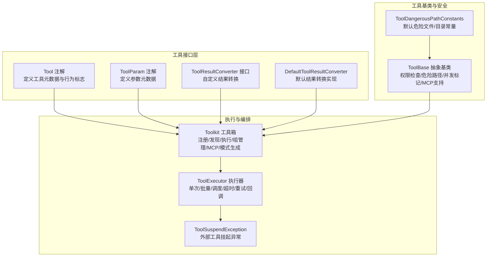
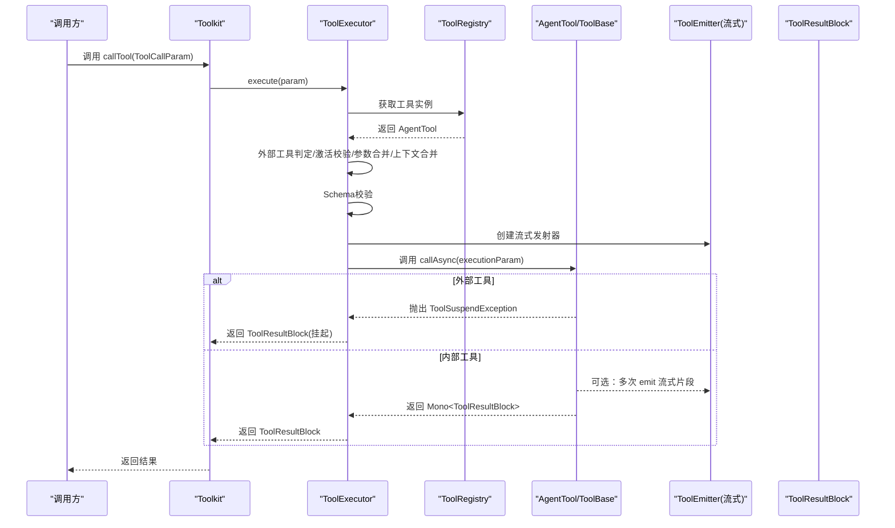
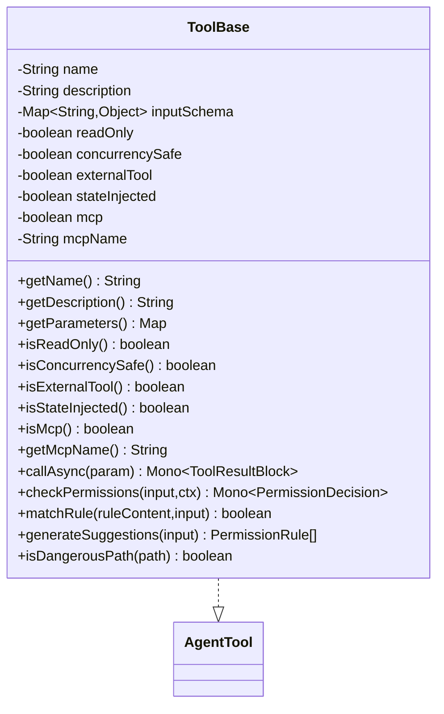
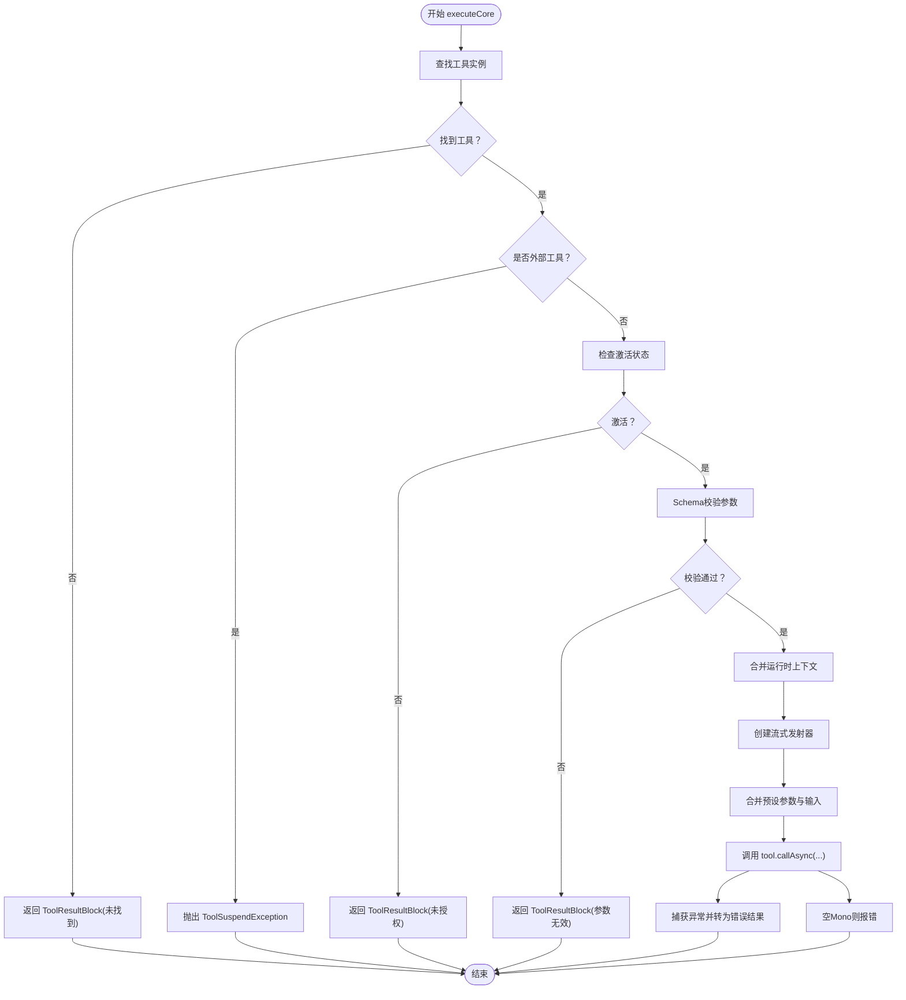
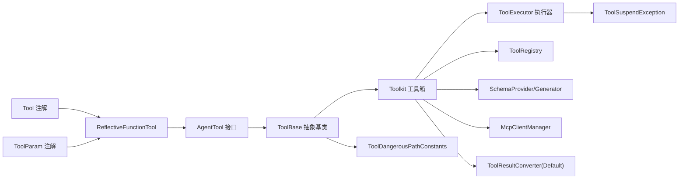

# 工具接口定义

<cite>
**本文引用的文件**   
- [Tool.java](file://agentscope-core/src/main/java/io/agentscope/core/tool/Tool.java)
- [ToolBase.java](file://agentscope-core/src/main/java/io/agentscope/core/tool/ToolBase.java)
- [ToolExecutor.java](file://agentscope-core/src/main/java/io/agentscope/core/tool/ToolExecutor.java)
- [ToolParam.java](file://agentscope-core/src/main/java/io/agentscope/core/tool/ToolParam.java)
- [ToolResultConverter.java](file://agentscope-core/src/main/java/io/agentscope/core/tool/ToolResultConverter.java)
- [DefaultToolResultConverter.java](file://agentscope-core/src/main/java/io/agentscope/core/tool/DefaultToolResultConverter.java)
- [Toolkit.java](file://agentscope-core/src/main/java/io/agentscope/core/tool/Toolkit.java)
- [ToolDangerousPathConstants.java](file://agentscope-core/src/main/java/io/agentscope/core/tool/ToolDangerousPathConstants.java)
- [ToolSuspendException.java](file://agentscope-core/src/main/java/io/agentscope/core/tool/ToolSuspendException.java)
- [ToolCallParam.java](file://agentscope-core/src/main/java/io/agentscope/core/tool/ToolCallParam.java)
</cite>

## 目录
1. [简介](#简介)
2. [项目结构](#项目结构)
3. [核心组件](#核心组件)
4. [架构总览](#架构总览)
5. [详细组件分析](#详细组件分析)
6. [依赖分析](#依赖分析)
7. [性能考虑](#性能考虑)
8. [故障排查指南](#故障排查指南)
9. [结论](#结论)
10. [附录：工具方法签名与返回值规范](#附录工具方法签名与返回值规范)

## 简介
本文件面向AgentScope工具接口系统，提供面向开发者的完整API文档，重点覆盖以下内容：
- Tool注解接口的所有属性与配置项：name、description、strict、readOnly、concurrencySafe、externalTool、stateInjected、dangerousFiles、dangerousDirectories、converter等的语义、默认行为与典型使用场景
- ToolBase抽象基类提供的核心能力与继承关系：构造器、权限检查、危险路径检测、并发安全标记、MCP集成等
- ToolExecutor工具执行器的工作原理与调用流程：单次执行、批量执行、调度、超时、重试、优雅停机保护、流式回调等
- 工具方法签名规范、返回值类型要求与异常处理机制
- 实际示例（以源码路径形式给出）帮助正确实现自定义工具接口

## 项目结构
工具接口体系位于agentscope-core模块的tool包下，围绕注解、基类、执行器、注册表、模式生成器、结果转换器等组件协同工作，形成从“声明式工具”到“可执行工具”的完整链路。

图表来源
- [Tool.java:1-194](file://agentscope-core/src/main/java/io/agentscope/core/tool/Tool.java#L1-L194)
- [ToolParam.java:1-105](file://agentscope-core/src/main/java/io/agentscope/core/tool/ToolParam.java#L1-L105)
- [ToolResultConverter.java:1-59](file://agentscope-core/src/main/java/io/agentscope/core/tool/ToolResultConverter.java#L1-L59)
- [DefaultToolResultConverter.java](file://agentscope-core/src/main/java/io/agentscope/core/tool/DefaultToolResultConverter.java)
- [ToolBase.java:1-342](file://agentscope-core/src/main/java/io/agentscope/core/tool/ToolBase.java#L1-L342)
- [ToolDangerousPathConstants.java:1-81](file://agentscope-core/src/main/java/io/agentscope/core/tool/ToolDangerousPathConstants.java#L1-L81)
- [Toolkit.java:1-800](file://agentscope-core/src/main/java/io/agentscope/core/tool/Toolkit.java#L1-L800)
- [ToolExecutor.java:1-487](file://agentscope-core/src/main/java/io/agentscope/core/tool/ToolExecutor.java#L1-L487)
- [ToolSuspendException.java](file://agentscope-core/src/main/java/io/agentscope/core/tool/ToolSuspendException.java)

章节来源
- [Toolkit.java:1-800](file://agentscope-core/src/main/java/io/agentscope/core/tool/Toolkit.java#L1-L800)

## 核心组件
- Tool注解：用于将方法声明为工具，并提供名称、描述、严格模式、只读、并发安全、外部工具、状态注入、危险路径列表、自定义结果转换器等元信息。
- ToolParam注解：用于描述工具方法参数的名称、是否必需、描述等，支撑JSON Schema生成。
- ToolBase抽象基类：统一实现AgentTool接口，提供权限检查、危险路径判断、并发安全标记、MCP标识、默认调用逻辑等。
- ToolExecutor执行器：负责单次/批量工具执行，串联调度、超时、重试、优雅停机保护与流式回调。
- Toolkit工具箱：注册与发现工具、生成Schema、管理工具组、桥接MCP客户端、协调执行器。
- ToolResultConverter接口及DefaultToolResultConverter：控制工具返回值到ToolResultBlock的转换策略。
- ToolDangerousPathConstants：内置危险文件与目录清单，供ToolBase进行路径安全校验。
- ToolSuspendException：外部工具专用异常，用于向框架外“挂起”工具调用。

章节来源
- [Tool.java:57-194](file://agentscope-core/src/main/java/io/agentscope/core/tool/Tool.java#L57-L194)
- [ToolParam.java:59-105](file://agentscope-core/src/main/java/io/agentscope/core/tool/ToolParam.java#L59-L105)
- [ToolBase.java:60-342](file://agentscope-core/src/main/java/io/agentscope/core/tool/ToolBase.java#L60-L342)
- [ToolExecutor.java:58-487](file://agentscope-core/src/main/java/io/agentscope/core/tool/ToolExecutor.java#L58-L487)
- [Toolkit.java:66-800](file://agentscope-core/src/main/java/io/agentscope/core/tool/Toolkit.java#L66-L800)
- [ToolResultConverter.java:48-59](file://agentscope-core/src/main/java/io/agentscope/core/tool/ToolResultConverter.java#L48-L59)
- [DefaultToolResultConverter.java](file://agentscope-core/src/main/java/io/agentscope/core/tool/DefaultToolResultConverter.java)
- [ToolDangerousPathConstants.java:27-81](file://agentscope-core/src/main/java/io/agentscope/core/tool/ToolDangerousPathConstants.java#L27-L81)
- [ToolSuspendException.java](file://agentscope-core/src/main/java/io/agentscope/core/tool/ToolSuspendException.java)

## 架构总览
下面的序列图展示了从Toolkit发起一次工具调用到最终产生结果或挂起的完整流程。

图表来源
- [Toolkit.java:490-492](file://agentscope-core/src/main/java/io/agentscope/core/tool/Toolkit.java#L490-L492)
- [ToolExecutor.java:167-291](file://agentscope-core/src/main/java/io/agentscope/core/tool/ToolExecutor.java#L167-L291)
- [ToolExecutor.java:195-197](file://agentscope-core/src/main/java/io/agentscope/core/tool/ToolExecutor.java#L195-L197)
- [ToolExecutor.java:266-291](file://agentscope-core/src/main/java/io/agentscope/core/tool/ToolExecutor.java#L266-L291)
- [ToolSuspendException.java](file://agentscope-core/src/main/java/io/agentscope/core/tool/ToolSuspendException.java)

## 详细组件分析

### Tool注解：属性与配置详解
- name：工具名，默认空字符串表示使用方法名；建议采用snake_case以兼容主流模型提供商。
- description：工具描述，默认空字符串表示自动生成；应清晰说明用途、触发时机与返回结果。
- strict：启用严格模式，使兼容的模型提供商对参数Schema进行更强约束。
- readOnly：标记工具为只读，便于在EXPLORE/ACCEPT_EDITS模式下自动放行。
- concurrencySafe：标记工具可并发执行自身调用；默认true，典型纯函数工具保持高吞吐。
- externalTool：标记工具需在框架外执行；此时不会调用本地callAsync，而是抛出ToolSuspendException，由上层循环“挂起”该调用。
- stateInjected：标记工具需要在调用时注入AgentState；框架会排除该参数进入Schema并绑定实时状态。
- dangerousFiles/dangerousDirectories：追加危险文件/目录白名单；默认使用ToolBase中的常量集。
- converter：自定义结果转换器类；默认使用DefaultToolResultConverter；可用于过滤敏感数据、格式化输出、添加元数据、压缩大输出等。

章节来源
- [Tool.java:60-194](file://agentscope-core/src/main/java/io/agentscope/core/tool/Tool.java#L60-L194)

### ToolParam注解：参数元数据
- name：必填，Java运行时不保留参数名，必须显式声明参数名以便映射LLM输入。
- required：是否必需；必需参数必须由LLM提供，可选参数可省略。
- description：参数描述，帮助LLM理解取值范围与约束。

章节来源
- [ToolParam.java:59-105](file://agentscope-core/src/main/java/io/agentscope/core/tool/ToolParam.java#L59-L105)

### ToolBase抽象基类：核心能力与继承关系
- 继承关系：实现AgentTool，提供Builder构造器与默认方法；子类可通过构造器或子类构造器传入name、description、inputSchema、readOnly、concurrencySafe、mcp、mcpName、externalTool、stateInjected等。
- 权限检查：checkPermissions默认透传至权限引擎，子类可覆盖以实现细粒度策略。
- 危险路径检测：isDangerousPath对文件名与路径段进行大小写不敏感匹配，并解析符号链接防止绕过。
- 并发安全：isConcurrencySafe返回构造时设置的标记，影响批量执行时的并发分片策略。
- 外部工具：isExternalTool返回构造时设置的标记；ToolExecutor在执行前短路外部工具。
- MCP支持：支持标记为MCP工具并记录MCP服务器名。
- 默认调用：非外部工具未覆盖callAsync时会抛出UnsupportedOperationException；外部工具不应被本地调用。

图表来源
- [ToolBase.java:60-342](file://agentscope-core/src/main/java/io/agentscope/core/tool/ToolBase.java#L60-L342)

章节来源
- [ToolBase.java:60-342](file://agentscope-core/src/main/java/io/agentscope/core/tool/ToolBase.java#L60-L342)

### ToolExecutor执行器：工作原理与调用流程
- 单次执行execute：Tracer包装后进入executeCore，完成工具查找、外部工具短路、激活校验、Schema验证、上下文合并、流式发射器创建、参数合并、最终调用callAsync。
- 批量执行executeAll：按并发安全策略分区，连续安全工具并发执行，不安全工具串行；顺序保持，使用mergeSequential合并安全批次。
- 基础设施层：applyScheduling（默认boundedElastic或自定义线程池）、applyTimeout（超时取消）、applyRetry（指数退避+抖动）、applyShutdownGuard（与全局优雅停机信号竞速）。
- 回调机制：支持用户chunk回调与内部chunk回调，二者可同时存在且互不影响；回调失败会被记录但不阻塞后续回调。
- 异常处理：ToolSuspendException转换为挂起结果；其他异常封装为错误结果；空Mono转换为“未返回结果”的错误。

图表来源
- [ToolExecutor.java:184-291](file://agentscope-core/src/main/java/io/agentscope/core/tool/ToolExecutor.java#L184-L291)
- [ToolExecutor.java:305-356](file://agentscope-core/src/main/java/io/agentscope/core/tool/ToolExecutor.java#L305-L356)
- [ToolExecutor.java:411-485](file://agentscope-core/src/main/java/io/agentscope/core/tool/ToolExecutor.java#L411-L485)

章节来源
- [ToolExecutor.java:58-487](file://agentscope-core/src/main/java/io/agentscope/core/tool/ToolExecutor.java#L58-L487)

### Toolkit工具箱：注册、发现与执行
- 注册方式：支持对象扫描（含@Tool方法）、直接注册AgentTool、Schema-only外部工具、MCP客户端注册、子代理工具等。
- 发现与执行：提供getTool/getToolNames；callTool/callTools委托给ToolExecutor；支持工具组管理、动态激活/去激活、预设参数更新、深拷贝保留回调。
- 模式生成：结合SchemaProvider与SchemaGenerator生成面向模型的工具Schema，受活动组过滤影响。
- 元工具：提供reset_equipped_tools元工具，允许运行时动态管理工具组。

章节来源
- [Toolkit.java:66-800](file://agentscope-core/src/main/java/io/agentscope/core/tool/Toolkit.java#L66-L800)

### 结果转换器：ToolResultConverter与DefaultToolResultConverter
- ToolResultConverter：定义convert(Object result, Type returnType)方法，将工具返回值转换为ToolResultBlock；可实现敏感数据过滤、格式化、元数据注入、大输出压缩等。
- DefaultToolResultConverter：默认实现，提供JSON序列化与Schema信息封装。

章节来源
- [ToolResultConverter.java:48-59](file://agentscope-core/src/main/java/io/agentscope/core/tool/ToolResultConverter.java#L48-L59)
- [DefaultToolResultConverter.java](file://agentscope-core/src/main/java/io/agentscope/core/tool/DefaultToolResultConverter.java)

### 危险路径常量：ToolDangerousPathConstants
- 提供默认危险文件列表（如shell配置、SSH配置、凭证文件、环境变量文件等）与危险目录列表（如.git、.vscode、.idea、.ssh），ToolBase据此进行路径安全校验。
- 子类可替换这些字段以扩大或缩小保护范围。

章节来源
- [ToolDangerousPathConstants.java:27-81](file://agentscope-core/src/main/java/io/agentscope/core/tool/ToolDangerousPathConstants.java#L27-L81)
- [ToolBase.java:224-260](file://agentscope-core/src/main/java/io/agentscope/core/tool/ToolBase.java#L224-L260)

### 外部工具挂起：ToolSuspendException
- 当工具标记为externalTool或SchemaOnlyTool时，ToolExecutor在执行前抛出ToolSuspendException，框架将其转换为挂起的ToolResultBlock，交由上层处理。

章节来源
- [ToolExecutor.java:195-197](file://agentscope-core/src/main/java/io/agentscope/core/tool/ToolExecutor.java#L195-L197)
- [Toolkit.java:312-325](file://agentscope-core/src/main/java/io/agentscope/core/tool/Toolkit.java#L312-L325)

## 依赖分析
- Tool注解与ToolParam注解共同驱动Schema生成与参数映射，最终由ReflectiveFunctionTool包装为AgentTool并注册到Toolkit。
- ToolBase作为AgentTool实现，承担权限评估、危险路径检查、并发标记与MCP标识职责。
- Toolkit协调注册表、Schema生成器、执行器与MCP客户端，形成统一的工具生命周期管理。
- ToolExecutor依赖Reactor调度器、超时与重试机制，以及GracefulShutdownManager进行系统级保护。

图表来源
- [Toolkit.java:66-800](file://agentscope-core/src/main/java/io/agentscope/core/tool/Toolkit.java#L66-L800)
- [ToolExecutor.java:58-487](file://agentscope-core/src/main/java/io/agentscope/core/tool/ToolExecutor.java#L58-L487)
- [ToolBase.java:60-342](file://agentscope-core/src/main/java/io/agentscope/core/tool/ToolBase.java#L60-L342)
- [ToolDangerousPathConstants.java:27-81](file://agentscope-core/src/main/java/io/agentscope/core/tool/ToolDangerousPathConstants.java#L27-L81)
- [ToolResultConverter.java:48-59](file://agentscope-core/src/main/java/io/agentscope/core/tool/ToolResultConverter.java#L48-L59)

## 性能考虑
- 并发安全：合理设置concurrencySafe为true可提升批量执行吞吐；对于共享资源或有状态的工具应设为false，避免竞态。
- 调度与线程池：默认使用boundedElastic；若工具涉及CPU密集型任务，建议提供自定义ExecutorService以隔离负载。
- 超时与重试：根据工具特性配置最大尝试次数、初始/最大退避时间与重试条件，避免长时间阻塞。
- 流式回调：仅在必要时使用chunk回调，避免回调逻辑阻塞导致整体延迟上升。
- 外部工具：externalTool可减少框架内开销，但需确保上层能及时处理挂起调用。

## 故障排查指南
- 参数校验失败：检查Tool与ToolParam的name/description/required是否与Schema一致；查看日志中“参数校验失败”的具体提示。
- 工具未找到：确认工具已通过Toolkit.registerTool或注册表正确注册；核对工具名大小写与拼写。
- 未授权调用：确认工具所属组处于激活状态；检查ToolGroupManager的激活列表。
- 外部工具未被挂起：若工具声明为externalTool，应期望ToolSuspendException；否则检查注解配置。
- 空结果或未返回：工具callAsync必须返回Mono<ToolResultBlock>；空Mono将被转换为错误结果。
- 危险路径拒绝：若访问路径命中危险文件/目录，ToolBase会拒绝执行；可调整子类的dangerousFiles/dangerousDirectories或重构路径。

章节来源
- [ToolExecutor.java:188-291](file://agentscope-core/src/main/java/io/agentscope/core/tool/ToolExecutor.java#L188-L291)
- [ToolBase.java:224-260](file://agentscope-core/src/main/java/io/agentscope/core/tool/ToolBase.java#L224-L260)

## 结论
AgentScope的工具接口体系通过注解声明、基类抽象、执行器编排与工具箱协调，实现了从“声明式工具”到“可执行工具”的全链路自动化。开发者只需遵循注解规范与签名约定，即可快速构建安全、可观测、可扩展的工具生态。对于复杂场景，可借助自定义结果转换器、危险路径策略与外部工具挂起机制实现更精细的控制。

## 附录：工具方法签名与返回值规范
- 方法签名要求
  - 必须使用@Tool标注；除ToolEmitter外，所有参数必须使用@ToolParam标注。
  - 支持返回类型：String、Mono<String>、以及其他响应式类型；若返回空Mono，执行器会转换为错误结果。
  - 工具名建议使用snake_case；描述应明确用途与返回值。
- 参数注入
  - 若stateInjected为true，方法签名中需声明一个AgentState参数；该参数不会出现在Schema中，框架会在调用时注入实时状态。
- 外部工具
  - externalTool为true时，工具不应实现本地callAsync；框架会抛出ToolSuspendException，交由上层处理。
- 返回值
  - 工具返回值将通过ToolResultConverter转换为ToolResultBlock；默认使用DefaultToolResultConverter。
- 异常处理
  - ToolSuspendException用于外部工具挂起；其他异常将被封装为错误结果；空Mono将被视为“未返回结果”。

章节来源
- [Tool.java:45-51](file://agentscope-core/src/main/java/io/agentscope/core/tool/Tool.java#L45-L51)
- [ToolExecutor.java:171-181](file://agentscope-core/src/main/java/io/agentscope/core/tool/ToolExecutor.java#L171-L181)
- [Toolkit.java:490-492](file://agentscope-core/src/main/java/io/agentscope/core/tool/Toolkit.java#L490-L492)
- [ToolResultConverter.java:50-57](file://agentscope-core/src/main/java/io/agentscope/core/tool/ToolResultConverter.java#L50-L57)