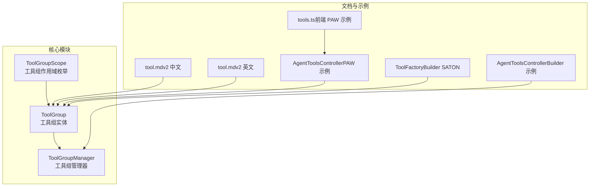
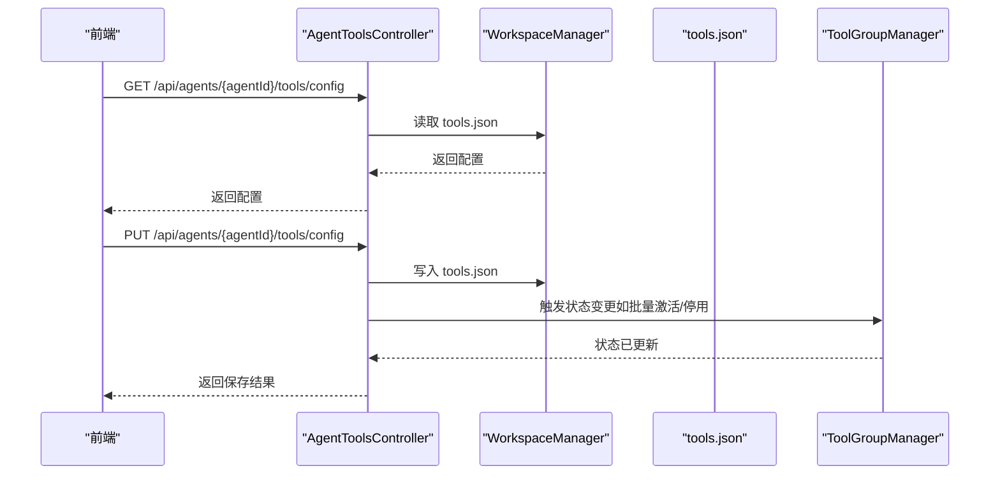
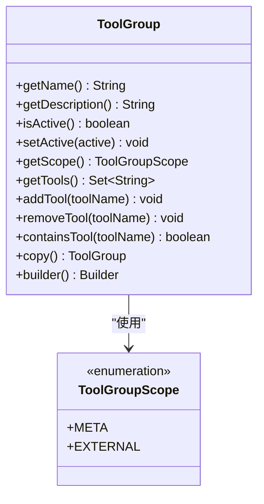
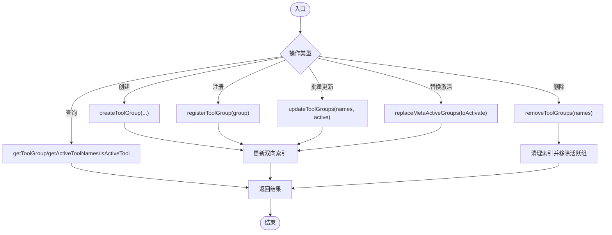
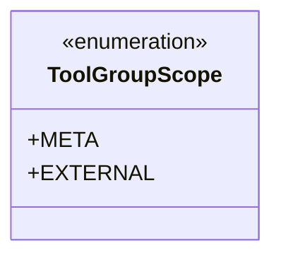
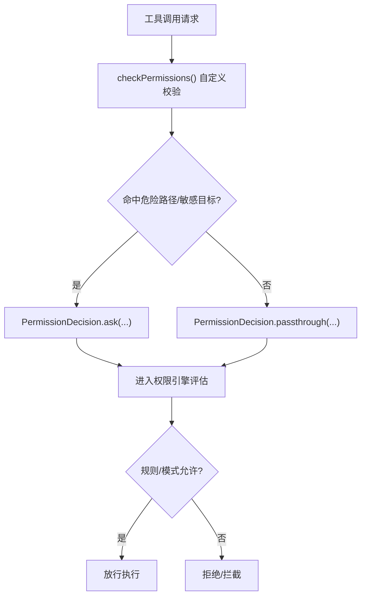
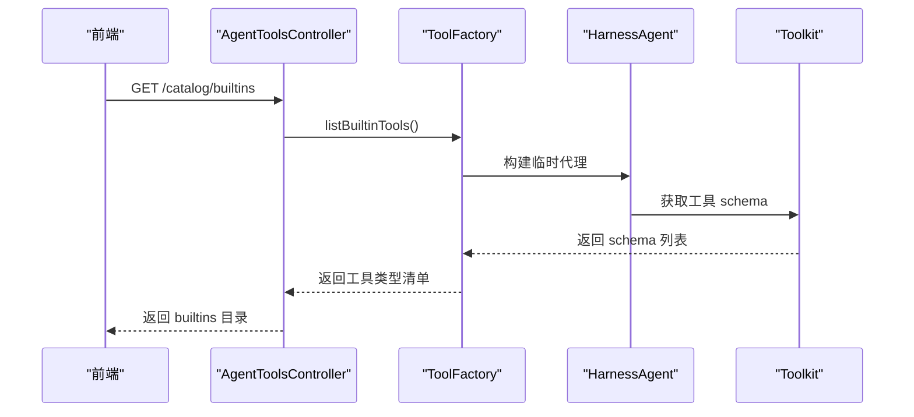
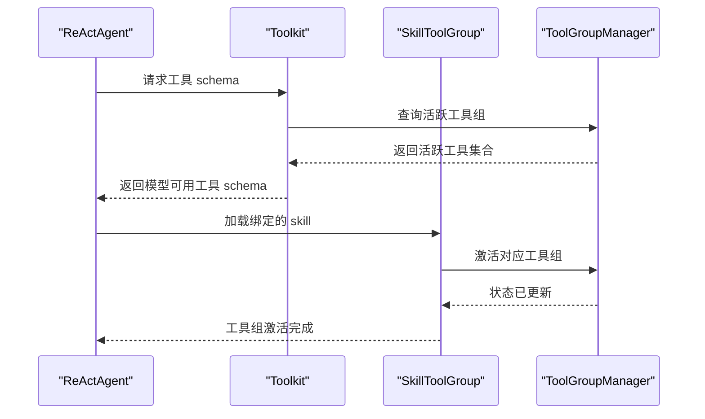
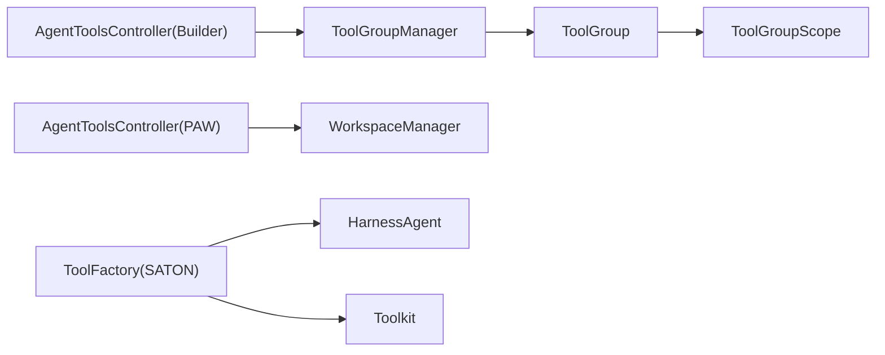

# 工具组管理

<cite>
**本文引用的文件**
- [ToolGroup.java](file://agentscope-core/src/main/java/io/agentscope/core/tool/ToolGroup.java)
- [ToolGroupManager.java](file://agentscope-core/src/main/java/io/agentscope/core/tool/ToolGroupManager.java)
- [ToolGroupScope.java](file://agentscope-core/src/main/java/io/agentscope/core/tool/ToolGroupScope.java)
- [tool.md（v2 英文）](file://docs/v2/en/docs/building-blocks/tool.md)
- [tool.md（v2 中文）](file://docs/v2/zh/docs/building-blocks/tool.md)
- [permission-system.md（v2 英文）](file://docs/v2/en/docs/building-blocks/permission-system.md)
- [permission-system.md（v2 中文）](file://docs/v2/zh/docs/building-blocks/permission-system.md)
- [AgentToolsController.java（PAW 示例）](file://agentscope-examples/agents/agentscope-paw/src/main/java/io/agentscope/claw2/web/api/AgentToolsController.java)
- [tools.ts（前端 PAW 示例）](file://agentscope-examples/agents/agentscope-paw/frontend/src/api/tools.ts)
- [AgentToolsController.java（Builder 示例）](file://agentscope-examples/agents/agentscope-builder/src/main/java/io/agentscope/builder/web/api/AgentToolsController.java)
- [ToolFactory.java（Builder SATON）](file://agentscope-builder-saton/src/main/java/io/agentscope/builder/saton/factory/service/tool/ToolFactory.java)
- [ToolFactoryTest.java（Builder SATON）](file://agentscope-builder-saton/src/test/java/io/agentscope/builder/saton/factory/service/tool/ToolFactoryTest.java)
</cite>

## 目录
1. [简介](#简介)
2. [项目结构](#项目结构)
3. [核心组件](#核心组件)
4. [架构总览](#架构总览)
5. [详细组件分析](#详细组件分析)
6. [依赖分析](#依赖分析)
7. [性能考虑](#性能考虑)
8. [故障排查指南](#故障排查指南)
9. [结论](#结论)
10. [附录](#附录)

## 简介
本文件面向 AgentScope 工具组管理系统，围绕 ToolGroup 工具组、ToolGroupManager 工具组管理器、ToolGroupScope 工具组作用域进行系统化 API 文档化，覆盖数据结构、组织方式、增删改查与批量管理、权限控制与安全策略、分类与标签管理、动态加载、与代理绑定、条件执行与优先级排序等主题。文档同时结合示例与前端交互，帮助开发者快速理解并正确使用工具组能力。

## 项目结构
与工具组管理直接相关的代码位于 agentscope-core 的 tool 包内，配套文档位于 docs/v2/zh/docs/building-blocks/tool.md 与 docs/v2/en/docs/building-blocks/tool.md；前端示例位于 agentscope-examples/agents/agentscope-paw 与 agentscope-examples/agents/agentscope-builder；动态加载与内省能力由 agentscope-builder-saton 提供。

**图示来源**
- [ToolGroup.java:42-257](file://agentscope-core/src/main/java/io/agentscope/core/tool/ToolGroup.java#L42-L257)
- [ToolGroupManager.java:32-530](file://agentscope-core/src/main/java/io/agentscope/core/tool/ToolGroupManager.java#L32-L530)
- [ToolGroupScope.java:29-42](file://agentscope-core/src/main/java/io/agentscope/core/tool/ToolGroupScope.java#L29-L42)
- [tool.md（v2 中文）:462-552](file://docs/v2/zh/docs/building-blocks/tool.md#L462-L552)
- [tool.md（v2 英文）:462-499](file://docs/v2/en/docs/building-blocks/tool.md#L462-L499)
- [AgentToolsController.java（PAW 示例）:47-78](file://agentscope-examples/agents/agentscope-paw/src/main/java/io/agentscope/claw2/web/api/AgentToolsController.java#L47-L78)
- [tools.ts（前端 PAW 示例）:53-101](file://agentscope-examples/agents/agentscope-paw/frontend/src/api/tools.ts#L53-L101)
- [AgentToolsController.java（Builder 示例）:257-289](file://agentscope-examples/agents/agentscope-builder/src/main/java/io/agentscope/builder/web/api/AgentToolsController.java#L257-L289)
- [ToolFactory.java（Builder SATON）:40-105](file://agentscope-builder-saton/src/main/java/io/agentscope/builder/saton/factory/service/tool/ToolFactory.java#L40-L105)

**章节来源**
- [ToolGroup.java:1-258](file://agentscope-core/src/main/java/io/agentscope/core/tool/ToolGroup.java#L1-L258)
- [ToolGroupManager.java:1-531](file://agentscope-core/src/main/java/io/agentscope/core/tool/ToolGroupManager.java#L1-L531)
- [ToolGroupScope.java:1-43](file://agentscope-core/src/main/java/io/agentscope/core/tool/ToolGroupScope.java#L1-L43)
- [tool.md（v2 中文）:462-552](file://docs/v2/zh/docs/building-blocks/tool.md#L462-L552)
- [tool.md（v2 英文）:462-499](file://docs/v2/en/docs/building-blocks/tool.md#L462-L499)
- [AgentToolsController.java（PAW 示例）:47-78](file://agentscope-examples/agents/agentscope-paw/src/main/java/io/agentscope/claw2/web/api/AgentToolsController.java#L47-L78)
- [tools.ts（前端 PAW 示例）:53-101](file://agentscope-examples/agents/agentscope-paw/frontend/src/api/tools.ts#L53-L101)
- [AgentToolsController.java（Builder 示例）:257-289](file://agentscope-examples/agents/agentscope-builder/src/main/java/io/agentscope/builder/web/api/AgentToolsController.java#L257-L289)
- [ToolFactory.java（Builder SATON）:40-105](file://agentscope-builder-saton/src/main/java/io/agentscope/builder/saton/factory/service/tool/ToolFactory.java#L40-L105)

## 核心组件
- ToolGroup：工具组实体，包含名称、描述、激活状态、作用域与工具集合，支持添加/移除工具、复制与构建器。
- ToolGroupManager：工具组管理器，负责工具组的创建、注册、更新、删除、查询与批量激活替换、活跃工具集计算等。
- ToolGroupScope：工具组作用域枚举，区分 META（由 meta tool 管理）与 EXTERNAL（由开发者代码管理）两类。

上述三者共同构成工具组管理的“数据结构 + 管理逻辑 + 作用域语义”。

**章节来源**
- [ToolGroup.java:42-257](file://agentscope-core/src/main/java/io/agentscope/core/tool/ToolGroup.java#L42-L257)
- [ToolGroupManager.java:32-530](file://agentscope-core/src/main/java/io/agentscope/core/tool/ToolGroupManager.java#L32-L530)
- [ToolGroupScope.java:29-42](file://agentscope-core/src/main/java/io/agentscope/core/tool/ToolGroupScope.java#L29-L42)

## 架构总览
工具组管理贯穿“定义-注册-激活-查询-动态调整”的全链路。前端通过 API 控制工具组状态，后端控制器读取工作区配置或内省工具清单，管理器维护工具组与工具映射及活跃状态，最终影响 Toolkit 对外暴露的工具集合。

**图示来源**
- [AgentToolsController.java（PAW 示例）:47-78](file://agentscope-examples/agents/agentscope-paw/src/main/java/io/agentscope/claw2/web/api/AgentToolsController.java#L47-L78)
- [tools.ts（前端 PAW 示例）:62-98](file://agentscope-examples/agents/agentscope-paw/frontend/src/api/tools.ts#L62-L98)
- [AgentToolsController.java（Builder 示例）:257-289](file://agentscope-examples/agents/agentscope-builder/src/main/java/io/agentscope/builder/web/api/AgentToolsController.java#L257-L289)

## 详细组件分析

### ToolGroup 数据结构与组织方式
- 字段与职责
  - name：唯一标识，必填。
  - description：描述信息。
  - active：是否激活。
  - scope：作用域（META 或 EXTERNAL）。
  - tools：工具名称集合。
- 关键方法
  - addTool/removeTool/containsTool：对工具集合进行增删查。
  - getTools/getName/getDescription/getScope/getActive/setActive：读取与修改属性。
  - copy：深拷贝，保留子类类型。
  - builder：链式构建，支持设置 name/description/active/scope/tools。
- 设计要点
  - 工具集合采用不可变副本返回，防止外部破坏内部状态。
  - 构造器与受保护构造函数用于子类扩展（如 SkillToolGroup）。

**图示来源**
- [ToolGroup.java:42-257](file://agentscope-core/src/main/java/io/agentscope/core/tool/ToolGroup.java#L42-L257)
- [ToolGroupScope.java:29-42](file://agentscope-core/src/main/java/io/agentscope/core/tool/ToolGroupScope.java#L29-L42)

**章节来源**
- [ToolGroup.java:42-257](file://agentscope-core/src/main/java/io/agentscope/core/tool/ToolGroup.java#L42-L257)

### ToolGroupManager 增删改查与批量管理
- 创建与注册
  - createToolGroup(groupName, description, active[, scope])：创建并登记工具组。
  - registerToolGroup(group)：注册预构建工具组实例。
  - createSkillToolGroup(groupName, description, active, activateOnSkill)：创建与技能绑定的工具组。
- 更新与删除
  - updateToolGroups(groupNames, active)：批量更新激活状态。
  - removeToolGroups(groupNames)：删除工具组并返回被移除的工具集合。
- 查询与状态
  - getToolGroup(groupName)/getToolGroupNames()/getActiveGroups()：获取单个/全部/活跃组。
  - isActiveGroup(groupName)/isActiveTool(toolName)/isGroupedTool(toolName)：判断组/工具状态。
  - getActiveToolNames()/getActiveToolNames(activeGroups)：计算活跃工具集合（有状态与无状态两种）。
  - replaceMetaActiveGroups(toActivate)：仅对 META 作用域组进行替换式激活。
  - getNotes()/getActivatedNotes()：生成可展示的组状态说明。
- 索引与并发
  - 内部维护 group->tools 与 tool->groups 的双向索引，使用并发容器保证线程安全。
  - 活跃组列表采用 CopyOnWriteArrayList，适合高并发读、低频写场景。

**图示来源**
- [ToolGroupManager.java:32-530](file://agentscope-core/src/main/java/io/agentscope/core/tool/ToolGroupManager.java#L32-L530)

**章节来源**
- [ToolGroupManager.java:32-530](file://agentscope-core/src/main/java/io/agentscope/core/tool/ToolGroupManager.java#L32-L530)

### ToolGroupScope 作用域与使用场景
- META：由 meta tool 管理，agent 可在运行时通过 reset_tools 切换；支持替换式激活（仅保留显式列出的组）。
- EXTERNAL：由开发者代码管理，meta tool 不可见也不可更改。
- 典型场景
  - META：需要模型驱动的动态工具披露与上下文聚焦。
  - EXTERNAL：开发者希望完全掌控工具组生命周期，不受模型干预。

**图示来源**
- [ToolGroupScope.java:29-42](file://agentscope-core/src/main/java/io/agentscope/core/tool/ToolGroupScope.java#L29-L42)

**章节来源**
- [ToolGroupScope.java:18-42](file://agentscope-core/src/main/java/io/agentscope/core/tool/ToolGroupScope.java#L18-L42)
- [tool.md（v2 中文）:462-498](file://docs/v2/zh/docs/building-blocks/tool.md#L462-L498)
- [tool.md（v2 英文）:462-497](file://docs/v2/en/docs/building-blocks/tool.md#L462-L497)

### 权限控制、访问限制与安全策略
- 工具级权限
  - 自定义工具可通过覆写 checkPermissions 进行输入校验与决策（如阻断生产资源目标）。
  - 危险路径保护：ToolDangerousPathConstants 维护危险路径清单，命中即触发 ASK（即便在 BYPASS 模式）。
- 系统级权限引擎
  - PermissionEngine/PermissionRule/PermissionMode/PermissionBehavior 提供统一的规则与行为控制。
- 工具组与权限的关系
  - 工具组本身不直接存储权限规则，但通过控制工具暴露面（仅活跃组内的工具）间接实现“最小暴露”原则。
  - 结合 meta tool 的动态切换，可在不同任务阶段最小化工具集，降低误用风险。

**图示来源**
- [permission-system.md（v2 中文）:203-237](file://docs/v2/zh/docs/building-blocks/permission-system.md#L203-L237)
- [permission-system.md（v2 英文）:203-249](file://docs/v2/en/docs/building-blocks/permission-system.md#L203-L249)

**章节来源**
- [permission-system.md（v2 中文）:203-249](file://docs/v2/zh/docs/building-blocks/permission-system.md#L203-L249)
- [permission-system.md（v2 英文）:203-249](file://docs/v2/en/docs/building-blocks/permission-system.md#L203-L249)

### 工具组分类、标签管理与动态加载
- 分类与标签
  - 工具组通过名称与描述进行逻辑分组；描述可用于向 agent 展示用途，辅助模型做出选择。
  - 工具组作用域（META/EXTERNAL）可视为一种“元标签”，决定其可见性与可控性。
- 动态加载
  - 前端通过 /api/agents/{agentId}/tools/catalog/builtins 与 /api/agents/{agentId}/tools/catalog/mcp-servers 获取可选工具目录，用于 UI 选择。
  - Builder SATON 的 ToolFactory 通过构建临时 HarnessAgent 内省工具清单，统一生成 schema，便于动态发现与注册。

**图示来源**
- [AgentToolsController.java（PAW 示例）:47-78](file://agentscope-examples/agents/agentscope-paw/src/main/java/io/agentscope/claw2/web/api/AgentToolsController.java#L47-L78)
- [tools.ts（前端 PAW 示例）:91-101](file://agentscope-examples/agents/agentscope-paw/frontend/src/api/tools.ts#L91-L101)
- [ToolFactory.java（Builder SATON）:62-88](file://agentscope-builder-saton/src/main/java/io/agentscope/builder/saton/factory/service/tool/ToolFactory.java#L62-L88)

**章节来源**
- [AgentToolsController.java（PAW 示例）:47-78](file://agentscope-examples/agents/agentscope-paw/src/main/java/io/agentscope/claw2/web/api/AgentToolsController.java#L47-L78)
- [tools.ts（前端 PAW 示例）:91-101](file://agentscope-examples/agents/agentscope-paw/frontend/src/api/tools.ts#L91-L101)
- [ToolFactory.java（Builder SATON）:40-105](file://agentscope-builder-saton/src/main/java/io/agentscope/builder/saton/factory/service/tool/ToolFactory.java#L40-L105)
- [ToolFactoryTest.java（Builder SATON）:1-38](file://agentscope-builder-saton/src/test/java/io/agentscope/builder/saton/factory/service/tool/ToolFactoryTest.java#L1-L38)

### 与代理绑定、条件执行与优先级排序
- 与代理绑定
  - SkillToolGroup 将工具组与特定 skill 绑定：当 agent 加载该 skill 时，工具组自动激活；未加载时工具组不暴露给模型，减少上下文噪声。
  - 通过 enableMetaTool(true)，模型还可主动调用 reset_tools 切换工具组。
- 条件执行
  - 工具组的激活状态直接影响 Toolkit 暴露的工具集合；未激活组中的工具不会出现在模型 schema 中。
- 优先级排序
  - 工具组管理器不直接参与工具执行优先级排序；优先级通常由上层 Hook/中间件/调用链策略控制（例如 Hook 的优先级数值越小优先级越高）。

**图示来源**
- [tool.md（v2 中文）:462-498](file://docs/v2/zh/docs/building-blocks/tool.md#L462-L498)
- [tool.md（v2 英文）:462-497](file://docs/v2/en/docs/building-blocks/tool.md#L462-L497)

**章节来源**
- [tool.md（v2 中文）:462-498](file://docs/v2/zh/docs/building-blocks/tool.md#L462-L498)
- [tool.md（v2 英文）:462-497](file://docs/v2/en/docs/building-blocks/tool.md#L462-L497)

## 依赖分析
- 组件耦合
  - ToolGroupManager 依赖 ToolGroup 与 ToolGroupScope，内部使用并发容器维护索引，确保多线程安全。
  - ToolGroup 与 ToolGroupScope 为纯数据结构，低耦合、高内聚。
- 外部依赖
  - 前端通过 REST API 与后端交互；后端控制器依赖 WorkspaceManager 读写 tools.json。
  - Builder SATON 的 ToolFactory 通过临时 HarnessAgent 内省工具，依赖 Spring 上下文发现 @Tool 组件。

**图示来源**
- [ToolGroupManager.java:32-530](file://agentscope-core/src/main/java/io/agentscope/core/tool/ToolGroupManager.java#L32-L530)
- [ToolGroup.java:42-257](file://agentscope-core/src/main/java/io/agentscope/core/tool/ToolGroup.java#L42-L257)
- [ToolGroupScope.java:29-42](file://agentscope-core/src/main/java/io/agentscope/core/tool/ToolGroupScope.java#L29-L42)
- [AgentToolsController.java（PAW 示例）:47-78](file://agentscope-examples/agents/agentscope-paw/src/main/java/io/agentscope/claw2/web/api/AgentToolsController.java#L47-L78)
- [AgentToolsController.java（Builder 示例）:257-289](file://agentscope-examples/agents/agentscope-builder/src/main/java/io/agentscope/builder/web/api/AgentToolsController.java#L257-L289)
- [ToolFactory.java（Builder SATON）:40-105](file://agentscope-builder-saton/src/main/java/io/agentscope/builder/saton/factory/service/tool/ToolFactory.java#L40-L105)

**章节来源**
- [ToolGroupManager.java:32-530](file://agentscope-core/src/main/java/io/agentscope/core/tool/ToolGroupManager.java#L32-L530)
- [ToolGroup.java:42-257](file://agentscope-core/src/main/java/io/agentscope/core/tool/ToolGroup.java#L42-L257)
- [ToolGroupScope.java:29-42](file://agentscope-core/src/main/java/io/agentscope/core/tool/ToolGroupScope.java#L29-L42)
- [AgentToolsController.java（PAW 示例）:47-78](file://agentscope-examples/agents/agentscope-paw/src/main/java/io/agentscope/claw2/web/api/AgentToolsController.java#L47-L78)
- [AgentToolsController.java（Builder 示例）:257-289](file://agentscope-examples/agents/agentscope-builder/src/main/java/io/agentscope/builder/web/api/AgentToolsController.java#L257-L289)
- [ToolFactory.java（Builder SATON）:40-105](file://agentscope-builder-saton/src/main/java/io/agentscope/builder/saton/factory/service/tool/ToolFactory.java#L40-L105)

## 性能考虑
- 并发与一致性
  - ToolGroupManager 使用并发容器与 CopyOnWriteArrayList，适合高并发读、低频写场景；批量更新与替换激活应尽量合并，减少锁竞争。
- 查询复杂度
  - getActiveToolNames 与 getActiveToolNames(activeGroups) 均为 O(G·T)（G 为活跃组数，T 为组内平均工具数），建议在高频调用前缓存结果。
- I/O 与序列化
  - tools.json 的读写应避免频繁触发磁盘 I/O；建议引入本地缓存并在批处理完成后一次性落盘。
- 动态内省
  - ToolFactory 的临时代理构建与 schema 生成成本较高，应避免在热路径重复执行；可引入缓存与失效策略。

## 故障排查指南
- 常见异常与定位
  - 工具组不存在：ToolGroupManager.validateGroupExists 会在更新/删除/查询时抛出非法参数异常。检查 groupName 是否拼写错误或已被删除。
  - 工具组重复创建：createToolGroup/registerToolGroup 会因名称冲突抛出异常。确保命名唯一或先删除再创建。
  - 工具组未激活：isActiveTool 会返回 false，若工具未分组则默认激活。确认工具是否属于活跃组。
- 前端交互
  - /api/agents/{agentId}/tools/config 的读写失败：检查 WorkspaceManager 权限与 tools.json 文件格式；参考 Builder 示例中的日志记录与错误包装。
  - catalog 接口返回空：确认 ToolFactory 的临时代理构建成功，且 Spring 容器中存在 @Tool 组件。
- 权限问题
  - 自定义工具的 checkPermissions 返回 ASK：检查输入参数与危险路径匹配逻辑；必要时调整规则或模式。

**章节来源**
- [ToolGroupManager.java:273-278](file://agentscope-core/src/main/java/io/agentscope/core/tool/ToolGroupManager.java#L273-L278)
- [AgentToolsController.java（Builder 示例）:257-289](file://agentscope-examples/agents/agentscope-builder/src/main/java/io/agentscope/builder/web/api/AgentToolsController.java#L257-L289)
- [permission-system.md（v2 中文）:203-237](file://docs/v2/zh/docs/building-blocks/permission-system.md#L203-L237)

## 结论
工具组管理通过 ToolGroup、ToolGroupManager 与 ToolGroupScope 形成清晰的数据与管理边界，结合 meta tool 的动态披露与 Builder SATON 的动态加载能力，实现了灵活、安全、可演进的工具组织方式。配合权限系统与前端 API，开发者可以构建出既符合业务约束又具备良好用户体验的智能体工具生态。

## 附录
- API 一览（基于前端示例）
  - GET /api/agents/{agentId}/tools/active：获取当前活跃工具清单（由后端内省或读取配置）。
  - GET /api/agents/{agentId}/tools/config：读取工具组配置（tools.json）。
  - PUT /api/agents/{agentId}/tools/config：写入工具组配置（tools.json），支持批量允许/拒绝与 MCP 服务器配置。
  - GET /api/agents/{agentId}/tools/catalog/builtins：获取内置工具目录。
  - GET /api/agents/{agentId}/tools/catalog/mcp-servers：获取 MCP 服务器目录。

**章节来源**
- [AgentToolsController.java（PAW 示例）:47-78](file://agentscope-examples/agents/agentscope-paw/src/main/java/io/agentscope/claw2/web/api/AgentToolsController.java#L47-L78)
- [tools.ts（前端 PAW 示例）:62-98](file://agentscope-examples/agents/agentscope-paw/frontend/src/api/tools.ts#L62-L98)
- [AgentToolsController.java（Builder 示例）:257-289](file://agentscope-examples/agents/agentscope-builder/src/main/java/io/agentscope/builder/web/api/AgentToolsController.java#L257-L289)