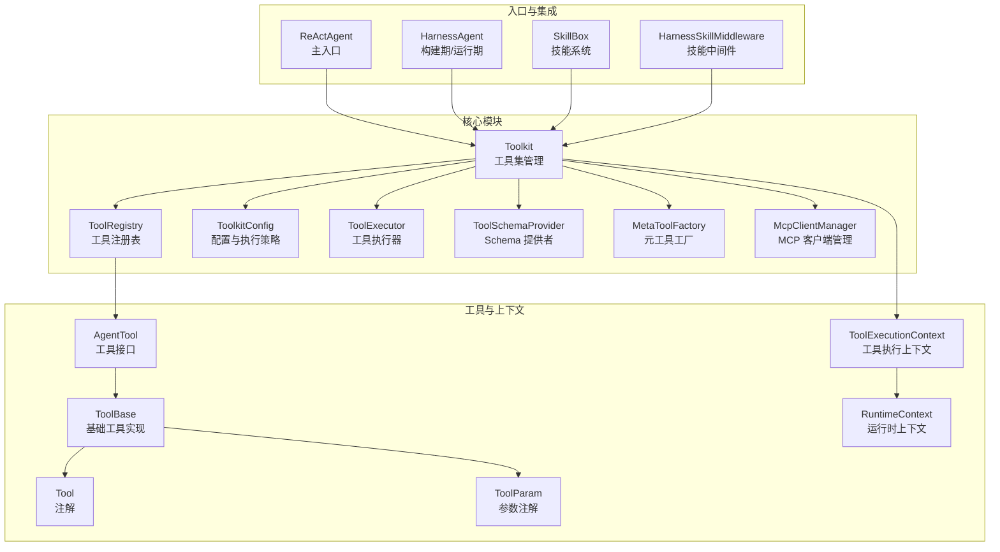
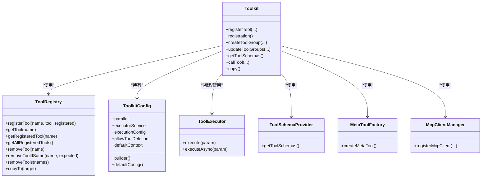
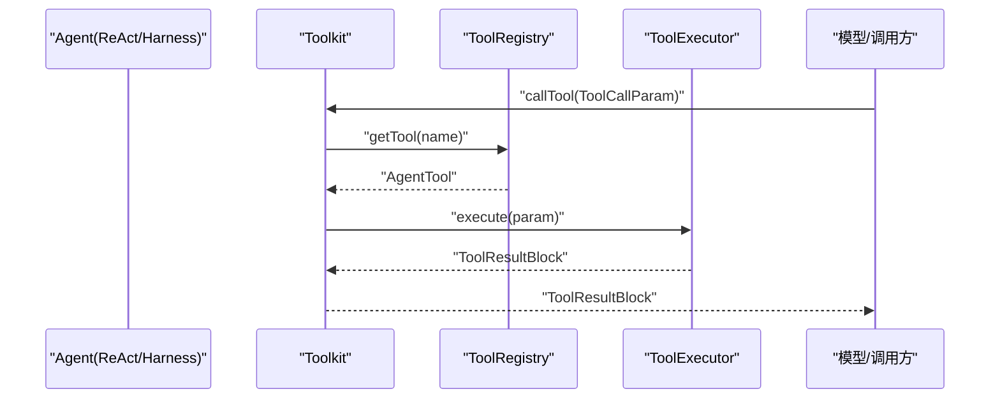
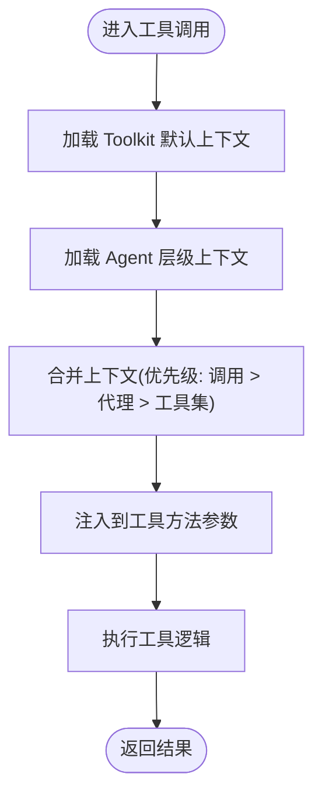
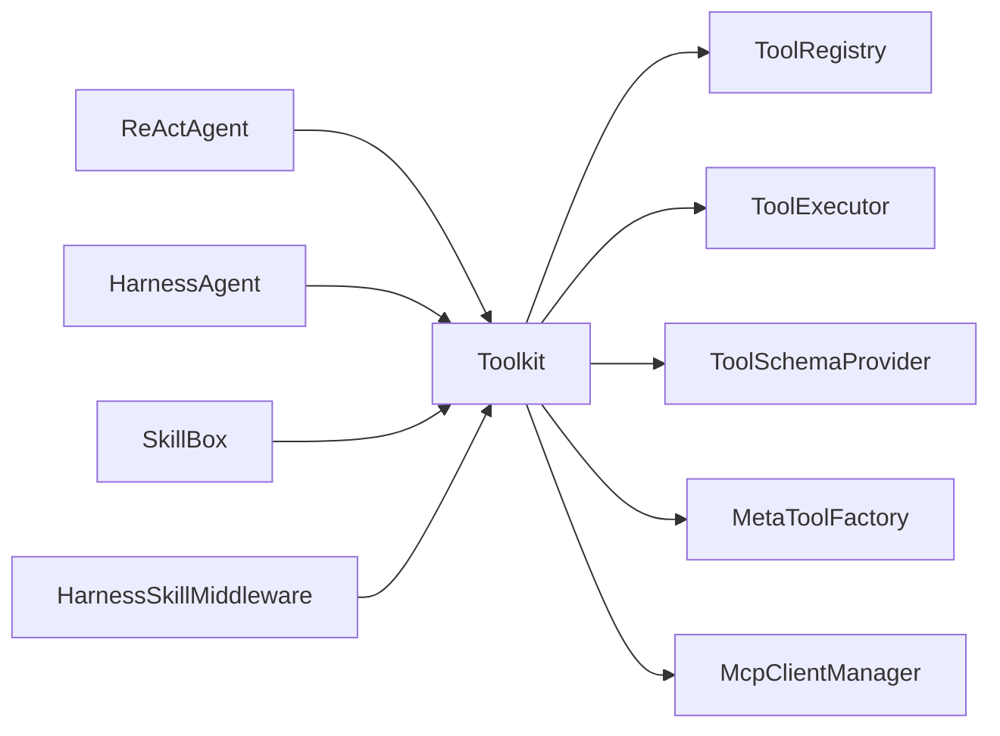

# 工具集管理

<cite>
**本文档引用的文件**
- [Toolkit.java](file://agentscope-core/src/main/java/io/agentscope/core/tool/Toolkit.java)
- [ToolRegistry.java](file://agentscope-core/src/main/java/io/agentscope/core/tool/ToolRegistry.java)
- [ToolkitConfig.java](file://agentscope-core/src/main/java/io/agentscope/core/tool/ToolkitConfig.java)
- [ToolExecutor.java](file://agentscope-core/src/main/java/io/agentscope/core/tool/ToolExecutor.java)
- [ToolSchemaProvider.java](file://agentscope-core/src/main/java/io/agentscope/core/tool/ToolSchemaProvider.java)
- [MetaToolFactory.java](file://agentscope-core/src/main/java/io/agentscope/core/tool/MetaToolFactory.java)
- [McpClientManager.java](file://agentscope-core/src/main/java/io/agentscope/core/tool/McpClientManager.java)
- [Tool.java](file://agentscope-core/src/main/java/io/agentscope/core/tool/Tool.java)
- [ToolParam.java](file://agentscope-core/src/main/java/io/agentscope/core/tool/ToolParam.java)
- [ToolCallParam.java](file://agentscope-core/src/main/java/io/agentscope/core/tool/ToolCallParam.java)
- [ToolResultBlock.java](file://agentscope-core/src/main/java/io/agentscope/core/tool/ToolResultBlock.java)
- [ToolExecutionContext.java](file://agentscope-core/src/main/java/io/agentscope/core/tool/ToolExecutionContext.java)
- [ToolGroupManager.java](file://agentscope-core/src/main/java/io/agentscope/core/tool/ToolGroupManager.java)
- [ToolGroup.java](file://agentscope-core/src/main/java/io/agentscope/core/tool/ToolGroup.java)
- [ToolRegistration.java](file://agentscope-core/src/main/java/io/agentscope/core/tool/ToolRegistration.java)
- [ReActAgent.java](file://agentscope-core/src/main/java/io/agentscope/core/ReActAgent.java)
- [HarnessAgent.java](file://agentscope-harness/src/main/java/io/agentscope/harness/agent/HarnessAgent.java)
- [ToolFilter.java](file://agentscope-harness/src/main/java/io/agentscope/harness/agent/tools/ToolFilter.java)
- [ToolProviderTypeRegistry.java](file://agentscope-builder-saton/src/main/java/io/agentscope/builder/saton/factory/tool/ToolProviderTypeRegistry.java)
- [ToolType.java](file://agentscope-builder-saton/src/main/java/io/agentscope/builder/saton/factory/tool/ToolType.java)
- [ToolFactory.java](file://agentscope-builder-saton/src/main/java/io/agentscope/builder/saton/factory/tool/ToolFactory.java)
- [AgentToolsController.java](file://agentscope-examples/agents/agentscope-builder/src/main/java/io/agentscope/builder/web/api/AgentToolsController.java)
- [ToolGroupExample.java](file://agentscope-examples/documentation/src/main/java/io/agentscope/examples/documentation2/tool/ToolGroupExample.java)
- [ToolExecutionContextExample.java](file://agentscope-examples/documentation/src/main/java/io/agentscope/examples/documentation2/tool/ToolExecutionContextExample.java)
- [ToolBase.java](file://agentscope-core/src/main/java/io/agentscope/core/tool/ToolBase.java)
- [AgentTool.java](file://agentscope-core/src/main/java/io/agentscope/core/tool/AgentTool.java)
- [ToolMethodInvoker.java](file://agentscope-core/src/main/java/io/agentscope/core/tool/ToolMethodInvoker.java)
- [DefaultToolResultConverter.java](file://agentscope-core/src/main/java/io/agentscope/core/tool/DefaultToolResultConverter.java)
- [ToolEmitter.java](file://agentscope-core/src/main/java/io/agentscope/core/tool/ToolEmitter.java)
- [ToolResultConverter.java](file://agentscope-core/src/main/java/io/agentscope/core/tool/ToolResultConverter.java)
- [ToolSchemaGenerator.java](file://agentscope-core/src/main/java/io/agentscope/core/tool/ToolSchemaGenerator.java)
- [ExecutionConfig.java](file://agentscope-core/src/main/java/io/agentscope/core/model/ExecutionConfig.java)
- [RuntimeContext.java](file://agentscope-core/src/main/java/io/agentscope/core/agent/RuntimeContext.java)
- [SkillBox.java](file://agentscope-core/src/main/java/io/agentscope/core/skill/SkillBox.java)
- [SkillToolFactory.java](file://agentscope-core/src/main/java/io/agentscope/core/skill/SkillToolFactory.java)
- [SkillFilter.java](file://agentscope-harness/src/main/java/io/agentscope/harness/agent/skill/SkillFilter.java)
- [HarnessSkillMiddleware.java](file://agentscope-harness/src/main/java/io/agentscope/harness/agent/middleware/HarnessSkillMiddleware.java)
- [McpServerRegistrar.java](file://agentscope-harness/src/main/java/io/agentscope/harness/agent/tools/McpServerRegistrar.java)
- [McpClientWrapper.java](file://agentscope-core/src/main/java/io/agentscope/core/tool/mcp/McpClientWrapper.java)
- [McpSchema.java](file://agentscope-core/src/main/java/io/agentscope/core/tool/mcp/McpSchema.java)
- [McpTool.java](file://agentscope-core/src/main/java/io/agentscope/core/tool/mcp/McpTool.java)
- [ToolExecutorTest.java](file://agentscope-core/src/test/java/io/agentscope/core/tool/ToolExecutorTest.java)
- [ToolkitTest.java](file://agentscope-core/src/test/java/io/agentscope/core/tool/ToolkitTest.java)
- [ToolRegistryTest.java](file://agentscope-core/src/test/java/io/agentscope/core/tool/ToolRegistryTest.java)
- [ToolGroupExample.java](file://agentscope-examples/documentation/src/main/java/io/agentscope/examples/documentation2/tool/ToolGroupExample.java)
- [ToolExecutionContextIntegrationTest.java](file://agentscope-core/src/test/java/io/agentscope/core/tool/ToolExecutionContextIntegrationTest.java)
- [ToolFilterTest.java](file://agentscope-harness/src/test/java/io/agentscope/harness/agent/tools/ToolFilterTest.java)
- [ToolFactory.java](file://agentscope-builder-saton/src/main/java/io/agentscope/builder/saton/factory/tool/ToolFactory.java)
- [ToolProviderTypeRegistry.java](file://agentscope-builder-saton/src/main/java/io/agentscope/builder/saton/factory/tool/ToolProviderTypeRegistry.java)
- [ToolType.java](file://agentscope-builder-saton/src/main/java/io/agentscope/builder/saton/factory/tool/ToolType.java)
- [AgentBuildOrchestrator.java](file://agentscope-builder-saton/src/main/java/io/agentscope/builder/saton/agent/runtime/AgentBuildOrchestrator.java)
- [StubToolType.java](file://agentscope-builder-saton/src/test/java/io/agentscope/builder/saton/agent/runtime/StubToolType.java)
- [ToolGroupExample.java](file://agentscope-examples/documentation/src/main/java/io/agentscope/examples/documentation2/tool/ToolGroupExample.java)
- [ToolExecutionContextExample.java](file://agentscope-examples/documentation/src/main/java/io/agentscope/examples/documentation2/tool/ToolExecutionContextExample.java)
- [ToolExecutorTest.java](file://agentscope-core/src/test/java/io/agentscope/core/tool/ToolExecutorTest.java)
- [ToolkitTest.java](file://agentscope-core/src/test/java/io/agentscope/core/tool/ToolkitTest.java)
- [ToolRegistryTest.java](file://agentscope-core/src/test/java/io/agentscope/core/tool/ToolRegistryTest.java)
- [ToolFilterTest.java](file://agentscope-harness/src/test/java/io/agentscope/harness/agent/tools/ToolFilterTest.java)
- [ToolFactory.java](file://agentscope-builder-saton/src/main/java/io/agentscope/builder/saton/factory/tool/ToolFactory.java)
- [ToolProviderTypeRegistry.java](file://agentscope-builder-saton/src/main/java/io/agentscope/builder/saton/factory/tool/ToolProviderTypeRegistry.java)
- [ToolType.java](file://agentscope-builder-saton/src/main/java/io/agentscope/builder/saton/factory/tool/ToolType.java)
- [AgentBuildOrchestrator.java](file://agentscope-builder-saton/src/main/java/io/agentscope/builder/saton/agent/runtime/AgentBuildOrchestrator.java)
- [StubToolType.java](file://agentscope-builder-saton/src/test/java/io/agentscope/builder/saton/agent/runtime/StubToolType.java)
</cite>

## 目录
1. [简介](#简介)
2. [项目结构](#项目结构)
3. [核心组件](#核心组件)
4. [架构总览](#架构总览)
5. [组件详细分析](#组件详细分析)
6. [依赖关系分析](#依赖关系分析)
7. [性能考量](#性能考量)
8. [故障排查指南](#故障排查指南)
9. [结论](#结论)
10. [附录](#附录)

## 简介
本文件为 AgentScope 工具集管理系统提供完整的 API 参考与最佳实践指南。重点覆盖以下方面：
- Toolkit 工具集的核心能力：工具注册、发现、分组管理、动态激活与查询
- ToolRegistry 工具注册表的实现机制与注册流程
- ToolkitConfig 初始化参数与执行配置
- 工具生命周期管理、依赖注入与运行时上下文作用域控制
- 工具集操作的最佳实践与性能优化建议
- 工具集扩展与自定义工具注册的实现指南

## 项目结构
AgentScope 将工具集管理能力集中在 core 模块的 tool 包内，并通过 ReActAgent、HarnessAgent 等入口与中间件、Hook、技能系统协同工作。构建期与运行期还提供了 Builder-Saton 的工具类型注册与内省能力。

图表来源
- [Toolkit.java](file://agentscope-core/src/main/java/io/agentscope/core/tool/Toolkit.java)
- [ToolRegistry.java](file://agentscope-core/src/main/java/io/agentscope/core/tool/ToolRegistry.java)
- [ToolkitConfig.java](file://agentscope-core/src/main/java/io/agentscope/core/tool/ToolkitConfig.java)
- [ToolExecutor.java](file://agentscope-core/src/main/java/io/agentscope/core/tool/ToolExecutor.java)
- [ToolSchemaProvider.java](file://agentscope-core/src/main/java/io/agentscope/core/tool/ToolSchemaProvider.java)
- [MetaToolFactory.java](file://agentscope-core/src/main/java/io/agentscope/core/tool/MetaToolFactory.java)
- [McpClientManager.java](file://agentscope-core/src/main/java/io/agentscope/core/tool/McpClientManager.java)
- [ReActAgent.java](file://agentscope-core/src/main/java/io/agentscope/core/ReActAgent.java)
- [HarnessAgent.java](file://agentscope-harness/src/main/java/io/agentscope/harness/agent/HarnessAgent.java)
- [SkillBox.java](file://agentscope-core/src/main/java/io/agentscope/core/skill/SkillBox.java)
- [HarnessSkillMiddleware.java](file://agentscope-harness/src/main/java/io/agentscope/harness/agent/middleware/HarnessSkillMiddleware.java)
- [Tool.java](file://agentscope-core/src/main/java/io/agentscope/core/tool/Tool.java)
- [ToolParam.java](file://agentscope-core/src/main/java/io/agentscope/core/tool/ToolParam.java)
- [ToolExecutionContext.java](file://agentscope-core/src/main/java/io/agentscope/core/tool/ToolExecutionContext.java)
- [RuntimeContext.java](file://agentscope-core/src/main/java/io/agentscope/core/agent/RuntimeContext.java)

章节来源
- [Toolkit.java](file://agentscope-core/src/main/java/io/agentscope/core/tool/Toolkit.java)
- [ToolRegistry.java](file://agentscope-core/src/main/java/io/agentscope/core/tool/ToolRegistry.java)
- [ToolkitConfig.java](file://agentscope-core/src/main/java/io/agentscope/core/tool/ToolkitConfig.java)
- [ToolExecutor.java](file://agentscope-core/src/main/java/io/agentscope/core/tool/ToolExecutor.java)
- [ToolSchemaProvider.java](file://agentscope-core/src/main/java/io/agentscope/core/tool/ToolSchemaProvider.java)
- [MetaToolFactory.java](file://agentscope-core/src/main/java/io/agentscope/core/tool/MetaToolFactory.java)
- [McpClientManager.java](file://agentscope-core/src/main/java/io/agentscope/core/tool/McpClientManager.java)
- [ReActAgent.java](file://agentscope-core/src/main/java/io/agentscope/core/ReActAgent.java)
- [HarnessAgent.java](file://agentscope-harness/src/main/java/io/agentscope/harness/agent/HarnessAgent.java)
- [SkillBox.java](file://agentscope-core/src/main/java/io/agentscope/core/skill/SkillBox.java)
- [HarnessSkillMiddleware.java](file://agentscope-harness/src/main/java/io/agentscope/harness/agent/middleware/HarnessSkillMiddleware.java)

## 核心组件
- Toolkit：工具集的统一入口，负责工具注册、分组管理、Schema 生成、MCP 客户端接入、执行器创建与工具调用。
- ToolRegistry：线程安全的工具注册表，维护工具实例与注册元数据映射。
- ToolkitConfig：工具集配置，包括并行执行、自定义执行器、超时重试策略、默认上下文等。
- ToolExecutor：工具执行器，封装工具调用、超时与重试、并发策略与结果转换。
- ToolSchemaProvider：基于注册表与分组状态生成工具 Schema。
- MetaToolFactory：根据分组状态生成“元工具”，用于动态聚合与路由。
- McpClientManager：MCP 客户端注册与工具暴露，支持预设参数映射与输出 Schema 保留。
- AgentTool/ToolBase：工具抽象与基础实现，配合注解驱动的反射式工具注册。
- Tool/ToolParam：工具与参数注解，驱动 Schema 生成与参数注入。
- ToolExecutionContext/RuntimeContext：工具执行上下文与运行时上下文，支持多层上下文合并与权限控制。
- SkillBox/HarnessSkillMiddleware：技能系统与中间件，可将技能转化为工具并绑定到 Toolkit。

章节来源
- [Toolkit.java](file://agentscope-core/src/main/java/io/agentscope/core/tool/Toolkit.java)
- [ToolRegistry.java](file://agentscope-core/src/main/java/io/agentscope/core/tool/ToolRegistry.java)
- [ToolkitConfig.java](file://agentscope-core/src/main/java/io/agentscope/core/tool/ToolkitConfig.java)
- [ToolExecutor.java](file://agentscope-core/src/main/java/io/agentscope/core/tool/ToolExecutor.java)
- [ToolSchemaProvider.java](file://agentscope-core/src/main/java/io/agentscope/core/tool/ToolSchemaProvider.java)
- [MetaToolFactory.java](file://agentscope-core/src/main/java/io/agentscope/core/tool/MetaToolFactory.java)
- [McpClientManager.java](file://agentscope-core/src/main/java/io/agentscope/core/tool/McpClientManager.java)
- [Tool.java](file://agentscope-core/src/main/java/io/agentscope/core/tool/Tool.java)
- [ToolParam.java](file://agentscope-core/src/main/java/io/agentscope/core/tool/ToolParam.java)
- [ToolExecutionContext.java](file://agentscope-core/src/main/java/io/agentscope/core/tool/ToolExecutionContext.java)
- [RuntimeContext.java](file://agentscope-core/src/main/java/io/agentscope/core/agent/RuntimeContext.java)
- [SkillBox.java](file://agentscope-core/src/main/java/io/agentscope/core/skill/SkillBox.java)
- [HarnessSkillMiddleware.java](file://agentscope-harness/src/main/java/io/agentscope/harness/agent/middleware/HarnessSkillMiddleware.java)

## 架构总览
下图展示工具集管理在 AgentScope 中的整体架构与交互关系：

图表来源
- [Toolkit.java](file://agentscope-core/src/main/java/io/agentscope/core/tool/Toolkit.java)
- [ToolRegistry.java](file://agentscope-core/src/main/java/io/agentscope/core/tool/ToolRegistry.java)
- [ToolkitConfig.java](file://agentscope-core/src/main/java/io/agentscope/core/tool/ToolkitConfig.java)
- [ToolExecutor.java](file://agentscope-core/src/main/java/io/agentscope/core/tool/ToolExecutor.java)
- [ToolSchemaProvider.java](file://agentscope-core/src/main/java/io/agentscope/core/tool/ToolSchemaProvider.java)
- [MetaToolFactory.java](file://agentscope-core/src/main/java/io/agentscope/core/tool/MetaToolFactory.java)
- [McpClientManager.java](file://agentscope-core/src/main/java/io/agentscope/core/tool/McpClientManager.java)

## 组件详细分析

### Toolkit 工具集管理
- 工具注册
  - 支持对象注册、方法级注册、MCP 客户端注册、技能工具注册等多源接入。
  - 提供 ToolRegistration 流式注册 API，支持指定分组、扩展模型与预设参数。
- 分组管理
  - createToolGroup 创建分组，updateToolGroups 动态激活/停用分组。
  - ToolGroupManager 维护分组状态与可见性。
- Schema 生成
  - ToolSchemaProvider 基于注册表与分组状态生成工具 Schema，供模型理解工具能力。
- 执行与调用
  - ToolExecutor 封装工具调用、超时与重试、并发策略与结果转换。
  - callTool 提供统一的工具调用入口，支持 RuntimeContext 与 ToolExecutionContext。
- 复制与隔离
  - copy 深拷贝工具集，避免不同 Agent 共享状态导致的干扰。

图表来源
- [Toolkit.java](file://agentscope-core/src/main/java/io/agentscope/core/tool/Toolkit.java)
- [ToolRegistry.java](file://agentscope-core/src/main/java/io/agentscope/core/tool/ToolRegistry.java)
- [ToolExecutor.java](file://agentscope-core/src/main/java/io/agentscope/core/tool/ToolExecutor.java)
- [ToolCallParam.java](file://agentscope-core/src/main/java/io/agentscope/core/tool/ToolCallParam.java)
- [ToolResultBlock.java](file://agentscope-core/src/main/java/io/agentscope/core/tool/ToolResultBlock.java)

章节来源
- [Toolkit.java](file://agentscope-core/src/main/java/io/agentscope/core/tool/Toolkit.java)
- [ToolGroupManager.java](file://agentscope-core/src/main/java/io/agentscope/core/tool/ToolGroupManager.java)
- [ToolSchemaProvider.java](file://agentscope-core/src/main/java/io/agentscope/core/tool/ToolSchemaProvider.java)
- [ToolExecutor.java](file://agentscope-core/src/main/java/io/agentscope/core/tool/ToolExecutor.java)

### ToolRegistry 工具注册表
- 注册与查询
  - registerTool、getTool、getRegisteredTool、getAllRegisteredTools。
- 删除与一致性
  - removeTool、removeToolIfSame 使用并发安全容器与原子删除避免竞态。
- 复制
  - copyTo 支持将注册表内容复制到目标注册表，用于深拷贝场景。

章节来源
- [ToolRegistry.java](file://agentscope-core/src/main/java/io/agentscope/core/tool/ToolRegistry.java)

### ToolkitConfig 配置与初始化参数
- 关键配置项
  - parallel：是否并行执行工具
  - executorService：自定义执行器服务
  - executionConfig：工具执行的超时与重试策略
  - allowToolDeletion：是否允许删除工具/分组（影响 updateToolGroups/deactivate 等行为）
  - defaultContext：默认工具执行上下文（已标注过时，推荐使用 RuntimeContext）
- 默认配置
  - defaultConfig 提供默认顺序执行策略与 Reactor 调度器。

章节来源
- [ToolkitConfig.java](file://agentscope-core/src/main/java/io/agentscope/core/tool/ToolkitConfig.java)

### ToolExecutor 工具执行器
- 执行策略
  - 基于 ToolkitConfig 的并行/串行策略与自定义执行器。
  - 结合 ExecutionConfig 实现超时与重试。
- 结果转换
  - 默认转换器与自定义转换器支持复杂返回值处理。

章节来源
- [ToolExecutor.java](file://agentscope-core/src/main/java/io/agentscope/core/tool/ToolExecutor.java)
- [ExecutionConfig.java](file://agentscope-core/src/main/java/io/agentscope/core/model/ExecutionConfig.java)
- [DefaultToolResultConverter.java](file://agentscope-core/src/main/java/io/agentscope/core/tool/DefaultToolResultConverter.java)

### 上下文注入与作用域控制
- ToolExecutionContext
  - 旧版默认上下文，支持注册多个上下文对象，适用于工具方法参数注入。
- RuntimeContext
  - 新一代运行时上下文，支持 per-call 注入、权限控制与事件链路传递。
- 上下文合并
  - ToolExecutionContext.merge 支持多层级上下文合并（工具集级别、代理级别、调用级别）。

图表来源
- [ToolExecutionContext.java](file://agentscope-core/src/main/java/io/agentscope/core/tool/ToolExecutionContext.java)
- [RuntimeContext.java](file://agentscope-core/src/main/java/io/agentscope/core/agent/RuntimeContext.java)
- [ToolExecutionContextIntegrationTest.java](file://agentscope-core/src/test/java/io/agentscope/core/tool/ToolExecutionContextIntegrationTest.java)

章节来源
- [ToolExecutionContext.java](file://agentscope-core/src/main/java/io/agentscope/core/tool/ToolExecutionContext.java)
- [RuntimeContext.java](file://agentscope-core/src/main/java/io/agentscope/core/agent/RuntimeContext.java)
- [ToolExecutionContextIntegrationTest.java](file://agentscope-core/src/test/java/io/agentscope/core/tool/ToolExecutionContextIntegrationTest.java)

### MCP 工具与外部客户端集成
- McpClientManager
  - 注册 MCP 客户端，解析工具清单，生成工具并绑定到注册表与分组。
  - 支持预设参数映射与输出 Schema 保留。
- McpClientWrapper/McpSchema/McpTool
  - 封装 MCP 协议交互与工具描述。

章节来源
- [McpClientManager.java](file://agentscope-core/src/main/java/io/agentscope/core/tool/McpClientManager.java)
- [McpClientWrapper.java](file://agentscope-core/src/main/java/io/agentscope/core/tool/mcp/McpClientWrapper.java)
- [McpSchema.java](file://agentscope-core/src/main/java/io/agentscope/core/tool/mcp/McpSchema.java)
- [McpTool.java](file://agentscope-core/src/main/java/io/agentscope/core/tool/mcp/McpTool.java)

### 技能系统与工具集绑定
- SkillBox
  - 将技能注册为工具并绑定到 Toolkit，支持动态加载与更新。
- HarnessSkillMiddleware
  - 在系统提示阶段注入技能提示，确保模型了解可用工具。

章节来源
- [SkillBox.java](file://agentscope-core/src/main/java/io/agentscope/core/skill/SkillBox.java)
- [HarnessSkillMiddleware.java](file://agentscope-harness/src/main/java/io/agentscope/harness/agent/middleware/HarnessSkillMiddleware.java)

### 构建期与运行期工具类型扩展
- ToolProviderTypeRegistry/ToolType/ToolFactory
  - Builder-Saton 提供 SPI 式工具类型抽象，支持通过类型元数据与实例化工厂完成工具内省与注册。
- AgentBuildOrchestrator
  - 在构建 Agent 时自动内省并注册工具类型，结合 Spring Bean 发现机制。
- StubToolType
  - 示例工具类型，演示如何通过 ToolType.instantiate 返回 AgentTool 或带 @Tool 注解的 POJO。

章节来源
- [ToolProviderTypeRegistry.java](file://agentscope-builder-saton/src/main/java/io/agentscope/builder/saton/factory/tool/ToolProviderTypeRegistry.java)
- [ToolType.java](file://agentscope-builder-saton/src/main/java/io/agentscope/builder/saton/factory/tool/ToolType.java)
- [ToolFactory.java](file://agentscope-builder-saton/src/main/java/io/agentscope/builder/saton/factory/tool/ToolFactory.java)
- [AgentBuildOrchestrator.java](file://agentscope-builder-saton/src/main/java/io/agentscope/builder/saton/agent/runtime/AgentBuildOrchestrator.java)
- [StubToolType.java](file://agentscope-builder-saton/src/test/java/io/agentscope/builder/saton/agent/runtime/StubToolType.java)

## 依赖关系分析
- 组件耦合
  - Toolkit 对 ToolRegistry、ToolSchemaProvider、ToolExecutor、MetaToolFactory、McpClientManager 具有强依赖，体现“组合优于继承”的设计。
  - ReActAgent/HarnessAgent 通过 Builder 持有 Toolkit，形成清晰的入口与执行边界。
- 外部依赖
  - Spring 生态（如 ToolFactory 的 Spring Bean 发现）、MCP 协议栈、模型提供商 SDK。
- 循环依赖风险
  - 通过 ToolExecutor 的 ToolRegistry 引用与 ToolSchemaProvider 的只读访问降低循环风险；MCP 注册回调在构造阶段注入，避免运行期循环。

图表来源
- [ReActAgent.java](file://agentscope-core/src/main/java/io/agentscope/core/ReActAgent.java)
- [HarnessAgent.java](file://agentscope-harness/src/main/java/io/agentscope/harness/agent/HarnessAgent.java)
- [Toolkit.java](file://agentscope-core/src/main/java/io/agentscope/core/tool/Toolkit.java)
- [ToolRegistry.java](file://agentscope-core/src/main/java/io/agentscope/core/tool/ToolRegistry.java)
- [ToolExecutor.java](file://agentscope-core/src/main/java/io/agentscope/core/tool/ToolExecutor.java)
- [ToolSchemaProvider.java](file://agentscope-core/src/main/java/io/agentscope/core/tool/ToolSchemaProvider.java)
- [MetaToolFactory.java](file://agentscope-core/src/main/java/io/agentscope/core/tool/MetaToolFactory.java)
- [McpClientManager.java](file://agentscope-core/src/main/java/io/agentscope/core/tool/McpClientManager.java)
- [SkillBox.java](file://agentscope-core/src/main/java/io/agentscope/core/skill/SkillBox.java)
- [HarnessSkillMiddleware.java](file://agentscope-harness/src/main/java/io/agentscope/harness/agent/middleware/HarnessSkillMiddleware.java)

章节来源
- [ReActAgent.java](file://agentscope-core/src/main/java/io/agentscope/core/ReActAgent.java)
- [HarnessAgent.java](file://agentscope-harness/src/main/java/io/agentscope/harness/agent/HarnessAgent.java)
- [Toolkit.java](file://agentscope-core/src/main/java/io/agentscope/core/tool/Toolkit.java)

## 性能考量
- 并行执行
  - 通过 ToolkitConfig.parallel 与自定义执行器提升吞吐，但需注意工具幂等性与资源竞争。
- 超时与重试
  - ExecutionConfig 提供统一的超时与重试策略，避免长时间阻塞导致的请求堆积。
- Schema 缓存
  - ToolSchemaProvider 与 MetaToolFactory 生成的 Schema 可缓存复用，减少重复计算。
- 上下文合并成本
  - 多层级上下文合并存在开销，建议仅在必要时合并，避免过度注入。
- MCP 工具批量注册
  - McpClientManager 一次性注册多个工具，减少多次网络交互与 Schema 解析成本。

## 故障排查指南
- 工具未生效
  - 检查分组状态：updateToolGroups 是否正确激活；allowToolDeletion=false 会忽略 deactivate。
  - 检查工具注册：ToolRegistration.apply 是否成功；MCP 工具是否完成客户端初始化与工具清单拉取。
- 上下文注入异常
  - 确认 RuntimeContext/ToolExecutionContext 的类型与名称匹配；检查合并顺序与空值处理。
- 执行超时或失败
  - 调整 ExecutionConfig 的超时与重试策略；确认工具内部是否抛出异常或阻塞。
- 权限拒绝
  - 检查 ToolExecutionContext 中的权限配置；确认 Hook/中间件对工具参数的修改未破坏权限校验。

章节来源
- [ToolkitTest.java](file://agentscope-core/src/test/java/io/agentscope/core/tool/ToolkitTest.java)
- [ToolExecutorTest.java](file://agentscope-core/src/test/java/io/agentscope/core/tool/ToolExecutorTest.java)
- [ToolExecutionContextIntegrationTest.java](file://agentscope-core/src/test/java/io/agentscope/core/tool/ToolExecutionContextIntegrationTest.java)
- [ToolFilterTest.java](file://agentscope-harness/src/test/java/io/agentscope/harness/agent/tools/ToolFilterTest.java)

## 结论
Toolkit 作为 AgentScope 工具集管理的核心，通过 ToolRegistry、ToolExecutor、ToolSchemaProvider、MetaToolFactory 与 McpClientManager 等组件协作，实现了从工具注册、分组管理、Schema 生成到执行与结果转换的完整闭环。结合 RuntimeContext 与技能系统，工具集具备良好的扩展性、可控的生命周期与强大的运行时上下文注入能力。遵循本文的最佳实践与性能建议，可在保证稳定性的同时获得更高的吞吐与响应速度。

## 附录
- 快速上手示例
  - 工具分组与动态激活：参见 [ToolGroupExample.java](file://agentscope-examples/documentation/src/main/java/io/agentscope/examples/documentation2/tool/ToolGroupExample.java)
  - 运行时上下文注入：参见 [ToolExecutionContextExample.java](file://agentscope-examples/documentation/src/main/java/io/agentscope/examples/documentation2/tool/ToolExecutionContextExample.java)
- API 参考要点
  - 工具注册：Toolkit.registerTool、ToolRegistration、ToolFactory
  - 分组管理：ToolGroupManager、updateToolGroups
  - 执行配置：ToolkitConfig、ExecutionConfig
  - 上下文：ToolExecutionContext、RuntimeContext
  - MCP：McpClientManager、McpClientWrapper、McpSchema、McpTool
  - 技能：SkillBox、HarnessSkillMiddleware