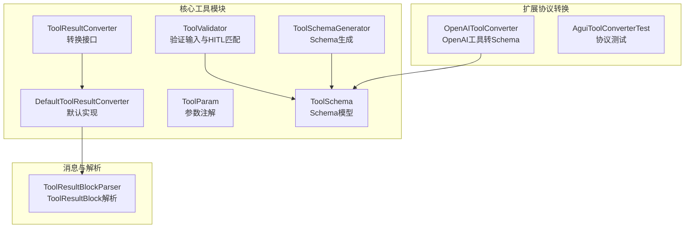
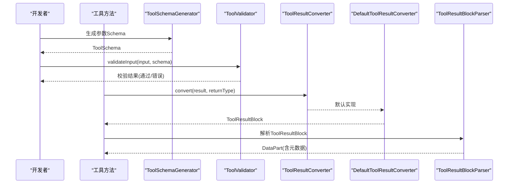
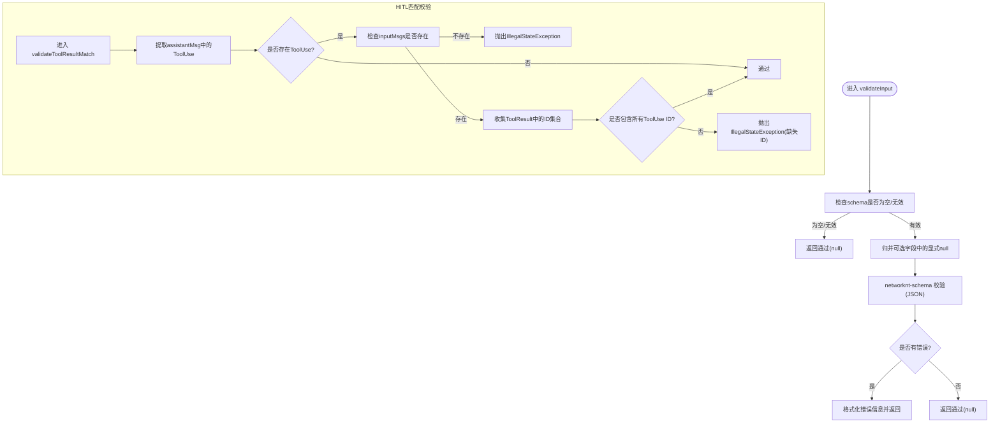
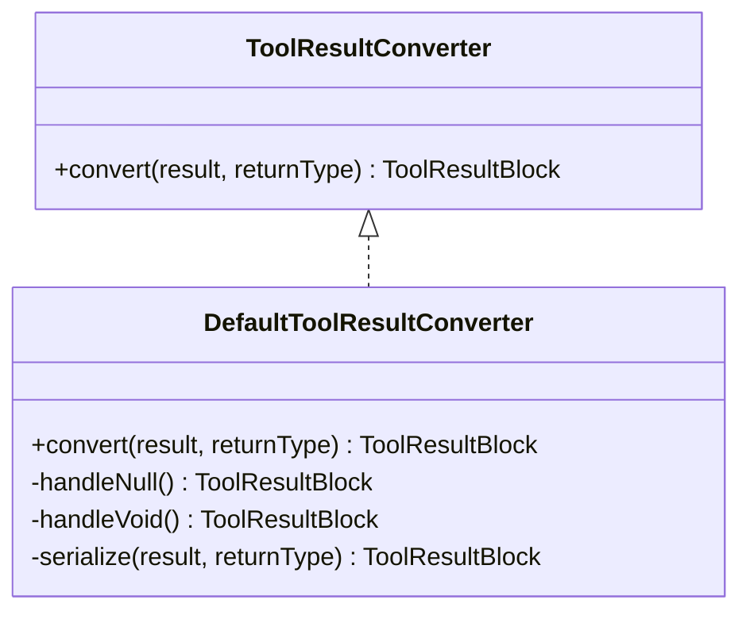
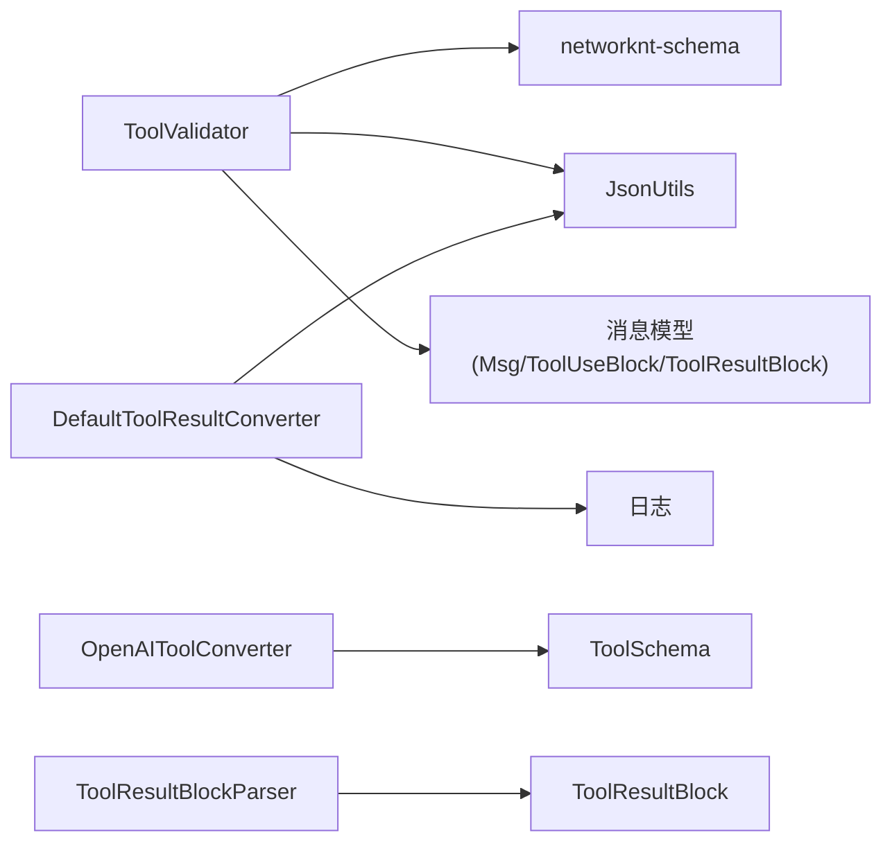

# 工具验证与转换

<cite>
**本文引用的文件**
- [ToolValidator.java](file://agentscope-core/src/main/java/io/agentscope/core/tool/ToolValidator.java)
- [ToolResultConverter.java](file://agentscope-core/src/main/java/io/agentscope/core/tool/ToolResultConverter.java)
- [DefaultToolResultConverter.java](file://agentscope-core/src/main/java/io/agentscope/core/tool/DefaultToolResultConverter.java)
- [ToolValidatorTest.java](file://agentscope-core/src/test/java/io/agentscope/core/tool/ToolValidatorTest.java)
- [DefaultToolResultConverterTest.java](file://agentscope-core/src/test/java/io/agentscope/core/tool/DefaultToolResultConverterTest.java)
- [ToolParam.java](file://agentscope-core/src/main/java/io/agentscope/core/tool/ToolParam.java)
- [ToolSchema.java](file://agentscope-core/src/main/java/io/agentscope/core/model/ToolSchema.java)
- [ToolSchemaGenerator.java](file://agentscope-core/src/main/java/io/agentscope/core/tool/ToolSchemaGenerator.java)
- [ToolResultBlockParser.java](file://agentscope-extensions/agentscope-extensions-protocol/agentscope-extensions-a2a/agentscope-extensions-a2a-client/src/main/java/io/agentscope/core/a2a/agent/message/ToolResultBlockParser.java)
- [OpenAIToolConverter.java](file://agentscope-extensions/agentscope-extensions-protocol/agentscope-extensions-chat-completions-web/src/main/java/io/agentscope/core/chat/completions/converter/OpenAIToolConverter.java)
- [OpenAIToolConverterTest.java](file://agentscope-extensions/agentscope-extensions-protocol/agentscope-extensions-chat-completions-web/src/test/java/io/agentscope/core/chat/completions/converter/OpenAIToolConverterTest.java)
- [AguiToolConverterTest.java](file://agentscope-extensions/agentscope-extensions-protocol/agentscope-extensions-agui/src/test/java/io/agentscope/core/agui/converter/AguiToolConverterTest.java)
- [tool.md（英文）](file://docs/v2/en/docs/building-blocks/tool.md)
- [permission-system.md（英文）](file://docs/v2/en/docs/building-blocks/permission-system.md)
</cite>

## 目录
1. [简介](#简介)
2. [项目结构](#项目结构)
3. [核心组件](#核心组件)
4. [架构总览](#架构总览)
5. [详细组件分析](#详细组件分析)
6. [依赖关系分析](#依赖关系分析)
7. [性能考量](#性能考量)
8. [故障排查指南](#故障排查指南)
9. [结论](#结论)
10. [附录](#附录)

## 简介
本文件面向AgentScope工具验证与转换系统，聚焦以下目标：
- 深入解释ToolValidator工具验证器的验证规则与约束条件，覆盖JSON Schema校验、空字段归并、$ref解析、HITL匹配校验等。
- 记录ToolResultConverter工具结果转换器的接口定义与实现要求，并说明DefaultToolResultConverter默认转换器的功能特性与配置选项。
- 详述工具参数验证、类型检查与边界条件处理策略。
- 提供自定义验证器与转换器的开发指南，涵盖复杂数据类型处理与敏感信息过滤建议。
- 总结验证失败与转换异常的处理策略。

## 项目结构
围绕工具验证与转换的核心代码主要位于agentscope-core模块的tool包中，配套的消息模型与扩展协议转换器位于其他模块：
- 核心验证与转换：ToolValidator、ToolResultConverter、DefaultToolResultConverter
- 参数注解与Schema生成：ToolParam、ToolSchema、ToolSchemaGenerator
- 扩展协议转换：OpenAIToolConverter、AguiToolConverter
- 结果块解析：ToolResultBlockParser
- 测试用例：ToolValidatorTest、DefaultToolResultConverterTest、OpenAIToolConverterTest、AguiToolConverterTest

图表来源
- [ToolValidator.java:47-265](file://agentscope-core/src/main/java/io/agentscope/core/tool/ToolValidator.java#L47-L265)
- [ToolResultConverter.java:48-58](file://agentscope-core/src/main/java/io/agentscope/core/tool/ToolResultConverter.java#L48-L58)
- [DefaultToolResultConverter.java:39-98](file://agentscope-core/src/main/java/io/agentscope/core/tool/DefaultToolResultConverter.java#L39-L98)
- [ToolParam.java](file://agentscope-core/src/main/java/io/agentscope/core/tool/ToolParam.java)
- [ToolSchema.java](file://agentscope-core/src/main/java/io/agentscope/core/model/ToolSchema.java)
- [ToolSchemaGenerator.java](file://agentscope-core/src/main/java/io/agentscope/core/tool/ToolSchemaGenerator.java)
- [OpenAIToolConverter.java:75-129](file://agentscope-extensions/agentscope-extensions-protocol/agentscope-extensions-chat-completions-web/src/main/java/io/agentscope/core/chat/completions/converter/OpenAIToolConverter.java#L75-L129)
- [ToolResultBlockParser.java:28-42](file://agentscope-extensions/agentscope-extensions-protocol/agentscope-extensions-a2a/agentscope-extensions-a2a-client/src/main/java/io/agentscope/core/a2a/agent/message/ToolResultBlockParser.java#L28-L42)

章节来源
- [ToolValidator.java:47-265](file://agentscope-core/src/main/java/io/agentscope/core/tool/ToolValidator.java#L47-L265)
- [ToolResultConverter.java:48-58](file://agentscope-core/src/main/java/io/agentscope/core/tool/ToolResultConverter.java#L48-L58)
- [DefaultToolResultConverter.java:39-98](file://agentscope-core/src/main/java/io/agentscope/core/tool/DefaultToolResultConverter.java#L39-L98)
- [ToolParam.java](file://agentscope-core/src/main/java/io/agentscope/core/tool/ToolParam.java)
- [ToolSchema.java](file://agentscope-core/src/main/java/io/agentscope/core/model/ToolSchema.java)
- [ToolSchemaGenerator.java](file://agentscope-core/src/main/java/io/agentscope/core/tool/ToolSchemaGenerator.java)
- [OpenAIToolConverter.java:75-129](file://agentscope-extensions/agentscope-extensions-protocol/agentscope-extensions-chat-completions-web/src/main/java/io/agentscope/core/chat/completions/converter/OpenAIToolConverter.java#L75-L129)
- [ToolResultBlockParser.java:28-42](file://agentscope-extensions/agentscope-extensions-protocol/agentscope-extensions-a2a/agentscope-extensions-a2a-client/src/main/java/io/agentscope/core/a2a/agent/message/ToolResultBlockParser.java#L28-L42)

## 核心组件
- ToolValidator：统一的工具相关验证器，支持JSON Schema输入校验与HITL场景下的ToolResult与ToolUse匹配校验。
- ToolResultConverter：工具结果转换接口，允许将任意返回值转换为ToolResultBlock，便于后续消息传递与展示。
- DefaultToolResultConverter：默认实现，负责null/void/ToolResultBlock直通、对象序列化与回退策略。

章节来源
- [ToolValidator.java:47-265](file://agentscope-core/src/main/java/io/agentscope/core/tool/ToolValidator.java#L47-L265)
- [ToolResultConverter.java:48-58](file://agentscope-core/src/main/java/io/agentscope/core/tool/ToolResultConverter.java#L48-L58)
- [DefaultToolResultConverter.java:39-98](file://agentscope-core/src/main/java/io/agentscope/core/tool/DefaultToolResultConverter.java#L39-L98)

## 架构总览
工具验证与转换贯穿“参数Schema生成—输入校验—执行—结果转换—消息封装”的链路。下图展示了从工具Schema到最终ToolResultBlock的关键交互：

图表来源
- [ToolSchemaGenerator.java](file://agentscope-core/src/main/java/io/agentscope/core/tool/ToolSchemaGenerator.java)
- [ToolValidator.java:77-104](file://agentscope-core/src/main/java/io/agentscope/core/tool/ToolValidator.java#L77-L104)
- [ToolResultConverter.java:48-58](file://agentscope-core/src/main/java/io/agentscope/core/tool/ToolResultConverter.java#L48-L58)
- [DefaultToolResultConverter.java:44-59](file://agentscope-core/src/main/java/io/agentscope/core/tool/DefaultToolResultConverter.java#L44-L59)
- [ToolResultBlockParser.java:31-41](file://agentscope-extensions/agentscope-extensions-protocol/agentscope-extensions-a2a/agentscope-extensions-a2a-client/src/main/java/io/agentscope/core/a2a/agent/message/ToolResultBlockParser.java#L31-L41)

## 详细组件分析

### ToolValidator：验证规则与约束条件
- 输入校验（validateInput）
  - 支持必填字段、类型校验（字符串/数字/整数/布尔/数组/对象）、枚举、数值范围(min/max)、字符串长度(minLength/maxLength)、正则(pattern)、嵌套对象与数组递归校验。
  - 对显式null的可选字段进行归并处理，使其等同于省略该字段，同时保留必需字段缺失的报错语义。
  - 支持$ref引用解析，修复了$defs位于根级时的引用问题，确保复杂Schema能正确解析。
  - 当schema为空或null时，默认通过，避免对无Schema工具施加不必要限制。
- HITL匹配校验（validateToolResultMatch）
  - 若存在待处理的ToolUse块而未提供ToolResult，则抛出非法状态异常；若ToolResult集合不包含所有必需的ToolUse ID，同样抛出异常。
  - 用于人类在环(HITL)恢复与基于Hook的流程控制，保证消息配对一致性。

图表来源
- [ToolValidator.java:77-104](file://agentscope-core/src/main/java/io/agentscope/core/tool/ToolValidator.java#L77-L104)
- [ToolValidator.java:227-263](file://agentscope-core/src/main/java/io/agentscope/core/tool/ToolValidator.java#L227-L263)

章节来源
- [ToolValidator.java:77-104](file://agentscope-core/src/main/java/io/agentscope/core/tool/ToolValidator.java#L77-L104)
- [ToolValidator.java:112-179](file://agentscope-core/src/main/java/io/agentscope/core/tool/ToolValidator.java#L112-L179)
- [ToolValidator.java:181-202](file://agentscope-core/src/main/java/io/agentscope/core/tool/ToolValidator.java#L181-L202)
- [ToolValidator.java:227-263](file://agentscope-core/src/main/java/io/agentscope/core/tool/ToolValidator.java#L227-L263)
- [ToolValidatorTest.java:76-127](file://agentscope-core/src/test/java/io/agentscope/core/tool/ToolValidatorTest.java#L76-L127)
- [ToolValidatorTest.java:129-183](file://agentscope-core/src/test/java/io/agentscope/core/tool/ToolValidatorTest.java#L129-L183)
- [ToolValidatorTest.java:185-272](file://agentscope-core/src/test/java/io/agentscope/core/tool/ToolValidatorTest.java#L185-L272)
- [ToolValidatorTest.java:274-323](file://agentscope-core/src/test/java/io/agentscope/core/tool/ToolValidatorTest.java#L274-L323)
- [ToolValidatorTest.java:325-381](file://agentscope-core/src/test/java/io/agentscope/core/tool/ToolValidatorTest.java#L325-L381)
- [ToolValidatorTest.java:383-485](file://agentscope-core/src/test/java/io/agentscope/core/tool/ToolValidatorTest.java#L383-L485)
- [ToolValidatorTest.java:487-528](file://agentscope-core/src/test/java/io/agentscope/core/tool/ToolValidatorTest.java#L487-L528)
- [ToolValidatorTest.java:530-562](file://agentscope-core/src/test/java/io/agentscope/core/tool/ToolValidatorTest.java#L530-L562)
- [ToolValidatorTest.java:564-658](file://agentscope-core/src/test/java/io/agentscope/core/tool/ToolValidatorTest.java#L564-L658)
- [ToolValidatorTest.java:660-720](file://agentscope-core/src/test/java/io/agentscope/core/tool/ToolValidatorTest.java#L660-L720)
- [ToolValidatorTest.java:722-800](file://agentscope-core/src/test/java/io/agentscope/core/tool/ToolValidatorTest.java#L722-L800)

### ToolResultConverter：接口定义与实现要求
- 接口职责
  - 将工具方法的返回值转换为ToolResultBlock，供消息系统使用。
  - 允许针对特定工具定制转换逻辑，如控制JSON序列化、添加元数据、过滤敏感信息、压缩大输出等。
- 使用方式
  - 在@Tool注解中通过converter属性指定自定义实现类。
- 默认行为
  - DefaultToolResultConverter已提供完整默认实现，详见下一节。

章节来源
- [ToolResultConverter.java:48-58](file://agentscope-core/src/main/java/io/agentscope/core/tool/ToolResultConverter.java#L48-L58)
- [tool.md（英文）:108-118](file://docs/v2/en/docs/building-blocks/tool.md#L108-L118)

### DefaultToolResultConverter：功能特性与配置选项
- 功能特性
  - null结果：转换为包含文本“null”的ToolResultBlock。
  - void返回：转换为包含文本“Done”的ToolResultBlock。
  - ToolResultBlock直通：直接返回原对象，避免重复包装。
  - 对象序列化：使用JsonUtils编码为JSON文本，放入TextBlock。
  - 回退策略：序列化失败时回退到toString()，并记录警告日志。
- 配置选项
  - 默认构造函数使用JsonSchemaUtils提供的ObjectMapper，确保Java 8时间类型等特殊对象可被正确序列化。
  - 支持自定义ObjectMapper（通过参数化构造），便于集成业务自定义序列化策略。

图表来源
- [ToolResultConverter.java:48-58](file://agentscope-core/src/main/java/io/agentscope/core/tool/ToolResultConverter.java#L48-L58)
- [DefaultToolResultConverter.java:39-98](file://agentscope-core/src/main/java/io/agentscope/core/tool/DefaultToolResultConverter.java#L39-L98)

章节来源
- [DefaultToolResultConverter.java:44-59](file://agentscope-core/src/main/java/io/agentscope/core/tool/DefaultToolResultConverter.java#L44-L59)
- [DefaultToolResultConverter.java:66-68](file://agentscope-core/src/main/java/io/agentscope/core/tool/DefaultToolResultConverter.java#L66-L68)
- [DefaultToolResultConverter.java:75-77](file://agentscope-core/src/main/java/io/agentscope/core/tool/DefaultToolResultConverter.java#L75-L77)
- [DefaultToolResultConverter.java:86-96](file://agentscope-core/src/main/java/io/agentscope/core/tool/DefaultToolResultConverter.java#L86-L96)
- [DefaultToolResultConverterTest.java:53-92](file://agentscope-core/src/test/java/io/agentscope/core/tool/DefaultToolResultConverterTest.java#L53-L92)
- [DefaultToolResultConverterTest.java:94-146](file://agentscope-core/src/test/java/io/agentscope/core/tool/DefaultToolResultConverterTest.java#L94-L146)
- [DefaultToolResultConverterTest.java:148-223](file://agentscope-core/src/test/java/io/agentscope/core/tool/DefaultToolResultConverterTest.java#L148-L223)
- [DefaultToolResultConverterTest.java:236-247](file://agentscope-core/src/test/java/io/agentscope/core/tool/DefaultToolResultConverterTest.java#L236-L247)
- [DefaultToolResultConverterTest.java:249-275](file://agentscope-core/src/test/java/io/agentscope/core/tool/DefaultToolResultConverterTest.java#L249-L275)

### 工具参数验证、类型检查与边界条件
- 必填字段与可选字段
  - 显式null的可选字段会被归并为省略，不会影响必填字段的校验；未知null字段在additionalProperties=false时仍会触发错误。
- 类型检查
  - 字符串/整数/数字/布尔/数组/对象类型严格校验；数组项类型逐项校验。
- 边界条件
  - 数值最小/最大值、字符串最小/最大长度、正则表达式匹配。
- 复杂Schema
  - $ref引用解析已修复，确保$defs位于根级时可正确解析。
- 生成Schema
  - ToolSchemaGenerator结合ToolParam注解生成参数Schema，支持嵌套Bean与可选字段处理。

章节来源
- [ToolValidator.java:112-179](file://agentscope-core/src/main/java/io/agentscope/core/tool/ToolValidator.java#L112-L179)
- [ToolValidator.java:181-202](file://agentscope-core/src/main/java/io/agentscope/core/tool/ToolValidator.java#L181-L202)
- [ToolValidatorTest.java:76-127](file://agentscope-core/src/test/java/io/agentscope/core/tool/ToolValidatorTest.java#L76-L127)
- [ToolValidatorTest.java:129-183](file://agentscope-core/src/test/java/io/agentscope/core/tool/ToolValidatorTest.java#L129-L183)
- [ToolValidatorTest.java:185-272](file://agentscope-core/src/test/java/io/agentscope/core/tool/ToolValidatorTest.java#L185-L272)
- [ToolValidatorTest.java:274-323](file://agentscope-core/src/test/java/io/agentscope/core/tool/ToolValidatorTest.java#L274-L323)
- [ToolValidatorTest.java:325-381](file://agentscope-core/src/test/java/io/agentscope/core/tool/ToolValidatorTest.java#L325-L381)
- [ToolValidatorTest.java:383-485](file://agentscope-core/src/test/java/io/agentscope/core/tool/ToolValidatorTest.java#L383-L485)
- [ToolValidatorTest.java:487-528](file://agentscope-core/src/test/java/io/agentscope/core/tool/ToolValidatorTest.java#L487-L528)
- [ToolValidatorTest.java:530-562](file://agentscope-core/src/test/java/io/agentscope/core/tool/ToolValidatorTest.java#L530-L562)
- [ToolValidatorTest.java:564-658](file://agentscope-core/src/test/java/io/agentscope/core/tool/ToolValidatorTest.java#L564-L658)
- [ToolValidatorTest.java:660-720](file://agentscope-core/src/test/java/io/agentscope/core/tool/ToolValidatorTest.java#L660-L720)
- [ToolParam.java](file://agentscope-core/src/main/java/io/agentscope/core/tool/ToolParam.java)
- [ToolSchemaGenerator.java](file://agentscope-core/src/main/java/io/agentscope/core/tool/ToolSchemaGenerator.java)

### 自定义验证器与转换器开发指南
- 自定义验证器
  - 若需在ToolValidator之外增加额外校验（如权限、业务规则），可在工具层实现自定义校验逻辑，或在调用前对输入进行二次校验。
  - 注意与ToolValidator的$ref解析、空字段归并保持一致，避免重复或冲突。
- 自定义转换器
  - 实现ToolResultConverter接口，覆盖convert方法，按需：
    - 控制JSON序列化策略（如日期格式、精度控制）。
    - 添加元数据（如工具名、调用ID、版本号）。
    - 敏感信息过滤（如脱敏、屏蔽）。
    - 大输出压缩或分片传输。
  - 在@Tool注解中通过converter属性绑定实现类。
- 复杂数据类型处理
  - 利用DefaultToolResultConverter的ObjectMapper策略，确保Java 8时间类型等可序列化；必要时传入自定义ObjectMapper。
  - 对不可序列化对象采用回退策略，保证稳定性。
- 敏感信息过滤
  - 在convert中对敏感字段进行脱敏或剔除，避免泄露。
  - 与权限系统配合，参考权限决策机制，确保高危路径与敏感资源访问受控。

章节来源
- [ToolResultConverter.java:48-58](file://agentscope-core/src/main/java/io/agentscope/core/tool/ToolResultConverter.java#L48-L58)
- [DefaultToolResultConverter.java:86-96](file://agentscope-core/src/main/java/io/agentscope/core/tool/DefaultToolResultConverter.java#L86-L96)
- [permission-system.md（英文）:203-249](file://docs/v2/en/docs/building-blocks/permission-system.md#L203-L249)

### 协议转换与Schema兼容性
- OpenAIToolConverter
  - 将OpenAI工具函数转换为ToolSchema，支持名称、描述、参数Schema与strict标记；对无效或空字段进行跳过与告警。
- Agui工具转换测试
  - 验证ToolSchema与Agui工具之间的双向转换，确保参数结构与必填项正确映射。

章节来源
- [OpenAIToolConverter.java:75-129](file://agentscope-extensions/agentscope-extensions-protocol/agentscope-extensions-chat-completions-web/src/main/java/io/agentscope/core/chat/completions/converter/OpenAIToolConverter.java#L75-L129)
- [OpenAIToolConverterTest.java:35-296](file://agentscope-extensions/agentscope-extensions-protocol/agentscope-extensions-chat-completions-web/src/test/java/io/agentscope/core/chat/completions/converter/OpenAIToolConverterTest.java#L35-L296)
- [AguiToolConverterTest.java:61-95](file://agentscope-extensions/agentscope-extensions-protocol/agentscope-extensions-agui/src/test/java/io/agentscope/core/agui/converter/AguiToolConverterTest.java#L61-L95)

## 依赖关系分析
- ToolValidator依赖
  - networknt-schema进行JSON Schema校验。
  - JsonUtils进行Schema与输入的JSON编解码。
  - 消息模型（Msg、ToolUseBlock、ToolResultBlock）用于HITL匹配校验。
- DefaultToolResultConverter依赖
  - JsonUtils进行对象到JSON的序列化。
  - 日志框架记录序列化失败的回退信息。
- 扩展协议转换
  - OpenAIToolConverter依赖ToolSchema构建器，生成标准Schema。
  - ToolResultBlockParser将ToolResultBlock解析为DataPart，携带工具名与调用ID等元数据。

图表来源
- [ToolValidator.java:18-36](file://agentscope-core/src/main/java/io/agentscope/core/tool/ToolValidator.java#L18-L36)
- [DefaultToolResultConverter.java:18-24](file://agentscope-core/src/main/java/io/agentscope/core/tool/DefaultToolResultConverter.java#L18-L24)
- [OpenAIToolConverter.java:75-129](file://agentscope-extensions/agentscope-extensions-protocol/agentscope-extensions-chat-completions-web/src/main/java/io/agentscope/core/chat/completions/converter/OpenAIToolConverter.java#L75-L129)
- [ToolResultBlockParser.java:31-41](file://agentscope-extensions/agentscope-extensions-protocol/agentscope-extensions-a2a/agentscope-extensions-a2a-client/src/main/java/io/agentscope/core/a2a/agent/message/ToolResultBlockParser.java#L31-L41)

章节来源
- [ToolValidator.java:18-36](file://agentscope-core/src/main/java/io/agentscope/core/tool/ToolValidator.java#L18-L36)
- [DefaultToolResultConverter.java:18-24](file://agentscope-core/src/main/java/io/agentscope/core/tool/DefaultToolResultConverter.java#L18-L24)
- [OpenAIToolConverter.java:75-129](file://agentscope-extensions/agentscope-extensions-protocol/agentscope-extensions-chat-completions-web/src/main/java/io/agentscope/core/chat/completions/converter/OpenAIToolConverter.java#L75-L129)
- [ToolResultBlockParser.java:31-41](file://agentscope-extensions/agentscope-extensions-protocol/agentscope-extensions-a2a/agentscope-extensions-a2a-client/src/main/java/io/agentscope/core/a2a/agent/message/ToolResultBlockParser.java#L31-L41)

## 性能考量
- JSON Schema校验
  - 对大型输入或深层嵌套Schema，校验开销可能上升；建议在Schema设计上尽量精简，避免过度复杂的$ref与嵌套。
- 序列化与回退
  - 默认转换器在序列化失败时回退到toString()，避免阻塞；但toString()可能产生冗长文本，建议在自定义转换器中启用压缩或分页策略。
- HITL匹配
  - 匹配过程涉及集合操作，输入消息数量较多时应关注内存占用；建议在上游阶段减少不必要的ToolResult块。

## 故障排查指南
- 验证失败
  - 输入为null且Schema要求必填字段：validateInput会返回错误；请检查调用端是否遗漏必填参数。
  - $ref无法解析：确认Schema根级存在$defs或修正Schema结构。
  - 显式null可选字段导致additionalProperties=false的未知字段报错：请移除或允许additionalProperties=true。
- 转换异常
  - 序列化失败：默认转换器会记录警告并回退到toString()；建议在自定义转换器中提供更稳健的序列化策略或预处理。
  - ToolResult与ToolUse不匹配：HITL场景下若ToolResult缺失对应ID，将抛出IllegalStateException；请确保所有ToolUse均有对应ToolResult。
- 权限与安全
  - 自定义工具可通过checkPermissions实现安全检查；遇到ASK决策时，应引导用户确认或调整输入。

章节来源
- [ToolValidatorTest.java:76-127](file://agentscope-core/src/test/java/io/agentscope/core/tool/ToolValidatorTest.java#L76-L127)
- [ToolValidatorTest.java:564-658](file://agentscope-core/src/test/java/io/agentscope/core/tool/ToolValidatorTest.java#L564-L658)
- [DefaultToolResultConverterTest.java:236-247](file://agentscope-core/src/test/java/io/agentscope/core/tool/DefaultToolResultConverterTest.java#L236-L247)
- [permission-system.md（英文）:203-249](file://docs/v2/en/docs/building-blocks/permission-system.md#L203-L249)

## 结论
ToolValidator与DefaultToolResultConverter共同构成了AgentScope工具系统中“输入可信、结果可控”的关键能力。前者通过严谨的JSON Schema校验与HITL匹配保障消息一致性与安全性，后者通过灵活的转换接口与默认实现满足多样化的输出需求。结合自定义转换器与权限系统，可进一步提升工具的安全性、可观测性与可维护性。

## 附录
- 关键API速查
  - ToolValidator.validateInput(input, schema)：输入参数JSON Schema校验。
  - ToolValidator.validateToolResultMatch(assistantMsg, inputMsgs)：HITL匹配校验。
  - ToolResultConverter.convert(result, returnType)：结果转换接口。
  - DefaultToolResultConverter.convert(...)：默认转换实现。
- 相关文档
  - 工具与@Tool注解属性说明：参见tool.md（英文）。
  - 权限系统与checkPermissions示例：参见permission-system.md（英文）。