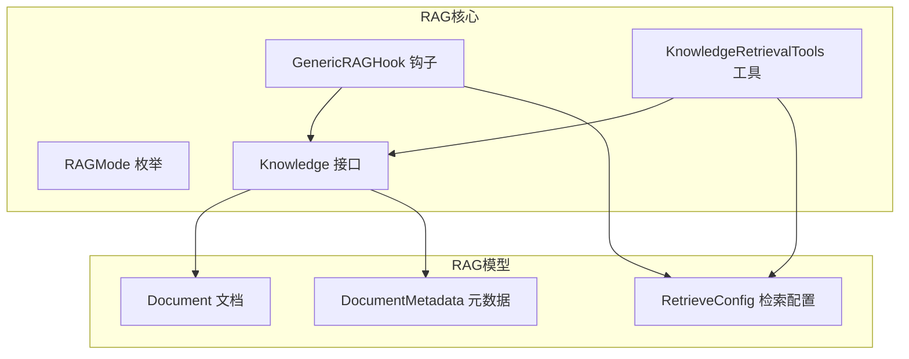
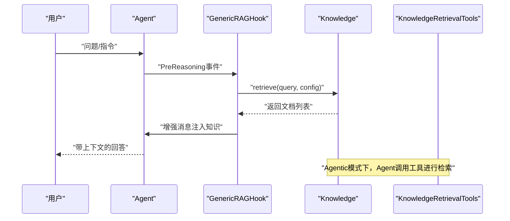
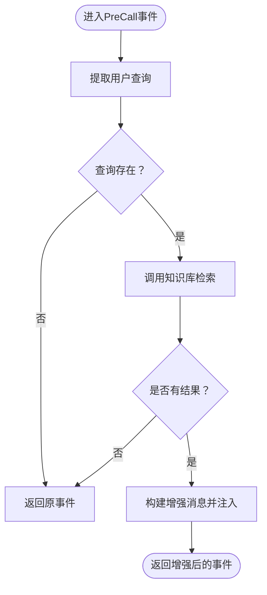
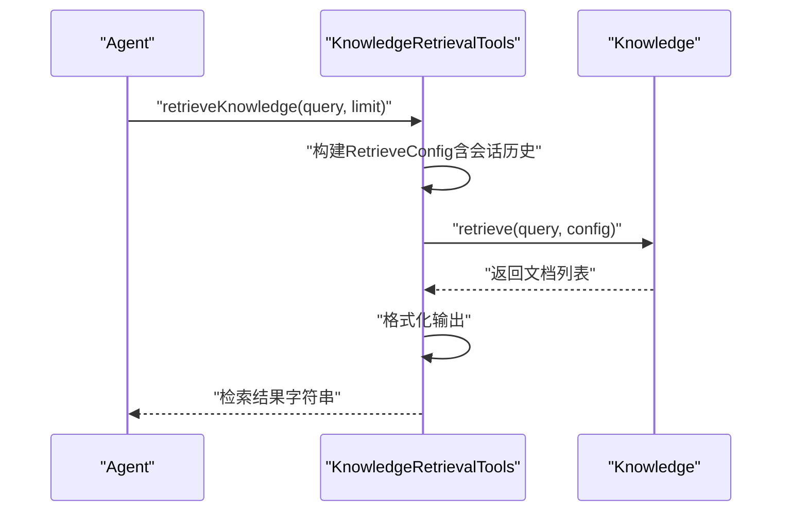
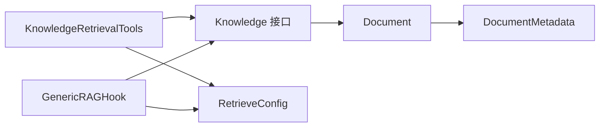

# RAG检索增强API

<cite>
**本文档引用的文件**
- [RAGMode.java](file://agentscope-core/src/main/java/io/agentscope/core/rag/RAGMode.java)
- [Knowledge.java](file://agentscope-core/src/main/java/io/agentscope/core/rag/Knowledge.java)
- [KnowledgeRetrievalTools.java](file://agentscope-core/src/main/java/io/agentscope/core/rag/KnowledgeRetrievalTools.java)
- [GenericRAGHook.java](file://agentscope-core/src/main/java/io/agentscope/core/rag/GenericRAGHook.java)
- [Document.java](file://agentscope-core/src/main/java/io/agentscope/core/rag/model/Document.java)
- [DocumentMetadata.java](file://agentscope-core/src/main/java/io/agentscope/core/rag/model/DocumentMetadata.java)
- [RetrieveConfig.java](file://agentscope-core/src/main/java/io/agentscope/core/rag/model/RetrieveConfig.java)
</cite>

## 目录
1. [简介](#简介)
2. [项目结构](#项目结构)
3. [核心组件](#核心组件)
4. [架构概览](#架构概览)
5. [详细组件分析](#详细组件分析)
6. [依赖关系分析](#依赖关系分析)
7. [性能考虑](#性能考虑)
8. [故障排除指南](#故障排除指南)
9. [结论](#结论)
10. [附录：API调用示例与集成指南](#附录api调用示例与集成指南)

## 简介
本文件为AgentScope RAG（检索增强生成）检索增强模块的完整API参考文档。文档覆盖以下关键主题：
- RAG模式枚举类型及其语义
- 检索模式配置选项与参数约束
- 知识实体数据结构与操作方法
- 检索工具类API规范（查询处理、结果排序与相关性评分）
- 嵌入向量客户端接口定义（文本编码、相似度计算、批量处理）
- RAG工作流程的API调用示例与集成指南

重要提示：上述所有类均已在版本2.0.0中标记为废弃（@Deprecated），并移除rag包。官方建议在应用层集成检索功能。

## 项目结构
RAG相关代码位于agentscope-core模块的io.agentscope.core.rag包下，并配套有模型类位于io.agentscope.core.rag.model包。整体组织采用按功能域分层的方式：顶层接口与钩子负责系统级集成，模型类负责数据结构与配置。

图表来源
- [RAGMode.java:1-57](file://agentscope-core/src/main/java/io/agentscope/core/rag/RAGMode.java#L1-L57)
- [Knowledge.java:1-59](file://agentscope-core/src/main/java/io/agentscope/core/rag/Knowledge.java#L1-L59)
- [GenericRAGHook.java:1-253](file://agentscope-core/src/main/java/io/agentscope/core/rag/GenericRAGHook.java#L1-L253)
- [KnowledgeRetrievalTools.java:1-217](file://agentscope-core/src/main/java/io/agentscope/core/rag/KnowledgeRetrievalTools.java#L1-L217)
- [Document.java:1-239](file://agentscope-core/src/main/java/io/agentscope/core/rag/model/Document.java#L1-L239)
- [DocumentMetadata.java:1-321](file://agentscope-core/src/main/java/io/agentscope/core/rag/model/DocumentMetadata.java#L1-L321)
- [RetrieveConfig.java:1-181](file://agentscope-core/src/main/java/io/agentscope/core/rag/model/RetrieveConfig.java#L1-L181)

章节来源
- [RAGMode.java:1-57](file://agentscope-core/src/main/java/io/agentscope/core/rag/RAGMode.java#L1-L57)
- [Knowledge.java:1-59](file://agentscope-core/src/main/java/io/agentscope/core/rag/Knowledge.java#L1-L59)
- [KnowledgeRetrievalTools.java:1-217](file://agentscope-core/src/main/java/io/agentscope/core/rag/KnowledgeRetrievalTools.java#L1-L217)
- [GenericRAGHook.java:1-253](file://agentscope-core/src/main/java/io/agentscope/core/rag/GenericRAGHook.java#L1-L253)
- [Document.java:1-239](file://agentscope-core/src/main/java/io/agentscope/core/rag/model/Document.java#L1-L239)
- [DocumentMetadata.java:1-321](file://agentscope-core/src/main/java/io/agentscope/core/rag/model/DocumentMetadata.java#L1-L321)
- [RetrieveConfig.java:1-181](file://agentscope-core/src/main/java/io/agentscope/core/rag/model/RetrieveConfig.java#L1-L181)

## 核心组件
本节概述RAG模块的核心API与职责划分：
- RAGMode：定义三种检索增强模式（通用、代理驱动、禁用），用于控制检索注入策略。
- Knowledge：知识库统一接口，支持添加文档与基于查询的检索。
- KnowledgeRetrievalTools：代理驱动模式下的检索工具类，提供可注册到Agent的检索能力。
- GenericRAGHook：通用模式下的自动检索钩子，在推理前自动注入上下文。
- Document/DocumentMetadata/RetrieveConfig：文档、元数据与检索配置的数据结构与构建器。

章节来源
- [RAGMode.java:32-56](file://agentscope-core/src/main/java/io/agentscope/core/rag/RAGMode.java#L32-L56)
- [Knowledge.java:34-58](file://agentscope-core/src/main/java/io/agentscope/core/rag/Knowledge.java#L34-L58)
- [KnowledgeRetrievalTools.java:57-95](file://agentscope-core/src/main/java/io/agentscope/core/rag/KnowledgeRetrievalTools.java#L57-L95)
- [GenericRAGHook.java:69-108](file://agentscope-core/src/main/java/io/agentscope/core/rag/GenericRAGHook.java#L69-L108)
- [Document.java:38-60](file://agentscope-core/src/main/java/io/agentscope/core/rag/model/Document.java#L38-L60)
- [DocumentMetadata.java:56-109](file://agentscope-core/src/main/java/io/agentscope/core/rag/model/DocumentMetadata.java#L56-L109)
- [RetrieveConfig.java:32-105](file://agentscope-core/src/main/java/io/agentscope/core/rag/model/RetrieveConfig.java#L32-L105)

## 架构概览
RAG模块通过两种模式集成检索：
- 通用模式（Generic）：在每次推理前由钩子自动检索并注入知识上下文。
- 代理驱动模式（Agentic）：Agent通过工具自主决定何时检索知识。

图表来源
- [GenericRAGHook.java:111-166](file://agentscope-core/src/main/java/io/agentscope/core/rag/GenericRAGHook.java#L111-L166)
- [KnowledgeRetrievalTools.java:119-167](file://agentscope-core/src/main/java/io/agentscope/core/rag/KnowledgeRetrievalTools.java#L119-L167)
- [Knowledge.java:44-57](file://agentscope-core/src/main/java/io/agentscope/core/rag/Knowledge.java#L44-L57)

## 详细组件分析

### RAG模式枚举（RAGMode）
- 枚举值与语义
  - GENERIC：在每次推理前自动检索并注入知识上下文。
  - AGENTIC：Agent通过工具自主决定何时检索。
  - NONE：禁用RAG功能。
- 使用场景
  - 通用模式适合需要始终提供最新上下文的场景。
  - 代理驱动模式适合需要更精细控制检索时机的场景。

章节来源
- [RAGMode.java:32-56](file://agentscope-core/src/main/java/io/agentscope/core/rag/RAGMode.java#L32-L56)

### 知识库接口（Knowledge）
- 职责
  - addDocuments：将文档集合添加至知识库（内部执行嵌入与存储）。
  - retrieve：根据查询与检索配置返回相关文档列表（按相关性排序）。
- 返回类型
  - addDocuments：响应式流（Mono<Void>），表示异步完成。
  - retrieve：响应式流（Mono<List<Document>>），返回已按分数排序的文档列表。

章节来源
- [Knowledge.java:44-57](file://agentscope-core/src/main/java/io/agentscope/core/rag/Knowledge.java#L44-L57)

### 检索配置（RetrieveConfig）
- 关键字段
  - limit：最大返回文档数（必须为正整数）。
  - scoreThreshold：最小相似度阈值（范围0.0~1.0）。
  - vectorName：向量集合名称（可选）。
  - conversationHistory：对话历史（可选，用于多轮上下文感知检索）。
- 构建方式
  - builder()：静态工厂创建Builder实例。
  - mutate()：从现有实例复制配置并返回新的Builder以链式修改。
- 参数校验
  - limit必须大于0；scoreThreshold必须在[0.0, 1.0]范围内。

章节来源
- [RetrieveConfig.java:34-105](file://agentscope-core/src/main/java/io/agentscope/core/rag/model/RetrieveConfig.java#L34-L105)
- [RetrieveConfig.java:110-179](file://agentscope-core/src/main/java/io/agentscope/core/rag/model/RetrieveConfig.java#L110-L179)

### 文档与元数据（Document / DocumentMetadata）
- Document
  - 字段：id（确定性UUID）、metadata、embedding（向量）、score（相似度）、vectorName。
  - 方法：getter/setter、payload访问、向量名设置等。
  - ID生成：基于docId、chunkId与内容的JSON序列化后生成UUID v3。
- DocumentMetadata
  - 字段：content（ContentBlock，支持文本/图片/视频等）、docId、chunkId、payload。
  - 构建：支持构造函数与Builder模式，Builder提供addPayload与payload聚合设置。
  - 辅助方法：getContentText、hasPayloadKey、getPayloadValue等。

章节来源
- [Document.java:40-227](file://agentscope-core/src/main/java/io/agentscope/core/rag/model/Document.java#L40-L227)
- [DocumentMetadata.java:58-109](file://agentscope-core/src/main/java/io/agentscope/core/rag/model/DocumentMetadata.java#L58-L109)
- [DocumentMetadata.java:233-319](file://agentscope-core/src/main/java/io/agentscope/core/rag/model/DocumentMetadata.java#L233-L319)

### 通用RAG钩子（GenericRAGHook）
- 职责
  - 在推理前自动提取用户查询，调用知识库检索，并将结果作为用户消息注入到输入消息列表。
- 关键行为
  - 提取查询：从消息列表中逆序查找最后一个用户消息作为查询源。
  - 注入上下文：将检索到的知识内容格式化为用户消息并插入输入消息列表开头。
  - 错误处理：检索失败时记录警告但不中断流程。
- 配置
  - 默认与自定义RetrieveConfig；高优先级执行（优先于其他钩子）。

图表来源
- [GenericRAGHook.java:132-166](file://agentscope-core/src/main/java/io/agentscope/core/rag/GenericRAGHook.java#L132-L166)
- [GenericRAGHook.java:177-191](file://agentscope-core/src/main/java/io/agentscope/core/rag/GenericRAGHook.java#L177-L191)
- [GenericRAGHook.java:201-233](file://agentscope-core/src/main/java/io/agentscope/core/rag/GenericRAGHook.java#L201-L233)

章节来源
- [GenericRAGHook.java:69-108](file://agentscope-core/src/main/java/io/agentscope/core/rag/GenericRAGHook.java#L69-L108)
- [GenericRAGHook.java:111-166](file://agentscope-core/src/main/java/io/agentscope/core/rag/GenericRAGHook.java#L111-L166)
- [GenericRAGHook.java:240-251](file://agentscope-core/src/main/java/io/agentscope/core/rag/GenericRAGHook.java#L240-L251)

### 检索工具类（KnowledgeRetrievalTools）
- 职责
  - 为代理驱动模式提供检索工具方法，允许Agent在需要时主动检索知识。
- 主要方法
  - 构造函数：支持默认与自定义RetrieveConfig；均要求非空。
  - retrieveKnowledge：检索工具方法，支持limit参数与会话上下文注入。
  - 工具返回格式：将检索到的文档与分数格式化为字符串供Agent推理使用。
- 会话上下文
  - 对ReActAgent，自动从运行时状态提取对话历史并注入到检索配置中，提升多轮检索准确性。

图表来源
- [KnowledgeRetrievalTools.java:119-167](file://agentscope-core/src/main/java/io/agentscope/core/rag/KnowledgeRetrievalTools.java#L119-L167)
- [KnowledgeRetrievalTools.java:178-197](file://agentscope-core/src/main/java/io/agentscope/core/rag/KnowledgeRetrievalTools.java#L178-L197)
- [Knowledge.java:57](file://agentscope-core/src/main/java/io/agentscope/core/rag/Knowledge.java#L57)

章节来源
- [KnowledgeRetrievalTools.java:57-95](file://agentscope-core/src/main/java/io/agentscope/core/rag/KnowledgeRetrievalTools.java#L57-L95)
- [KnowledgeRetrievalTools.java:119-167](file://agentscope-core/src/main/java/io/agentscope/core/rag/KnowledgeRetrievalTools.java#L119-L167)
- [KnowledgeRetrievalTools.java:178-197](file://agentscope-core/src/main/java/io/agentscope/core/rag/KnowledgeRetrievalTools.java#L178-L197)
- [KnowledgeRetrievalTools.java:204-215](file://agentscope-core/src/main/java/io/agentscope/core/rag/KnowledgeRetrievalTools.java#L204-L215)

### 嵌入向量客户端接口（EmbeddingClient）
- 设计目标
  - 提供统一的文本编码接口，支持单条与批量文本向量化。
  - 支持相似度计算与向量存储对接（如向量数据库）。
- 建议接口能力
  - 单文本编码：将输入文本转换为固定维度向量。
  - 批量编码：对文本列表进行高效批量向量化。
  - 相似度计算：提供余弦相似度或点积相似度计算。
  - 向量存储：支持向量写入、查询与元数据关联。
- 注意事项
  - 本节为概念性接口设计说明，具体实现需结合实际嵌入服务（如本地或云端模型）。

[本节为概念性说明，不直接分析具体文件，故无章节来源]

## 依赖关系分析
- 组件耦合
  - KnowledgeRetrievalTools与GenericRAGHook均依赖Knowledge接口与RetrieveConfig。
  - Document与DocumentMetadata构成文档数据模型，被Knowledge与检索流程广泛使用。
- 外部依赖
  - 响应式编程框架（Reactor Mono）用于异步检索与错误恢复。
  - 消息模型（Msg、TextBlock等）用于上下文注入与对话历史管理。
- 循环依赖
  - 当前设计无循环依赖，接口与实现分离清晰。

图表来源
- [KnowledgeRetrievalTools.java:59-95](file://agentscope-core/src/main/java/io/agentscope/core/rag/KnowledgeRetrievalTools.java#L59-L95)
- [GenericRAGHook.java:73-108](file://agentscope-core/src/main/java/io/agentscope/core/rag/GenericRAGHook.java#L73-L108)
- [Knowledge.java:34-58](file://agentscope-core/src/main/java/io/agentscope/core/rag/Knowledge.java#L34-L58)
- [Document.java:38-60](file://agentscope-core/src/main/java/io/agentscope/core/rag/model/Document.java#L38-L60)
- [DocumentMetadata.java:56-109](file://agentscope-core/src/main/java/io/agentscope/core/rag/model/DocumentMetadata.java#L56-L109)
- [RetrieveConfig.java:32-105](file://agentscope-core/src/main/java/io/agentscope/core/rag/model/RetrieveConfig.java#L32-L105)

章节来源
- [KnowledgeRetrievalTools.java:59-95](file://agentscope-core/src/main/java/io/agentscope/core/rag/KnowledgeRetrievalTools.java#L59-L95)
- [GenericRAGHook.java:73-108](file://agentscope-core/src/main/java/io/agentscope/core/rag/GenericRAGHook.java#L73-L108)
- [Knowledge.java:34-58](file://agentscope-core/src/main/java/io/agentscope/core/rag/Knowledge.java#L34-L58)
- [Document.java:38-60](file://agentscope-core/src/main/java/io/agentscope/core/rag/model/Document.java#L38-L60)
- [DocumentMetadata.java:56-109](file://agentscope-core/src/main/java/io/agentscope/core/rag/model/DocumentMetadata.java#L56-L109)
- [RetrieveConfig.java:32-105](file://agentscope-core/src/main/java/io/agentscope/core/rag/model/RetrieveConfig.java#L32-L105)

## 性能考虑
- 异步检索与背压
  - 使用Reactor Mono进行异步检索，避免阻塞主线程；在工具方法中通过阻塞等待适配同步接口，需谨慎控制并发数量。
- 结果过滤与限制
  - 通过limit与scoreThreshold减少后续LLM处理负担，提高响应速度与质量。
- 向量存储优化
  - 合理选择vectorName与索引策略，确保检索效率；批量写入与查询时注意网络与存储延迟。
- 上下文注入成本
  - 通用模式每次推理都会触发检索与消息拼接，需评估消息长度对LLM上下文窗口的影响。

[本节提供一般性指导，不直接分析具体文件，故无章节来源]

## 故障排除指南
- 常见异常与处理
  - 空知识库或配置：构造函数参数校验会抛出非法参数异常，确保传入非空对象。
  - 非法配置参数：limit必须为正整数，scoreThreshold必须在[0.0, 1.0]范围内。
  - 检索失败：钩子与工具均提供错误恢复逻辑（日志警告与降级返回），不影响主流程。
- 排查步骤
  - 确认Knowledge实现可用且向量存储正常。
  - 检查RetrieveConfig参数是否符合约束。
  - 观察日志中关于检索失败的警告信息。
  - 验证会话上下文注入是否正确传递至检索配置。

章节来源
- [KnowledgeRetrievalTools.java:87-94](file://agentscope-core/src/main/java/io/agentscope/core/rag/KnowledgeRetrievalTools.java#L87-L94)
- [RetrieveConfig.java:123-143](file://agentscope-core/src/main/java/io/agentscope/core/rag/model/RetrieveConfig.java#L123-L143)
- [GenericRAGHook.java:160-165](file://agentscope-core/src/main/java/io/agentscope/core/rag/GenericRAGHook.java#L160-L165)

## 结论
AgentScope的RAG模块提供了两种检索增强模式：通用模式与代理驱动模式，配合统一的知识库接口与灵活的检索配置，能够满足不同场景下的上下文增强需求。尽管当前版本已废弃rag包并移除相关实现，但其设计理念与API形态仍可作为应用层集成检索功能的参考模板。建议在应用层直接实现或接入具体的嵌入与检索服务，以获得更好的可控性与性能表现。

[本节为总结性内容，不直接分析具体文件，故无章节来源]

## 附录：API调用示例与集成指南

### 示例一：通用模式（Generic）集成
- 步骤
  - 准备Knowledge实现与默认RetrieveConfig。
  - 创建GenericRAGHook并绑定至Agent。
  - 运行Agent时，每次推理前自动检索并注入知识上下文。
- 参考路径
  - [GenericRAGHook.java:88-108](file://agentscope-core/src/main/java/io/agentscope/core/rag/GenericRAGHook.java#L88-L108)
  - [GenericRAGHook.java:111-166](file://agentscope-core/src/main/java/io/agentscope/core/rag/GenericRAGHook.java#L111-L166)

章节来源
- [GenericRAGHook.java:88-108](file://agentscope-core/src/main/java/io/agentscope/core/rag/GenericRAGHook.java#L88-L108)
- [GenericRAGHook.java:111-166](file://agentscope-core/src/main/java/io/agentscope/core/rag/GenericRAGHook.java#L111-L166)

### 示例二：代理驱动模式（Agentic）集成
- 步骤
  - 准备Knowledge实现与默认RetrieveConfig。
  - 创建KnowledgeRetrievalTools实例并注册到Agent的工具箱。
  - 在Agent推理过程中，根据需要调用retrieveKnowledge工具。
- 参考路径
  - [KnowledgeRetrievalTools.java:75-95](file://agentscope-core/src/main/java/io/agentscope/core/rag/KnowledgeRetrievalTools.java#L75-L95)
  - [KnowledgeRetrievalTools.java:119-167](file://agentscope-core/src/main/java/io/agentscope/core/rag/KnowledgeRetrievalTools.java#L119-L167)

章节来源
- [KnowledgeRetrievalTools.java:75-95](file://agentscope-core/src/main/java/io/agentscope/core/rag/KnowledgeRetrievalTools.java#L75-L95)
- [KnowledgeRetrievalTools.java:119-167](file://agentscope-core/src/main/java/io/agentscope/core/rag/KnowledgeRetrievalTools.java#L119-L167)

### 示例三：检索配置定制
- 步骤
  - 使用RetrieveConfig.Builder设置limit、scoreThreshold、vectorName与conversationHistory。
  - 通过mutate()从现有实例复制配置并进行微调。
- 参考路径
  - [RetrieveConfig.java:103-105](file://agentscope-core/src/main/java/io/agentscope/core/rag/model/RetrieveConfig.java#L103-L105)
  - [RetrieveConfig.java:110-179](file://agentscope-core/src/main/java/io/agentscope/core/rag/model/RetrieveConfig.java#L110-L179)

章节来源
- [RetrieveConfig.java:103-105](file://agentscope-core/src/main/java/io/agentscope/core/rag/model/RetrieveConfig.java#L103-L105)
- [RetrieveConfig.java:110-179](file://agentscope-core/src/main/java/io/agentscope/core/rag/model/RetrieveConfig.java#L110-L179)

### 示例四：文档与元数据构建
- 步骤
  - 使用DocumentMetadata.Builder设置content、docId、chunkId与payload。
  - 通过Document构造函数生成带确定性ID的文档对象。
- 参考路径
  - [DocumentMetadata.java:233-319](file://agentscope-core/src/main/java/io/agentscope/core/rag/model/DocumentMetadata.java#L233-L319)
  - [Document.java:54-60](file://agentscope-core/src/main/java/io/agentscope/core/rag/model/Document.java#L54-L60)

章节来源
- [DocumentMetadata.java:233-319](file://agentscope-core/src/main/java/io/agentscope/core/rag/model/DocumentMetadata.java#L233-L319)
- [Document.java:54-60](file://agentscope-core/src/main/java/io/agentscope/core/rag/model/Document.java#L54-L60)