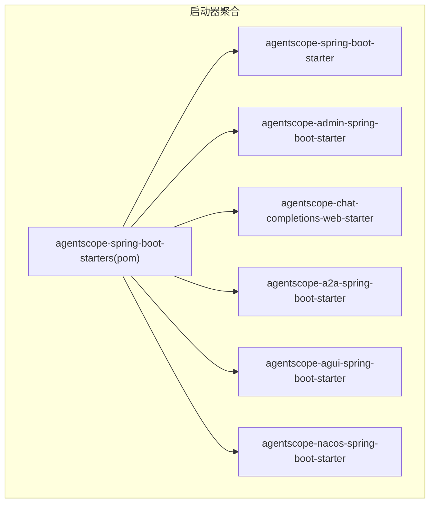
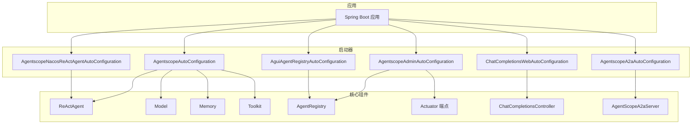
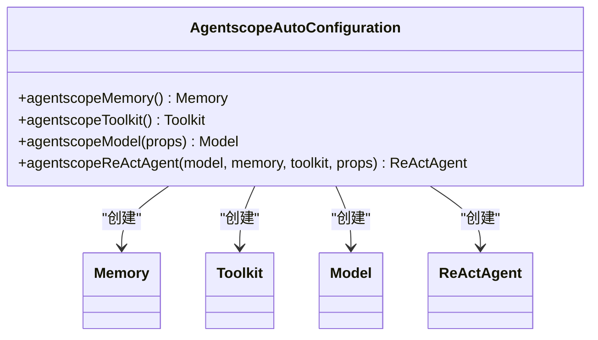
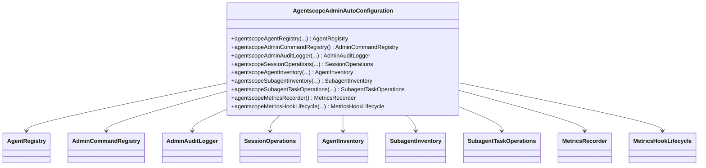
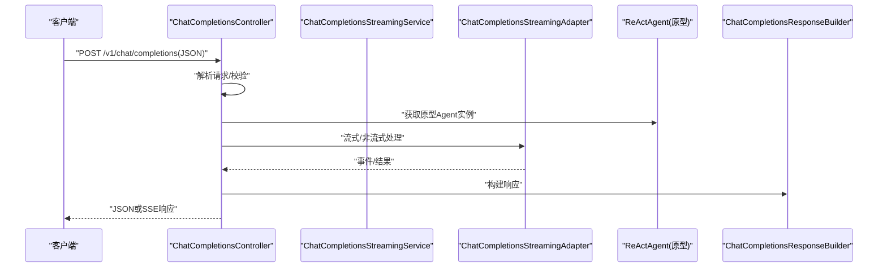
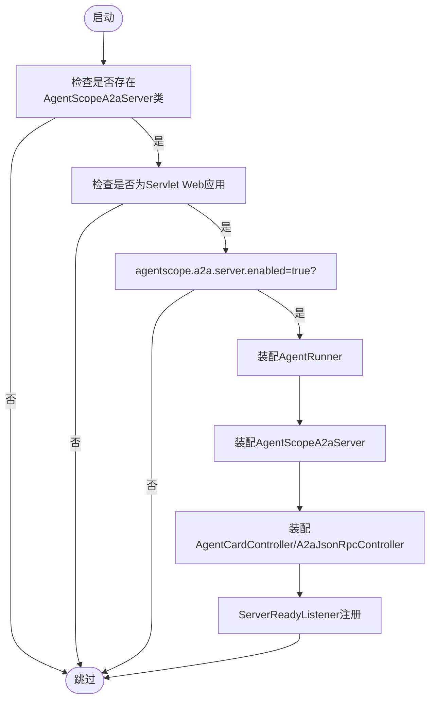
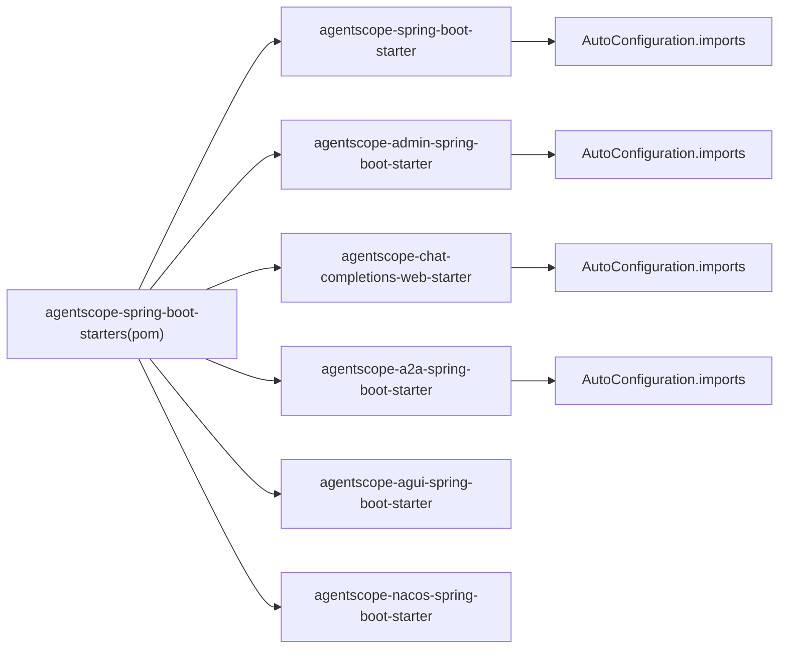

# Spring Boot启动器API

<cite>
**本文引用的文件**
- [AgentscopeAutoConfiguration.java](file://agentscope-extensions/agentscope-spring-boot-starters/agentscope-spring-boot-starter/src/main/java/io/agentscope/spring/boot/AgentscopeAutoConfiguration.java)
- [AgentscopeAdminAutoConfiguration.java](file://agentscope-extensions/agentscope-spring-boot-starters/agentscope-admin-spring-boot-starter/src/main/java/io/agentscope/spring/boot/admin/AgentscopeAdminAutoConfiguration.java)
- [ChatCompletionsWebAutoConfiguration.java](file://agentscope-extensions/agentscope-spring-boot-starters/agentscope-chat-completions-web-starter/src/main/java/io/agentscope/spring/boot/chat/config/ChatCompletionsWebAutoConfiguration.java)
- [ChatCompletionsController.java](file://agentscope-extensions/agentscope-spring-boot-starters/agentscope-chat-completions-web-starter/src/main/java/io/agentscope/spring/boot/chat/web/ChatCompletionsController.java)
- [AgentscopeA2aAutoConfiguration.java](file://agentscope-extensions/agentscope-spring-boot-starters/agentscope-a2a-spring-boot-starter/src/main/java/io/agentscope/spring/boot/a2a/AgentscopeA2aAutoConfiguration.java)
- [AguiAgentRegistryAutoConfiguration.java](file://agentscope-extensions/agentscope-spring-boot-starters/agentscope-agui-spring-boot-starter/src/main/java/io/agentscope/spring/boot/agui/common/AguiAgentRegistryAutoConfiguration.java)
- [AgentscopeNacosReActAgentAutoConfiguration.java](file://agentscope-extensions/agentscope-spring-boot-starters/agentscope-nacos-spring-boot-starter/src/main/java/io/agentscope/spring/boot/nacos/AgentscopeNacosReActAgentAutoConfiguration.java)
- [agentscope-spring-boot-starters/pom.xml](file://agentscope-extensions/agentscope-spring-boot-starters/pom.xml)
- [agentscope-spring-boot-starter/META-INF导入](file://agentscope-extensions/agentscope-spring-boot-starters/agentscope-spring-boot-starter/src/main/resources/META-INF/spring/org.springframework.boot.autoconfigure.AutoConfiguration.imports)
- [agentscope-admin-spring-boot-starter/META-INF导入](file://agentscope-extensions/agentscope-spring-boot-starters/agentscope-admin-spring-boot-starter/src/main/resources/META-INF/spring/org.springframework.boot.autoconfigure.AutoConfiguration.imports)
- [agentscope-chat-completions-web-starter/META-INF导入](file://agentscope-extensions/agentscope-spring-boot-starters/agentscope-chat-completions-web-starter/src/main/resources/META-INF/spring/org.springframework.boot.autoconfigure.AutoConfiguration.imports)
- [agentscope-a2a-spring-boot-starter/META-INF导入](file://agentscope-extensions/agentscope-spring-boot-starters/agentscope-a2a-spring-boot-starter/src/main/resources/META-INF/spring/org.springframework.boot.autoconfigure.AutoConfiguration.imports)
</cite>

## 目录
1. [简介](#简介)
2. [项目结构](#项目结构)
3. [核心组件](#核心组件)
4. [架构总览](#架构总览)
5. [详细组件分析](#详细组件分析)
6. [依赖关系分析](#依赖关系分析)
7. [性能考量](#性能考量)
8. [故障排查指南](#故障排查指南)
9. [结论](#结论)
10. [附录](#附录)

## 简介
本文件为AgentScope Spring Boot启动器模块的完整API参考文档，覆盖以下内容：
- 自动配置类的配置项与Bean定义
- 启用条件与激活规则
- Web控制器REST API接口规范（以ChatCompletionsController为例）
- 启动器依赖配置、属性文件设置与自定义扩展开发指南
- 与Spring Boot应用的集成模式与最佳实践

## 项目结构
启动器模块位于agentscope-extensions/agentscope-spring-boot-starters下，采用多模块聚合管理，每个子模块对应一个启动器：
- agentscope-spring-boot-starter：基础AgentScope自动装配
- agentscope-admin-spring-boot-starter：管理/运维能力（Web控制器与Actuator端点）
- agentscope-chat-completions-web-starter：OpenAI兼容的聊天补全HTTP API
- agentscope-a2a-spring-boot-starter：Agent到Agent（A2A）服务导出
- agentscope-agui-spring-boot-starter：AGUI相关注册与自动装配
- agentscope-nacos-spring-boot-starter：基于Nacos提示词的Agent装配

图表来源
- [agentscope-spring-boot-starters/pom.xml:39-46](file://agentscope-extensions/agentscope-spring-boot-starters/pom.xml#L39-L46)

章节来源
- [agentscope-spring-boot-starters/pom.xml:17-83](file://agentscope-extensions/agentscope-spring-boot-starters/pom.xml#L17-L83)

## 核心组件
本节概述各启动器的核心职责、启用条件与暴露的Bean。

- 基础启动器（agentscope-spring-boot-starter）
  - 职责：在classpath存在ReActAgent时，按需暴露默认的Model、Memory、Toolkit与ReActAgent Bean；支持通过属性选择模型提供商类型。
  - 关键Bean：
    - Memory（原型作用域）
    - Toolkit（原型作用域）
    - Model（根据属性选择具体实现）
    - ReActAgent（单例）
  - 启用条件：存在ReActAgent类且agentscope.agent.enabled=true

- 管理启动器（agentscope-admin-spring-boot-starter）
  - 职责：提供Agent注册表、命令注册、审计日志、会话操作、指标采集与快照存储；在Servlet Web应用中暴露管理控制器，在存在Actuator时暴露端点。
  - 关键Bean：
    - AgentRegistry（默认从上下文种子Agent Bean）
    - AdminCommandRegistry
    - AdminAuditLogger
    - SessionOperations
    - AgentInventory
    - SubagentInventory
    - SubagentTaskOperations
    - MetricsRecorder
    - MetricsHookLifecycle（系统钩子生命周期）
  - 启用条件：存在Agent类且agentscope.admin.enabled=true

- 聊天补全Web启动器（agentscope-chat-completions-web-starter）
  - 职责：暴露OpenAI兼容的聊天补全HTTP API（非流式与SSE流式），每次请求创建原型Agent实例，确保无状态。
  - 关键Bean：
    - ChatMessageConverter
    - OpenAIToolConverter
    - ChatCompletionsResponseBuilder
    - ChatCompletionsStreamingAdapter
    - ChatCompletionsStreamingService
    - ChatCompletionsController
  - 启用条件：存在ReActAgent类且agentscope.chat-completions.enabled=true（默认启用）

- A2A启动器（agentscope-a2a-spring-boot-starter）
  - 职责：在存在AgentScope A2A服务类时，装配Agent执行器、可配置Agent卡片、部署参数与传输属性，并暴露JSON-RPC与Agent卡片控制器。
  - 关键Bean：
    - AgentRunner（优先使用starter Runner，否则使用Builder Runner）
    - AgentScopeA2aServer
    - AgentCardController
    - A2aJsonRpcController
    - ServerReadyListener
  - 启用条件：存在AgentScopeA2aServer类且agentscope.a2a.server.enabled=true（默认启用），并限定为Servlet Web应用

- AGUI启动器（agentscope-agui-spring-boot-starter）
  - 职责：提供AGUI Agent注册表与自动注册Bean，便于管理Agent。
  - 关键Bean：
    - AguiAgentRegistry
    - AguiAgentAutoRegistration
  - 启用条件：存在AguiAgentRegistry、AguiAgentRegistryCustomizer、AguiAgentAutoRegistration类

- Nacos启动器（agentscope-nacos-spring-boot-starter）
  - 职责：在存在ReActAgent类时，按属性从Nacos加载系统提示词，装配原型作用域的ReActAgent。
  - 关键Bean：
    - 原型ReActAgent（系统提示词来自Nacos或回退默认）
  - 启用条件：存在ReActAgent类且agentscope.nacos.prompt.enabled=true（默认启用）

章节来源
- [AgentscopeAutoConfiguration.java:125-204](file://agentscope-extensions/agentscope-spring-boot-starters/agentscope-spring-boot-starter/src/main/java/io/agentscope/spring/boot/AgentscopeAutoConfiguration.java#L125-L204)
- [AgentscopeAdminAutoConfiguration.java:89-348](file://agentscope-extensions/agentscope-spring-boot-starters/agentscope-admin-spring-boot-starter/src/main/java/io/agentscope/spring/boot/admin/AgentscopeAdminAutoConfiguration.java#L89-L348)
- [ChatCompletionsWebAutoConfiguration.java:53-151](file://agentscope-extensions/agentscope-spring-boot-starters/agentscope-chat-completions-web-starter/src/main/java/io/agentscope/spring/boot/chat/config/ChatCompletionsWebAutoConfiguration.java#L53-L151)
- [AgentscopeA2aAutoConfiguration.java:49-183](file://agentscope-extensions/agentscope-spring-boot-starters/agentscope-a2a-spring-boot-starter/src/main/java/io/agentscope/spring/boot/a2a/AgentscopeA2aAutoConfiguration.java#L49-L183)
- [AguiAgentRegistryAutoConfiguration.java:25-73](file://agentscope-extensions/agentscope-spring-boot-starters/agentscope-agui-spring-boot-starter/src/main/java/io/agentscope/spring/boot/agui/common/AguiAgentRegistryAutoConfiguration.java#L25-L73)
- [AgentscopeNacosReActAgentAutoConfiguration.java:42-108](file://agentscope-extensions/agentscope-spring-boot-starters/agentscope-nacos-spring-boot-starter/src/main/java/io/agentscope/spring/boot/nacos/AgentscopeNacosReActAgentAutoConfiguration.java#L42-L108)

## 架构总览
下图展示启动器与核心AgentScope组件及Spring Web/Actuator的交互关系。

图表来源
- [AgentscopeAutoConfiguration.java:125-204](file://agentscope-extensions/agentscope-spring-boot-starters/agentscope-spring-boot-starter/src/main/java/io/agentscope/spring/boot/AgentscopeAutoConfiguration.java#L125-L204)
- [AgentscopeAdminAutoConfiguration.java:89-348](file://agentscope-extensions/agentscope-spring-boot-starters/agentscope-admin-spring-boot-starter/src/main/java/io/agentscope/spring/boot/admin/AgentscopeAdminAutoConfiguration.java#L89-L348)
- [ChatCompletionsWebAutoConfiguration.java:53-151](file://agentscope-extensions/agentscope-spring-boot-starters/agentscope-chat-completions-web-starter/src/main/java/io/agentscope/spring/boot/chat/config/ChatCompletionsWebAutoConfiguration.java#L53-L151)
- [AgentscopeA2aAutoConfiguration.java:49-183](file://agentscope-extensions/agentscope-spring-boot-starters/agentscope-a2a-spring-boot-starter/src/main/java/io/agentscope/spring/boot/a2a/AgentscopeA2aAutoConfiguration.java#L49-L183)
- [AguiAgentRegistryAutoConfiguration.java:25-73](file://agentscope-extensions/agentscope-spring-boot-starters/agentscope-agui-spring-boot-starter/src/main/java/io/agentscope/spring/boot/agui/common/AguiAgentRegistryAutoConfiguration.java#L25-L73)
- [AgentscopeNacosReActAgentAutoConfiguration.java:42-108](file://agentscope-extensions/agentscope-spring-boot-starters/agentscope-nacos-spring-boot-starter/src/main/java/io/agentscope/spring/boot/nacos/AgentscopeNacosReActAgentAutoConfiguration.java#L42-L108)

## 详细组件分析

### AgentscopeAutoConfiguration（基础启动器）
- 配置项与启用条件
  - 条件注解：存在ReActAgent类
  - 属性开关：agentscope.agent.enabled=true
  - 默认Bean：
    - Memory：原型作用域，InMemoryMemory实现
    - Toolkit：原型作用域，空工具集
    - Model：根据ModelProviderType与属性创建
    - ReActAgent：单例，使用AgentProperties构建
- 设计要点
  - 通过@EnableConfigurationProperties绑定AgentscopeProperties
  - 使用@ConditionalOnMissingBean避免与用户自定义Bean冲突
  - Memory/Toolkit为原型作用域，建议通过ObjectProvider或方法注入获取

图表来源
- [AgentscopeAutoConfiguration.java:125-204](file://agentscope-extensions/agentscope-spring-boot-starters/agentscope-spring-boot-starter/src/main/java/io/agentscope/spring/boot/AgentscopeAutoConfiguration.java#L125-L204)

章节来源
- [AgentscopeAutoConfiguration.java:125-204](file://agentscope-extensions/agentscope-spring-boot-starters/agentscope-spring-boot-starter/src/main/java/io/agentscope/spring/boot/AgentscopeAutoConfiguration.java#L125-L204)
- [agentscope-spring-boot-starter/META-INF导入:16-16](file://agentscope-extensions/agentscope-spring-boot-starters/agentscope-spring-boot-starter/src/main/resources/META-INF/spring/org.springframework.boot.autoconfigure.AutoConfiguration.imports#L16-L16)

### AgentscopeAdminAutoConfiguration（管理启动器）
- 配置项与启用条件
  - 条件注解：存在Agent类；agentscope.admin.enabled=true
  - Web条件：Servlet Web应用；存在@RestController类
  - Actuator条件：存在@Endpoint类
- 关键Bean与职责
  - AgentRegistry：从上下文种子Agent Bean，默认内存实现
  - AdminCommandRegistry：内置命令注册表
  - AdminAuditLogger：审计日志
  - SessionOperations：会话操作
  - AgentInventory/SubagentInventory：资源清单
  - SubagentTaskOperations：子代理任务操作
  - MetricsRecorder/MetricsHookLifecycle：指标采集与系统钩子
- 控制平面与数据平面
  - 数据平面（Servlet）：SessionAdminController、SubagentTaskController
  - 控制平面（Actuator）：多个Endpoint（状态、Agent、工具、模型、命令、诊断、用量、权限、停机、子代理等）

图表来源
- [AgentscopeAdminAutoConfiguration.java:89-348](file://agentscope-extensions/agentscope-spring-boot-starters/agentscope-admin-spring-boot-starter/src/main/java/io/agentscope/spring/boot/admin/AgentscopeAdminAutoConfiguration.java#L89-L348)

章节来源
- [AgentscopeAdminAutoConfiguration.java:89-348](file://agentscope-extensions/agentscope-spring-boot-starters/agentscope-admin-spring-boot-starter/src/main/java/io/agentscope/spring/boot/admin/AgentscopeAdminAutoConfiguration.java#L89-L348)
- [agentscope-admin-spring-boot-starter/META-INF导入:16-16](file://agentscope-extensions/agentscope-spring-boot-starters/agentscope-admin-spring-boot-starter/src/main/resources/META-INF/spring/org.springframework.boot.autoconfigure.AutoConfiguration.imports#L16-L16)

### ChatCompletionsWebAutoConfiguration 与 ChatCompletionsController（聊天补全Web）
- 启用条件
  - 存在ReActAgent类
  - agentscope.chat-completions.enabled=true（默认启用）
- Bean链路
  - ChatMessageConverter：消息转换
  - OpenAIToolConverter：工具Schema转换
  - ChatCompletionsResponseBuilder：响应构建
  - ChatCompletionsStreamingAdapter：框架无关流适配
  - ChatCompletionsStreamingService：Spring SSE适配
  - ChatCompletionsController：REST控制器
- API设计
  - 100%无状态：每次请求携带完整历史，服务器创建新Agent处理
  - 支持非流式JSON与SSE流式两种返回方式
  - 兼容OpenAI Chat Completions格式

图表来源
- [ChatCompletionsController.java:123-202](file://agentscope-extensions/agentscope-spring-boot-starters/agentscope-chat-completions-web-starter/src/main/java/io/agentscope/spring/boot/chat/web/ChatCompletionsController.java#L123-L202)
- [ChatCompletionsWebAutoConfiguration.java:139-149](file://agentscope-extensions/agentscope-spring-boot-starters/agentscope-chat-completions-web-starter/src/main/java/io/agentscope/spring/boot/chat/config/ChatCompletionsWebAutoConfiguration.java#L139-L149)

章节来源
- [ChatCompletionsWebAutoConfiguration.java:53-151](file://agentscope-extensions/agentscope-spring-boot-starters/agentscope-chat-completions-web-starter/src/main/java/io/agentscope/spring/boot/chat/config/ChatCompletionsWebAutoConfiguration.java#L53-L151)
- [ChatCompletionsController.java:42-294](file://agentscope-extensions/agentscope-spring-boot-starters/agentscope-chat-completions-web-starter/src/main/java/io/agentscope/spring/boot/chat/web/ChatCompletionsController.java#L42-L294)
- [agentscope-chat-completions-web-starter/META-INF导入:16-16](file://agentscope-extensions/agentscope-spring-boot-starters/agentscope-chat-completions-web-starter/src/main/resources/META-INF/spring/org.springframework.boot.autoconfigure.AutoConfiguration.imports#L16-L16)

### AgentscopeA2aAutoConfiguration（A2A服务导出）
- 启用条件
  - 存在AgentScopeA2aServer类
  - 限定Servlet Web应用
  - agentscope.a2a.server.enabled=true（默认启用）
- Bean装配
  - AgentRunner：优先starter Runner，否则Builder Runner
  - AgentScopeA2aServer：组装Agent卡片、部署属性、执行属性与传输属性
  - 控制器：AgentCardController、A2aJsonRpcController
  - 监听器：ServerReadyListener

图表来源
- [AgentscopeA2aAutoConfiguration.java:49-183](file://agentscope-extensions/agentscope-spring-boot-starters/agentscope-a2a-spring-boot-starter/src/main/java/io/agentscope/spring/boot/a2a/AgentscopeA2aAutoConfiguration.java#L49-L183)

章节来源
- [AgentscopeA2aAutoConfiguration.java:49-183](file://agentscope-extensions/agentscope-spring-boot-starters/agentscope-a2a-spring-boot-starter/src/main/java/io/agentscope/spring/boot/a2a/AgentscopeA2aAutoConfiguration.java#L49-L183)
- [agentscope-a2a-spring-boot-starter/META-INF导入:16-16](file://agentscope-extensions/agentscope-spring-boot-starters/agentscope-a2a-spring-boot-starter/src/main/resources/META-INF/spring/org.springframework.boot.autoconfigure.AutoConfiguration.imports#L16-L16)

### AguiAgentRegistryAutoConfiguration（AGUI注册）
- 启用条件：同时存在AguiAgentRegistry、AguiAgentRegistryCustomizer、AguiAgentAutoRegistration类
- Bean：
  - AguiAgentRegistry：Agent注册表
  - AguiAgentAutoRegistration：自动注册Agent到注册表

章节来源
- [AguiAgentRegistryAutoConfiguration.java:25-73](file://agentscope-extensions/agentscope-spring-boot-starters/agentscope-agui-spring-boot-starter/src/main/java/io/agentscope/spring/boot/agui/common/AguiAgentRegistryAutoConfiguration.java#L25-L73)

### AgentscopeNacosReActAgentAutoConfiguration（Nacos提示词）
- 启用条件：存在ReActAgent类；agentscope.nacos.prompt.enabled=true（默认启用）
- 行为：从Nacos加载系统提示词，若失败则回退默认；返回原型作用域ReActAgent

章节来源
- [AgentscopeNacosReActAgentAutoConfiguration.java:42-108](file://agentscope-extensions/agentscope-spring-boot-starters/agentscope-nacos-spring-boot-starter/src/main/java/io/agentscope/spring/boot/nacos/AgentscopeNacosReActAgentAutoConfiguration.java#L42-L108)

## 依赖关系分析
- 模块聚合与版本管理
  - 聚合pom统一管理spring-boot.version与编译插件配置
  - 各启动器模块独立声明自身功能与依赖
- 自动装配导入
  - 各启动器通过META-INF/spring/org.springframework.boot.autoconfigure.AutoConfiguration.imports声明自动配置类，由Spring Boot自动发现

图表来源
- [agentscope-spring-boot-starters/pom.xml:39-46](file://agentscope-extensions/agentscope-spring-boot-starters/pom.xml#L39-L46)
- [agentscope-spring-boot-starter/META-INF导入:16-16](file://agentscope-extensions/agentscope-spring-boot-starters/agentscope-spring-boot-starter/src/main/resources/META-INF/spring/org.springframework.boot.autoconfigure.AutoConfiguration.imports#L16-L16)
- [agentscope-admin-spring-boot-starter/META-INF导入:16-16](file://agentscope-extensions/agentscope-spring-boot-starters/agentscope-admin-spring-boot-starter/src/main/resources/META-INF/spring/org.springframework.boot.autoconfigure.AutoConfiguration.imports#L16-L16)
- [agentscope-chat-completions-web-starter/META-INF导入:16-16](file://agentscope-extensions/agentscope-spring-boot-starters/agentscope-chat-completions-web-starter/src/main/resources/META-INF/spring/org.springframework.boot.autoconfigure.AutoConfiguration.imports#L16-L16)
- [agentscope-a2a-spring-boot-starter/META-INF导入:16-16](file://agentscope-extensions/agentscope-spring-boot-starters/agentscope-a2a-spring-boot-starter/src/main/resources/META-INF/spring/org.springframework.boot.autoconfigure.AutoConfiguration.imports#L16-L16)

章节来源
- [agentscope-spring-boot-starters/pom.xml:17-83](file://agentscope-extensions/agentscope-spring-boot-starters/pom.xml#L17-L83)

## 性能考量
- 无状态API设计
  - ChatCompletionsController每次请求创建原型Agent实例，避免跨请求状态耦合，适合水平扩展与多实例部署
- 流式响应
  - SSE流式返回降低首字节延迟，提升用户体验；注意客户端正确处理text/event-stream
- 作用域选择
  - Memory/Toolkit为原型作用域，避免共享状态引发线程安全问题；在高并发场景建议结合连接池与限流策略
- 指标采集
  - Admin启动器提供MetricsHookLifecycle，自动统计Token用量，便于容量规划与成本控制

## 故障排查指南
- 启动器未生效
  - 检查是否引入对应启动器依赖；确认AutoConfiguration.imports已正确打包
  - 核对属性开关：agentscope.admin.enabled、agentscope.chat-completions.enabled、agentscope.a2a.server.enabled、agentscope.nacos.prompt.enabled
- ChatCompletionsController异常
  - 非流式端点被错误调用到流式端点：确保stream=false时不要使用Accept: text/event-stream
  - 请求缺少消息：至少需要一条消息
  - Agent创建失败：检查agentscope.agent.enabled与相关Bean是否被用户覆盖
- A2A服务未导出
  - 确认Servlet Web环境；检查AgentRunner装配顺序（需在AgentscopeAutoConfiguration之后）
- Admin端点不可见
  - 确认Actuator依赖存在；遵循management.endpoint.<id>.enabled与exposure配置

章节来源
- [ChatCompletionsController.java:213-292](file://agentscope-extensions/agentscope-spring-boot-starters/agentscope-chat-completions-web-starter/src/main/java/io/agentscope/spring/boot/chat/web/ChatCompletionsController.java#L213-L292)
- [AgentscopeAdminAutoConfiguration.java:269-346](file://agentscope-extensions/agentscope-spring-boot-starters/agentscope-admin-spring-boot-starter/src/main/java/io/agentscope/spring/boot/admin/AgentscopeAdminAutoConfiguration.java#L269-L346)
- [AgentscopeA2aAutoConfiguration.java:55-68](file://agentscope-extensions/agentscope-spring-boot-starters/agentscope-a2a-spring-boot-starter/src/main/java/io/agentscope/spring/boot/a2a/AgentscopeA2aAutoConfiguration.java#L55-L68)

## 结论
AgentScope Spring Boot启动器通过明确的启用条件与Bean装配策略，为不同场景提供即插即用的能力：
- 快速接入AgentScope核心能力（基础启动器）
- 提供管理/运维能力（管理启动器）
- 暴露OpenAI兼容的聊天补全API（Web启动器）
- 导出A2A服务（A2A启动器）
- 支持AGUI与Nacos等扩展生态

建议在生产环境中结合无状态API设计、流式响应与指标采集，配合限流与监控策略，获得稳定高效的运行体验。

## 附录

### 属性文件设置与示例（摘要）
- agentscope.agent.enabled：启用基础Agent装配（默认false）
- agentscope.admin.enabled：启用管理/运维能力（默认false）
- agentscope.chat-completions.enabled：启用聊天补全API（默认true）
- agentscope.chat-completions.base-path：API基础路径（默认/v1/chat/completions）
- agentscope.a2a.server.enabled：启用A2A服务导出（默认true）
- agentscope.nacos.prompt.enabled：启用Nacos提示词（默认true）

章节来源
- [AgentscopeAutoConfiguration.java:43-124](file://agentscope-extensions/agentscope-spring-boot-starters/agentscope-spring-boot-starter/src/main/java/io/agentscope/spring/boot/AgentscopeAutoConfiguration.java#L43-L124)
- [AgentscopeAdminAutoConfiguration.java:77-88](file://agentscope-extensions/agentscope-spring-boot-starters/agentscope-admin-spring-boot-starter/src/main/java/io/agentscope/spring/boot/admin/AgentscopeAdminAutoConfiguration.java#L77-L88)
- [ChatCompletionsWebAutoConfiguration.java:33-52](file://agentscope-extensions/agentscope-spring-boot-starters/agentscope-chat-completions-web-starter/src/main/java/io/agentscope/spring/boot/chat/config/ChatCompletionsWebAutoConfiguration.java#L33-L52)
- [AgentscopeA2aAutoConfiguration.java:52-67](file://agentscope-extensions/agentscope-spring-boot-starters/agentscope-a2a-spring-boot-starter/src/main/java/io/agentscope/spring/boot/a2a/AgentscopeA2aAutoConfiguration.java#L52-L67)
- [AgentscopeNacosReActAgentAutoConfiguration.java:54-58](file://agentscope-extensions/agentscope-spring-boot-starters/agentscope-nacos-spring-boot-starter/src/main/java/io/agentscope/spring/boot/nacos/AgentscopeNacosReActAgentAutoConfiguration.java#L54-L58)

### REST API 接口规范（ChatCompletionsController）
- 非流式端点
  - 方法：POST
  - 路径：${agentscope.chat-completions.base-path}/v1/chat/completions
  - 内容类型：application/json
  - 返回：JSON响应（或当stream=true时自动切换为SSE）
- 流式端点
  - 方法：POST
  - 路径：${agentscope.chat-completions.base-path}/v1/chat/completions
  - 内容类型：application/json
  - 接受：text/event-stream
  - 返回：SSE事件流

章节来源
- [ChatCompletionsController.java:123-202](file://agentscope-extensions/agentscope-spring-boot-starters/agentscope-chat-completions-web-starter/src/main/java/io/agentscope/spring/boot/chat/web/ChatCompletionsController.java#L123-L202)
- [ChatCompletionsController.java:213-292](file://agentscope-extensions/agentscope-spring-boot-starters/agentscope-chat-completions-web-starter/src/main/java/io/agentscope/spring/boot/chat/web/ChatCompletionsController.java#L213-L292)