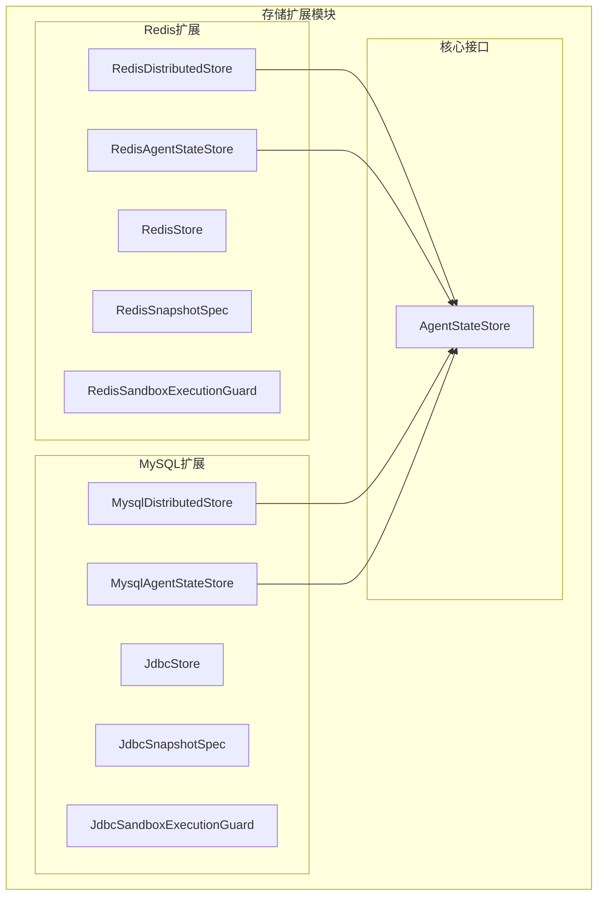
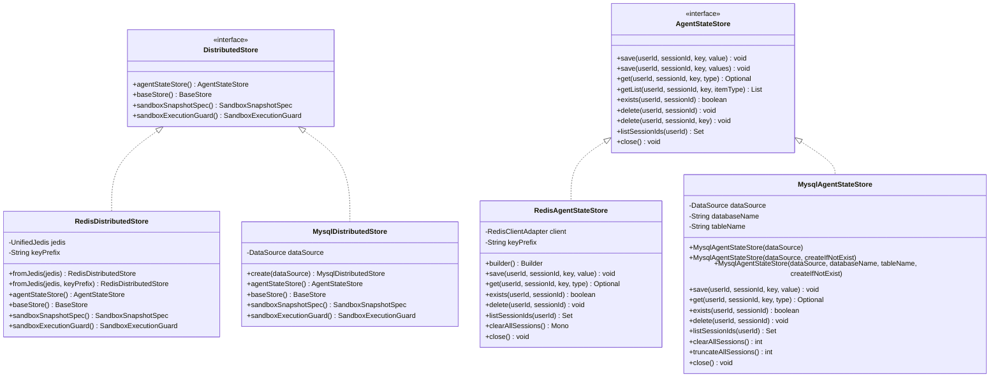
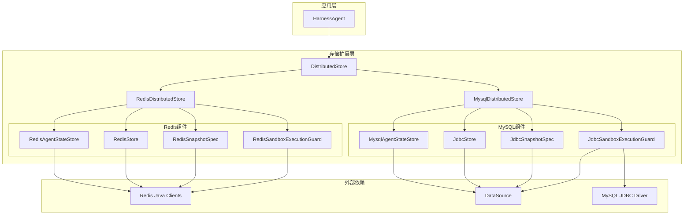

# 存储扩展API

<cite>
**本文档引用的文件**
- [RedisDistributedStore.java](file://agentscope-extensions/agentscope-extensions-redis/src/main/java/io/agentscope/extensions/redis/RedisDistributedStore.java)
- [MysqlDistributedStore.java](file://agentscope-extensions/agentscope-extensions-mysql/src/main/java/io/agentscope/extensions/mysql/MysqlDistributedStore.java)
- [AgentStateStore.java](file://agentscope-core/src/main/java/io/agentscope/core/state/AgentStateStore.java)
- [RedisAgentStateStore.java](file://agentscope-extensions/agentscope-extensions-redis/src/main/java/io/agentscope/extensions/redis/state/RedisAgentStateStore.java)
- [MysqlAgentStateStore.java](file://agentscope-extensions/agentscope-extensions-mysql/src/main/java/io/agentscope/extensions/mysql/state/MysqlAgentStateStore.java)
- [RedisStore.java](file://agentscope-extensions/agentscope-extensions-redis/src/main/java/io/agentscope/extensions/redis/store/RedisStore.java)
- [JdbcStore.java](file://agentscope-extensions/agentscope-extensions-mysql/src/main/java/io/agentscope/extensions/mysql/store/JdbcStore.java)
- [RedisSnapshotSpec.java](file://agentscope-extensions/agentscope-extensions-redis/src/main/java/io/agentscope/extensions/redis/snapshot/RedisSnapshotSpec.java)
- [JdbcSnapshotSpec.java](file://agentscope-extensions/agentscope-extensions-mysql/src/main/java/io/agentscope/extensions/mysql/snapshot/JdbcSnapshotSpec.java)
- [RedisSandboxExecutionGuard.java](file://agentscope-extensions/agentscope-extensions-redis/src/main/java/io/agentscope/extensions/redis/sandbox/RedisSandboxExecutionGuard.java)
- [JdbcSandboxExecutionGuard.java](file://agentscope-extensions/agentscope-extensions-mysql/src/main/java/io/agentscope/extensions/mysql/sandbox/JdbcSandboxExecutionGuard.java)
</cite>

## 目录
1. [简介](#简介)
2. [项目结构](#项目结构)
3. [核心组件](#核心组件)
4. [架构概览](#架构概览)
5. [详细组件分析](#详细组件分析)
6. [依赖关系分析](#依赖关系分析)
7. [性能考虑](#性能考虑)
8. [故障排除指南](#故障排除指南)
9. [结论](#结论)

## 简介

AgentScope存储扩展模块提供了分布式存储解决方案，支持Redis和MySQL两种后端存储。该模块实现了统一的分布式存储接口，为AgentScope框架提供可扩展的状态持久化能力。

本模块的核心目标是：
- 提供统一的分布式存储接口抽象
- 支持多种存储后端（Redis、MySQL）
- 实现会话状态管理
- 提供工作区文件系统KV存储
- 支持沙箱快照存储
- 实现并发控制和锁机制

## 项目结构

存储扩展模块采用按功能分层的组织方式：



**图表来源**
- [RedisDistributedStore.java:1-110](file://agentscope-extensions/agentscope-extensions-redis/src/main/java/io/agentscope/extensions/redis/RedisDistributedStore.java#L1-L110)
- [MysqlDistributedStore.java:1-92](file://agentscope-extensions/agentscope-extensions-mysql/src/main/java/io/agentscope/extensions/mysql/MysqlDistributedStore.java#L1-L92)

**章节来源**
- [RedisDistributedStore.java:1-110](file://agentscope-extensions/agentscope-extensions-redis/src/main/java/io/agentscope/extensions/redis/RedisDistributedStore.java#L1-L110)
- [MysqlDistributedStore.java:1-92](file://agentscope-extensions/agentscope-extensions-mysql/src/main/java/io/agentscope/extensions/mysql/MysqlDistributedStore.java#L1-L92)

## 核心组件

### 分布式存储接口

AgentStateStore定义了统一的状态存储接口，提供以下核心操作：

- **保存操作**：支持单个状态值和列表状态的保存
- **查询操作**：支持单个状态值和列表状态的获取
- **存在性检查**：验证会话是否存在
- **删除操作**：支持会话级和键级删除
- **会话列表**：列出指定用户命名空间下的所有会话

**章节来源**
- [AgentStateStore.java:1-167](file://agentscope-core/src/main/java/io/agentscope/core/state/AgentStateStore.java#L1-L167)

### 分布式存储实现

#### Redis分布式存储

RedisDistributedStore提供了基于Redis的分布式存储解决方案：

- **AgentStateStore**：RedisAgentStateStore
- **BaseStore**：RedisStore
- **SandboxSnapshotSpec**：RedisSnapshotSpec
- **SandboxExecutionGuard**：RedisSandboxExecutionGuard

#### MySQL分布式存储

MysqlDistributedStore提供了基于MySQL的分布式存储解决方案：

- **AgentStateStore**：MysqlAgentStateStore
- **BaseStore**：JdbcStore
- **SandboxSnapshotSpec**：JdbcSnapshotSpec
- **SandboxExecutionGuard**：JdbcSandboxExecutionGuard

**章节来源**
- [RedisDistributedStore.java:56-110](file://agentscope-extensions/agentscope-extensions-redis/src/main/java/io/agentscope/extensions/redis/RedisDistributedStore.java#L56-L110)
- [MysqlDistributedStore.java:54-92](file://agentscope-extensions/agentscope-extensions-mysql/src/main/java/io/agentscope/extensions/mysql/MysqlDistributedStore.java#L54-L92)

## 架构概览



**图表来源**
- [RedisDistributedStore.java:56-110](file://agentscope-extensions/agentscope-extensions-redis/src/main/java/io/agentscope/extensions/redis/RedisDistributedStore.java#L56-L110)
- [MysqlDistributedStore.java:54-92](file://agentscope-extensions/agentscope-extensions-mysql/src/main/java/io/agentscope/extensions/mysql/MysqlDistributedStore.java#L54-L92)
- [AgentStateStore.java:61-167](file://agentscope-core/src/main/java/io/agentscope/core/state/AgentStateStore.java#L61-L167)

## 详细组件分析

### Redis分布式存储

#### RedisDistributedStore

RedisDistributedStore是Redis后端的分布式存储入口点，提供以下配置选项：

**初始化方法**：
- `fromJedis(UnifiedJedis jedis)` - 使用默认键前缀创建
- `fromJedis(UnifiedJedis jedis, String keyPrefix)` - 使用自定义键前缀创建

**配置参数**：
- `jedis`：已初始化的Jedis客户端实例
- `keyPrefix`：Redis键的前缀，默认为"agentscope:"

**使用示例**：
```java
// 基础配置
UnifiedJedis jedis = new UnifiedJedis("redis://localhost:6379");
RedisDistributedStore store = RedisDistributedStore.fromJedis(jedis);

// 自定义前缀
RedisDistributedStore store = RedisDistributedStore.fromJedis(jedis, "myapp:");
```

**章节来源**
- [RedisDistributedStore.java:66-85](file://agentscope-extensions/agentscope-extensions-redis/src/main/java/io/agentscope/extensions/redis/RedisDistributedStore.java#L66-L85)
- [RedisDistributedStore.java:87-109](file://agentscope-extensions/agentscope-extensions-redis/src/main/java/io/agentscope/extensions/redis/RedisDistributedStore.java#L87-L109)

#### RedisAgentStateStore

RedisAgentStateStore提供了高性能的Redis状态存储实现：

**核心特性**：
- 支持多种Redis客户端（Jedis、Lettuce、Redisson）
- 列表状态的增量写入优化
- 哈希值检测防止重复写入
- 多租户键空间隔离

**数据结构设计**：
- 单值状态：`{prefix}{sessionId}:{stateKey}`
- 列表状态：`{prefix}{sessionId}:{stateKey}:list`
- 列表哈希：`{prefix}{sessionId}:{stateKey}:list:_hash`
- 键集合：`{prefix}{sessionId}:_keys`

**Builder模式配置**：
- `jedisClient(UnifiedJedis)` - Jedis客户端
- `lettuceClient(RedisClient)` - Lettuce客户端
- `redissonClient(RedissonClient)` - Redisson客户端
- `keyPrefix(String)` - 自定义键前缀

**章节来源**
- [RedisAgentStateStore.java:177-494](file://agentscope-extensions/agentscope-extensions-redis/src/main/java/io/agentscope/extensions/redis/state/RedisAgentStateStore.java#L177-L494)

#### RedisStore

RedisStore实现了工作区文件系统的KV存储：

**关键特性**：
- 原子性操作（Lua脚本）
- 版本控制的CAS操作
- 命名空间索引支持
- 高性能搜索能力

**原子操作**：
- `PUT_SCRIPT`：无条件版本递增和索引更新
- `PUT_IF_VERSION_SCRIPT`：条件CAS写入
- `DELETE_SCRIPT`：原子删除

**章节来源**
- [RedisStore.java:57-284](file://agentscope-extensions/agentscope-extensions-redis/src/main/java/io/agentscope/extensions/redis/store/RedisStore.java#L57-L284)

#### RedisSandboxExecutionGuard

RedisSandboxExecutionGuard提供了基于Redis的沙箱执行守卫：

**工作机制**：
1. 使用Redis SET NX PX命令获取分布式锁
2. 通过Lua脚本实现安全的锁释放
3. 支持重试间隔配置
4. 自动TTL过期保护

**配置参数**：
- `leaseTtl`：租约TTL时间，默认30分钟
- `retryInterval`：重试间隔，默认500ms
- `keyPrefix`：锁键前缀，默认"agentscope:sandbox:lock:"

**章节来源**
- [RedisSandboxExecutionGuard.java:95-263](file://agentscope-extensions/agentscope-extensions-redis/src/main/java/io/agentscope/extensions/redis/sandbox/RedisSandboxExecutionGuard.java#L95-L263)

### MySQL分布式存储

#### MysqlDistributedStore

MysqlDistributedStore是MySQL后端的分布式存储入口点：

**初始化方法**：
- `create(DataSource dataSource)` - 创建MySQL分布式存储

**配置参数**：
- `dataSource`：JDBC数据源实例

**自动配置**：
- MysqlAgentStateStore：自动创建数据库和表
- JdbcStore：自动初始化工作区存储
- JdbcSnapshotSpec：BLOB格式快照存储
- JdbcSandboxExecutionGuard：MySQL命名锁

**章节来源**
- [MysqlDistributedStore.java:68-90](file://agentscope-extensions/agentscope-extensions-mysql/src/main/java/io/agentscope/extensions/mysql/MysqlDistributedStore.java#L68-L90)

#### MysqlAgentStateStore

MysqlAgentStateStore提供了可靠的MySQL状态存储实现：

**核心特性**：
- 真正的增量列表存储
- 类型安全的状态序列化
- 自动表创建和验证
- SQL注入防护

**表结构设计**：
```sql
CREATE TABLE IF NOT EXISTS agentscope_sessions (
    session_id VARCHAR(255) NOT NULL,
    state_key VARCHAR(255) NOT NULL,
    item_index INT NOT NULL DEFAULT 0,
    state_data LONGTEXT NOT NULL,
    created_at TIMESTAMP DEFAULT CURRENT_TIMESTAMP,
    updated_at TIMESTAMP DEFAULT CURRENT_TIMESTAMP ON UPDATE CURRENT_TIMESTAMP,
    PRIMARY KEY (session_id, state_key, item_index)
) DEFAULT CHARACTER SET utf8mb4 COLLATE utf8mb4_unicode_ci;
```

**构造函数重载**：
- `MysqlAgentStateStore(DataSource dataSource)`
- `MysqlAgentStateStore(DataSource dataSource, boolean createIfNotExist)`
- `MysqlAgentStateStore(DataSource dataSource, String databaseName, String tableName, boolean createIfNotExist)`

**章节来源**
- [MysqlAgentStateStore.java:68-800](file://agentscope-extensions/agentscope-extensions-mysql/src/main/java/io/agentscope/extensions/mysql/state/MysqlAgentStateStore.java#L68-L800)

#### JdbcStore

JdbcStore实现了通用的JDBC存储后端：

**支持的数据库**：
- MySQL
- PostgreSQL  
- SQLite
- H2

**核心功能**：
- 原子CAS操作
- 命名空间前缀搜索
- 版本控制
- 跨数据库兼容性

**命名空间编码**：
使用ASCII单位分隔符（U+001F）编码命名空间路径，支持深度搜索。

**章节来源**
- [JdbcStore.java:74-419](file://agentscope-extensions/agentscope-extensions-mysql/src/main/java/io/agentscope/extensions/mysql/store/JdbcStore.java#L74-L419)

#### JdbcSandboxExecutionGuard

JdbcSandboxExecutionGuard提供了基于MySQL的沙箱执行守卫：

**实现原理**：
- 使用MySQL GET_LOCK()函数获取命名锁
- 连接生命周期绑定锁管理
- 自动锁释放机制

**配置参数**：
- `keyPrefix`：锁名称前缀，默认"agentscope:sandbox:lock:"
- `lockTimeoutSeconds`：锁超时时间，默认1800秒

**章节来源**
- [JdbcSandboxExecutionGuard.java:45-177](file://agentscope-extensions/agentscope-extensions-mysql/src/main/java/io/agentscope/extensions/mysql/sandbox/JdbcSandboxExecutionGuard.java#L45-L177)

### 快照存储

#### RedisSnapshotSpec

RedisSnapshotSpec提供了Redis后端的快照存储：

**特性**：
- Redis键值存储
- 可选TTL设置
- 二进制数据存储

**使用场景**：
- 沙箱环境快照
- 临时状态备份
- 快速恢复机制

#### JdbcSnapshotSpec

JdbcSnapshotSpec提供了JDBC后端的快照存储：

**特性**：
- 数据库BLOB存储
- 结构化数据管理
- ACID事务保证

**使用场景**：
- 长期快照存储
- 数据库迁移
- 审计日志

**章节来源**
- [RedisSnapshotSpec.java:25-37](file://agentscope-extensions/agentscope-extensions-redis/src/main/java/io/agentscope/extensions/redis/snapshot/RedisSnapshotSpec.java#L25-L37)
- [JdbcSnapshotSpec.java:27-36](file://agentscope-extensions/agentscope-extensions-mysql/src/main/java/io/agentscope/extensions/mysql/snapshot/JdbcSnapshotSpec.java#L27-L36)

## 依赖关系分析



**图表来源**
- [RedisDistributedStore.java:56-110](file://agentscope-extensions/agentscope-extensions-redis/src/main/java/io/agentscope/extensions/redis/RedisDistributedStore.java#L56-L110)
- [MysqlDistributedStore.java:54-92](file://agentscope-extensions/agentscope-extensions-mysql/src/main/java/io/agentscope/extensions/mysql/MysqlDistributedStore.java#L54-L92)

### 组件耦合度分析

**高内聚低耦合**：
- 每个存储实现专注于单一职责
- 接口抽象清晰，易于替换
- 外部依赖通过接口解耦

**潜在循环依赖**：
- 无直接循环依赖
- 通过接口实现松散耦合

**扩展性考虑**：
- 新存储后端可通过实现DistributedStore接口添加
- 现有组件支持良好的向后兼容性

**章节来源**
- [AgentStateStore.java:61-167](file://agentscope-core/src/main/java/io/agentscope/core/state/AgentStateStore.java#L61-L167)

## 性能考虑

### Redis存储性能优化

**连接池配置**：
- 使用连接池减少连接开销
- 合理设置最大连接数
- 配置合适的超时参数

**键空间优化**：
- 合理的键前缀设计
- 避免键名过长
- 使用适当的TTL策略

**内存管理**：
- 列表状态的增量写入
- 哈希值缓存机制
- 及时清理过期数据

### MySQL存储性能优化

**连接管理**：
- 使用连接池技术
- 配置合适的连接超时
- 合理的事务边界

**索引优化**：
- 主键索引设计
- 查询字段索引
- 复合索引策略

**SQL优化**：
- 参数化查询
- 批量操作
- 避免N+1查询

### 并发控制策略

**Redis锁机制**：
- SET NX PX原子操作
- Lua脚本保证一致性
- 自适应重试策略

**MySQL锁机制**：
- GET_LOCK()函数使用
- 连接级锁管理
- 自动超时保护

## 故障排除指南

### 常见问题诊断

**连接问题**：
- Redis连接失败：检查网络连通性和认证配置
- MySQL连接超时：验证连接池配置和数据库状态
- 超时设置不当：调整连接超时和查询超时参数

**数据一致性问题**：
- Redis数据丢失：检查TTL设置和内存淘汰策略
- MySQL数据不一致：验证事务配置和隔离级别
- 并发冲突：检查锁机制配置

**性能问题**：
- 内存使用过高：优化键空间设计和数据压缩
- 查询响应慢：检查索引使用和SQL优化
- 连接池耗尽：增加连接池大小或优化使用模式

### 错误处理最佳实践

**异常分类**：
- 连接异常：重试机制和降级策略
- 业务异常：幂等性设计和补偿机制
- 系统异常：优雅降级和监控告警

**监控指标**：
- 连接成功率
- 请求延迟分布
- 错误率统计
- 资源使用率

**章节来源**
- [RedisAgentStateStore.java:216-224](file://agentscope-extensions/agentscope-extensions-redis/src/main/java/io/agentscope/extensions/redis/state/RedisAgentStateStore.java#L216-L224)
- [MysqlAgentStateStore.java:353-356](file://agentscope-extensions/agentscope-extensions-mysql/src/main/java/io/agentscope/extensions/mysql/state/MysqlAgentStateStore.java#L353-L356)

## 结论

AgentScope存储扩展模块提供了完整的分布式存储解决方案，具有以下优势：

**技术优势**：
- 统一的接口抽象，易于扩展和替换
- 支持多种存储后端，满足不同场景需求
- 完善的并发控制和一致性保证
- 良好的性能优化和监控支持

**适用场景**：
- 高并发的多租户应用
- 需要强一致性的业务系统
- 大规模数据存储需求
- 复杂的会话状态管理

**未来发展**：
- 支持更多存储后端
- 增强监控和运维能力
- 优化性能和资源利用率
- 提供更丰富的扩展接口

该模块为AgentScope框架提供了可靠、高效的存储基础设施，能够满足各种复杂应用场景的需求。