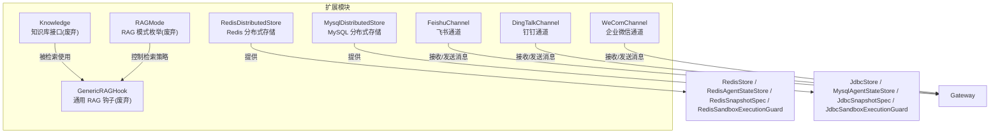
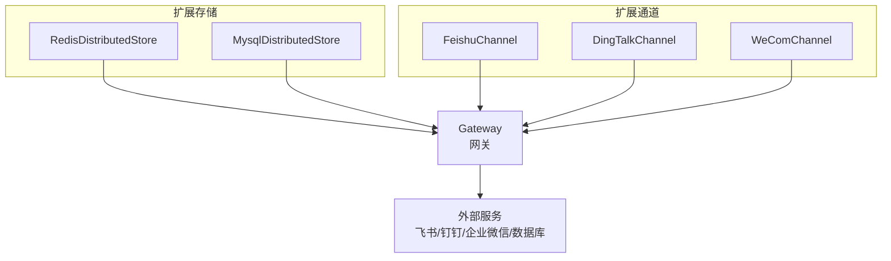
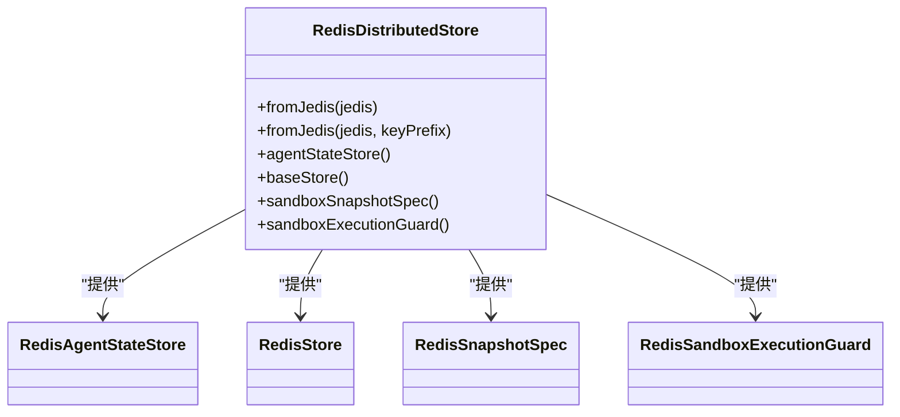
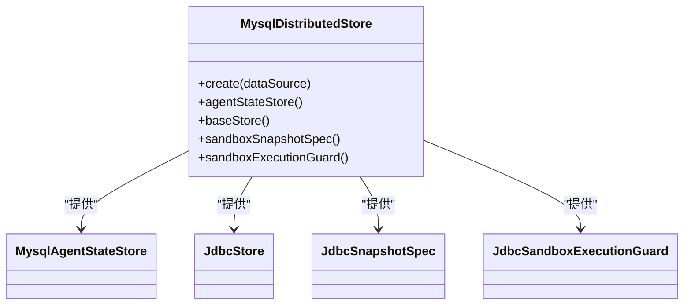
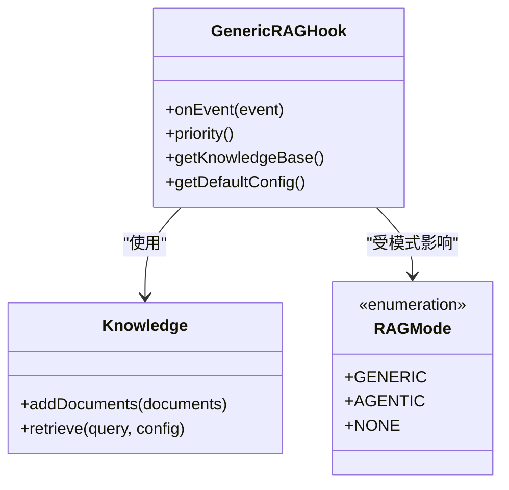
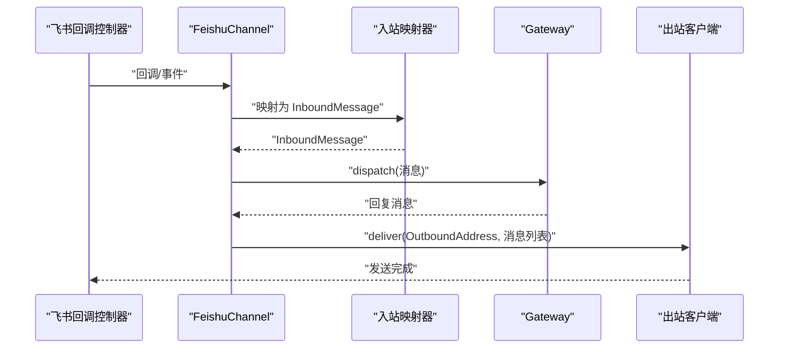
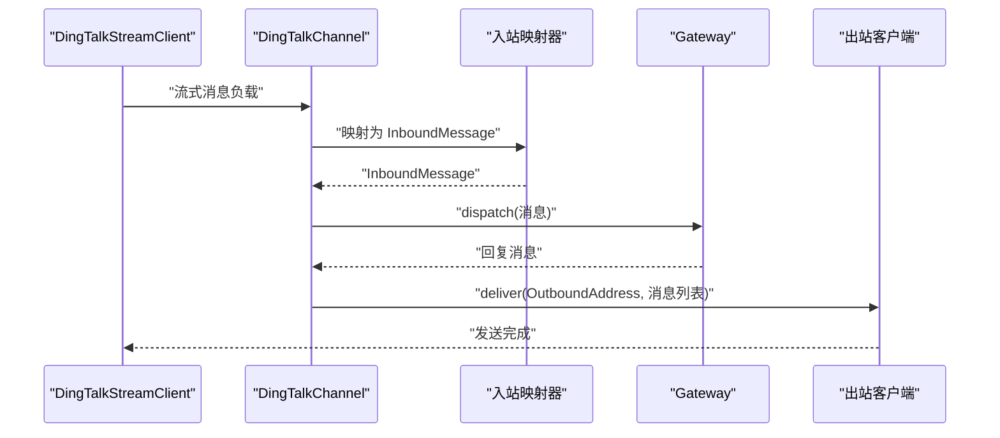
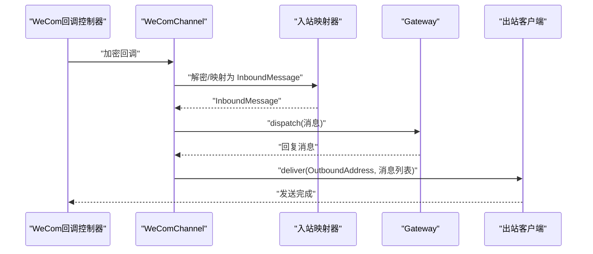
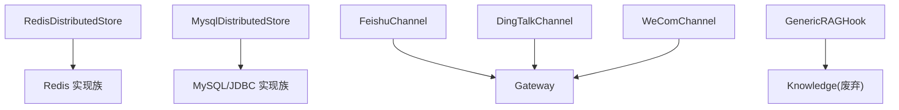

# 扩展API

<cite>
**本文档引用的文件**
- [RedisDistributedStore.java](file://agentscope-extensions/agentscope-extensions-redis/src/main/java/io/agentscope/extensions/redis/RedisDistributedStore.java)
- [MysqlDistributedStore.java](file://agentscope-extensions/agentscope-extensions-mysql/src/main/java/io/agentscope/extensions/mysql/MysqlDistributedStore.java)
- [Knowledge.java](file://agentscope-core/src/main/java/io/agentscope/core/rag/Knowledge.java)
- [RAGMode.java](file://agentscope-core/src/main/java/io/agentscope/core/rag/RAGMode.java)
- [GenericRAGHook.java](file://agentscope-core/src/main/java/io/agentscope/core/rag/GenericRAGHook.java)
- [FeishuChannel.java](file://agentscope-extensions/agentscope-extensions-channel/agentscope-extensions-channel-feishu/src/main/java/io/agentscope/extensions/channel/feishu/FeishuChannel.java)
- [DingTalkChannel.java](file://agentscope-extensions/agentscope-extensions-channel/agentscope-extensions-channel-dingtalk/src/main/java/io/agentscope/extensions/channel/dingtalk/DingTalkChannel.java)
- [WeComChannel.java](file://agentscope-extensions/agentscope-extensions-channel/agentscope-extensions-channel-wecom/src/main/java/io/agentscope/extensions/channel/wecom/WeComChannel.java)
</cite>

## 目录
1. [简介](#简介)
2. [项目结构](#项目结构)
3. [核心组件](#核心组件)
4. [架构总览](#架构总览)
5. [详细组件分析](#详细组件分析)
6. [依赖分析](#依赖分析)
7. [性能考虑](#性能考虑)
8. [故障排查指南](#故障排查指南)
9. [结论](#结论)
10. [附录](#附录)

## 简介
本文件为 AgentScope 扩展模块的完整 API 参考文档，覆盖以下主题：
- 分布式存储扩展：RedisDistributedStore、MysqlDistributedStore 的接口与用法
- RAG 检索增强：RAG 模式、检索钩子与知识库接口（已标记为废弃）
- 通道集成：飞书、钉钉、企业微信等第三方服务通道接口
- 配置、初始化与使用流程：如何在 Agent 中启用分布式存储与通道

注意：RAG 包已在 2.0.0 版本移除，相关类标注为废弃，建议在应用层自行集成检索逻辑。

## 项目结构
扩展模块按功能域划分，主要包含：
- 分布式存储：Redis 与 MySQL 实现
- 通道集成：飞书、钉钉、企业微信等
- RAG：核心 RAG 接口与钩子（已废弃）

图表来源
- [RedisDistributedStore.java:56-108](file://agentscope-extensions/agentscope-extensions-redis/src/main/java/io/agentscope/extensions/redis/RedisDistributedStore.java#L56-L108)
- [MysqlDistributedStore.java:54-90](file://agentscope-extensions/agentscope-extensions-mysql/src/main/java/io/agentscope/extensions/mysql/MysqlDistributedStore.java#L54-L90)
- [FeishuChannel.java:46-218](file://agentscope-extensions/agentscope-extensions-channel/agentscope-extensions-channel-feishu/src/main/java/io/agentscope/extensions/channel/feishu/FeishuChannel.java#L46-L218)
- [DingTalkChannel.java:47-248](file://agentscope-extensions/agentscope-extensions-channel/agentscope-extensions-channel-dingtalk/src/main/java/io/agentscope/extensions/channel/dingtalk/DingTalkChannel.java#L47-L248)
- [WeComChannel.java:46-226](file://agentscope-extensions/agentscope-extensions-channel/agentscope-extensions-channel-wecom/src/main/java/io/agentscope/extensions/channel/wecom/WeComChannel.java#L46-L226)
- [Knowledge.java:34-58](file://agentscope-core/src/main/java/io/agentscope/core/rag/Knowledge.java#L34-L58)
- [RAGMode.java:32-56](file://agentscope-core/src/main/java/io/agentscope/core/rag/RAGMode.java#L32-L56)
- [GenericRAGHook.java:69-251](file://agentscope-core/src/main/java/io/agentscope/core/rag/GenericRAGHook.java#L69-L251)

章节来源
- [RedisDistributedStore.java:30-108](file://agentscope-extensions/agentscope-extensions-redis/src/main/java/io/agentscope/extensions/redis/RedisDistributedStore.java#L30-L108)
- [MysqlDistributedStore.java:30-90](file://agentscope-extensions/agentscope-extensions-mysql/src/main/java/io/agentscope/extensions/mysql/MysqlDistributedStore.java#L30-L90)
- [FeishuChannel.java:35-218](file://agentscope-extensions/agentscope-extensions-channel/agentscope-extensions-channel-feishu/src/main/java/io/agentscope/extensions/channel/feishu/FeishuChannel.java#L35-L218)
- [DingTalkChannel.java:37-248](file://agentscope-extensions/agentscope-extensions-channel/agentscope-extensions-channel-dingtalk/src/main/java/io/agentscope/extensions/channel/dingtalk/DingTalkChannel.java#L37-L248)
- [WeComChannel.java:35-226](file://agentscope-extensions/agentscope-extensions-channel/agentscope-extensions-channel-wecom/src/main/java/io/agentscope/extensions/channel/wecom/WeComChannel.java#L35-L226)
- [Knowledge.java:23-58](file://agentscope-core/src/main/java/io/agentscope/core/rag/Knowledge.java#L23-L58)
- [RAGMode.java:18-56](file://agentscope-core/src/main/java/io/agentscope/core/rag/RAGMode.java#L18-L56)
- [GenericRAGHook.java:33-251](file://agentscope-core/src/main/java/io/agentscope/core/rag/GenericRAGHook.java#L33-L251)

## 核心组件
本节概述扩展模块的关键接口与实现类，并给出使用场景与职责。

- 分布式存储
  - RedisDistributedStore：基于 Jedis 的分布式存储工厂，提供会话状态、文件系统 KV、沙箱快照与并发锁能力
  - MysqlDistributedStore：基于 JDBC 的分布式存储工厂，提供会话状态、文件系统 KV、沙箱快照与分布式锁能力
- 通道集成
  - FeishuChannel：飞书（Lark）通道适配器，支持回调接入、加解密、幂等与机器人循环防护
  - DingTalkChannel：钉钉通道适配器，支持持久化 WebSocket 流式协议
  - WeComChannel：企业微信通道适配器，支持回调接入、加解密、幂等与机器人循环防护
- RAG 增强（已废弃）
  - Knowledge：知识库统一接口（已废弃）
  - RAGMode：RAG 模式枚举（已废弃）
  - GenericRAGHook：通用 RAG 钩子（已废弃）

章节来源
- [RedisDistributedStore.java:56-108](file://agentscope-extensions/agentscope-extensions-redis/src/main/java/io/agentscope/extensions/redis/RedisDistributedStore.java#L56-L108)
- [MysqlDistributedStore.java:54-90](file://agentscope-extensions/agentscope-extensions-mysql/src/main/java/io/agentscope/extensions/mysql/MysqlDistributedStore.java#L54-L90)
- [FeishuChannel.java:46-218](file://agentscope-extensions/agentscope-extensions-channel/agentscope-extensions-channel-feishu/src/main/java/io/agentscope/extensions/channel/feishu/FeishuChannel.java#L46-L218)
- [DingTalkChannel.java:47-248](file://agentscope-extensions/agentscope-extensions-channel/agentscope-extensions-channel-dingtalk/src/main/java/io/agentscope/extensions/channel/dingtalk/DingTalkChannel.java#L47-L248)
- [WeComChannel.java:46-226](file://agentscope-extensions/agentscope-extensions-channel/agentscope-extensions-channel-wecom/src/main/java/io/agentscope/extensions/channel/wecom/WeComChannel.java#L46-L226)
- [Knowledge.java:23-58](file://agentscope-core/src/main/java/io/agentscope/core/rag/Knowledge.java#L23-L58)
- [RAGMode.java:18-56](file://agentscope-core/src/main/java/io/agentscope/core/rag/RAGMode.java#L18-L56)
- [GenericRAGHook.java:33-251](file://agentscope-core/src/main/java/io/agentscope/core/rag/GenericRAGHook.java#L33-L251)

## 架构总览
下图展示扩展模块与核心网关、通道以及外部系统的交互关系。

图表来源
- [RedisDistributedStore.java:56-108](file://agentscope-extensions/agentscope-extensions-redis/src/main/java/io/agentscope/extensions/redis/RedisDistributedStore.java#L56-L108)
- [MysqlDistributedStore.java:54-90](file://agentscope-extensions/agentscope-extensions-mysql/src/main/java/io/agentscope/extensions/mysql/MysqlDistributedStore.java#L54-L90)
- [FeishuChannel.java:130-180](file://agentscope-extensions/agentscope-extensions-channel/agentscope-extensions-channel-feishu/src/main/java/io/agentscope/extensions/channel/feishu/FeishuChannel.java#L130-L180)
- [DingTalkChannel.java:147-175](file://agentscope-extensions/agentscope-extensions-channel/agentscope-extensions-channel-dingtalk/src/main/java/io/agentscope/extensions/channel/dingtalk/DingTalkChannel.java#L147-L175)
- [WeComChannel.java:161-188](file://agentscope-extensions/agentscope-extensions-channel/agentscope-extensions-channel-wecom/src/main/java/io/agentscope/extensions/channel/wecom/WeComChannel.java#L161-L188)

## 详细组件分析

### 分布式存储扩展

#### RedisDistributedStore
- 职责
  - 提供基于 Redis 的分布式存储能力：会话状态、工作区文件系统 KV、沙箱快照与并发锁
  - 支持自定义键前缀，便于多实例隔离
- 关键方法
  - fromJedis(UnifiedJedis)：从 Jedis 客户端创建，默认前缀
  - fromJedis(UnifiedJedis, String)：指定键前缀
  - agentStateStore()：返回 RedisAgentStateStore
  - baseStore()：返回 RedisStore
  - sandboxSnapshotSpec()：返回 RedisSnapshotSpec
  - sandboxExecutionGuard()：返回 RedisSandboxExecutionGuard
- 使用要点
  - 通过分布式存储工厂注入到 Agent 构建器中
  - 键前缀建议包含业务标识，避免冲突

图表来源
- [RedisDistributedStore.java:56-108](file://agentscope-extensions/agentscope-extensions-redis/src/main/java/io/agentscope/extensions/redis/RedisDistributedStore.java#L56-L108)

章节来源
- [RedisDistributedStore.java:30-108](file://agentscope-extensions/agentscope-extensions-redis/src/main/java/io/agentscope/extensions/redis/RedisDistributedStore.java#L30-L108)

#### MysqlDistributedStore
- 职责
  - 提供基于 MySQL/JDBC 的分布式存储能力：会话状态、工作区文件系统 KV、沙箱快照与分布式锁
- 关键方法
  - create(DataSource)：创建存储工厂
  - agentStateStore()：返回 MysqlAgentStateStore
  - baseStore()：返回 JdbcStore（可初始化表结构）
  - sandboxSnapshotSpec()：返回 JdbcSnapshotSpec
  - sandboxExecutionGuard()：返回 JdbcSandboxExecutionGuard
- 使用要点
  - DataSource 建议使用连接池（如 HikariCP、Druid）
  - 初始化时可选择自动建表

图表来源
- [MysqlDistributedStore.java:54-90](file://agentscope-extensions/agentscope-extensions-mysql/src/main/java/io/agentscope/extensions/mysql/MysqlDistributedStore.java#L54-L90)

章节来源
- [MysqlDistributedStore.java:30-90](file://agentscope-extensions/agentscope-extensions-mysql/src/main/java/io/agentscope/extensions/mysql/MysqlDistributedStore.java#L30-L90)

### RAG 检索增强（已废弃）
- 适用场景
  - 将知识库检索结果注入到模型推理上下文中，提升回答准确性
- 组件说明
  - Knowledge：知识库接口（已废弃）
  - RAGMode：RAG 模式枚举（已废弃）
  - GenericRAGHook：通用 RAG 钩子（已废弃），在每次推理前自动检索并注入知识
- 注意事项
  - 该包自 2.0.0 起已移除，建议在应用层自行实现检索与上下文注入

图表来源
- [Knowledge.java:34-58](file://agentscope-core/src/main/java/io/agentscope/core/rag/Knowledge.java#L34-L58)
- [RAGMode.java:32-56](file://agentscope-core/src/main/java/io/agentscope/core/rag/RAGMode.java#L32-L56)
- [GenericRAGHook.java:69-251](file://agentscope-core/src/main/java/io/agentscope/core/rag/GenericRAGHook.java#L69-L251)

章节来源
- [Knowledge.java:23-58](file://agentscope-core/src/main/java/io/agentscope/core/rag/Knowledge.java#L23-L58)
- [RAGMode.java:18-56](file://agentscope-core/src/main/java/io/agentscope/core/rag/RAGMode.java#L18-L56)
- [GenericRAGHook.java:33-251](file://agentscope-core/src/main/java/io/agentscope/core/rag/GenericRAGHook.java#L33-L251)

### 通道集成

#### 飞书（Feishu）通道
- 职责
  - 处理飞书回调验证、事件订阅、可选加解密、去重、机器人循环防护
  - 通过 Outbound 客户端调用飞书 OpenAPI 发送消息
- 关键点
  - 类型标识：feishu
  - 生命周期：init/start/stop
  - 入站处理：由回调控制器接入，经映射器转换为内部消息
  - 出站发送：通过 OutboundClient 异步发送

图表来源
- [FeishuChannel.java:130-180](file://agentscope-extensions/agentscope-extensions-channel/agentscope-extensions-channel-feishu/src/main/java/io/agentscope/extensions/channel/feishu/FeishuChannel.java#L130-L180)

章节来源
- [FeishuChannel.java:35-218](file://agentscope-extensions/agentscope-extensions-channel/agentscope-extensions-channel-feishu/src/main/java/io/agentscope/extensions/channel/feishu/FeishuChannel.java#L35-L218)

#### 钉钉（DingTalk）通道
- 职责
  - 通过持久化 WebSocket 流式协议接收消息，进行去重与循环防护后路由执行
  - 通过批量发送接口异步回复
- 关键点
  - 类型标识：dingtalk
  - 生命周期：init/start/stop
  - 入站处理：WebSocket 回调 → 映射器 → 去重/防护 → 路由执行
  - 出站发送：批量 OpenAPI 接口

图表来源
- [DingTalkChannel.java:147-175](file://agentscope-extensions/agentscope-extensions-channel/agentscope-extensions-channel-dingtalk/src/main/java/io/agentscope/extensions/channel/dingtalk/DingTalkChannel.java#L147-L175)

章节来源
- [DingTalkChannel.java:37-248](file://agentscope-extensions/agentscope-extensions-channel/agentscope-extensions-channel-dingtalk/src/main/java/io/agentscope/extensions/channel/dingtalk/DingTalkChannel.java#L37-L248)

#### 企业微信（WeCom）通道
- 职责
  - 处理回调验证、加密消息解密、去重、机器人循环防护
  - 通过 OpenAPI 发送私聊与群聊消息
- 关键点
  - 类型标识：wecom
  - 生命周期：init/start/stop
  - 入站处理：回调控制器 → 解密 → 去重 → 映射 → 路由执行
  - 出站发送：根据消息类型选择不同接口

图表来源
- [WeComChannel.java:161-188](file://agentscope-extensions/agentscope-extensions-channel/agentscope-extensions-channel-wecom/src/main/java/io/agentscope/extensions/channel/wecom/WeComChannel.java#L161-L188)

章节来源
- [WeComChannel.java:35-226](file://agentscope-extensions/agentscope-extensions-channel/agentscope-extensions-channel-wecom/src/main/java/io/agentscope/extensions/channel/wecom/WeComChannel.java#L35-L226)

## 依赖分析
- 存储扩展
  - RedisDistributedStore 依赖 Redis 客户端与相关存储实现
  - MysqlDistributedStore 依赖 JDBC 数据源与相关存储实现
- 通道扩展
  - 各通道均依赖 Gateway 进行消息路由与执行
  - 各通道依赖各自的访问令牌提供者、出站客户端与入站映射器
- RAG（已废弃）
  - GenericRAGHook 依赖 Knowledge 与 RetrieveConfig

图表来源
- [RedisDistributedStore.java:56-108](file://agentscope-extensions/agentscope-extensions-redis/src/main/java/io/agentscope/extensions/redis/RedisDistributedStore.java#L56-L108)
- [MysqlDistributedStore.java:54-90](file://agentscope-extensions/agentscope-extensions-mysql/src/main/java/io/agentscope/extensions/mysql/MysqlDistributedStore.java#L54-L90)
- [FeishuChannel.java:130-180](file://agentscope-extensions/agentscope-extensions-channel/agentscope-extensions-channel-feishu/src/main/java/io/agentscope/extensions/channel/feishu/FeishuChannel.java#L130-L180)
- [DingTalkChannel.java:147-175](file://agentscope-extensions/agentscope-extensions-channel/agentscope-extensions-channel-dingtalk/src/main/java/io/agentscope/extensions/channel/dingtalk/DingTalkChannel.java#L147-L175)
- [WeComChannel.java:161-188](file://agentscope-extensions/agentscope-extensions-channel/agentscope-extensions-channel-wecom/src/main/java/io/agentscope/extensions/channel/wecom/WeComChannel.java#L161-L188)
- [GenericRAGHook.java:69-251](file://agentscope-core/src/main/java/io/agentscope/core/rag/GenericRAGHook.java#L69-L251)

## 性能考虑
- 存储扩展
  - Redis：合理设置键前缀与过期策略；对热点键进行分片或缓存预热
  - MySQL：使用连接池与合适的超时配置；对大对象（如快照）考虑分表或外部存储
- 通道扩展
  - 钉钉 WebSocket：注意背压与消息聚合，避免频繁小包发送
  - 飞书/企业微信：批量发送与异步回调，减少阻塞
- RAG（已废弃）
  - 由于该模块已废弃，不建议在此模块上做性能优化，建议在应用层自行实现检索

## 故障排查指南
- 通道常见问题
  - 回调无法到达：检查回调地址、加密配置与令牌有效期
  - 重复消息：确认幂等键与去重逻辑是否生效
  - 循环防护触发：检查机器人循环防护阈值与会话键
  - 发送失败：查看出站客户端错误日志与限流策略
- 存储常见问题
  - Redis 连接异常：检查连接池配置与网络连通性
  - MySQL 连接池耗尽：调整最大连接数与超时时间
  - 快照写入失败：检查磁盘空间与权限
- RAG（已废弃）
  - 由于该模块已废弃，建议在应用层自行实现检索与上下文注入

章节来源
- [FeishuChannel.java:130-180](file://agentscope-extensions/agentscope-extensions-channel/agentscope-extensions-channel-feishu/src/main/java/io/agentscope/extensions/channel/feishu/FeishuChannel.java#L130-L180)
- [DingTalkChannel.java:147-175](file://agentscope-extensions/agentscope-extensions-channel/agentscope-extensions-channel-dingtalk/src/main/java/io/agentscope/extensions/channel/dingtalk/DingTalkChannel.java#L147-L175)
- [WeComChannel.java:161-188](file://agentscope-extensions/agentscope-extensions-channel/agentscope-extensions-channel-wecom/src/main/java/io/agentscope/extensions/channel/wecom/WeComChannel.java#L161-L188)
- [GenericRAGHook.java:110-166](file://agentscope-core/src/main/java/io/agentscope/core/rag/GenericRAGHook.java#L110-L166)

## 结论
- 分布式存储扩展提供了 Redis 与 MySQL 两种可靠的后端实现，满足会话状态、文件系统 KV、沙箱快照与并发控制需求
- 通道扩展覆盖主流国产 IM 平台，具备回调接入、加解密、幂等与循环防护等关键能力
- RAG 模块已废弃，建议在应用层自行实现检索与上下文注入，以获得更高的灵活性与可控性

## 附录
- 配置与初始化建议
  - 存储扩展：优先使用连接池；为不同环境设置独立键前缀
  - 通道扩展：确保回调地址可访问、令牌有效；根据平台特性开启加密与去重
  - RAG：若仍需使用，请在应用层实现检索与上下文注入逻辑