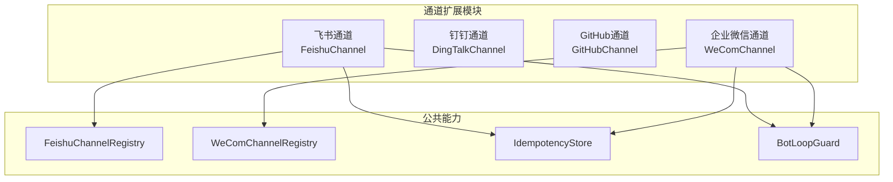
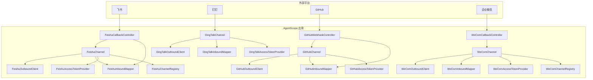
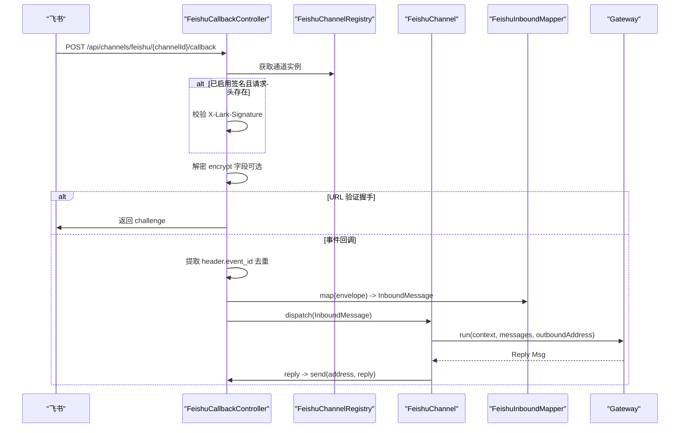
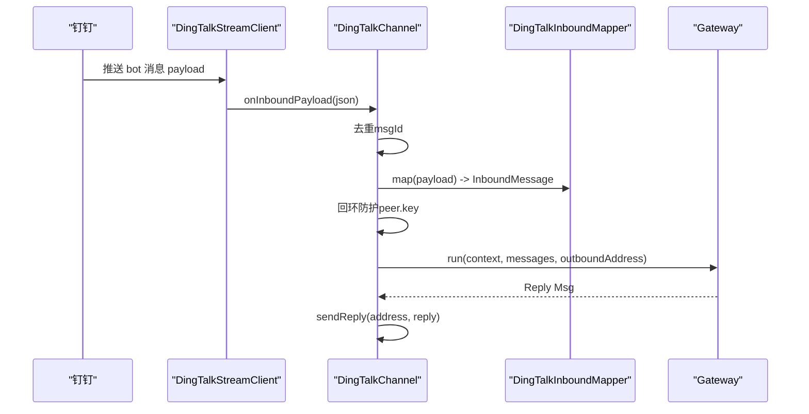
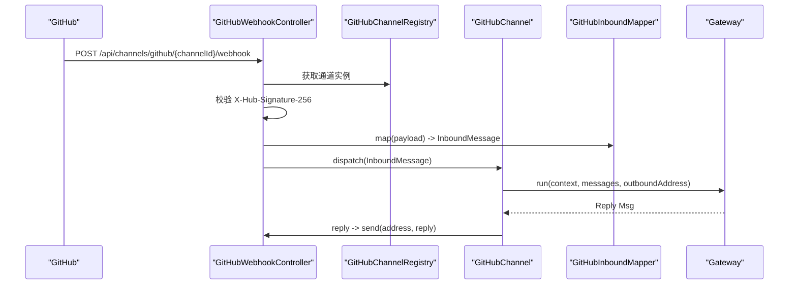
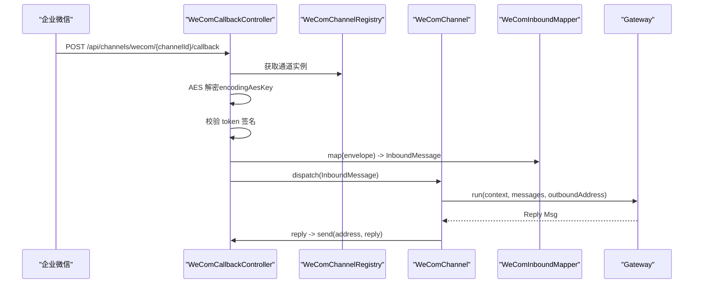
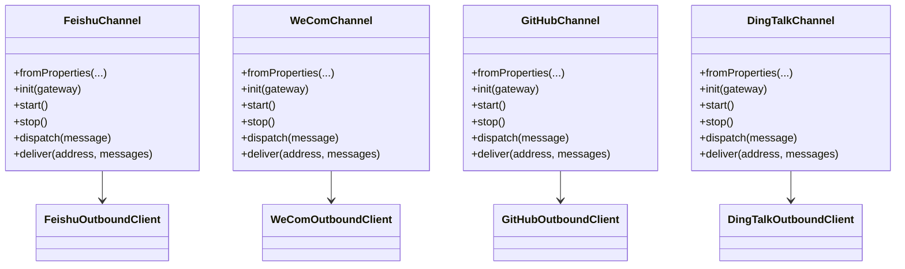

# 通道集成API

<cite>
**本文引用的文件**   
- [FeishuChannel.java](file://agentscope-extensions/agentscope-extensions-channel/agentscope-extensions-channel-feishu/src/main/java/io/agentscope/extensions/channel/feishu/FeishuChannel.java)
- [FeishuChannelProperties.java](file://agentscope-extensions/agentscope-extensions-channel/agentscope-extensions-channel-feishu/src/main/java/io/agentscope/extensions/channel/feishu/FeishuChannelProperties.java)
- [FeishuCallbackController.java](file://agentscope-extensions/agentscope-extensions-channel/agentscope-extensions-channel-feishu/src/main/java/io/agentscope/extensions/channel/feishu/FeishuCallbackController.java)
- [FeishuInboundMapper.java](file://agentscope-extensions/agentscope-extensions-channel/agentscope-extensions-channel-feishu/src/main/java/io/agentscope/extensions/channel/feishu/FeishuInboundMapper.java)
- [FeishuOutboundClient.java](file://agentscope-extensions/agentscope-extensions-channel/agentscope-extensions-channel-feishu/src/main/java/io/agentscope/extensions/channel/feishu/FeishuOutboundClient.java)
- [FeishuChannelRegistry.java](file://agentscope-extensions/agentscope-extensions-channel/agentscope-extensions-channel-feishu/src/main/java/io/agentscope/extensions/channel/feishu/FeishuChannelRegistry.java)
- [DingTalkChannel.java](file://agentscope-extensions/agentscope-extensions-channel/agentscope-extensions-channel-dingtalk/src/main/java/io/agentscope/extensions/channel/dingtalk/DingTalkChannel.java)
- [GitHubChannel.java](file://agentscope-extensions/agentscope-extensions-channel/agentscope-extensions-channel-github/src/main/java/io/agentscope/extensions/channel/github/GitHubChannel.java)
- [GitHubChannelProperties.java](file://agentscope-extensions/agentscope-extensions-channel/agentscope-extensions-channel-github/src/main/java/io/agentscope/extensions/channel/github/GitHubChannelProperties.java)
- [WeComChannel.java](file://agentscope-extensions/agentscope-extensions-channel/agentscope-extensions-channel-wecom/src/main/java/io/agentscope/extensions/channel/wecom/WeComChannel.java)
- [WeComChannelProperties.java](file://agentscope-extensions/agentscope-extensions-channel/agentscope-extensions-channel-wecom/src/main/java/io/agentscope/extensions/channel/wecom/WeComChannelProperties.java)
</cite>

## 目录
1. [简介](#简介)
2. [项目结构](#项目结构)
3. [核心组件](#核心组件)
4. [架构总览](#架构总览)
5. [详细组件分析](#详细组件分析)
6. [依赖关系分析](#依赖关系分析)
7. [性能与可靠性特性](#性能与可靠性特性)
8. [故障排查指南](#故障排查指南)
9. [结论](#结论)
10. [附录：API定义与配置项](#附录api定义与配置项)

## 简介
本文件为 AgentScope 通道集成模块的详细API参考，覆盖飞书（FeishuChannel）、钉钉（DingTalkChannel）、GitHub（GitHubChannel）与企业微信（WeComChannel）四大第三方服务通道。内容包括：
- 初始化与生命周期管理
- 认证与令牌获取机制
- 消息接收、去重、回环防护与路由
- 消息发送与回调处理
- 平台特有消息格式解析与内容提取
- 加密与签名验证流程
- Webhook/回调端点与HTTP交互规范

## 项目结构
通道集成位于 agentscope-extensions 子模块中，按平台拆分为独立子模块，每个子模块包含：
- 通道适配器（Channel）
- 属性配置对象（Properties）
- 回调控制器（Spring Controller）
- 入站映射器（InboundMapper）
- 出站客户端（OutboundClient）
- 注册表（Registry，用于URL路由到具体通道实例）

图表来源
- [FeishuChannel.java:1-220](file://agentscope-extensions/agentscope-extensions-channel/agentscope-extensions-channel-feishu/src/main/java/io/agentscope/extensions/channel/feishu/FeishuChannel.java#L1-L220)
- [WeComChannel.java:1-228](file://agentscope-extensions/agentscope-extensions-channel/agentscope-extensions-channel-wecom/src/main/java/io/agentscope/extensions/channel/wecom/WeComChannel.java#L1-L228)
- [FeishuChannelRegistry.java:1-50](file://agentscope-extensions/agentscope-extensions-channel/agentscope-extensions-channel-feishu/src/main/java/io/agentscope/extensions/channel/feishu/FeishuChannelRegistry.java#L1-L50)

章节来源
- [FeishuChannel.java:1-220](file://agentscope-extensions/agentscope-extensions-channel/agentscope-extensions-channel-feishu/src/main/java/io/agentscope/extensions/channel/feishu/FeishuChannel.java#L1-L220)
- [DingTalkChannel.java:1-250](file://agentscope-extensions/agentscope-extensions-channel/agentscope-extensions-channel-dingtalk/src/main/java/io/agentscope/extensions/channel/dingtalk/DingTalkChannel.java#L1-L250)
- [GitHubChannel.java:1-221](file://agentscope-extensions/agentscope-extensions-channel/agentscope-extensions-channel-github/src/main/java/io/agentscope/extensions/channel/github/GitHubChannel.java#L1-L221)
- [WeComChannel.java:1-228](file://agentscope-extensions/agentscope-extensions-channel/agentscope-extensions-channel-wecom/src/main/java/io/agentscope/extensions/channel/wecom/WeComChannel.java#L1-L228)

## 核心组件
- 通道适配器（Channel）
  - 统一实现消息分发、路由、出站发送与生命周期管理
  - 内部组合：令牌提供器、入站映射器、出站客户端、去重存储、回环防护、路由器、注册表
- 属性配置（Properties）
  - 从 agentscope.json 的 channels.<id>.properties 解析而来，包含平台特定参数（如 appId/appSecret、robotCode、token、encodingAesKey 等）
- 回调控制器（Controller）
  - 提供回调/事件订阅端点，负责解密、签名验证、URL校验握手、去重、回环防护与分发
- 入站映射器（InboundMapper）
  - 将平台事件/回调体解析为统一的 InboundMessage，提取对话标识、发送者信息与文本内容
- 出站客户端（OutboundClient）
  - 调用平台 OpenAPI 发送消息，处理响应与令牌失效场景
- 注册表（Registry）
  - 基于 channelId 的进程内单例映射，支持回调URL路由到对应通道实例

章节来源
- [FeishuChannel.java:46-220](file://agentscope-extensions/agentscope-extensions-channel/agentscope-extensions-channel-feishu/src/main/java/io/agentscope/extensions/channel/feishu/FeishuChannel.java#L46-L220)
- [WeComChannel.java:46-228](file://agentscope-extensions/agentscope-extensions-channel/agentscope-extensions-channel-wecom/src/main/java/io/agentscope/extensions/channel/wecom/WeComChannel.java#L46-L228)
- [GitHubChannel.java:40-221](file://agentscope-extensions/agentscope-extensions-channel/agentscope-extensions-channel-github/src/main/java/io/agentscope/extensions/channel/github/GitHubChannel.java#L40-L221)
- [FeishuChannelRegistry.java:26-50](file://agentscope-extensions/agentscope-extensions-channel/agentscope-extensions-channel-feishu/src/main/java/io/agentscope/extensions/channel/feishu/FeishuChannelRegistry.java#L26-L50)

## 架构总览
下图展示四类通道在系统中的协作关系与数据流。

图表来源
- [FeishuCallbackController.java:51-174](file://agentscope-extensions/agentscope-extensions-channel/agentscope-extensions-channel-feishu/src/main/java/io/agentscope/extensions/channel/feishu/FeishuCallbackController.java#L51-L174)
- [WeComChannel.java:46-228](file://agentscope-extensions/agentscope-extensions-channel/agentscope-extensions-channel-wecom/src/main/java/io/agentscope/extensions/channel/wecom/WeComChannel.java#L46-L228)
- [GitHubChannel.java:40-221](file://agentscope-extensions/agentscope-extensions-channel/agentscope-extensions-channel-github/src/main/java/io/agentscope/extensions/channel/github/GitHubChannel.java#L40-L221)
- [DingTalkChannel.java:47-250](file://agentscope-extensions/agentscope-extensions-channel/agentscope-extensions-channel-dingtalk/src/main/java/io/agentscope/extensions/channel/dingtalk/DingTalkChannel.java#L47-L250)

## 详细组件分析

### 飞书（FeishuChannel）
- 类型标识：feishu
- 初始化与工厂
  - 通过 fromProperties 读取 appId/appSecret/encryptKey/verificationToken/callbackPath/apiBase，并构建 FeishuCrypto、AccessTokenProvider、OutboundClient、InboundMapper、IdempotencyStore、BotLoopGuard、ChannelRouter 与 FeishuChannelRegistry
- 生命周期
  - start：注册到全局注册表；stop：从注册表注销
- 回调端点
  - POST /api/channels/feishu/{channelId}/callback
  - 支持 X-Lark-Signature、X-Lark-Request-Timestamp、X-Lark-Request-Nonce 头进行签名验证
  - 支持 AES-256-CBC 加密回调体解密
  - 支持 URL 验证握手（echo challenge），并校验 verificationToken
  - 基于 header.event_id 去重
  - 基于 bot-loop guard 进行回环防护
- 入站映射
  - 仅映射 message_type=text 的事件
  - 使用 chat_id 作为会话键，群聊为 GROUP，私聊为 DIRECT
- 出站发送
  - 使用 receive_id_type=chat_id，基于 chat_id 发送回复

图表来源
- [FeishuCallbackController.java:69-174](file://agentscope-extensions/agentscope-extensions-channel/agentscope-extensions-channel-feishu/src/main/java/io/agentscope/extensions/channel/feishu/FeishuCallbackController.java#L69-L174)
- [FeishuChannel.java:130-180](file://agentscope-extensions/agentscope-extensions-channel/agentscope-extensions-channel-feishu/src/main/java/io/agentscope/extensions/channel/feishu/FeishuChannel.java#L130-L180)
- [FeishuInboundMapper.java:114-165](file://agentscope-extensions/agentscope-extensions-channel/agentscope-extensions-channel-feishu/src/main/java/io/agentscope/extensions/channel/feishu/FeishuInboundMapper.java#L114-L165)

章节来源
- [FeishuChannel.java:92-151](file://agentscope-extensions/agentscope-extensions-channel/agentscope-extensions-channel-feishu/src/main/java/io/agentscope/extensions/channel/feishu/FeishuChannel.java#L92-L151)
- [FeishuCallbackController.java:69-174](file://agentscope-extensions/agentscope-extensions-channel/agentscope-extensions-channel-feishu/src/main/java/io/agentscope/extensions/channel/feishu/FeishuCallbackController.java#L69-L174)
- [FeishuInboundMapper.java:53-165](file://agentscope-extensions/agentscope-extensions-channel/agentscope-extensions-channel-feishu/src/main/java/io/agentscope/extensions/channel/feishu/FeishuInboundMapper.java#L53-L165)
- [FeishuOutboundClient.java:105-153](file://agentscope-extensions/agentscope-extensions-channel/agentscope-extensions-channel-feishu/src/main/java/io/agentscope/extensions/channel/feishu/FeishuOutboundClient.java#L105-L153)
- [FeishuChannelProperties.java:35-83](file://agentscope-extensions/agentscope-extensions-channel/agentscope-extensions-channel-feishu/src/main/java/io/agentscope/extensions/channel/feishu/FeishuChannelProperties.java#L35-L83)

### 钉钉（DingTalkChannel）
- 类型标识：dingtalk
- 连接方式：通过持久WebSocket（Stream）接收消息，内部使用 DingTalkStreamClient
- 回调端点：由平台推送至应用服务器，通道内部处理
- 去重：基于 msgId
- 回环防护：基于对话 peer key
- 出站发送：使用 DingTalkOutboundClient 调用批量发送接口

图表来源
- [DingTalkChannel.java:181-210](file://agentscope-extensions/agentscope-extensions-channel/agentscope-extensions-channel-dingtalk/src/main/java/io/agentscope/extensions/channel/dingtalk/DingTalkChannel.java#L181-L210)

章节来源
- [DingTalkChannel.java:89-145](file://agentscope-extensions/agentscope-extensions-channel/agentscope-extensions-channel-dingtalk/src/main/java/io/agentscope/extensions/channel/dingtalk/DingTalkChannel.java#L89-L145)

### GitHub（GitHubChannel）
- 类型标识：github
- 回调端点：POST /api/channels/github/{channelId}/webhook
- 签名验证：使用 X-Hub-Signature-256 校验 webhookSecret
- 入站映射：支持 issue_comment 与 pull_request_review_comment
- 出站发送：以评论形式回复到对应 PR/Issue
- 启动时解析机器人身份，便于后续回环过滤

图表来源
- [GitHubChannel.java:132-148](file://agentscope-extensions/agentscope-extensions-channel/agentscope-extensions-channel-github/src/main/java/io/agentscope/extensions/channel/github/GitHubChannel.java#L132-L148)

章节来源
- [GitHubChannel.java:87-108](file://agentscope-extensions/agentscope-extensions-channel/agentscope-extensions-channel-github/src/main/java/io/agentscope/extensions/channel/github/GitHubChannel.java#L87-L108)
- [GitHubChannelProperties.java:37-79](file://agentscope-extensions/agentscope-extensions-channel/agentscope-extensions-channel-github/src/main/java/io/agentscope/extensions/channel/github/GitHubChannelProperties.java#L37-L79)

### 企业微信（WeComChannel）
- 类型标识：wecom
- 回调端点：POST /api/channels/wecom/{channelId}/callback
- 加解密：使用 encodingAesKey 对回调体进行 AES 解密
- 签名验证：使用 token 生成签名进行校验
- 入站映射：解析消息类型、聊天类型与内容
- 出站发送：根据消息类型选择 /cgi-bin/message/send 或 /cgi-bin/appchat/send

图表来源
- [WeComChannel.java:145-153](file://agentscope-extensions/agentscope-extensions-channel/agentscope-extensions-channel-wecom/src/main/java/io/agentscope/extensions/channel/wecom/WeComChannel.java#L145-L153)

章节来源
- [WeComChannel.java:100-121](file://agentscope-extensions/agentscope-extensions-channel/agentscope-extensions-channel-wecom/src/main/java/io/agentscope/extensions/channel/wecom/WeComChannel.java#L100-L121)
- [WeComChannelProperties.java:38-109](file://agentscope-extensions/agentscope-extensions-channel/agentscope-extensions-channel-wecom/src/main/java/io/agentscope/extensions/channel/wecom/WeComChannelProperties.java#L38-L109)

## 依赖关系分析
- 通道适配器对以下组件强依赖：
  - 令牌提供器：用于获取平台访问令牌（tenant_access_token/access_token）
  - 入站映射器：将平台事件/回调体映射为统一消息模型
  - 出站客户端：调用平台 OpenAPI 发送消息
  - 去重存储：基于事件ID/msgId/tenantKey等字段去重
  - 回环防护：防止机器人回复自身引发循环
  - 路由器：根据上下文与目标地址进行路由
  - 注册表：回调URL到通道实例的路由
- 平台差异体现在：
  - 飞书与企业微信：回调端点 + 解密 + 签名校验 + URL 验证握手
  - GitHub：Webhook + 签名校验
  - 钉钉：WebSocket 流 + 去重 + 回环防护

图表来源
- [FeishuChannel.java:92-151](file://agentscope-extensions/agentscope-extensions-channel/agentscope-extensions-channel-feishu/src/main/java/io/agentscope/extensions/channel/feishu/FeishuChannel.java#L92-L151)
- [WeComChannel.java:100-121](file://agentscope-extensions/agentscope-extensions-channel/agentscope-extensions-channel-wecom/src/main/java/io/agentscope/extensions/channel/wecom/WeComChannel.java#L100-L121)
- [GitHubChannel.java:87-108](file://agentscope-extensions/agentscope-extensions-channel/agentscope-extensions-channel-github/src/main/java/io/agentscope/extensions/channel/github/GitHubChannel.java#L87-L108)
- [DingTalkChannel.java:89-108](file://agentscope-extensions/agentscope-extensions-channel/agentscope-extensions-channel-dingtalk/src/main/java/io/agentscope/extensions/channel/dingtalk/DingTalkChannel.java#L89-L108)

章节来源
- [FeishuChannel.java:67-90](file://agentscope-extensions/agentscope-extensions-channel/agentscope-extensions-channel-feishu/src/main/java/io/agentscope/extensions/channel/feishu/FeishuChannel.java#L67-L90)
- [WeComChannel.java:67-90](file://agentscope-extensions/agentscope-extensions-channel/agentscope-extensions-channel-wecom/src/main/java/io/agentscope/extensions/channel/wecom/WeComChannel.java#L67-L90)
- [GitHubChannel.java:61-85](file://agentscope-extensions/agentscope-extensions-channel/agentscope-extensions-channel-github/src/main/java/io/agentscope/extensions/channel/github/GitHubChannel.java#L61-L85)
- [DingTalkChannel.java:67-87](file://agentscope-extensions/agentscope-extensions-channel/agentscope-extensions-channel-dingtalk/src/main/java/io/agentscope/extensions/channel/dingtalk/DingTalkChannel.java#L67-L87)

## 性能与可靠性特性
- 去重策略
  - 飞书：基于 header.event_id
  - GitHub：基于 webhook 请求头或事件ID（取决于实现）
  - 企业微信：基于 MsgId
  - 钉钉：基于 msgId
- 回环防护
  - 基于对话 peer key，避免机器人回复自身导致的循环
- 异常处理
  - 回调端点在解析失败、签名不匹配、URL验证失败时返回相应状态码
  - 出站发送失败时记录警告日志，不影响主流程
- 令牌失效处理
  - 出站客户端在收到特定错误码时使令牌失效并触发重新获取

章节来源
- [FeishuCallbackController.java:134-143](file://agentscope-extensions/agentscope-extensions-channel/agentscope-extensions-channel-feishu/src/main/java/io/agentscope/extensions/channel/feishu/FeishuCallbackController.java#L134-L143)
- [FeishuOutboundClient.java:105-119](file://agentscope-extensions/agentscope-extensions-channel/agentscope-extensions-channel-feishu/src/main/java/io/agentscope/extensions/channel/feishu/FeishuOutboundClient.java#L105-L119)
- [DingTalkChannel.java:182-189](file://agentscope-extensions/agentscope-extensions-channel/agentscope-extensions-channel-dingtalk/src/main/java/io/agentscope/extensions/channel/dingtalk/DingTalkChannel.java#L182-L189)
- [WeComChannel.java:145-153](file://agentscope-extensions/agentscope-extensions-channel/agentscope-extensions-channel-wecom/src/main/java/io/agentscope/extensions/channel/wecom/WeComChannel.java#L145-L153)

## 故障排查指南
- 飞书
  - 回调401：检查 X-Lark-Signature 是否正确；确认 encryptKey 与回调体是否匹配
  - URL验证失败：检查 verificationToken 与回调体 token 字段
  - 重复事件：确认 header.event_id 去重逻辑是否生效
- GitHub
  - Webhook 401：检查 X-Hub-Signature-256 与 webhookSecret
  - 无法回复：确认 PAT 权限与仓库可见性
- 企业微信
  - 回调解密失败：核对 encodingAesKey 长度与配置
  - 签名不匹配：核对 token 与回调签名算法
- 钉钉
  - WebSocket 断连：检查网络与机器人配置
  - 重复消息：确认 msgId 去重逻辑

章节来源
- [FeishuCallbackController.java:85-92](file://agentscope-extensions/agentscope-extensions-channel/agentscope-extensions-channel-feishu/src/main/java/io/agentscope/extensions/channel/feishu/FeishuCallbackController.java#L85-L92)
- [GitHubChannel.java:132-142](file://agentscope-extensions/agentscope-extensions-channel/agentscope-extensions-channel-github/src/main/java/io/agentscope/extensions/channel/github/GitHubChannel.java#L132-L142)
- [WeComChannel.java:145-153](file://agentscope-extensions/agentscope-extensions-channel/agentscope-extensions-channel-wecom/src/main/java/io/agentscope/extensions/channel/wecom/WeComChannel.java#L145-L153)

## 结论
本通道集成模块通过统一的 Channel 接口与平台无关的消息模型，实现了飞书、钉钉、GitHub、企业微信的标准化接入。其关键优势在于：
- 明确的生命周期与工厂模式，便于配置与扩展
- 完整的回调/事件处理链路（解密、签名、去重、回环防护、路由、执行）
- 平台特有映射与发送策略，确保消息格式与内容解析的一致性
建议在生产环境中结合注册表与健康检查，确保回调路由与通道可用性。

## 附录：API定义与配置项

### 飞书（FeishuChannel）
- 回调端点
  - 方法：POST
  - 路径：/api/channels/feishu/{channelId}/callback
  - 头部：
    - X-Lark-Signature（可选，当启用加密时必须）
    - X-Lark-Request-Timestamp（可选）
    - X-Lark-Request-Nonce（可选）
  - 请求体：JSON；若包含 encrypt 字段则需 AES-256-CBC 解密
  - 响应：URL 验证握手返回 challenge；其余事件返回空体
- 属性配置（agentscope.json 中 channels.<id>.properties）
  - appId（必填）
  - appSecret（必填）
  - encryptKey（可选，启用回调体AES解密）
  - verificationToken（可选，URL验证时校验）
  - callbackPath（可选，默认 /api/channels/feishu/{channelId}/callback）
  - apiBase（可选，默认 https://open.feishu.cn）

章节来源
- [FeishuCallbackController.java:69-174](file://agentscope-extensions/agentscope-extensions-channel/agentscope-extensions-channel-feishu/src/main/java/io/agentscope/extensions/channel/feishu/FeishuCallbackController.java#L69-L174)
- [FeishuChannelProperties.java:35-83](file://agentscope-extensions/agentscope-extensions-channel/agentscope-extensions-channel-feishu/src/main/java/io/agentscope/extensions/channel/feishu/FeishuChannelProperties.java#L35-L83)

### 钉钉（DingTalkChannel）
- 连接方式：WebSocket（Stream）
- 属性配置（agentscope.json 中 channels.<id>.properties）
  - appKey（必填）
  - appSecret（必填）
  - robotCode（必填）
  - apiBase（可选，默认 https://oapi.dingtalk.com）
- 出站发送：使用批量发送接口，按 msgId 去重

章节来源
- [DingTalkChannel.java:89-108](file://agentscope-extensions/agentscope-extensions-channel/agentscope-extensions-channel-dingtalk/src/main/java/io/agentscope/extensions/channel/dingtalk/DingTalkChannel.java#L89-L108)

### GitHub（GitHubChannel）
- Webhook端点
  - 方法：POST
  - 路径：/api/channels/github/{channelId}/webhook
  - 头部：X-Hub-Signature-256（必填）
- 属性配置（agentscope.json 中 channels.<id>.properties）
  - token（必填，个人访问令牌）
  - webhookSecret（必填，共享密钥）
  - apiBase（可选，默认 https://api.github.com）
  - webhookPath（可选，默认 /api/channels/github/{channelId}/webhook）
  - botUserLogin（可选，机器人账户登录名）

章节来源
- [GitHubChannel.java:87-108](file://agentscope-extensions/agentscope-extensions-channel/agentscope-extensions-channel-github/src/main/java/io/agentscope/extensions/channel/github/GitHubChannel.java#L87-L108)
- [GitHubChannelProperties.java:37-79](file://agentscope-extensions/agentscope-extensions-channel/agentscope-extensions-channel-github/src/main/java/io/agentscope/extensions/channel/github/GitHubChannelProperties.java#L37-L79)

### 企业微信（WeComChannel）
- 回调端点
  - 方法：POST
  - 路径：/api/channels/wecom/{channelId}/callback
  - 头部：平台签名（由 token 与回调体计算）
  - 请求体：加密后需使用 encodingAesKey 解密
- 属性配置（agentscope.json 中 channels.<id>.properties）
  - corpId（必填）
  - agentId（必填，正整数）
  - secret（必填）
  - token（必填，回调校验）
  - encodingAesKey（必填，43字符）
  - callbackPath（可选，默认 /api/channels/wecom/{channelId}/callback）
  - apiBase（可选，默认 https://qyapi.weixin.qq.com）

章节来源
- [WeComChannel.java:100-121](file://agentscope-extensions/agentscope-extensions-channel/agentscope-extensions-channel-wecom/src/main/java/io/agentscope/extensions/channel/wecom/WeComChannel.java#L100-L121)
- [WeComChannelProperties.java:38-109](file://agentscope-extensions/agentscope-extensions-channel/agentscope-extensions-channel-wecom/src/main/java/io/agentscope/extensions/channel/wecom/WeComChannelProperties.java#L38-L109)