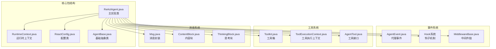
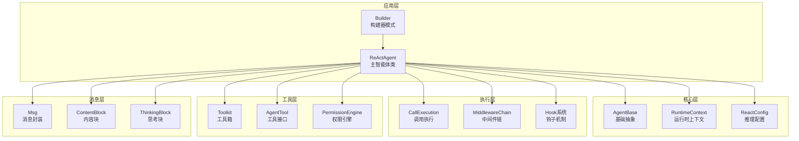
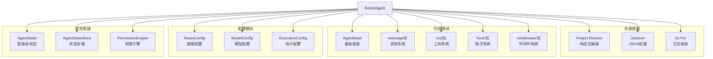

# ReAct代理API

<cite>
**本文档引用的文件**
- [ReActAgent.java](file://agentscope-core/src/main/java/io/agentscope/core/ReActAgent.java)
- [RuntimeContext.java](file://agentscope-core/src/main/java/io/agentscope/core/agent/RuntimeContext.java)
- [ReactConfig.java](file://agentscope-core/src/main/java/io/agentscope/core/agent/config/ReactConfig.java)
- [AgentBase.java](file://agentscope-core/src/main/java/io/agentscope/core/agent/AgentBase.java)
- [ReActAgentTest.java](file://agentscope-core/src/test/java/io/agentscope/core/agent/ReActAgentTest.java)
- [ReActAgentRuntimeContextTest.java](file://agentscope-core/src/test/java/io/agentscope/core/agent/ReActAgentRuntimeContextTest.java)
</cite>

## 目录
1. [简介](#简介)
2. [项目结构](#项目结构)
3. [核心组件](#核心组件)
4. [架构概览](#架构概览)
5. [详细组件分析](#详细组件分析)
6. [依赖关系分析](#依赖关系分析)
7. [性能考虑](#性能考虑)
8. [故障排除指南](#故障排除指南)
9. [结论](#结论)
10. [附录](#附录)

## 简介

ReActAgent是AgentScope框架中的核心智能体实现，基于ReAct（推理-行动）模式设计。该模式将推理（思考和规划）与行动（工具执行）结合在一个迭代循环中，智能体在完成任务或达到最大迭代限制前交替进行这两个阶段。

ReActAgent提供了以下关键特性：
- **响应式流式处理**：使用Project Reactor实现非阻塞执行
- **可扩展钩子系统**：支持监控和拦截智能体执行
- **人工在环支持**：通过HITL（Human-in-the-loop）机制支持用户确认
- **结构化输出**：每调用提供类型安全的输出
- **会话状态管理**：支持多用户、多会话的状态持久化

## 项目结构

ReActAgent位于agentscope-core模块的核心包中，采用清晰的分层架构：



**图表来源**
- [ReActAgent.java:1-200](file://agentscope-core/src/main/java/io/agentscope/core/ReActAgent.java#L1-L200)
- [RuntimeContext.java:1-100](file://agentscope-core/src/main/java/io/agentscope/core/agent/RuntimeContext.java#L1-L100)
- [ReactConfig.java:1-56](file://agentscope-core/src/main/java/io/agentscope/core/agent/config/ReactConfig.java#L1-L56)

**章节来源**
- [ReActAgent.java:148-198](file://agentscope-core/src/main/java/io/agentscope/core/ReActAgent.java#L148-L198)
- [AgentBase.java:47-90](file://agentscope-core/src/main/java/io/agentscope/core/agent/AgentBase.java#L47-L90)

## 核心组件

### ReActAgent 主要组件

ReActAgent作为核心智能体类，继承自AgentBase并实现了完整的ReAct推理-行动循环：

#### 核心依赖注入
- **系统提示词**：定义智能体的行为准则
- **语言模型**：负责推理和对话生成
- **工具箱**：包含可用的工具集合
- **中间件链**：提供执行拦截和扩展点
- **权限引擎**：管理工具调用权限

#### 状态管理
- **会话槽位**：基于(userId, sessionId)的并发安全状态管理
- **AgentState**：维护对话历史和工具状态
- **权限缓存**：每个会话独立的权限规则存储

#### 流式处理
- **事件流**：提供细粒度的执行事件流
- **响应式订阅**：支持背压和异步处理
- **中断机制**：支持会话级别的中断控制

**章节来源**
- [ReActAgent.java:218-330](file://agentscope-core/src/main/java/io/agentscope/core/ReActAgent.java#L218-L330)
- [ReActAgent.java:437-478](file://agentscope-core/src/main/java/io/agentscope/core/ReActAgent.java#L437-L478)

### ReactConfig 配置类

ReactConfig是ReAct推理循环的配置类，提供推理-行动循环的关键参数：

#### 核心配置参数
- **maxIters**：单次回复中推理→行动迭代的最大次数
- **stopOnReject**：工具调用权限拒绝时是否终止循环

#### 默认值
- 默认最大迭代次数：20次
- 默认拒绝停止行为：false（继续循环）

#### 配置验证
- maxIters必须大于0
- 提供JSON反序列化支持

**章节来源**
- [ReactConfig.java:22-56](file://agentscope-core/src/main/java/io/agentscope/core/agent/config/ReactConfig.java#L22-L56)

### RuntimeContext 运行时上下文

RuntimeContext提供每次调用的元数据容器，支持并发安全的状态管理：

#### 上下文属性
- **sessionId**：会话标识符，用于状态隔离
- **userId**：用户标识符，支持多租户场景
- **agentState**：调用范围内的AgentState实例
- **工具执行上下文**：传递给工具的运行时数据

#### 类型化存储
- 支持字符串键和类型化键的混合存储
- 提供线程安全的并发访问
- 支持默认键和命名空间键

#### 工具集成
- 自动转换为ToolExecutionContext
- 支持运行时属性投影
- 提供类型安全的数据访问

**章节来源**
- [RuntimeContext.java:26-136](file://agentscope-core/src/main/java/io/agentscope/core/agent/RuntimeContext.java#L26-L136)
- [RuntimeContext.java:253-264](file://agentscope-core/src/main/java/io/agentscope/core/agent/RuntimeContext.java#L253-L264)

## 架构概览

ReActAgent采用分层架构设计，确保高内聚低耦合：



**图表来源**
- [ReActAgent.java:1335-1392](file://agentscope-core/src/main/java/io/agentscope/core/ReActAgent.java#L1335-L1392)
- [AgentBase.java:92-158](file://agentscope-core/src/main/java/io/agentscope/core/agent/AgentBase.java#L92-L158)

### 推理-行动循环流程

ReActAgent的核心是推理-行动循环，以下是详细的执行流程：

```mermaid
sequenceDiagram
participant Client as 客户端
participant Agent as ReActAgent
participant Loop as 推理-行动循环
participant Model as 语言模型
participant Tool as 工具执行
participant State as 状态管理
Client->>Agent : 调用智能体
Agent->>State : 激活会话槽位
Agent->>Loop : 开始推理阶段
Loop->>Model : 生成思考内容
Model-->>Loop : 返回思考结果
Loop->>Loop : 分析是否需要行动
alt 需要工具调用
Loop->>Tool : 执行工具
Tool-->>Loop : 返回工具结果
Loop->>State : 更新状态
Loop->>Loop : 继续推理
else 无需工具调用
Loop->>State : 更新最终状态
Loop-->>Agent : 返回最终响应
end
Agent-->>Client : 返回响应
```

**图表来源**
- [ReActAgent.java:1408-1495](file://agentscope-core/src/main/java/io/agentscope/core/ReActAgent.java#L1408-L1495)
- [ReActAgent.java:924-949](file://agentscope-core/src/main/java/io/agentscope/core/ReActAgent.java#L924-L949)

## 详细组件分析

### ReActAgent 类结构

ReActAgent是一个复杂的多层架构实现，包含以下主要组件：

#### 内部类设计
- **CallExecution**：每调用的执行上下文，包含完整的推理-行动循环逻辑
- **Builder**：构建器模式实现，支持丰富的配置选项
- **SlotRef**：会话槽位引用，用于状态管理和并发控制

#### 关键字段
- **核心依赖**：模型、工具箱、中间件链
- **配置管理**：ReactConfig、ModelConfig
- **状态缓存**：会话级别的AgentState和权限引擎缓存
- **事件系统**：FluxSink事件流和外部事件发射器

**章节来源**
- [ReActAgent.java:1335-1392](file://agentscope-core/src/main/java/io/agentscope/core/ReActAgent.java#L1335-L1392)
- [ReActAgent.java:3486-4285](file://agentscope-core/src/main/java/io/agentscope/core/ReActAgent.java#L3486-L4285)

### Builder 构建器模式

Builder模式提供了灵活的ReActAgent配置能力：

#### 基础配置
- **name/description**：智能体名称和描述
- **sysPrompt**：系统提示词
- **model/toolkit**：核心依赖注入
- **maxIters**：最大迭代次数

#### 高级配置
- **executionConfig**：模型和工具的执行配置
- **generateOptions**：生成参数配置
- **hooks/middlewares**：扩展机制
- **stateStore**：状态持久化配置

#### 兼容性配置
- **fallbackModel**：降级模型支持
- **permissionContext**：权限控制配置
- **skillRepositories**：技能仓库配置

**章节来源**
- [ReActAgent.java:3487-4285](file://agentscope-core/src/main/java/io/agentscope/core/ReActAgent.java#L3487-L4285)

### 推理-行动循环实现

推理-行动循环是ReActAgent的核心逻辑，包含以下关键步骤：

#### 循环控制
- **迭代计数**：跟踪当前迭代次数
- **中断检查**：定期检查中断信号
- **状态恢复**：支持从挂起状态恢复

#### 权限管理
- **权限引擎**：动态权限决策
- **人工在环**：用户确认机制
- **权限缓存**：会话级别的权限状态

#### 工具调用
- **工具发现**：自动识别需要的工具
- **参数验证**：输入参数验证
- **结果处理**：工具结果的处理和存储

**章节来源**
- [ReActAgent.java:1408-1595](file://agentscope-core/src/main/java/io/agentscope/core/ReActAgent.java#L1408-L1595)

### 结构化输出机制

ReActAgent支持两种结构化输出路径：

#### 原生结构化输出
- **模型原生支持**：直接利用模型的response_format
- **JSON Schema**：自动模式生成和验证
- **无工具开销**：直接返回结构化结果

#### 回退结构化输出
- **合成工具**：生成generate_response工具
- **指令提示**：向模型注入结构化输出指令
- **自然停止**：通过PostActingEvent.stopAgent()自然终止

**章节来源**
- [ReActAgent.java:951-1078](file://agentscope-core/src/main/java/io/agentscope/core/ReActAgent.java#L951-L1078)

## 依赖关系分析

ReActAgent的依赖关系体现了清晰的关注点分离：



**图表来源**
- [ReActAgent.java:18-146](file://agentscope-core/src/main/java/io/agentscope/core/ReActAgent.java#L18-L146)
- [AgentBase.java:18-45](file://agentscope-core/src/main/java/io/agentscope/core/agent/AgentBase.java#L18-L45)

### 组件耦合度分析

ReActAgent展现了良好的内聚性和低耦合性：

#### 高内聚区域
- **推理循环**：集中在CallExecution内部
- **状态管理**：集中在激活槽位逻辑
- **事件处理**：集中在生命周期管理

#### 低耦合设计
- **接口隔离**：通过抽象接口解耦具体实现
- **依赖注入**：通过构造函数注入依赖
- **事件驱动**：通过事件系统解耦组件交互

**章节来源**
- [ReActAgent.java:437-536](file://agentscope-core/src/main/java/io/agentscope/core/ReActAgent.java#L437-L536)
- [AgentBase.java:252-322](file://agentscope-core/src/main/java/io/agentscope/core/agent/AgentBase.java#L252-L322)

## 性能考虑

ReActAgent在设计时充分考虑了性能优化：

### 并发性能
- **会话隔离**：每个(userId, sessionId)槽位独立状态，避免锁竞争
- **响应式执行**：使用Project Reactor实现非阻塞I/O
- **内存管理**：合理的对象池和缓存策略

### 资源管理
- **连接复用**：模型和工具的连接池管理
- **内存优化**：及时清理临时对象和缓存
- **垃圾回收友好**：避免长生命周期对象持有短期数据

### 扩展性设计
- **插件架构**：通过Hook和Middleware实现功能扩展
- **配置驱动**：通过配置类实现行为定制
- **接口抽象**：通过接口实现替换和扩展

## 故障排除指南

### 常见问题及解决方案

#### 会话状态异常
**问题**：多用户并发访问导致状态混乱
**解决方案**：使用RuntimeContext明确指定userId和sessionId

#### 权限拒绝错误
**问题**：工具调用被权限引擎拒绝
**解决方案**：检查PermissionContextState配置和用户权限

#### 内存泄漏
**问题**：长时间运行后内存占用持续增长
**解决方案**：定期清理AgentState缓存和权限引擎缓存

#### 性能问题
**问题**：推理-行动循环响应缓慢
**解决方案**：优化工具执行配置和模型参数

**章节来源**
- [ReActAgent.java:652-722](file://agentscope-core/src/main/java/io/agentscope/core/ReActAgent.java#L652-L722)
- [RuntimeContext.java:121-127](file://agentscope-core/src/main/java/io/agentscope/core/agent/RuntimeContext.java#L121-L127)

### 调试技巧

#### 事件流调试
使用streamEvents API观察详细的执行事件流，便于定位问题

#### 状态检查
通过getAgentState()方法检查会话状态，验证推理-行动循环的正确性

#### 日志配置
合理配置SLF4J日志级别，获取足够的调试信息

## 结论

ReActAgent作为AgentScope框架的核心组件，展现了现代智能体系统的最佳实践：

### 设计优势
- **架构清晰**：分层设计确保了良好的可维护性
- **功能完整**：涵盖了智能体所需的核心功能
- **扩展性强**：通过Hook和Middleware提供了丰富的扩展点
- **性能优秀**：响应式编程和并发优化保证了高性能

### 技术特色
- **ReAct模式**：将推理和行动有机结合
- **会话管理**：支持多用户、多会话的并发场景
- **权限控制**：内置的权限管理系统
- **结构化输出**：提供类型安全的输出机制

### 应用价值
ReActAgent为构建复杂的AI应用场景提供了坚实的基础，无论是简单的问答助手还是复杂的多工具协作系统，都能找到合适的使用模式。

## 附录

### API 使用示例

#### 基本使用模式
```java
// 创建模型和工具箱
Model model = ModelRegistry.resolve("openai:gpt-4");
Toolkit toolkit = new Toolkit();
toolkit.registerObject(new WeatherTool());

// 构建ReActAgent
ReActAgent agent = ReActAgent.builder()
    .name("WeatherAssistant")
    .sysPrompt("你是一个专业的天气查询助手")
    .model(model)
    .toolkit(toolkit)
    .maxIters(10)
    .build();

// 发送消息
Msg response = agent.call(Msg.builder()
    .role(MsgRole.USER)
    .content("今天北京天气如何？")
    .build()).block();
```

#### 流式处理示例
```java
// 获取事件流
Flux<AgentEvent> eventStream = agent.streamEvents(List.of(userMsg));

eventStream.subscribe(event -> {
    if (event instanceof ThinkingBlockDeltaEvent) {
        // 处理思考块增量
    } else if (event instanceof ToolCallStartEvent) {
        // 处理工具调用开始
    } else if (event instanceof ToolResultDataDeltaEvent) {
        // 处理工具结果增量
    }
});
```

#### 中断控制示例
```java
// 创建RuntimeContext
RuntimeContext ctx = RuntimeContext.builder()
    .userId("user123")
    .sessionId("session456")
    .build();

// 触发中断
agent.interrupt(ctx, Msg.builder()
    .role(MsgRole.USER)
    .content("取消当前操作")
    .build());
```

**章节来源**
- [ReActAgentTest.java:84-139](file://agentscope-core/src/test/java/io/agentscope/core/agent/ReActAgentTest.java#L84-L139)
- [ReActAgentRuntimeContextTest.java:120-146](file://agentscope-core/src/test/java/io/agentscope/core/agent/ReActAgentRuntimeContextTest.java#L120-L146)

### 配置选项参考

#### ReActAgent.Builder 配置项
- **name/description**：智能体基本信息
- **sysPrompt**：系统提示词
- **model**：语言模型配置
- **toolkit**：工具箱配置
- **maxIters**：最大迭代次数
- **generateOptions**：生成参数
- **hooks/middlewares**：扩展机制
- **stateStore**：状态持久化
- **permissionContext**：权限控制

#### ReactConfig 配置项
- **maxIters**：推理-行动迭代次数
- **stopOnReject**：权限拒绝处理策略

#### RuntimeContext 配置项
- **sessionId**：会话标识符
- **userId**：用户标识符
- **agentState**：会话状态
- **toolExecutionContext**：工具执行上下文