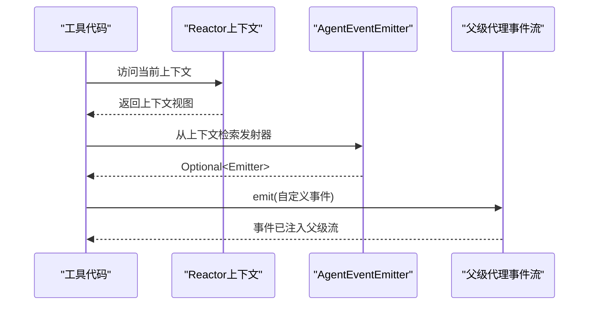
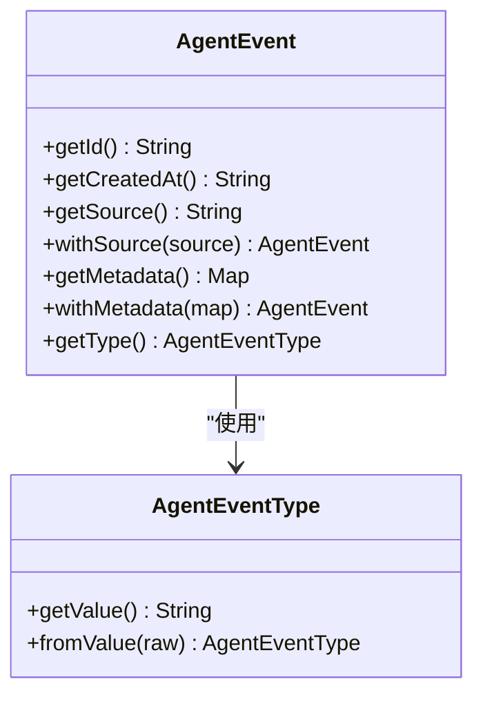
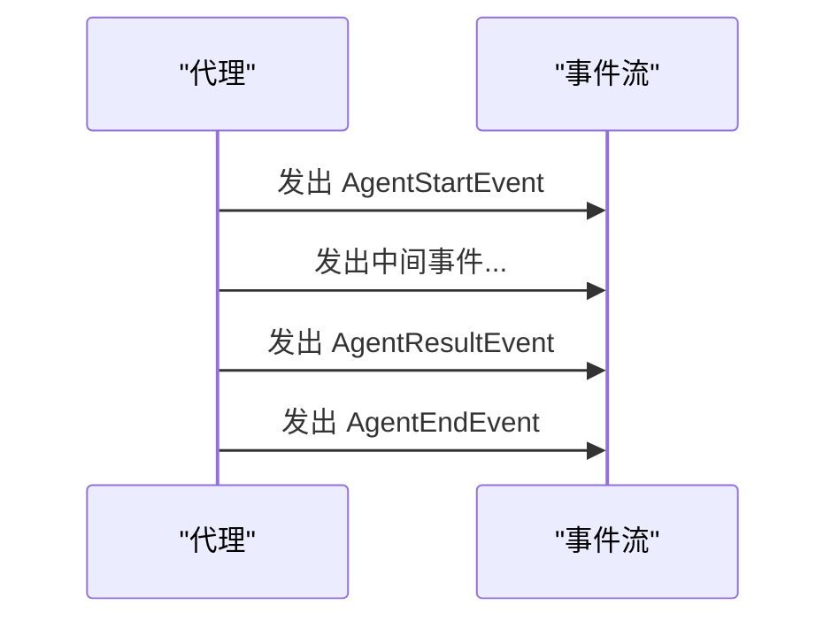
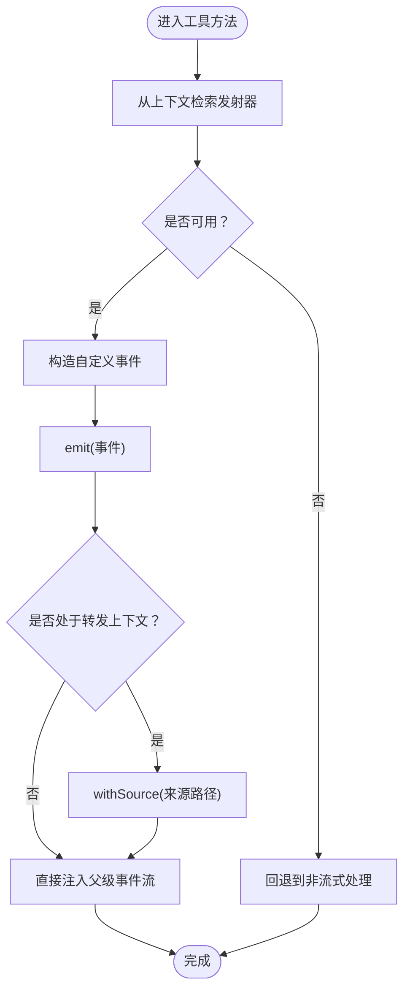
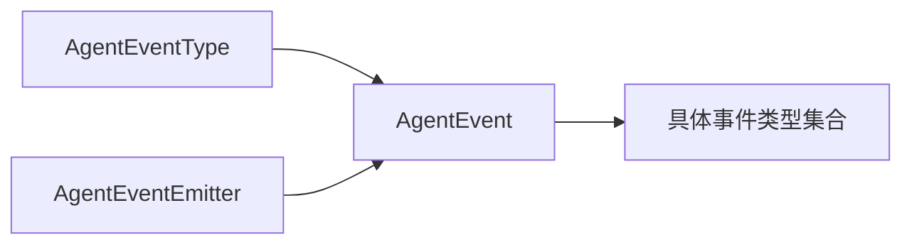

# 事件接口

<cite>
**本文引用的文件**
- [AgentEvent.java](file://agentscope-core/src/main/java/io/agentscope/core/event/AgentEvent.java)
- [AgentEventType.java](file://agentscope-core/src/main/java/io/agentscope/core/event/AgentEventType.java)
- [AgentEventEmitter.java](file://agentscope-core/src/main/java/io/agentscope/core/event/AgentEventEmitter.java)
- [AgentStartEvent.java](file://agentscope-core/src/main/java/io/agentscope/core/event/AgentStartEvent.java)
- [AgentEndEvent.java](file://agentscope-core/src/main/java/io/agentscope/core/event/AgentEndEvent.java)
- [AgentResultEvent.java](file://agentscope-core/src/main/java/io/agentscope/core/event/AgentResultEvent.java)
- [TextBlockStartEvent.java](file://agentscope-core/src/main/java/io/agentscope/core/event/TextBlockStartEvent.java)
- [ThinkingBlockStartEvent.java](file://agentscope-core/src/main/java/io/agentscope/core/event/ThinkingBlockStartEvent.java)
- [DataBlockStartEvent.java](file://agentscope-core/src/main/java/io/agentscope/core/event/DataBlockStartEvent.java)
- [ToolCallStartEvent.java](file://agentscope-core/src/main/java/io/agentscope/core/event/ToolCallStartEvent.java)
- [CustomEvent.java](file://agentscope-core/src/main/java/io/agentscope/core/event/CustomEvent.java)
- [SubagentExposedEvent.java](file://agentscope-core/src/main/java/io/agentscope/core/event/SubagentExposedEvent.java)
- [RequireUserConfirmEvent.java](file://agentscope-core/src/main/java/io/agentscope/core/event/RequireUserConfirmEvent.java)
- [UserConfirmResultEvent.java](file://agentscope-core/src/main/java/io/agentscope/core/event/UserConfirmResultEvent.java)
- [RequireExternalExecutionEvent.java](file://agentscope-core/src/main/java/io/agentscope/core/event/RequireExternalExecutionEvent.java)
- [ExternalExecutionResultEvent.java](file://agentscope-core/src/main/java/io/agentscope/core/event/ExternalExecutionResultEvent.java)
- [RequestStopEvent.java](file://agentscope-core/src/main/java/io/agentscope/core/event/RequestStopEvent.java)
- [ExceedMaxItersEvent.java](file://agentscope-core/src/main/java/io/agentscope/core/event/ExceedMaxItersEvent.java)
- [HintBlockEvent.java](file://agentscope-core/src/main/java/io/agentscope/core/event/HintBlockEvent.java)
- [TextBlockDeltaEvent.java](file://agentscope-core/src/main/java/io/agentscope/core/event/TextBlockDeltaEvent.java)
- [TextBlockEndEvent.java](file://agentscope-core/src/main/java/io/agentscope/core/event/TextBlockEndEvent.java)
- [ThinkingBlockDeltaEvent.java](file://agentscope-core/src/main/java/io/agentscope/core/event/ThinkingBlockDeltaEvent.java)
- [ThinkingBlockEndEvent.java](file://agentscope-core/src/main/java/io/agentscope/core/event/ThinkingBlockEndEvent.java)
- [DataBlockDeltaEvent.java](file://agentscope-core/src/main/java/io/agentscope/core/event/DataBlockDeltaEvent.java)
- [DataBlockEndEvent.java](file://agentscope-core/src/main/java/io/agentscope/core/event/DataBlockEndEvent.java)
- [ToolCallDeltaEvent.java](file://agentscope-core/src/main/java/io/agentscope/core/event/ToolCallDeltaEvent.java)
- [ToolCallEndEvent.java](file://agentscope-core/src/main/java/io/agentscope/core/event/ToolCallEndEvent.java)
- [ToolResultStartEvent.java](file://agentscope-core/src/main/java/io/agentscope/core/event/ToolResultStartEvent.java)
- [ToolResultTextDeltaEvent.java](file://agentscope-core/src/main/java/io/agentscope/core/event/ToolResultTextDeltaEvent.java)
- [ToolResultDataDeltaEvent.java](file://agentscope-core/src/main/java/io/agentscope/core/event/ToolResultDataDeltaEvent.java)
- [ToolResultEndEvent.java](file://agentscope-core/src/main/java/io/agentscope/core/event/ToolResultEndEvent.java)
- [ModelCallStartEvent.java](file://agentscope-core/src/main/java/io/agentscope/core/event/ModelCallStartEvent.java)
- [ModelCallEndEvent.java](file://agentscope-core/src/main/java/io/agentscope/core/event/ModelCallEndEvent.java)
</cite>

## 目录
1. [简介](#简介)
2. [项目结构](#项目结构)
3. [核心组件](#核心组件)
4. [架构总览](#架构总览)
5. [详细组件分析](#详细组件分析)
6. [依赖分析](#依赖分析)
7. [性能考虑](#性能考虑)
8. [故障排查指南](#故障排查指南)
9. [结论](#结论)
10. [附录](#附录)

## 简介
本文件为 AgentScope 事件系统提供完整的 API 文档，聚焦于 AgentEvent 及其各类子类型的定义、事件类型枚举、事件发射器与事件监听机制。文档解释事件在代理执行过程中的作用，梳理不同事件类型所代表的执行阶段，并给出事件订阅、过滤与自定义事件处理的实践建议。同时覆盖事件系统的扩展性与性能考量，帮助开发者在复杂多智能体场景中高效构建可观测、可追踪、可扩展的事件驱动体系。

## 项目结构
事件系统位于 agentscope-core 模块的 event 包内，采用“抽象基类 + 枚举类型 + 多种具体事件类型”的分层设计。核心文件包括：
- 抽象事件基类：承载通用标识、时间戳、来源路径与元数据能力
- 事件类型枚举：统一管理事件类型名称与兼容的旧版别名
- 具体事件类型：覆盖代理生命周期、模型调用、文本/思考/数据块流式传输、工具调用与结果、用户确认与外部执行、停止请求、迭代超限、提示块以及自定义事件等
- 事件发射器：在响应式上下文中注入，允许工具代码向父级事件流注入事件

```mermaid
graph TB
AE["AgentEvent<br/>抽象基类"] --> AET["AgentEventType<br/>事件类型枚举"]
AE --> ASE["AgentStartEvent"]
AE --> AEE["AgentEndEvent"]
AE --> ARE["AgentResultEvent"]
AE --> TBS["TextBlockStartEvent"]
AE --> TBE["TextBlockEndEvent"]
AE --> TBD["TextBlockDeltaEvent"]
AE --> THS["ThinkingBlockStartEvent"]
AE --> THE["ThinkingBlockEndEvent"]
AE --> THD["ThinkingBlockDeltaEvent"]
AE --> DBS["DataBlockStartEvent"]
AE --> DBE["DataBlockEndEvent"]
AE --> DBD["DataBlockDeltaEvent"]
AE --> TCS["ToolCallStartEvent"]
AE --> TCE["ToolCallEndEvent"]
AE --> TCD["ToolCallDeltaEvent"]
AE --> TRS["ToolResultStartEvent"]
AE --> TRT["ToolResultTextDeltaEvent"]
AE --> TRD["ToolResultDataDeltaEvent"]
AE --> TRE["ToolResultEndEvent"]
AE --> MCS["ModelCallStartEvent"]
AE --> MCE["ModelCallEndEvent"]
AE --> CUS["CustomEvent"]
AE --> SUB["SubagentExposedEvent"]
AE --> RUC["RequireUserConfirmEvent"]
AE --> UCR["UserConfirmResultEvent"]
AE --> REE["RequireExternalExecutionEvent"]
AE --> EER["ExternalExecutionResultEvent"]
AE --> RS["RequestStopEvent"]
AE --> EMI["ExceedMaxItersEvent"]
AE --> HBE["HintBlockEvent"]
```

图表来源
- [AgentEvent.java:72-138](file://agentscope-core/src/main/java/io/agentscope/core/event/AgentEvent.java#L72-L138)
- [AgentEventType.java:40-89](file://agentscope-core/src/main/java/io/agentscope/core/event/AgentEventType.java#L40-L89)
- [AgentStartEvent.java:24-73](file://agentscope-core/src/main/java/io/agentscope/core/event/AgentStartEvent.java#L24-L73)
- [AgentEndEvent.java:24-49](file://agentscope-core/src/main/java/io/agentscope/core/event/AgentEndEvent.java#L24-L49)
- [AgentResultEvent.java:35-60](file://agentscope-core/src/main/java/io/agentscope/core/event/AgentResultEvent.java#L35-L60)
- [TextBlockStartEvent.java:21-54](file://agentscope-core/src/main/java/io/agentscope/core/event/TextBlockStartEvent.java#L21-L54)
- [TextBlockEndEvent.java](file://agentscope-core/src/main/java/io/agentscope/core/event/TextBlockEndEvent.java)
- [TextBlockDeltaEvent.java](file://agentscope-core/src/main/java/io/agentscope/core/event/TextBlockDeltaEvent.java)
- [ThinkingBlockStartEvent.java:21-54](file://agentscope-core/src/main/java/io/agentscope/core/event/ThinkingBlockStartEvent.java#L21-L54)
- [ThinkingBlockEndEvent.java](file://agentscope-core/src/main/java/io/agentscope/core/event/ThinkingBlockEndEvent.java)
- [ThinkingBlockDeltaEvent.java](file://agentscope-core/src/main/java/io/agentscope/core/event/ThinkingBlockDeltaEvent.java)
- [DataBlockStartEvent.java:21-54](file://agentscope-core/src/main/java/io/agentscope/core/event/DataBlockStartEvent.java#L21-L54)
- [DataBlockEndEvent.java](file://agentscope-core/src/main/java/io/agentscope/core/event/DataBlockEndEvent.java)
- [DataBlockDeltaEvent.java](file://agentscope-core/src/main/java/io/agentscope/core/event/DataBlockDeltaEvent.java)
- [ToolCallStartEvent.java:21-62](file://agentscope-core/src/main/java/io/agentscope/core/event/ToolCallStartEvent.java#L21-L62)
- [ToolCallEndEvent.java](file://agentscope-core/src/main/java/io/agentscope/core/event/ToolCallEndEvent.java)
- [ToolCallDeltaEvent.java](file://agentscope-core/src/main/java/io/agentscope/core/event/ToolCallDeltaEvent.java)
- [ToolResultStartEvent.java](file://agentscope-core/src/main/java/io/agentscope/core/event/ToolResultStartEvent.java)
- [ToolResultTextDeltaEvent.java](file://agentscope-core/src/main/java/io/agentscope/core/event/ToolResultTextDeltaEvent.java)
- [ToolResultDataDeltaEvent.java](file://agentscope-core/src/main/java/io/agentscope/core/event/ToolResultDataDeltaEvent.java)
- [ToolResultEndEvent.java](file://agentscope-core/src/main/java/io/agentscope/core/event/ToolResultEndEvent.java)
- [ModelCallStartEvent.java](file://agentscope-core/src/main/java/io/agentscope/core/event/ModelCallStartEvent.java)
- [ModelCallEndEvent.java](file://agentscope-core/src/main/java/io/agentscope/core/event/ModelCallEndEvent.java)
- [CustomEvent.java](file://agentscope-core/src/main/java/io/agentscope/core/event/CustomEvent.java)
- [SubagentExposedEvent.java](file://agentscope-core/src/main/java/io/agentscope/core/event/SubagentExposedEvent.java)
- [RequireUserConfirmEvent.java](file://agentscope-core/src/main/java/io/agentscope/core/event/RequireUserConfirmEvent.java)
- [UserConfirmResultEvent.java](file://agentscope-core/src/main/java/io/agentscope/core/event/UserConfirmResultEvent.java)
- [RequireExternalExecutionEvent.java](file://agentscope-core/src/main/java/io/agentscope/core/event/RequireExternalExecutionEvent.java)
- [ExternalExecutionResultEvent.java](file://agentscope-core/src/main/java/io/agentscope/core/event/ExternalExecutionResultEvent.java)
- [RequestStopEvent.java](file://agentscope-core/src/main/java/io/agentscope/core/event/RequestStopEvent.java)
- [ExceedMaxItersEvent.java](file://agentscope-core/src/main/java/io/agentscope/core/event/ExceedMaxItersEvent.java)
- [HintBlockEvent.java](file://agentscope-core/src/main/java/io/agentscope/core/event/HintBlockEvent.java)

章节来源
- [AgentEvent.java:27-138](file://agentscope-core/src/main/java/io/agentscope/core/event/AgentEvent.java#L27-L138)
- [AgentEventType.java:22-136](file://agentscope-core/src/main/java/io/agentscope/core/event/AgentEventType.java#L22-L136)

## 核心组件
- 抽象事件基类（AgentEvent）
  - 职责：统一事件标识、创建时间、来源路径与元数据；通过 JSON 多态序列化支持所有子类型
  - 关键字段与方法：唯一 ID、创建时间、来源 source、元数据 metadata、withSource/withMetadata 链式设置、getType 抽象方法
  - 用途：作为所有细粒度代理事件的基类，保证跨子系统的统一序列化与反序列化行为
- 事件类型枚举（AgentEventType）
  - 职责：集中管理事件类型名称与兼容的旧版别名；提供从字符串到枚举值的解析逻辑
  - 关键点：支持多种历史别名映射，序列化始终输出规范名称
- 事件发射器（AgentEventEmitter）
  - 职责：在响应式上下文中注入，允许工具代码向父级事件流注入事件；支持转发上下文以标注子代理事件来源
  - 关键点：提供从 Reactor Context 中安全检索的方法；在非流式调用时返回空包装，避免运行时异常

章节来源
- [AgentEvent.java:72-138](file://agentscope-core/src/main/java/io/agentscope/core/event/AgentEvent.java#L72-L138)
- [AgentEventType.java:40-136](file://agentscope-core/src/main/java/io/agentscope/core/event/AgentEventType.java#L40-L136)
- [AgentEventEmitter.java:38-97](file://agentscope-core/src/main/java/io/agentscope/core/event/AgentEventEmitter.java#L38-L97)

## 架构总览
事件系统围绕“事件类型 + 事件对象 + 发射器 + 监听消费”展开。代理在执行过程中发出细粒度事件，这些事件通过响应式流对外广播，消费者可订阅、过滤与处理。工具代码可在运行时通过上下文获取发射器，向父级事件流注入自定义事件或转发子代理事件。

图表来源
- [AgentEventEmitter.java:77-96](file://agentscope-core/src/main/java/io/agentscope/core/event/AgentEventEmitter.java#L77-L96)

## 详细组件分析

### 抽象事件与类型系统
- 抽象事件基类（AgentEvent）
  - 统一标识与时间：每个事件携带唯一 ID 与创建时间，便于去重与排序
  - 来源路径与元数据：支持为事件附加来源路径（用于子代理事件溯源）与任意键值对元数据
  - 多态序列化：通过 Jackson 注解声明子类型，实现统一的 JSON 序列化与反序列化
- 事件类型枚举（AgentEventType）
  - 规范名称与历史别名：涵盖代理生命周期、模型调用、文本/思考/数据块、工具调用/结果、用户交互、外部执行、停止请求、迭代超限、提示块与自定义事件等
  - 解析策略：优先匹配规范名称，其次尝试历史别名映射，最后抛出非法参数异常

图表来源
- [AgentEvent.java:72-138](file://agentscope-core/src/main/java/io/agentscope/core/event/AgentEvent.java#L72-L138)
- [AgentEventType.java:40-136](file://agentscope-core/src/main/java/io/agentscope/core/event/AgentEventType.java#L40-L136)

章节来源
- [AgentEvent.java:72-138](file://agentscope-core/src/main/java/io/agentscope/core/event/AgentEvent.java#L72-L138)
- [AgentEventType.java:40-136](file://agentscope-core/src/main/java/io/agentscope/core/event/AgentEventType.java#L40-L136)

### 代理生命周期事件
- 启动事件（AgentStartEvent）
  - 表示代理开始处理一次调用，包含会话 ID、回复 ID、代理名称与角色
- 结束事件（AgentEndEvent）
  - 表示代理完成处理，包含回复 ID
- 结果事件（AgentResultEvent）
  - 表示代理成功结束并携带最终消息，可用于直接从事件流提取结果

图表来源
- [AgentStartEvent.java:24-73](file://agentscope-core/src/main/java/io/agentscope/core/event/AgentStartEvent.java#L24-L73)
- [AgentEndEvent.java:24-49](file://agentscope-core/src/main/java/io/agentscope/core/event/AgentEndEvent.java#L24-L49)
- [AgentResultEvent.java:35-60](file://agentscope-core/src/main/java/io/agentscope/core/event/AgentResultEvent.java#L35-L60)

章节来源
- [AgentStartEvent.java:24-73](file://agentscope-core/src/main/java/io/agentscope/core/event/AgentStartEvent.java#L24-L73)
- [AgentEndEvent.java:24-49](file://agentscope-core/src/main/java/io/agentscope/core/event/AgentEndEvent.java#L24-L49)
- [AgentResultEvent.java:35-60](file://agentscope-core/src/main/java/io/agentscope/core/event/AgentResultEvent.java#L35-L60)

### 模型调用事件
- 开始/结束事件（ModelCallStartEvent / ModelCallEndEvent）
  - 描述模型调用的生命周期，便于统计耗时、监控并发与追踪调用链

章节来源
- [ModelCallStartEvent.java](file://agentscope-core/src/main/java/io/agentscope/core/event/ModelCallStartEvent.java)
- [ModelCallEndEvent.java](file://agentscope-core/src/main/java/io/agentscope/core/event/ModelCallEndEvent.java)

### 内容块事件（文本/思考/数据）
- 文本块事件：开始/增量/结束（TextBlockStartEvent / TextBlockDeltaEvent / TextBlockEndEvent）
- 思考块事件：开始/增量/结束（ThinkingBlockStartEvent / ThinkingBlockDeltaEvent / ThinkingBlockEndEvent）
- 数据块事件：开始/增量/结束（DataBlockStartEvent / DataBlockDeltaEvent / DataBlockEndEvent）
- 用途：支持流式内容生成的实时观测与处理，适合长文本、多媒体数据与结构化输出

章节来源
- [TextBlockStartEvent.java:21-54](file://agentscope-core/src/main/java/io/agentscope/core/event/TextBlockStartEvent.java#L21-L54)
- [TextBlockDeltaEvent.java](file://agentscope-core/src/main/java/io/agentscope/core/event/TextBlockDeltaEvent.java)
- [TextBlockEndEvent.java](file://agentscope-core/src/main/java/io/agentscope/core/event/TextBlockEndEvent.java)
- [ThinkingBlockStartEvent.java:21-54](file://agentscope-core/src/main/java/io/agentscope/core/event/ThinkingBlockStartEvent.java#L21-L54)
- [ThinkingBlockDeltaEvent.java](file://agentscope-core/src/main/java/io/agentscope/core/event/ThinkingBlockDeltaEvent.java)
- [ThinkingBlockEndEvent.java](file://agentscope-core/src/main/java/io/agentscope/core/event/ThinkingBlockEndEvent.java)
- [DataBlockStartEvent.java:21-54](file://agentscope-core/src/main/java/io/agentscope/core/event/DataBlockStartEvent.java#L21-L54)
- [DataBlockDeltaEvent.java](file://agentscope-core/src/main/java/io/agentscope/core/event/DataBlockDeltaEvent.java)
- [DataBlockEndEvent.java](file://agentscope-core/src/main/java/io/agentscope/core/event/DataBlockEndEvent.java)

### 工具调用与结果事件
- 工具调用事件：开始/增量/结束（ToolCallStartEvent / ToolCallDeltaEvent / ToolCallEndEvent）
- 工具结果事件：开始/文本增量/数据增量/结束（ToolResultStartEvent / ToolResultTextDeltaEvent / ToolResultDataDeltaEvent / ToolResultEndEvent）
- 用途：追踪工具调用的生命周期与结果流，便于审计、可视化与错误定位

章节来源
- [ToolCallStartEvent.java:21-62](file://agentscope-core/src/main/java/io/agentscope/core/event/ToolCallStartEvent.java#L21-L62)
- [ToolCallDeltaEvent.java](file://agentscope-core/src/main/java/io/agentscope/core/event/ToolCallDeltaEvent.java)
- [ToolCallEndEvent.java](file://agentscope-core/src/main/java/io/agentscope/core/event/ToolCallEndEvent.java)
- [ToolResultStartEvent.java](file://agentscope-core/src/main/java/io/agentscope/core/event/ToolResultStartEvent.java)
- [ToolResultTextDeltaEvent.java](file://agentscope-core/src/main/java/io/agentscope/core/event/ToolResultTextDeltaEvent.java)
- [ToolResultDataDeltaEvent.java](file://agentscope-core/src/main/java/io/agentscope/core/event/ToolResultDataDeltaEvent.java)
- [ToolResultEndEvent.java](file://agentscope-core/src/main/java/io/agentscope/core/event/ToolResultEndEvent.java)

### 用户交互与外部执行事件
- 请求用户确认（RequireUserConfirmEvent）/ 用户确认结果（UserConfirmResultEvent）
- 请求外部执行（RequireExternalExecutionEvent）/ 外部执行结果（ExternalExecutionResultEvent）
- 用途：在需要人工干预或外部系统协作时，通过事件进行编排与追踪

章节来源
- [RequireUserConfirmEvent.java](file://agentscope-core/src/main/java/io/agentscope/core/event/RequireUserConfirmEvent.java)
- [UserConfirmResultEvent.java](file://agentscope-core/src/main/java/io/agentscope/core/event/UserConfirmResultEvent.java)
- [RequireExternalExecutionEvent.java](file://agentscope-core/src/main/java/io/agentscope/core/event/RequireExternalExecutionEvent.java)
- [ExternalExecutionResultEvent.java](file://agentscope-core/src/main/java/io/agentscope/core/event/ExternalExecutionResultEvent.java)

### 控制与状态事件
- 请求停止（RequestStopEvent）：用于主动中断代理执行
- 超过最大迭代（ExceedMaxItersEvent）：用于检测与报告循环/迭代上限
- 子代理暴露（SubagentExposedEvent）：用于标记子代理事件的暴露与转发
- 提示块（HintBlockEvent）：用于提示信息的事件化表达
- 自定义事件（CustomEvent）：用于业务自定义事件的扩展

章节来源
- [RequestStopEvent.java](file://agentscope-core/src/main/java/io/agentscope/core/event/RequestStopEvent.java)
- [ExceedMaxItersEvent.java](file://agentscope-core/src/main/java/io/agentscope/core/event/ExceedMaxItersEvent.java)
- [SubagentExposedEvent.java](file://agentscope-core/src/main/java/io/agentscope/core/event/SubagentExposedEvent.java)
- [HintBlockEvent.java](file://agentscope-core/src/main/java/io/agentscope/core/event/HintBlockEvent.java)
- [CustomEvent.java](file://agentscope-core/src/main/java/io/agentscope/core/event/CustomEvent.java)

### 事件发射器与监听机制
- 发射器接口（AgentEventEmitter）
  - 上下文键：常规发射器键与转发发射器键，分别用于父级工具注入自定义事件与子代理内部事件的来源标注
  - 安全检索：提供从 Reactor Context 获取发射器与转发发射器的静态方法，若不存在则返回空包装
  - 线程安全：emit 方法在底层线程安全 sink 上调用，可在任意线程调用
- 监听与订阅
  - 建议：在订阅事件流时，结合事件类型与元数据进行过滤；对流式事件（如文本/工具结果增量）进行聚合后再处理
  - 过滤策略：按类型过滤、按来源路径过滤、按元数据键值过滤

图表来源
- [AgentEventEmitter.java:77-96](file://agentscope-core/src/main/java/io/agentscope/core/event/AgentEventEmitter.java#L77-L96)

章节来源
- [AgentEventEmitter.java:38-97](file://agentscope-core/src/main/java/io/agentscope/core/event/AgentEventEmitter.java#L38-L97)

## 依赖分析
- 组件耦合
  - AgentEvent 与 AgentEventType 强耦合：前者通过注解绑定后者的所有枚举值，形成稳定的多态序列化契约
  - 具体事件类型均继承 AgentEvent，共享统一的标识、时间与元数据能力
- 外部依赖
  - Jackson 注解用于 JSON 多态与序列化控制
  - Reactor Context 用于在响应式管道中传递 AgentEventEmitter 实例
- 循环依赖
  - 未发现循环依赖：事件类型与发射器之间为单向依赖（事件使用类型，发射器不依赖事件）

图表来源
- [AgentEvent.java:35-71](file://agentscope-core/src/main/java/io/agentscope/core/event/AgentEvent.java#L35-L71)
- [AgentEventType.java:40-89](file://agentscope-core/src/main/java/io/agentscope/core/event/AgentEventType.java#L40-L89)
- [AgentEventEmitter.java:38-97](file://agentscope-core/src/main/java/io/agentscope/core/event/AgentEventEmitter.java#L38-L97)

章节来源
- [AgentEvent.java:35-71](file://agentscope-core/src/main/java/io/agentscope/core/event/AgentEvent.java#L35-L71)
- [AgentEventType.java:40-89](file://agentscope-core/src/main/java/io/agentscope/core/event/AgentEventType.java#L40-L89)
- [AgentEventEmitter.java:38-97](file://agentscope-core/src/main/java/io/agentscope/core/event/AgentEventEmitter.java#L38-L97)

## 性能考虑
- 流式事件的聚合与背压
  - 对高频增量事件（文本/工具结果）建议在订阅端进行聚合与节流，避免过多小事件导致的 UI 卡顿或网络压力
- 元数据与序列化开销
  - 元数据仅在必要时附加，避免冗余键值对；序列化时使用非空/非空集合策略减少体积
- 上下文检索成本
  - 发射器检索为常量时间操作；在热路径上避免重复检索，可缓存至局部变量
- 线程安全与并发
  - 发射器 emit 在线程安全 sink 上调用，可在任意线程触发；但建议在工具方法内部保持幂等与无副作用

## 故障排查指南
- 事件类型解析失败
  - 现象：反序列化时出现未知事件类型异常
  - 排查：检查事件类型字符串是否为规范名称或受支持的历史别名；确认客户端/服务端版本一致
- 事件丢失或顺序错乱
  - 现象：订阅端未收到预期事件或事件顺序异常
  - 排查：确认事件流是否正确连接；检查是否存在上游过滤器或转换器影响事件传播；验证来源路径与转发上下文配置
- 元数据缺失
  - 现象：事件缺少必要的元数据键值
  - 排查：确认事件构造时是否调用了 withMetadata；检查下游监听器是否正确读取元数据
- 工具注入无效
  - 现象：工具方法无法通过发射器注入事件
  - 排查：确认当前是否处于流式调用上下文；检查上下文键是否存在；在非流式调用中应回退到其他处理方式

章节来源
- [AgentEventType.java:112-135](file://agentscope-core/src/main/java/io/agentscope/core/event/AgentEventType.java#L112-L135)
- [AgentEventEmitter.java:77-96](file://agentscope-core/src/main/java/io/agentscope/core/event/AgentEventEmitter.java#L77-L96)

## 结论
AgentScope 事件系统通过统一的抽象基类、规范化的事件类型与灵活的发射器机制，实现了对代理执行过程的全面可观测与可扩展。开发者可基于该体系构建丰富的事件监听与处理逻辑，满足从调试追踪到业务编排的多样化需求。遵循本文档的订阅、过滤与扩展建议，可在保证性能的前提下获得稳定可靠的事件驱动体验。

## 附录
- 使用示例（步骤说明）
  - 订阅事件流：在代理的事件流上进行订阅，按需过滤事件类型与来源路径
  - 自定义事件：在工具方法中从上下文检索 AgentEventEmitter，构造自定义事件并通过 emit 注入
  - 过滤策略：结合事件类型、回复 ID、块 ID、工具调用 ID 与元数据键值进行组合过滤
- 扩展建议
  - 新增事件类型：在 AgentEventType 中添加新枚举值并在 AgentEvent 的多态注解中注册
  - 新增事件处理器：在监听端新增针对新事件类型的处理分支，或通过策略模式统一处理
  - 性能优化：对高频事件进行聚合与背压控制，合理使用元数据，避免不必要的序列化与传输