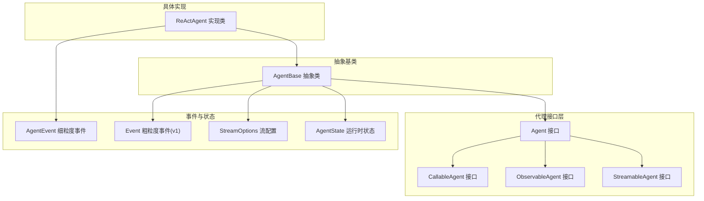
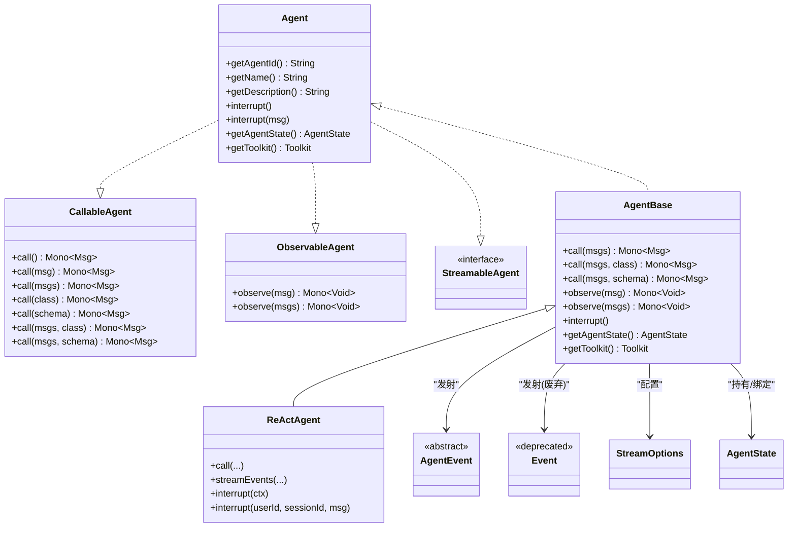
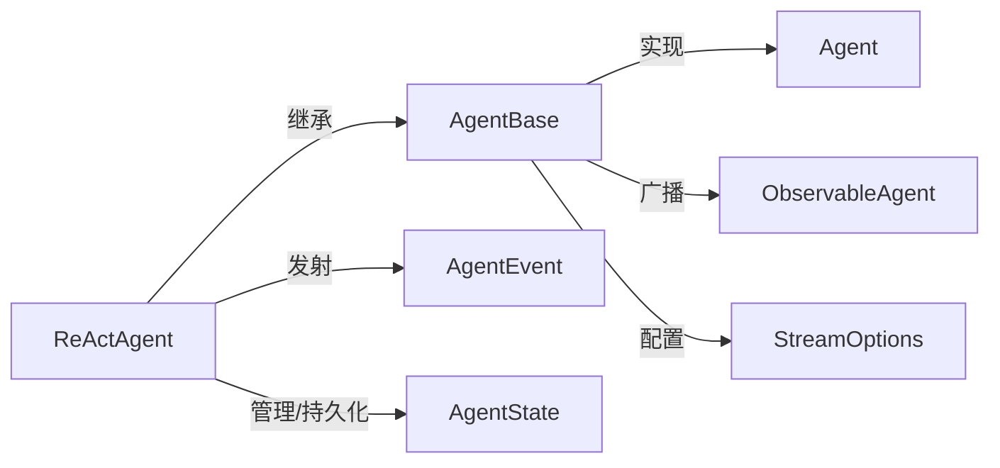

# 代理接口

<cite>
**本文引用的文件**
- [Agent.java](file://agentscope-core/src/main/java/io/agentscope/core/agent/Agent.java)
- [CallableAgent.java](file://agentscope-core/src/main/java/io/agentscope/core/agent/CallableAgent.java)
- [StreamableAgent.java](file://agentscope-core/src/main/java/io/agentscope/core/agent/StreamableAgent.java)
- [ObservableAgent.java](file://agentscope-core/src/main/java/io/agentscope/core/agent/ObservableAgent.java)
- [AgentBase.java](file://agentscope-core/src/main/java/io/agentscope/core/agent/AgentBase.java)
- [Event.java](file://agentscope-core/src/main/java/io/agentscope/core/agent/Event.java)
- [StreamOptions.java](file://agentscope-core/src/main/java/io/agentscope/core/agent/StreamOptions.java)
- [AgentEvent.java](file://agentscope-core/src/main/java/io/agentscope/core/event/AgentEvent.java)
- [AgentState.java](file://agentscope-core/src/main/java/io/agentscope/core/state/AgentState.java)
- [ReActAgent.java](file://agentscope-core/src/main/java/io/agentscope/core/ReActAgent.java)
- [HarnessAgentTest.java](file://agentscope-harness/src/test/java/io/agentscope/harness/agent/HarnessAgentTest.java)
</cite>

## 目录
1. [简介](#简介)
2. [项目结构](#项目结构)
3. [核心组件](#核心组件)
4. [架构总览](#架构总览)
5. [详细组件分析](#详细组件分析)
6. [依赖分析](#依赖分析)
7. [性能考虑](#性能考虑)
8. [故障排查指南](#故障排查指南)
9. [结论](#结论)
10. [附录](#附录)

## 简介
本文件面向 AgentScope 代理接口的使用者与扩展开发者，系统化梳理 Agent、CallableAgent、StreamableAgent、ObservableAgent 等核心接口的定义、职责边界、继承与组合关系，以及在框架中的生命周期管理、事件处理与状态管理机制。文档同时给出基于 ReActAgent 的实现示例路径与最佳实践，帮助读者快速理解并正确使用代理接口。

## 项目结构
AgentScope 的代理接口位于 agentscope-core 模块的 agent 包中，围绕“可调用”“可观测”“可流式”的能力进行分层设计，并通过抽象基类统一接入钩子、中断、订阅、状态与会话序列化等横切能力。ReActAgent 作为典型实现，展示了如何在 call() 与 streamEvents() 两条路径上共享同一核心执行链路，保证中间件与事件发射的一致性。

图表来源
- [Agent.java:47-114](file://agentscope-core/src/main/java/io/agentscope/core/agent/Agent.java#L47-L114)
- [CallableAgent.java:35-139](file://agentscope-core/src/main/java/io/agentscope/core/agent/CallableAgent.java#L35-L139)
- [ObservableAgent.java:36-53](file://agentscope-core/src/main/java/io/agentscope/core/agent/ObservableAgent.java#L36-L53)
- [StreamableAgent.java:44-193](file://agentscope-core/src/main/java/io/agentscope/core/agent/StreamableAgent.java#L44-L193)
- [AgentBase.java:92-1036](file://agentscope-core/src/main/java/io/agentscope/core/agent/AgentBase.java#L92-L1036)
- [AgentEvent.java:72-138](file://agentscope-core/src/main/java/io/agentscope/core/event/AgentEvent.java#L72-L138)
- [Event.java:60-219](file://agentscope-core/src/main/java/io/agentscope/core/agent/Event.java#L60-L219)
- [StreamOptions.java:62-370](file://agentscope-core/src/main/java/io/agentscope/core/agent/StreamOptions.java#L62-L370)
- [AgentState.java:59-423](file://agentscope-core/src/main/java/io/agentscope/core/state/AgentState.java#L59-L423)
- [ReActAgent.java:199-1599](file://agentscope-core/src/main/java/io/agentscope/core/ReActAgent.java#L199-L1599)

章节来源
- [Agent.java:47-114](file://agentscope-core/src/main/java/io/agentscope/core/agent/Agent.java#L47-L114)
- [AgentBase.java:92-1036](file://agentscope-core/src/main/java/io/agentscope/core/agent/AgentBase.java#L92-L1036)

## 核心组件
- Agent：完整代理接口，聚合 CallableAgent、StreamableAgent、ObservableAgent 的能力，提供统一标识、描述、中断与运行时状态/工具包访问入口。
- CallableAgent：定义消息处理与响应生成的调用能力，支持单条/多条消息输入，以及结构化输出（类或 JSON Schema）两种模式。
- ObservableAgent：定义“观察”能力，允许代理接收消息而不产生回复，常用于多智能体协作与共享上下文。
- StreamableAgent：定义流式事件发射能力（v1 粗粒度事件），已标记为废弃，推荐使用 ReActAgent 的 streamEvents() 提供的细粒度 AgentEvent 流。
- AgentBase：所有代理的抽象基类，统一接入钩子、订阅、中断、追踪、状态与会话序列化；提供 call() 生命周期封装与错误处理。
- ReActAgent：典型实现，展示如何在 call() 与 streamEvents() 共享同一核心执行链路，支持结构化输出、权限控制、工具执行、事件发射与状态持久化。
- AgentEvent/Event：事件体系，前者为 v2 细粒度事件，后者为 v1 粗粒度事件（已废弃但仍被旧模块消费）。
- StreamOptions：流式配置，控制事件类型过滤、增量/累积模式与各类子事件的包含策略。
- AgentState：代理运行时状态，承载会话上下文、摘要、迭代计数、权限/工具/任务/计划模式上下文与中断控制。

章节来源
- [CallableAgent.java:35-139](file://agentscope-core/src/main/java/io/agentscope/core/agent/CallableAgent.java#L35-L139)
- [ObservableAgent.java:36-53](file://agentscope-core/src/main/java/io/agentscope/core/agent/ObservableAgent.java#L36-L53)
- [StreamableAgent.java:44-193](file://agentscope-core/src/main/java/io/agentscope/core/agent/StreamableAgent.java#L44-193)
- [AgentBase.java:92-1036](file://agentscope-core/src/main/java/io/agentscope/core/agent/AgentBase.java#L92-L1036)
- [AgentEvent.java:72-138](file://agentscope-core/src/main/java/io/agentscope/core/event/AgentEvent.java#L72-L138)
- [Event.java:60-219](file://agentscope-core/src/main/java/io/agentscope/core/agent/Event.java#L60-L219)
- [StreamOptions.java:62-370](file://agentscope-core/src/main/java/io/agentscope/core/agent/StreamOptions.java#L62-L370)
- [AgentState.java:59-423](file://agentscope-core/src/main/java/io/agentscope/core/state/AgentState.java#L59-423)
- [ReActAgent.java:199-1599](file://agentscope-core/src/main/java/io/agentscope/core/ReActAgent.java#L199-1599)

## 架构总览
下图展示代理接口与实现之间的继承与组合关系，以及事件发射与状态管理的关键交互：

图表来源
- [Agent.java:47-114](file://agentscope-core/src/main/java/io/agentscope/core/agent/Agent.java#L47-L114)
- [CallableAgent.java:35-139](file://agentscope-core/src/main/java/io/agentscope/core/agent/CallableAgent.java#L35-L139)
- [ObservableAgent.java:36-53](file://agentscope-core/src/main/java/io/agentscope/core/agent/ObservableAgent.java#L36-L53)
- [StreamableAgent.java:44-193](file://agentscope-core/src/main/java/io/agentscope/core/agent/StreamableAgent.java#L44-L193)
- [AgentBase.java:92-1036](file://agentscope-core/src/main/java/io/agentscope/core/agent/AgentBase.java#L92-L1036)
- [AgentEvent.java:72-138](file://agentscope-core/src/main/java/io/agentscope/core/event/AgentEvent.java#L72-L138)
- [Event.java:60-219](file://agentscope-core/src/main/java/io/agentscope/core/agent/Event.java#L60-L219)
- [StreamOptions.java:62-370](file://agentscope-core/src/main/java/io/agentscope/core/agent/StreamOptions.java#L62-L370)
- [AgentState.java:59-423](file://agentscope-core/src/main/java/io/agentscope/core/state/AgentState.java#L59-423)
- [ReActAgent.java:199-1599](file://agentscope-core/src/main/java/io/agentscope/core/ReActAgent.java#L199-1599)

## 详细组件分析

### Agent 接口
- 设计目的：统一代理能力边界，聚合“可调用”“可流式”“可观测”三大能力，屏蔽内存管理与结构化输出等细节差异。
- 关键方法
  - getAgentId()/getName()/getDescription()：标识与元信息
  - interrupt()/interrupt(Msg)：中断当前执行（协作式）
  - getAgentState()/getToolkit()：运行时状态与工具包访问点
- 使用场景
  - 所有代理实现均应实现该接口
  - 结合 ReActAgent 等实现，提供结构化输出、权限控制、工具执行与事件发射
- 适用性
  - 不强制要求实现内存管理；ReActAgent 等通过 AgentState 管理对话历史与摘要

章节来源
- [Agent.java:47-114](file://agentscope-core/src/main/java/io/agentscope/core/agent/Agent.java#L47-L114)

### CallableAgent 接口
- 设计目的：定义代理的核心调用能力，支持多种输入形式与结构化输出。
- 方法族
  - call()：无参继续生成
  - call(Msg)/call(Msg...)：单条或多条消息输入
  - call(List<Msg>)：标准多消息输入
  - call(List<Msg>, Class)/call(List<Msg>, JsonNode)：结构化输出（类或 JSON Schema）
- 返回值
  - 均返回 Mono<Msg>，保证一次调用产生一个最终 Msg
- 最佳实践
  - 优先使用结构化输出以获得稳定的数据格式
  - 在中间件/钩子中对输入进行预处理与校验

章节来源
- [CallableAgent.java:35-139](file://agentscope-core/src/main/java/io/agentscope/core/agent/CallableAgent.java#L35-L139)

### ObservableAgent 接口
- 设计目的：允许代理被动接收消息而不产生回复，便于多智能体协作与共享上下文。
- 方法
  - observe(Msg)/observe(List<Msg>)：返回 Mono<Void> 表示完成
- 使用场景
  - 观察其他代理的动作
  - 订阅 MsgHub 广播消息
- 注意
  - 与 call() 的区别在于不生成回复

章节来源
- [ObservableAgent.java:36-53](file://agentscope-core/src/main/java/io/agentscope/core/agent/ObservableAgent.java#L36-L53)

### StreamableAgent 接口（v1，已废弃）
- 设计目的：在 v1 中提供粗粒度事件流，包含推理、工具结果等事件类型。
- 已废弃原因
  - 返回粗粒度 Event 类型，已被 v2 的 AgentEvent 替代
  - 推荐使用 ReActAgent.streamEvents(...) 获取细粒度事件流
- 配置
  - 通过 StreamOptions 控制事件类型、增量/累积模式与子事件包含策略

章节来源
- [StreamableAgent.java:44-193](file://agentscope-core/src/main/java/io/agentscope/core/agent/StreamableAgent.java#L44-193)
- [Event.java:60-219](file://agentscope-core/src/main/java/io/agentscope/core/agent/Event.java#L60-L219)
- [StreamOptions.java:62-370](file://agentscope-core/src/main/java/io/agentscope/core/agent/StreamOptions.java#L62-L370)

### AgentBase 抽象类
- 设计目的：为代理提供统一的生命周期、钩子、订阅、中断、追踪与状态管理基础设施。
- 核心能力
  - 生命周期 runLifecycle：前置/后置钩子、错误处理、优雅关停、序列化门禁
  - callInternal：支持 RuntimeContext 注入与 per-call 范围绑定
  - observe：广播到订阅者
  - 钩子管理：动态增删、排序、运行时上下文绑定
  - 中断：协作式中断检查与恢复
  - 会话序列化：按 (userId, sessionId) 键串行化同会话调用
- 线程安全
  - 单实例不支持并发调用；并发场景需使用工厂方法为每次请求创建独立实例

章节来源
- [AgentBase.java:92-1036](file://agentscope-core/src/main/java/io/agentscope/core/agent/AgentBase.java#L92-L1036)

### ReActAgent 实现
- 设计目的：实现 ReAct（推理与行动）循环，结合模型与工具，支持结构化输出、权限控制、事件发射与状态持久化。
- 关键特性
  - 会话槽位激活：按 (userId, sessionId) 加载/缓存 AgentState 与权限引擎
  - 结构化输出：原生路径与回退路径，统一在 doCall(...) 中处理
  - 事件发射：共享 buildAgentStream，call() 与 streamEvents() 一致的事件流
  - 中断：按会话级 InterruptControl 触发与检查
  - 工具与中间件：工具执行、权限评估、RAG、技能加载等
- API 路径
  - call(...)：标准调用
  - streamEvents(...)：细粒度事件流（推荐）
  - interrupt(...)：按会话中断

章节来源
- [ReActAgent.java:199-1599](file://agentscope-core/src/main/java/io/agentscope/core/ReActAgent.java#L199-1599)

### 事件与状态
- AgentEvent（v2）：细粒度事件类型覆盖代理全生命周期，包括模型调用、文本/思考/数据块、工具调用/结果、用户确认、外部执行、请求停止、子代理暴露、提示块与自定义事件等。
- Event（v1，已废弃）：粗粒度事件，仍被旧模块消费。
- StreamOptions：控制事件过滤与增量/累积模式。
- AgentState：会话级运行时状态，包含上下文、摘要、迭代计数、权限/工具/任务/计划模式上下文与中断控制。

章节来源
- [AgentEvent.java:72-138](file://agentscope-core/src/main/java/io/agentscope/core/event/AgentEvent.java#L72-L138)
- [Event.java:60-219](file://agentscope-core/src/main/java/io/agentscope/core/agent/Event.java#L60-L219)
- [StreamOptions.java:62-370](file://agentscope-core/src/main/java/io/agentscope/core/agent/StreamOptions.java#L62-L370)
- [AgentState.java:59-423](file://agentscope-core/src/main/java/io/agentscope/core/state/AgentState.java#L59-423)

## 依赖分析
- 继承与组合
  - AgentBase 实现 Agent，复用其生命周期与横切能力
  - ReActAgent 继承 AgentBase，扩展会话槽位、结构化输出、事件发射与中断控制
- 事件依赖
  - AgentBase 可向订阅者广播消息（observe）
  - ReActAgent 在 call() 与 streamEvents() 共享同一核心流，保证事件一致性
- 配置与状态
  - StreamOptions 仅影响 v1 Event 流；v2 使用 AgentEvent 流
  - AgentState 由 ReActAgent 按会话槽位管理与持久化

图表来源
- [Agent.java:47-114](file://agentscope-core/src/main/java/io/agentscope/core/agent/Agent.java#L47-L114)
- [AgentBase.java:92-1036](file://agentscope-core/src/main/java/io/agentscope/core/agent/AgentBase.java#L92-L1036)
- [ReActAgent.java:199-1599](file://agentscope-core/src/main/java/io/agentscope/core/ReActAgent.java#L199-1599)
- [AgentEvent.java:72-138](file://agentscope-core/src/main/java/io/agentscope/core/event/AgentEvent.java#L72-L138)
- [StreamOptions.java:62-370](file://agentscope-core/src/main/java/io/agentscope/core/agent/StreamOptions.java#L62-L370)
- [AgentState.java:59-423](file://agentscope-core/src/main/java/io/agentscope/core/state/AgentState.java#L59-423)

## 性能考虑
- 流式事件
  - v2 事件流（AgentEvent）更细粒度且具备更好的可观测性与路由能力，建议优先使用 streamEvents(...)
- 会话序列化
  - 同一 (userId, sessionId) 的调用按串行门禁排队，避免并发写冲突；不同会话可并行
- 钩子与中间件
  - 钩子排序与运行时上下文绑定开销较低；避免在钩子中执行阻塞操作
- 结构化输出
  - 原生路径优于回退路径；回退路径引入合成工具与额外事件，增加开销

## 故障排查指南
- 中断未生效
  - 确认是否在合适检查点调用中断检查（如 ReActAgent 内部的 checkInterrupted）
  - 使用按会话中断 API（ReActAgent.interrupt(userId, sessionId, msg)）
- 事件流异常
  - v1 Event 已废弃，迁移至 ReActAgent.streamEvents(...)
  - 使用 StreamOptions 精确控制事件类型与增量模式
- 并发问题
  - 单实例不支持并发调用；使用工厂方法为每次请求创建新实例
- 状态丢失
  - 确保配置了 AgentStateStore 并在调用结束保存状态（ReActAgent 已内置保存逻辑）

章节来源
- [AgentBase.java:92-1036](file://agentscope-core/src/main/java/io/agentscope/core/agent/AgentBase.java#L92-L1036)
- [ReActAgent.java:199-1599](file://agentscope-core/src/main/java/io/agentscope/core/ReActAgent.java#L199-1599)
- [StreamOptions.java:62-370](file://agentscope-core/src/main/java/io/agentscope/core/agent/StreamOptions.java#L62-L370)

## 结论
AgentScope 的代理接口通过清晰的分层设计与统一的抽象基类，实现了跨实现的一致性与可扩展性。ReActAgent 展示了如何在一条核心执行链路上同时支持同步调用与细粒度事件流，配合结构化输出、权限控制与状态持久化，满足复杂应用场景的需求。对于新项目，建议直接采用 v2 事件流与结构化输出能力，并遵循并发与中断的最佳实践。

## 附录

### API 定义与使用示例（路径指引）
- 调用接口
  - [CallableAgent.call(...):114-138](file://agentscope-core/src/main/java/io/agentscope/core/agent/CallableAgent.java#L114-L138)
  - [Agent.call(...):47-114](file://agentscope-core/src/main/java/io/agentscope/core/agent/Agent.java#L47-L114)
- 观察接口
  - [ObservableAgent.observe(...):36-53](file://agentscope-core/src/main/java/io/agentscope/core/agent/ObservableAgent.java#L36-L53)
- 流式接口（v1，已废弃）
  - [StreamableAgent.stream(...):165-192](file://agentscope-core/src/main/java/io/agentscope/core/agent/StreamableAgent.java#L165-L192)
  - [Event:60-219](file://agentscope-core/src/main/java/io/agentscope/core/agent/Event.java#L60-L219)
  - [StreamOptions:62-370](file://agentscope-core/src/main/java/io/agentscope/core/agent/StreamOptions.java#L62-L370)
- 事件流（v2，推荐）
  - [ReActAgent.streamEvents(...):865-904](file://agentscope-core/src/main/java/io/agentscope/core/ReActAgent.java#L865-L904)
  - [AgentEvent:72-138](file://agentscope-core/src/main/java/io/agentscope/core/event/AgentEvent.java#L72-L138)
- 生命周期与中断
  - [AgentBase.runLifecycle(...):252-296](file://agentscope-core/src/main/java/io/agentscope/core/agent/AgentBase.java#L252-L296)
  - [AgentBase.callInternal(...):210-216](file://agentscope-core/src/main/java/io/agentscope/core/agent/AgentBase.java#L210-L216)
  - [ReActAgent.interrupt(...):686-722](file://agentscope-core/src/main/java/io/agentscope/core/ReActAgent.java#L686-L722)
- 状态管理
  - [AgentState:59-423](file://agentscope-core/src/main/java/io/agentscope/core/state/AgentState.java#L59-423)
  - [ReActAgent.activateSlotForContext(...):437-478](file://agentscope-core/src/main/java/io/agentscope/core/ReActAgent.java#L437-L478)

### 示例与最佳实践
- 使用 ReActAgent 进行结构化输出
  - [ReActAgent 结构化输出路径:954-1077](file://agentscope-core/src/main/java/io/agentscope/core/ReActAgent.java#L954-L1077)
- 在测试中验证工作区与子代理工具注入
  - [HarnessAgentTest 工作区与子代理工具注入:200-288](file://agentscope-harness/src/test/java/io/agentscope/harness/agent/HarnessAgentTest.java#L200-288)