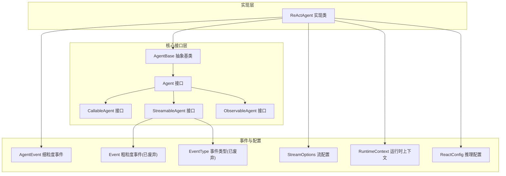
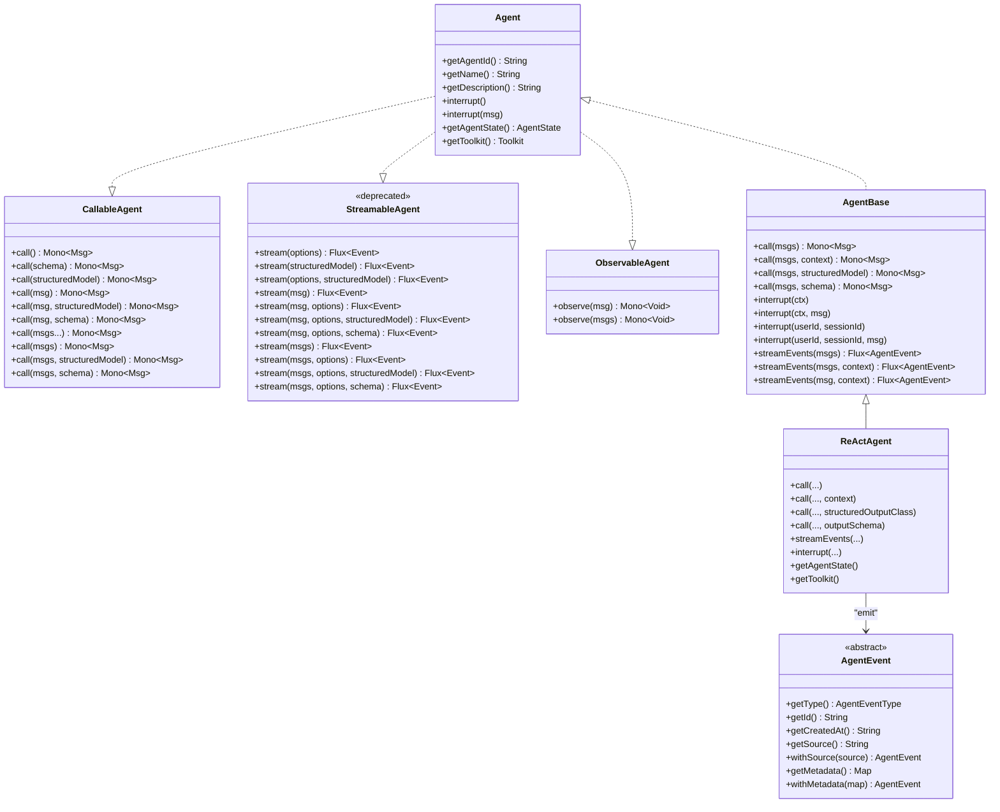
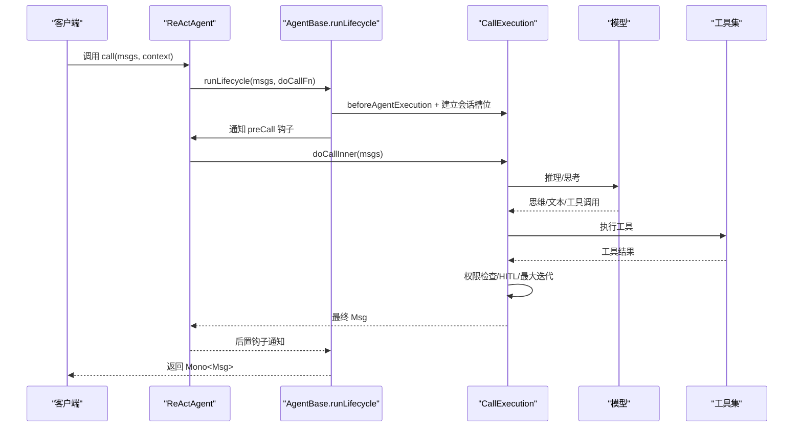
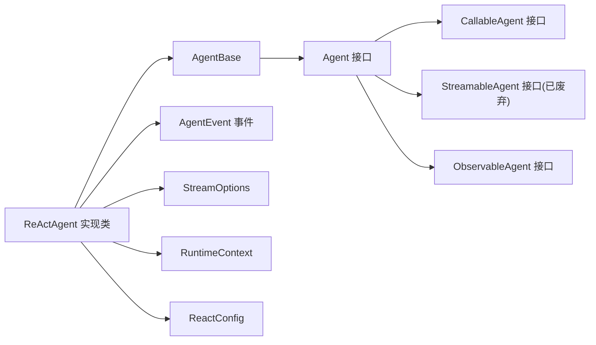

# 核心API

<cite>
**本文引用的文件**
- [Agent.java](file://agentscope-core/src/main/java/io/agentscope/core/agent/Agent.java)
- [CallableAgent.java](file://agentscope-core/src/main/java/io/agentscope/core/agent/CallableAgent.java)
- [StreamableAgent.java](file://agentscope-core/src/main/java/io/agentscope/core/agent/StreamableAgent.java)
- [ObservableAgent.java](file://agentscope-core/src/main/java/io/agentscope/core/agent/ObservableAgent.java)
- [AgentBase.java](file://agentscope-core/src/main/java/io/agentscope/core/agent/AgentBase.java)
- [ReActAgent.java](file://agentscope-core/src/main/java/io/agentscope/core/ReActAgent.java)
- [Event.java](file://agentscope-core/src/main/java/io/agentscope/core/agent/Event.java)
- [EventType.java](file://agentscope-core/src/main/java/io/agentscope/core/agent/EventType.java)
- [StreamOptions.java](file://agentscope-core/src/main/java/io/agentscope/core/agent/StreamOptions.java)
- [RuntimeContext.java](file://agentscope-core/src/main/java/io/agentscope/core/agent/RuntimeContext.java)
- [AgentEvent.java](file://agentscope-core/src/main/java/io/agentscope/core/event/AgentEvent.java)
- [ReactConfig.java](file://agentscope-core/src/main/java/io/agentscope/core/agent/config/ReactConfig.java)
</cite>

## 目录
1. [简介](#简介)
2. [项目结构](#项目结构)
3. [核心组件](#核心组件)
4. [架构总览](#架构总览)
5. [详细组件分析](#详细组件分析)
6. [依赖分析](#依赖分析)
7. [性能考虑](#性能考虑)
8. [故障排查指南](#故障排查指南)
9. [结论](#结论)
10. [附录](#附录)

## 简介
本文件面向AgentScope核心API，系统化梳理Agent接口族与ReActAgent实现，覆盖接口定义、方法签名、参数与返回值语义、典型用法、事件流模型、线程安全与并发控制、结构化输出能力、权限与中断机制、最佳实践与常见错误处理。目标读者既包括需要快速上手的开发者，也包括希望深入理解内部机制的架构师。

## 项目结构
- 核心接口位于 agentscope-core/src/main/java/io/agentscope/core/agent 下，定义了Agent、CallableAgent、StreamableAgent、ObservableAgent等契约，并提供基础实现AgentBase。
- ReActAgent位于 agentscope-core/src/main/java/io/agentscope/core/ReActAgent.java，是框架内最常用的推理-行动循环代理实现。
- 事件体系在 agentscope-core/src/main/java/io/agentscope/core/event 下，ReActAgent提供细粒度的 AgentEvent 流；同时保留旧版粗粒度 Event 类型用于兼容。
- 运行时上下文 RuntimeContext 提供每调用会话级元数据与工具执行上下文桥接。
- 配置类 ReactConfig 定义推理循环的关键参数。

图表来源
- [Agent.java:47-114](file://agentscope-core/src/main/java/io/agentscope/core/agent/Agent.java#L47-L114)
- [CallableAgent.java:35-139](file://agentscope-core/src/main/java/io/agentscope/core/agent/CallableAgent.java#L35-L139)
- [StreamableAgent.java:44-193](file://agentscope-core/src/main/java/io/agentscope/core/agent/StreamableAgent.java#L44-L193)
- [ObservableAgent.java:36-53](file://agentscope-core/src/main/java/io/agentscope/core/agent/ObservableAgent.java#L36-L53)
- [AgentBase.java:92-1036](file://agentscope-core/src/main/java/io/agentscope/core/agent/AgentBase.java#L92-L1036)
- [ReActAgent.java:200-4305](file://agentscope-core/src/main/java/io/agentscope/core/ReActAgent.java#L200-L4305)
- [AgentEvent.java:72-139](file://agentscope-core/src/main/java/io/agentscope/core/event/AgentEvent.java#L72-L139)
- [Event.java:60-220](file://agentscope-core/src/main/java/io/agentscope/core/agent/Event.java#L60-L220)
- [EventType.java:28-100](file://agentscope-core/src/main/java/io/agentscope/core/agent/EventType.java#L28-L100)
- [StreamOptions.java:62-371](file://agentscope-core/src/main/java/io/agentscope/core/agent/StreamOptions.java#L62-L371)
- [RuntimeContext.java:33-386](file://agentscope-core/src/main/java/io/agentscope/core/agent/RuntimeContext.java#L33-L386)
- [ReactConfig.java:29-55](file://agentscope-core/src/main/java/io/agentscope/core/agent/config/ReactConfig.java#L29-L55)

章节来源
- [Agent.java:21-114](file://agentscope-core/src/main/java/io/agentscope/core/agent/Agent.java#L21-L114)
- [AgentBase.java:47-1036](file://agentscope-core/src/main/java/io/agentscope/core/agent/AgentBase.java#L47-L1036)
- [ReActAgent.java:148-199](file://agentscope-core/src/main/java/io/agentscope/core/ReActAgent.java#L148-L199)

## 核心组件
- Agent：统一的代理接口，组合了可调用、可流式、可观测三大能力，提供中断、状态与工具包访问等通用能力。
- CallableAgent：消息调用入口，支持单条/多条消息输入，支持结构化输出（类或JSON Schema）。
- StreamableAgent：旧版流式事件接口（v1），已标记为废弃，推荐使用 ReActAgent 的细粒度事件流。
- ObservableAgent：仅观察不回复的消息接收接口，常用于多智能体协作场景。
- AgentBase：抽象基类，提供生命周期钩子、中断、序列化、运行时上下文绑定、预/后置钩子通知等基础设施。
- ReActAgent：推理-行动循环实现，提供细粒度事件流、结构化输出、权限与人机交互、会话槽位管理、优雅停机等高级特性。

章节来源
- [Agent.java:21-114](file://agentscope-core/src/main/java/io/agentscope/core/agent/Agent.java#L21-L114)
- [CallableAgent.java:23-139](file://agentscope-core/src/main/java/io/agentscope/core/agent/CallableAgent.java#L23-L139)
- [StreamableAgent.java:23-193](file://agentscope-core/src/main/java/io/agentscope/core/agent/StreamableAgent.java#L23-L193)
- [ObservableAgent.java:22-53](file://agentscope-core/src/main/java/io/agentscope/core/agent/ObservableAgent.java#L22-L53)
- [AgentBase.java:47-1036](file://agentscope-core/src/main/java/io/agentscope/core/agent/AgentBase.java#L47-L1036)
- [ReActAgent.java:148-199](file://agentscope-core/src/main/java/io/agentscope/core/ReActAgent.java#L148-L199)

## 架构总览
AgentScope采用“接口+抽象基类+具体实现”的分层设计。AgentBase统一处理生命周期、钩子、中断、序列化与运行时上下文；ReActAgent在其之上实现推理-行动循环、事件流、结构化输出与权限控制。事件体系从v1的粗粒度Event过渡到v2的细粒度AgentEvent，后者覆盖完整的代理生命周期并提供28种具体事件类型。

图表来源
- [Agent.java:47-114](file://agentscope-core/src/main/java/io/agentscope/core/agent/Agent.java#L47-L114)
- [CallableAgent.java:35-139](file://agentscope-core/src/main/java/io/agentscope/core/agent/CallableAgent.java#L35-L139)
- [StreamableAgent.java:44-193](file://agentscope-core/src/main/java/io/agentscope/core/agent/StreamableAgent.java#L44-L193)
- [ObservableAgent.java:36-53](file://agentscope-core/src/main/java/io/agentscope/core/agent/ObservableAgent.java#L36-L53)
- [AgentBase.java:92-1036](file://agentscope-core/src/main/java/io/agentscope/core/agent/AgentBase.java#L92-L1036)
- [ReActAgent.java:200-4305](file://agentscope-core/src/main/java/io/agentscope/core/ReActAgent.java#L200-L4305)
- [AgentEvent.java:72-139](file://agentscope-core/src/main/java/io/agentscope/core/event/AgentEvent.java#L72-L139)

## 详细组件分析

### Agent 接口族
- 设计理念：统一聚合可调用、可流式、可观测三种能力；内存管理、结构化输出、观察模式分别由具体实现承担。
- 关键方法
  - getAgentId()/getName()/getDescription()：标识与描述信息。
  - interrupt()/interrupt(Msg)/interrupt(ctx)/interrupt(userId, sessionId, msg)：会话级中断。
  - getAgentState()/getToolkit()：运行时状态与工具集访问点。
- 返回类型与语义
  - 调用类方法返回 Mono<Msg>，保证一次调用产生一个最终 Msg。
  - 观察类方法返回 Mono<Void>，表示完成态。
- 使用建议
  - 优先使用带 RuntimeContext 的 call(...) 重载以启用会话槽位与中间件链。
  - 结构化输出优先使用类型参数或 JSON Schema，避免手工解析。

章节来源
- [Agent.java:47-114](file://agentscope-core/src/main/java/io/agentscope/core/agent/Agent.java#L47-L114)

### CallableAgent 接口
- 方法族覆盖单条/多条消息输入，支持 varargs 与 List 形式。
- 支持结构化输出：
  - call(List<Msg>, Class<?>)
  - call(List<Msg>, JsonNode)
- 默认实现通过重载委派至核心 call(List<Msg>)，便于扩展。

章节来源
- [CallableAgent.java:35-139](file://agentscope-core/src/main/java/io/agentscope/core/agent/CallableAgent.java#L35-L139)

### StreamableAgent 接口（v1，已废弃）
- 旧版流式事件接口，返回粗粒度 Event 类型。
- 已标记 @Deprecated(since="2.0.0", forRemoval=true)，新代码请使用 ReActAgent.streamEvents(...) 获取细粒度 AgentEvent 流。

章节来源
- [StreamableAgent.java:44-193](file://agentscope-core/src/main/java/io/agentscope/core/agent/StreamableAgent.java#L44-L193)
- [Event.java:60-220](file://agentscope-core/src/main/java/io/agentscope/core/agent/Event.java#L60-L220)
- [EventType.java:28-100](file://agentscope-core/src/main/java/io/agentscope/core/agent/EventType.java#L28-L100)

### ObservableAgent 接口
- observe(msg)/observe(msgs)：接收消息但不生成回复，适合多智能体协作与共享上下文。

章节来源
- [ObservableAgent.java:36-53](file://agentscope-core/src/main/java/io/agentscope/core/agent/ObservableAgent.java#L36-L53)

### AgentBase 抽象基类
- 生命周期与钩子：runLifecycle(...) 统一处理 preCall/postCall、错误处理、优雅停机、序列化门禁。
- 中断与序列化：基于 Reactor Context 的 per-call 作用域，避免共享实例字段引发竞态。
- 运行时上下文：RuntimeContext 携带 sessionId/userId、AgentState、工具执行上下文与属性存储。
- 钩子系统：支持动态增删钩子，按优先级排序，支持 RuntimeContextAware 钩子。

章节来源
- [AgentBase.java:252-800](file://agentscope-core/src/main/java/io/agentscope/core/agent/AgentBase.java#L252-L800)
- [RuntimeContext.java:33-386](file://agentscope-core/src/main/java/io/agentscope/core/agent/RuntimeContext.java#L33-L386)

### ReActAgent 实现详解
- 核心能力
  - 推理-行动循环：在单次回复中迭代进行“思考-规划-行动-总结”，受 maxIters 限制。
  - 事件流：提供细粒度 AgentEvent 流，覆盖模型调用、文本/思维/数据块、工具调用与结果、用户确认、外部执行等28种事件类型。
  - 结构化输出：原生路径（模型支持 response_format）与回退路径（合成 generate_response 工具）。
  - 权限与人机交互：支持 PermissionEngine 与 RequireUserConfirmEvent/HITL。
  - 会话槽位：按 (userId, sessionId) 分槽，支持 AgentStateStore 持久化与恢复。
  - 优雅停机：结合 GracefulShutdownManager，支持请求级中断与状态保存。
- 关键方法
  - call(...) 多重重载：支持普通调用、带 RuntimeContext 的调用、结构化输出调用。
  - streamEvents(...)：返回 Flux<AgentEvent>，包含 AgentStartEvent/AgentResultEvent/AgentEndEvent 及中间阶段事件。
  - interrupt(...)：支持按 RuntimeContext 或 (userId, sessionId) 精准中断。
- 并发与线程安全
  - 单实例同一时刻只处理一个 call()；不同会话槽位并发执行互不干扰。
  - 通过 per-call 的 Reactor Context 与 CallExecution 作用域隔离状态。

图表来源
- [ReActAgent.java:795-850](file://agentscope-core/src/main/java/io/agentscope/core/ReActAgent.java#L795-L850)
- [AgentBase.java:252-322](file://agentscope-core/src/main/java/io/agentscope/core/agent/AgentBase.java#L252-L322)

章节来源
- [ReActAgent.java:148-199](file://agentscope-core/src/main/java/io/agentscope/core/ReActAgent.java#L148-L199)
- [ReActAgent.java:627-637](file://agentscope-core/src/main/java/io/agentscope/core/ReActAgent.java#L627-L637)
- [ReActAgent.java:865-904](file://agentscope-core/src/main/java/io/agentscope/core/ReActAgent.java#L865-L904)
- [ReActAgent.java:924-949](file://agentscope-core/src/main/java/io/agentscope/core/ReActAgent.java#L924-L949)
- [ReActAgent.java:953-1078](file://agentscope-core/src/main/java/io/agentscope/core/ReActAgent.java#L953-L1078)
- [ReActAgent.java:1399-1495](file://agentscope-core/src/main/java/io/agentscope/core/ReActAgent.java#L1399-L1495)

### 事件与流配置
- 细粒度事件（推荐）
  - AgentEvent 抽象基类，子类覆盖 getType()，包含 AGENT_START/AGENT_RESULT/AGENT_END、MODEL_CALL_*、TEXT_BLOCK_*、THINKING_BLOCK_*、DATA_BLOCK_*、TOOL_CALL_*、TOOL_RESULT_*、EXCEED_MAX_ITERS、REQUIRE_USER_CONFIRM、EXTERNAL_EXECUTION_RESULT、REQUEST_STOP、SUBAGENT_EXPOSED、HINT_BLOCK、CUSTOM 等。
  - ReActAgent.streamEvents(...) 返回 Flux<AgentEvent>，贯穿完整生命周期。
- 粗粒度事件（v1，已废弃）
  - Event/EventType 提供 REASONING/TOOL_RESULT/HINT/AGENT_RESULT/SUMMARY 等类型，StreamOptions 控制过滤与增量模式。
- 使用建议
  - 新代码统一使用 streamEvents(...) 获取细粒度事件，便于调试、监控与可视化。
  - 若需兼容旧模块，仍可使用 StreamableAgent 的 stream(...)，但应尽快迁移。

章节来源
- [AgentEvent.java:72-139](file://agentscope-core/src/main/java/io/agentscope/core/event/AgentEvent.java#L72-L139)
- [ReActAgent.java:865-904](file://agentscope-core/src/main/java/io/agentscope/core/ReActAgent.java#L865-L904)
- [Event.java:60-220](file://agentscope-core/src/main/java/io/agentscope/core/agent/Event.java#L60-L220)
- [EventType.java:28-100](file://agentscope-core/src/main/java/io/agentscope/core/agent/EventType.java#L28-L100)
- [StreamOptions.java:62-371](file://agentscope-core/src/main/java/io/agentscope/core/agent/StreamOptions.java#L62-L371)

### 结构化输出
- 原生路径：当模型支持 response_format 时，直接注入 ResponseFormat.jsonSchema，模型返回结构化 JSON 文本，ReActAgent 解析并写入 Msg 元数据。
- 回退路径：注入合成工具 generate_response，模型调用该工具后自然终止循环，再提取工具结果中的结构化数据并合并用量与思维块元数据。
- 参数约束：不能同时提供类与 Schema；必须二选一。

章节来源
- [ReActAgent.java:968-1078](file://agentscope-core/src/main/java/io/agentscope/core/ReActAgent.java#L968-L1078)
- [ReActAgent.java:1080-1138](file://agentscope-core/src/main/java/io/agentscope/core/ReActAgent.java#L1080-L1138)
- [ReActAgent.java:1182-1253](file://agentscope-core/src/main/java/io/agentscope/core/ReActAgent.java#L1182-L1253)

### 权限与人机交互（HITL）
- 权限引擎：每个会话槽位维护独立 PermissionEngine，支持规则动态添加与生效。
- HITL：当工具调用处于 ASKING 状态时，ReActAgent 抛出异常提示用户提供 ConfirmResult 列表，方可继续；否则中断并给出恢复指引。
- 中断：支持按 RuntimeContext 或 (userId, sessionId) 精准触发中断，配合优雅停机保存状态。

章节来源
- [ReActAgent.java:1435-1495](file://agentscope-core/src/main/java/io/agentscope/core/ReActAgent.java#L1435-L1495)
- [ReActAgent.java:1535-1571](file://agentscope-core/src/main/java/io/agentscope/core/ReActAgent.java#L1535-L1571)
- [ReActAgent.java:686-722](file://agentscope-core/src/main/java/io/agentscope/core/ReActAgent.java#L686-L722)

### 会话槽位与状态持久化
- 槽位键：slotKey(userId, sessionId)，相同槽位串行执行，不同槽位并发执行。
- 状态加载：优先从 AgentStateStore 加载，否则回退到 v1 会话键或新建空状态。
- 工具组同步：保存前将工具激活组同步到 AgentState。

章节来源
- [ReActAgent.java:332-478](file://agentscope-core/src/main/java/io/agentscope/core/ReActAgent.java#L332-L478)
- [ReActAgent.java:412-422](file://agentscope-core/src/main/java/io/agentscope/core/ReActAgent.java#L412-L422)

### API 使用模式与最佳实践
- 基础调用
  - 使用 ReActAgent.builder() 构建，设置模型、工具集、系统提示、最大迭代等。
  - call(msgs) 或 call(msgs, context) 获取最终 Msg。
- 结构化输出
  - 优先选择模型原生 response_format；若不支持则使用类或 JSON Schema 的回退路径。
- 事件监听
  - 使用 streamEvents(msgs) 订阅 AgentEvent，便于实时展示与调试。
- 会话与并发
  - 通过 RuntimeContext 指定 sessionId/userId；不同会话并发安全。
  - 单实例同一时刻仅处理一个 call()，并发场景建议按请求创建实例。
- 权限与中断
  - 使用 PermissionEngine 管控工具调用；HITL 时按 RequireUserConfirmEvent 提示收集 ConfirmResult。
  - 通过 interrupt(ctx) 或 interrupt(userId, sessionId) 精准中断。

章节来源
- [ReActAgent.java:163-190](file://agentscope-core/src/main/java/io/agentscope/core/ReActAgent.java#L163-L190)
- [RuntimeContext.java:33-127](file://agentscope-core/src/main/java/io/agentscope/core/agent/RuntimeContext.java#L33-L127)
- [ReactConfig.java:29-55](file://agentscope-core/src/main/java/io/agentscope/core/agent/config/ReactConfig.java#L29-L55)

## 依赖分析
- 接口继承关系
  - Agent 组合 CallableAgent、StreamableAgent、ObservableAgent。
  - ReActAgent 继承 AgentBase，从而实现 Agent。
- 内部依赖
  - ReActAgent 依赖 AgentBase 的生命周期与钩子、RuntimeContext 的会话与属性、AgentEvent 的事件体系、StreamOptions 的流配置、ReactConfig 的推理配置。
- 外部依赖
  - 事件流使用 Reactor Flux/Mono；工具与模型通过 Toolkit 与 Model 注册与调用。

图表来源
- [Agent.java:47-114](file://agentscope-core/src/main/java/io/agentscope/core/agent/Agent.java#L47-L114)
- [AgentBase.java:92-1036](file://agentscope-core/src/main/java/io/agentscope/core/agent/AgentBase.java#L92-L1036)
- [ReActAgent.java:200-4305](file://agentscope-core/src/main/java/io/agentscope/core/ReActAgent.java#L200-L4305)
- [AgentEvent.java:72-139](file://agentscope-core/src/main/java/io/agentscope/core/event/AgentEvent.java#L72-L139)
- [StreamOptions.java:62-371](file://agentscope-core/src/main/java/io/agentscope/core/agent/StreamOptions.java#L62-L371)
- [RuntimeContext.java:33-386](file://agentscope-core/src/main/java/io/agentscope/core/agent/RuntimeContext.java#L33-L386)
- [ReactConfig.java:29-55](file://agentscope-core/src/main/java/io/agentscope/core/agent/config/ReactConfig.java#L29-L55)

章节来源
- [Agent.java:47-114](file://agentscope-core/src/main/java/io/agentscope/core/agent/Agent.java#L47-L114)
- [AgentBase.java:92-1036](file://agentscope-core/src/main/java/io/agentscope/core/agent/AgentBase.java#L92-L1036)
- [ReActAgent.java:200-4305](file://agentscope-core/src/main/java/io/agentscope/core/ReActAgent.java#L200-L4305)

## 性能考虑
- 流式事件开销：细粒度事件流带来可观测性提升，注意订阅端的背压与过滤策略。
- 结构化输出路径：原生路径避免额外工具调用，性能更优；回退路径引入合成工具与额外事件。
- 会话槽位序列化：相同 (userId, sessionId) 的调用串行执行，避免并发写冲突，但可能成为瓶颈；合理拆分会话可提升吞吐。
- 令牌与用量聚合：结构化输出完成后聚合用量与思维块，避免重复计算。

## 故障排查指南
- 中断相关
  - 现象：调用抛出 InterruptedException。
  - 处理：AgentBase 捕获并调用 handleInterrupt(...)，返回中断响应；检查中断源与用户消息。
- 权限与 HITL
  - 现象：抛出 IllegalStateException，提示存在 ASKING 工具调用且未提供 ConfirmResult。
  - 处理：收集 RequireUserConfirmEvent 中的 ToolUseBlock，构造 ConfirmResult 列表作为后续消息元数据发送。
- 结构化输出
  - 现象：提供类与 Schema 同时或二者皆无。
  - 处理：二选一；或使用原生路径（模型支持 response_format）。
- 会话状态
  - 现象：重启后重复输入被丢弃。
  - 处理：这是优雅停机去重保护；如需继续，请携带上次会话的状态或更换 sessionId。

章节来源
- [AgentBase.java:494-502](file://agentscope-core/src/main/java/io/agentscope/core/agent/AgentBase.java#L494-L502)
- [ReActAgent.java:1435-1495](file://agentscope-core/src/main/java/io/agentscope/core/ReActAgent.java#L1435-L1495)
- [ReActAgent.java:968-986](file://agentscope-core/src/main/java/io/agentscope/core/ReActAgent.java#L968-L986)

## 结论
AgentScope 的核心API以清晰的接口分层与强大的实现（ReActAgent）为核心，提供了从消息调用、事件流、结构化输出到权限与中断的全栈能力。遵循本文的最佳实践与排错指南，可在保证线程安全与可观测性的前提下，高效构建多智能体协作与复杂推理任务的系统。

## 附录

### 接口与实现类清单
- 接口
  - Agent
  - CallableAgent
  - StreamableAgent（已废弃）
  - ObservableAgent
- 抽象基类
  - AgentBase
- 实现类
  - ReActAgent

章节来源
- [Agent.java:47-114](file://agentscope-core/src/main/java/io/agentscope/core/agent/Agent.java#L47-L114)
- [CallableAgent.java:35-139](file://agentscope-core/src/main/java/io/agentscope/core/agent/CallableAgent.java#L35-L139)
- [StreamableAgent.java:44-193](file://agentscope-core/src/main/java/io/agentscope/core/agent/StreamableAgent.java#L44-L193)
- [ObservableAgent.java:36-53](file://agentscope-core/src/main/java/io/agentscope/core/agent/ObservableAgent.java#L36-L53)
- [AgentBase.java:92-1036](file://agentscope-core/src/main/java/io/agentscope/core/agent/AgentBase.java#L92-L1036)
- [ReActAgent.java:200-4305](file://agentscope-core/src/main/java/io/agentscope/core/ReActAgent.java#L200-L4305)