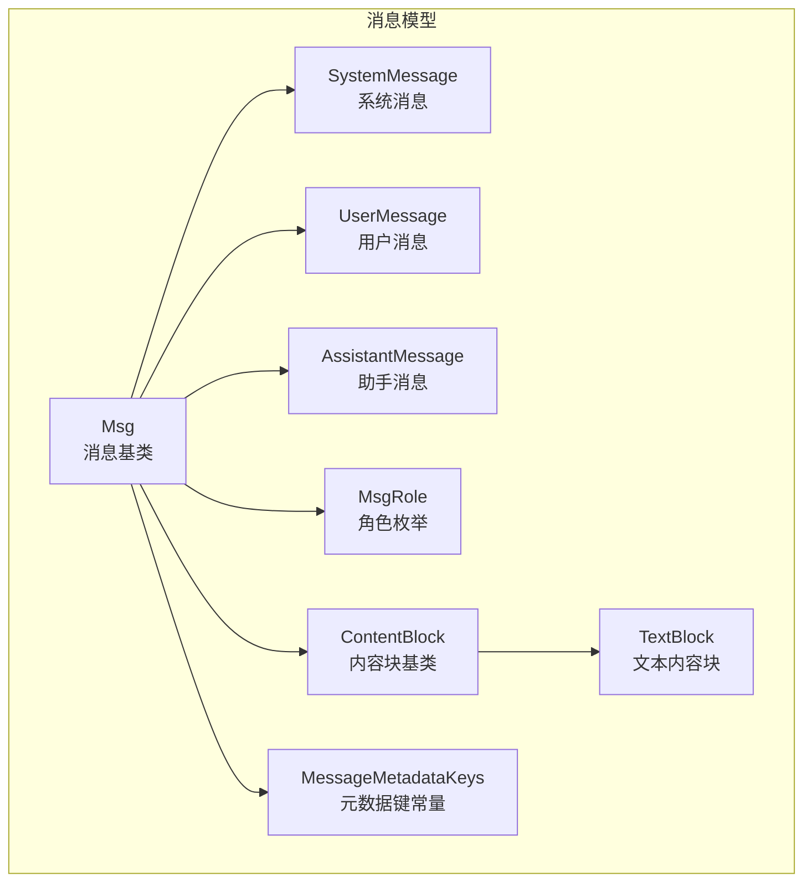
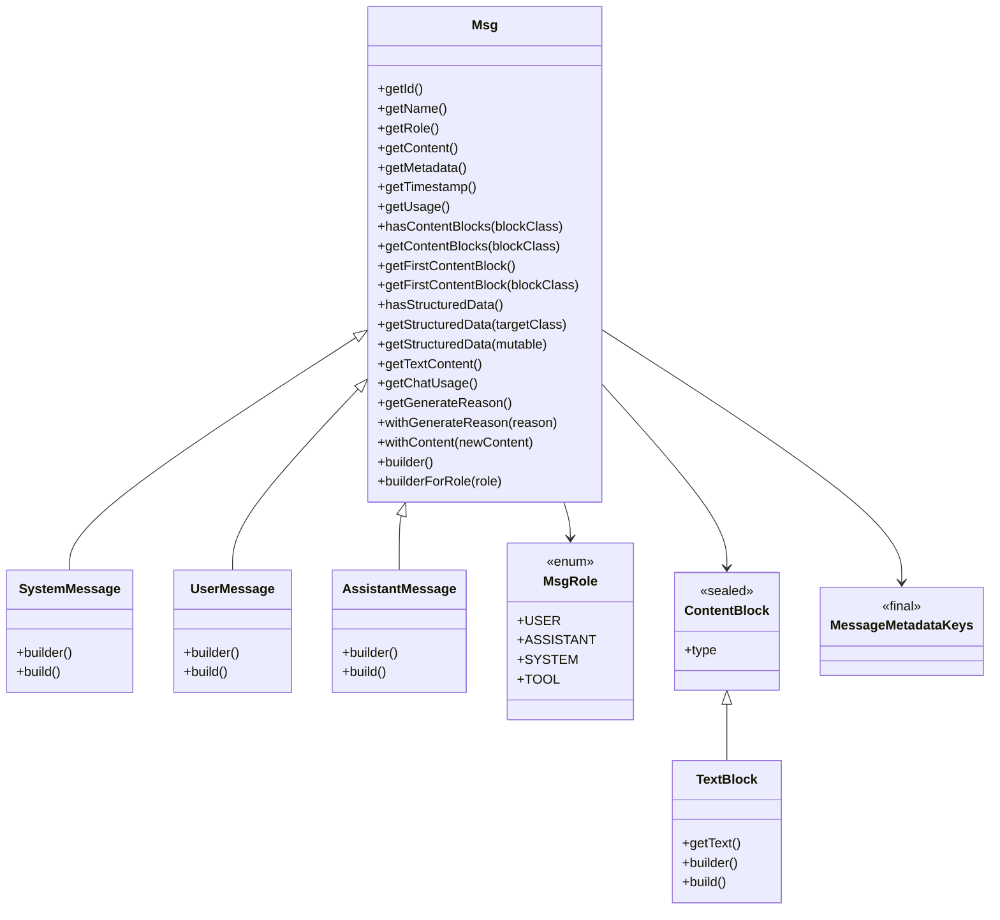
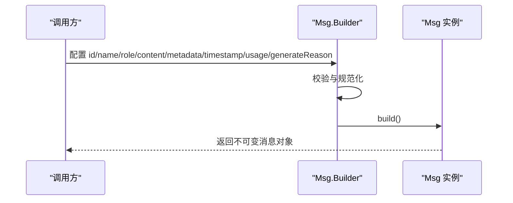
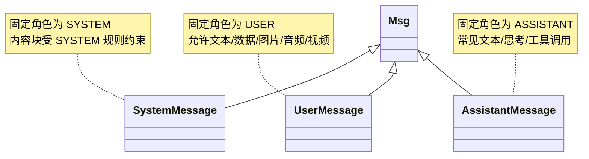
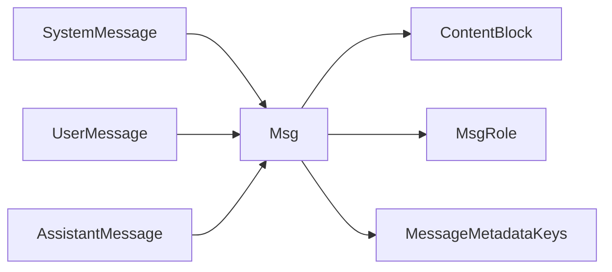

# 消息接口

<cite>
**本文引用的文件**
- [Msg.java](file://agentscope-core/src/main/java/io/agentscope/core/message/Msg.java)
- [SystemMessage.java](file://agentscope-core/src/main/java/io/agentscope/core/message/SystemMessage.java)
- [UserMessage.java](file://agentscope-core/src/main/java/io/agentscope/core/message/UserMessage.java)
- [AssistantMessage.java](file://agentscope-core/src/main/java/io/agentscope/core/message/AssistantMessage.java)
- [MsgRole.java](file://agentscope-core/src/main/java/io/agentscope/core/message/MsgRole.java)
- [ContentBlock.java](file://agentscope-core/src/main/java/io/agentscope/core/message/ContentBlock.java)
- [TextBlock.java](file://agentscope-core/src/main/java/io/agentscope/core/message/TextBlock.java)
- [MessageMetadataKeys.java](file://agentscope-core/src/main/java/io/agentscope/core/message/MessageMetadataKeys.java)
- [msghub.md](file://docs/v1/en/docs/task/msghub.md)
</cite>

## 目录
1. [简介](#简介)
2. [项目结构](#项目结构)
3. [核心组件](#核心组件)
4. [架构总览](#架构总览)
5. [详细组件分析](#详细组件分析)
6. [依赖关系分析](#依赖关系分析)
7. [性能考量](#性能考量)
8. [故障排查指南](#故障排查指南)
9. [结论](#结论)
10. [附录](#附录)

## 简介
本文件为 AgentScope 消息系统的详细 API 文档，聚焦于消息模型与消息链路的构建与使用。文档覆盖以下主题：
- 消息基类 Msg 及其子类（SystemMessage、UserMessage、AssistantMessage）的完整定义与职责边界
- 角色标识 MsgRole 的语义与用途
- 内容块 ContentBlock 的多态结构与典型类型（TextBlock 等）
- 元数据管理与关键键值（MessageMetadataKeys）
- 消息的创建、序列化与反序列化流程
- 在代理通信中的作用与最佳实践
- 基于消息链的消息构建、内容块处理与元数据操作示例

## 项目结构
消息系统位于 agentscope-core 模块的 io.agentscope.core.message 包中，核心文件如下：
- 消息基类：Msg
- 角色枚举：MsgRole
- 内容块基类：ContentBlock
- 典型内容块：TextBlock
- 子消息类型：SystemMessage、UserMessage、AssistantMessage
- 元数据键常量：MessageMetadataKeys
- 使用示例与集成参考：docs/v1/en/docs/task/msghub.md（消息广播中心）

**图表来源**
- [Msg.java:67-67](file://agentscope-core/src/main/java/io/agentscope/core/message/Msg.java#L67-L67)
- [SystemMessage.java:35-35](file://agentscope-core/src/main/java/io/agentscope/core/message/SystemMessage.java#L35-L35)
- [UserMessage.java:37-37](file://agentscope-core/src/main/java/io/agentscope/core/message/UserMessage.java#L37-L37)
- [AssistantMessage.java:35-35](file://agentscope-core/src/main/java/io/agentscope/core/message/AssistantMessage.java#L35-L35)
- [MsgRole.java:35-67](file://agentscope-core/src/main/java/io/agentscope/core/message/MsgRole.java#L35-L67)
- [ContentBlock.java:58-67](file://agentscope-core/src/main/java/io/agentscope/core/message/ContentBlock.java#L58-L67)
- [TextBlock.java:31-31](file://agentscope-core/src/main/java/io/agentscope/core/message/TextBlock.java#L31-L31)
- [MessageMetadataKeys.java:24-134](file://agentscope-core/src/main/java/io/agentscope/core/message/MessageMetadataKeys.java#L24-L134)

**章节来源**
- [Msg.java:1-843](file://agentscope-core/src/main/java/io/agentscope/core/message/Msg.java#L1-L843)
- [SystemMessage.java:1-174](file://agentscope-core/src/main/java/io/agentscope/core/message/SystemMessage.java#L1-L174)
- [UserMessage.java:1-176](file://agentscope-core/src/main/java/io/agentscope/core/message/UserMessage.java#L1-L176)
- [AssistantMessage.java:1-175](file://agentscope-core/src/main/java/io/agentscope/core/message/AssistantMessage.java#L1-L175)
- [MsgRole.java:1-68](file://agentscope-core/src/main/java/io/agentscope/core/message/MsgRole.java#L1-L68)
- [ContentBlock.java:1-68](file://agentscope-core/src/main/java/io/agentscope/core/message/ContentBlock.java#L1-L68)
- [TextBlock.java:1-96](file://agentscope-core/src/main/java/io/agentscope/core/message/TextBlock.java#L1-L96)
- [MessageMetadataKeys.java:1-135](file://agentscope-core/src/main/java/io/agentscope/core/message/MessageMetadataKeys.java#L1-L135)

## 核心组件
本节对消息系统的关键组件进行深入解析。

- 消息基类 Msg
  - 职责：作为所有消息的统一抽象，承载唯一标识、名称、角色、内容块列表、元数据、时间戳与用量统计；提供类型安全的内容块访问、结构化数据提取、生成原因标记与不可变副本构造等能力。
  - 关键点：
    - 内容块类型校验：根据角色限制允许的内容块集合（例如 USER 可含文本/数据/图片/音频/视频；SYSTEM 仅文本；ASSISTANT/TOOL 无限制以兼容历史）。
    - 不可变性：内容块列表与元数据在构造时被规范化并保持不可变。
    - 结构化数据：通过元数据键提取结构化输出，支持强类型 POJO 与动态 Map。
    - 生成原因：支持设置与查询生成原因，便于理解执行上下文与后续动作。
    - 用量统计：优先使用显式 ChatUsage，否则从元数据中推断。
  - 构建器：Builder 支持 id、name、role、content、metadata、timestamp、usage、generateReason 等配置，并在 build() 中完成校验与实例化。

- 子消息类型
  - SystemMessage：固定角色为 SYSTEM，提供便捷构造方法与独立 Builder，确保内容块类型符合系统消息约束。
  - UserMessage：固定角色为 USER，提供便捷构造方法与独立 Builder，允许文本、数据、图片、音频、视频等内容块。
  - AssistantMessage：固定角色为 ASSISTANT，提供便捷构造方法与独立 Builder，常见内容块包括文本、思考（ThinkingBlock）、工具调用（ToolUseBlock）等。

- 角色枚举 MsgRole
  - 定义了 USER、ASSISTANT、SYSTEM、TOOL 四种角色，用于区分消息来源或用途，是消息路由与格式化的关键依据。

- 内容块 ContentBlock 与 TextBlock
  - ContentBlock 是内容块的密封基类，通过 Jackson 多态注解标识“type”字段，支持 TextBlock、ImageBlock、AudioBlock、VideoBlock、ThinkingBlock、ToolUseBlock、ToolResultBlock、HintBlock、DataBlock 等具体类型。
  - TextBlock 表示纯文本内容，提供 builder 以便快速构造。

- 元数据键常量 MessageMetadataKeys
  - 提供一组标准元数据键，如聊天用量（_chat_usage）、结构化输出（_structured_output）、提示缓存控制（_cache_control）等，避免魔法字符串并保证跨模块一致性。

**章节来源**
- [Msg.java:67-152](file://agentscope-core/src/main/java/io/agentscope/core/message/Msg.java#L67-L152)
- [Msg.java:205-235](file://agentscope-core/src/main/java/io/agentscope/core/message/Msg.java#L205-L235)
- [Msg.java:329-377](file://agentscope-core/src/main/java/io/agentscope/core/message/Msg.java#L329-L377)
- [Msg.java:390-438](file://agentscope-core/src/main/java/io/agentscope/core/message/Msg.java#L390-L438)
- [Msg.java:527-584](file://agentscope-core/src/main/java/io/agentscope/core/message/Msg.java#L527-L584)
- [Msg.java:615-655](file://agentscope-core/src/main/java/io/agentscope/core/message/Msg.java#L615-L655)
- [SystemMessage.java:35-81](file://agentscope-core/src/main/java/io/agentscope/core/message/SystemMessage.java#L35-L81)
- [UserMessage.java:37-83](file://agentscope-core/src/main/java/io/agentscope/core/message/UserMessage.java#L37-L83)
- [AssistantMessage.java:35-81](file://agentscope-core/src/main/java/io/agentscope/core/message/AssistantMessage.java#L35-L81)
- [MsgRole.java:35-67](file://agentscope-core/src/main/java/io/agentscope/core/message/MsgRole.java#L35-L67)
- [ContentBlock.java:58-67](file://agentscope-core/src/main/java/io/agentscope/core/message/ContentBlock.java#L58-L67)
- [TextBlock.java:31-94](file://agentscope-core/src/main/java/io/agentscope/core/message/TextBlock.java#L31-L94)
- [MessageMetadataKeys.java:24-134](file://agentscope-core/src/main/java/io/agentscope/core/message/MessageMetadataKeys.java#L24-L134)

## 架构总览
消息系统采用“基类 + 密封内容块 + 角色驱动”的设计，结合 Jackson 注解实现多态序列化与反序列化。消息在代理通信中承担载体职责，配合 MsgHub 实现多智能体之间的自动广播与协作。

**图表来源**
- [Msg.java:67-843](file://agentscope-core/src/main/java/io/agentscope/core/message/Msg.java#L67-L843)
- [SystemMessage.java:35-174](file://agentscope-core/src/main/java/io/agentscope/core/message/SystemMessage.java#L35-L174)
- [UserMessage.java:37-176](file://agentscope-core/src/main/java/io/agentscope/core/message/UserMessage.java#L37-L176)
- [AssistantMessage.java:35-175](file://agentscope-core/src/main/java/io/agentscope/core/message/AssistantMessage.java#L35-L175)
- [MsgRole.java:35-67](file://agentscope-core/src/main/java/io/agentscope/core/message/MsgRole.java#L35-L67)
- [ContentBlock.java:58-67](file://agentscope-core/src/main/java/io/agentscope/core/message/ContentBlock.java#L58-L67)
- [TextBlock.java:31-96](file://agentscope-core/src/main/java/io/agentscope/core/message/TextBlock.java#L31-L96)
- [MessageMetadataKeys.java:24-134](file://agentscope-core/src/main/java/io/agentscope/core/message/MessageMetadataKeys.java#L24-L134)

## 详细组件分析

### 消息基类 Msg
- 结构与职责
  - 字段：id、name、role、content（不可变列表）、metadata（不可变映射）、timestamp、usage。
  - 校验：构造时对内容块按角色进行合法性校验，确保语义正确。
  - 访问：提供类型安全的内容块过滤与首个匹配项获取；提供文本拼接与结构化数据提取；提供生成原因与用量统计辅助方法。
  - 不可变副本：withGenerateReason、withContent 返回新实例，保持原消息不变。
- 构建器
  - 支持多种 content 设置方式（单个、数组、列表），以及 textContent 快捷入口；支持 metadata、timestamp、usage、generateReason 的注入；默认随机 id 与当前时间戳。
- 序列化与反序列化
  - 通过 Jackson 注解基于 role 字段进行多态分发，确保反序列化时能恢复到正确的子类类型。

**图表来源**
- [Msg.java:674-841](file://agentscope-core/src/main/java/io/agentscope/core/message/Msg.java#L674-L841)

**章节来源**
- [Msg.java:122-152](file://agentscope-core/src/main/java/io/agentscope/core/message/Msg.java#L122-L152)
- [Msg.java:166-198](file://agentscope-core/src/main/java/io/agentscope/core/message/Msg.java#L166-L198)
- [Msg.java:205-235](file://agentscope-core/src/main/java/io/agentscope/core/message/Msg.java#L205-L235)
- [Msg.java:329-377](file://agentscope-core/src/main/java/io/agentscope/core/message/Msg.java#L329-L377)
- [Msg.java:390-438](file://agentscope-core/src/main/java/io/agentscope/core/message/Msg.java#L390-L438)
- [Msg.java:527-584](file://agentscope-core/src/main/java/io/agentscope/core/message/Msg.java#L527-L584)
- [Msg.java:615-655](file://agentscope-core/src/main/java/io/agentscope/core/message/Msg.java#L615-L655)
- [Msg.java:674-841](file://agentscope-core/src/main/java/io/agentscope/core/message/Msg.java#L674-L841)

### 子消息类型：SystemMessage、UserMessage、AssistantMessage
- SystemMessage
  - 固定角色为 SYSTEM；构造时将文本包装为 TextBlock 并强制校验；提供独立 Builder，禁止修改角色。
- UserMessage
  - 固定角色为 USER；允许文本、数据、图片、音频、视频等内容块；提供独立 Builder，禁止修改角色。
- AssistantMessage
  - 固定角色为 ASSISTANT；常见内容块包括文本、思考、工具调用等；提供独立 Builder，禁止修改角色。

**图表来源**
- [SystemMessage.java:35-81](file://agentscope-core/src/main/java/io/agentscope/core/message/SystemMessage.java#L35-L81)
- [UserMessage.java:37-83](file://agentscope-core/src/main/java/io/agentscope/core/message/UserMessage.java#L37-L83)
- [AssistantMessage.java:35-81](file://agentscope-core/src/main/java/io/agentscope/core/message/AssistantMessage.java#L35-L81)

**章节来源**
- [SystemMessage.java:35-174](file://agentscope-core/src/main/java/io/agentscope/core/message/SystemMessage.java#L35-L174)
- [UserMessage.java:37-176](file://agentscope-core/src/main/java/io/agentscope/core/message/UserMessage.java#L37-L176)
- [AssistantMessage.java:35-175](file://agentscope-core/src/main/java/io/agentscope/core/message/AssistantMessage.java#L35-L175)

### 角色枚举 MsgRole
- 定义 USER、ASSISTANT、SYSTEM、TOOL 四种角色，用于消息来源或用途的语义标识，决定消息处理与格式化策略。

**章节来源**
- [MsgRole.java:35-67](file://agentscope-core/src/main/java/io/agentscope/core/message/MsgRole.java#L35-L67)

### 内容块 ContentBlock 与 TextBlock
- ContentBlock 为密封类，通过 Jackson 注解以“type”字段进行多态序列化；支持 TextBlock、ImageBlock、AudioBlock、VideoBlock、ThinkingBlock、ToolUseBlock、ToolResultBlock、HintBlock、DataBlock。
- TextBlock 表示纯文本内容，提供 builder 与 build 方法，适合快速构造文本内容块。

**章节来源**
- [ContentBlock.java:58-67](file://agentscope-core/src/main/java/io/agentscope/core/message/ContentBlock.java#L58-L67)
- [TextBlock.java:31-96](file://agentscope-core/src/main/java/io/agentscope/core/message/TextBlock.java#L31-L96)

### 元数据键常量 MessageMetadataKeys
- 提供标准元数据键，如聊天用量（_chat_usage）、结构化输出（_structured_output）、提示缓存控制（_cache_control）等，便于在消息中携带结构化信息与控制信号。

**章节来源**
- [MessageMetadataKeys.java:24-134](file://agentscope-core/src/main/java/io/agentscope/core/message/MessageMetadataKeys.java#L24-L134)

### 消息在代理通信中的作用与最佳实践
- 作用
  - 作为代理、用户与工具之间的通用通信单元，承载文本、多媒体、推理与工具结果等多种内容。
  - 通过角色与内容块规则，确保消息在不同模型与工具间的兼容性与可解释性。
- 最佳实践
  - 使用 builderForRole 根据角色选择合适的子类构建器，减少样板代码。
  - 对结构化输出使用 _structured_output 键，便于下游解析与消费。
  - 合理使用生成原因（generateReason）与用量统计（usage），提升可观测性与成本控制。
  - 在多智能体场景中，结合 MsgHub 进行消息广播与生命周期管理。

**章节来源**
- [Msg.java:205-235](file://agentscope-core/src/main/java/io/agentscope/core/message/Msg.java#L205-L235)
- [MessageMetadataKeys.java:74-107](file://agentscope-core/src/main/java/io/agentscope/core/message/MessageMetadataKeys.java#L74-L107)
- [msghub.md:1-286](file://docs/v1/en/docs/task/msghub.md#L1-L286)

## 依赖关系分析
- 组件耦合
  - Msg 与 ContentBlock 之间为组合关系，Msg 持有不可变的内容块列表。
  - SystemMessage、UserMessage、AssistantMessage 与 Msg 为继承关系，复用 Msg 的不可变特性与工具方法。
  - MsgRole 与 Msg/子类存在逻辑耦合，用于内容块校验与序列化分发。
  - MessageMetadataKeys 与 Msg 的元数据交互，提供标准化键名。
- 外部依赖
  - Jackson 注解用于多态序列化与反序列化。
  - JsonUtils、TypeUtils 用于结构化数据转换与类型安全转换。

**图表来源**
- [Msg.java:67-152](file://agentscope-core/src/main/java/io/agentscope/core/message/Msg.java#L67-L152)
- [SystemMessage.java:35-81](file://agentscope-core/src/main/java/io/agentscope/core/message/SystemMessage.java#L35-L81)
- [UserMessage.java:37-83](file://agentscope-core/src/main/java/io/agentscope/core/message/UserMessage.java#L37-L83)
- [AssistantMessage.java:35-81](file://agentscope-core/src/main/java/io/agentscope/core/message/AssistantMessage.java#L35-L81)
- [MsgRole.java:35-67](file://agentscope-core/src/main/java/io/agentscope/core/message/MsgRole.java#L35-L67)
- [MessageMetadataKeys.java:24-134](file://agentscope-core/src/main/java/io/agentscope/core/message/MessageMetadataKeys.java#L24-L134)

**章节来源**
- [Msg.java:18-38](file://agentscope-core/src/main/java/io/agentscope/core/message/Msg.java#L18-L38)
- [ContentBlock.java:46-57](file://agentscope-core/src/main/java/io/agentscope/core/message/ContentBlock.java#L46-L57)

## 性能考量
- 不可变性与线程安全
  - Msg 的内容块列表与元数据在构造时被规范化并保持不可变，天然具备线程安全特性，适合在多线程与响应式环境中使用。
- 序列化开销
  - Jackson 多态注解带来一定的序列化/反序列化开销，建议在高频消息场景中尽量复用已构建的 Msg 实例，避免重复构造。
- 结构化数据转换
  - 结构化数据提取依赖 JsonUtils 与类型转换，建议在上层缓存常用目标类型的转换器，减少反射开销。

[本节为通用指导，不直接分析具体文件]

## 故障排查指南
- 内容块类型不合法
  - 现象：构造 SystemMessage 或 UserMessage 时抛出非法参数异常。
  - 原因：传递了不允许的内容块类型（例如 SYSTEM 消息包含非文本内容块）。
  - 处理：仅使用允许的内容块类型，遵循 Msg 的角色校验规则。
- 结构化数据提取失败
  - 现象：调用 getStructuredData 抛出异常。
  - 原因：消息无元数据、缺少 _structured_output 键或类型不匹配。
  - 处理：先调用 hasStructuredData 检查，再使用强类型或 Map 形式提取。
- 生成原因解析异常
  - 现象：getGenerateReason 返回默认值而非预期枚举。
  - 原因：元数据中存储的生成原因字符串无效或类型不匹配。
  - 处理：确保通过 withGenerateReason 正确设置枚举名称，或在上游保证元数据格式一致。

**章节来源**
- [Msg.java:166-198](file://agentscope-core/src/main/java/io/agentscope/core/message/Msg.java#L166-L198)
- [Msg.java:414-438](file://agentscope-core/src/main/java/io/agentscope/core/message/Msg.java#L414-L438)
- [Msg.java:615-633](file://agentscope-core/src/main/java/io/agentscope/core/message/Msg.java#L615-L633)

## 结论
AgentScope 消息系统通过“消息基类 + 密封内容块 + 角色驱动 + 标准化元数据”的设计，提供了高内聚、低耦合且易于扩展的消息模型。借助不可变性与多态序列化，消息在代理通信中扮演了稳定而强大的载体角色。结合 MsgHub 的广播机制与结构化元数据，开发者可以高效地构建多智能体协作与复杂对话场景。

[本节为总结性内容，不直接分析具体文件]

## 附录

### 使用示例与参考
- 基础消息创建与内容块处理
  - 使用 Msg.builder 或 builderForRole 创建消息，设置角色与内容块，必要时添加元数据与用量统计。
  - 通过 hasContentBlocks/getContentBlocks 获取指定类型的内容块，使用 getTextContent 提取纯文本。
- 元数据操作
  - 使用 MessageMetadataKeys 中的标准键名存放结构化输出、用量统计与缓存控制等信息。
- 多智能体广播
  - 参考 MsgHub 示例，利用 enter/call/broadcast 等 API 实现消息自动广播与生命周期管理。

**章节来源**
- [msghub.md:42-117](file://docs/v1/en/docs/task/msghub.md#L42-L117)
- [msghub.md:192-244](file://docs/v1/en/docs/task/msghub.md#L192-L244)
- [msghub.md:253-273](file://docs/v1/en/docs/task/msghub.md#L253-L273)