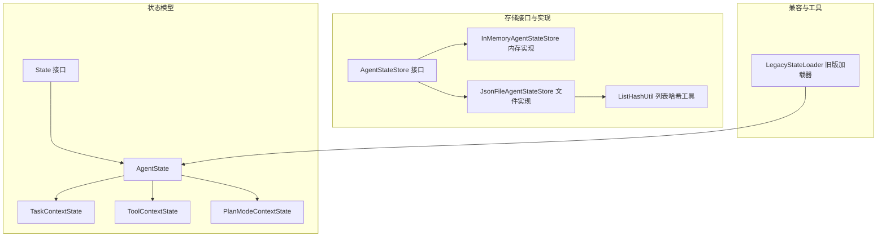
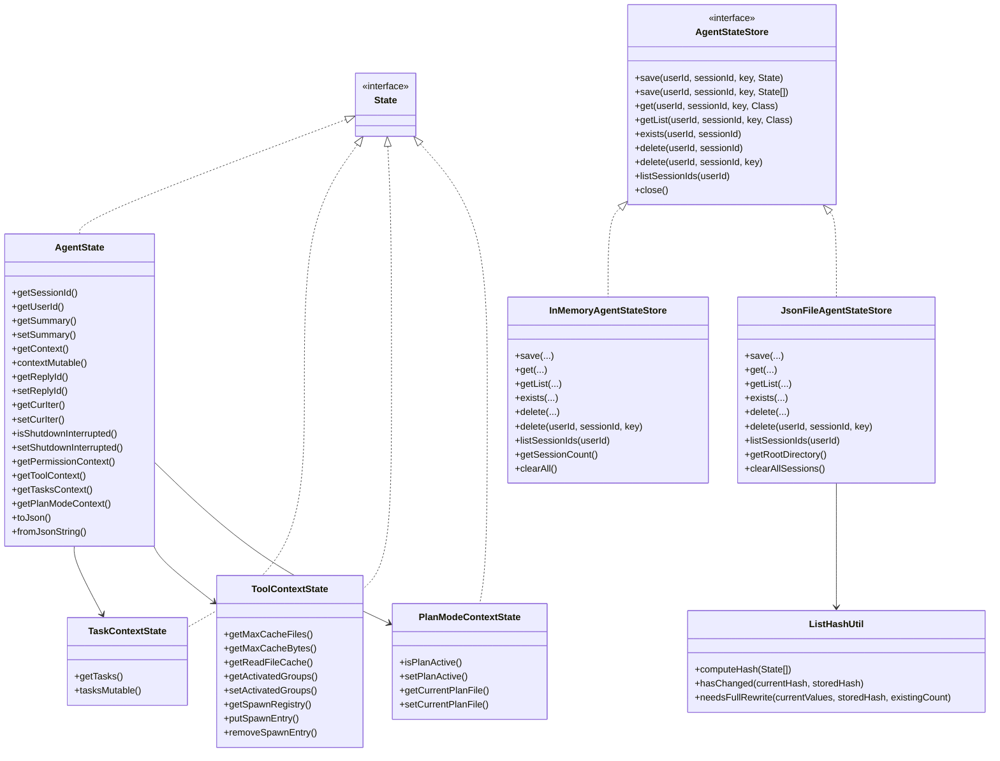
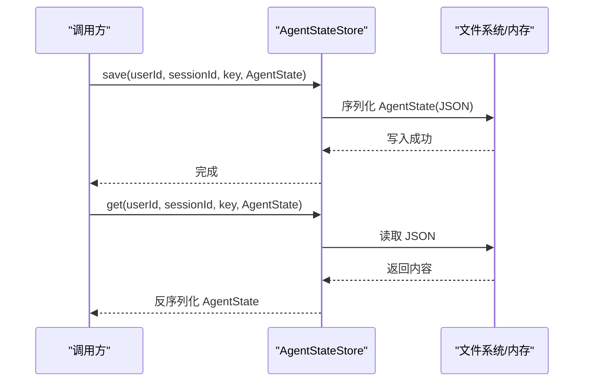
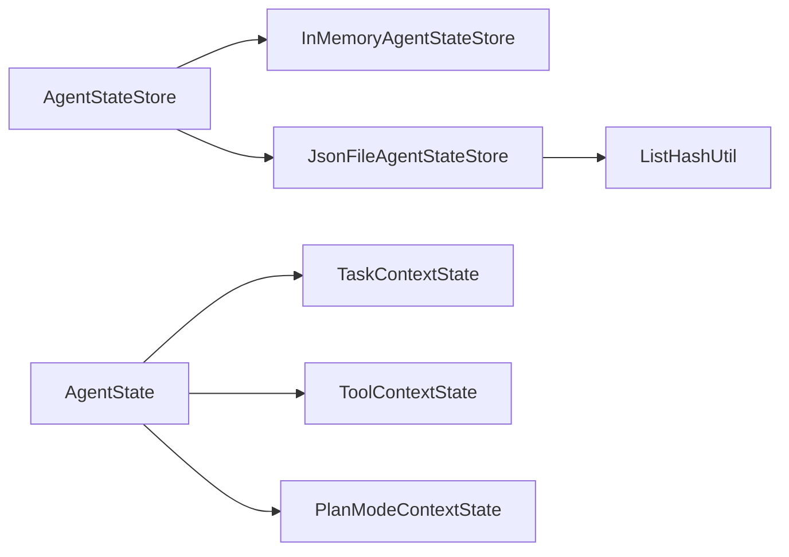

# 状态接口

<cite>
**本文引用的文件**
- [AgentState.java](file://agentscope-core/src/main/java/io/agentscope/core/state/AgentState.java)
- [State.java](file://agentscope-core/src/main/java/io/agentscope/core/state/State.java)
- [AgentStateStore.java](file://agentscope-core/src/main/java/io/agentscope/core/state/AgentStateStore.java)
- [InMemoryAgentStateStore.java](file://agentscope-core/src/main/java/io/agentscope/core/state/InMemoryAgentStateStore.java)
- [JsonFileAgentStateStore.java](file://agentscope-core/src/main/java/io/agentscope/core/state/JsonFileAgentStateStore.java)
- [TaskContextState.java](file://agentscope-core/src/main/java/io/agentscope/core/state/TaskContextState.java)
- [ToolContextState.java](file://agentscope-core/src/main/java/io/agentscope/core/state/ToolContextState.java)
- [PlanModeContextState.java](file://agentscope-core/src/main/java/io/agentscope/core/state/PlanModeContextState.java)
- [LegacyStateLoader.java](file://agentscope-core/src/main/java/io/agentscope/core/state/LegacyStateLoader.java)
- [ListHashUtil.java](file://agentscope-core/src/main/java/io/agentscope/core/state/ListHashUtil.java)
- [AgentStateTest.java](file://agentscope-core/src/test/java/io/agentscope/core/state/AgentStateTest.java)
- [InMemoryAgentStateStoreTest.java](file://agentscope-core/src/test/java/io/agentscope/core/state/InMemoryAgentStateStoreTest.java)
</cite>

## 目录
1. [简介](#简介)
2. [项目结构](#项目结构)
3. [核心组件](#核心组件)
4. [架构总览](#架构总览)
5. [详细组件分析](#详细组件分析)
6. [依赖分析](#依赖分析)
7. [性能考量](#性能考量)
8. [故障排查指南](#故障排查指南)
9. [结论](#结论)
10. [附录](#附录)

## 简介
本文件为 AgentScope 状态管理系统提供详细的 API 文档与最佳实践指南，覆盖以下主题：
- 状态模型：AgentState、State 接口及其子上下文（任务、工具、计划模式）
- 存储接口：AgentStateStore 的统一抽象与两种实现（内存、文件）
- 序列化与恢复：JSON 编解码、列表增量写入与哈希校验
- 使用场景与最佳实践：状态更新、持久化策略、并发控制与扩展点
- 兼容性：从旧版本会话数据迁移至新格式

## 项目结构
状态管理相关代码主要位于 agentscope-core 模块的 state 包中，包含状态模型、存储接口与实现、兼容性工具以及配套测试。

图表来源
- [AgentState.java:1-424](file://agentscope-core/src/main/java/io/agentscope/core/state/AgentState.java#L1-L424)
- [State.java:1-31](file://agentscope-core/src/main/java/io/agentscope/core/state/State.java#L1-L31)
- [AgentStateStore.java:1-167](file://agentscope-core/src/main/java/io/agentscope/core/state/AgentStateStore.java#L1-L167)
- [InMemoryAgentStateStore.java:1-195](file://agentscope-core/src/main/java/io/agentscope/core/state/InMemoryAgentStateStore.java#L1-L195)
- [JsonFileAgentStateStore.java:1-397](file://agentscope-core/src/main/java/io/agentscope/core/state/JsonFileAgentStateStore.java#L1-L397)
- [ListHashUtil.java:1-172](file://agentscope-core/src/main/java/io/agentscope/core/state/ListHashUtil.java#L1-L172)
- [LegacyStateLoader.java:1-68](file://agentscope-core/src/main/java/io/agentscope/core/state/LegacyStateLoader.java#L1-L68)

章节来源
- [AgentState.java:1-424](file://agentscope-core/src/main/java/io/agentscope/core/state/AgentState.java#L1-L424)
- [AgentStateStore.java:1-167](file://agentscope-core/src/main/java/io/agentscope/core/state/AgentStateStore.java#L1-L167)
- [InMemoryAgentStateStore.java:1-195](file://agentscope-core/src/main/java/io/agentscope/core/state/InMemoryAgentStateStore.java#L1-L195)
- [JsonFileAgentStateStore.java:1-397](file://agentscope-core/src/main/java/io/agentscope/core/state/JsonFileAgentStateStore.java#L1-L397)
- [ListHashUtil.java:1-172](file://agentscope-core/src/main/java/io/agentscope/core/state/ListHashUtil.java#L1-L172)
- [LegacyStateLoader.java:1-68](file://agentscope-core/src/main/java/io/agentscope/core/state/LegacyStateLoader.java#L1-L68)

## 核心组件
- State 接口：标记可持久化的状态对象，便于通过 AgentStateStore 进行序列化与存储。
- AgentState：单个智能体的运行时状态载体，包含会话标识、用户标识、对话缓冲区、滚动摘要、回复标识、当前推理迭代次数、关闭中断标记、权限上下文、工具上下文、任务上下文、计划模式上下文等。
- 上下文子状态：
  - TaskContextState：承载任务列表，支持不可变快照与可变句柄。
  - ToolContextState：文件读缓存（LRU）、激活工具组、子代理生成注册表等。
  - PlanModeContextState：计划模式开关与当前编辑蓝图路径。
- AgentStateStore 接口：统一的状态持久化抽象，支持保存/加载/删除/列出会话，键由 (userId, sessionId, key) 组合。
- 实现：
  - InMemoryAgentStateStore：基于并发映射的内存存储，线程安全，适合单进程、无需跨重启持久化的场景。
  - JsonFileAgentStateStore：基于 JSON/JSONL 的文件存储，支持原子写入、UTF-8、列表增量写入与哈希校验，适合本地或共享文件系统。

章节来源
- [State.java:18-30](file://agentscope-core/src/main/java/io/agentscope/core/state/State.java#L18-L30)
- [AgentState.java:31-45](file://agentscope-core/src/main/java/io/agentscope/core/state/AgentState.java#L31-L45)
- [TaskContextState.java:24-29](file://agentscope-core/src/main/java/io/agentscope/core/state/TaskContextState.java#L24-L29)
- [ToolContextState.java:36-47](file://agentscope-core/src/main/java/io/agentscope/core/state/ToolContextState.java#L36-L47)
- [PlanModeContextState.java:23-36](file://agentscope-core/src/main/java/io/agentscope/core/state/PlanModeContextState.java#L23-L36)
- [AgentStateStore.java:22-60](file://agentscope-core/src/main/java/io/agentscope/core/state/AgentStateStore.java#L22-L60)
- [InMemoryAgentStateStore.java:26-45](file://agentscope-core/src/main/java/io/agentscope/core/state/InMemoryAgentStateStore.java#L26-L45)
- [JsonFileAgentStateStore.java:41-66](file://agentscope-core/src/main/java/io/agentscope/core/state/JsonFileAgentStateStore.java#L41-L66)

## 架构总览
AgentState 作为顶层状态对象，聚合多个子上下文；AgentStateStore 抽象了存储层，具体实现负责键空间组织、序列化与并发控制；ListHashUtil 用于列表状态的高效变更检测，优化文件存储的写入策略。

图表来源
- [AgentState.java:59-424](file://agentscope-core/src/main/java/io/agentscope/core/state/AgentState.java#L59-L424)
- [TaskContextState.java:30-75](file://agentscope-core/src/main/java/io/agentscope/core/state/TaskContextState.java#L30-L75)
- [ToolContextState.java:48-293](file://agentscope-core/src/main/java/io/agentscope/core/state/ToolContextState.java#L48-L293)
- [PlanModeContextState.java:37-98](file://agentscope-core/src/main/java/io/agentscope/core/state/PlanModeContextState.java#L37-L98)
- [AgentStateStore.java:61-167](file://agentscope-core/src/main/java/io/agentscope/core/state/AgentStateStore.java#L61-L167)
- [InMemoryAgentStateStore.java:46-195](file://agentscope-core/src/main/java/io/agentscope/core/state/InMemoryAgentStateStore.java#L46-L195)
- [JsonFileAgentStateStore.java:66-397](file://agentscope-core/src/main/java/io/agentscope/core/state/JsonFileAgentStateStore.java#L66-L397)
- [ListHashUtil.java:48-172](file://agentscope-core/src/main/java/io/agentscope/core/state/ListHashUtil.java#L48-L172)

## 详细组件分析

### AgentState：智能体运行时状态
- 关键职责
  - 聚合会话级上下文：对话缓冲区（消息列表）、滚动摘要、回复标识、当前推理迭代计数、关闭中断标记。
  - 权限、工具、任务、计划模式上下文的持有与替换。
  - 提供 JSON 序列化/反序列化能力，支持外部存储。
  - 提供不可变快照与可变句柄，兼顾安全性与性能。
- 并发与运行时信号
  - 中断控制对象按需延迟初始化，避免序列化开销。
- 建议用法
  - 使用构建器设置默认值与显式字段。
  - 对只读消费者使用不可变快照，对内部组件使用可变句柄以减少复制成本。

图表来源
- [AgentState.java:273-288](file://agentscope-core/src/main/java/io/agentscope/core/state/AgentState.java#L273-L288)
- [AgentStateStore.java:73-104](file://agentscope-core/src/main/java/io/agentscope/core/state/AgentStateStore.java#L73-L104)
- [JsonFileAgentStateStore.java:98-108](file://agentscope-core/src/main/java/io/agentscope/core/state/JsonFileAgentStateStore.java#L98-L108)
- [InMemoryAgentStateStore.java:54-58](file://agentscope-core/src/main/java/io/agentscope/core/state/InMemoryAgentStateStore.java#L54-L58)

章节来源
- [AgentState.java:31-424](file://agentscope-core/src/main/java/io/agentscope/core/state/AgentState.java#L31-L424)
- [AgentStateTest.java:35-168](file://agentscope-core/src/test/java/io/agentscope/core/state/AgentStateTest.java#L35-L168)

### AgentStateStore 接口：统一存储抽象
- 键空间设计
  - (userId, sessionId, key) 三元键，其中 sessionId 必须非空非空白；userId 可空表示匿名/单租户场景。
- 支持的操作
  - 单值保存/加载、列表保存/加载、存在性检查、会话删除、键级删除、会话列表查询、资源清理。
- 实现差异
  - InMemoryAgentStateStore：全量替换策略，线程安全，适合单机。
  - JsonFileAgentStateStore：单值原子写入；列表采用增量追加与哈希校验，必要时整写，提升大列表写入效率。

章节来源
- [AgentStateStore.java:22-167](file://agentscope-core/src/main/java/io/agentscope/core/state/AgentStateStore.java#L22-L167)

### InMemoryAgentStateStore：内存存储
- 特点
  - 基于并发映射，线程安全；匿名会话归入特殊命名空间，避免与空字符串用户冲突。
  - 单值保存为全量替换；列表保存为全量替换。
  - 提供会话计数与清空能力，便于测试与调试。
- 适用场景
  - 单进程应用、临时状态、快速原型、测试环境。

章节来源
- [InMemoryAgentStateStore.java:26-195](file://agentscope-core/src/main/java/io/agentscope/core/state/InMemoryAgentStateStore.java#L26-L195)
- [InMemoryAgentStateStoreTest.java:40-218](file://agentscope-core/src/test/java/io/agentscope/core/state/InMemoryAgentStateStoreTest.java#L40-L218)

### JsonFileAgentStateStore：文件存储
- 特点
  - 目录布局：根目录下按用户与会话分层，匿名会话使用特殊目录名；键对应 JSON 或 JSONL 文件。
  - 单值：原子写入，UTF-8，避免部分写入。
  - 列表：基于哈希的增量写入，仅在需要时整写，显著降低大列表写入成本。
  - 文件名安全：非安全字符使用 URL 安全 Base64 编码。
- 适用场景
  - 需要跨进程/跨重启持久化的本地或共享文件系统环境。

章节来源
- [JsonFileAgentStateStore.java:41-397](file://agentscope-core/src/main/java/io/agentscope/core/state/JsonFileAgentStateStore.java#L41-L397)
- [ListHashUtil.java:48-172](file://agentscope-core/src/main/java/io/agentscope/core/state/ListHashUtil.java#L48-L172)

### 上下文子状态
- TaskContextState
  - 不可变快照与可变句柄并存，便于工具链就地修改任务列表。
- ToolContextState
  - 文件读缓存（带 mtime 校验与淘汰），激活工具组，子代理生成注册表。
  - 缓存读写异步执行，避免阻塞 Reactor 调度器。
- PlanModeContextState
  - 计划模式标志与当前编辑蓝图路径，保证分布式/可恢复场景下的状态一致性。

章节来源
- [TaskContextState.java:24-75](file://agentscope-core/src/main/java/io/agentscope/core/state/TaskContextState.java#L24-L75)
- [ToolContextState.java:36-293](file://agentscope-core/src/main/java/io/agentscope/core/state/ToolContextState.java#L36-L293)
- [PlanModeContextState.java:23-98](file://agentscope-core/src/main/java/io/agentscope/core/state/PlanModeContextState.java#L23-L98)

### 兼容性与迁移：LegacyStateLoader
- 功能
  - 将旧版会话键（如 memory_messages、toolkit_activeGroups）转换为新版 AgentState。
  - 不修改原始数据，后续保存自动采用新格式。
- 使用建议
  - 在升级过程中，先通过加载器构造新状态，再保存到新键空间，逐步完成迁移。

章节来源
- [LegacyStateLoader.java:22-68](file://agentscope-core/src/main/java/io/agentscope/core/state/LegacyStateLoader.java#L22-L68)

## 依赖分析
- 组件耦合
  - AgentStateStore 与具体实现之间为接口与实现的松耦合。
  - JsonFileAgentStateStore 依赖 ListHashUtil 进行列表变更检测。
  - AgentState 聚合多个 State 子类型，形成复合状态模型。
- 外部依赖
  - JSON 序列化：通过通用编解码器进行序列化/反序列化。
  - 文件系统：JsonFileAgentStateStore 依赖文件读写与原子移动操作。
  - Reactor：ToolContextState 的缓存读写使用非阻塞调度器。

图表来源
- [AgentStateStore.java:61-167](file://agentscope-core/src/main/java/io/agentscope/core/state/AgentStateStore.java#L61-L167)
- [InMemoryAgentStateStore.java:46-195](file://agentscope-core/src/main/java/io/agentscope/core/state/InMemoryAgentStateStore.java#L46-L195)
- [JsonFileAgentStateStore.java:66-397](file://agentscope-core/src/main/java/io/agentscope/core/state/JsonFileAgentStateStore.java#L66-L397)
- [ListHashUtil.java:48-172](file://agentscope-core/src/main/java/io/agentscope/core/state/ListHashUtil.java#L48-L172)
- [AgentState.java:59-424](file://agentscope-core/src/main/java/io/agentscope/core/state/AgentState.java#L59-L424)

## 性能考量
- 列表写入优化
  - JsonFileAgentStateStore 通过哈希与现有行数判断是否需要整写或增量追加，避免重复写入。
  - ListHashUtil 使用采样策略计算哈希，小列表全采样，大列表按固定位置采样，平衡准确性与性能。
- 内存与并发
  - InMemoryAgentStateStore 使用并发映射，适合高并发读写；但进程退出即丢失。
  - ToolContextState 的缓存读写异步化，避免阻塞事件循环。
- I/O 与原子性
  - 文件写入采用临时文件 + 原子移动，确保部分写入不会污染目标文件。

章节来源
- [JsonFileAgentStateStore.java:110-133](file://agentscope-core/src/main/java/io/agentscope/core/state/JsonFileAgentStateStore.java#L110-L133)
- [ListHashUtil.java:76-170](file://agentscope-core/src/main/java/io/agentscope/core/state/ListHashUtil.java#L76-L170)
- [ToolContextState.java:184-241](file://agentscope-core/src/main/java/io/agentscope/core/state/ToolContextState.java#L184-L241)

## 故障排查指南
- 常见问题与定位
  - 会话不存在：检查 sessionId 是否为空或空白；确认键空间组合是否正确。
  - 类型不匹配：get 操作返回类型与期望类型不符会抛出类型转换异常，检查保存时的类型与键。
  - 文件写入失败：检查根目录权限与磁盘空间；确认原子写入流程未被中断。
  - 列表未更新：确认列表哈希是否变化；若列表被截断或前缀被修改，可能触发整写。
- 测试参考
  - 使用单元测试验证默认值、不可变快照行为、序列化往返、会话存在性与删除、列表增删改查等。

章节来源
- [InMemoryAgentStateStoreTest.java:76-218](file://agentscope-core/src/test/java/io/agentscope/core/state/InMemoryAgentStateStoreTest.java#L76-L218)
- [AgentStateTest.java:89-168](file://agentscope-core/src/test/java/io/agentscope/core/state/AgentStateTest.java#L89-L168)

## 结论
AgentScope 的状态管理系统以 AgentState 为核心，结合 AgentStateStore 的统一抽象与多种实现，提供了灵活、可扩展且高性能的状态持久化方案。通过合理的键空间设计、序列化策略与并发控制，既能满足本地开发需求，也能支撑分布式与可恢复场景。配合兼容性迁移工具，可平滑过渡到新版本状态模型。

## 附录

### 最佳实践清单
- 状态更新
  - 使用构建器集中初始化，避免分散赋值带来的竞态。
  - 对只读消费者使用不可变快照，对内部组件使用可变句柄。
- 持久化策略
  - 单值状态：直接保存，覆盖式更新。
  - 列表状态：传入完整列表，交由实现决定增量或整写。
  - 大列表写入：优先选择 JsonFileAgentStateStore，利用哈希与采样策略降低 I/O。
- 并发控制
  - 多线程访问时，避免在序列化期间修改状态；必要时复制后序列化。
  - 工具链对列表的就地修改应尽量在受控范围内进行。
- 扩展点
  - 自定义存储实现：遵循 AgentStateStore 接口契约，处理键空间、序列化与并发。
  - 自定义状态对象：实现 State 接口，确保可被统一序列化与存储。
  - 兼容性迁移：使用 LegacyStateLoader 将旧键转换为新格式，逐步完成迁移。