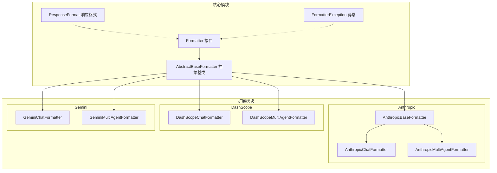
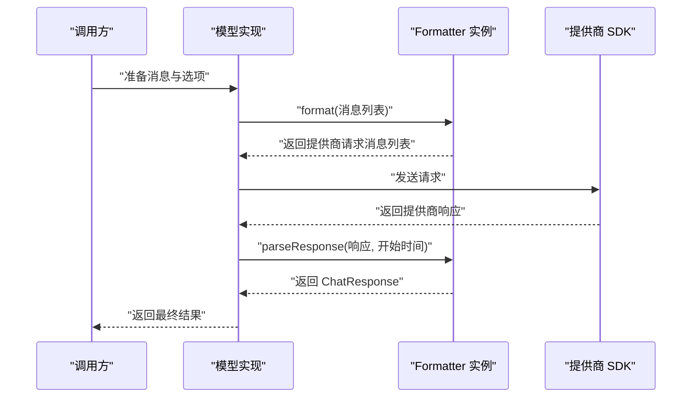
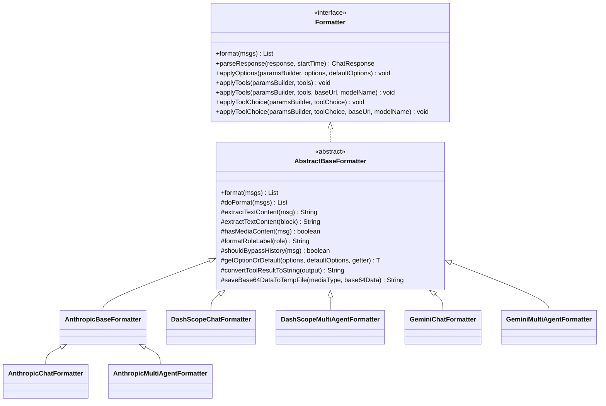
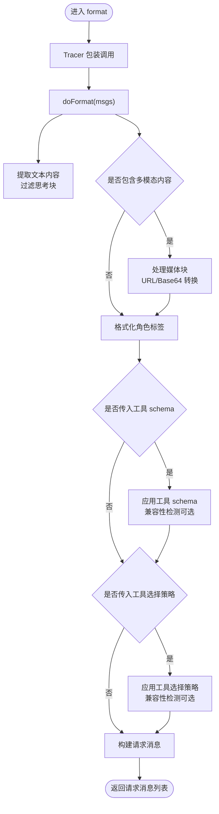
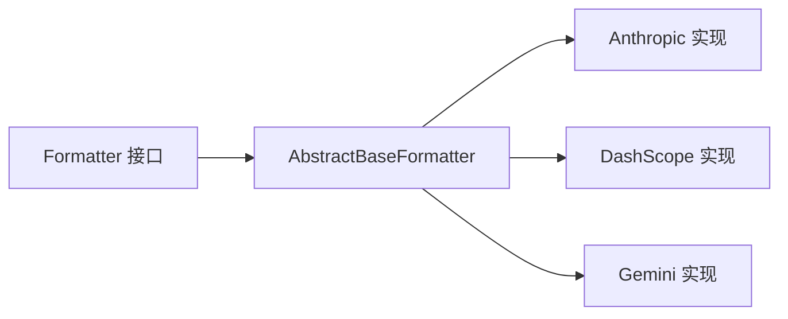

# 格式化器系统

<cite>
**本文引用的文件**
- [Formatter.java](file://agentscope-core/src/main/java/io/agentscope/core/formatter/Formatter.java)
- [AbstractBaseFormatter.java](file://agentscope-core/src/main/java/io/agentscope/core/formatter/AbstractBaseFormatter.java)
- [FormatterException.java](file://agentscope-core/src/main/java/io/agentscope/core/formatter/FormatterException.java)
- [ResponseFormat.java](file://agentscope-core/src/main/java/io/agentscope/core/formatter/ResponseFormat.java)
- [AnthropicBaseFormatter.java](file://agentscope-extensions/agentscope-extensions-model/agentscope-extensions-model-anthropic/src/main/java/io/agentscope/extensions/model/anthropic/formatter/AnthropicBaseFormatter.java)
- [AnthropicChatFormatter.java](file://agentscope-extensions/agentscope-extensions-model/agentscope-extensions-model-anthropic/src/main/java/io/agentscope/extensions/model/anthropic/formatter/AnthropicChatFormatter.java)
- [AnthropicMultiAgentFormatter.java](file://agentscope-extensions/agentscope-extensions-model/agentscope-extensions-model-anthropic/src/main/java/io/agentscope/extensions/model/anthropic/formatter/AnthropicMultiAgentFormatter.java)
- [DashScopeChatFormatter.java](file://agentscope-extensions/agentscope-extensions-model/agentscope-extensions-model-dashscope/src/main/java/io/agentscope/extensions/model/dashscope/formatter/DashScopeChatFormatter.java)
- [DashScopeMultiAgentFormatter.java](file://agentscope-extensions/agentscope-extensions-model/agentscope-extensions-model-dashscope/src/main/java/io/agentscope/extensions/model/dashscope/formatter/DashScopeMultiAgentFormatter.java)
- [GeminiChatFormatter.java](file://agentscope-extensions/agentscope-extensions-model/agentscope-extensions-model-gemini/src/main/java/io/agentscope/extensions/model/gemini/formatter/GeminiChatFormatter.java)
- [GeminiMultiAgentFormatter.java](file://agentscope-extensions/agentscope-extensions-model/agentscope-extensions-model-gemini/src/main/java/io/agentscope/extensions/model/gemini/formatter/GeminiMultiAgentFormatter.java)
</cite>

## 目录
1. [简介](#简介)
2. [项目结构](#项目结构)
3. [核心组件](#核心组件)
4. [架构总览](#架构总览)
5. [详细组件分析](#详细组件分析)
6. [依赖分析](#依赖分析)
7. [性能考虑](#性能考虑)
8. [故障排查指南](#故障排查指南)
9. [结论](#结论)
10. [附录](#附录)

## 简介
本文件为 AgentScope 格式化器系统提供详细的 API 文档与实现指南。内容覆盖 Formatter 接口与 AbstractBaseFormatter 抽象基类的方法定义、消息格式转换流程、工具 schema 处理与响应解析机制，并对各提供商（Anthropic、DashScope、Gemini）格式化器的实现差异进行对比说明。同时给出自定义格式化器的开发步骤、集成示例以及性能优化与错误处理策略。

## 项目结构
格式化器系统位于 agentscope-core 模块中，核心接口与抽象基类定义于 formatter 包；各提供商扩展实现位于 agentscope-extensions-* 模块的对应 formatter 包内。下图展示核心与扩展模块的关系：

图表来源
- [Formatter.java:55-145](file://agentscope-core/src/main/java/io/agentscope/core/formatter/Formatter.java#L55-L145)
- [AbstractBaseFormatter.java:61-306](file://agentscope-core/src/main/java/io/agentscope/core/formatter/AbstractBaseFormatter.java#L61-L306)
- [ResponseFormat.java:49-140](file://agentscope-core/src/main/java/io/agentscope/core/formatter/ResponseFormat.java#L49-L140)
- [FormatterException.java:24-44](file://agentscope-core/src/main/java/io/agentscope/core/formatter/FormatterException.java#L24-L44)
- [AnthropicBaseFormatter.java:36](file://agentscope-extensions/agentscope-extensions-model/agentscope-extensions-model-anthropic/src/main/java/io/agentscope/extensions/model/anthropic/formatter/AnthropicBaseFormatter.java#L36)
- [AnthropicChatFormatter.java:36](file://agentscope-extensions/agentscope-extensions-model/agentscope-extensions-model-anthropic/src/main/java/io/agentscope/extensions/model/anthropic/formatter/AnthropicChatFormatter.java#L36)
- [AnthropicMultiAgentFormatter.java:46](file://agentscope-extensions/agentscope-extensions-model/agentscope-extensions-model-anthropic/src/main/java/io/agentscope/extensions/model/anthropic/formatter/AnthropicMultiAgentFormatter.java#L46)
- [DashScopeChatFormatter.java:41](file://agentscope-extensions/agentscope-extensions-model/agentscope-extensions-model-dashscope/src/main/java/io/agentscope/extensions/model/dashscope/formatter/DashScopeChatFormatter.java#L41)
- [DashScopeMultiAgentFormatter.java:45](file://agentscope-extensions/agentscope-extensions-model/agentscope-extensions-model-dashscope/src/main/java/io/agentscope/extensions/model/dashscope/formatter/DashScopeMultiAgentFormatter.java#L45)
- [GeminiChatFormatter.java:51](file://agentscope-extensions/agentscope-extensions-model/agentscope-extensions-model-gemini/src/main/java/io/agentscope/extensions/model/gemini/formatter/GeminiChatFormatter.java#L51)
- [GeminiMultiAgentFormatter.java:47](file://agentscope-extensions/agentscope-extensions-model/agentscope-extensions-model-gemini/src/main/java/io/agentscope/extensions/model/gemini/formatter/GeminiMultiAgentFormatter.java#L47)

章节来源
- [Formatter.java:26-54](file://agentscope-core/src/main/java/io/agentscope/core/formatter/Formatter.java#L26-L54)
- [AbstractBaseFormatter.java:46-62](file://agentscope-core/src/main/java/io/agentscope/core/formatter/AbstractBaseFormatter.java#L46-L62)

## 核心组件
本节聚焦 Formatter 接口与 AbstractBaseFormatter 抽象基类的关键方法与职责。

- Formatter 接口
  - format：将 AgentScope 的消息列表转换为提供商特定请求消息列表
  - parseResponse：将提供商特定响应对象解析为 AgentScope 的 ChatResponse
  - applyOptions：将生成选项应用到提供商参数构建器
  - applyTools：将工具 schema 应用到提供商参数构建器
  - applyTools(带兼容性检测)：在识别提供商后调整工具定义以保证兼容
  - applyToolChoice：将工具选择策略应用到提供商参数构建器
  - applyToolChoice(带兼容性检测)：在识别提供商后调整工具选择格式或降级

- AbstractBaseFormatter 抽象基类
  - doFormat：由具体实现覆盖的消息格式化逻辑入口
  - extractTextContent：从消息或内容块提取文本，过滤思考块
  - hasMediaContent：判断消息是否包含多模态内容（图像/音频/视频）
  - formatRoleLabel：角色标签格式化
  - shouldBypassHistory：多智能体场景下是否绕过历史合并
  - getOptionOrDefault：从 options 或默认选项中取值
  - convertToolResultToString：将工具结果输出转为字符串表示
  - saveBase64DataToTempFile：将 Base64 多模态数据保存为临时文件并返回路径

章节来源
- [Formatter.java:55-145](file://agentscope-core/src/main/java/io/agentscope/core/formatter/Formatter.java#L55-L145)
- [AbstractBaseFormatter.java:61-306](file://agentscope-core/src/main/java/io/agentscope/core/formatter/AbstractBaseFormatter.java#L61-L306)

## 架构总览
下图展示格式化器在模型调用链中的位置与交互：

图表来源
- [Formatter.java:63-72](file://agentscope-core/src/main/java/io/agentscope/core/formatter/Formatter.java#L63-L72)
- [Formatter.java:74-82](file://agentscope-core/src/main/java/io/agentscope/core/formatter/Formatter.java#L74-L82)
- [Formatter.java:84-90](file://agentscope-core/src/main/java/io/agentscope/core/formatter/Formatter.java#L84-L90)
- [Formatter.java:106-110](file://agentscope-core/src/main/java/io/agentscope/core/formatter/Formatter.java#L106-L110)
- [Formatter.java:121-124](file://agentscope-core/src/main/java/io/agentscope/core/formatter/Formatter.java#L121-L124)
- [Formatter.java:140-144](file://agentscope-core/src/main/java/io/agentscope/core/formatter/Formatter.java#L140-L144)

## 详细组件分析

### 接口与抽象基类类图

图表来源
- [Formatter.java:55-145](file://agentscope-core/src/main/java/io/agentscope/core/formatter/Formatter.java#L55-L145)
- [AbstractBaseFormatter.java:61-306](file://agentscope-core/src/main/java/io/agentscope/core/formatter/AbstractBaseFormatter.java#L61-L306)
- [AnthropicBaseFormatter.java:36](file://agentscope-extensions/agentscope-extensions-model/agentscope-extensions-model-anthropic/src/main/java/io/agentscope/extensions/model/anthropic/formatter/AnthropicBaseFormatter.java#L36)
- [AnthropicChatFormatter.java:36](file://agentscope-extensions/agentscope-extensions-model/agentscope-extensions-model-anthropic/src/main/java/io/agentscope/extensions/model/anthropic/formatter/AnthropicChatFormatter.java#L36)
- [AnthropicMultiAgentFormatter.java:46](file://agentscope-extensions/agentscope-extensions-model/agentscope-extensions-model-anthropic/src/main/java/io/agentscope/extensions/model/anthropic/formatter/AnthropicMultiAgentFormatter.java#L46)
- [DashScopeChatFormatter.java:41](file://agentscope-extensions/agentscope-extensions-model/agentscope-extensions-model-dashscope/src/main/java/io/agentscope/extensions/model/dashscope/formatter/DashScopeChatFormatter.java#L41)
- [DashScopeMultiAgentFormatter.java:45](file://agentscope-extensions/agentscope-extensions-model/agentscope-extensions-model-dashscope/src/main/java/io/agentscope/extensions/model/dashscope/formatter/DashScopeMultiAgentFormatter.java#L45)
- [GeminiChatFormatter.java:51](file://agentscope-extensions/agentscope-extensions-model/agentscope-extensions-model-gemini/src/main/java/io/agentscope/extensions/model/gemini/formatter/GeminiChatFormatter.java#L51)
- [GeminiMultiAgentFormatter.java:47](file://agentscope-extensions/agentscope-extensions-model/agentscope-extensions-model-gemini/src/main/java/io/agentscope/extensions/model/gemini/formatter/GeminiMultiAgentFormatter.java#L47)

### 方法与职责详解

- format
  - 输入：AgentScope 的消息列表
  - 输出：提供商特定请求消息列表
  - 关键点：由抽象基类包装并委托给 doFormat，便于统一追踪与扩展

- parseResponse
  - 输入：提供商特定响应对象与请求开始时间
  - 输出：AgentScope 的 ChatResponse
  - 关键点：用于统一响应解析与耗时统计

- applyOptions
  - 输入：提供商参数构建器、生成选项、默认选项
  - 行为：将选项映射到提供商参数（如温度、最大令牌数等）

- applyTools
  - 输入：提供商参数构建器、工具 schema 列表
  - 行为：将工具 schema 注入到请求参数中，支持带兼容性检测的重载版本

- applyToolChoice
  - 输入：提供商参数构建器、工具选择策略
  - 行为：控制模型使用工具的方式（如禁用、自动、必需等），支持带兼容性检测的重载版本

章节来源
- [Formatter.java:63-72](file://agentscope-core/src/main/java/io/agentscope/core/formatter/Formatter.java#L63-L72)
- [Formatter.java:74-82](file://agentscope-core/src/main/java/io/agentscope/core/formatter/Formatter.java#L74-L82)
- [Formatter.java:84-90](file://agentscope-core/src/main/java/io/agentscope/core/formatter/Formatter.java#L84-L90)
- [Formatter.java:106-110](file://agentscope-core/src/main/java/io/agentscope/core/formatter/Formatter.java#L106-L110)
- [Formatter.java:121-124](file://agentscope-core/src/main/java/io/agentscope/core/formatter/Formatter.java#L121-L124)
- [Formatter.java:140-144](file://agentscope-core/src/main/java/io/agentscope/core/formatter/Formatter.java#L140-L144)

### 消息格式转换流程
以下流程图描述了从 AgentScope 消息到提供商请求消息的转换过程，以及多模态内容与工具结果的处理要点：

图表来源
- [AbstractBaseFormatter.java:72-77](file://agentscope-core/src/main/java/io/agentscope/core/formatter/AbstractBaseFormatter.java#L72-L77)
- [AbstractBaseFormatter.java:85-110](file://agentscope-core/src/main/java/io/agentscope/core/formatter/AbstractBaseFormatter.java#L85-L110)
- [AbstractBaseFormatter.java:133-142](file://agentscope-core/src/main/java/io/agentscope/core/formatter/AbstractBaseFormatter.java#L133-L142)
- [AbstractBaseFormatter.java:150-157](file://agentscope-core/src/main/java/io/agentscope/core/formatter/AbstractBaseFormatter.java#L150-L157)
- [Formatter.java:84-90](file://agentscope-core/src/main/java/io/agentscope/core/formatter/Formatter.java#L84-L90)
- [Formatter.java:106-110](file://agentscope-core/src/main/java/io/agentscope/core/formatter/Formatter.java#L106-L110)
- [Formatter.java:121-124](file://agentscope-core/src/main/java/io/agentscope/core/formatter/Formatter.java#L121-L124)
- [Formatter.java:140-144](file://agentscope-core/src/main/java/io/agentscope/core/formatter/Formatter.java#L140-L144)

### 工具 schema 处理与响应解析机制
- 工具 schema 处理
  - 在 applyTools 中注入工具定义；若需要，通过带 baseUrl/modelName 的重载方法进行提供商兼容性处理（例如移除不支持的 strict 字段）
  - 工具选择策略通过 applyToolChoice 控制模型行为；同样支持带兼容性检测的重载方法

- 响应解析
  - parseResponse 将提供商响应对象转换为 ChatResponse，并结合请求开始时间计算耗时
  - 具体解析细节由各提供商格式化器实现覆盖（如 Anthropic、DashScope、Gemini）

章节来源
- [Formatter.java:84-90](file://agentscope-core/src/main/java/io/agentscope/core/formatter/Formatter.java#L84-L90)
- [Formatter.java:106-110](file://agentscope-core/src/main/java/io/agentscope/core/formatter/Formatter.java#L106-L110)
- [Formatter.java:121-124](file://agentscope-core/src/main/java/io/agentscope/core/formatter/Formatter.java#L121-L124)
- [Formatter.java:140-144](file://agentscope-core/src/main/java/io/agentscope/core/formatter/Formatter.java#L140-L144)
- [Formatter.java:74-82](file://agentscope-core/src/main/java/io/agentscope/core/formatter/Formatter.java#L74-L82)

### 各提供商格式化器实现差异与配置选项

- Anthropic
  - 基类：AnthropicBaseFormatter 提供通用逻辑
  - 聊天格式化器：AnthropicChatFormatter
  - 多智能体格式化器：AnthropicMultiAgentFormatter
  - 特点：支持媒体块转换、思考块过滤、工具 schema 与工具选择策略的兼容性处理

- DashScope
  - 聊天格式化器：DashScopeChatFormatter
  - 多智能体格式化器：DashScopeMultiAgentFormatter
  - 特点：遵循 DashScope 请求参数规范，支持工具 schema 注入与工具选择策略

- Gemini
  - 聊天格式化器：GeminiChatFormatter
  - 多智能体格式化器：GeminiMultiAgentFormatter
  - 特点：遵循 Gemini 请求参数规范，支持工具 schema 与工具选择策略

章节来源
- [AnthropicBaseFormatter.java:36](file://agentscope-extensions/agentscope-extensions-model/agentscope-extensions-model-anthropic/src/main/java/io/agentscope/extensions/model/anthropic/formatter/AnthropicBaseFormatter.java#L36)
- [AnthropicChatFormatter.java:36](file://agentscope-extensions/agentscope-extensions-model/agentscope-extensions-model-anthropic/src/main/java/io/agentscope/extensions/model/anthropic/formatter/AnthropicChatFormatter.java#L36)
- [AnthropicMultiAgentFormatter.java:46](file://agentscope-extensions/agentscope-extensions-model/agentscope-extensions-model-anthropic/src/main/java/io/agentscope/extensions/model/anthropic/formatter/AnthropicMultiAgentFormatter.java#L46)
- [DashScopeChatFormatter.java:41](file://agentscope-extensions/agentscope-extensions-model/agentscope-extensions-model-dashscope/src/main/java/io/agentscope/extensions/model/dashscope/formatter/DashScopeChatFormatter.java#L41)
- [DashScopeMultiAgentFormatter.java:45](file://agentscope-extensions/agentscope-extensions-model/agentscope-extensions-model-dashscope/src/main/java/io/agentscope/extensions/model/dashscope/formatter/DashScopeMultiAgentFormatter.java#L45)
- [GeminiChatFormatter.java:51](file://agentscope-extensions/agentscope-extensions-model/agentscope-extensions-model-gemini/src/main/java/io/agentscope/extensions/model/gemini/formatter/GeminiChatFormatter.java#L51)
- [GeminiMultiAgentFormatter.java:47](file://agentscope-extensions/agentscope-extensions-model/agentscope-extensions-model-gemini/src/main/java/io/agentscope/extensions/model/gemini/formatter/GeminiMultiAgentFormatter.java#L47)

### 自定义格式化器开发指南与集成示例
- 开发步骤
  - 继承 AbstractBaseFormatter 并实现 doFormat
  - 在 doFormat 中完成消息到提供商请求的转换，必要时调用工具与选项应用方法
  - 如需，重写 applyTools 与 applyToolChoice 的兼容性检测版本
  - 在 parseResponse 中完成提供商响应到 ChatResponse 的解析
- 集成示例
  - 在模型实现中注入自定义格式化器实例，并在调用链中按需调用 format 与 parseResponse
  - 通过 applyOptions 与 applyTools 注入生成选项与工具 schema

章节来源
- [AbstractBaseFormatter.java:72-77](file://agentscope-core/src/main/java/io/agentscope/core/formatter/AbstractBaseFormatter.java#L72-L77)
- [Formatter.java:63-72](file://agentscope-core/src/main/java/io/agentscope/core/formatter/Formatter.java#L63-L72)
- [Formatter.java:74-82](file://agentscope-core/src/main/java/io/agentscope/core/formatter/Formatter.java#L74-L82)
- [Formatter.java:84-90](file://agentscope-core/src/main/java/io/agentscope/core/formatter/Formatter.java#L84-L90)
- [Formatter.java:106-110](file://agentscope-core/src/main/java/io/agentscope/core/formatter/Formatter.java#L106-L110)
- [Formatter.java:121-124](file://agentscope-core/src/main/java/io/agentscope/core/formatter/Formatter.java#L121-L124)
- [Formatter.java:140-144](file://agentscope-core/src/main/java/io/agentscope/core/formatter/Formatter.java#L140-L144)

## 依赖分析
- 组件耦合
  - 所有格式化器均实现 Formatter 接口，继承 AbstractBaseFormatter 以共享通用能力
  - 各提供商格式化器仅依赖核心接口与抽象基类，避免对具体 SDK 的直接耦合
- 外部依赖
  - 提供商 SDK 作为扩展模块引入，格式化器通过参数构建器间接使用
- 循环依赖
  - 无循环依赖，接口与抽象基类位于核心模块，具体实现位于扩展模块

图表来源
- [Formatter.java:55-145](file://agentscope-core/src/main/java/io/agentscope/core/formatter/Formatter.java#L55-L145)
- [AbstractBaseFormatter.java:61-306](file://agentscope-core/src/main/java/io/agentscope/core/formatter/AbstractBaseFormatter.java#L61-L306)
- [AnthropicChatFormatter.java:36](file://agentscope-extensions/agentscope-extensions-model/agentscope-extensions-model-anthropic/src/main/java/io/agentscope/extensions/model/anthropic/formatter/AnthropicChatFormatter.java#L36)
- [DashScopeChatFormatter.java:41](file://agentscope-extensions/agentscope-extensions-model/agentscope-extensions-model-dashscope/src/main/java/io/agentscope/extensions/model/dashscope/formatter/DashScopeChatFormatter.java#L41)
- [GeminiChatFormatter.java:51](file://agentscope-extensions/agentscope-extensions-model/agentscope-extensions-model-gemini/src/main/java/io/agentscope/extensions/model/gemini/formatter/GeminiChatFormatter.java#L51)

## 性能考虑
- 文本提取与媒体处理
  - 使用流式处理与条件过滤减少不必要的字符串拼接
  - 对 Base64 数据落地磁盘时注意 I/O 成本，建议复用临时目录与生命周期管理
- 角色标签与历史合并
  - 角色标签格式化为常量映射，开销极低
  - 多智能体场景下合理使用 shouldBypassHistory，避免过度合并导致历史冗余
- 工具 schema 与选择策略
  - 工具 schema 注入前进行空值与兼容性检查，避免重复构造
  - 工具选择策略尽量采用轻量实现，避免复杂序列化

## 故障排查指南
- 常见异常
  - FormatterException：封装格式化或解析过程中的底层错误，便于统一处理
- 排查步骤
  - 检查消息内容类型（文本/思考/工具结果/多模态），确认是否正确过滤或转换
  - 校验工具 schema 与工具选择策略是否与提供商兼容
  - 确认响应解析阶段是否正确读取提供商特定字段并映射到 ChatResponse
- 日志与追踪
  - 抽象基类通过 TracerRegistry 包裹 format 调用，便于定位耗时与问题点

章节来源
- [FormatterException.java:24-44](file://agentscope-core/src/main/java/io/agentscope/core/formatter/FormatterException.java#L24-L44)
- [AbstractBaseFormatter.java:72-77](file://agentscope-core/src/main/java/io/agentscope/core/formatter/AbstractBaseFormatter.java#L72-L77)

## 结论
格式化器系统通过 Formatter 接口与 AbstractBaseFormatter 抽象基类实现了跨提供商的一致性与可扩展性。核心模块提供通用能力（文本提取、媒体处理、角色标签、历史合并、选项与工具处理），扩展模块针对不同提供商提供定制实现。该设计既保证了易用性，也为性能优化与错误处理提供了清晰的边界与路径。

## 附录

### 响应格式配置 ResponseFormat
- 类型
  - text：纯文本响应
  - json_object：有效 JSON 对象响应
  - json_schema：符合指定 JSON Schema 的响应
- 构建方式
  - 提供静态工厂方法与 Builder 模式，便于声明式配置

章节来源
- [ResponseFormat.java:49-140](file://agentscope-core/src/main/java/io/agentscope/core/formatter/ResponseFormat.java#L49-L140)