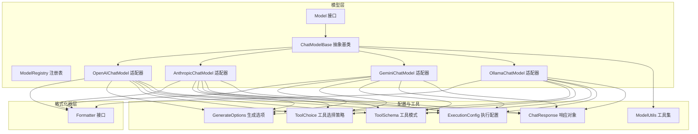
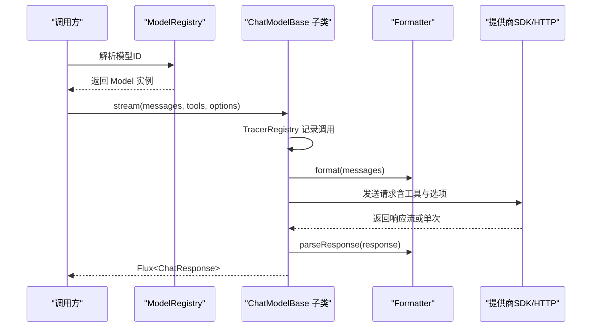
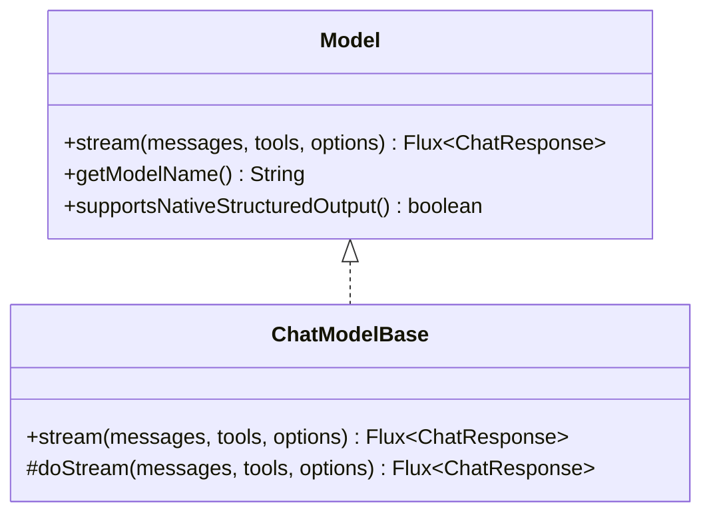
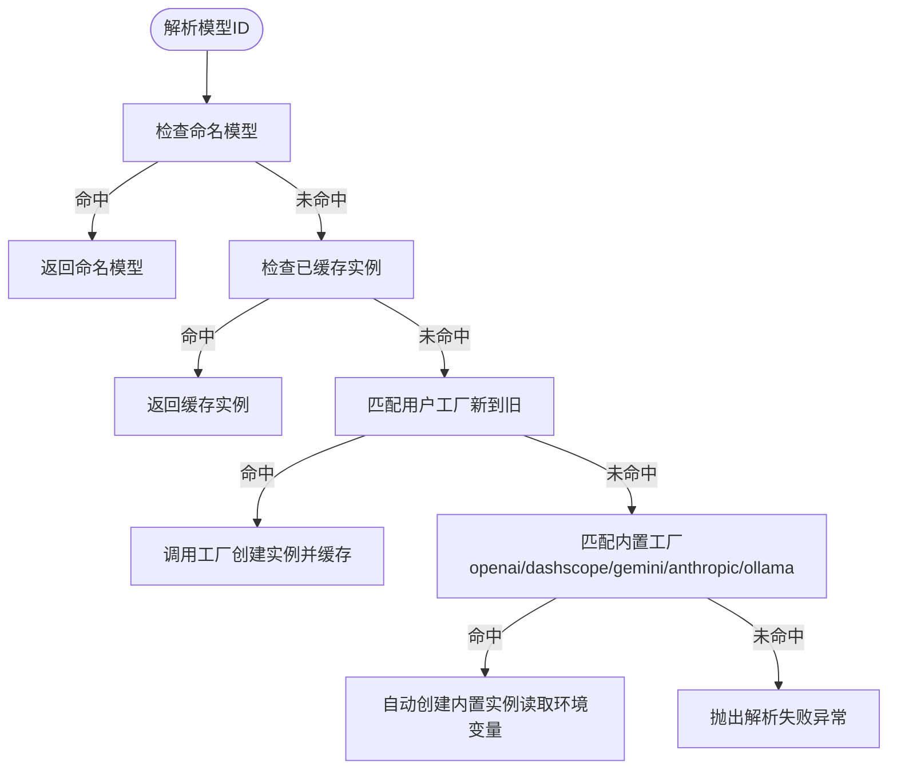
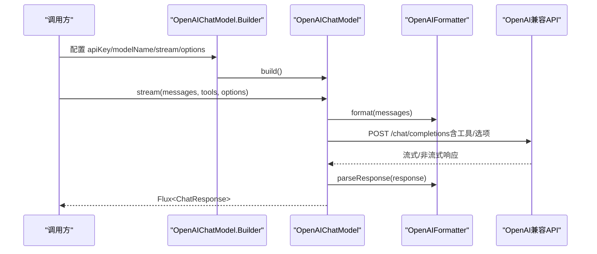
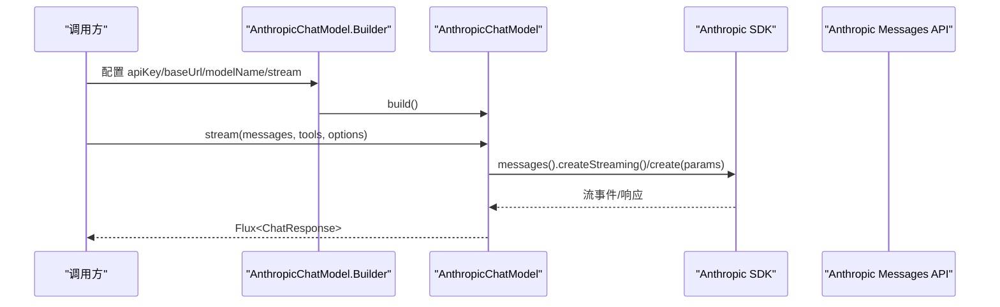
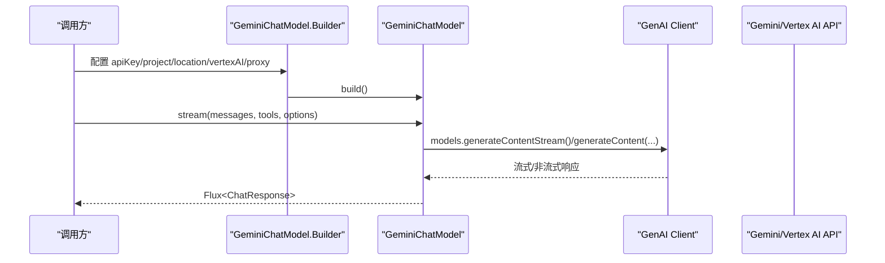
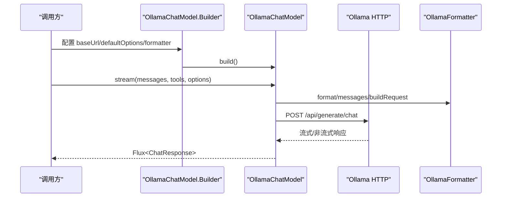
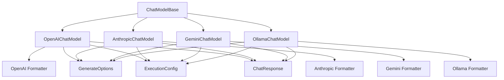

# 模型API

<cite>
**本文引用的文件**
- [Model.java](file://agentscope-core/src/main/java/io/agentscope/core/model/Model.java)
- [ChatModelBase.java](file://agentscope-core/src/main/java/io/agentscope/core/model/ChatModelBase.java)
- [ModelRegistry.java](file://agentscope-core/src/main/java/io/agentscope/core/model/ModelRegistry.java)
- [OpenAIChatModel.java](file://agentscope-core/src/main/java/io/agentscope/core/model/OpenAIChatModel.java)
- [AnthropicChatModel.java](file://agentscope-core/src/main/java/io/agentscope/core/model/AnthropicChatModel.java)
- [GeminiChatModel.java](file://agentscope-core/src/main/java/io/agentscope/core/model/GeminiChatModel.java)
- [OllamaChatModel.java](file://agentscope-core/src/main/java/io/agentscope/core/model/OllamaChatModel.java)
- [Formatter.java](file://agentscope-core/src/main/java/io/agentscope/core/formatter/Formatter.java)
- [GenerateOptions.java](file://agentscope-core/src/main/java/io/agentscope/core/model/GenerateOptions.java)
- [ToolSchema.java](file://agentscope-core/src/main/java/io/agentscope/core/model/ToolSchema.java)
- [ToolChoice.java](file://agentscope-core/src/main/java/io/agentscope/core/model/ToolChoice.java)
- [ExecutionConfig.java](file://agentscope-core/src/main/java/io/agentscope/core/model/ExecutionConfig.java)
- [ChatResponse.java](file://agentscope-core/src/main/java/io/agentscope/core/model/ChatResponse.java)
- [ModelUtils.java](file://agentscope-core/src/main/java/io/agentscope/core/model/ModelUtils.java)
</cite>

## 目录
1. [简介](#简介)
2. [项目结构](#项目结构)
3. [核心组件](#核心组件)
4. [架构总览](#架构总览)
5. [详细组件分析](#详细组件分析)
6. [依赖分析](#依赖分析)
7. [性能考虑](#性能考虑)
8. [故障排查指南](#故障排查指南)
9. [结论](#结论)
10. [附录](#附录)

## 简介
本文件为 AgentScope 模型系统的详细 API 参考文档，覆盖以下主题：
- Model 接口、ChatModelBase 抽象基类与 ModelRegistry 注册表的公共方法与配置项
- 模型工厂与格式化器（Formatter）的 API 规范
- 不同提供商（OpenAI、Anthropic、Gemini、Ollama）的模型适配器接口与使用方式
- 模型配置、认证与调用流程的完整说明
- 流式响应处理与批量操作相关接口

本参考面向开发者与集成工程师，既提供代码级细节，也强调可操作性与最佳实践。

## 项目结构
AgentScope 的模型层位于 agentscope-core 模块中，核心文件组织如下：
- model 包：定义统一的模型接口、抽象基类、具体适配器、工具与执行配置
- formatter 包：定义跨提供商的消息格式化器接口与实现
- message 包：消息与内容块类型（在模型适配器中被复用）
- transport 包：HTTP 传输层抽象（在部分适配器中使用）

图表来源
- [Model.java:22-53](file://agentscope-core/src/main/java/io/agentscope/core/model/Model.java#L22-L53)
- [ChatModelBase.java:29-61](file://agentscope-core/src/main/java/io/agentscope/core/model/ChatModelBase.java#L29-L61)
- [ModelRegistry.java:35-260](file://agentscope-core/src/main/java/io/agentscope/core/model/ModelRegistry.java#L35-L260)
- [OpenAIChatModel.java:61-445](file://agentscope-core/src/main/java/io/agentscope/core/model/OpenAIChatModel.java#L61-L445)
- [AnthropicChatModel.java:55-349](file://agentscope-core/src/main/java/io/agentscope/core/model/AnthropicChatModel.java#L55-L349)
- [GeminiChatModel.java:57-622](file://agentscope-core/src/main/java/io/agentscope/core/model/GeminiChatModel.java#L57-L622)
- [OllamaChatModel.java:56-379](file://agentscope-core/src/main/java/io/agentscope/core/model/OllamaChatModel.java#L56-L379)
- [Formatter.java:45-135](file://agentscope-core/src/main/java/io/agentscope/core/formatter/Formatter.java#L45-L135)
- [GenerateOptions.java:32-904](file://agentscope-core/src/main/java/io/agentscope/core/model/GenerateOptions.java#L32-L904)
- [ToolChoice.java:45-84](file://agentscope-core/src/main/java/io/agentscope/core/model/ToolChoice.java#L45-L84)
- [ToolSchema.java:28-182](file://agentscope-core/src/main/java/io/agentscope/core/model/ToolSchema.java#L28-L182)
- [ExecutionConfig.java:56-394](file://agentscope-core/src/main/java/io/agentscope/core/model/ExecutionConfig.java#L56-L394)
- [ChatResponse.java:29-207](file://agentscope-core/src/main/java/io/agentscope/core/model/ChatResponse.java#L29-L207)
- [ModelUtils.java:31-178](file://agentscope-core/src/main/java/io/agentscope/core/model/ModelUtils.java#L31-L178)

章节来源
- [Model.java:22-53](file://agentscope-core/src/main/java/io/agentscope/core/model/Model.java#L22-L53)
- [ChatModelBase.java:29-61](file://agentscope-core/src/main/java/io/agentscope/core/model/ChatModelBase.java#L29-L61)
- [ModelRegistry.java:35-260](file://agentscope-core/src/main/java/io/agentscope/core/model/ModelRegistry.java#L35-L260)

## 核心组件
本节概述模型系统的关键构件及其职责。

- Model 接口
  - 定义统一的流式对话接口 stream，接收消息列表、工具模式与生成选项，并返回响应流
  - 提供 getModelName 获取模型标识
  - 支持原生结构化输出能力的默认方法

- ChatModelBase 抽象基类
  - 统一实现 stream 调用，内部通过 TracerRegistry 进行调用追踪
  - 子类需实现 doStream 完成具体提供商的调用逻辑

- ModelRegistry 注册表
  - 提供模型解析与实例化：支持命名模型、用户自定义工厂与内置提供商规则
  - 内置规则覆盖 openai、dashscope/qwen、anthropic、gemini、ollama
  - 自动从环境变量加载密钥（如 OPENAI_API_KEY、DASHSCOPE_API_KEY、GEMINI_API_KEY、ANTHROPIC_API_KEY、OLLAMA_BASE_URL）

- GenerateOptions 生成选项
  - 合并连接级参数（apiKey、baseUrl、endpointPath、modelName、stream）与生成参数（temperature、topP、maxTokens、toolChoice、responseFormat 等）
  - 支持额外请求头、请求体与查询参数注入
  - 提供合并策略以支持多层级配置叠加

- ToolSchema 与 ToolChoice
  - ToolSchema 描述工具的名称、描述、JSON 参数模式与可选输出模式
  - ToolChoice 控制工具调用策略（Auto、None、Required、Specific）

- ExecutionConfig 执行配置
  - 统一超时与重试配置，支持指数退避与错误过滤
  - 提供模型与工具的标准默认值

- ChatResponse 响应对象
  - 封装响应内容、用量统计、元数据与结束原因
  - 支持响应 ID 的自动补全（对不返回 ID 的提供商）

- ModelUtils 工具集
  - 为响应流应用超时与重试
  - 确保生成选项具备默认执行配置

章节来源
- [Model.java:22-53](file://agentscope-core/src/main/java/io/agentscope/core/model/Model.java#L22-L53)
- [ChatModelBase.java:29-61](file://agentscope-core/src/main/java/io/agentscope/core/model/ChatModelBase.java#L29-L61)
- [ModelRegistry.java:35-260](file://agentscope-core/src/main/java/io/agentscope/core/model/ModelRegistry.java#L35-L260)
- [GenerateOptions.java:32-904](file://agentscope-core/src/main/java/io/agentscope/core/model/GenerateOptions.java#L32-L904)
- [ToolSchema.java:28-182](file://agentscope-core/src/main/java/io/agentscope/core/model/ToolSchema.java#L28-L182)
- [ToolChoice.java:45-84](file://agentscope-core/src/main/java/io/agentscope/core/model/ToolChoice.java#L45-L84)
- [ExecutionConfig.java:56-394](file://agentscope-core/src/main/java/io/agentscope/core/model/ExecutionConfig.java#L56-L394)
- [ChatResponse.java:29-207](file://agentscope-core/src/main/java/io/agentscope/core/model/ChatResponse.java#L29-L207)
- [ModelUtils.java:31-178](file://agentscope-core/src/main/java/io/agentscope/core/model/ModelUtils.java#L31-L178)

## 架构总览
下图展示模型适配器如何通过统一接口与格式化器对接不同提供商，并由注册表进行解析与实例化。

图表来源
- [ModelRegistry.java:142-173](file://agentscope-core/src/main/java/io/agentscope/core/model/ModelRegistry.java#L142-L173)
- [ChatModelBase.java:42-48](file://agentscope-core/src/main/java/io/agentscope/core/model/ChatModelBase.java#L42-L48)
- [Formatter.java:45-135](file://agentscope-core/src/main/java/io/agentscope/core/formatter/Formatter.java#L45-L135)
- [OpenAIChatModel.java:86-182](file://agentscope-core/src/main/java/io/agentscope/core/model/OpenAIChatModel.java#L86-L182)
- [AnthropicChatModel.java:134-221](file://agentscope-core/src/main/java/io/agentscope/core/model/AnthropicChatModel.java#L134-L221)
- [GeminiChatModel.java:226-312](file://agentscope-core/src/main/java/io/agentscope/core/model/GeminiChatModel.java#L226-L312)
- [OllamaChatModel.java:138-236](file://agentscope-core/src/main/java/io/agentscope/core/model/OllamaChatModel.java#L138-L236)

## 详细组件分析

### Model 接口与 ChatModelBase 抽象基类
- Model 接口
  - stream(List<Msg>, List<ToolSchema>, GenerateOptions) -> Flux<ChatResponse>
  - getModelName(): String
  - supportsNativeStructuredOutput(): boolean（默认 false，可在支持的适配器中覆写）

- ChatModelBase
  - stream 调用 TracerRegistry.wrap 并委托给 doStream（子类必须实现）
  - doStream(List<Msg>, List<ToolSchema>, GenerateOptions) -> Flux<ChatResponse>

图表来源
- [Model.java:22-53](file://agentscope-core/src/main/java/io/agentscope/core/model/Model.java#L22-L53)
- [ChatModelBase.java:29-61](file://agentscope-core/src/main/java/io/agentscope/core/model/ChatModelBase.java#L29-L61)

章节来源
- [Model.java:22-53](file://agentscope-core/src/main/java/io/agentscope/core/model/Model.java#L22-L53)
- [ChatModelBase.java:29-61](file://agentscope-core/src/main/java/io/agentscope/core/model/ChatModelBase.java#L29-L61)

### ModelRegistry 注册表
- 功能要点
  - register(name, model): 注册命名模型
  - registerFactory(regex, factory): 注册用户自定义工厂（优先于内置规则）
  - resolve(modelId): 解析模型ID，按“命名模型 -> 缓存实例 -> 用户工厂 -> 内置工厂”顺序查找
  - canResolve(modelId): 判断是否可解析（不创建实例）
  - reset(): 清空命名模型、用户工厂与缓存（测试用途）

- 内置规则（正则匹配）
  - openai:<model>：从 OPENAI_API_KEY 加载密钥
  - dashscope:<model>：从 DASHSCOPE_API_KEY 加载密钥
  - qwen.*：短名 qwen* 从 DASHSCOPE_API_KEY 加载密钥
  - anthropic:<model>：从 ANTHROPIC_API_KEY 加载密钥
  - gemini:<model>：从 GEMINI_API_KEY 加载密钥
  - ollama:<model>：从 OLLAMA_BASE_URL 加载基础地址（默认 http://localhost:11434）

图表来源
- [ModelRegistry.java:142-173](file://agentscope-core/src/main/java/io/agentscope/core/model/ModelRegistry.java#L142-L173)
- [ModelRegistry.java:214-226](file://agentscope-core/src/main/java/io/agentscope/core/model/ModelRegistry.java#L214-L226)

章节来源
- [ModelRegistry.java:35-260](file://agentscope-core/src/main/java/io/agentscope/core/model/ModelRegistry.java#L35-L260)

### OpenAIChatModel 适配器
- 关键特性
  - 使用 OpenAI 兼容 HTTP API，支持流式与非流式
  - 通过 Formatter 将 AgentScope 消息转换为 OpenAI 请求格式
  - 支持工具调用、工具选择、缓存控制、响应格式与额外参数
  - 支持自定义端点路径与代理配置（通过 HttpTransport 或 ProxyConfig）
  - 支持原生结构化输出（supportsNativeStructuredOutput 返回 true）

- Builder 主要配置项
  - apiKey、modelName、stream、generateOptions、baseUrl、endpointPath、formatter、httpTransport、proxy

- 调用流程
  - 合并 options 与默认配置
  - 选择流式/非流式模式
  - 应用工具与选项（含缓存控制）
  - 发起请求并解析响应

图表来源
- [OpenAIChatModel.java:214-444](file://agentscope-core/src/main/java/io/agentscope/core/model/OpenAIChatModel.java#L214-L444)
- [OpenAIChatModel.java:86-182](file://agentscope-core/src/main/java/io/agentscope/core/model/OpenAIChatModel.java#L86-L182)

章节来源
- [OpenAIChatModel.java:61-445](file://agentscope-core/src/main/java/io/agentscope/core/model/OpenAIChatModel.java#L61-L445)

### AnthropicChatModel 适配器
- 关键特性
  - 使用官方 Anthropic Java SDK 的 Messages API
  - 支持流式与非流式调用、工具调用、系统消息处理
  - 支持代理配置（仅基础代理信息，不支持认证与 nonProxyHosts）

- Builder 主要配置项
  - baseUrl、apiKey、modelName、streamEnabled、defaultOptions、formatter、proxy

- 调用流程
  - 构建 MessageCreateParams（含系统消息提取、工具与选项应用）
  - 流式：创建流式响应；非流式：异步获取结果
  - 解析事件/响应为 ChatResponse

图表来源
- [AnthropicChatModel.java:242-348](file://agentscope-core/src/main/java/io/agentscope/core/model/AnthropicChatModel.java#L242-L348)
- [AnthropicChatModel.java:134-221](file://agentscope-core/src/main/java/io/agentscope/core/model/AnthropicChatModel.java#L134-L221)

章节来源
- [AnthropicChatModel.java:55-349](file://agentscope-core/src/main/java/io/agentscope/core/model/AnthropicChatModel.java#L55-L349)

### GeminiChatModel 适配器
- 关键特性
  - 使用官方 Google GenAI Java SDK
  - 支持文本、视觉、音频、视频等多模态内容
  - 支持 Vertex AI 与 Gemini API 两种模式
  - 支持代理配置（与 ClientOptions 智能合并）

- Builder 主要配置项
  - apiKey、baseUrl、modelName、streamEnabled、project、location、vertexAI、httpOptions、credentials、clientOptions、defaultOptions、formatter、proxy

- 调用流程
  - 构建 GenerateContentConfig（含工具与选项）
  - 流式：使用 ResponseStream；非流式：直接获取响应
  - 解析响应为 ChatResponse

图表来源
- [GeminiChatModel.java:344-621](file://agentscope-core/src/main/java/io/agentscope/core/model/GeminiChatModel.java#L344-L621)
- [GeminiChatModel.java:226-312](file://agentscope-core/src/main/java/io/agentscope/core/model/GeminiChatModel.java#L226-L312)

章节来源
- [GeminiChatModel.java:57-622](file://agentscope-core/src/main/java/io/agentscope/core/model/GeminiChatModel.java#L57-L622)

### OllamaChatModel 适配器
- 关键特性
  - 本地 Ollama 实例 HTTP API 集成
  - 支持 OllamaOptions 与 GenerateOptions 的双向转换
  - 支持流式与非流式调用、工具调用、多代理格式化器
  - 支持代理配置（与 HttpTransport 智能合并）

- Builder 主要配置项
  - modelName、baseUrl、defaultOptions、formatter、httpTransport、proxy

- 调用流程
  - 通过 Formatter 构建请求（支持聊天与多智能体场景）
  - 流式：聚合响应并稳定响应 ID；非流式：同步获取
  - 应用超时与重试（基于 OllamaOptions 转换后的配置）

图表来源
- [OllamaChatModel.java:238-379](file://agentscope-core/src/main/java/io/agentscope/core/model/OllamaChatModel.java#L238-L379)
- [OllamaChatModel.java:138-236](file://agentscope-core/src/main/java/io/agentscope/core/model/OllamaChatModel.java#L138-L236)

章节来源
- [OllamaChatModel.java:56-379](file://agentscope-core/src/main/java/io/agentscope/core/model/OllamaChatModel.java#L56-L379)

### Formatter 接口与提供商格式化器
- Formatter<TReq, TResp, TParams> 责任边界
  - format(List<Msg>) -> List<TReq>
  - parseResponse(TResp, Instant) -> ChatResponse
  - applyOptions(TParams, GenerateOptions, GenerateOptions) -> void
  - applyTools(TParams, List<ToolSchema>) -> void
  - applyTools(TParams, List<ToolSchema>, baseUrl, modelName) -> void（可选）
  - applyToolChoice(TParams, ToolChoice) -> void（可选）
  - applyToolChoice(TParams, ToolChoice, baseUrl, modelName) -> void（可选）

- 在各适配器中的作用
  - OpenAIChatModel：OpenAIChatFormatter 等
  - AnthropicChatModel：AnthropicChatFormatter 等
  - GeminiChatModel：GeminiChatFormatter
  - OllamaChatModel：OllamaChatFormatter、OllamaMultiAgentFormatter

章节来源
- [Formatter.java:45-135](file://agentscope-core/src/main/java/io/agentscope/core/formatter/Formatter.java#L45-L135)

### GenerateOptions 生成选项
- 连接级参数
  - apiKey、baseUrl、endpointPath、modelName、stream
- 生成参数
  - temperature、topP、maxTokens、maxCompletionTokens、frequencyPenalty、presencePenalty、thinkingBudget、reasoningEffort、toolChoice、topK、seed、cacheControl、parallelToolCalls、responseFormat、additionalHeaders、additionalBodyParams、additionalQueryParams
- 执行配置
  - executionConfig（超时、重试、退避、错误过滤）
- 合并策略
  - mergeOptions(primary, fallback)：逐字段优先级合并，Map 类型采用 fallback+primary 覆盖策略

章节来源
- [GenerateOptions.java:32-904](file://agentscope-core/src/main/java/io/agentscope/core/model/GenerateOptions.java#L32-L904)

### ToolSchema 与 ToolChoice
- ToolSchema
  - name、description、parameters（JSON Schema）、outputSchema（可选）、strict（可选）
- ToolChoice
  - Auto、None、Required、Specific(toolName)

章节来源
- [ToolSchema.java:28-182](file://agentscope-core/src/main/java/io/agentscope/core/model/ToolSchema.java#L28-L182)
- [ToolChoice.java:45-84](file://agentscope-core/src/main/java/io/agentscope/core/model/ToolChoice.java#L45-L84)

### ExecutionConfig 执行配置
- 字段
  - timeout、maxAttempts、initialBackoff、maxBackoff、backoffMultiplier、retryOn
- 默认值
  - MODEL_DEFAULTS：5 分钟超时、3 次尝试、初始 2 秒、最大 30 秒、指数倍数 2.0、仅对可重试错误重试
  - TOOL_DEFAULTS：5 分钟超时、1 次尝试
- 合并策略
  - mergeConfigs(primary, fallback)：逐字段优先级合并

章节来源
- [ExecutionConfig.java:56-394](file://agentscope-core/src/main/java/io/agentscope/core/model/ExecutionConfig.java#L56-L394)

### ChatResponse 响应对象
- 字段
  - id、content（ContentBlock 列表）、usage（ChatUsage）、metadata、finishReason
- 行为
  - withId 新 ID 构造副本
  - Builder 自动补全空 ID（UUID）

章节来源
- [ChatResponse.java:29-207](file://agentscope-core/src/main/java/io/agentscope/core/model/ChatResponse.java#L29-L207)

### ModelUtils 工具集
- applyTimeoutAndRetry
  - 对 Flux 应用 timeout 与指数退避重试
  - 基于 ExecutionConfig 配置，支持可选超时与可选重试
- ensureDefaultExecutionConfig
  - 为 GenerateOptions 确保 MODEL_DEFAULTS 执行配置

章节来源
- [ModelUtils.java:31-178](file://agentscope-core/src/main/java/io/agentscope/core/model/ModelUtils.java#L31-L178)

## 依赖分析
- 组件耦合
  - 所有适配器均继承 ChatModelBase，统一流式调用与追踪
  - 适配器依赖 Formatter 进行消息与响应的跨提供商转换
  - 适配器依赖 GenerateOptions/ToolSchema/ToolChoice/ExecutionConfig 提供一致的配置入口
  - ModelRegistry 作为解析与实例化的唯一入口，避免上层直接依赖具体适配器

- 外部依赖
  - OpenAI：HTTP API 与 OpenAI SDK（在部分实现中）
  - Anthropic：官方 Java SDK（Messages API）
  - Google GenAI：官方 Java SDK（Gemini/Vertex AI）
  - Ollama：本地 HTTP API

图表来源
- [ChatModelBase.java:29-61](file://agentscope-core/src/main/java/io/agentscope/core/model/ChatModelBase.java#L29-L61)
- [OpenAIChatModel.java:61-445](file://agentscope-core/src/main/java/io/agentscope/core/model/OpenAIChatModel.java#L61-L445)
- [AnthropicChatModel.java:55-349](file://agentscope-core/src/main/java/io/agentscope/core/model/AnthropicChatModel.java#L55-L349)
- [GeminiChatModel.java:57-622](file://agentscope-core/src/main/java/io/agentscope/core/model/GeminiChatModel.java#L57-L622)
- [OllamaChatModel.java:56-379](file://agentscope-core/src/main/java/io/agentscope/core/model/OllamaChatModel.java#L56-L379)
- [Formatter.java:45-135](file://agentscope-core/src/main/java/io/agentscope/core/formatter/Formatter.java#L45-L135)
- [GenerateOptions.java:32-904](file://agentscope-core/src/main/java/io/agentscope/core/model/GenerateOptions.java#L32-L904)
- [ExecutionConfig.java:56-394](file://agentscope-core/src/main/java/io/agentscope/core/model/ExecutionConfig.java#L56-L394)
- [ChatResponse.java:29-207](file://agentscope-core/src/main/java/io/agentscope/core/model/ChatResponse.java#L29-L207)

## 性能考虑
- 流式响应
  - 适配器普遍支持流式输出，建议在高延迟网络或长上下文场景启用流式以提升感知性能
- 超时与重试
  - 使用 ExecutionConfig 配置合理的超时与重试策略，避免长时间阻塞
  - 对于高并发场景，适当提高初始与最大退避时间以缓解限流
- 代理与网络
  - 通过 ProxyConfig 或 HttpTransport 配置代理，注意与 SDK 自身代理能力的交互差异
- 结构化输出
  - 在支持原生结构化输出的适配器（如 OpenAI）中优先使用 response_format，减少工具合成开销

## 故障排查指南
- 模型解析失败
  - 检查 ModelRegistry.resolve 的错误提示，确认命名模型是否存在、工厂是否匹配、环境变量是否正确设置
- 认证失败
  - 确认对应 PROVIDER_API_KEY 环境变量已设置且有效
- 超时与重试
  - 检查 ExecutionConfig 的 timeout 与 maxAttempts 设置，必要时调整退避参数
- 代理问题
  - 对于 Gemini：ClientOptions 与 proxy() 同时设置时会进行智能合并，若已有代理配置则忽略后续设置
  - 对于 OpenAI/Ollama：httpTransport 优先于 proxy，二者同时设置时 proxy 会被忽略
- 响应缺失 ID
  - 部分提供商（如 Ollama）不返回 ID，ChatResponse.Builder 会自动生成 UUID，确保下游逻辑兼容

章节来源
- [ModelRegistry.java:244-259](file://agentscope-core/src/main/java/io/agentscope/core/model/ModelRegistry.java#L244-L259)
- [GeminiChatModel.java:566-620](file://agentscope-core/src/main/java/io/agentscope/core/model/GeminiChatModel.java#L566-L620)
- [OpenAIChatModel.java:420-443](file://agentscope-core/src/main/java/io/agentscope/core/model/OpenAIChatModel.java#L420-L443)
- [OllamaChatModel.java:354-377](file://agentscope-core/src/main/java/io/agentscope/core/model/OllamaChatModel.java#L354-L377)
- [ChatResponse.java:198-205](file://agentscope-core/src/main/java/io/agentscope/core/model/ChatResponse.java#L198-L205)

## 结论
AgentScope 模型系统通过统一的 Model 接口与 ChatModelBase 抽象，结合灵活的 ModelRegistry 解析机制与强大的 GenerateOptions/ExecutionConfig 配置体系，实现了对多家提供商的无缝集成。Formatter 将消息与响应标准化，使上层业务逻辑与底层实现解耦。借助流式响应、超时与重试、代理与结构化输出等能力，系统在易用性与可扩展性之间取得良好平衡。

## 附录

### API 一览表（关键方法与属性）
- Model
  - stream(messages, tools, options) -> Flux<ChatResponse>
  - getModelName() -> String
  - supportsNativeStructuredOutput() -> boolean

- ChatModelBase
  - stream(...) -> Flux<ChatResponse>
  - doStream(...) -> Flux<ChatResponse>（抽象）

- ModelRegistry
  - register(name, model)
  - registerFactory(regex, factory)
  - resolve(modelId) -> Model
  - canResolve(modelId) -> boolean
  - reset()

- OpenAIChatModel.Builder
  - apiKey、modelName、stream、generateOptions、baseUrl、endpointPath、formatter、httpTransport、proxy
  - build() -> OpenAIChatModel

- AnthropicChatModel.Builder
  - baseUrl、apiKey、modelName、stream、defaultOptions、formatter、proxy
  - build() -> AnthropicChatModel

- GeminiChatModel.Builder
  - apiKey、baseUrl、modelName、streamEnabled、project、location、vertexAI、httpOptions、credentials、clientOptions、defaultOptions、formatter、proxy
  - build() -> GeminiChatModel

- OllamaChatModel.Builder
  - modelName、baseUrl、defaultOptions、formatter、httpTransport、proxy
  - build() -> OllamaChatModel

- GenerateOptions
  - builder() -> Builder
  - mergeOptions(primary, fallback) -> GenerateOptions
  - 各种 getter 方法（apiKey、baseUrl、endpointPath、modelName、stream、temperature、topP、maxTokens、toolChoice、responseFormat、executionConfig 等）

- ToolSchema
  - builder() -> Builder
  - name、description、parameters、outputSchema、strict

- ToolChoice
  - Auto、None、Required、Specific(toolName)

- ExecutionConfig
  - builder() -> Builder
  - mergeConfigs(primary, fallback) -> ExecutionConfig
  - MODEL_DEFAULTS、TOOL_DEFAULTS

- ChatResponse
  - builder() -> Builder
  - getId()、getContent()、getUsage()、getMetadata()、getFinishReason()
  - withId(newId) -> ChatResponse

- ModelUtils
  - applyTimeoutAndRetry(flux, options, defaultOptions, modelName, provider) -> Flux<ChatResponse>
  - ensureDefaultExecutionConfig(options) -> GenerateOptions

章节来源
- [Model.java:22-53](file://agentscope-core/src/main/java/io/agentscope/core/model/Model.java#L22-L53)
- [ChatModelBase.java:29-61](file://agentscope-core/src/main/java/io/agentscope/core/model/ChatModelBase.java#L29-L61)
- [ModelRegistry.java:114-201](file://agentscope-core/src/main/java/io/agentscope/core/model/ModelRegistry.java#L114-L201)
- [OpenAIChatModel.java:214-444](file://agentscope-core/src/main/java/io/agentscope/core/model/OpenAIChatModel.java#L214-L444)
- [AnthropicChatModel.java:242-348](file://agentscope-core/src/main/java/io/agentscope/core/model/AnthropicChatModel.java#L242-L348)
- [GeminiChatModel.java:344-621](file://agentscope-core/src/main/java/io/agentscope/core/model/GeminiChatModel.java#L344-L621)
- [OllamaChatModel.java:238-379](file://agentscope-core/src/main/java/io/agentscope/core/model/OllamaChatModel.java#L238-L379)
- [GenerateOptions.java:392-904](file://agentscope-core/src/main/java/io/agentscope/core/model/GenerateOptions.java#L392-L904)
- [ToolSchema.java:104-182](file://agentscope-core/src/main/java/io/agentscope/core/model/ToolSchema.java#L104-L182)
- [ToolChoice.java:45-84](file://agentscope-core/src/main/java/io/agentscope/core/model/ToolChoice.java#L45-L84)
- [ExecutionConfig.java:240-394](file://agentscope-core/src/main/java/io/agentscope/core/model/ExecutionConfig.java#L240-L394)
- [ChatResponse.java:120-207](file://agentscope-core/src/main/java/io/agentscope/core/model/ChatResponse.java#L120-L207)
- [ModelUtils.java:69-178](file://agentscope-core/src/main/java/io/agentscope/core/model/ModelUtils.java#L69-L178)