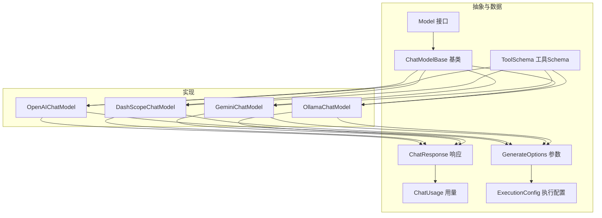
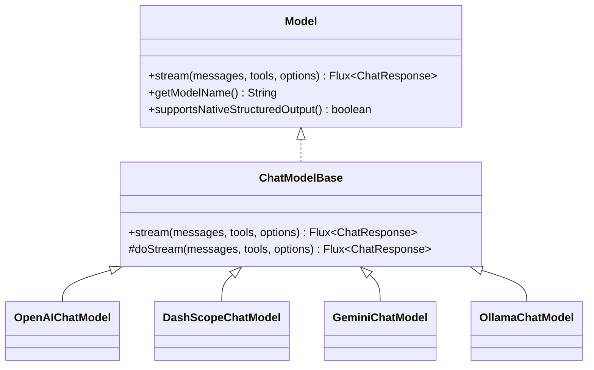
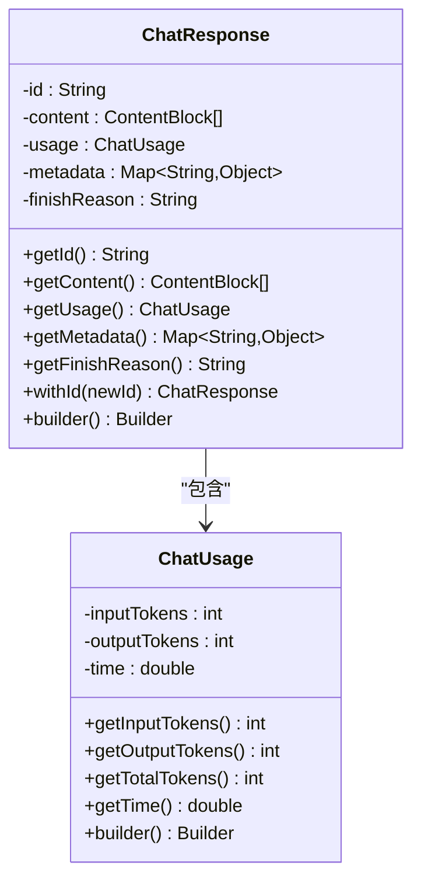
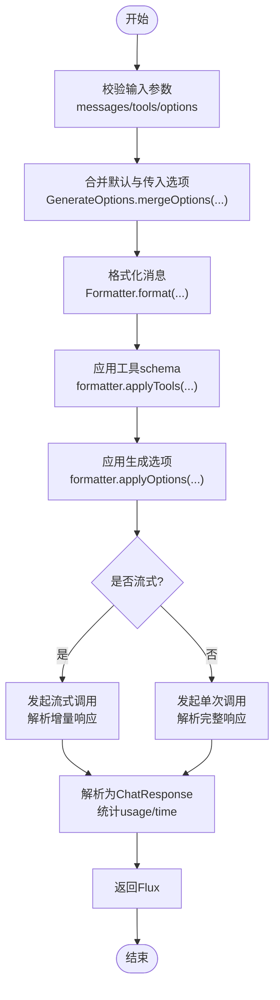
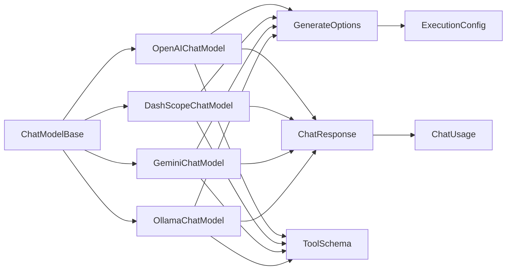

# 模型接口

<cite>
**本文引用的文件**
- [Model.java](file://agentscope-core/src/main/java/io/agentscope/core/model/Model.java)
- [ChatModelBase.java](file://agentscope-core/src/main/java/io/agentscope/core/model/ChatModelBase.java)
- [ChatResponse.java](file://agentscope-core/src/main/java/io/agentscope/core/model/ChatResponse.java)
- [ChatUsage.java](file://agentscope-core/src/main/java/io/agentscope/core/model/ChatUsage.java)
- [GenerateOptions.java](file://agentscope-core/src/main/java/io/agentscope/core/model/GenerateOptions.java)
- [ToolSchema.java](file://agentscope-core/src/main/java/io/agentscope/core/model/ToolSchema.java)
- [ExecutionConfig.java](file://agentscope-core/src/main/java/io/agentscope/core/model/ExecutionConfig.java)
- [OpenAIChatModel.java](file://agentscope-core/src/main/java/io/agentscope/core/model/OpenAIChatModel.java)
- [DashScopeChatModel.java](file://agentscope-core/src/main/java/io/agentscope/core/model/DashScopeChatModel.java)
- [GeminiChatModel.java](file://agentscope-core/src/main/java/io/agentscope/core/model/GeminiChatModel.java)
- [OllamaChatModel.java](file://agentscope-core/src/main/java/io/agentscope/core/model/OllamaChatModel.java)
</cite>

## 目录
1. [简介](#简介)
2. [项目结构](#项目结构)
3. [核心组件](#核心组件)
4. [架构总览](#架构总览)
5. [详细组件分析](#详细组件分析)
6. [依赖分析](#依赖分析)
7. [性能考虑](#性能考虑)
8. [故障排查指南](#故障排查指南)
9. [结论](#结论)
10. [附录](#附录)

## 简介
本文件面向AgentScope的模型接口，聚焦于Model接口与ChatModelBase基类的设计与使用，系统性说明stream方法的参数、返回值与调用流程；详解ChatResponse与ChatUsage数据结构及字段语义；给出模型实现指南与最佳实践，并提供流式响应处理的完整示例与错误处理策略。

## 项目结构
AgentScope在agentscope-core模块中提供了统一的模型抽象与多种具体实现：
- 抽象层：Model接口定义统一能力；ChatModelBase提供通用流式调用与追踪封装。
- 数据层：ChatResponse承载响应内容、用量与元数据；ChatUsage描述token用量与时延；GenerateOptions集中管理请求级与生成级参数；ToolSchema描述工具schema；ExecutionConfig统一超时与重试配置。
- 实现层：OpenAIChatModel、DashScopeChatModel、GeminiChatModel、OllamaChatModel等分别对接不同推理后端。



图表来源
- [Model.java:22-53](file://agentscope-core/src/main/java/io/agentscope/core/model/Model.java#L22-L53)
- [ChatModelBase.java:29-61](file://agentscope-core/src/main/java/io/agentscope/core/model/ChatModelBase.java#L29-L61)
- [ChatResponse.java:29-207](file://agentscope-core/src/main/java/io/agentscope/core/model/ChatResponse.java#L29-L207)
- [ChatUsage.java:27-145](file://agentscope-core/src/main/java/io/agentscope/core/model/ChatUsage.java#L27-L145)
- [GenerateOptions.java:32-98](file://agentscope-core/src/main/java/io/agentscope/core/model/GenerateOptions.java#L32-L98)
- [ToolSchema.java:28-182](file://agentscope-core/src/main/java/io/agentscope/core/model/ToolSchema.java#L28-L182)
- [ExecutionConfig.java:56-394](file://agentscope-core/src/main/java/io/agentscope/core/model/ExecutionConfig.java#L56-L394)
- [OpenAIChatModel.java:61-445](file://agentscope-core/src/main/java/io/agentscope/core/model/OpenAIChatModel.java#L61-L445)
- [DashScopeChatModel.java:55-682](file://agentscope-core/src/main/java/io/agentscope/core/model/DashScopeChatModel.java#L55-L682)
- [GeminiChatModel.java:57-622](file://agentscope-core/src/main/java/io/agentscope/core/model/GeminiChatModel.java#L57-L622)
- [OllamaChatModel.java:56-379](file://agentscope-core/src/main/java/io/agentscope/core/model/OllamaChatModel.java#L56-L379)

章节来源
- [Model.java:22-53](file://agentscope-core/src/main/java/io/agentscope/core/model/Model.java#L22-L53)
- [ChatModelBase.java:29-61](file://agentscope-core/src/main/java/io/agentscope/core/model/ChatModelBase.java#L29-L61)

## 核心组件
- Model接口
  - 定义了stream方法用于流式对话补全；提供getModelName与supportsNativeStructuredOutput扩展点。
  - 支持通过GenerateOptions传递连接级（如apiKey、baseUrl、endpointPath、modelName、stream）与生成级（温度、采样、工具选择、响应格式等）参数。
- ChatModelBase基类
  - 统一封装stream调用，内部委托doStream实现；自动集成TracerRegistry进行调用追踪。
  - 子类仅需实现doStream以完成具体协议适配。
- ChatResponse与ChatUsage
  - ChatResponse包含id、content、usage、metadata、finishReason；提供withId与Builder便于构造与兼容性处理（如无id时自动生成UUID）。
  - ChatUsage包含inputTokens、outputTokens、time；提供getTotalTokens汇总。
- ToolSchema
  - 描述工具名称、描述、参数JSON Schema、输出Schema与严格模式标志。
- ExecutionConfig
  - 统一超时、最大尝试次数、指数退避上限与触发重试的谓词；内置MODEL_DEFAULTS与TOOL_DEFAULTS。

章节来源
- [Model.java:22-53](file://agentscope-core/src/main/java/io/agentscope/core/model/Model.java#L22-L53)
- [ChatModelBase.java:42-61](file://agentscope-core/src/main/java/io/agentscope/core/model/ChatModelBase.java#L42-L61)
- [ChatResponse.java:46-113](file://agentscope-core/src/main/java/io/agentscope/core/model/ChatResponse.java#L46-L113)
- [ChatUsage.java:41-84](file://agentscope-core/src/main/java/io/agentscope/core/model/ChatUsage.java#L41-L84)
- [ToolSchema.java:40-97](file://agentscope-core/src/main/java/io/agentscope/core/model/ToolSchema.java#L40-L97)
- [ExecutionConfig.java:151-170](file://agentscope-core/src/main/java/io/agentscope/core/model/ExecutionConfig.java#L151-L170)

## 架构总览
下图展示从调用方到具体模型实现的调用链路与关键数据流转：

```mermaid
sequenceDiagram
participant Caller as "调用方"
participant Base as "ChatModelBase"
participant Impl as "具体模型实现<br/>OpenAI/DashScope/Gemini/Ollama"
participant Opt as "GenerateOptions"
participant Exec as "ExecutionConfig"
participant Resp as "ChatResponse"
Caller->>Base : 调用 stream(messages, tools, options)
Base->>Base : TracerRegistry.get().callModel(...)
Base->>Impl : doStream(messages, tools, options)
Impl->>Opt : 合并默认与传入选项
Impl->>Impl : 格式化消息/构建请求
Impl->>Impl : 发起HTTP/SDK调用可选工具/缓存控制
Impl-->>Impl : 解析响应/统计用量
Impl-->>Base : 返回 Flux<ChatResponse>
Base-->>Caller : 返回 Flux<ChatResponse>
```

图表来源
- [ChatModelBase.java:42-48](file://agentscope-core/src/main/java/io/agentscope/core/model/ChatModelBase.java#L42-L48)
- [OpenAIChatModel.java:85-182](file://agentscope-core/src/main/java/io/agentscope/core/model/OpenAIChatModel.java#L85-L182)
- [DashScopeChatModel.java:197-318](file://agentscope-core/src/main/java/io/agentscope/core/model/DashScopeChatModel.java#L197-L318)
- [GeminiChatModel.java:226-313](file://agentscope-core/src/main/java/io/agentscope/core/model/GeminiChatModel.java#L226-L313)
- [OllamaChatModel.java:138-236](file://agentscope-core/src/main/java/io/agentscope/core/model/OllamaChatModel.java#L138-L236)

## 详细组件分析

### Model接口与ChatModelBase基类
- Model接口
  - stream(List<Msg>, List<ToolSchema>, GenerateOptions)：返回Flux<ChatResponse>，支持工具schema与生成选项。
  - getModelName()：用于日志与识别。
  - supportsNativeStructuredOutput()：默认false，OpenAI/DashScope等实现返回true以启用原生结构化输出。
- ChatModelBase
  - stream方法对TracerRegistry进行封装，最终调用子类doStream。
  - doStream为抽象方法，由各实现负责具体协议与客户端交互。



图表来源
- [Model.java:22-53](file://agentscope-core/src/main/java/io/agentscope/core/model/Model.java#L22-L53)
- [ChatModelBase.java:29-61](file://agentscope-core/src/main/java/io/agentscope/core/model/ChatModelBase.java#L29-L61)
- [OpenAIChatModel.java:61-83](file://agentscope-core/src/main/java/io/agentscope/core/model/OpenAIChatModel.java#L61-L83)
- [DashScopeChatModel.java:55-70](file://agentscope-core/src/main/java/io/agentscope/core/model/DashScopeChatModel.java#L55-L70)
- [GeminiChatModel.java:57-74](file://agentscope-core/src/main/java/io/agentscope/core/model/GeminiChatModel.java#L57-L74)
- [OllamaChatModel.java:56-63](file://agentscope-core/src/main/java/io/agentscope/core/model/OllamaChatModel.java#L56-L63)

章节来源
- [Model.java:22-53](file://agentscope-core/src/main/java/io/agentscope/core/model/Model.java#L22-L53)
- [ChatModelBase.java:42-61](file://agentscope-core/src/main/java/io/agentscope/core/model/ChatModelBase.java#L42-L61)

### ChatResponse与ChatUsage数据结构
- ChatResponse
  - 字段：id、content（列表，元素为ContentBlock）、usage（ChatUsage）、metadata（Map）、finishReason（字符串）。
  - 行为：withId生成新实例；Builder支持设置各字段；当id为空或空白时，Builder会自动生成UUID以兼容部分提供商（如Ollama）。
- ChatUsage
  - 字段：inputTokens、outputTokens、time；提供getTotalTokens汇总。
  - 行为：Builder支持设置各字段。



图表来源
- [ChatResponse.java:29-207](file://agentscope-core/src/main/java/io/agentscope/core/model/ChatResponse.java#L29-L207)
- [ChatUsage.java:27-145](file://agentscope-core/src/main/java/io/agentscope/core/model/ChatUsage.java#L27-L145)

章节来源
- [ChatResponse.java:46-113](file://agentscope-core/src/main/java/io/agentscope/core/model/ChatResponse.java#L46-L113)
- [ChatUsage.java:41-84](file://agentscope-core/src/main/java/io/agentscope/core/model/ChatUsage.java#L41-L84)

### GenerateOptions与ToolSchema
- GenerateOptions
  - 连接级：apiKey、baseUrl、endpointPath、modelName、stream。
  - 生成级：temperature、topP、maxTokens、maxCompletionTokens、frequencyPenalty、presencePenalty、thinkingBudget、reasoningEffort、executionConfig、toolChoice、topK、seed、cacheControl、parallelToolCalls、responseFormat、additionalHeaders、additionalBodyParams、additionalQueryParams。
  - 提供builder与mergeOptions合并策略，支持多层级参数叠加。
- ToolSchema
  - 字段：name、description、parameters（JSON Schema）、outputSchema（可空）、strict（可空）。
  - 提供builder，便于声明式构建工具schema。

章节来源
- [GenerateOptions.java:32-98](file://agentscope-core/src/main/java/io/agentscope/core/model/GenerateOptions.java#L32-L98)
- [GenerateOptions.java:439-502](file://agentscope-core/src/main/java/io/agentscope/core/model/GenerateOptions.java#L439-L502)
- [ToolSchema.java:28-106](file://agentscope-core/src/main/java/io/agentscope/core/model/ToolSchema.java#L28-L106)

### 具体模型实现要点
- OpenAIChatModel
  - 使用OpenAIClient与OpenAI格式化器；支持工具调用、缓存控制、思考模式（通过formatter与options）；自动注入streamOptions以获取usage。
  - 支持native结构化输出（supportsNativeStructuredOutput返回true）。
- DashScopeChatModel
  - 自动路由文本/视觉API；支持enableThinking与enableSearch；支持加密传输（公钥拉取与RSA+AES-GCM）；支持多代理formatter。
- GeminiChatModel
  - 基于官方Google GenAI SDK；支持工具调用、多模态、思维模式；支持Vertex AI与Gemini API双栈。
- OllamaChatModel
  - 面向本地Ollama服务；支持OllamaOptions与GenerateOptions互转；支持formatter类型区分聊天/多代理场景。

章节来源
- [OpenAIChatModel.java:85-182](file://agentscope-core/src/main/java/io/agentscope/core/model/OpenAIChatModel.java#L85-L182)
- [DashScopeChatModel.java:197-348](file://agentscope-core/src/main/java/io/agentscope/core/model/DashScopeChatModel.java#L197-L348)
- [GeminiChatModel.java:226-313](file://agentscope-core/src/main/java/io/agentscope/core/model/GeminiChatModel.java#L226-L313)
- [OllamaChatModel.java:138-236](file://agentscope-core/src/main/java/io/agentscope/core/model/OllamaChatModel.java#L138-L236)

### 流式响应处理流程
以下流程图展示一次典型流式调用的关键步骤与数据转换：



图表来源
- [OpenAIChatModel.java:96-182](file://agentscope-core/src/main/java/io/agentscope/core/model/OpenAIChatModel.java#L96-L182)
- [DashScopeChatModel.java:222-318](file://agentscope-core/src/main/java/io/agentscope/core/model/DashScopeChatModel.java#L222-L318)
- [GeminiChatModel.java:237-313](file://agentscope-core/src/main/java/io/agentscope/core/model/GeminiChatModel.java#L237-L313)
- [OllamaChatModel.java:152-236](file://agentscope-core/src/main/java/io/agentscope/core/model/OllamaChatModel.java#L152-L236)

## 依赖分析
- 组件耦合
  - ChatModelBase与具体实现之间为组合关系：基类负责通用逻辑（追踪、超时/重试），实现类负责协议细节。
  - ChatResponse与ChatUsage为纯数据对象，彼此弱耦合。
  - ToolSchema独立存在，被多个实现共享。
- 外部依赖
  - OpenAI/DashScope/Gemini/Ollama各自依赖其对应formatter与HTTP/SDK客户端。
  - ExecutionConfig作为统一执行配置，贯穿所有实现的超时与重试逻辑。



图表来源
- [ChatModelBase.java:42-61](file://agentscope-core/src/main/java/io/agentscope/core/model/ChatModelBase.java#L42-L61)
- [OpenAIChatModel.java:65-83](file://agentscope-core/src/main/java/io/agentscope/core/model/OpenAIChatModel.java#L65-L83)
- [DashScopeChatModel.java:65-68](file://agentscope-core/src/main/java/io/agentscope/core/model/DashScopeChatModel.java#L65-L68)
- [GeminiChatModel.java:70-73](file://agentscope-core/src/main/java/io/agentscope/core/model/GeminiChatModel.java#L70-L73)
- [OllamaChatModel.java:60-62](file://agentscope-core/src/main/java/io/agentscope/core/model/OllamaChatModel.java#L60-L62)

## 性能考虑
- 流式优先：在高延迟网络或长上下文场景下，优先启用stream以降低首字节延迟并提升用户体验。
- 用量监控：通过ChatUsage的inputTokens、outputTokens与time进行成本与耗时分析，结合限流策略优化并发。
- 重试策略：合理设置ExecutionConfig的超时、最大尝试次数与指数退避，避免雪崩效应；对429/5xx与网络异常进行重试，拒绝400类永久失败。
- 缓存控制：开启cacheControl可减少重复提示的开销，但需注意与手动标记message的优先级关系。

## 故障排查指南
- 常见错误分类
  - 参数错误（400）：通常来自请求体或认证参数不合法，不应重试。
  - 速率限制（429）：可按指数退避重试。
  - 服务器错误（5xx）：可重试。
  - 网络/IO异常：可重试。
- 重试判定
  - RETRYABLE_ERRORS预置规则：排除BadRequestException，对HttpTransportException（含429/5xx）、RateLimitException、TimeoutException、IOException进行重试。
- 超时与重试应用
  - 各实现均通过ModelUtils.applyTimeoutAndRetry整合ExecutionConfig，确保一致性行为。
- 日志与追踪
  - ChatModelBase通过TracerRegistry统一追踪，便于定位问题与性能分析。

章节来源
- [ExecutionConfig.java:93-134](file://agentscope-core/src/main/java/io/agentscope/core/model/ExecutionConfig.java#L93-L134)
- [OpenAIChatModel.java:88-94](file://agentscope-core/src/main/java/io/agentscope/core/model/OpenAIChatModel.java#L88-L94)
- [DashScopeChatModel.java:213-215](file://agentscope-core/src/main/java/io/agentscope/core/model/DashScopeChatModel.java#L213-L215)
- [GeminiChatModel.java:312-313](file://agentscope-core/src/main/java/io/agentscope/core/model/GeminiChatModel.java#L312-L313)
- [OllamaChatModel.java:228-236](file://agentscope-core/src/main/java/io/agentscope/core/model/OllamaChatModel.java#L228-L236)

## 结论
AgentScope的模型接口以Model与ChatModelBase为核心，配合GenerateOptions、ToolSchema与ExecutionConfig，实现了跨后端的一致性抽象与灵活扩展。通过流式响应与统一的超时/重试机制，既保证了易用性，也兼顾了生产环境的稳定性与可观测性。建议在实际工程中遵循“参数分层合并、流式优先、用量监控、谨慎重试”的原则，结合具体模型特性（如原生结构化输出、缓存控制、思维模式）获得更优效果。

## 附录

### API参考：Model.stream方法
- 方法签名
  - stream(List<Msg> messages, List<ToolSchema> tools, GenerateOptions options)：返回Flux<ChatResponse>
- 参数说明
  - messages：AgentScope消息列表（如用户、助手、系统消息等），由formatter转换为目标格式。
  - tools：工具schema列表（可空或为空表示禁用工具），由formatter应用到请求。
  - options：生成与连接级参数（可空，使用默认值），通过mergeOptions与默认配置合并。
- 返回值
  - Flux<ChatResponse>：逐块返回响应，每一块包含content、usage、finishReason等信息；非流式时返回单个完整响应。
- 使用方式
  - 在调用前准备消息与可选工具schema，构造GenerateOptions（可包含apiKey、baseUrl、modelName、stream、toolChoice、responseFormat等）。
  - 订阅Flux以消费增量内容，结合背压策略与线程池调度（如Schedulers.boundedElastic）处理阻塞操作。
- 错误处理
  - 对400类错误直接抛出ModelException；对429/5xx/超时/网络异常按RETRYABLE_ERRORS重试。
  - 若需要稳定id（如Ollama），可在首次收到响应后固定id并复用。

章节来源
- [Model.java:33-33](file://agentscope-core/src/main/java/io/agentscope/core/model/Model.java#L33-L33)
- [GenerateOptions.java:439-502](file://agentscope-core/src/main/java/io/agentscope/core/model/GenerateOptions.java#L439-L502)
- [ExecutionConfig.java:93-134](file://agentscope-core/src/main/java/io/agentscope/core/model/ExecutionConfig.java#L93-L134)

### 数据结构参考：ChatResponse与ChatUsage
- ChatResponse
  - 字段：id、content（List<ContentBlock>）、usage（ChatUsage）、metadata（Map<String,Object>）、finishReason（String）。
  - 行为：withId生成新实例；builder支持设置各字段；当id缺失时自动生成UUID。
- ChatUsage
  - 字段：inputTokens、outputTokens、time；getTotalTokens返回合计。
- 使用建议
  - 将usage用于成本控制与预算告警；finishReason用于判断停止原因（如长度、内容安全等）。

章节来源
- [ChatResponse.java:46-113](file://agentscope-core/src/main/java/io/agentscope/core/model/ChatResponse.java#L46-L113)
- [ChatUsage.java:41-84](file://agentscope-core/src/main/java/io/agentscope/core/model/ChatUsage.java#L41-L84)

### 实现指南与最佳实践
- 选择合适模型
  - 需要原生结构化输出：OpenAI/DashScope可直接使用responseFormat。
  - 需要思维模式/搜索增强：DashScopeChatModel。
  - 需要多模态/多代理：DashScope/Gemini支持相应formatter。
  - 本地推理：OllamaChatModel。
- 参数配置
  - 使用GenerateOptions.builder按需设置apiKey、baseUrl、modelName、stream、toolChoice、responseFormat、cacheControl等。
  - 通过mergeOptions实现全局默认与请求级覆盖的分层配置。
- 工具schema
  - 使用ToolSchema.builder声明工具名称、描述与参数JSON Schema；必要时指定输出Schema与strict模式。
- 超时与重试
  - 采用ExecutionConfig.MODEL_DEFAULTS作为基础，按业务场景调整超时、最大尝试次数与退避策略。
- 流式处理
  - 订阅Flux时注意背压与线程切换；在工具调用场景下，结合parallelToolCalls与toolChoice控制并行度与调用策略。
- 错误与可观测性
  - 利用TracerRegistry与日志定位问题；对可重试错误进行指数退避；对不可重试错误快速失败并上报。

章节来源
- [GenerateOptions.java:518-517](file://agentscope-core/src/main/java/io/agentscope/core/model/GenerateOptions.java#L518-L517)
- [ToolSchema.java:104-181](file://agentscope-core/src/main/java/io/agentscope/core/model/ToolSchema.java#L104-L181)
- [ExecutionConfig.java:151-170](file://agentscope-core/src/main/java/io/agentscope/core/model/ExecutionConfig.java#L151-L170)
- [ChatModelBase.java:42-48](file://agentscope-core/src/main/java/io/agentscope/core/model/ChatModelBase.java#L42-L48)