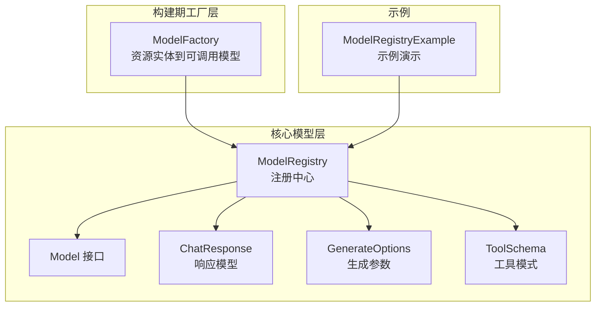
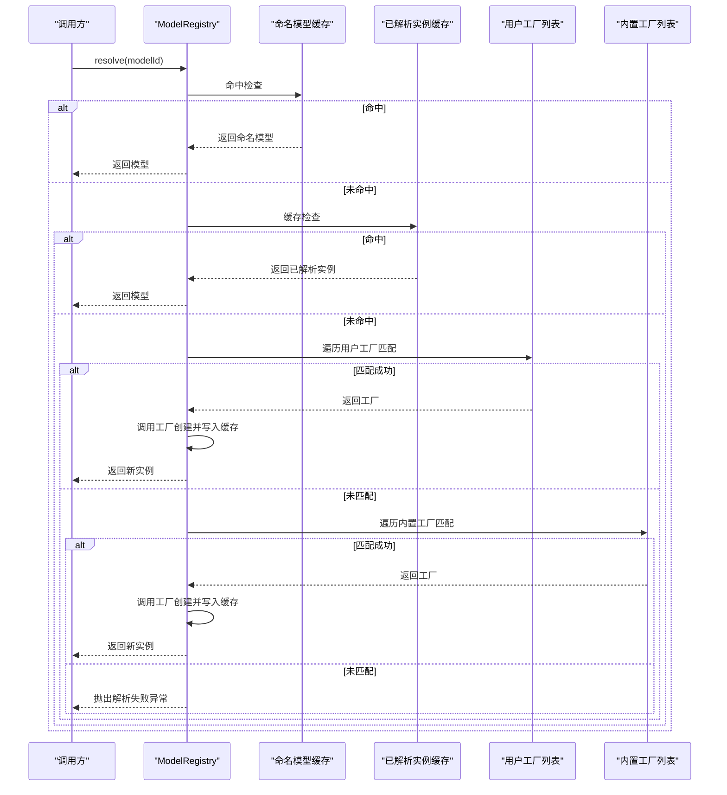
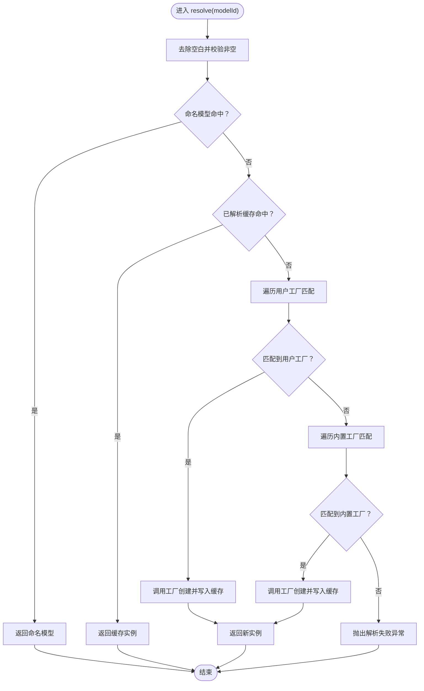
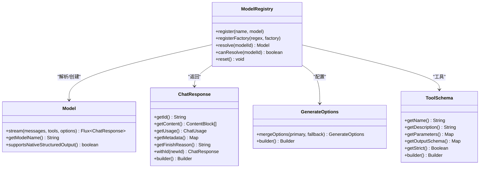

# 模型注册中心

<cite>
**本文引用的文件**
- [ModelRegistry.java](file://agentscope-core/src/main/java/io/agentscope/core/model/ModelRegistry.java)
- [Model.java](file://agentscope-core/src/main/java/io/agentscope/core/model/Model.java)
- [ChatResponse.java](file://agentscope-core/src/main/java/io/agentscope/core/model/ChatResponse.java)
- [GenerateOptions.java](file://agentscope-core/src/main/java/io/agentscope/core/model/GenerateOptions.java)
- [ToolSchema.java](file://agentscope-core/src/main/java/io/agentscope/core/model/ToolSchema.java)
- [ModelFactory.java](file://agentscope-builder-saton/src/main/java/io/agentscope/builder/saton/factory/model/ModelFactory.java)
- [ModelRegistryExample.java](file://agentscope-examples/documentation/src/main/java/io/agentscope/examples/documentation2/model/ModelRegistryExample.java)
</cite>

## 目录
1. [简介](#简介)
2. [项目结构](#项目结构)
3. [核心组件](#核心组件)
4. [架构总览](#架构总览)
5. [详细组件分析](#详细组件分析)
6. [依赖关系分析](#依赖关系分析)
7. [性能考量](#性能考量)
8. [故障排查指南](#故障排查指南)
9. [结论](#结论)
10. [附录](#附录)

## 简介
本文件为 AgentScope 模型注册中心的详细 API 文档，聚焦于 ModelRegistry 的注册、查找与管理模型实例的能力，系统性阐述模型工厂模式的实现与配置选项，解释模型缓存机制与生命周期管理，并提供最佳实践与性能优化建议，以及自定义模型注册器的开发指南。

## 项目结构
围绕模型注册与使用的相关模块分布如下：
- 核心模型接口与注册中心：io.agentscope.core.model
- 构建期模型工厂（面向资源/类型体系）：io.agentscope.builder.saton.factory.model
- 使用示例：io.agentscope.examples.documentation2.model

图表来源
- [ModelRegistry.java:35-261](file://agentscope-core/src/main/java/io/agentscope/core/model/ModelRegistry.java#L35-L261)
- [Model.java:22-53](file://agentscope-core/src/main/java/io/agentscope/core/model/Model.java#L22-L53)
- [ChatResponse.java:29-207](file://agentscope-core/src/main/java/io/agentscope/core/model/ChatResponse.java#L29-L207)
- [GenerateOptions.java:32-904](file://agentscope-core/src/main/java/io/agentscope/core/model/GenerateOptions.java#L32-L904)
- [ToolSchema.java:28-183](file://agentscope-core/src/main/java/io/agentscope/core/model/ToolSchema.java#L28-L183)
- [ModelFactory.java:20-43](file://agentscope-builder-saton/src/main/java/io/agentscope/builder/saton/factory/model/ModelFactory.java#L20-L43)
- [ModelRegistryExample.java:48-121](file://agentscope-examples/documentation/src/main/java/io/agentscope/examples/documentation2/model/ModelRegistryExample.java#L48-L121)

章节来源
- [ModelRegistry.java:35-261](file://agentscope-core/src/main/java/io/agentscope/core/model/ModelRegistry.java#L35-L261)
- [ModelFactory.java:20-43](file://agentscope-builder-saton/src/main/java/io/agentscope/builder/saton/factory/model/ModelFactory.java#L20-L43)
- [ModelRegistryExample.java:48-121](file://agentscope-examples/documentation/src/main/java/io/agentscope/examples/documentation2/model/ModelRegistryExample.java#L48-L121)

## 核心组件
- ModelRegistry：全局单例式注册中心，支持命名模型注册、用户自定义工厂注册、内置工厂自动解析与实例缓存。
- Model：统一的模型抽象接口，定义流式对话、模型名与原生结构化输出能力。
- ChatResponse：不可变的聊天响应数据模型，封装内容块、用量与元数据。
- GenerateOptions：不可变的生成参数与连接级配置，支持合并策略与多维参数控制。
- ToolSchema：不可变工具模式定义，描述工具名称、描述、JSON Schema 参数与输出模式。
- ModelFactory（构建期）：面向资源实体的高层工厂门面，屏蔽底层类型注册表，提供类型目录与实例化能力。

章节来源
- [ModelRegistry.java:35-261](file://agentscope-core/src/main/java/io/agentscope/core/model/ModelRegistry.java#L35-L261)
- [Model.java:22-53](file://agentscope-core/src/main/java/io/agentscope/core/model/Model.java#L22-L53)
- [ChatResponse.java:29-207](file://agentscope-core/src/main/java/io/agentscope/core/model/ChatResponse.java#L29-L207)
- [GenerateOptions.java:32-904](file://agentscope-core/src/main/java/io/agentscope/core/model/GenerateOptions.java#L32-L904)
- [ToolSchema.java:28-183](file://agentscope-core/src/main/java/io/agentscope/core/model/ToolSchema.java#L28-L183)
- [ModelFactory.java:20-43](file://agentscope-builder-saton/src/main/java/io/agentscope/builder/saton/factory/model/ModelFactory.java#L20-L43)

## 架构总览
ModelRegistry 采用“命名模型优先、缓存命中优先、用户工厂优先、内置工厂兜底”的解析顺序；同时内置多种提供商的自动创建规则与环境变量驱动的密钥注入。上层 Agent 在配置模型时仅需传入字符串标识即可完成解析与实例化。

图表来源
- [ModelRegistry.java:142-173](file://agentscope-core/src/main/java/io/agentscope/core/model/ModelRegistry.java#L142-L173)
- [ModelRegistry.java:214-226](file://agentscope-core/src/main/java/io/agentscope/core/model/ModelRegistry.java#L214-L226)

## 详细组件分析

### ModelRegistry 注册与解析 API
- 注册命名模型
  - 方法：register(name, model)
  - 语义：以精确名称注册模型实例，后续 resolve 将直接返回该实例，不进行工厂创建与缓存。
  - 注意：name 与 model 均不可为空。
- 注册用户工厂
  - 方法：registerFactory(modelNameRegex, factory)
  - 语义：按正则匹配完整 modelId 字符串，新建工厂优先于旧用户注册与内置工厂被尝试。
  - 注意：regex 与 factory 均不可为空；注册顺序影响匹配优先级。
- 解析模型
  - 方法：resolve(modelId)
  - 语义：按命名 → 已解析缓存 → 用户工厂 → 内置工厂顺序解析；创建后写入已解析缓存。
  - 异常：当无法解析或创建失败时抛出非法参数异常。
- 可解析性检查
  - 方法：canResolve(modelId)
  - 语义：在不创建实例的前提下判断是否可解析（命名或匹配工厂）。
- 重置
  - 方法：reset()
  - 语义：清空命名模型、用户工厂与已解析缓存，保留内置工厂规则；用于测试场景。

图表来源
- [ModelRegistry.java:142-173](file://agentscope-core/src/main/java/io/agentscope/core/model/ModelRegistry.java#L142-L173)
- [ModelRegistry.java:214-226](file://agentscope-core/src/main/java/io/agentscope/core/model/ModelRegistry.java#L214-L226)

章节来源
- [ModelRegistry.java:114-134](file://agentscope-core/src/main/java/io/agentscope/core/model/ModelRegistry.java#L114-L134)
- [ModelRegistry.java:142-173](file://agentscope-core/src/main/java/io/agentscope/core/model/ModelRegistry.java#L142-L173)
- [ModelRegistry.java:179-191](file://agentscope-core/src/main/java/io/agentscope/core/model/ModelRegistry.java#L179-L191)
- [ModelRegistry.java:197-201](file://agentscope-core/src/main/java/io/agentscope/core/model/ModelRegistry.java#L197-L201)

### 模型工厂模式与内置提供商
- 内置工厂规则（静态初始化）
  - openai:xxx：要求 OPENAI_API_KEY，自动创建 OpenAIChatModel，启用流式。
  - dashscope:xxx 或 qwen*：要求 DASHSCOPE_API_KEY，自动创建 DashScopeChatModel，启用流式。
  - anthropic:xxx：可选 ANTHROPIC_API_KEY，自动创建 AnthropicChatModel，启用流式。
  - gemini:xxx：要求 GEMINI_API_KEY，自动创建 GeminiChatModel，启用流式。
  - ollama:xxx：可选 OLLAMA_BASE_URL，默认 http://localhost:11434，自动创建 OllamaChatModel。
- 用户工厂优先级
  - 新注册的用户工厂插入列表开头，优先于旧用户注册与内置工厂。
- 环境变量与错误提示
  - 缺失必要密钥时抛出非法状态异常，提供清晰的错误信息与可能原因列表。

章节来源
- [ModelRegistry.java:43-106](file://agentscope-core/src/main/java/io/agentscope/core/model/ModelRegistry.java#L43-L106)
- [ModelRegistry.java:228-259](file://agentscope-core/src/main/java/io/agentscope/core/model/ModelRegistry.java#L228-L259)

### 模型缓存机制与生命周期
- 命名模型缓存
  - ConcurrentHashMap 存储，按名称精确匹配，不参与工厂创建缓存。
- 已解析实例缓存
  - ConcurrentHashMap 存储，resolve 成功后写入，后续相同 modelId 直接返回缓存实例，提升性能。
- 用户工厂列表
  - CopyOnWriteArrayList，线程安全遍历，新注册工厂优先匹配。
- 内置工厂列表
  - ArrayList，静态初始化，提供默认提供商能力。

章节来源
- [ModelRegistry.java:37-41](file://agentscope-core/src/main/java/io/agentscope/core/model/ModelRegistry.java#L37-L41)
- [ModelRegistry.java:210-212](file://agentscope-core/src/main/java/io/agentscope/core/model/ModelRegistry.java#L210-L212)

### Model 接口与响应模型
- Model 接口
  - stream(messages, tools, options)：返回响应流，内部由具体模型格式化消息。
  - getModelName()：模型识别名。
  - supportsNativeStructuredOutput()：是否支持原生结构化输出（默认 false，可覆盖）。
- ChatResponse
  - 不可变数据类，包含 id、内容块列表、用量、元数据与结束原因。
  - Builder 支持设置各字段，未设置 id 时自动生成随机 UUID（兼容无 id 的提供商）。
- GenerateOptions
  - 不可变生成参数与连接级配置，支持合并策略（逐字段优先主选项，map 合并主覆盖备）。
  - 提供丰富参数：温度、采样、最大 token、执行配置、工具选择、响应格式、额外头/体/查询参数等。
- ToolSchema
  - 不可变工具模式定义，包含名称、描述、参数 JSON Schema、输出模式与严格模式标志。

章节来源
- [Model.java:22-53](file://agentscope-core/src/main/java/io/agentscope/core/model/Model.java#L22-L53)
- [ChatResponse.java:29-207](file://agentscope-core/src/main/java/io/agentscope/core/model/ChatResponse.java#L29-L207)
- [GenerateOptions.java:32-904](file://agentscope-core/src/main/java/io/agentscope/core/model/GenerateOptions.java#L32-L904)
- [ToolSchema.java:28-183](file://agentscope-core/src/main/java/io/agentscope/core/model/ToolSchema.java#L28-L183)

### 构建期模型工厂（资源实体到可调用模型）
- ModelFactory
  - 列举类型：listTypes() 返回类型目录与 schema。
  - 实例化：instantiate(entity) 将数据库实体转换为可调用的 Model，内部委托给类型注册表。
  - 错误处理：类型未知时抛出未找到异常。

章节来源
- [ModelFactory.java:20-43](file://agentscope-builder-saton/src/main/java/io/agentscope/builder/saton/factory/model/ModelFactory.java#L20-L43)

### 使用示例与最佳实践
- 示例程序 ModelRegistryExample 展示了：
  - 使用 canResolve() 在启动阶段快速验证可用提供商。
  - 通过字符串模型标识直接构建智能体，无需手动构造模型对象。
  - 切换提供商仅需修改 modelId 前缀，无需改动其他代码。
- 最佳实践
  - 在应用启动阶段调用 canResolve() 进行早期校验，避免运行时解析失败。
  - 对频繁使用的模型 ID 使用命名注册，减少工厂解析开销。
  - 合理利用已解析缓存，避免重复创建相同模型实例。
  - 自定义工厂时确保正则匹配准确且优先级合理，避免与内置规则冲突。
  - 通过 GenerateOptions 的合并策略分层配置默认与请求级参数。

章节来源
- [ModelRegistryExample.java:48-121](file://agentscope-examples/documentation/src/main/java/io/agentscope/examples/documentation2/model/ModelRegistryExample.java#L48-L121)

## 依赖关系分析
- ModelRegistry 依赖
  - Model 接口：作为统一抽象，所有工厂产出的实例均实现该接口。
  - ChatResponse/GenerateOptions/ToolSchema：作为输入输出与配置载体。
  - 内置模型实现（OpenAIChatModel、DashScopeChatModel、GeminiChatModel、AnthropicChatModel、OllamaChatModel）：由内置工厂创建。
- 构建期工厂依赖
  - ModelFactory 依赖类型注册表（未在当前上下文中展开），对外暴露 listTypes/instantiate 两个高层 API。

图表来源
- [ModelRegistry.java:35-261](file://agentscope-core/src/main/java/io/agentscope/core/model/ModelRegistry.java#L35-L261)
- [Model.java:22-53](file://agentscope-core/src/main/java/io/agentscope/core/model/Model.java#L22-L53)
- [ChatResponse.java:29-207](file://agentscope-core/src/main/java/io/agentscope/core/model/ChatResponse.java#L29-L207)
- [GenerateOptions.java:32-904](file://agentscope-core/src/main/java/io/agentscope/core/model/GenerateOptions.java#L32-L904)
- [ToolSchema.java:28-183](file://agentscope-core/src/main/java/io/agentscope/core/model/ToolSchema.java#L28-L183)

## 性能考量
- 缓存策略
  - 命名模型缓存与已解析实例缓存显著降低重复解析与创建成本。
  - 建议对热点模型 ID 使用命名注册，避免工厂匹配开销。
- 并发与线程安全
  - 使用并发容器（ConcurrentHashMap/CopyOnWriteArrayList）保证多线程下的稳定性。
- 工厂匹配顺序
  - 用户工厂插入列表开头，优先匹配，减少不必要的内置规则扫描。
- 流式响应
  - Model.stream 返回响应流，结合背压与异步处理可降低内存峰值与延迟。

## 故障排查指南
- 常见问题与定位
  - 无法解析模型：检查 modelId 是否为空、是否注册命名模型、是否存在匹配的用户/内置工厂。
  - 缺少 API 密钥：根据错误提示确认对应环境变量（如 OPENAI_API_KEY、DASHSCOPE_API_KEY、GEMINI_API_KEY、ANTHROPIC_API_KEY）是否设置。
  - Ollama 本地服务：确认 OLLAMA_BASE_URL 是否可达，默认地址 http://localhost:11434。
  - 工厂创建失败：捕获异常并查看工厂实现中的错误信息，确认模型名与参数正确。
- 建议排查步骤
  - 使用 canResolve() 快速验证可用性。
  - 打印或记录解析路径（命名 → 缓存 → 用户 → 内置）以定位失败环节。
  - 在测试环境中调用 reset() 清理状态，避免跨用例污染。

章节来源
- [ModelRegistry.java:179-191](file://agentscope-core/src/main/java/io/agentscope/core/model/ModelRegistry.java#L179-L191)
- [ModelRegistry.java:228-259](file://agentscope-core/src/main/java/io/agentscope/core/model/ModelRegistry.java#L228-L259)

## 结论
ModelRegistry 通过“命名注册 + 已解析缓存 + 用户工厂优先 + 内置工厂兜底”的设计，在易用性与性能之间取得平衡。配合不可变的配置模型与流式响应接口，能够满足多提供商、多场景的模型接入需求。建议在生产中结合 canResolve 校验、命名注册与缓存策略，持续优化解析与创建性能。

## 附录

### API 一览（方法与职责）
- ModelRegistry
  - register(name, model)：注册命名模型
  - registerFactory(regex, factory)：注册用户工厂
  - resolve(modelId)：解析并返回模型实例
  - canResolve(modelId)：判断是否可解析
  - reset()：清理命名模型、用户工厂与已解析缓存
- Model
  - stream(messages, tools, options)：流式对话
  - getModelName()：模型名
  - supportsNativeStructuredOutput()：原生结构化输出支持
- ChatResponse
  - builder()/withId()/各 getter：响应数据建模与扩展
- GenerateOptions
  - builder()/mergeOptions()：参数建模与合并
- ToolSchema
  - builder()/各 getter：工具模式定义
- ModelFactory（构建期）
  - listTypes()：类型目录
  - instantiate(entity)：实例化

章节来源
- [ModelRegistry.java:114-201](file://agentscope-core/src/main/java/io/agentscope/core/model/ModelRegistry.java#L114-L201)
- [Model.java:22-53](file://agentscope-core/src/main/java/io/agentscope/core/model/Model.java#L22-L53)
- [ChatResponse.java:120-207](file://agentscope-core/src/main/java/io/agentscope/core/model/ChatResponse.java#L120-L207)
- [GenerateOptions.java:392-502](file://agentscope-core/src/main/java/io/agentscope/core/model/GenerateOptions.java#L392-L502)
- [ToolSchema.java:104-183](file://agentscope-core/src/main/java/io/agentscope/core/model/ToolSchema.java#L104-L183)
- [ModelFactory.java:28-41](file://agentscope-builder-saton/src/main/java/io/agentscope/builder/saton/factory/model/ModelFactory.java#L28-L41)