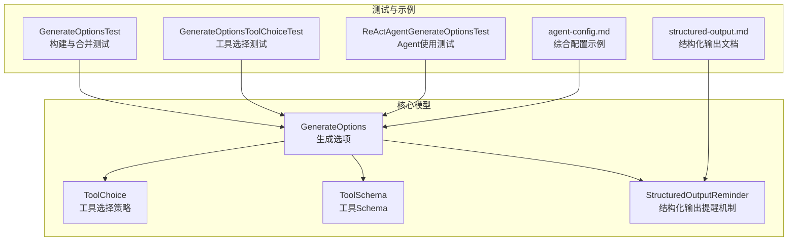
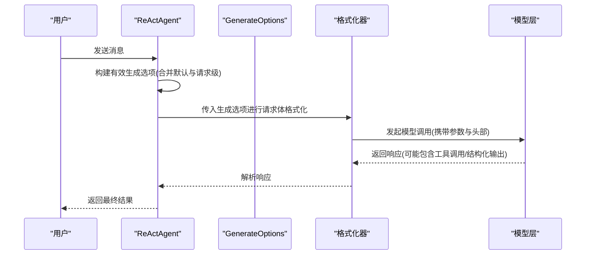
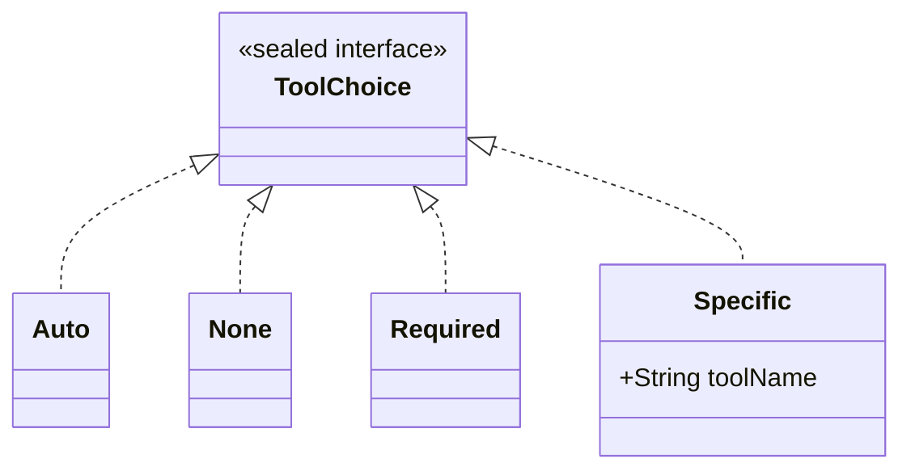
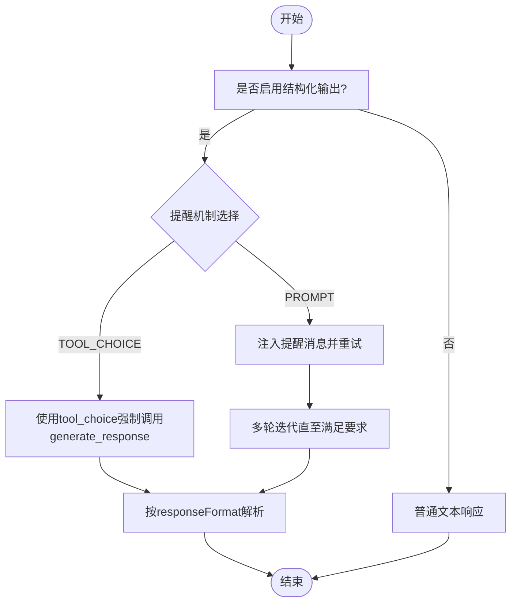
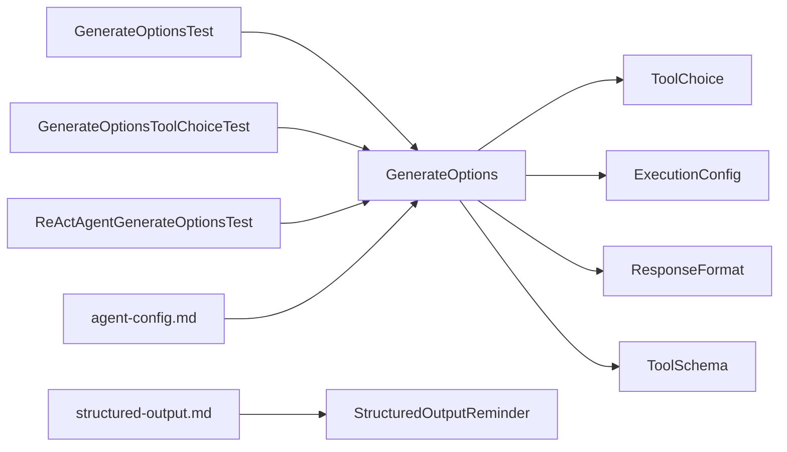

# 生成选项

<cite>
**本文引用的文件**
- [GenerateOptions.java](file://agentscope-core/src/main/java/io/agentscope/core/model/GenerateOptions.java)
- [ToolChoice.java](file://agentscope-core/src/main/java/io/agentscope/core/model/ToolChoice.java)
- [ToolSchema.java](file://agentscope-core/src/main/java/io/agentscope/core/model/ToolSchema.java)
- [StructuredOutputReminder.java](file://agentscope-core/src/main/java/io/agentscope/core/model/StructuredOutputReminder.java)
- [GenerateOptionsTest.java](file://agentscope-core/src/test/java/io/agentscope/core/model/GenerateOptionsTest.java)
- [GenerateOptionsToolChoiceTest.java](file://agentscope-core/src/test/java/io/agentscope/core/model/GenerateOptionsToolChoiceTest.java)
- [ReActAgentGenerateOptionsTest.java](file://agentscope-core/src/test/java/io/agentscope/core/agent/ReActAgentGenerateOptionsTest.java)
- [agent-config.md](file://docs/v1/zh/docs/task/agent-config.md)
- [structured-output.md](file://docs/v1/en/docs/task/structured-output.md)
</cite>

## 目录
1. [简介](#简介)
2. [项目结构](#项目结构)
3. [核心组件](#核心组件)
4. [架构总览](#架构总览)
5. [详细组件分析](#详细组件分析)
6. [依赖关系分析](#依赖关系分析)
7. [性能考量](#性能考量)
8. [故障排查指南](#故障排查指南)
9. [结论](#结论)
10. [附录](#附录)

## 简介
本文件面向AgentScope的“生成选项”系统，聚焦GenerateOptions的配置参数与默认行为、工具选择策略、结构化输出与响应格式配置、不同模型提供商的支持差异、最佳实践与性能建议，并提供工具schema定义与结构化输出的完整示例路径。

## 项目结构
围绕生成选项的核心代码位于agentscope-core模块的model包中，配套测试覆盖了构建器、合并逻辑、工具选择策略以及在ReActAgent中的使用场景。

图表来源
- [GenerateOptions.java:32-904](file://agentscope-core/src/main/java/io/agentscope/core/model/GenerateOptions.java#L32-L904)
- [ToolChoice.java:45-85](file://agentscope-core/src/main/java/io/agentscope/core/model/ToolChoice.java#L45-L85)
- [ToolSchema.java:28-183](file://agentscope-core/src/main/java/io/agentscope/core/model/ToolSchema.java#L28-L183)
- [StructuredOutputReminder.java:25-52](file://agentscope-core/src/main/java/io/agentscope/core/model/StructuredOutputReminder.java#L25-L52)
- [GenerateOptionsTest.java:34-478](file://agentscope-core/src/test/java/io/agentscope/core/model/GenerateOptionsTest.java#L34-L478)
- [GenerateOptionsToolChoiceTest.java:29-177](file://agentscope-core/src/test/java/io/agentscope/core/model/GenerateOptionsToolChoiceTest.java#L29-L177)
- [ReActAgentGenerateOptionsTest.java:73-470](file://agentscope-core/src/test/java/io/agentscope/core/agent/ReActAgentGenerateOptionsTest.java#L73-L470)
- [agent-config.md:474-765](file://docs/v1/zh/docs/task/agent-config.md#L474-L765)
- [structured-output.md:1-87](file://docs/v1/en/docs/task/structured-output.md#L1-L87)

章节来源
- [GenerateOptions.java:1-904](file://agentscope-core/src/main/java/io/agentscope/core/model/GenerateOptions.java#L1-L904)
- [ToolChoice.java:1-85](file://agentscope-core/src/main/java/io/agentscope/core/model/ToolChoice.java#L1-L85)
- [ToolSchema.java:1-183](file://agentscope-core/src/main/java/io/agentscope/core/model/ToolSchema.java#L1-L183)
- [StructuredOutputReminder.java:1-52](file://agentscope-core/src/main/java/io/agentscope/core/model/StructuredOutputReminder.java#L1-L52)

## 核心组件
- GenerateOptions：不可变的生成选项容器，支持连接级配置（apiKey、baseUrl、endpointPath、modelName、stream）与生成参数（temperature、topP、maxTokens、maxCompletionTokens、frequencyPenalty、presencePenalty、thinkingBudget、reasoningEffort、executionConfig、toolChoice、topK、seed、cacheControl、parallelToolCalls、responseFormat、additionalHeaders、additionalBodyParams、additionalQueryParams），并提供mergeOptions合并策略与Builder构建器。
- ToolChoice：密封接口，定义工具调用策略（Auto、None、Required、Specific），用于控制模型是否调用工具及调用方式。
- ToolSchema：不可变工具Schema定义，描述工具名称、描述、参数JSON Schema、可选输出Schema与严格模式标志。
- StructuredOutputReminder：结构化输出提醒机制枚举，控制当模型未调用generate_response工具时的强制策略（TOOL_CHOICE或PROMPT）。

章节来源
- [GenerateOptions.java:32-904](file://agentscope-core/src/main/java/io/agentscope/core/model/GenerateOptions.java#L32-L904)
- [ToolChoice.java:45-85](file://agentscope-core/src/main/java/io/agentscope/core/model/ToolChoice.java#L45-L85)
- [ToolSchema.java:28-183](file://agentscope-core/src/main/java/io/agentscope/core/model/ToolSchema.java#L28-L183)
- [StructuredOutputReminder.java:25-52](file://agentscope-core/src/main/java/io/agentscope/core/model/StructuredOutputReminder.java#L25-L52)

## 架构总览
生成选项贯穿Agent的推理阶段，作为输入参数传递给模型层，并通过格式化器映射到具体提供商的API字段。工具选择策略与结构化输出提醒共同影响工具调用与最终响应格式。

图表来源
- [ReActAgentGenerateOptionsTest.java:169-215](file://agentscope-core/src/test/java/io/agentscope/core/agent/ReActAgentGenerateOptionsTest.java#L169-L215)
- [GenerateOptions.java:392-502](file://agentscope-core/src/main/java/io/agentscope/core/model/GenerateOptions.java#L392-L502)

## 详细组件分析

### GenerateOptions：配置参数与默认值
- 连接级配置
  - apiKey：认证密钥；未设置时使用模型默认值（若配置）。
  - baseUrl：服务端点基础URL；未设置时使用模型默认值（若配置）。
  - endpointPath：API端点路径（如"/v1/chat/completions"）；未设置时使用模型默认值（若配置）。
  - modelName：模型名称；未设置时使用模型默认值（若配置）。
  - stream：流式响应开关；未设置时使用模型默认值（若配置）。
- 生成参数
  - temperature：采样温度，范围通常为[0,2]；未设置时使用模型默认值（若配置）。
  - topP：核采样概率阈值，范围[0,1]；未设置时使用模型默认值（若配置）。
  - maxTokens：最大生成token数；未设置时使用模型默认值（若配置）。
  - maxCompletionTokens：最大补全token数（OpenAI兼容API支持）；未设置时使用模型默认值（若配置）。
  - frequencyPenalty：频率惩罚系数，[-2,2]；未设置时使用模型默认值（若配置）。
  - presencePenalty：存在惩罚系数，[-2,2]；未设置时使用模型默认值（若配置）。
  - thinkingBudget：推理/思考内容的最大token预算（特定模型支持）；未设置时不启用思考模式。
  - reasoningEffort：推理努力级别（如"low/medium/high"，o1系列模型）；未设置时使用模型默认值（若配置）。
  - executionConfig：执行配置（超时、重试次数、退避策略、错误过滤等）；未设置时为null。
  - toolChoice：工具调用策略（见下节）；未设置时为null（默认Auto）。
  - topK：每步仅考虑前K个最高概率token；未设置时使用模型默认值（若配置）。
  - seed：随机种子，用于可重复生成；未设置时使用模型默认值（若配置）。
  - cacheControl：提示缓存控制开关；未设置时为false/null。
  - parallelToolCalls：是否允许并行工具调用；未设置时为false/null。
  - responseFormat：结构化输出响应格式（如JSON Schema）；未设置时为null。
  - additionalHeaders/additionalBodyParams/additionalQueryParams：扩展HTTP头/请求体/查询参数；未设置时为空映射。
- 默认值与继承规则
  - 未显式设置的参数通常回退至模型默认值（若模型配置了默认值）。
  - 合并策略：mergeOptions按字段优先级合并，primary非空则优先，否则使用fallback；Map类型字段会合并并允许覆盖。
- Builder特性
  - 支持链式调用设置各参数。
  - 支持设置endpointPath、apiKey、baseUrl、modelName、stream等连接级配置。
  - 支持设置additionalHeaders、additionalBodyParams、additionalQueryParams等扩展参数。
  - 支持设置executionConfig、toolChoice、responseFormat等复杂对象。

章节来源
- [GenerateOptions.java:32-904](file://agentscope-core/src/main/java/io/agentscope/core/model/GenerateOptions.java#L32-L904)
- [GenerateOptionsTest.java:34-478](file://agentscope-core/src/test/java/io/agentscope/core/model/GenerateOptionsTest.java#L34-L478)
- [ReActAgentGenerateOptionsTest.java:73-163](file://agentscope-core/src/test/java/io/agentscope/core/agent/ReActAgentGenerateOptionsTest.java#L73-L163)

### 工具选择策略：ToolChoice
- Auto：模型自由决定是否调用工具（默认）。
- None：禁止模型调用任何工具，仅文本回复。
- Required：强制至少调用一个工具（由模型选择）。
- Specific：强制调用指定名称的工具（构造时校验非空）。
- 与GenerateOptions集成
  - 通过GenerateOptions.builder().toolChoice(...)设置。
  - 合并策略：primary非空时优先，否则使用fallback。
- 典型用法
  - 强制生成结构化输出：使用Specific("generate_response")。
  - 仅允许文本回答：使用None。
  - 让模型自主选择工具：使用Auto（默认）。

图表来源
- [ToolChoice.java:45-85](file://agentscope-core/src/main/java/io/agentscope/core/model/ToolChoice.java#L45-L85)

章节来源
- [ToolChoice.java:45-85](file://agentscope-core/src/main/java/io/agentscope/core/model/ToolChoice.java#L45-L85)
- [GenerateOptionsToolChoiceTest.java:29-177](file://agentscope-core/src/test/java/io/agentscope/core/model/GenerateOptionsToolChoiceTest.java#L29-L177)

### 结构化输出与响应格式
- 结构化输出提醒机制
  - TOOL_CHOICE：默认推荐。通过tool_choice参数强制模型调用generate_response工具，单次API调用即可完成。
  - PROMPT：通过注入提醒消息的方式，可能需要多次迭代。
- 响应格式
  - responseFormat：设置后，模型将返回符合指定格式（如JSON Schema）的结构化输出，避免合成工具的额外开销。
- 在Agent中的应用
  - ReActAgent可通过structuredOutputReminder配置提醒机制。
  - 通过call(msg, DataType.class)直接提取结构化数据。

图表来源
- [StructuredOutputReminder.java:25-52](file://agentscope-core/src/main/java/io/agentscope/core/model/StructuredOutputReminder.java#L25-L52)
- [GenerateOptions.java:340-350](file://agentscope-core/src/main/java/io/agentscope/core/model/GenerateOptions.java#L340-L350)

章节来源
- [StructuredOutputReminder.java:25-52](file://agentscope-core/src/main/java/io/agentscope/core/model/StructuredOutputReminder.java#L25-L52)
- [GenerateOptions.java:340-350](file://agentscope-core/src/main/java/io/agentscope/core/model/GenerateOptions.java#L340-L350)
- [structured-output.md:36-49](file://docs/v1/en/docs/task/structured-output.md#L36-L49)

### 工具Schema定义
- 字段说明
  - name：工具名称（必填）。
  - description：工具描述（必填）。
  - parameters：参数JSON Schema（必填，描述参数结构）。
  - outputSchema：可选输出Schema（用于结构化输出）。
  - strict：严格模式标志（可选）。
- 使用场景
  - 与ToolChoice.Specific配合，确保模型调用预期工具。
  - 与responseFormat结合，实现原生结构化输出。

章节来源
- [ToolSchema.java:28-183](file://agentscope-core/src/main/java/io/agentscope/core/model/ToolSchema.java#L28-L183)

### 不同模型提供商的支持差异
- OpenAI兼容API
  - 支持maxTokens与maxCompletionTokens（SDK不强制互斥，按调用方设置转发）。
  - 支持tool_choice、parallel_tool_calls、response_format等主流参数。
- DashScope（通义千问）
  - 支持thinkingBudget（推理预算）与enableThinking（开启思考模式）。
  - 支持cache_control（提示缓存）。
- Ollama
  - 无需apiKey（本地部署）。
  - 支持标准LLM参数与工具调用。
- 其他提供商
  - 通过additionalHeaders/additionalBodyParams/additionalQueryParams扩展自定义参数。
  - 具体支持以各格式化器实现为准。

章节来源
- [GenerateOptions.java:197-209](file://agentscope-core/src/main/java/io/agentscope/core/model/GenerateOptions.java#L197-L209)
- [agent-config.md:664-677](file://docs/v1/zh/docs/task/agent-config.md#L664-L677)

## 依赖关系分析
- GenerateOptions依赖
  - ToolChoice：控制工具调用策略。
  - ExecutionConfig：封装超时与重试策略（可嵌套合并）。
  - ResponseFormat：定义结构化输出格式。
  - ToolSchema：描述工具接口（与工具调用配合）。
- 测试与示例
  - GenerateOptionsTest：验证构建器、合并逻辑与扩展参数。
  - GenerateOptionsToolChoiceTest：验证ToolChoice集成与合并。
  - ReActAgentGenerateOptionsTest：验证在Agent推理阶段的传递与使用。
  - agent-config.md：展示综合配置与结构化输出示例。
  - structured-output.md：说明结构化输出两种模式与Schema定义。

图表来源
- [GenerateOptions.java:32-904](file://agentscope-core/src/main/java/io/agentscope/core/model/GenerateOptions.java#L32-L904)
- [ToolChoice.java:45-85](file://agentscope-core/src/main/java/io/agentscope/core/model/ToolChoice.java#L45-L85)
- [ToolSchema.java:28-183](file://agentscope-core/src/main/java/io/agentscope/core/model/ToolSchema.java#L28-L183)
- [GenerateOptionsTest.java:34-478](file://agentscope-core/src/test/java/io/agentscope/core/model/GenerateOptionsTest.java#L34-L478)
- [GenerateOptionsToolChoiceTest.java:29-177](file://agentscope-core/src/test/java/io/agentscope/core/model/GenerateOptionsToolChoiceTest.java#L29-L177)
- [ReActAgentGenerateOptionsTest.java:73-470](file://agentscope-core/src/test/java/io/agentscope/core/agent/ReActAgentGenerateOptionsTest.java#L73-L470)
- [agent-config.md:474-765](file://docs/v1/zh/docs/task/agent-config.md#L474-L765)
- [structured-output.md:1-87](file://docs/v1/en/docs/task/structured-output.md#L1-L87)

章节来源
- [GenerateOptions.java:392-502](file://agentscope-core/src/main/java/io/agentscope/core/model/GenerateOptions.java#L392-L502)
- [GenerateOptionsTest.java:331-357](file://agentscope-core/src/test/java/io/agentscope/core/model/GenerateOptionsTest.java#L331-L357)
- [GenerateOptionsToolChoiceTest.java:96-175](file://agentscope-core/src/test/java/io/agentscope/core/model/GenerateOptionsToolChoiceTest.java#L96-L175)
- [ReActAgentGenerateOptionsTest.java:169-215](file://agentscope-core/src/test/java/io/agentscope/core/agent/ReActAgentGenerateOptionsTest.java#L169-L215)

## 性能考量
- 合理设置temperature与topP以平衡创造性与稳定性。
- 使用maxTokens与maxCompletionTokens控制成本与延迟（注意不同提供商的互斥语义）。
- 启用cacheControl（在支持的提供商上）可减少重复提示的延迟与费用。
- 并行工具调用parallelToolCalls可提升工具执行吞吐，但需评估并发与限流。
- 对高延迟模型，合理配置executionConfig的超时与退避策略，避免长时间阻塞。
- 结构化输出优先使用TOOL_CHOICE模式，减少多轮迭代带来的延迟。

## 故障排查指南
- 参数未生效
  - 检查是否显式设置了GenerateOptions；未设置时可能回退到模型默认值。
  - 确认mergeOptions的primary/fallback顺序，确保关键参数来自primary。
- 工具未被调用
  - 若期望强制调用，请使用ToolChoice.Specific("generate_response")。
  - 检查toolChoice与模型支持情况；某些模型对None或Required支持有限。
- 结构化输出失败
  - 切换到TOOL_CHOICE模式，或在prompt中明确要求结构化输出。
  - 确保responseFormat与工具Schema一致。
- 提示缓存无效
  - 确认提供商支持cache_control且版本匹配；检查消息元数据标记。
- 超时与重试
  - 调整executionConfig的timeout、maxAttempts与退避策略，避免频繁触发重试。

章节来源
- [GenerateOptionsTest.java:331-357](file://agentscope-core/src/test/java/io/agentscope/core/model/GenerateOptionsTest.java#L331-L357)
- [GenerateOptionsToolChoiceTest.java:96-175](file://agentscope-core/src/test/java/io/agentscope/core/model/GenerateOptionsToolChoiceTest.java#L96-L175)
- [ReActAgentGenerateOptionsTest.java:341-372](file://agentscope-core/src/test/java/io/agentscope/core/agent/ReActAgentGenerateOptionsTest.java#L341-L372)

## 结论
GenerateOptions提供了统一、可合并的生成参数管理，结合ToolChoice与StructuredOutputReminder，能够灵活控制工具调用与响应格式。通过合理的参数组合与执行配置，可在不同模型提供商间获得稳定且高性能的生成体验。

## 附录
- 完整示例路径
  - 综合配置示例（含结构化输出与工具组）：[agent-config.md:474-765](file://docs/v1/zh/docs/task/agent-config.md#L474-L765)
  - 结构化输出快速开始与模式说明：[structured-output.md:1-87](file://docs/v1/en/docs/task/structured-output.md#L1-L87)
- 关键测试用例
  - 生成选项构建与合并：[GenerateOptionsTest.java:34-478](file://agentscope-core/src/test/java/io/agentscope/core/model/GenerateOptionsTest.java#L34-L478)
  - 工具选择策略测试：[GenerateOptionsToolChoiceTest.java:29-177](file://agentscope-core/src/test/java/io/agentscope/core/model/GenerateOptionsToolChoiceTest.java#L29-L177)
  - Agent推理阶段使用与合并：[ReActAgentGenerateOptionsTest.java:73-470](file://agentscope-core/src/test/java/io/agentscope/core/agent/ReActAgentGenerateOptionsTest.java#L73-L470)