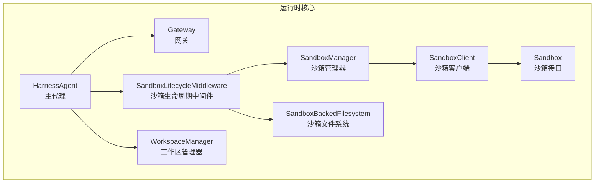
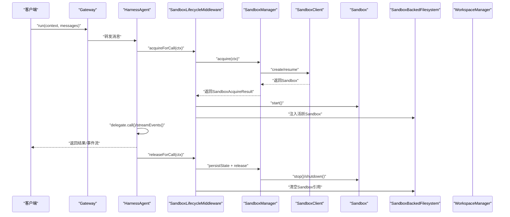
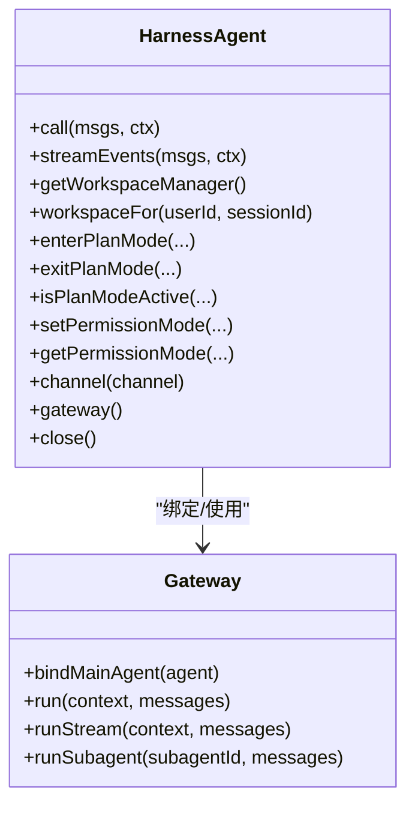
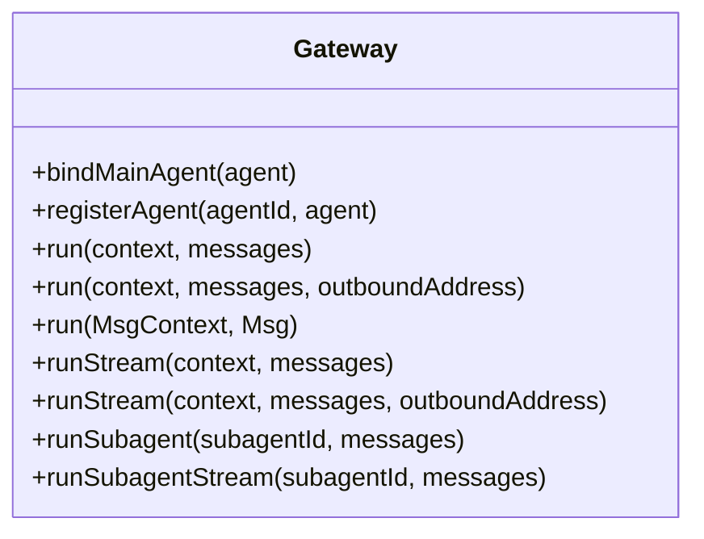
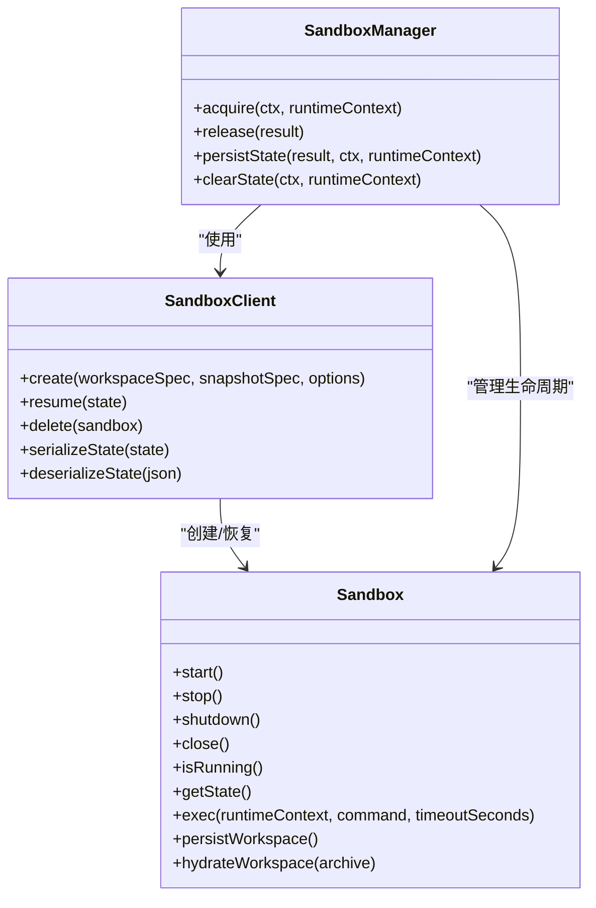
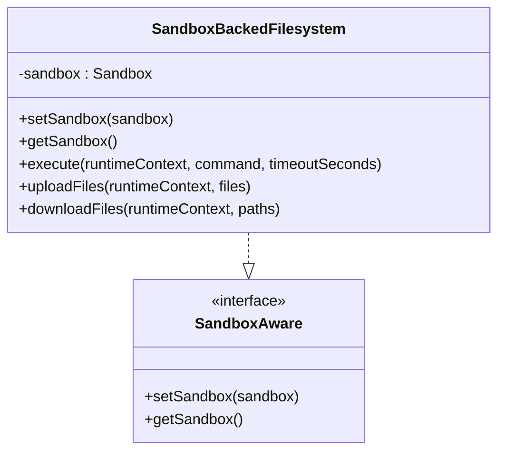
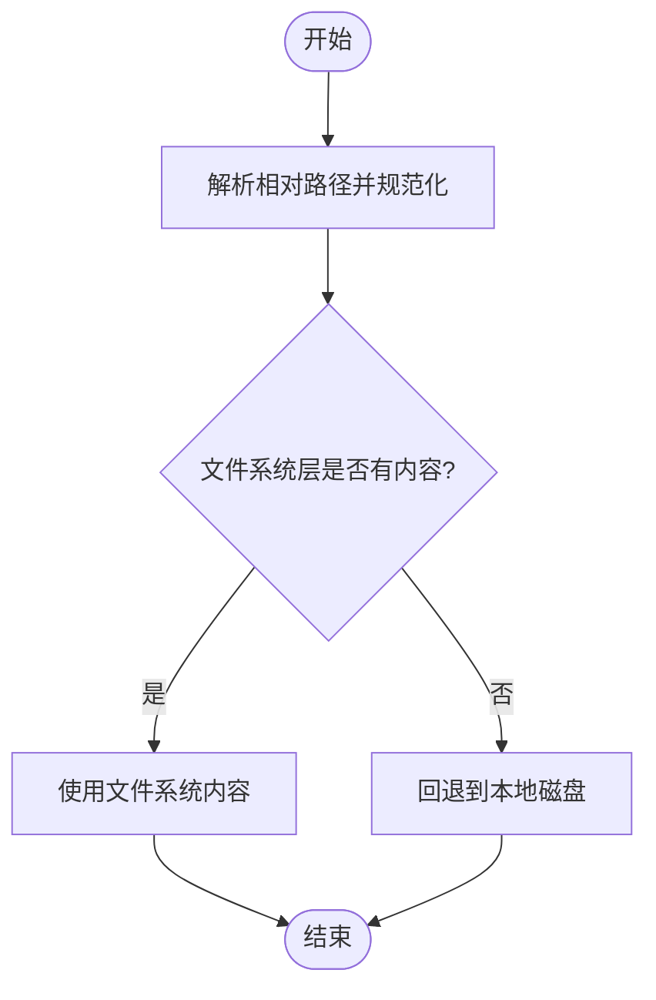
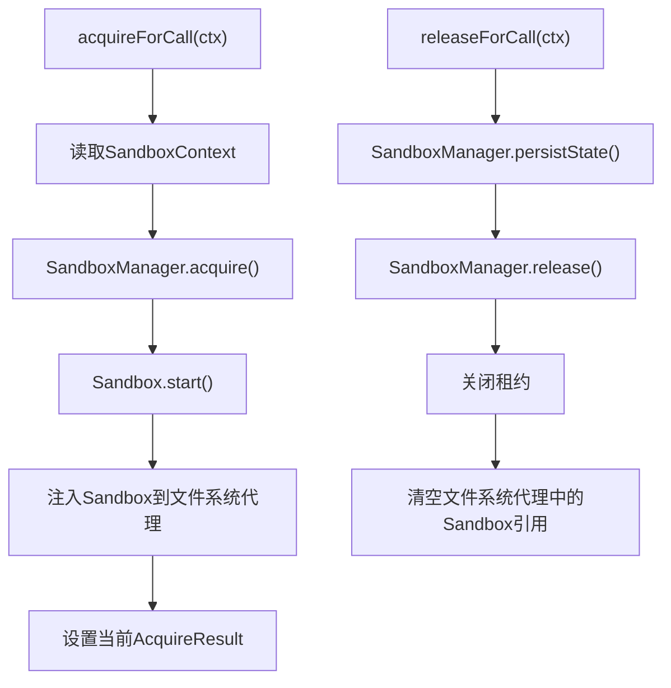
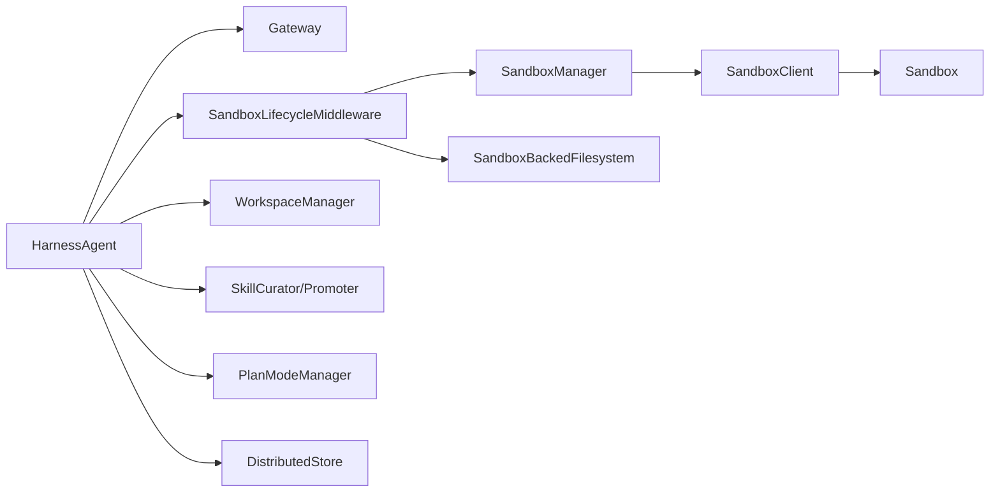

# 运行时API

<cite>
**本文引用的文件**
- [HarnessAgent.java](file://agentscope-harness/src/main/java/io/agentscope/harness/agent/HarnessAgent.java)
- [Gateway.java](file://agentscope-harness/src/main/java/io/agentscope/harness/agent/gateway/Gateway.java)
- [Sandbox.java](file://agentscope-harness/src/main/java/io/agentscope/harness/agent/sandbox/Sandbox.java)
- [SandboxClient.java](file://agentscope-harness/src/main/java/io/agentscope/harness/agent/sandbox/SandboxClient.java)
- [SandboxManager.java](file://agentscope-harness/src/main/java/io/agentscope/harness/agent/sandbox/SandboxManager.java)
- [SandboxLifecycleMiddleware.java](file://agentscope-harness/src/main/java/io/agentscope/harness/agent/middleware/SandboxLifecycleMiddleware.java)
- [SandboxBackedFilesystem.java](file://agentscope-harness/src/main/java/io/agentscope/harness/agent/filesystem/sandbox/SandboxBackedFilesystem.java)
- [WorkspaceManager.java](file://agentscope-harness/src/main/java/io/agentscope/harness/agent/workspace/WorkspaceManager.java)
</cite>

## 目录
1. [简介](#简介)
2. [项目结构](#项目结构)
3. [核心组件](#核心组件)
4. [架构总览](#架构总览)
5. [详细组件分析](#详细组件分析)
6. [依赖分析](#依赖分析)
7. [性能考虑](#性能考虑)
8. [故障排除指南](#故障排除指南)
9. [结论](#结论)
10. [附录](#附录)

## 简介
本文件为 AgentScope 运行时环境的详细 API 参考，聚焦以下核心运行时组件与能力：
- HarnessAgent 主代理：统一编排工作区、文件系统、沙箱、子代理、技能与计划模式等能力，并对 ReActAgent 进行增强封装。
- Gateway 网关：作为统一入口路由消息、支持事件流式输出、可选的子代理直连路由。
- Sandbox 沙箱：提供隔离的工作空间生命周期管理（创建、启动、停止、关闭）、命令执行、归档与恢复、状态持久化。

同时，文档覆盖以下主题：
- 工作区规格、文件系统操作与沙箱隔离的 API 规范
- 运行时生命周期管理、资源分配与监控指标接口
- 生产级部署与运维相关的 API 说明
- 运行时配置、性能调优与故障排除接口

## 项目结构
AgentScope 的运行时 API 主要位于 agentscope-harness 模块中，围绕 HarnessAgent 展开，通过中间件与工具类集成工作区、文件系统与沙箱能力；Gateway 提供统一入口；Sandbox 提供隔离执行环境。

**图表来源**
- [HarnessAgent.java:121-146](file://agentscope-harness/src/main/java/io/agentscope/harness/agent/HarnessAgent.java#L121-L146)
- [Gateway.java:26-33](file://agentscope-harness/src/main/java/io/agentscope/harness/agent/gateway/Gateway.java#L26-L33)
- [SandboxLifecycleMiddleware.java:29-51](file://agentscope-harness/src/main/java/io/agentscope/harness/agent/middleware/SandboxLifecycleMiddleware.java#L29-L51)
- [SandboxManager.java:24-40](file://agentscope-harness/src/main/java/io/agentscope/harness/agent/sandbox/SandboxManager.java#L24-L40)
- [SandboxClient.java:20-25](file://agentscope-harness/src/main/java/io/agentscope/harness/agent/sandbox/SandboxClient.java#L20-L25)
- [Sandbox.java:21-42](file://agentscope-harness/src/main/java/io/agentscope/harness/agent/sandbox/Sandbox.java#L21-L42)
- [SandboxBackedFilesystem.java:35-42](file://agentscope-harness/src/main/java/io/agentscope/harness/agent/filesystem/sandbox/SandboxBackedFilesystem.java#L35-L42)
- [WorkspaceManager.java:66-97](file://agentscope-harness/src/main/java/io/agentscope/harness/agent/workspace/WorkspaceManager.java#L66-L97)

**章节来源**
- [HarnessAgent.java:121-146](file://agentscope-harness/src/main/java/io/agentscope/harness/agent/HarnessAgent.java#L121-L146)
- [Gateway.java:26-33](file://agentscope-harness/src/main/java/io/agentscope/harness/agent/gateway/Gateway.java#L26-L33)
- [SandboxLifecycleMiddleware.java:29-51](file://agentscope-harness/src/main/java/io/agentscope/harness/agent/middleware/SandboxLifecycleMiddleware.java#L29-L51)
- [SandboxManager.java:24-40](file://agentscope-harness/src/main/java/io/agentscope/harness/agent/sandbox/SandboxManager.java#L24-L40)
- [SandboxClient.java:20-25](file://agentscope-harness/src/main/java/io/agentscope/harness/agent/sandbox/SandboxClient.java#L20-L25)
- [Sandbox.java:21-42](file://agentscope-harness/src/main/java/io/agentscope/harness/agent/sandbox/Sandbox.java#L21-L42)
- [SandboxBackedFilesystem.java:35-42](file://agentscope-harness/src/main/java/io/agentscope/harness/agent/filesystem/sandbox/SandboxBackedFilesystem.java#L35-L42)
- [WorkspaceManager.java:66-97](file://agentscope-harness/src/main/java/io/agentscope/harness/agent/workspace/WorkspaceManager.java#L66-L97)

## 核心组件
- HarnessAgent：对外暴露统一的调用与事件流接口，内部编排工作区、文件系统、沙箱、子代理、技能与计划模式等能力。支持按会话隔离的状态存储、权限模式切换、计划模式开关、技能审计与推广等高级功能。
- Gateway：统一入口，绑定主代理与命名代理，支持消息与事件流式处理，可选的子代理直连路由。
- Sandbox：抽象隔离执行环境，提供生命周期管理、命令执行、归档/水合、状态序列化与反序列化等能力。
- SandboxClient：沙箱工厂，负责创建/恢复沙箱实例及状态序列化。
- SandboxManager：在调用周期内管理沙箱获取、启动、状态持久化与释放。
- SandboxBackedFilesystem：基于活跃沙箱的文件系统代理，提供执行、上传、下载等操作。
- WorkspaceManager：工作区访问器，采用“文件系统层优先 + 本地回退”的两层读策略与写入统一走文件系统的策略，提供任务记录、会话索引、知识库列表等能力。

**章节来源**
- [HarnessAgent.java:121-146](file://agentscope-harness/src/main/java/io/agentscope/harness/agent/HarnessAgent.java#L121-L146)
- [Gateway.java:26-33](file://agentscope-harness/src/main/java/io/agentscope/harness/agent/gateway/Gateway.java#L26-L33)
- [Sandbox.java:21-42](file://agentscope-harness/src/main/java/io/agentscope/harness/agent/sandbox/Sandbox.java#L21-L42)
- [SandboxClient.java:20-25](file://agentscope-harness/src/main/java/io/agentscope/harness/agent/sandbox/SandboxClient.java#L20-L25)
- [SandboxManager.java:24-40](file://agentscope-harness/src/main/java/io/agentscope/harness/agent/sandbox/SandboxManager.java#L24-L40)
- [SandboxBackedFilesystem.java:35-42](file://agentscope-harness/src/main/java/io/agentscope/harness/agent/filesystem/sandbox/SandboxBackedFilesystem.java#L35-L42)
- [WorkspaceManager.java:66-97](file://agentscope-harness/src/main/java/io/agentscope/harness/agent/workspace/WorkspaceManager.java#L66-L97)

## 架构总览
下图展示运行时调用链路：Gateway 接收请求，HarnessAgent 将调用委托给 ReActAgent，并通过 SandboxLifecycleMiddleware 在调用前后完成沙箱生命周期管理，SandboxManager 负责沙箱获取与释放，SandboxClient 创建/恢复沙箱，SandboxBackedFilesystem 委派到活跃沙箱执行命令与文件操作，WorkspaceManager 提供工作区读写与索引。

**图表来源**
- [Gateway.java:48-62](file://agentscope-harness/src/main/java/io/agentscope/harness/agent/gateway/Gateway.java#L48-L62)
- [HarnessAgent.java:542-577](file://agentscope-harness/src/main/java/io/agentscope/harness/agent/HarnessAgent.java#L542-L577)
- [SandboxLifecycleMiddleware.java:66-134](file://agentscope-harness/src/main/java/io/agentscope/harness/agent/middleware/SandboxLifecycleMiddleware.java#L66-L134)
- [SandboxManager.java:66-140](file://agentscope-harness/src/main/java/io/agentscope/harness/agent/sandbox/SandboxManager.java#L66-L140)
- [SandboxClient.java:27-43](file://agentscope-harness/src/main/java/io/agentscope/harness/agent/sandbox/SandboxClient.java#L27-L43)
- [SandboxBackedFilesystem.java:53-61](file://agentscope-harness/src/main/java/io/agentscope/harness/agent/filesystem/sandbox/SandboxBackedFilesystem.java#L53-L61)
- [WorkspaceManager.java:367-394](file://agentscope-harness/src/main/java/io/agentscope/harness/agent/workspace/WorkspaceManager.java#L367-L394)

## 详细组件分析

### HarnessAgent 主代理 API
- 统一调用与事件流
  - call(List<Msg>, RuntimeContext)：阻塞式调用，自动注入默认会话与沙箱生命周期。
  - streamEvents(List<Msg>, RuntimeContext)：细粒度 AgentEvent 流，覆盖完整调用生命周期。
- 工作区与会话
  - getWorkspaceManager()/workspaceFor(userId, sessionId)：工作区管理器访问与按会话视图访问。
  - 会话级状态：enterPlanMode()/exitPlanMode()/isPlanModeActive()，权限模式切换 setPermissionMode()/getPermissionMode()。
- 技能与审计
  - getSkillRepositories()/getSkillUsageStore()/queryAudit()/runCuratorOnce()/promoteSkill()。
- 子代理与网关
  - channel()/gateway()：绑定内部网关，首次使用时惰性创建；支持子代理暴露与跨节点恢复。
- 关闭与资源
  - close()：关闭 OwnedWorkspaceIndex 与委托代理。

**图表来源**
- [HarnessAgent.java:472-542](file://agentscope-harness/src/main/java/io/agentscope/harness/agent/HarnessAgent.java#L472-L542)
- [HarnessAgent.java:542-713](file://agentscope-harness/src/main/java/io/agentscope/harness/agent/HarnessAgent.java#L542-L713)
- [Gateway.java:35-95](file://agentscope-harness/src/main/java/io/agentscope/harness/agent/gateway/Gateway.java#L35-L95)

**章节来源**
- [HarnessAgent.java:219-248](file://agentscope-harness/src/main/java/io/agentscope/harness/agent/HarnessAgent.java#L219-L248)
- [HarnessAgent.java:256-291](file://agentscope-harness/src/main/java/io/agentscope/harness/agent/HarnessAgent.java#L256-L291)
- [HarnessAgent.java:293-341](file://agentscope-harness/src/main/java/io/agentscope/harness/agent/HarnessAgent.java#L293-L341)
- [HarnessAgent.java:343-367](file://agentscope-harness/src/main/java/io/agentscope/harness/agent/HarnessAgent.java#L343-L367)
- [HarnessAgent.java:472-542](file://agentscope-harness/src/main/java/io/agentscope/harness/agent/HarnessAgent.java#L472-L542)
- [HarnessAgent.java:542-713](file://agentscope-harness/src/main/java/io/agentscope/harness/agent/HarnessAgent.java#L542-L713)

### Gateway 网关 API
- 绑定主代理与命名代理：bindMainAgent()/registerAgent(agentId, agent)。
- 入站调用：run(MsgContext, List<Msg>) 支持单消息与带 OutboundAddress 的重载；runStream() 返回细粒度 AgentEvent 流。
- 子代理路由：runSubagent()/runSubagentStream() 支持直接路由到已暴露的子代理会话。

**图表来源**
- [Gateway.java:35-95](file://agentscope-harness/src/main/java/io/agentscope/harness/agent/gateway/Gateway.java#L35-L95)

**章节来源**
- [Gateway.java:35-95](file://agentscope-harness/src/main/java/io/agentscope/harness/agent/gateway/Gateway.java#L35-L95)

### Sandbox 沙箱 API
- 生命周期：start()/stop()/shutdown()/close()，区分“仅持久化快照”与“销毁后端资源”。
- 执行与归档：exec()/persistWorkspace()/hydrateWorkspace()。
- 状态：getState() 返回可序列化状态；serializeState()/deserializeState() 由 SandboxClient 实现。
- 隔离与租约：SandboxExecutionGuard 与 SandboxLease 保证隔离作用域内的并发安全。

**图表来源**
- [Sandbox.java:42-77](file://agentscope-harness/src/main/java/io/agentscope/harness/agent/sandbox/Sandbox.java#L42-L77)
- [SandboxClient.java:25-44](file://agentscope-harness/src/main/java/io/agentscope/harness/agent/sandbox/SandboxClient.java#L25-L44)
- [SandboxManager.java:66-227](file://agentscope-harness/src/main/java/io/agentscope/harness/agent/sandbox/SandboxManager.java#L66-L227)

**章节来源**
- [Sandbox.java:42-77](file://agentscope-harness/src/main/java/io/agentscope/harness/agent/sandbox/Sandbox.java#L42-L77)
- [SandboxClient.java:25-44](file://agentscope-harness/src/main/java/io/agentscope/harness/agent/sandbox/SandboxClient.java#L25-L44)
- [SandboxManager.java:66-227](file://agentscope-harness/src/main/java/io/agentscope/harness/agent/sandbox/SandboxManager.java#L66-L227)

### Sandbox 文件系统 API
- SandboxBackedFilesystem 作为 BaseSandboxFilesystem 的实现，通过 volatile 字段注入活跃 Sandbox，在每次调用前由 SandboxLifecycleMiddleware 注入。
- 提供 execute()/uploadFiles()/downloadFiles()，内部委派至 Sandbox.exec() 并处理异常映射。

**图表来源**
- [SandboxBackedFilesystem.java:42-61](file://agentscope-harness/src/main/java/io/agentscope/harness/agent/filesystem/sandbox/SandboxBackedFilesystem.java#L42-L61)
- [SandboxBackedFilesystem.java:69-172](file://agentscope-harness/src/main/java/io/agentscope/harness/agent/filesystem/sandbox/SandboxBackedFilesystem.java#L69-L172)

**章节来源**
- [SandboxBackedFilesystem.java:42-61](file://agentscope-harness/src/main/java/io/agentscope/harness/agent/filesystem/sandbox/SandboxBackedFilesystem.java#L42-L61)
- [SandboxBackedFilesystem.java:69-172](file://agentscope-harness/src/main/java/io/agentscope/harness/agent/filesystem/sandbox/SandboxBackedFilesystem.java#L69-L172)

### WorkspaceManager 工作区 API
- 两层读策略：文件系统层优先，否则回退到本地磁盘；写入统一走文件系统。
- 路径解析与命名空间：resolveRuntimeDataPath() 结合 NamespaceFactory 生成用户/会话命名空间。
- 内容读取：readAgentsMd()/readKnowledgeMd()/readMemoryMd()/readManagedWorkspaceFileUtf8()。
- 列表与索引：listKnowledgeFiles() 联合文件系统与本地目录；getIndex() 返回最佳努力的本地索引。
- 会话与任务：resolveSessionContextFile()/resolveSessionLogFile()、updateSessionIndex()、writeTaskRecord()/readTaskRecord()/listTaskRecords()/listAllTaskRecords()、读写 sweep marker。
- 写入与锁：appendUtf8WorkspaceRelative()/writeUtf8WorkspaceRelative() 使用路径级 ReentrantLock 保证进程内原子性；多节点需文件系统层提供 CAS/乐观锁。

**图表来源**
- [WorkspaceManager.java:264-278](file://agentscope-harness/src/main/java/io/agentscope/harness/agent/workspace/WorkspaceManager.java#L264-L278)
- [WorkspaceManager.java:292-330](file://agentscope-harness/src/main/java/io/agentscope/harness/agent/workspace/WorkspaceManager.java#L292-L330)

**章节来源**
- [WorkspaceManager.java:66-97](file://agentscope-harness/src/main/java/io/agentscope/harness/agent/workspace/WorkspaceManager.java#L66-L97)
- [WorkspaceManager.java:224-278](file://agentscope-harness/src/main/java/io/agentscope/harness/agent/workspace/WorkspaceManager.java#L224-L278)
- [WorkspaceManager.java:292-330](file://agentscope-harness/src/main/java/io/agentscope/harness/agent/workspace/WorkspaceManager.java#L292-L330)
- [WorkspaceManager.java:367-434](file://agentscope-harness/src/main/java/io/agentscope/harness/agent/workspace/WorkspaceManager.java#L367-L434)
- [WorkspaceManager.java:436-577](file://agentscope-harness/src/main/java/io/agentscope/harness/agent/workspace/WorkspaceManager.java#L436-L577)
- [WorkspaceManager.java:605-629](file://agentscope-harness/src/main/java/io/agentscope/harness/agent/workspace/WorkspaceManager.java#L605-L629)
- [WorkspaceManager.java:716-735](file://agentscope-harness/src/main/java/io/agentscope/harness/agent/workspace/WorkspaceManager.java#L716-L735)

### 沙箱生命周期中间件
- acquireForCall(ctx)：从 RuntimeContext 获取 SandboxContext，调用 SandboxManager.acquire()，启动 Sandbox，注入到 SandboxBackedFilesystem，捕获失败并释放资源与租约。
- releaseForCall(ctx)：持久化状态、释放沙箱、关闭租约、清理文件系统代理引用。

**图表来源**
- [SandboxLifecycleMiddleware.java:66-134](file://agentscope-harness/src/main/java/io/agentscope/harness/agent/middleware/SandboxLifecycleMiddleware.java#L66-L134)

**章节来源**
- [SandboxLifecycleMiddleware.java:66-134](file://agentscope-harness/src/main/java/io/agentscope/harness/agent/middleware/SandboxLifecycleMiddleware.java#L66-L134)

## 依赖分析
- 组件耦合
  - HarnessAgent 依赖 Gateway、WorkspaceManager、SandboxLifecycleMiddleware、SandboxManager 等，形成高内聚低耦合的运行时编排。
  - SandboxLifecycleMiddleware 与 SandboxManager 强耦合，确保沙箱生命周期一致性。
  - SandboxBackedFilesystem 依赖 Sandbox，通过中间件注入，避免在业务代码中直接感知沙箱。
- 外部依赖
  - 文件系统抽象：OverlayFilesystem、RemoteFilesystem 等，用于工作区与技能草稿的跨副本可见性。
  - 计划模式与技能管理：PlanModeManager、SkillCurator、SkillPromoter 等，提供自学习与治理能力。
  - 分布式存储：DistributedStore 用于子代理注册与跨节点恢复。

**图表来源**
- [HarnessAgent.java:150-176](file://agentscope-harness/src/main/java/io/agentscope/harness/agent/HarnessAgent.java#L150-L176)
- [SandboxLifecycleMiddleware.java:55-64](file://agentscope-harness/src/main/java/io/agentscope/harness/agent/middleware/SandboxLifecycleMiddleware.java#L55-L64)
- [SandboxManager.java:44-64](file://agentscope-harness/src/main/java/io/agentscope/harness/agent/sandbox/SandboxManager.java#L44-L64)
- [SandboxBackedFilesystem.java:42-61](file://agentscope-harness/src/main/java/io/agentscope/harness/agent/filesystem/sandbox/SandboxBackedFilesystem.java#L42-L61)
- [WorkspaceManager.java:97-124](file://agentscope-harness/src/main/java/io/agentscope/harness/agent/workspace/WorkspaceManager.java#L97-L124)

**章节来源**
- [HarnessAgent.java:150-176](file://agentscope-harness/src/main/java/io/agentscope/harness/agent/HarnessAgent.java#L150-L176)
- [SandboxLifecycleMiddleware.java:55-64](file://agentscope-harness/src/main/java/io/agentscope/harness/agent/middleware/SandboxLifecycleMiddleware.java#L55-L64)
- [SandboxManager.java:44-64](file://agentscope-harness/src/main/java/io/agentscope/harness/agent/sandbox/SandboxManager.java#L44-L64)
- [SandboxBackedFilesystem.java:42-61](file://agentscope-harness/src/main/java/io/agentscope/harness/agent/filesystem/sandbox/SandboxBackedFilesystem.java#L42-L61)
- [WorkspaceManager.java:97-124](file://agentscope-harness/src/main/java/io/agentscope/harness/agent/workspace/WorkspaceManager.java#L97-L124)

## 性能考虑
- 沙箱获取优先级与隔离
  - 优先使用外部沙箱与显式状态，减少创建成本；当存在隔离作用域时，通过 SandboxExecutionGuard 与租约控制并发，避免争用。
- 文件系统写入串行化
  - WorkspaceManager 对每个相对路径维护 ReentrantLock，保证进程内读改写原子性；多节点场景需文件系统层提供 CAS/乐观锁。
- 事件流与上下文压缩
  - CompactionMiddleware 在上下文溢出时进行紧急压缩，提升吞吐稳定性；建议结合内存配置与工具结果淘汰策略优化。
- 状态持久化与清理
  - SandboxManager 在调用结束后尝试持久化状态，失败不阻塞主流程；必要时可调用 clearState 清理无效状态。

[本节为通用性能建议，无需特定文件引用]

## 故障排除指南
- 沙箱未注入导致的文件系统异常
  - 现象：SandboxBackedFilesystem 抛出“无活跃沙箱”异常。
  - 排查：确认 SandboxLifecycleMiddleware 是否在调用前正确注入沙箱；检查 acquireForCall() 是否抛出异常。
- 沙箱执行超时或错误
  - 现象：执行返回超时或非零退出码。
  - 排查：查看 SandboxException 映射与日志；调整命令超时时间或检查容器/镜像配置。
- 工作区写入冲突
  - 现象：并发写入导致 JSON 解析失败或部分写入。
  - 排查：确认 WorkspaceManager 的路径级锁是否生效；多节点部署时启用文件系统层的 CAS/乐观锁。
- 子代理路由不可用
  - 现象：runSubagent()/runSubagentStream() 不支持或返回错误。
  - 排查：确认网关实现是否支持子代理路由；分布式存储是否可用以支持跨节点恢复。

**章节来源**
- [SandboxBackedFilesystem.java:174-181](file://agentscope-harness/src/main/java/io/agentscope/harness/agent/filesystem/sandbox/SandboxBackedFilesystem.java#L174-L181)
- [SandboxLifecycleMiddleware.java:81-107](file://agentscope-harness/src/main/java/io/agentscope/harness/agent/middleware/SandboxLifecycleMiddleware.java#L81-L107)
- [WorkspaceManager.java:367-394](file://agentscope-harness/src/main/java/io/agentscope/harness/agent/workspace/WorkspaceManager.java#L367-L394)
- [Gateway.java:88-95](file://agentscope-harness/src/main/java/io/agentscope/harness/agent/gateway/Gateway.java#L88-L95)

## 结论
本文档系统梳理了 AgentScope 运行时的核心 API：HarnessAgent 的统一编排、Gateway 的统一入口、Sandbox 的隔离执行与生命周期管理，以及 WorkspaceManager 的工作区读写与索引能力。通过中间件与工具类的协作，实现了可扩展、可观测且可运维的运行时环境。建议在生产环境中结合分布式存储、文件系统层的并发控制与上下文压缩策略，持续优化性能与稳定性。

[本节为总结性内容，无需特定文件引用]

## 附录

### 运行时生命周期与资源分配要点
- 生命周期阶段
  - 获取：SandboxContext → SandboxManager.acquire() → Sandbox.start()
  - 使用：注入到 SandboxBackedFilesystem → 执行命令/文件操作
  - 归档：Sandbox.stop() → SandboxManager.persistState() → Sandbox.release()
- 资源分配
  - 外部沙箱优先，显式状态次之，再考虑持久化状态与新建沙箱。
  - 隔离作用域通过 SandboxExecutionGuard 与租约保障。

**章节来源**
- [SandboxLifecycleMiddleware.java:66-134](file://agentscope-harness/src/main/java/io/agentscope/harness/agent/middleware/SandboxLifecycleMiddleware.java#L66-L134)
- [SandboxManager.java:66-140](file://agentscope-harness/src/main/java/io/agentscope/harness/agent/sandbox/SandboxManager.java#L66-L140)

### 工作区规格与文件系统操作
- 工作区布局与读写策略见 WorkspaceManager 注释与方法说明。
- 文件系统代理通过 SandboxBackedFilesystem 委派到活跃沙箱，确保隔离执行。

**章节来源**
- [WorkspaceManager.java:66-97](file://agentscope-harness/src/main/java/io/agentscope/harness/agent/workspace/WorkspaceManager.java#L66-L97)
- [SandboxBackedFilesystem.java:69-172](file://agentscope-harness/src/main/java/io/agentscope/harness/agent/filesystem/sandbox/SandboxBackedFilesystem.java#L69-L172)

### 监控指标与运维建议
- 指标建议
  - 沙箱获取/启动/持久化/释放耗时与成功率
  - 事件流速率与延迟
  - 工作区写入失败率与路径级锁等待时间
- 运维建议
  - 多节点部署时启用分布式存储与文件系统层 CAS
  - 定期清理无效沙箱状态与过期会话
  - 结合内存配置与工具结果淘汰策略降低上下文膨胀

[本节为通用运维建议，无需特定文件引用]