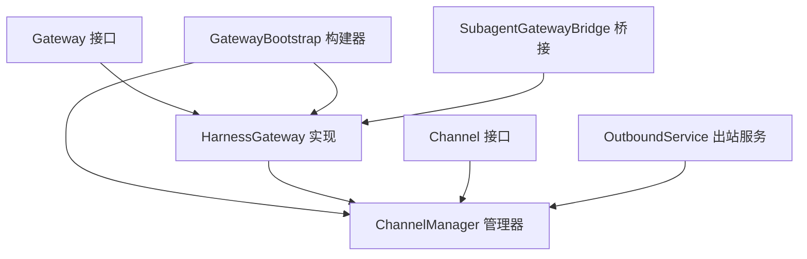
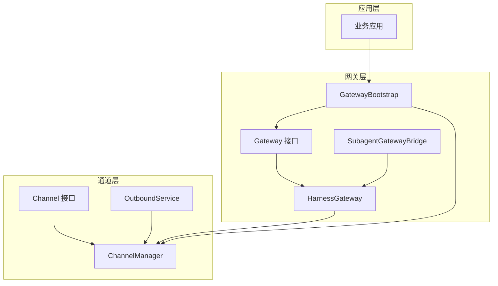
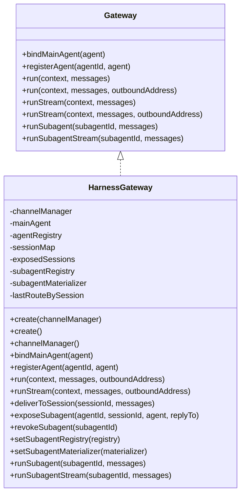
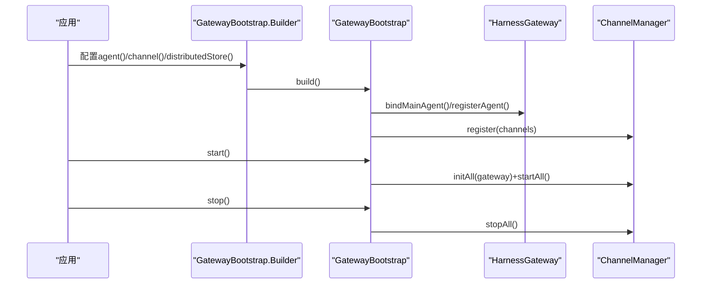
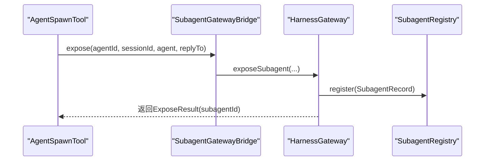
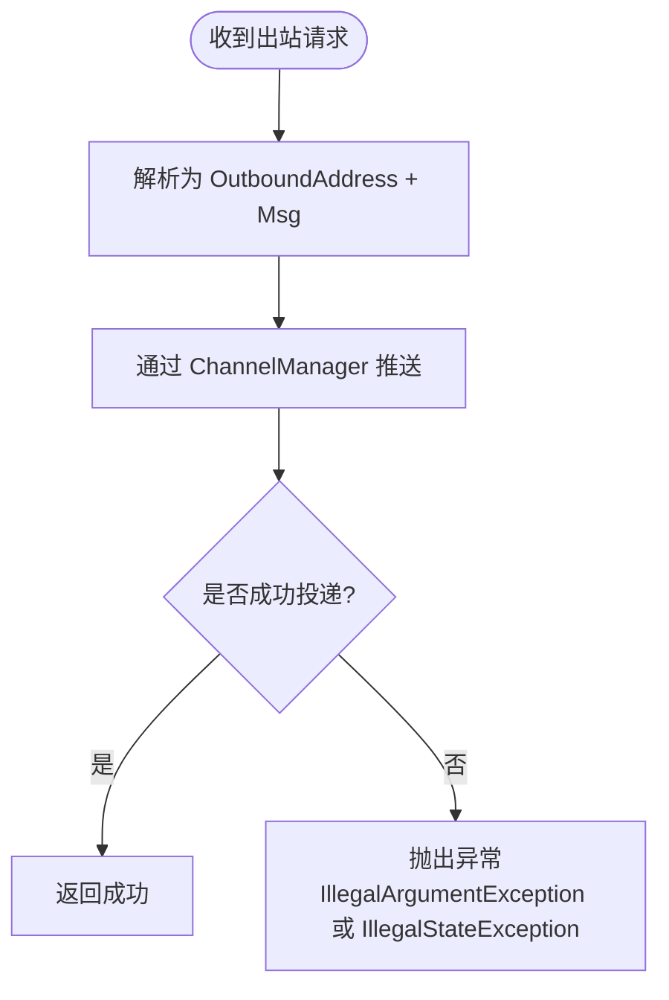
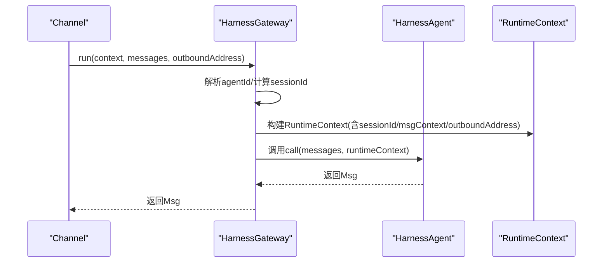
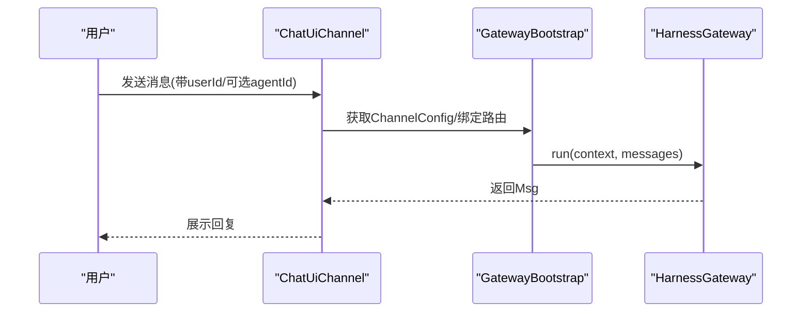
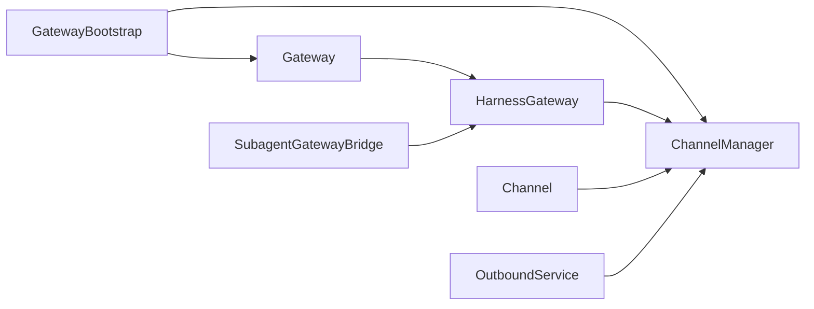

# Gateway网关API

<cite>
**本文档引用的文件**
- [HarnessGateway.java](file://agentscope-harness/src/main/java/io/agentscope/harness/agent/gateway/HarnessGateway.java)
- [Gateway.java](file://agentscope-harness/src/main/java/io/agentscope/harness/agent/gateway/Gateway.java)
- [GatewayBootstrap.java](file://agentscope-harness/src/main/java/io/agentscope/harness/agent/gateway/GatewayBootstrap.java)
- [SubagentGatewayBridge.java](file://agentscope-harness/src/main/java/io/agentscope/harness/agent/gateway/SubagentGatewayBridge.java)
- [Channel.java](file://agentscope-harness/src/main/java/io/agentscope/harness/agent/gateway/channel/Channel.java)
- [ChannelSendExample.java](file://agentscope-examples/documentation/src/main/java/io/agentscope/examples/documentation2/harness/channel/ChannelSendExample.java)
- [GatewayMultiAgentExample.java](file://agentscope-examples/documentation/src/main/java/io/agentscope/examples/documentation2/harness/channel/GatewayMultiAgentExample.java)
- [OutboundService.java](file://agentscope-examples/agentscope-paw/src/main/java/io/agentscope/claw2/runtime/outbound/OutboundService.java)
</cite>

## 目录
1. [简介](#简介)
2. [项目结构](#项目结构)
3. [核心组件](#核心组件)
4. [架构总览](#架构总览)
5. [详细组件分析](#详细组件分析)
6. [依赖关系分析](#依赖关系分析)
7. [性能考虑](#性能考虑)
8. [故障排查指南](#故障排查指南)
9. [结论](#结论)
10. [附录](#附录)

## 简介
本文件为Gateway网关系统的详细API参考文档，聚焦于HarnessGateway的公共接口与配置选项，涵盖子代理暴露、网关桥接与通道管理等能力。文档同时说明Channel接口的实现与使用方式，包括不同类型的通信通道；并提供网关生命周期管理、跨节点恢复与分布式部署的API规范，以及网关配置、性能监控与故障转移的接口说明。最后通过实际代码示例展示如何创建与使用网关进行代理通信。

## 项目结构
Gateway网关位于agentscope-harness模块中，围绕Gateway接口提供默认实现HarnessGateway，并通过GatewayBootstrap构建与启动。通道系统通过Channel接口抽象，结合ChannelManager统一管理，支持外部渠道（如聊天UI、钉钉、企业微信等）接入。示例工程agentscope-examples提供了Channel发送与多Agent路由的使用范式。

**图表来源**
- [Gateway.java:33-96](file://agentscope-harness/src/main/java/io/agentscope/harness/agent/gateway/Gateway.java#L33-L96)
- [HarnessGateway.java:54-107](file://agentscope-harness/src/main/java/io/agentscope/harness/agent/gateway/HarnessGateway.java#L54-L107)
- [GatewayBootstrap.java:84-170](file://agentscope-harness/src/main/java/io/agentscope/harness/agent/gateway/GatewayBootstrap.java#L84-L170)
- [SubagentGatewayBridge.java:29-50](file://agentscope-harness/src/main/java/io/agentscope/harness/agent/gateway/SubagentGatewayBridge.java#L29-L50)
- [Channel.java:53-120](file://agentscope-harness/src/main/java/io/agentscope/harness/agent/gateway/channel/Channel.java#L53-L120)
- [OutboundService.java:42-51](file://agentscope-examples/agentscope-paw/src/main/java/io/agentscope/claw2/runtime/outbound/OutboundService.java#L42-L51)

**章节来源**
- [Gateway.java:26-96](file://agentscope-harness/src/main/java/io/agentscope/harness/agent/gateway/Gateway.java#L26-L96)
- [HarnessGateway.java:40-107](file://agentscope-harness/src/main/java/io/agentscope/harness/agent/gateway/HarnessGateway.java#L40-L107)
- [GatewayBootstrap.java:34-170](file://agentscope-harness/src/main/java/io/agentscope/harness/agent/gateway/GatewayBootstrap.java#L34-L170)
- [SubagentGatewayBridge.java:21-50](file://agentscope-harness/src/main/java/io/agentscope/harness/agent/gateway/SubagentGatewayBridge.java#L21-L50)
- [Channel.java:53-120](file://agentscope-harness/src/main/java/io/agentscope/harness/agent/gateway/channel/Channel.java#L53-L120)
- [OutboundService.java:34-51](file://agentscope-examples/agentscope-paw/src/main/java/io/agentscope/claw2/runtime/outbound/OutboundService.java#L34-L51)

## 核心组件
- Gateway接口：定义网关入口能力，包括绑定主代理、注册代理、消息处理（同步与流式）、子代理路由与流式子代理路由。
- HarnessGateway实现：默认网关实现，负责会话映射、并发回合串行化、主代理绑定、子代理暴露与恢复、出站地址跟踪与主动投递。
- GatewayBootstrap：多代理+通道路由引导器，提供构建器模式装配Agent、Channel、分布式存储，启动/停止通道，生成网关桥接。
- SubagentGatewayBridge：连接工具层与网关层的桥接，用于将已暴露的子代理作为用户可直接寻址的入口点。
- Channel接口：通道抽象，适配不同通信平台，支持初始化、启动、停止、分发消息与流式分发。
- OutboundService：出站服务，将出站请求转换为OutboundAddress与消息并通过ChannelManager推送。

**章节来源**
- [Gateway.java:26-96](file://agentscope-harness/src/main/java/io/agentscope/harness/agent/gateway/Gateway.java#L26-L96)
- [HarnessGateway.java:40-466](file://agentscope-harness/src/main/java/io/agentscope/harness/agent/gateway/HarnessGateway.java#L40-L466)
- [GatewayBootstrap.java:84-317](file://agentscope-harness/src/main/java/io/agentscope/harness/agent/gateway/GatewayBootstrap.java#L84-L317)
- [SubagentGatewayBridge.java:21-50](file://agentscope-harness/src/main/java/io/agentscope/harness/agent/gateway/SubagentGatewayBridge.java#L21-L50)
- [Channel.java:53-120](file://agentscope-harness/src/main/java/io/agentscope/harness/agent/gateway/channel/Channel.java#L53-L120)
- [OutboundService.java:34-51](file://agentscope-examples/agentscope-paw/src/main/java/io/agentscope/claw2/runtime/outbound/OutboundService.java#L34-L51)

## 架构总览
下图展示了Gateway网关在系统中的角色与交互关系：GatewayBootstrap负责装配与启动，HarnessGateway作为核心调度器，ChannelManager统一管理通道，OutboundService负责出站消息投递，SubagentGatewayBridge支撑子代理暴露。

**图表来源**
- [GatewayBootstrap.java:84-170](file://agentscope-harness/src/main/java/io/agentscope/harness/agent/gateway/GatewayBootstrap.java#L84-L170)
- [HarnessGateway.java:54-107](file://agentscope-harness/src/main/java/io/agentscope/harness/agent/gateway/HarnessGateway.java#L54-L107)
- [SubagentGatewayBridge.java:29-50](file://agentscope-harness/src/main/java/io/agentscope/harness/agent/gateway/SubagentGatewayBridge.java#L29-L50)
- [Channel.java:53-120](file://agentscope-harness/src/main/java/io/agentscope/harness/agent/gateway/channel/Channel.java#L53-L120)
- [OutboundService.java:42-51](file://agentscope-examples/agentscope-paw/src/main/java/io/agentscope/claw2/runtime/outbound/OutboundService.java#L42-L51)

## 详细组件分析

### Gateway接口与HarnessGateway实现
HarnessGateway实现了Gateway接口，提供以下能力：
- 绑定主代理与注册其他代理，支持按agentId路由。
- 基于MsgContext的canonicalKey稳定映射到会话ID，保证同一逻辑对话拥有独立记忆。
- 使用SessionTurnGate对每个会话的并发回合进行公平串行化，避免竞争。
- 记录会话的最后出站地址，支持主动投递（如子代理公告）。
- 子代理暴露与恢复：在本地缓存与持久化注册表之间协调，支持跨节点/重启恢复。
- 同步与流式调用：run/runStream与runSubagent/runSubagentStream分别支持消息回复与事件流。

**图表来源**
- [Gateway.java:33-96](file://agentscope-harness/src/main/java/io/agentscope/harness/agent/gateway/Gateway.java#L33-L96)
- [HarnessGateway.java:54-466](file://agentscope-harness/src/main/java/io/agentscope/harness/agent/gateway/HarnessGateway.java#L54-L466)

**章节来源**
- [Gateway.java:26-96](file://agentscope-harness/src/main/java/io/agentscope/harness/agent/gateway/Gateway.java#L26-L96)
- [HarnessGateway.java:40-466](file://agentscope-harness/src/main/java/io/agentscope/harness/agent/gateway/HarnessGateway.java#L40-L466)

### GatewayBootstrap构建器与生命周期
GatewayBootstrap提供构建器模式装配：
- 注册Agent（含主代理mainAgent），支持lambda配置器批量定制。
- 注册外部Channel，统一由ChannelManager管理。
- 分布式存储集成：当提供分布式存储时，启用持久化子代理注册表与跨节点恢复材料化器。
- 生命周期管理：start()初始化并启动所有通道，stop()停止并释放资源。
- 网关桥接：gatewayBridge()返回SubagentGatewayBridge，供工具层暴露子代理。

**图表来源**
- [GatewayBootstrap.java:175-317](file://agentscope-harness/src/main/java/io/agentscope/harness/agent/gateway/GatewayBootstrap.java#L175-L317)
- [HarnessGateway.java:94-107](file://agentscope-harness/src/main/java/io/agentscope/harness/agent/gateway/HarnessGateway.java#L94-L107)

**章节来源**
- [GatewayBootstrap.java:84-317](file://agentscope-harness/src/main/java/io/agentscope/harness/agent/gateway/GatewayBootstrap.java#L84-L317)

### 子代理暴露与网关桥接
SubagentGatewayBridge将工具层的子代理暴露请求转交给网关层：
- expose()接收子代理类型标识、会话ID、实例与回复目标地址，返回用户可见的subagentId。
- HarnessGateway.exposeSubagent()将子代理注册到本地缓存与持久化注册表，便于后续直接路由。
- 支持跨节点/重启恢复：当本地缓存缺失时，通过SubagentMaterializer从持久化记录重建。

**图表来源**
- [SubagentGatewayBridge.java:29-50](file://agentscope-harness/src/main/java/io/agentscope/harness/agent/gateway/SubagentGatewayBridge.java#L29-L50)
- [HarnessGateway.java:244-276](file://agentscope-harness/src/main/java/io/agentscope/harness/agent/gateway/HarnessGateway.java#L244-L276)

**章节来源**
- [SubagentGatewayBridge.java:21-50](file://agentscope-harness/src/main/java/io/agentscope/harness/agent/gateway/SubagentGatewayBridge.java#L21-L50)
- [HarnessGateway.java:227-337](file://agentscope-harness/src/main/java/io/agentscope/harness/agent/gateway/HarnessGateway.java#L227-L337)

### 通道接口与出站投递
Channel接口抽象了不同通信平台的适配器，典型方法包括：
- channelId()/config()/init()/start()/stop()。
- dispatch()/dispatchStream()：将入站消息路由至网关并获取回复或事件流。
- 可选的流式分发以支持实时事件推送。

OutboundService负责将出站请求转换为OutboundAddress与消息，并通过ChannelManager推送，错误以IllegalArgumentException或IllegalStateException上抛。

**图表来源**
- [OutboundService.java:34-51](file://agentscope-examples/agentscope-paw/src/main/java/io/agentscope/claw2/runtime/outbound/OutboundService.java#L34-L51)
- [Channel.java:53-120](file://agentscope-harness/src/main/java/io/agentscope/harness/agent/gateway/channel/Channel.java#L53-L120)

**章节来源**
- [Channel.java:53-120](file://agentscope-harness/src/main/java/io/agentscope/harness/agent/gateway/channel/Channel.java#L53-L120)
- [OutboundService.java:34-51](file://agentscope-examples/agentscope-paw/src/main/java/io/agentscope/claw2/runtime/outbound/OutboundService.java#L34-L51)

### 入站消息处理流程
下图展示一次典型的入站消息处理：根据MsgContext解析会话，串行化回合，调用目标代理并返回结果。

**图表来源**
- [HarnessGateway.java:139-170](file://agentscope-harness/src/main/java/io/agentscope/harness/agent/gateway/HarnessGateway.java#L139-L170)
- [Gateway.java:48-62](file://agentscope-harness/src/main/java/io/agentscope/harness/agent/gateway/Gateway.java#L48-L62)

**章节来源**
- [HarnessGateway.java:134-204](file://agentscope-harness/src/main/java/io/agentscope/harness/agent/gateway/HarnessGateway.java#L134-L204)
- [Gateway.java:48-78](file://agentscope-harness/src/main/java/io/agentscope/harness/agent/gateway/Gateway.java#L48-L78)

### 多Agent路由与示例
GatewayBootstrap支持多Agent路由，可通过SendOptions.withAgentId()显式指定目标Agent，否则回退到主代理。

**图表来源**
- [GatewayMultiAgentExample.java:65-88](file://agentscope-examples/documentation/src/main/java/io/agentscope/examples/documentation2/harness/channel/GatewayMultiAgentExample.java#L65-L88)
- [GatewayBootstrap.java:144-154](file://agentscope-harness/src/main/java/io/agentscope/harness/agent/gateway/GatewayBootstrap.java#L144-L154)

**章节来源**
- [GatewayMultiAgentExample.java:24-91](file://agentscope-examples/documentation/src/main/java/io/agentscope/examples/documentation2/harness/channel/GatewayMultiAgentExample.java#L24-L91)
- [GatewayBootstrap.java:144-154](file://agentscope-harness/src/main/java/io/agentscope/harness/agent/gateway/GatewayBootstrap.java#L144-L154)

## 依赖关系分析
- Gateway与HarnessGateway：接口与实现分离，便于替换实现与扩展功能。
- GatewayBootstrap与HarnessGateway/ChannelManager：构建器负责装配与启动，耦合度低，利于测试与集成。
- SubagentGatewayBridge与HarnessGateway：桥接接口解耦工具层与网关层，简化子代理暴露流程。
- Channel与ChannelManager：通道抽象与集中管理，支持多种外部渠道接入。
- OutboundService与ChannelManager：出站服务通过ChannelManager完成跨通道投递。

**图表来源**
- [Gateway.java:33-96](file://agentscope-harness/src/main/java/io/agentscope/harness/agent/gateway/Gateway.java#L33-L96)
- [HarnessGateway.java:58-107](file://agentscope-harness/src/main/java/io/agentscope/harness/agent/gateway/HarnessGateway.java#L58-L107)
- [GatewayBootstrap.java:267-272](file://agentscope-harness/src/main/java/io/agentscope/harness/agent/gateway/GatewayBootstrap.java#L267-L272)
- [SubagentGatewayBridge.java:29-50](file://agentscope-harness/src/main/java/io/agentscope/harness/agent/gateway/SubagentGatewayBridge.java#L29-L50)
- [OutboundService.java:42-51](file://agentscope-examples/agentscope-paw/src/main/java/io/agentscope/claw2/runtime/outbound/OutboundService.java#L42-L51)

**章节来源**
- [Gateway.java:26-96](file://agentscope-harness/src/main/java/io/agentscope/harness/agent/gateway/Gateway.java#L26-L96)
- [HarnessGateway.java:40-107](file://agentscope-harness/src/main/java/io/agentscope/harness/agent/gateway/HarnessGateway.java#L40-L107)
- [GatewayBootstrap.java:267-272](file://agentscope-harness/src/main/java/io/agentscope/harness/agent/gateway/GatewayBootstrap.java#L267-L272)
- [SubagentGatewayBridge.java:21-50](file://agentscope-harness/src/main/java/io/agentscope/harness/agent/gateway/SubagentGatewayBridge.java#L21-L50)
- [OutboundService.java:34-51](file://agentscope-examples/agentscope-paw/src/main/java/io/agentscope/claw2/runtime/outbound/OutboundService.java#L34-L51)

## 性能考虑
- 并发回合串行化：HarnessGateway使用SessionTurnGate确保同一逻辑会话的回合串行执行，避免竞争条件，但可能带来排队延迟。建议合理划分会话键与并发策略。
- 异步与背压：run/runStream基于Reactor异步模型，推荐在工具层与通道层配合背压策略，避免内存压力。
- 主动投递优化：lastRouteBySession记录会话最后出站地址，减少路由查找开销；但需注意地址失效与清理策略。
- 子代理恢复：跨节点/重启恢复依赖持久化注册表与材料化器，建议选择高可用分布式存储以降低恢复失败率。
- 线程池与调度：内部使用boundedElastic调度器，建议结合系统资源与QPS评估线程池参数。

[本节为通用性能指导，不直接分析具体文件]

## 故障排查指南
- 通道启动失败：检查Channel.init()/start()日志，确认凭证与网络连通性；通过GatewayBootstrap.start()统一初始化与启动。
- 出站投递异常：OutboundService在请求无效或通道不可用时抛出IllegalArgumentException/IllegalStateException，需检查OutboundAddress合法性与通道健康状态。
- 子代理暴露失败：若持久化注册失败，日志会记录警告；请检查分布式存储可用性与权限。
- 回合阻塞：若出现长时间等待，检查SessionTurnGate是否被长耗时操作占用，必要时拆分任务或调整会话键粒度。
- 流式支持：部分Agent类型不支持流式，调用runStream会抛出UnsupportedOperationException，需确认Agent实现。

**章节来源**
- [OutboundService.java:34-51](file://agentscope-examples/agentscope-paw/src/main/java/io/agentscope/claw2/runtime/outbound/OutboundService.java#L34-L51)
- [HarnessGateway.java:254-257](file://agentscope-harness/src/main/java/io/agentscope/harness/agent/gateway/HarnessGateway.java#L254-L257)
- [Gateway.java:75-78](file://agentscope-harness/src/main/java/io/agentscope/harness/agent/gateway/Gateway.java#L75-L78)

## 结论
HarnessGateway通过清晰的接口设计与默认实现，提供了稳定的多Agent路由、会话管理与并发控制能力；GatewayBootstrap简化了装配与生命周期管理；Channel抽象与OutboundService保障了跨通道的统一接入与出站投递。结合分布式存储与子代理恢复机制，可在分布式场景下实现跨节点恢复与故障转移。建议在生产环境中关注并发控制、异步背压与存储高可用性，以获得更优的稳定性与性能。

[本节为总结性内容，不直接分析具体文件]

## 附录

### API清单与使用示例路径
- 创建与启动网关
  - 示例路径：[GatewayBootstrap最小用法:38-51](file://agentscope-harness/src/main/java/io/agentscope/harness/agent/gateway/GatewayBootstrap.java#L38-L51)
  - 示例路径：[GatewayBootstrap多Agent路由:53-70](file://agentscope-harness/src/main/java/io/agentscope/harness/agent/gateway/GatewayBootstrap.java#L53-L70)
- 基础通道发送
  - 示例路径：[Channel发送示例:45-81](file://agentscope-examples/documentation/src/main/java/io/agentscope/examples/documentation2/harness/channel/ChannelSendExample.java#L45-L81)
- 多Agent路由
  - 示例路径：[Gateway多Agent路由示例:65-88](file://agentscope-examples/documentation/src/main/java/io/agentscope/examples/documentation2/harness/channel/GatewayMultiAgentExample.java#L65-L88)
- 自定义通道实现
  - 接口定义：[Channel接口:53-120](file://agentscope-harness/src/main/java/io/agentscope/harness/agent/gateway/channel/Channel.java#L53-L120)
  - 实现与注册：[自定义通道示例:225-263](file://docs/v2/en/docs/harness/channel.md#L225-L263)

**章节来源**
- [GatewayBootstrap.java:38-82](file://agentscope-harness/src/main/java/io/agentscope/harness/agent/gateway/GatewayBootstrap.java#L38-L82)
- [ChannelSendExample.java:38-81](file://agentscope-examples/documentation/src/main/java/io/agentscope/examples/documentation2/harness/channel/ChannelSendExample.java#L38-L81)
- [GatewayMultiAgentExample.java:45-91](file://agentscope-examples/documentation/src/main/java/io/agentscope/examples/documentation2/harness/channel/GatewayMultiAgentExample.java#L45-L91)
- [Channel.java:53-120](file://agentscope-harness/src/main/java/io/agentscope/harness/agent/gateway/channel/Channel.java#L53-L120)
- [channel.md:225-263](file://docs/v2/en/docs/harness/channel.md#L225-L263)