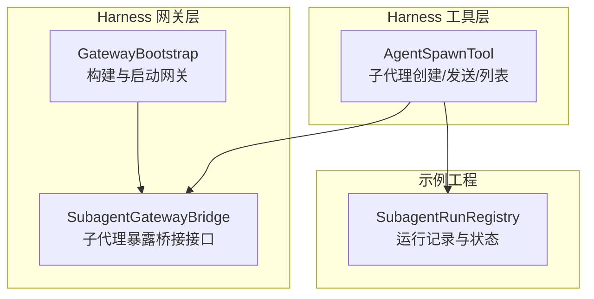
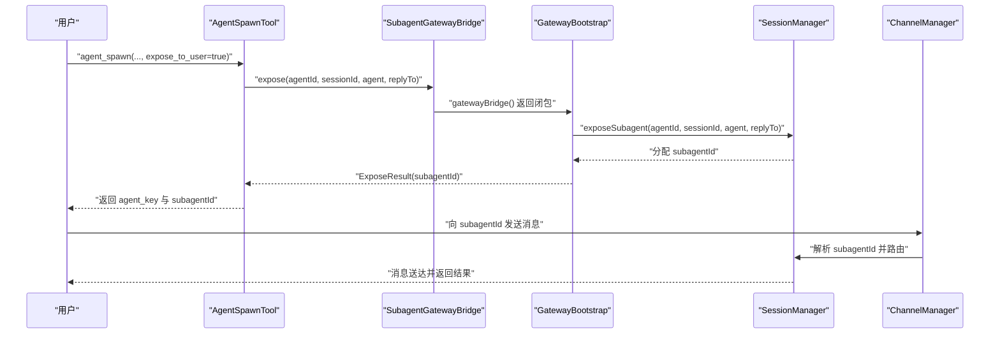
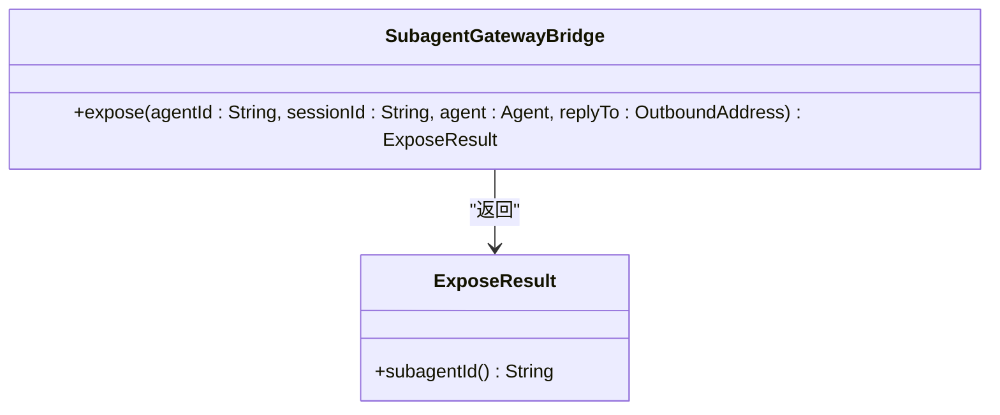
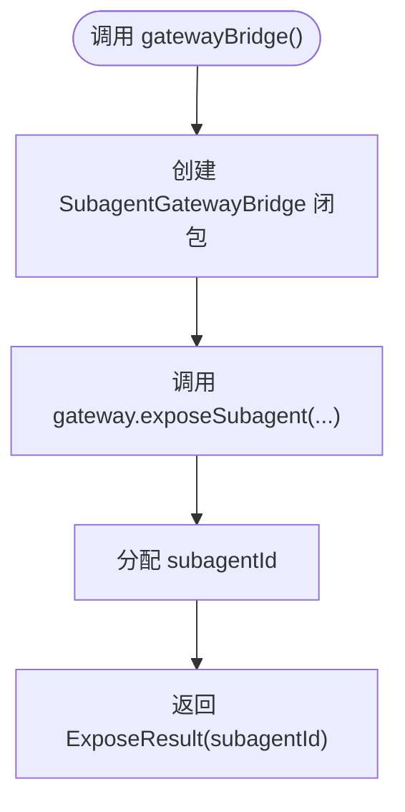
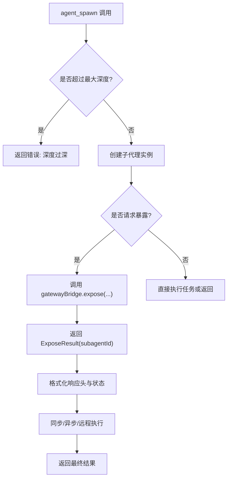
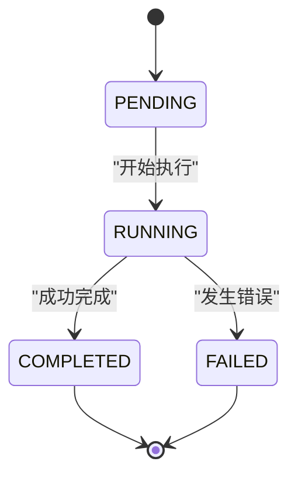
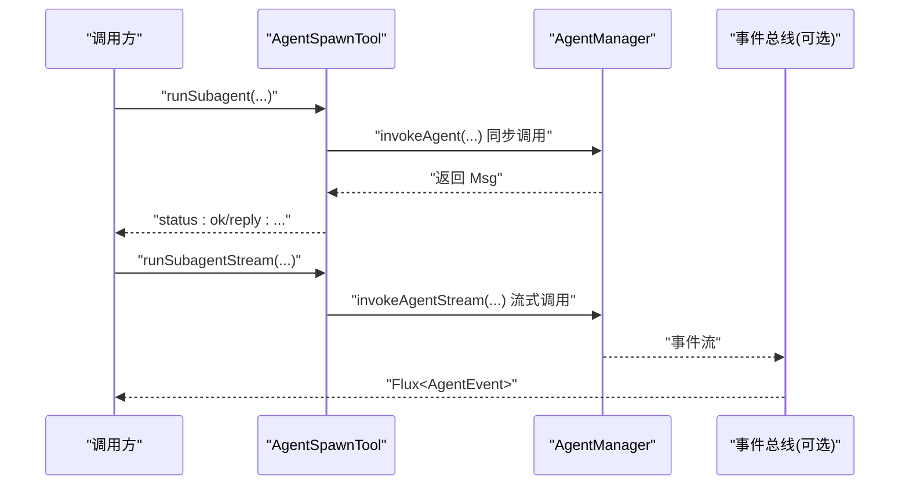
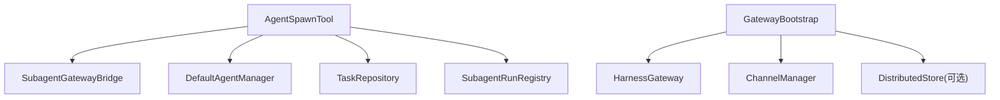

# 子代理桥接API

<cite>
**本文档引用的文件**
- [SubagentGatewayBridge.java](file://agentscope-harness/src/main/java/io/agentscope/harness/agent/gateway/SubagentGatewayBridge.java)
- [GatewayBootstrap.java](file://agentscope-harness/src/main/java/io/agentscope/harness/agent/gateway/GatewayBootstrap.java)
- [AgentSpawnTool.java](file://agentscope-harness/src/main/java/io/agentscope/harness/agent/tool/AgentSpawnTool.java)
- [SubagentRunRegistry.java](file://agentscope-examples/agents/agentscope-builder/src/main/java/io/agentscope/builder/runtime/session/SubagentRunRegistry.java)
- [channel.md](file://docs/v2/en/docs/harness/channel.md)
</cite>

## 目录
1. [简介](#简介)
2. [项目结构](#项目结构)
3. [核心组件](#核心组件)
4. [架构总览](#架构总览)
5. [详细组件分析](#详细组件分析)
6. [依赖关系分析](#依赖关系分析)
7. [性能考虑](#性能考虑)
8. [故障排查指南](#故障排查指南)
9. [结论](#结论)
10. [附录](#附录)

## 简介
本文件面向子代理桥接API的使用者与维护者，系统化阐述 SubagentGatewayBridge 接口的设计与实现机制，覆盖以下主题：
- 子代理暴露流程：从 AgentSpawnTool 到网关桥接再到用户可直接寻址的 subagentId 分配
- 会话管理与路由转发：在 GatewayBootstrap 构建的网关体系中，如何将用户消息路由至已暴露的子代理
- ExposureResult 结果结构与生命周期：subagentId 的生成规则、生命周期管理与跨节点恢复能力
- runSubagent 与 runSubagentStream 方法的参数、返回值与异常处理策略
- 子代理注册、注销与状态查询的API规范与最佳实践
- 实际代码示例路径：如何通过网关桥接进行子代理通信与会话管理

## 项目结构
围绕子代理桥接API的关键模块分布如下：
- harness 层：定义网关桥接接口与引导构建器，负责将子代理暴露为用户可直接寻址的线程
- harness 工具层：AgentSpawnTool 提供子代理的创建、发送消息、列表查询等工具方法，并支持通过网关桥接暴露
- 示例工程中的会话与运行记录：SubagentRunRegistry 记录子代理运行元数据，用于可观测性与关联

**图表来源**
- [GatewayBootstrap.java:127-138](file://agentscope-harness/src/main/java/io/agentscope/harness/agent/gateway/GatewayBootstrap.java#L127-L138)
- [SubagentGatewayBridge.java:29-50](file://agentscope-harness/src/main/java/io/agentscope/harness/agent/gateway/SubagentGatewayBridge.java#L29-L50)
- [AgentSpawnTool.java:183-423](file://agentscope-harness/src/main/java/io/agentscope/harness/agent/tool/AgentSpawnTool.java#L183-L423)
- [SubagentRunRegistry.java:24-62](file://agentscope-examples/agents/agentscope-builder/src/main/java/io/agentscope/builder/runtime/session/SubagentRunRegistry.java#L24-L62)

**章节来源**
- [GatewayBootstrap.java:127-138](file://agentscope-harness/src/main/java/io/agentscope/harness/agent/gateway/GatewayBootstrap.java#L127-L138)
- [SubagentGatewayBridge.java:29-50](file://agentscope-harness/src/main/java/io/agentscope/harness/agent/gateway/SubagentGatewayBridge.java#L29-L50)
- [AgentSpawnTool.java:183-423](file://agentscope-harness/src/main/java/io/agentscope/harness/agent/tool/AgentSpawnTool.java#L183-L423)
- [SubagentRunRegistry.java:24-62](file://agentscope-examples/agents/agentscope-builder/src/main/java/io/agentscope/builder/runtime/session/SubagentRunRegistry.java#L24-L62)

## 核心组件
- SubagentGatewayBridge：定义子代理暴露的桥接接口，提供 expose 方法与 ExposeResult 结果类型
- GatewayBootstrap：提供 gatewayBridge() 工厂方法，将子代理暴露为用户可寻址的 thread_id（即 subagentId）
- AgentSpawnTool：实现子代理的创建、消息发送、异步任务提交与超时提升；支持通过网关桥接暴露
- SubagentRunRegistry：记录子代理运行元数据（运行ID、状态、时间戳、错误信息等），便于可观测性与关联

**章节来源**
- [SubagentGatewayBridge.java:29-50](file://agentscope-harness/src/main/java/io/agentscope/harness/agent/gateway/SubagentGatewayBridge.java#L29-L50)
- [GatewayBootstrap.java:127-138](file://agentscope-harness/src/main/java/io/agentscope/harness/agent/gateway/GatewayBootstrap.java#L127-L138)
- [AgentSpawnTool.java:183-423](file://agentscope-harness/src/main/java/io/agentscope/harness/agent/tool/AgentSpawnTool.java#L183-L423)
- [SubagentRunRegistry.java:24-62](file://agentscope-examples/agents/agentscope-builder/src/main/java/io/agentscope/builder/runtime/session/SubagentRunRegistry.java#L24-L62)

## 架构总览
子代理暴露与路由转发的整体流程如下：

**图表来源**
- [AgentSpawnTool.java:314-322](file://agentscope-harness/src/main/java/io/agentscope/harness/agent/tool/AgentSpawnTool.java#L314-L322)
- [GatewayBootstrap.java:133-137](file://agentscope-harness/src/main/java/io/agentscope/harness/agent/gateway/GatewayBootstrap.java#L133-L137)
- [SubagentGatewayBridge.java:49](file://agentscope-harness/src/main/java/io/agentscope/harness/agent/gateway/SubagentGatewayBridge.java#L49)

**章节来源**
- [AgentSpawnTool.java:314-322](file://agentscope-harness/src/main/java/io/agentscope/harness/agent/tool/AgentSpawnTool.java#L314-L322)
- [GatewayBootstrap.java:133-137](file://agentscope-harness/src/main/java/io/agentscope/harness/agent/gateway/GatewayBootstrap.java#L133-L137)
- [SubagentGatewayBridge.java:49](file://agentscope-harness/src/main/java/io/agentscope/harness/agent/gateway/SubagentGatewayBridge.java#L49)

## 详细组件分析

### SubagentGatewayBridge 接口与 ExposeResult
- 接口职责：作为 AgentSpawnTool 与网关层之间的桥接，允许子代理以用户可寻址的入口点暴露，无需了解通道、路由器或具体网关实现细节
- expose 方法签名与语义：
  - 参数：agentId（子代理类型标识）、sessionId（分配给子代理的会话ID）、agent（子代理实例）、replyTo（回复出站地址，可能为空）
  - 返回：ExposeResult，其中包含用户可见的 subagentId
- ExposeResult 结果结构：record 类型，仅包含 subagentId 字段，用于承载暴露后的用户寻址句柄

**图表来源**
- [SubagentGatewayBridge.java:29-50](file://agentscope-harness/src/main/java/io/agentscope/harness/agent/gateway/SubagentGatewayBridge.java#L29-L50)

**章节来源**
- [SubagentGatewayBridge.java:29-50](file://agentscope-harness/src/main/java/io/agentscope/harness/agent/gateway/SubagentGatewayBridge.java#L29-L50)

### GatewayBootstrap 与子代理暴露工厂
- gatewayBridge() 方法：返回一个 SubagentGatewayBridge 实现，内部委托给网关的 exposeSubagent，将 agentId、sessionId、agent、replyTo 传递给底层会话管理器
- 暴露后的 subagentId：作为用户可直接寻址的 thread_id，用于后续消息路由

**图表来源**
- [GatewayBootstrap.java:133-137](file://agentscope-harness/src/main/java/io/agentscope/harness/agent/gateway/GatewayBootstrap.java#L133-L137)

**章节来源**
- [GatewayBootstrap.java:133-137](file://agentscope-harness/src/main/java/io/agentscope/harness/agent/gateway/GatewayBootstrap.java#L133-L137)

### AgentSpawnTool：子代理创建与消息发送
- agent_spawn：
  - 解析参数与上下文，检查最大深度限制与标签唯一性
  - 创建子代理实例，必要时继承父权限与计划模式
  - 可选地通过网关桥接暴露子代理，生成 subagentId
  - 支持同步执行、远程执行与异步任务提交；超时未完成时将执行提升为后台任务
- agent_send：
  - 通过 agent_key 或 label 定位已存在的子代理
  - 支持同步、远程与异步三种执行路径
- agent_list：
  - 列出当前活跃的子代理（agent_key、agent_id、label、spawn_depth）

**图表来源**
- [AgentSpawnTool.java:235-423](file://agentscope-harness/src/main/java/io/agentscope/harness/agent/tool/AgentSpawnTool.java#L235-L423)

**章节来源**
- [AgentSpawnTool.java:183-423](file://agentscope-harness/src/main/java/io/agentscope/harness/agent/tool/AgentSpawnTool.java#L183-L423)

### 子代理运行记录与生命周期
- SubagentRunRegistry：记录子代理运行的元数据（运行ID、子会话键、请求者会话键、agentId、状态、时间戳、摘要与错误信息）
- 生命周期阶段：PENDING → RUNNING → COMPLETED/FAILED
- 作用：用于可观测性、关联与跨节点恢复（结合分布式存储）

**图表来源**
- [SubagentRunRegistry.java:26-43](file://agentscope-examples/agents/agentscope-builder/src/main/java/io/agentscope/builder/runtime/session/SubagentRunRegistry.java#L26-L43)

**章节来源**
- [SubagentRunRegistry.java:24-62](file://agentscope-examples/agents/agentscope-builder/src/main/java/io/agentscope/builder/runtime/session/SubagentRunRegistry.java#L24-L62)

### runSubagent 与 runSubagentStream 方法
- runSubagent（同步）：
  - 参数：agentId、sessionId、prompt、runtimeContext、timeoutMs
  - 返回：字符串结果（status、reply 等）
  - 异常处理：超时则将执行提升为后台任务并返回 task_id；其他错误包装为错误信息
- runSubagentStream（流式）：
  - 参数：agentId、sessionId、prompt、runtimeContext、streamOptions
  - 返回：Flux<AgentEvent> 流事件
  - 异常处理：在流式上下文中转发子代理事件，确保父级事件流的连续性

**图表来源**
- [AgentSpawnTool.java:613-686](file://agentscope-harness/src/main/java/io/agentscope/harness/agent/tool/AgentSpawnTool.java#L613-L686)

**章节来源**
- [AgentSpawnTool.java:613-686](file://agentscope-harness/src/main/java/io/agentscope/harness/agent/tool/AgentSpawnTool.java#L613-L686)

## 依赖关系分析
- AgentSpawnTool 依赖：
  - SubagentGatewayBridge：用于暴露子代理
  - DefaultAgentManager：创建与调用子代理
  - TaskRepository：异步任务持久化
  - SubagentRunRegistry：运行记录更新
- GatewayBootstrap 依赖：
  - HarnessGateway：会话与路由管理
  - ChannelManager：出站通道管理
  - DistributedStore：跨节点恢复（可选）

**图表来源**
- [AgentSpawnTool.java:123-166](file://agentscope-harness/src/main/java/io/agentscope/harness/agent/tool/AgentSpawnTool.java#L123-L166)
- [GatewayBootstrap.java:272-311](file://agentscope-harness/src/main/java/io/agentscope/harness/agent/gateway/GatewayBootstrap.java#L272-L311)

**章节来源**
- [AgentSpawnTool.java:123-166](file://agentscope-harness/src/main/java/io/agentscope/harness/agent/tool/AgentSpawnTool.java#L123-L166)
- [GatewayBootstrap.java:272-311](file://agentscope-harness/src/main/java/io/agentscope/harness/agent/gateway/GatewayBootstrap.java#L272-L311)

## 性能考虑
- 超时提升策略：当同步执行在超时前未完成，AgentSpawnTool 将在不中断原执行的前提下将其提升为后台任务，避免资源浪费
- 事件转发开销：在存在事件总线或流式上下文时，事件转发会带来额外的序列化与传播成本，建议在非流式场景下使用同步调用
- 暴露子代理的路由成本：subagentId 的分配与路由解析需在会话管理器中完成，建议合理设置分布式存储以降低跨节点查找成本

## 故障排查指南
- 深度超限：当子代理嵌套层级超过最大限制时，agent_spawn 将返回错误提示
- 未知 agent_id：若子代理声明不存在或为主模式独占类型，将返回相应错误
- 标签冲突：重复的标签会导致暴露失败，需更换唯一标签
- 超时未完成：同步执行超时会被提升为后台任务，检查 TaskRepository 中的任务状态
- 远程执行失败：远程子代理 URL 或凭据配置错误会导致执行异常，需核对声明配置

**章节来源**
- [AgentSpawnTool.java:235-252](file://agentscope-harness/src/main/java/io/agentscope/harness/agent/tool/AgentSpawnTool.java#L235-L252)
- [AgentSpawnTool.java:314-322](file://agentscope-harness/src/main/java/io/agentscope/harness/agent/tool/AgentSpawnTool.java#L314-L322)
- [AgentSpawnTool.java:782-799](file://agentscope-harness/src/main/java/io/agentscope/harness/agent/tool/AgentSpawnTool.java#L782-L799)

## 结论
SubagentGatewayBridge 通过简洁的 expose 接口与 GatewayBootstrap 的工厂方法，实现了子代理的无缝暴露与用户可寻址路由。配合 AgentSpawnTool 的创建、发送与超时提升机制，以及 SubagentRunRegistry 的运行记录，形成了完整的子代理生命周期管理闭环。在生产环境中，建议结合分布式存储实现跨节点恢复，并根据业务场景选择同步/异步/流式执行路径。

## 附录

### API 规范与示例路径

- 子代理暴露（AgentSpawnTool）
  - 方法：agent_spawn
  - 关键参数：agent_id、task、label、timeout_seconds、expose_to_user
  - 返回：包含 agent_key、agent_id、session_id、thread_id（当 expose_to_user=true 时）
  - 示例路径：[AgentSpawnTool.java:194-423](file://agentscope-harness/src/main/java/io/agentscope/harness/agent/tool/AgentSpawnTool.java#L194-L423)

- 子代理消息发送（AgentSpawnTool）
  - 方法：agent_send
  - 关键参数：agent_key 或 label、message、timeout_seconds
  - 返回：status 与 reply 或 task_id
  - 示例路径：[AgentSpawnTool.java:435-568](file://agentscope-harness/src/main/java/io/agentscope/harness/agent/tool/AgentSpawnTool.java#L435-L568)

- 子代理列表（AgentSpawnTool）
  - 方法：agent_list
  - 返回：当前活跃子代理清单
  - 示例路径：[AgentSpawnTool.java:570-587](file://agentscope-harness/src/main/java/io/agentscope/harness/agent/tool/AgentSpawnTool.java#L570-L587)

- 网关桥接（GatewayBootstrap）
  - 方法：gatewayBridge()
  - 返回：SubagentGatewayBridge 实现，内部委托会话管理器分配 subagentId
  - 示例路径：[GatewayBootstrap.java:133-137](file://agentscope-harness/src/main/java/io/agentscope/harness/agent/gateway/GatewayBootstrap.java#L133-L137)

- 文档参考
  - 子代理暴露与路由说明：[channel.md:209-223](file://docs/v2/en/docs/harness/channel.md#L209-L223)