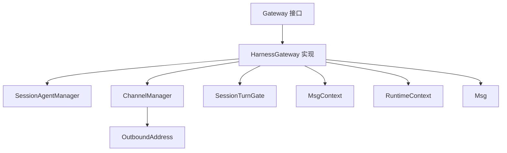
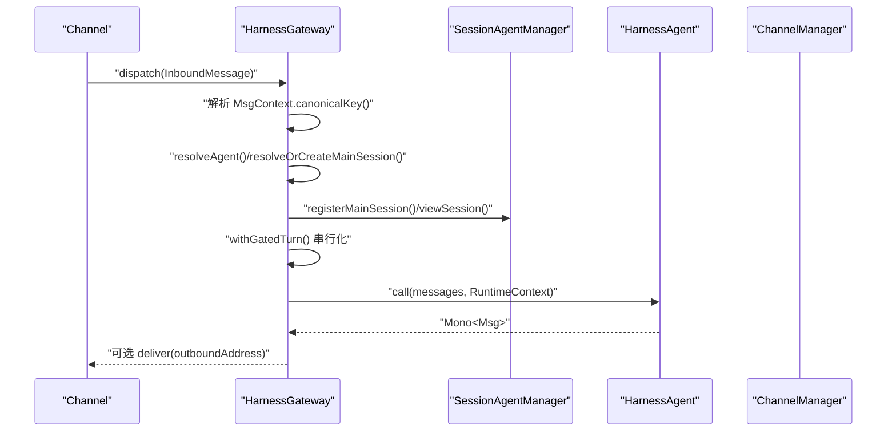
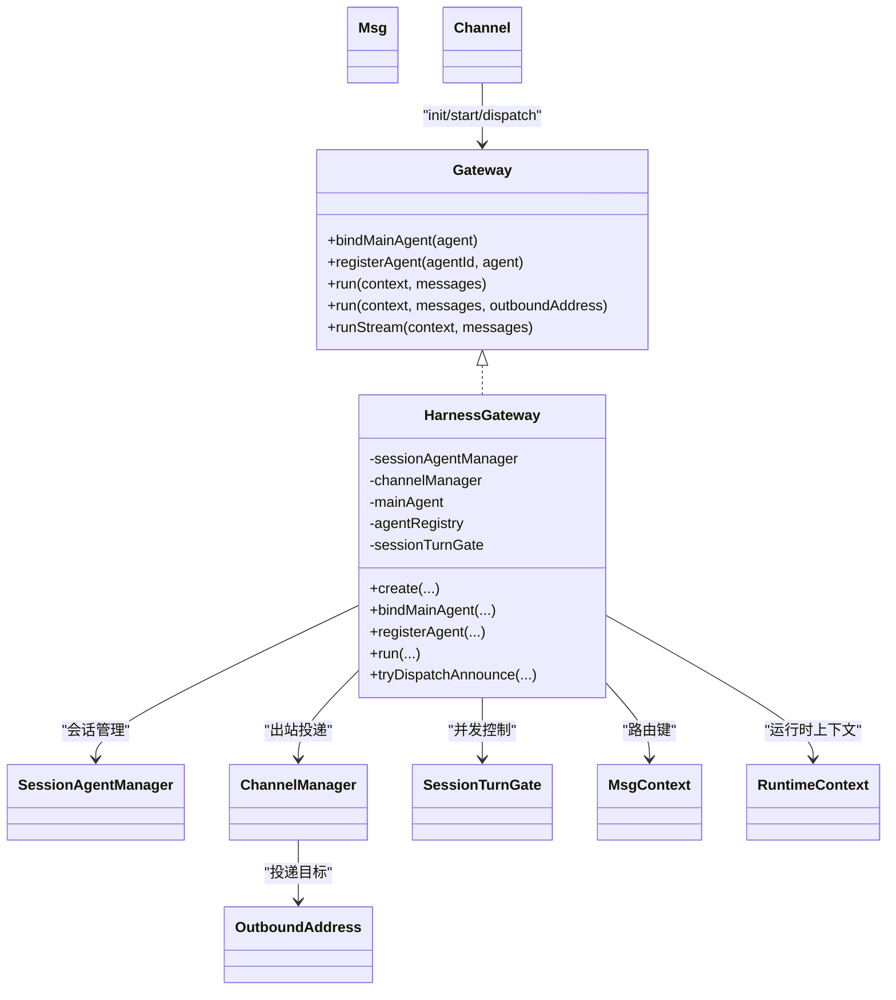

# 网关核心API

<cite>
**本文引用的文件**
- [Gateway.java](file://agentscope-harness/src/main/java/io/agentscope/harness/agent/gateway/Gateway.java)
- [HarnessGateway.java（构建器示例）](file://agentscope-examples/agents/agentscope-builder/src/main/java/io/agentscope/builder/runtime/gateway/HarnessGateway.java)
- [HarnessGateway.java（PAW示例）](file://agentscope-examples/agents/agentscope-paw/src/main/java/io/agentscope/claw2/runtime/gateway/HarnessGateway.java)
- [HarnessGateway.java（DataAgent示例）](file://agentscope-examples/agents/agentscope-dataagent/src/main/java/io/agentscope/dataagent/runtime/gateway/HarnessGateway.java)
- [MsgContext.java](file://agentscope-harness/src/main/java/io/agentscope/harness/agent/gateway/MsgContext.java)
- [SessionTurnGate.java](file://agentscope-harness/src/main/java/io/agentscope/harness/agent/gateway/SessionTurnGate.java)
- [ChannelManager.java](file://agentscope-harness/src/main/java/io/agentscope/harness/agent/gateway/channel/ChannelManager.java)
- [OutboundAddress.java](file://agentscope-harness/src/main/java/io/agentscope/harness/agent/gateway/channel/OutboundAddress.java)
- [SessionAgentManager.java](file://agentscope-examples/agents/agentscope-builder/src/main/java/io/agentscope/builder/runtime/session/SessionAgentManager.java)
- [SessionEntry.java](file://agentscope-examples/agents/agentscope-builder/src/main/java/io/agentscope/builder/runtime/session/SessionEntry.java)
- [SessionView.java](file://agentscope-examples/agents/agentscope-builder/src/main/java/io/agentscope/builder/runtime/session/SessionView.java)
- [RuntimeContext.java](file://agentscope-core/src/main/java/io/agentscope/core/agent/RuntimeContext.java)
- [Msg.java](file://agentscope-core/src/main/java/io/agentscope/core/message/Msg.java)
- [BuilderBootstrap.java](file://agentscope-examples/agents/agentscope-builder/src/main/java/io/agentscope/builder/runtime/BuilderBootstrap.java)
- [channel.md](file://docs/v2/en/docs/harness/channel.md)
</cite>

## 目录
1. [简介](#简介)
2. [项目结构](#项目结构)
3. [核心组件](#核心组件)
4. [架构总览](#架构总览)
5. [详细组件分析](#详细组件分析)
6. [依赖分析](#依赖分析)
7. [性能考虑](#性能考虑)
8. [故障排查指南](#故障排查指南)
9. [结论](#结论)
10. [附录：使用示例与最佳实践](#附录使用示例与最佳实践)

## 简介
本文件面向Gateway网关核心API，聚焦以下目标：
- 全面梳理Gateway接口的公共方法，包括bindMainAgent、registerAgent、run与runStream等核心方法的参数、返回值与典型使用场景
- 深入解析HarnessGateway的具体实现与配置选项，涵盖网关初始化、代理绑定、消息路由机制与生命周期管理
- 明确MsgContext的作用与属性，解释会话标识、路由信息与上下文数据在网关中的流转
- 提供网关生命周期管理的API规范（启动、停止、重置），并给出可直接参考的代码片段路径
- 给出实际代码示例，展示如何创建与配置网关实例

## 项目结构
围绕网关能力，涉及的核心模块与文件如下：
- 接口层：Gateway接口定义统一入口
- 实现层：HarnessGateway在不同示例工程中的具体实现
- 路由与会话：MsgContext、SessionTurnGate、SessionAgentManager
- 出站通道：ChannelManager、OutboundAddress
- 运行时上下文：RuntimeContext、Msg
- 引导与装配：BuilderBootstrap

图表来源
- [Gateway.java:33-96](file://agentscope-harness/src/main/java/io/agentscope/harness/agent/gateway/Gateway.java#L33-L96)
- [HarnessGateway.java（构建器示例）:71-134](file://agentscope-examples/agents/agentscope-builder/src/main/java/io/agentscope/builder/runtime/gateway/HarnessGateway.java#L71-L134)
- [SessionAgentManager.java](file://agentscope-examples/agents/agentscope-builder/src/main/java/io/agentscope/builder/runtime/session/SessionAgentManager.java)
- [ChannelManager.java](file://agentscope-harness/src/main/java/io/agentscope/harness/agent/gateway/channel/ChannelManager.java)
- [SessionTurnGate.java](file://agentscope-harness/src/main/java/io/agentscope/harness/agent/gateway/SessionTurnGate.java)
- [MsgContext.java](file://agentscope-harness/src/main/java/io/agentscope/harness/agent/gateway/MsgContext.java)
- [RuntimeContext.java](file://agentscope-core/src/main/java/io/agentscope/core/agent/RuntimeContext.java)
- [Msg.java](file://agentscope-core/src/main/java/io/agentscope/core/message/Msg.java)
- [OutboundAddress.java](file://agentscope-harness/src/main/java/io/agentscope/harness/agent/gateway/channel/OutboundAddress.java)

章节来源
- [Gateway.java:33-96](file://agentscope-harness/src/main/java/io/agentscope/harness/agent/gateway/Gateway.java#L33-L96)
- [HarnessGateway.java（构建器示例）:71-134](file://agentscope-examples/agents/agentscope-builder/src/main/java/io/agentscope/builder/runtime/gateway/HarnessGateway.java#L71-L134)

## 核心组件
- Gateway接口：定义网关统一入口，包括主代理绑定、代理注册、同步与流式调用、子代理路由等默认行为
- HarnessGateway实现：在多处示例工程中提供一致的实现，负责会话路由、并发控制、出站投递与生命周期恢复
- MsgContext：承载会话键、用户标识与扩展字段，用于路由与上下文传递
- SessionAgentManager：会话与代理生命周期管理，支持MAIN会话注册、会话视图与新鲜度评估
- ChannelManager/OutboundAddress：出站消息投递，支持按通道与目标地址回推
- SessionTurnGate：基于会话键的公平锁，保证同一会话内串行执行
- RuntimeContext：运行时上下文，携带会话ID、消息上下文与用户ID等

章节来源
- [Gateway.java:33-96](file://agentscope-harness/src/main/java/io/agentscope/harness/agent/gateway/Gateway.java#L33-L96)
- [HarnessGateway.java（构建器示例）:71-134](file://agentscope-examples/agents/agentscope-builder/src/main/java/io/agentscope/builder/runtime/gateway/HarnessGateway.java#L71-L134)
- [MsgContext.java](file://agentscope-harness/src/main/java/io/agentscope/harness/agent/gateway/MsgContext.java)
- [SessionAgentManager.java](file://agentscope-examples/agents/agentscope-builder/src/main/java/io/agentscope/builder/runtime/session/SessionAgentManager.java)
- [ChannelManager.java](file://agentscope-harness/src/main/java/io/agentscope/harness/agent/gateway/channel/ChannelManager.java)
- [OutboundAddress.java](file://agentscope-harness/src/main/java/io/agentscope/harness/agent/gateway/channel/OutboundAddress.java)
- [SessionTurnGate.java](file://agentscope-harness/src/main/java/io/agentscope/harness/agent/gateway/SessionTurnGate.java)
- [RuntimeContext.java](file://agentscope-core/src/main/java/io/agentscope/core/agent/RuntimeContext.java)
- [Msg.java](file://agentscope-core/src/main/java/io/agentscope/core/message/Msg.java)

## 架构总览
下图展示了从渠道到网关再到代理的端到端流程，以及会话与并发控制的关键节点。

图表来源
- [HarnessGateway.java（构建器示例）:290-329](file://agentscope-examples/agents/agentscope-builder/src/main/java/io/agentscope/builder/runtime/gateway/HarnessGateway.java#L290-L329)
- [HarnessGateway.java（构建器示例）:456-534](file://agentscope-examples/agents/agentscope-builder/src/main/java/io/agentscope/builder/runtime/gateway/HarnessGateway.java#L456-L534)
- [SessionAgentManager.java](file://agentscope-examples/agents/agentscope-builder/src/main/java/io/agentscope/builder/runtime/session/SessionAgentManager.java)
- [ChannelManager.java](file://agentscope-harness/src/main/java/io/agentscope/harness/agent/gateway/channel/ChannelManager.java)

## 详细组件分析

### Gateway接口规范
- bindMainAgent(agent): 绑定主代理，作为路由回退；同时以代理ID注册到内部映射
- registerAgent(agentId, agent): 注册命名代理，用于按agentId路由
- run(context, messages): 同步入口，返回Mono<Msg>
- run(context, messages, outboundAddress): 带出站地址跟踪的入口，记录“最后路由”以便主动回复
- run(context, message): 单消息便捷入口
- runStream(...): 流式入口，默认不支持（抛出UnsupportedOperationException）
- runSubagent(subagentId, messages)/runSubagentStream(...): 子代理直达入口，默认不支持

章节来源
- [Gateway.java:33-96](file://agentscope-harness/src/main/java/io/agentscope/harness/agent/gateway/Gateway.java#L33-L96)

### HarnessGateway实现要点
- 初始化与装配
  - create(sessionAgentManager[, channelManager]): 设置AnnounceDispatcher与SpawnInterceptor，恢复持久化的MAIN会话映射
  - sessionAgentManager(): 获取会话管理器
  - channelManager(): 获取出站通道管理器（可能为空）
- 代理绑定与注册
  - bindMainAgent(agent): 写入mainAgent，注册到agentRegistry，并设置defaultAgentId
  - registerAgent(agentId, agent): 注册命名代理
  - findAgent(gatewayId): 查询已注册代理（便于平台控制器探查）
  - setFilesystemUserIdResolver(resolver): 安装文件系统用户ID解析器，用于共享代理的命名空间一致性
- 消息路由与会话管理
  - run(context, messages[, outboundAddress]): 解析agentId → resolveAgent → resolveOrCreateMainSession → withGatedTurn → ha.call
  - tryDispatchAnnounce(completion): 子代理完成通告的网关式派发，构造announce消息并通过ChannelManager回推
  - onSpawn(result, parentSessionKey): 记录gateKey、agentId与lastRoute映射，确保通告正确回到原通道与目标
- 并发与序列化
  - SessionTurnGate.acquire/release：基于MsgContext.canonicalKey()的公平锁，保证同一会话串行执行
- 生命周期与恢复
  - restorePersistedMainSessions(): 依据SessionResetPolicy恢复路由映射，跳过陈旧会话

章节来源
- [HarnessGateway.java（构建器示例）:136-158](file://agentscope-examples/agents/agentscope-builder/src/main/java/io/agentscope/builder/runtime/gateway/HarnessGateway.java#L136-L158)
- [HarnessGateway.java（构建器示例）:170-206](file://agentscope-examples/agents/agentscope-builder/src/main/java/io/agentscope/builder/runtime/gateway/HarnessGateway.java#L170-L206)
- [HarnessGateway.java（构建器示例）:208-226](file://agentscope-examples/agents/agentscope-builder/src/main/java/io/agentscope/builder/runtime/gateway/HarnessGateway.java#L208-L226)
- [HarnessGateway.java（构建器示例）:275-329](file://agentscope-examples/agents/agentscope-builder/src/main/java/io/agentscope/builder/runtime/gateway/HarnessGateway.java#L275-L329)
- [HarnessGateway.java（构建器示例）:331-424](file://agentscope-examples/agents/agentscope-builder/src/main/java/io/agentscope/builder/runtime/gateway/HarnessGateway.java#L331-L424)
- [HarnessGateway.java（构建器示例）:456-534](file://agentscope-examples/agents/agentscope-builder/src/main/java/io/agentscope/builder/runtime/gateway/HarnessGateway.java#L456-L534)

### MsgContext的作用与属性
- canonicalKey(): 会话路由键，决定MAIN会话注册与复用
- userId(): 用户标识，参与会话键生成与文件系统命名空间解析
- extra(): 扩展字段，如agentId（键名约定为"agentId"），用于按代理ID路由
- defaultContext(): 默认上下文工厂，用于空上下文兜底

章节来源
- [MsgContext.java](file://agentscope-harness/src/main/java/io/agentscope/harness/agent/gateway/MsgContext.java)
- [HarnessGateway.java（构建器示例）:290-329](file://agentscope-examples/agents/agentscope-builder/src/main/java/io/agentscope/builder/runtime/gateway/HarnessGateway.java#L290-L329)

### 会话与并发控制
- MAIN会话注册与复用：首次调用根据MsgContext.canonicalKey()创建，后续复用
- 会话新鲜度：依据SessionResetPolicy与SessionFreshnessEvaluator判断是否滚动新会话
- 公平锁：SessionTurnGate对每个gateKey进行acquire/release，避免同会话并发冲突

章节来源
- [HarnessGateway.java（构建器示例）:468-507](file://agentscope-examples/agents/agentscope-builder/src/main/java/io/agentscope/builder/runtime/gateway/HarnessGateway.java#L468-L507)
- [SessionTurnGate.java](file://agentscope-harness/src/main/java/io/agentscope/harness/agent/gateway/SessionTurnGate.java)

### 出站投递与通告派发
- lastRouteBySessionKey：记录会话的“最后路由”，用于主动回复（子代理通告）的回推
- deliverAnnounceReply(target, reply)：通过ChannelManager与OutboundAddress投递回复
- tryDispatchAnnounce：根据requesterSessionKey查找gateKey与agentId，构造announce消息并调度

章节来源
- [HarnessGateway.java（构建器示例）:106-111](file://agentscope-examples/agents/agentscope-builder/src/main/java/io/agentscope/builder/runtime/gateway/HarnessGateway.java#L106-L111)
- [HarnessGateway.java（构建器示例）:357-424](file://agentscope-examples/agents/agentscope-builder/src/main/java/io/agentscope/builder/runtime/gateway/HarnessGateway.java#L357-L424)
- [ChannelManager.java](file://agentscope-harness/src/main/java/io/agentscope/harness/agent/gateway/channel/ChannelManager.java)
- [OutboundAddress.java](file://agentscope-harness/src/main/java/io/agentscope/harness/agent/gateway/channel/OutboundAddress.java)

### 生命周期管理API规范
- 创建与初始化
  - create(sessionAgentManager[, channelManager]): 完成AnnounceDispatcher与SpawnInterceptor注册，并恢复路由映射
- 运行期
  - run/runStream：处理入站消息与流式事件
  - tryDispatchAnnounce：处理子代理完成通告
- 关闭与停止
  - 通过BuilderBootstrap或ChannelManager进行统一启动/停止（见附录）

章节来源
- [HarnessGateway.java（构建器示例）:136-158](file://agentscope-examples/agents/agentscope-builder/src/main/java/io/agentscope/builder/runtime/gateway/HarnessGateway.java#L136-L158)
- [BuilderBootstrap.java:174-200](file://agentscope-examples/agents/agentscope-builder/src/main/java/io/agentscope/builder/runtime/BuilderBootstrap.java#L174-L200)

## 依赖分析
- 组件耦合
  - HarnessGateway强依赖SessionAgentManager（会话生命周期）、ChannelManager（出站投递）、SessionTurnGate（并发控制）
  - 通过MsgContext与RuntimeContext在路由与上下文间传递关键信息
- 外部集成点
  - Channel接口适配不同消息平台，通过Gateway.run/runStream接入
  - OutboundAddress承载出站目标，配合ChannelManager完成回推

图表来源
- [Gateway.java:33-96](file://agentscope-harness/src/main/java/io/agentscope/harness/agent/gateway/Gateway.java#L33-L96)
- [HarnessGateway.java（构建器示例）:71-134](file://agentscope-examples/agents/agentscope-builder/src/main/java/io/agentscope/builder/runtime/gateway/HarnessGateway.java#L71-L134)
- [SessionAgentManager.java](file://agentscope-examples/agents/agentscope-builder/src/main/java/io/agentscope/builder/runtime/session/SessionAgentManager.java)
- [ChannelManager.java](file://agentscope-harness/src/main/java/io/agentscope/harness/agent/gateway/channel/ChannelManager.java)
- [SessionTurnGate.java](file://agentscope-harness/src/main/java/io/agentscope/harness/agent/gateway/SessionTurnGate.java)
- [MsgContext.java](file://agentscope-harness/src/main/java/io/agentscope/harness/agent/gateway/MsgContext.java)
- [RuntimeContext.java](file://agentscope-core/src/main/java/io/agentscope/core/agent/RuntimeContext.java)
- [Msg.java](file://agentscope-core/src/main/java/io/agentscope/core/message/Msg.java)
- [OutboundAddress.java](file://agentscope-harness/src/main/java/io/agentscope/harness/agent/gateway/channel/OutboundAddress.java)

## 性能考虑
- 并发控制：SessionTurnGate确保同一会话串行执行，避免竞争与状态冲突
- 调度线程：withGatedTurn使用boundedElastic调度器，避免阻塞主线程
- 会话新鲜度：依据策略评估会话是否陈旧，必要时滚动新会话，平衡状态一致性与资源占用
- 出站投递：仅在存在ChannelManager与lastRoute时进行，避免无效投递

章节来源
- [HarnessGateway.java（构建器示例）:514-534](file://agentscope-examples/agents/agentscope-builder/src/main/java/io/agentscope/builder/runtime/gateway/HarnessGateway.java#L514-L534)
- [HarnessGateway.java（构建器示例）:490-507](file://agentscope-examples/agents/agentscope-builder/src/main/java/io/agentscope/builder/runtime/gateway/HarnessGateway.java#L490-L507)
- [HarnessGateway.java（构建器示例）:426-451](file://agentscope-examples/agents/agentscope-builder/src/main/java/io/agentscope/builder/runtime/gateway/HarnessGateway.java#L426-L451)

## 故障排查指南
- 未绑定主代理即调用run：会返回错误，提示需先bindMainAgent
  - 参考路径：[HarnessGateway.java（构建器示例）:296-301](file://agentscope-examples/agents/agentscope-builder/src/main/java/io/agentscope/builder/runtime/gateway/HarnessGateway.java#L296-L301)
- 陈旧会话被跳过：restorePersistedMainSessions会按策略评估并跳过陈旧会话
  - 参考路径：[HarnessGateway.java（构建器示例）:175-206](file://agentscope-examples/agents/agentscope-builder/src/main/java/io/agentscope/builder/runtime/gateway/HarnessGateway.java#L175-L206)
- 出站投递失败：deliverAnnounceReply会记录警告日志，检查ChannelManager与OutboundAddress
  - 参考路径：[HarnessGateway.java（构建器示例）:426-451](file://agentscope-examples/agents/agentscope-builder/src/main/java/io/agentscope/builder/runtime/gateway/HarnessGateway.java#L426-L451)
- 并发异常：若中断获取锁，withGatedTurn会转换为IllegalStateException
  - 参考路径：[HarnessGateway.java（构建器示例）:514-534](file://agentscope-examples/agents/agentscope-builder/src/main/java/io/agentscope/builder/runtime/gateway/HarnessGateway.java#L514-L534)

章节来源
- [HarnessGateway.java（构建器示例）:296-301](file://agentscope-examples/agents/agentscope-builder/src/main/java/io/agentscope/builder/runtime/gateway/HarnessGateway.java#L296-L301)
- [HarnessGateway.java（构建器示例）:175-206](file://agentscope-examples/agents/agentscope-builder/src/main/java/io/agentscope/builder/runtime/gateway/HarnessGateway.java#L175-L206)
- [HarnessGateway.java（构建器示例）:426-451](file://agentscope-examples/agents/agentscope-builder/src/main/java/io/agentscope/builder/runtime/gateway/HarnessGateway.java#L426-L451)
- [HarnessGateway.java（构建器示例）:514-534](file://agentscope-examples/agents/agentscope-builder/src/main/java/io/agentscope/builder/runtime/gateway/HarnessGateway.java#L514-L534)

## 结论
HarnessGateway提供了稳定、可扩展的网关实现，具备完善的会话路由、并发控制与出站投递能力。通过MsgContext与RuntimeContext，网关在多租户与共享代理场景下仍能保持会话隔离与命名空间一致性。结合ChannelManager与SessionAgentManager，可快速适配多种消息平台并实现可靠的消息流转。

## 附录：使用示例与最佳实践

### 如何创建与配置网关实例
- 使用静态工厂创建并装配网关
  - 参考路径：[HarnessGateway.java（构建器示例）:136-158](file://agentscope-examples/agents/agentscope-builder/src/main/java/io/agentscope/builder/runtime/gateway/HarnessGateway.java#L136-L158)
- 在引导阶段注册主代理与命名代理
  - 参考路径：[HarnessGateway.java（构建器示例）:208-226](file://agentscope-examples/agents/agentscope-builder/src/main/java/io/agentscope/builder/runtime/gateway/HarnessGateway.java#L208-L226)
- 通过BuilderBootstrap统一启动/停止所有通道
  - 参考路径：[BuilderBootstrap.java:174-200](file://agentscope-examples/agents/agentscope-builder/src/main/java/io/agentscope/builder/runtime/BuilderBootstrap.java#L174-L200)

### 如何适配自定义渠道
- 实现Channel接口并在GatewayBootstrap中注册
  - 参考路径：[channel.md:225-263](file://docs/v2/en/docs/harness/channel.md#L225-L263)

### API清单与使用场景
- bindMainAgent(agent)
  - 场景：应用启动后绑定主代理，作为默认路由回退
  - 参考路径：[HarnessGateway.java（构建器示例）:208-219](file://agentscope-examples/agents/agentscope-builder/src/main/java/io/agentscope/builder/runtime/gateway/HarnessGateway.java#L208-L219)
- registerAgent(agentId, agent)
  - 场景：多代理路由，按agentId分发
  - 参考路径：[HarnessGateway.java（构建器示例）:221-226](file://agentscope-examples/agents/agentscope-builder/src/main/java/io/agentscope/builder/runtime/gateway/HarnessGateway.java#L221-L226)
- run(context, messages)
  - 场景：标准同步调用，返回最终回复
  - 参考路径：[HarnessGateway.java（构建器示例）:280-283](file://agentscope-examples/agents/agentscope-builder/src/main/java/io/agentscope/builder/runtime/gateway/HarnessGateway.java#L280-L283)
- run(context, messages, outboundAddress)
  - 场景：带出站地址跟踪，用于主动回复
  - 参考路径：[HarnessGateway.java（构建器示例）:285-291](file://agentscope-examples/agents/agentscope-builder/src/main/java/io/agentscope/builder/runtime/gateway/HarnessGateway.java#L285-L291)
- runStream(context, messages)
  - 场景：需要细粒度事件流（部分实现支持）
  - 参考路径：[Gateway.java:69-78](file://agentscope-harness/src/main/java/io/agentscope/harness/agent/gateway/Gateway.java#L69-L78)