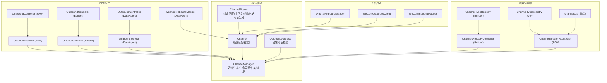
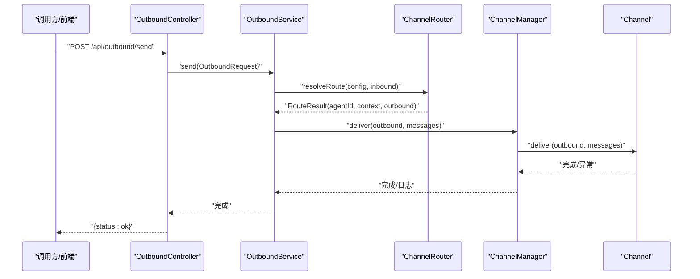
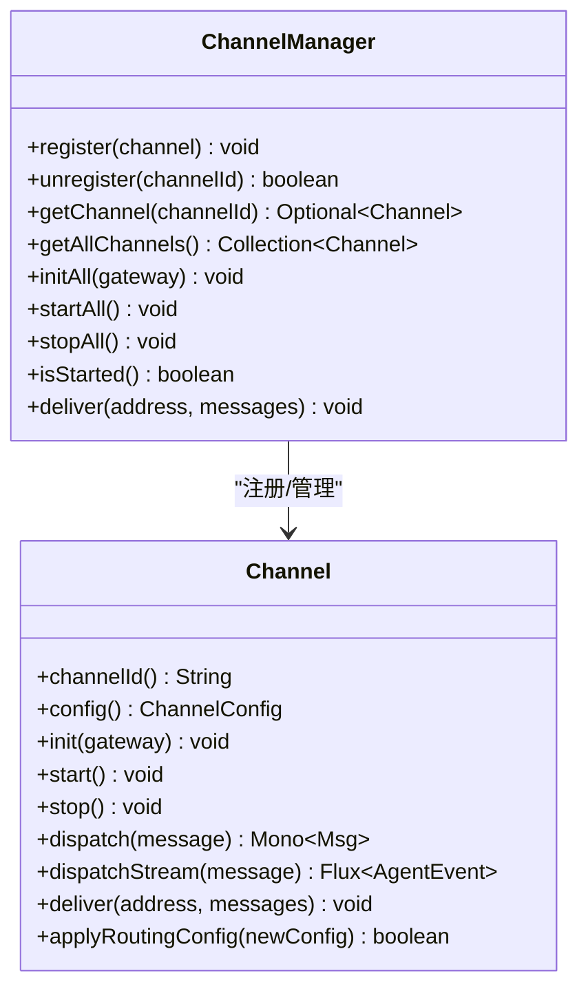
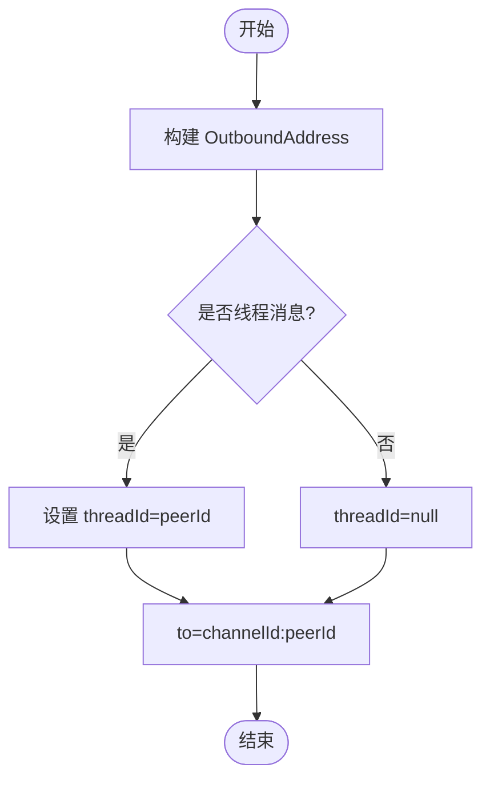
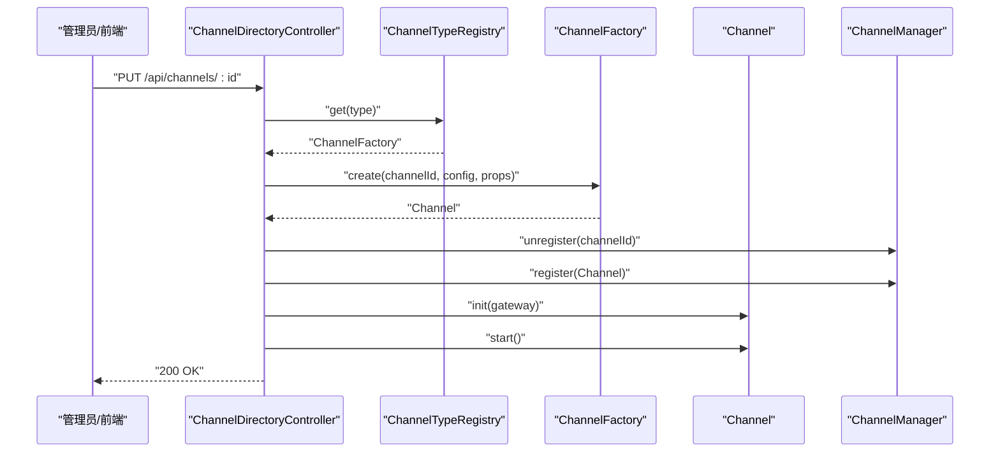
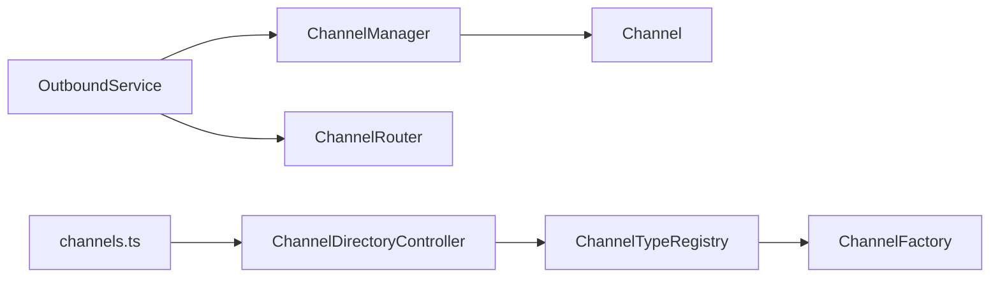

# 通道管理API

<cite>
**本文引用的文件**
- [ChannelManager.java](file://agentscope-harness/src/main/java/io/agentscope/harness/agent/gateway/ChannelManager.java)
- [Channel.java](file://agentscope-harness/src/main/java/io/agentscope/harness/agent/gateway/channel/Channel.java)
- [OutboundAddress.java](file://agentscope-harness/src/main/java/io/agentscope/harness/agent/gateway/channel/OutboundAddress.java)
- [ChannelRouter.java](file://agentscope-harness/src/main/java/io/agentscope/harness/agent/gateway/channel/ChannelRouter.java)
- [OutboundService.java（PAW 示例）](file://agentscope-examples/agents/agentscope-paw/src/main/java/io/agentscope/claw2/runtime/outbound/OutboundService.java)
- [OutboundController.java（PAW 示例）](file://agentscope-examples/agents/agentscope-paw/src/main/java/io/agentscope/claw2/runtime/outbound/OutboundController.java)
- [OutboundService.java（Builder 示例）](file://agentscope-examples/agents/agentscope-builder/src/main/java/io/agentscope/builder/runtime/outbound/OutboundService.java)
- [OutboundController.java（Builder 示例）](file://agentscope-examples/agents/agentscope-builder/src/main/java/io/agentscope/builder/runtime/outbound/OutboundController.java)
- [OutboundService.java（DataAgent 示例）](file://agentscope-examples/agents/agentscope-dataagent/src/main/java/io/agentscope/dataagent/runtime/outbound/OutboundService.java)
- [OutboundController.java（DataAgent 示例）](file://agentscope-examples/agents/agentscope-dataagent/src/main/java/io/agentscope/dataagent/runtime/outbound/OutboundController.java)
- [WebhookInboundMapper.java（DataAgent 示例）](file://agentscope-examples/agents/agentscope-dataagent/src/main/java/io/agentscope/dataagent/runtime/channel/webhook/WebhookInboundMapper.java)
- [DingTalkInboundMapper.java（扩展通道：钉钉）](file://agentscope-extensions/agentscope-extensions-channel/agentscope-extensions-channel-dingtalk/src/main/java/io/agentscope/extensions/channel/dingtalk/DingTalkInboundMapper.java)
- [WeComOutboundClient.java（扩展通道：企业微信）](file://agentscope-extensions/agentscope-extensions-channel/agentscope-extensions-channel-wecom/src/main/java/io/agentscope/extensions/channel/wecom/WeComOutboundClient.java)
- [WeComInboundMapper.java（扩展通道：企业微信）](file://agentscope-extensions/agentscope-extensions-channel/agentscope-extensions-channel-wecom/src/main/java/io/agentscope/extensions/channel/wecom/WeComInboundMapper.java)
- [ChannelDirectoryController.java（Builder 示例）](file://agentscope-examples/agents/agentscope-builder/src/main/java/io/agentscope/builder/web/api/ChannelDirectoryController.java)
- [ChannelDirectoryController.java（PAW 示例）](file://agentscope-examples/agents/agentscope-paw/src/main/java/io/agentscope/claw2/web/api/ChannelDirectoryController.java)
- [ChannelTypeRegistry.java（Builder 示例）](file://agentscope-examples/agents/agentscope-builder/src/main/java/io/agentscope/builder/runtime/config/ChannelTypeRegistry.java)
- [ChannelTypeRegistry.java（PAW 示例）](file://agentscope-examples/agents/agentscope-paw/src/main/java/io/agentscope/claw2/runtime/config/ChannelTypeRegistry.java)
- [ChannelTypeRegistry.java（DataAgent 示例）](file://agentscope-examples/agents/agentscope-dataagent/src/main/java/io/agentscope/dataagent/runtime/config/ChannelTypeRegistry.java)
- [HarnessGateway.java（PAW 示例）](file://agentscope-examples/agents/agentscope-paw/src/main/java/io/agentscope/claw2/runtime/gateway/HarnessGateway.java)
- [channels.ts（前端 API 客户端）](file://agentscope-examples/agents/agentscope-paw/frontend/src/api/channels.ts)
- [channel.md（自定义通道文档片段）](file://docs/v2/en/docs/harness/channel.md)
</cite>

## 目录
1. [简介](#简介)
2. [项目结构](#项目结构)
3. [核心组件](#核心组件)
4. [架构总览](#架构总览)
5. [详细组件分析](#详细组件分析)
6. [依赖分析](#依赖分析)
7. [性能考虑](#性能考虑)
8. [故障排查指南](#故障排查指南)
9. [结论](#结论)
10. [附录](#附录)

## 简介
本文件面向“通道管理API”的设计与实现，系统性梳理通道注册、消息适配与连接管理、出站地址结构与路由机制、入站映射与出站客户端映射规则、通道配置与运行时热更新、错误处理策略，并给出HTTP、WebSocket、消息队列等多协议适配器的实现要点与接口规范。同时覆盖通道监控、性能指标与故障转移的接口方法建议。

## 项目结构
通道管理API主要由以下层次构成：
- 核心网关与通道抽象层：Channel 接口、ChannelManager 管理器、OutboundAddress 出站地址、ChannelRouter 路由器
- 入站/出站服务与控制器：各示例工程中的 OutboundService、OutboundController 以及 InboundMapper 实现
- 配置与类型注册：ChannelTypeRegistry 注册表、ChannelDirectoryController 运行时配置应用
- 扩展通道适配器：钉钉、企业微信等第三方平台的入站/出站映射与客户端
- 前端与集成：前端 channels.ts 客户端、示例工程的网关与会话管理

图表来源
- [ChannelManager.java:47-186](file://agentscope-harness/src/main/java/io/agentscope/harness/agent/gateway/ChannelManager.java#L47-L186)
- [Channel.java:54-137](file://agentscope-harness/src/main/java/io/agentscope/harness/agent/gateway/channel/Channel.java#L54-L137)
- [OutboundAddress.java:30-46](file://agentscope-harness/src/main/java/io/agentscope/harness/agent/gateway/channel/OutboundAddress.java#L30-L46)
- [ChannelRouter.java:62-222](file://agentscope-harness/src/main/java/io/agentscope/harness/agent/gateway/channel/ChannelRouter.java#L62-L222)
- [OutboundService.java（PAW 示例）:34-161](file://agentscope-examples/agents/agentscope-paw/src/main/java/io/agentscope/claw2/runtime/outbound/OutboundService.java#L34-L161)
- [OutboundController.java（PAW 示例）:46-73](file://agentscope-examples/agents/agentscope-paw/src/main/java/io/agentscope/claw2/runtime/outbound/OutboundController.java#L46-L73)
- [OutboundService.java（Builder 示例）:34-161](file://agentscope-examples/agents/agentscope-builder/src/main/java/io/agentscope/builder/runtime/outbound/OutboundService.java#L34-L161)
- [OutboundController.java（Builder 示例）:58-81](file://agentscope-examples/agents/agentscope-builder/src/main/java/io/agentscope/builder/runtime/outbound/OutboundController.java#L58-L81)
- [OutboundService.java（DataAgent 示例）:34-161](file://agentscope-examples/agents/agentscope-dataagent/src/main/java/io/agentscope/dataagent/runtime/outbound/OutboundService.java#L34-L161)
- [OutboundController.java（DataAgent 示例）:53-75](file://agentscope-examples/agents/agentscope-dataagent/src/main/java/io/agentscope/dataagent/runtime/outbound/OutboundController.java#L53-L75)
- [WebhookInboundMapper.java（DataAgent 示例）:43-76](file://agentscope-examples/agents/agentscope-dataagent/src/main/java/io/agentscope/dataagent/runtime/channel/webhook/WebhookInboundMapper.java#L43-L76)
- [DingTalkInboundMapper.java（扩展通道：钉钉）:51-79](file://agentscope-extensions/agentscope-extensions-channel/agentscope-extensions-channel-dingtalk/src/main/java/io/agentscope/extensions/channel/dingtalk/DingTalkInboundMapper.java#L51-L79)
- [WeComOutboundClient.java（扩展通道：企业微信）:59-76](file://agentscope-extensions/agentscope-extensions-channel/agentscope-extensions-channel-wecom/src/main/java/io/agentscope/extensions/channel/wecom/WeComOutboundClient.java#L59-L76)
- [WeComInboundMapper.java（扩展通道：企业微信）:34-51](file://agentscope-extensions/agentscope-extensions-channel/agentscope-extensions-channel-wecom/src/main/java/io/agentscope/extensions/channel/wecom/WeComInboundMapper.java#L34-L51)
- [ChannelDirectoryController.java（Builder 示例）:369-401](file://agentscope-examples/agents/agentscope-builder/src/main/java/io/agentscope/builder/web/api/ChannelDirectoryController.java#L369-L401)
- [ChannelDirectoryController.java（PAW 示例）:69-159](file://agentscope-examples/agents/agentscope-paw/src/main/java/io/agentscope/claw2/web/api/ChannelDirectoryController.java#L69-L159)
- [ChannelTypeRegistry.java（Builder 示例）:57-81](file://agentscope-examples/agents/agentscope-builder/src/main/java/io/agentscope/builder/runtime/config/ChannelTypeRegistry.java#L57-L81)
- [ChannelTypeRegistry.java（PAW 示例）:56-80](file://agentscope-examples/agents/agentscope-paw/src/main/java/io/agentscope/claw2/runtime/config/ChannelTypeRegistry.java#L56-L80)
- [ChannelTypeRegistry.java（DataAgent 示例）:53-77](file://agentscope-examples/agents/agentscope-dataagent/src/main/java/io/agentscope/dataagent/runtime/config/ChannelTypeRegistry.java#L53-L77)
- [channels.ts（前端 API 客户端）:61-105](file://agentscope-examples/agents/agentscope-paw/frontend/src/api/channels.ts#L61-L105)

章节来源
- [ChannelManager.java:47-186](file://agentscope-harness/src/main/java/io/agentscope/harness/agent/gateway/ChannelManager.java#L47-L186)
- [Channel.java:54-137](file://agentscope-harness/src/main/java/io/agentscope/harness/agent/gateway/channel/Channel.java#L54-L137)
- [OutboundAddress.java:30-46](file://agentscope-harness/src/main/java/io/agentscope/harness/agent/gateway/channel/OutboundAddress.java#L30-L46)
- [ChannelRouter.java:62-222](file://agentscope-harness/src/main/java/io/agentscope/harness/agent/gateway/channel/ChannelRouter.java#L62-L222)

## 核心组件
- ChannelManager：通道注册表与生命周期管理，负责初始化、启动、停止通道，并支持通过 OutboundAddress 进行出站派发
- Channel：通道适配器接口，定义生命周期、消息分发、流式分发、出站交付与动态配置应用能力
- OutboundAddress：出站地址模型，承载目标通道、账户上下文、目标标识与线程上下文
- ChannelRouter：绑定匹配与路由决策，生成稳定的 MsgContext 与 OutboundAddress

章节来源
- [ChannelManager.java:47-186](file://agentscope-harness/src/main/java/io/agentscope/harness/agent/gateway/ChannelManager.java#L47-L186)
- [Channel.java:54-137](file://agentscope-harness/src/main/java/io/agentscope/harness/agent/gateway/channel/Channel.java#L54-L137)
- [OutboundAddress.java:30-46](file://agentscope-harness/src/main/java/io/agentscope/harness/agent/gateway/channel/OutboundAddress.java#L30-L46)
- [ChannelRouter.java:62-222](file://agentscope-harness/src/main/java/io/agentscope/harness/agent/gateway/channel/ChannelRouter.java#L62-L222)

## 架构总览
通道管理API围绕“通道注册—路由决策—消息执行—出站派发”闭环工作：
- 通道注册：通过 ChannelManager.register 注册 Channel；运行时可通过 ChannelDirectoryController 应用配置并触发 init/start
- 路由决策：ChannelRouter 基于 ChannelBinding 规则与 DmScope 决定 agentId、MsgContext 与 OutboundAddress
- 消息执行：Channel.dispatch 或 dispatchStream 将消息交由 Gateway 执行
- 出站派发：ChannelManager.deliver 将主动消息投递给目标通道

图表来源
- [OutboundController.java（PAW 示例）:46-73](file://agentscope-examples/agents/agentscope-paw/src/main/java/io/agentscope/claw2/runtime/outbound/OutboundController.java#L46-L73)
- [OutboundService.java（PAW 示例）:34-161](file://agentscope-examples/agents/agentscope-paw/src/main/java/io/agentscope/claw2/runtime/outbound/OutboundService.java#L34-L161)
- [ChannelRouter.java:82-118](file://agentscope-harness/src/main/java/io/agentscope/harness/agent/gateway/channel/ChannelRouter.java#L82-L118)
- [ChannelManager.java:163-185](file://agentscope-harness/src/main/java/io/agentscope/harness/agent/gateway/ChannelManager.java#L163-L185)
- [Channel.java:95-118](file://agentscope-harness/src/main/java/io/agentscope/harness/agent/gateway/channel/Channel.java#L95-L118)

## 详细组件分析

### Channel 接口与实现
- 设计要点
  - 生命周期：init(Gateway)/start()/stop()，用于注入网关、建立外部连接与释放资源
  - 分发接口：dispatch(InboundMessage) 返回单条回复；dispatchStream 可选返回细粒度事件流
  - 出站交付：deliver(OutboundAddress, List<Msg>) 支持主动推送；默认空实现适用于拉取型通道
  - 动态配置：applyRoutingConfig 支持热替换路由配置（如需）
- 典型实现
  - 各扩展通道（钉钉、企业微信）通过 InboundMapper/OutboundClient 实现平台协议适配

图表来源
- [Channel.java:54-137](file://agentscope-harness/src/main/java/io/agentscope/harness/agent/gateway/channel/Channel.java#L54-L137)
- [ChannelManager.java:47-186](file://agentscope-harness/src/main/java/io/agentscope/harness/agent/gateway/ChannelManager.java#L47-L186)

章节来源
- [Channel.java:54-137](file://agentscope-harness/src/main/java/io/agentscope/harness/agent/gateway/channel/Channel.java#L54-L137)
- [ChannelManager.java:47-186](file://agentscope-harness/src/main/java/io/agentscope/harness/agent/gateway/ChannelManager.java#L47-L186)

### OutboundAddress 结构与路由机制
- 结构字段
  - channelId：通道标识
  - accountId：可选的多账号上下文
  - to：目标地址字符串，格式为 “channelId:peerId”
  - threadId：可选的线程上下文
- 路由生成
  - ChannelRouter 在 resolveRoute 中根据 InboundMessage 构建 OutboundAddress
  - 对于线程消息，threadId 设置为当前 peer 的 id
  - 对于直接消息，to 为 “channelId:peerId”

图表来源
- [ChannelRouter.java:217-221](file://agentscope-harness/src/main/java/io/agentscope/harness/agent/gateway/channel/ChannelRouter.java#L217-L221)
- [OutboundAddress.java:30-46](file://agentscope-harness/src/main/java/io/agentscope/harness/agent/gateway/channel/OutboundAddress.java#L30-L46)

章节来源
- [OutboundAddress.java:30-46](file://agentscope-harness/src/main/java/io/agentscope/harness/agent/gateway/channel/OutboundAddress.java#L30-L46)
- [ChannelRouter.java:217-221](file://agentscope-harness/src/main/java/io/agentscope/harness/agent/gateway/channel/ChannelRouter.java#L217-L221)

### InboundMapper 与 OutboundClient 映射规则
- InboundMapper
  - WebhookInboundMapper：从外部 webhook 请求中提取用户ID、会话ID、消息内容，构造 InboundMessage
  - DingTalkInboundMapper：解析钉钉回调JSON，过滤文本消息，构建 InboundMessage
  - WeComInboundMapper：解析企业微信回调XML，过滤文本消息，构建 InboundMessage
- OutboundClient
  - WeComOutboundClient：解析 OutboundAddress 的 to 字段（“channelId:peerKey”），按 DIRECT/GROUP 解析目标，逐条发送消息

章节来源
- [WebhookInboundMapper.java（DataAgent 示例）:43-76](file://agentscope-examples/agents/agentscope-dataagent/src/main/java/io/agentscope/dataagent/runtime/channel/webhook/WebhookInboundMapper.java#L43-L76)
- [DingTalkInboundMapper.java（扩展通道：钉钉）:51-79](file://agentscope-extensions/agentscope-extensions-channel/agentscope-extensions-channel-dingtalk/src/main/java/io/agentscope/extensions/channel/dingtalk/DingTalkInboundMapper.java#L51-L79)
- [WeComInboundMapper.java（扩展通道：企业微信）:34-51](file://agentscope-extensions/agentscope-extensions-channel/agentscope-extensions-channel-wecom/src/main/java/io/agentscope/extensions/channel/wecom/WeComInboundMapper.java#L34-L51)
- [WeComOutboundClient.java（扩展通道：企业微信）:59-76](file://agentscope-extensions/agentscope-extensions-channel/agentscope-extensions-channel-wecom/src/main/java/io/agentscope/extensions/channel/wecom/WeComOutboundClient.java#L59-L76)

### 通道配置与运行时热更新
- 类型注册
  - ChannelTypeRegistry 提供类型到工厂的注册表，支持查询与枚举已注册类型
- 运行时应用
  - ChannelDirectoryController 读取配置，通过 ChannelTypeRegistry 获取工厂创建 Channel，再由 ChannelManager 注册/卸载
  - 若已启动，尝试调用 channel.start()；若 init 失败或 start 失败，记录日志但不中断 API 调用
- 热更新
  - Channel.applyRoutingConfig 支持在不停止通道的情况下应用新的 ChannelConfig（如需）

图表来源
- [ChannelDirectoryController.java（Builder 示例）:369-401](file://agentscope-examples/agents/agentscope-builder/src/main/java/io/agentscope/builder/web/api/ChannelDirectoryController.java#L369-L401)
- [ChannelTypeRegistry.java（Builder 示例）:57-81](file://agentscope-examples/agents/agentscope-builder/src/main/java/io/agentscope/builder/runtime/config/ChannelTypeRegistry.java#L57-L81)
- [Channel.java:121-136](file://agentscope-harness/src/main/java/io/agentscope/harness/agent/gateway/channel/Channel.java#L121-L136)
- [ChannelManager.java:60-89](file://agentscope-harness/src/main/java/io/agentscope/harness/agent/gateway/ChannelManager.java#L60-L89)

章节来源
- [ChannelDirectoryController.java（Builder 示例）:369-401](file://agentscope-examples/agents/agentscope-builder/src/main/java/io/agentscope/builder/web/api/ChannelDirectoryController.java#L369-L401)
- [ChannelDirectoryController.java（PAW 示例）:69-159](file://agentscope-examples/agents/agentscope-paw/src/main/java/io/agentscope/claw2/web/api/ChannelDirectoryController.java#L69-L159)
- [ChannelTypeRegistry.java（Builder 示例）:57-81](file://agentscope-examples/agents/agentscope-builder/src/main/java/io/agentscope/builder/runtime/config/ChannelTypeRegistry.java#L57-L81)
- [ChannelTypeRegistry.java（PAW 示例）:56-80](file://agentscope-examples/agents/agentscope-paw/src/main/java/io/agentscope/claw2/runtime/config/ChannelTypeRegistry.java#L56-L80)
- [ChannelTypeRegistry.java（DataAgent 示例）:53-77](file://agentscope-examples/agents/agentscope-dataagent/src/main/java/io/agentscope/dataagent/runtime/config/ChannelTypeRegistry.java#L53-L77)

### 错误处理与安全校验
- HTTP 层
  - OutboundController 对非法参数抛出 IllegalArgumentException，对通道不存在/不健康抛出 IllegalStateException
  - Builder 的 OutboundController 还结合认证信息进行权限校验（Tier.RUN）
- 业务层
  - OutboundService 在路由不一致时抛出 IllegalStateException，提示更新绑定或移除 agentId
  - ChannelManager 在 deliver 失败时记录错误日志
- 前端
  - channels.ts 统一处理响应状态码并抛出错误

章节来源
- [OutboundController.java（PAW 示例）:46-73](file://agentscope-examples/agents/agentscope-paw/src/main/java/io/agentscope/claw2/runtime/outbound/OutboundController.java#L46-L73)
- [OutboundController.java（Builder 示例）:58-81](file://agentscope-examples/agents/agentscope-builder/src/main/java/io/agentscope/builder/runtime/outbound/OutboundController.java#L58-L81)
- [OutboundService.java（PAW 示例）:129-161](file://agentscope-examples/agents/agentscope-paw/src/main/java/io/agentscope/claw2/runtime/outbound/OutboundService.java#L129-L161)
- [ChannelManager.java:163-185](file://agentscope-harness/src/main/java/io/agentscope/harness/agent/gateway/ChannelManager.java#L163-L185)
- [channels.ts（前端 API 客户端）:61-105](file://agentscope-examples/agents/agentscope-paw/frontend/src/api/channels.ts#L61-L105)

### 不同通信协议适配器实现示例
- HTTP/Webhook
  - WebhookInboundMapper：从请求体解析用户ID、会话ID、消息内容，构造 InboundMessage
- WebSocket
  - Channel 接口支持 dispatchStream，适合长连接推送场景；具体实现由各通道在 start() 中建立连接并在收到消息时调用 dispatch 或 dispatchStream
- 消息队列
  - Channel 接口支持 pull/push 模式；对于 MQ 场景，可在 start() 中订阅队列，在收到消息后调用 dispatch；若需要主动推送，实现 deliver 并在 ChannelManager.deliver 时被调用

章节来源
- [WebhookInboundMapper.java（DataAgent 示例）:43-76](file://agentscope-examples/agents/agentscope-dataagent/src/main/java/io/agentscope/dataagent/runtime/channel/webhook/WebhookInboundMapper.java#L43-L76)
- [Channel.java:95-118](file://agentscope-harness/src/main/java/io/agentscope/harness/agent/gateway/channel/Channel.java#L95-L118)

### 通道监控、性能指标与故障转移
- 监控与可观测性
  - ChannelManager 在启动/停止/失败时记录 INFO/WARN/ERROR 日志
  - ChannelRouter 记录命中绑定层级（explicit/peer/guild+roles 等），便于审计与排障
- 性能建议
  - 使用 Channel.applyRoutingConfig 实现热更新绑定，避免频繁重启通道
  - 对于高并发通道，确保 OutboundClient 发送采用背压与限流策略
- 故障转移
  - ChannelManager 在 start/stop 失败时记录异常但不中断整体流程，便于隔离故障通道
  - 建议在 Channel 实现中增加重试与熔断策略（例如基于 OutboundClient 的发送）

章节来源
- [ChannelManager.java:113-148](file://agentscope-harness/src/main/java/io/agentscope/harness/agent/gateway/ChannelManager.java#L113-L148)
- [ChannelRouter.java:124-142](file://agentscope-harness/src/main/java/io/agentscope/harness/agent/gateway/channel/ChannelRouter.java#L124-L142)

## 依赖分析
- 组件耦合
  - ChannelManager 与 Channel 强耦合：注册、启动、停止、出站派发均依赖 Channel 接口
  - ChannelRouter 与 ChannelBinding/ChannelConfig 紧密关联：决定 agentId、MsgContext 与 OutboundAddress
  - OutboundService 依赖 ChannelManager 与 ChannelRouter：负责请求校验、路由一致性检查与出站派发
  - ChannelDirectoryController 依赖 ChannelTypeRegistry 与 ChannelFactory：负责运行时配置应用
- 外部依赖
  - Reactor（Mono/Flux）用于异步与流式处理
  - 前端 channels.ts 通过 /api/channels 列表与详情接口与后端交互

图表来源
- [OutboundService.java（PAW 示例）:34-161](file://agentscope-examples/agents/agentscope-paw/src/main/java/io/agentscope/claw2/runtime/outbound/OutboundService.java#L34-L161)
- [ChannelManager.java:47-186](file://agentscope-harness/src/main/java/io/agentscope/harness/agent/gateway/ChannelManager.java#L47-L186)
- [ChannelRouter.java:62-222](file://agentscope-harness/src/main/java/io/agentscope/harness/agent/gateway/channel/ChannelRouter.java#L62-L222)
- [ChannelDirectoryController.java（Builder 示例）:369-401](file://agentscope-examples/agents/agentscope-builder/src/main/java/io/agentscope/builder/web/api/ChannelDirectoryController.java#L369-L401)
- [ChannelTypeRegistry.java（Builder 示例）:57-81](file://agentscope-examples/agents/agentscope-builder/src/main/java/io/agentscope/builder/runtime/config/ChannelTypeRegistry.java#L57-L81)
- [channels.ts（前端 API 客户端）:61-105](file://agentscope-examples/agents/agentscope-paw/frontend/src/api/channels.ts#L61-L105)

章节来源
- [ChannelManager.java:47-186](file://agentscope-harness/src/main/java/io/agentscope/harness/agent/gateway/ChannelManager.java#L47-L186)
- [ChannelRouter.java:62-222](file://agentscope-harness/src/main/java/io/agentscope/harness/agent/gateway/channel/ChannelRouter.java#L62-L222)
- [ChannelDirectoryController.java（Builder 示例）:369-401](file://agentscope-examples/agents/agentscope-builder/src/main/java/io/agentscope/builder/web/api/ChannelDirectoryController.java#L369-L401)
- [ChannelTypeRegistry.java（Builder 示例）:57-81](file://agentscope-examples/agents/agentscope-builder/src/main/java/io/agentscope/builder/runtime/config/ChannelTypeRegistry.java#L57-L81)
- [channels.ts（前端 API 客户端）:61-105](file://agentscope-examples/agents/agentscope-paw/frontend/src/api/channels.ts#L61-L105)

## 性能考虑
- 路由匹配复杂度
  - ChannelRouter 的绑定匹配为线性扫描，优先级固定；建议合理组织 ChannelBinding 列表以减少不必要的匹配
- 异步与背压
  - 使用 Reactor 的背压策略控制消息速率，避免下游拥塞
- 连接与资源
  - Channel.start() 中应复用连接与连接池；Channel.stop() 必须释放资源
- 热更新
  - 通过 applyRoutingConfig 降低停机时间，提升可用性

## 故障排查指南
- 常见错误与定位
  - 参数错误：OutboundController 抛出 BAD_REQUEST，检查请求体字段（channelId、peerKind、peerId、agentId）
  - 通道不存在/不健康：抛出 NOT_FOUND，检查 ChannelManager 是否已注册并启动
  - 路由不一致：OutboundService 抛出 IllegalStateException，检查绑定配置与调用方声明的 agentId
  - 通道启动/停止异常：查看 ChannelManager 日志，确认外部依赖（网络、鉴权）状态
- 建议排查步骤
  - 确认 ChannelTypeRegistry 已正确注册所需类型
  - 通过 /api/channels 与 /api/channels/:id 核对配置与启动状态
  - 检查 OutboundAddress.to 是否符合 “channelId:peerId” 格式
  - 对于流式通道，确认 dispatchStream 是否被正确实现

章节来源
- [OutboundController.java（PAW 示例）:46-73](file://agentscope-examples/agents/agentscope-paw/src/main/java/io/agentscope/claw2/runtime/outbound/OutboundController.java#L46-L73)
- [OutboundController.java（Builder 示例）:58-81](file://agentscope-examples/agents/agentscope-builder/src/main/java/io/agentscope/builder/runtime/outbound/OutboundController.java#L58-L81)
- [OutboundService.java（PAW 示例）:129-161](file://agentscope-examples/agents/agentscope-paw/src/main/java/io/agentscope/claw2/runtime/outbound/OutboundService.java#L129-L161)
- [ChannelManager.java:163-185](file://agentscope-harness/src/main/java/io/agentscope/harness/agent/gateway/ChannelManager.java#L163-L185)
- [ChannelDirectoryController.java（PAW 示例）:134-159](file://agentscope-examples/agents/agentscope-paw/src/main/java/io/agentscope/claw2/web/api/ChannelDirectoryController.java#L134-L159)

## 结论
通道管理API通过 Channel 接口与 ChannelManager 实现了统一的通道抽象与生命周期管理，配合 ChannelRouter 的绑定匹配与 OutboundAddress 的出站地址模型，实现了跨协议的消息适配与路由。OutboundService/Controller 提供了清晰的入口与安全校验，ChannelDirectoryController 支持运行时配置热更新。扩展通道（钉钉、企业微信）展示了 InboundMapper/OutboundClient 的实现范式。建议在生产环境中结合日志、监控与重试熔断策略，确保高可用与高性能。

## 附录

### API 规范摘要

- 通道注册与管理
  - 注册：ChannelManager.register(channel)
  - 卸载：ChannelManager.unregister(channelId)
  - 初始化：ChannelManager.initAll(gateway)
  - 启动：ChannelManager.startAll()
  - 停止：ChannelManager.stopAll()
  - 出站派发：ChannelManager.deliver(address, messages)

- 出站接口
  - HTTP 入口：POST /api/outbound/send
  - 请求体字段：channelId、peerKind、peerId、agentId（可选）、消息内容
  - 响应：成功返回 {status: ok}，错误返回 {status: error, error: message}

- 配置接口
  - GET /api/channels：列出通道概览
  - GET /api/channels/:channelId：获取通道详情（类型、默认代理、禁用状态、属性、绑定）
  - PUT /api/channels/:channelId：更新通道配置并应用（类型、属性、绑定、默认代理、禁用）

- 自定义通道开发
  - 实现 Channel 接口，提供 channelId、config、dispatch/dispatchStream、deliver、applyRoutingConfig
  - 在 ChannelTypeRegistry 注册类型到工厂的映射
  - 通过 ChannelDirectoryController 应用配置并启动

章节来源
- [ChannelManager.java:47-186](file://agentscope-harness/src/main/java/io/agentscope/harness/agent/gateway/ChannelManager.java#L47-L186)
- [Channel.java:54-137](file://agentscope-harness/src/main/java/io/agentscope/harness/agent/gateway/channel/Channel.java#L54-L137)
- [OutboundController.java（PAW 示例）:46-73](file://agentscope-examples/agents/agentscope-paw/src/main/java/io/agentscope/claw2/runtime/outbound/OutboundController.java#L46-L73)
- [OutboundController.java（Builder 示例）:58-81](file://agentscope-examples/agents/agentscope-builder/src/main/java/io/agentscope/builder/runtime/outbound/OutboundController.java#L58-L81)
- [ChannelDirectoryController.java（PAW 示例）:69-159](file://agentscope-examples/agents/agentscope-paw/src/main/java/io/agentscope/claw2/web/api/ChannelDirectoryController.java#L69-L159)
- [ChannelDirectoryController.java（Builder 示例）:369-401](file://agentscope-examples/agents/agentscope-builder/src/main/java/io/agentscope/builder/web/api/ChannelDirectoryController.java#L369-L401)
- [channel.md（自定义通道文档片段）:225-263](file://docs/v2/en/docs/harness/channel.md#L225-L263)