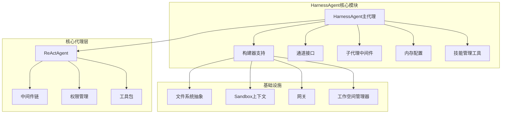
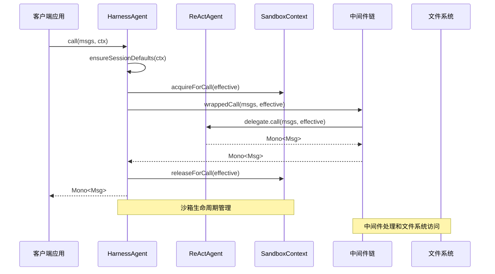
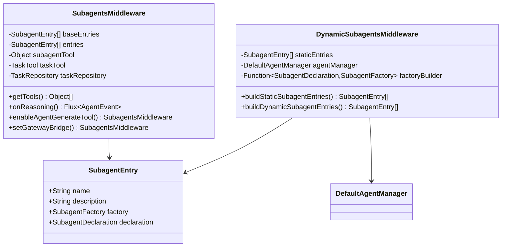
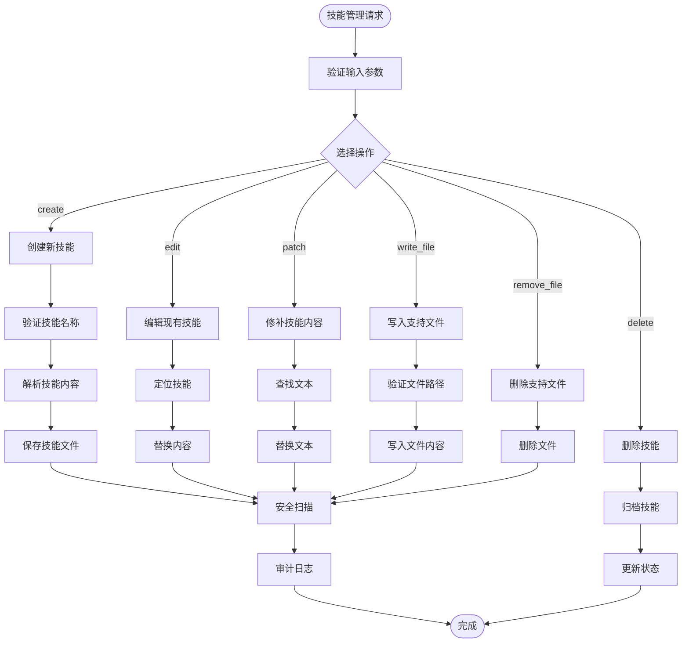
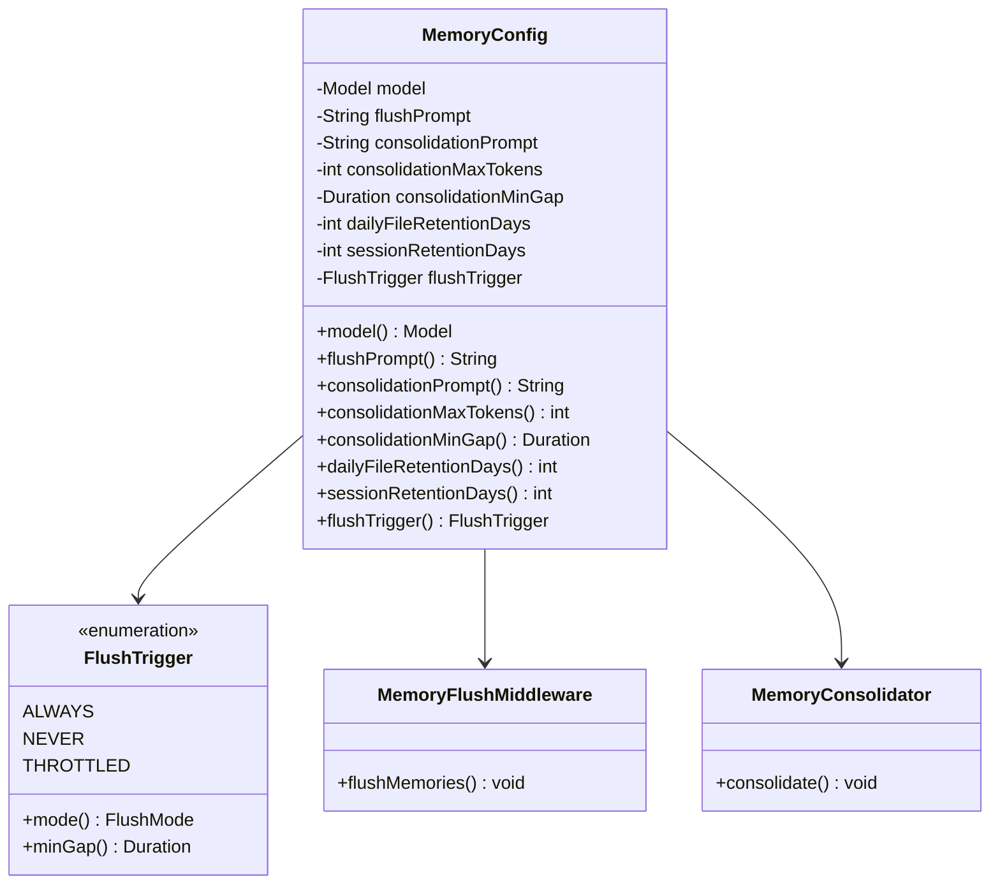
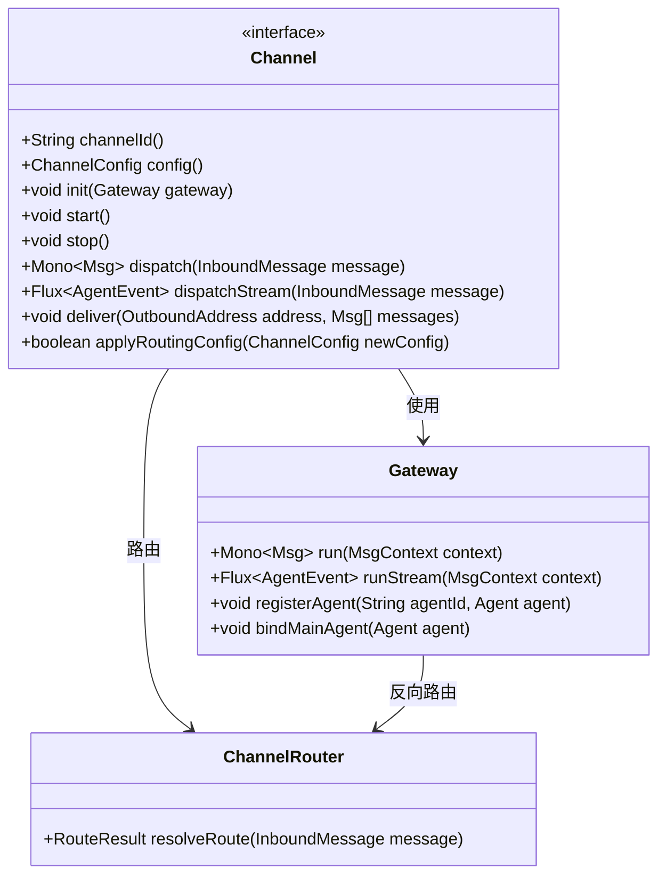
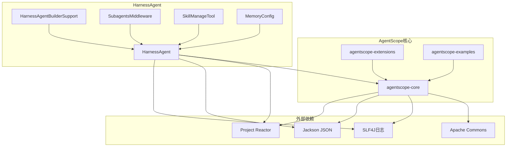

# HarnessAgent主代理API

<cite>
**本文档引用的文件**
- [HarnessAgent.java](file://agentscope-harness/src/main/java/io/agentscope/harness/agent/HarnessAgent.java)
- [HarnessAgentBuilderSupport.java](file://agentscope-harness/src/main/java/io/agentscope/harness/agent/HarnessAgentBuilderSupport.java)
- [Channel.java](file://agentscope-harness/src/main/java/io/agentscope/harness/agent/gateway/channel/Channel.java)
- [SubagentsMiddleware.java](file://agentscope-harness/src/main/java/io/agentscope/harness/agent/middleware/SubagentsMiddleware.java)
- [MemoryConfig.java](file://agentscope-harness/src/main/java/io/agentscope/harness/agent/memory/MemoryConfig.java)
- [SkillManageTool.java](file://agentscope-harness/src/main/java/io/agentscope/harness/agent/tool/SkillManageTool.java)
- [ReActAgent.java](file://agentscope-core/src/main/java/io/agentscope/core/ReActAgent.java)
- [HarnessAgentTest.java](file://agentscope-harness/src/test/java/io/agentscope/harness/agent/HarnessAgentTest.java)
- [HarnessAgentIntegrationExampleTest.java](file://agentscope-harness/src/test/java/io/agentscope/harness/agent/HarnessAgentIntegrationExampleTest.java)
</cite>

## 目录
1. [简介](#简介)
2. [项目结构](#项目结构)
3. [核心组件](#核心组件)
4. [架构概览](#架构概览)
5. [详细组件分析](#详细组件分析)
6. [依赖分析](#依赖分析)
7. [性能考虑](#性能考虑)
8. [故障排除指南](#故障排除指南)
9. [结论](#结论)
10. [附录](#附录)

## 简介

HarnessAgent是AgentScope框架中的主代理组件，它包装了ReActAgent并提供了企业级的功能扩展。该代理在保持ReActAgent核心能力的同时，增加了工作空间管理、文件系统抽象、沙箱环境、子代理编排、技能仓库、内存管理、计划模式等高级功能。

HarnessAgent的主要特性包括：
- 工作空间驱动的上下文加载（AGENTS.md、MEMORY.md、KNOWLEDGE.md）
- 可插拔的文件系统后端（本地、沙箱、远程/复合）
- 基于任务的子代理编排（同步+后台）
- 技能加载和自学习循环
- 内存刷新+消息卸载前的上下文压缩
- 工作空间管理的tools.json（MCP服务器+允许/拒绝过滤器）
- 计划模式（只读设计阶段）与plan_enter/plan_write/plan_exit工具
- 上下文溢出紧急压缩通过CompactionMiddleware

## 项目结构



**图表来源**
- [HarnessAgent.java:121-146](file://agentscope-harness/src/main/java/io/agentscope/harness/agent/HarnessAgent.java#L121-L146)
- [ReActAgent.java:148-200](file://agentscope-core/src/main/java/io/agentscope/core/ReActAgent.java#L148-L200)

**章节来源**
- [HarnessAgent.java:1-800](file://agentscope-harness/src/main/java/io/agentscope/harness/agent/HarnessAgent.java#L1-L800)
- [HarnessAgentBuilderSupport.java:66-776](file://agentscope-harness/src/main/java/io/agentscope/harness/agent/HarnessAgentBuilderSupport.java#L66-L776)

## 核心组件

### 主要API接口

HarnessAgent实现了Agent接口，提供以下核心方法：

#### 调用接口
- `call(List<Msg> msgs)` - 基本对话调用
- `call(Msg msg, RuntimeContext ctx)` - 带运行时上下文的调用
- `call(List<Msg> msgs, Class<?> structuredModel)` - 结构化输出调用
- `call(List<Msg> msgs, JsonNode schema)` - JSON模式调用

#### 流式处理接口
- `streamEvents(List<Msg> msgs)` - 细粒度AgentEvent流
- `streamEvents(Msg msg, RuntimeContext ctx)` - 带上下文的事件流
- `streamEvents(List<Msg> msgs, RuntimeContext ctx)` - 完整的事件流

#### 通道接口
- `channel(T channel)` - 绑定到内部网关的通道
- `gateway()` - 获取内部网关实例

#### 生命周期管理
- `interrupt()` - 中断当前执行
- `interrupt(Msg msg)` - 带消息的中断
- `close()` - 关闭资源

**章节来源**
- [HarnessAgent.java:542-727](file://agentscope-harness/src/main/java/io/agentscope/harness/agent/HarnessAgent.java#L542-L727)
- [HarnessAgent.java:472-542](file://agentscope-harness/src/main/java/io/agentscope/harness/agent/HarnessAgent.java#L472-L542)

### 构建器模式

HarnessAgent采用Builder模式，通过HarnessAgent.builder()创建实例。构建器支持以下配置：

#### 文件系统配置
- `abstractFilesystem(AbstractFilesystem fs)` - 自定义文件系统
- `localFilesystemSpec(LocalFilesystemSpec spec)` - 本地文件系统规范
- `remoteFilesystemSpec(RemoteFilesystemSpec spec)` - 远程文件系统规范

#### 子代理配置
- `subagent(SubagentDeclaration declaration)` - 添加子代理声明
- `disableSubagents()` - 禁用子代理功能
- `externalSubagentTool(Object tool)` - 外部子代理工具

#### 技能配置
- `skillRepositories(List<AgentSkillRepository> repos)` - 技能仓库列表
- `projectGlobalSkillsDir(Path dir)` - 项目全局技能目录
- `enableSkillManageTool(SkillManageConfig config)` - 启用技能管理工具

#### 内存配置
- `memory(MemoryConfig config)` - 内存配置
- `compaction(CompactionConfig config)` - 压缩配置
- `toolResultEviction(ToolResultEvictionConfig config)` - 工具结果驱逐配置

**章节来源**
- [HarnessAgentBuilderSupport.java:134-482](file://agentscope-harness/src/main/java/io/agentscope/harness/agent/HarnessAgentBuilderSupport.java#L134-L482)

## 架构概览



**图表来源**
- [HarnessAgent.java:731-795](file://agentscope-harness/src/main/java/io/agentscope/harness/agent/HarnessAgent.java#L731-L795)
- [SubagentsMiddleware.java:312-396](file://agentscope-harness/src/main/java/io/agentscope/harness/agent/middleware/SubagentsMiddleware.java#L312-L396)

HarnessAgent的架构特点：
- **状态隔离**：每个调用使用RuntimeContext的(userId, sessionId)隔离状态
- **沙箱生命周期**：自动acquire/release沙箱上下文
- **中间件管道**：可插拔的中间件处理链
- **文件系统抽象**：统一的文件系统接口

## 详细组件分析

### 子代理编排系统

HarnessAgent支持两种子代理中间件模式：

#### 静态子代理中间件


**图表来源**
- [SubagentsMiddleware.java:76-310](file://agentscope-harness/src/main/java/io/agentscope/harness/agent/middleware/SubagentsMiddleware.java#L76-L310)
- [HarnessAgentBuilderSupport.java:630-662](file://agentscope-harness/src/main/java/io/agentscope/harness/agent/HarnessAgentBuilderSupport.java#L630-L662)

#### 子代理生命周期管理
- **spawn**：创建新的子代理实例
- **send**：向现有子代理发送消息
- **task_output**：检索后台任务结果
- **task_cancel**：取消运行中的后台任务
- **task_list**：列出所有进行中的后台任务

**章节来源**
- [SubagentsMiddleware.java:187-310](file://agentscope-harness/src/main/java/io/agentscope/harness/agent/middleware/SubagentsMiddleware.java#L187-L310)

### 技能管理系统

HarnessAgent集成了完整的技能管理功能：

#### 技能管理工具


**图表来源**
- [SkillManageTool.java:228-655](file://agentscope-harness/src/main/java/io/agentscope/harness/agent/tool/SkillManageTool.java#L228-L655)

#### 技能自学习循环
- **SkillPromoter**：技能推广器，管理从草稿到正式发布的流程
- **SkillUsageStore**：技能使用统计存储
- **SkillAuditLog**：技能审计日志
- **SkillCurator**：技能审查员，维护技能质量

**章节来源**
- [SkillManageTool.java:60-115](file://agentscope-harness/src/main/java/io/agentscope/harness/agent/tool/SkillManageTool.java#L60-L115)
- [HarnessAgent.java:250-291](file://agentscope-harness/src/main/java/io/agentscope/harness/agent/HarnessAgent.java#L250-L291)

### 内存管理系统

HarnessAgent提供了三层内存管理：

#### 内存配置


**图表来源**
- [MemoryConfig.java:48-212](file://agentscope-harness/src/main/java/io/agentscope/harness/agent/memory/MemoryConfig.java#L48-L212)

#### 内存管理流程
1. **Flush**：将对话窗口中的长期记忆提取到当天的日记账
2. **Consolidation**：定期将日记账合并到精选的MEMORY.md
3. **Compaction**：在推理前将对话前缀压缩为摘要消息

**章节来源**
- [MemoryConfig.java:24-47](file://agentscope-harness/src/main/java/io/agentscope/harness/agent/memory/MemoryConfig.java#L24-L47)

### 通道和网关系统

HarnessAgent通过Channel接口提供多平台消息传递：

#### 通道接口设计


**图表来源**
- [Channel.java:25-137](file://agentscope-harness/src/main/java/io/agentscope/harness/agent/gateway/channel/Channel.java#L25-L137)

**章节来源**
- [Channel.java:25-137](file://agentscope-harness/src/main/java/io/agentscope/harness/agent/gateway/channel/Channel.java#L25-L137)

## 依赖分析



**图表来源**
- [HarnessAgent.java:18-119](file://agentscope-harness/src/main/java/io/agentscope/harness/agent/HarnessAgent.java#L18-L119)

### 核心依赖关系

#### 直接依赖
- **agentscope-core**：ReActAgent和核心代理功能
- **Project Reactor**：响应式编程和异步处理
- **Jackson**：JSON序列化和反序列化
- **SLF4J**：日志抽象层

#### 间接依赖
- **agentscope-extensions**：扩展功能（渠道、内存、MySQL等）
- **agentscope-examples**：示例和集成测试

**章节来源**
- [HarnessAgent.java:18-119](file://agentscope-harness/src/main/java/io/agentscope/harness/agent/HarnessAgent.java#L18-L119)

## 性能考虑

### 并发和线程安全
- HarnessAgent是无状态的，可以在单例模式下安全地为多个用户/会话并发服务
- 每个call()使用RuntimeContext的(userId, sessionId)隔离状态
- 相同会话的目标调用会自动序列化；不同会话并行运行

### 内存优化
- **沙箱生命周期管理**：自动acquire/release沙箱上下文，避免内存泄漏
- **内存压缩**：ContextOverflow错误时自动触发压缩恢复
- **工具结果驱逐**：配置性的工具结果驱逐策略

### 缓存策略
- **技能仓库缓存**：多层技能仓库（项目全局→市场→工作空间→命名空间）
- **文件系统缓存**：工作空间索引和文件系统视图缓存
- **会话状态缓存**：AgentStateStore的分布式状态存储

## 故障排除指南

### 常见问题和解决方案

#### 会话隔离问题
**症状**：不同用户的会话数据相互干扰
**解决方案**：确保RuntimeContext正确设置userId和sessionId参数

#### 沙箱访问权限问题
**症状**：子代理无法访问文件系统或执行命令
**解决方案**：检查SandboxContext配置和ShellPathPolicy设置

#### 技能加载失败
**症状**：技能管理工具报错
**解决方案**：验证技能文件格式（正确的YAML前端和描述），检查文件路径和权限

#### 内存溢出
**症状**：ContextOverflow异常
**解决方案**：启用CompactionMiddleware，调整内存配置参数

**章节来源**
- [HarnessAgentTest.java:86-146](file://agentscope-harness/src/test/java/io/agentscope/harness/agent/HarnessAgentTest.java#L86-L146)
- [HarnessAgentIntegrationExampleTest.java:78-170](file://agentscope-harness/src/test/java/io/agentscope/harness/agent/HarnessAgentIntegrationExampleTest.java#L78-L170)

## 结论

HarnessAgent作为AgentScope框架的主代理组件，提供了企业级的智能代理解决方案。其设计特点包括：

1. **模块化架构**：通过中间件和构建器模式实现高度可配置性
2. **企业级功能**：工作空间管理、文件系统抽象、沙箱环境、子代理编排
3. **可扩展性**：支持自定义技能、工具和中间件
4. **性能优化**：并发安全、内存管理和缓存策略
5. **易用性**：简洁的API设计和丰富的配置选项

HarnessAgent适合构建复杂的AI应用，如智能客服、内容创作助手、数据分析代理等场景。

## 附录

### 实际使用示例

#### 基本对话调用
```java
// 创建HarnessAgent实例
HarnessAgent agent = HarnessAgent.builder()
    .name("assistant")
    .model(model)
    .workspace(workspacePath)
    .build();

// 发送消息
Msg response = agent.call(
    Msg.builder()
        .role(MsgRole.USER)
        .content(TextBlock.builder().text("你好").build())
        .build(),
    RuntimeContext.builder()
        .userId("user-123")
        .sessionId("session-1")
        .build()
).block();
```

#### 流式事件处理
```java
// 开始流式事件监听
Flux<AgentEvent> eventStream = agent.streamEvents(
    Msg.builder()
        .role(MsgRole.USER)
        .content(TextBlock.builder().text("请帮我分析代码")).build()
);

eventStream.subscribe(event -> {
    // 处理各种AgentEvent类型
    if (event instanceof TextBlockDeltaEvent) {
        TextBlockDeltaEvent delta = (TextBlockDeltaEvent) event;
        System.out.print(delta.getContent());
    }
});
```

#### 子代理编排
```java
// 启用子代理功能
HarnessAgent agent = HarnessAgent.builder()
    .name("main-agent")
    .model(model)
    .workspace(workspacePath)
    .build();

// 创建子代理
Msg response = agent.call(
    Msg.builder()
        .role(MsgRole.USER)
        .content(TextBlock.builder().text("请创建一个数据分析子代理")).build()
).block();
```

**章节来源**
- [HarnessAgentIntegrationExampleTest.java:120-170](file://agentscope-harness/src/test/java/io/agentscope/harness/agent/HarnessAgentIntegrationExampleTest.java#L120-L170)