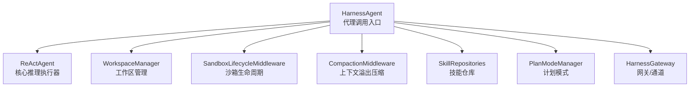
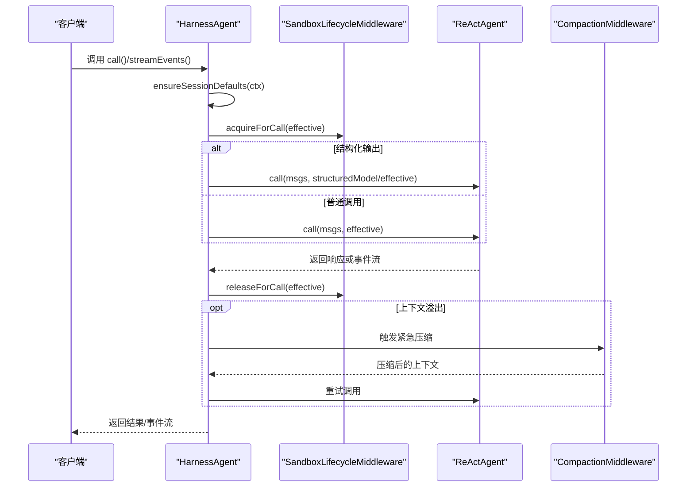
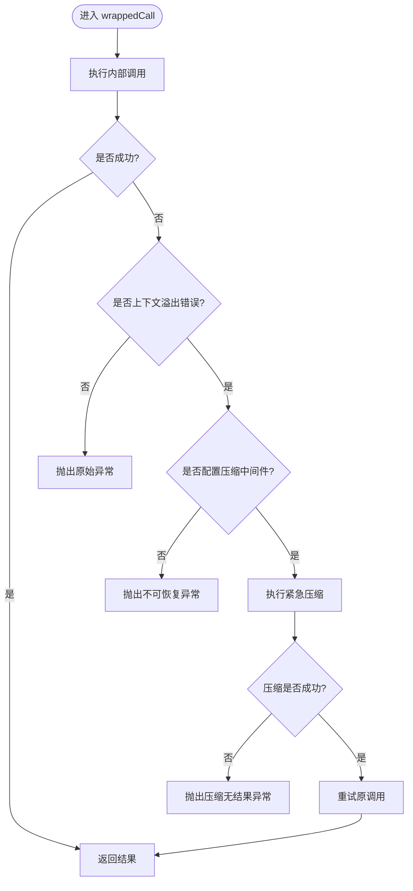
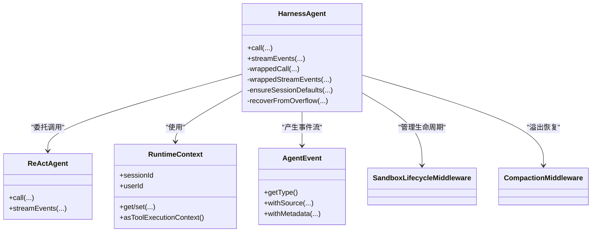

# 代理调用API

<cite>
**本文档引用的文件**
- [HarnessAgent.java](file://agentscope-harness/src/main/java/io/agentscope/harness/agent/HarnessAgent.java)
- [RuntimeContext.java](file://agentscope-core/src/main/java/io/agentscope/core/agent/RuntimeContext.java)
- [AgentEvent.java](file://agentscope-core/src/main/java/io/agentscope/core/event/AgentEvent.java)
- [ReActAgent.java](file://agentscope-core/src/main/java/io/agentscope/core/ReActAgent.java)
- [HarnessAgentIntegrationExampleTest.java](file://agentscope-harness/src/test/java/io/agentscope/harness/agent/HarnessAgentIntegrationExampleTest.java)
- [HarnessAgentSubagentStreamEventsTest.java](file://agentscope-harness/src/test/java/io/agentscope/harness/agent/HarnessAgentSubagentStreamEventsTest.java)
- [HarnessAgentTest.java](file://agentscope-harness/src/test/java/io/agentscope/harness/agent/HarnessAgentTest.java)
- [StructuredOutputDynamicDefineTest.java](file://agentscope-core/src/test/java/io/agentscope/core/agent/StructuredOutputDynamicDefineTest.java)
</cite>

## 目录
1. [简介](#简介)
2. [项目结构](#项目结构)
3. [核心组件](#核心组件)
4. [架构总览](#架构总览)
5. [详细组件分析](#详细组件分析)
6. [依赖分析](#依赖分析)
7. [性能考虑](#性能考虑)
8. [故障排除指南](#故障排除指南)
9. [结论](#结论)
10. [附录](#附录)

## 简介
本文件面向HarnessAgent的代理调用API，系统性地说明以下能力与行为：
- call()方法的多种重载形式：单消息调用、多消息调用、带RuntimeContext的调用、结构化输出调用（类模型与JSON Schema两种）
- streamEvents()方法用于获取细粒度的AgentEvent流
- 调用包装机制（wrappedCall）与事件流包装（wrappedStreamEvents）
- 错误恢复逻辑（上下文溢出自动压缩与重试）
- 上下文默认注入与会话隔离
- 实际使用示例：同步调用、异步调用与事件流处理
- 参数、返回值类型与异常处理机制

## 项目结构
HarnessAgent位于agentscope-harness模块中，作为ReActAgent的上层封装，提供工作区、文件系统、沙箱、子代理、技能、计划模式等编排能力；同时通过统一的调用接口对外暴露。

图表来源
- [HarnessAgent.java:153-224](file://agentscope-harness/src/main/java/io/agentscope/harness/agent/HarnessAgent.java#L153-L224)

章节来源
- [HarnessAgent.java:128-152](file://agentscope-harness/src/main/java/io/agentscope/harness/agent/HarnessAgent.java#L128-L152)

## 核心组件
- HarnessAgent：用户可见的代理入口，负责调用包装、上下文默认注入、沙箱生命周期管理、上下文溢出恢复等
- ReActAgent：核心推理与工具执行引擎
- RuntimeContext：每次调用的运行时上下文，携带会话标识、工具执行上下文与键值属性
- AgentEvent：细粒度事件模型，支持文本块、思考块、工具调用、工具结果等事件类型
- CompactionMiddleware：上下文溢出紧急压缩中间件
- SandboxLifecycleMiddleware：沙箱生命周期中间件，确保调用前后沙箱正确acquire/release

章节来源
- [HarnessAgent.java:405-454](file://agentscope-harness/src/main/java/io/agentscope/harness/agent/HarnessAgent.java#L405-L454)
- [RuntimeContext.java:33-134](file://agentscope-core/src/main/java/io/agentscope/core/agent/RuntimeContext.java#L33-L134)
- [AgentEvent.java:72-138](file://agentscope-core/src/main/java/io/agentscope/core/event/AgentEvent.java#L72-L138)

## 架构总览
HarnessAgent在调用前通过ensureSessionDefaults注入默认会话与沙箱上下文，并在wrappedCall/wrappedStreamEvents中使用Mono.using/Flux.using确保沙箱资源的acquire/release一致性；当启用CompactionMiddleware时，对上下文溢出错误进行紧急压缩并重试。

图表来源
- [HarnessAgent.java:792-856](file://agentscope-harness/src/main/java/io/agentscope/harness/agent/HarnessAgent.java#L792-L856)
- [HarnessAgent.java:896-966](file://agentscope-harness/src/main/java/io/agentscope/harness/agent/HarnessAgent.java#L896-L966)

## 详细组件分析

### call()方法重载族
- 单消息调用
  - call(Msg, RuntimeContext)
  - call(String, RuntimeContext)：将字符串包装为UserMessage后调用
- 多消息调用
  - call(List<Msg>, RuntimeContext)
- 结构化输出调用
  - call(List<Msg>, Class<T>, RuntimeContext)：按类模型生成结构化数据
  - call(List<Msg>, JsonNode, RuntimeContext)：按JSON Schema生成结构化数据
- 兼容性重载（已标注@Deprecated，建议使用带RuntimeContext的版本）
  - call(List<Msg>)
  - call(List<Msg>, Class<?>)
  - call(List<Msg>, JsonNode)

返回值类型
- 所有call()重载均返回Mono<Msg>，表示异步响应

参数说明
- msgs：消息列表，通常由UserMessage组成
- ctx：RuntimeContext，包含sessionId、userId、工具执行上下文、Typed/String属性等
- structuredModel/Schema：结构化输出的类型定义或JSON Schema

异常处理
- 当发生上下文溢出错误时，若配置了CompactionMiddleware，则触发紧急压缩并重试；否则抛出异常

章节来源
- [HarnessAgent.java:592-623](file://agentscope-harness/src/main/java/io/agentscope/harness/agent/HarnessAgent.java#L592-L623)
- [HarnessAgent.java:576-590](file://agentscope-harness/src/main/java/io/agentscope/harness/agent/HarnessAgent.java#L576-L590)
- [HarnessAgent.java:792-818](file://agentscope-harness/src/main/java/io/agentscope/harness/agent/HarnessAgent.java#L792-L818)

### streamEvents()方法
- 支持单消息、多消息、纯文本输入与RuntimeContext
- 返回Flux<AgentEvent>，覆盖完整代理调用生命周期事件
- 子代理同步调用产生的事件会被转发到父代理事件流，并带有非空的source标识其来源

事件类型概览
- AGENT_START/AGENT_END：代理开始/结束
- TEXT_BLOCK_*：文本块增量/开始/结束
- THINKING_BLOCK_*：思考块增量/开始/结束
- DATA_BLOCK_*：数据块增量/开始/结束
- TOOL_CALL_*：工具调用增量/开始/结束
- TOOL_RESULT_*：工具结果增量/开始/结束
- MODEL_CALL_*：模型调用开始/结束
- EXCEED_MAX_ITERS：超过最大迭代
- REQUIRE_USER_CONFIRM/USER_CONFIRM_RESULT：人工确认相关
- REQUEST_STOP：请求停止
- SUBAGENT_EXPOSED：子代理暴露
- CUSTOM：自定义事件

章节来源
- [HarnessAgent.java:731-774](file://agentscope-harness/src/main/java/io/agentscope/harness/agent/HarnessAgent.java#L731-L774)
- [AgentEvent.java:36-71](file://agentscope-core/src/main/java/io/agentscope/core/event/AgentEvent.java#L36-L71)

### 调用包装机制（wrappedCall）
- 使用Mono.using确保沙箱acquire/release的资源管理语义一致
- 在存在CompactionMiddleware时，拦截上下文溢出错误并尝试紧急压缩与重试
- ensureSessionDefaults负责注入默认sessionId、文件系统、沙箱上下文与工作区管理器

章节来源
- [HarnessAgent.java:792-818](file://agentscope-harness/src/main/java/io/agentscope/harness/agent/HarnessAgent.java#L792-L818)
- [HarnessAgent.java:864-894](file://agentscope-harness/src/main/java/io/agentscope/harness/agent/HarnessAgent.java#L864-L894)

### 事件流包装（wrappedStreamEvents）
- 使用Flux.using确保沙箱acquire/release的一致性
- 与wrappedCall相同的沙箱生命周期语义，保证流式调用与阻塞调用在沙箱预热方面行为一致

章节来源
- [HarnessAgent.java:841-856](file://agentscope-harness/src/main/java/io/agentscope/harness/agent/HarnessAgent.java#L841-L856)

### 错误恢复逻辑与上下文溢出处理
- 溢出检测：通过isContextOverflowError匹配常见“上下文过长/令牌超限”等错误信息
- 紧急压缩：forceCompactAndRetry基于MemoryFlushManager与ConversationCompactor执行压缩
- 重试：将压缩后的上下文写回AgentState后重试原调用
- 未配置压缩：直接抛出异常提示无法恢复

图表来源
- [HarnessAgent.java:896-966](file://agentscope-harness/src/main/java/io/agentscope/harness/agent/HarnessAgent.java#L896-L966)

章节来源
- [HarnessAgent.java:896-966](file://agentscope-harness/src/main/java/io/agentscope/harness/agent/HarnessAgent.java#L896-L966)

### RuntimeContext与上下文默认注入
- ensureSessionDefaults会为缺失的sessionId注入默认值（使用代理名称），并注入默认沙箱上下文与工作区文件系统
- 若传入的RuntimeContext已包含相应属性且无需变更，则直接复用原实例，避免不必要对象复制

章节来源
- [HarnessAgent.java:864-894](file://agentscope-harness/src/main/java/io/agentscope/harness/agent/HarnessAgent.java#L864-L894)
- [RuntimeContext.java:225-412](file://agentscope-core/src/main/java/io/agentscope/core/agent/RuntimeContext.java#L225-L412)

### 实际使用示例（基于测试）
- 同步调用
  - 使用agent.call(msg, RuntimeContext).block()获取响应
  - 参考：[HarnessAgentIntegrationExampleTest.java:129-135](file://agentscope-harness/src/test/java/io/agentscope/harness/agent/HarnessAgentIntegrationExampleTest.java#L129-L135)
- 异步调用
  - 使用Reactor的subscribe/flatMap等链式组合处理响应
  - 参考：[HarnessAgentTest.java:232-248](file://agentscope-harness/src/test/java/io/agentscope/harness/agent/HarnessAgentTest.java#L232-L248)
- 事件流处理
  - 使用streamEvents(msgs, ctx).subscribe(...)订阅事件流
  - 参考：[HarnessAgentSubagentStreamEventsTest.java:154-163](file://agentscope-harness/src/test/java/io/agentscope/harness/agent/HarnessAgentSubagentStreamEventsTest.java#L154-L163)
- 结构化输出
  - call(msgs, Class<T>, ctx)或call(msgs, JsonNode, ctx)获取结构化数据
  - 参考：[StructuredOutputDynamicDefineTest.java:280-299](file://agentscope-core/src/test/java/io/agentscope/core/agent/StructuredOutputDynamicDefineTest.java#L280-L299)

章节来源
- [HarnessAgentIntegrationExampleTest.java:129-135](file://agentscope-harness/src/test/java/io/agentscope/harness/agent/HarnessAgentIntegrationExampleTest.java#L129-L135)
- [HarnessAgentSubagentStreamEventsTest.java:154-163](file://agentscope-harness/src/test/java/io/agentscope/harness/agent/HarnessAgentSubagentStreamEventsTest.java#L154-L163)
- [StructuredOutputDynamicDefineTest.java:280-299](file://agentscope-core/src/test/java/io/agentscope/core/agent/StructuredOutputDynamicDefineTest.java#L280-L299)

## 依赖分析
- HarnessAgent依赖ReActAgent作为核心执行器
- 通过SandboxLifecycleMiddleware管理沙箱生命周期
- 通过CompactionMiddleware处理上下文溢出
- 通过WorkspaceManager与文件系统集成
- 通过RuntimeContext传递会话与工具执行上下文

图表来源
- [HarnessAgent.java:157-224](file://agentscope-harness/src/main/java/io/agentscope/harness/agent/HarnessAgent.java#L157-L224)
- [RuntimeContext.java:33-134](file://agentscope-core/src/main/java/io/agentscope/core/agent/RuntimeContext.java#L33-L134)
- [AgentEvent.java:72-138](file://agentscope-core/src/main/java/io/agentscope/core/event/AgentEvent.java#L72-L138)

章节来源
- [HarnessAgent.java:157-224](file://agentscope-harness/src/main/java/io/agentscope/harness/agent/HarnessAgent.java#L157-L224)

## 性能考虑
- 资源管理：wrappedCall/wrappedStreamEvents使用using确保沙箱acquire/release成对出现，避免资源泄漏
- 会话隔离：通过RuntimeContext的(userId, sessionId)隔离状态，不同会话并发执行，同一会话串行执行
- 上下文压缩：在上下文溢出时进行紧急压缩，减少后续调用的上下文长度，提升稳定性
- 事件驱动：streamEvents采用响应式流，避免阻塞式等待，适合高并发场景

## 故障排除指南
- 上下文溢出错误
  - 现象：调用过程中出现“上下文过长/令牌超限”等错误
  - 处理：确保启用CompactionMiddleware；若未启用，需手动控制上下文长度或增加模型上下文上限
  - 参考：[HarnessAgent.java:896-966](file://agentscope-harness/src/main/java/io/agentscope/harness/agent/HarnessAgent.java#L896-L966)
- 事件流为空或顺序异常
  - 确认使用streamEvents而非已废弃的stream方法
  - 子代理事件应带有source标识，父代理事件source为null
  - 参考：[HarnessAgentSubagentStreamEventsTest.java:168-187](file://agentscope-harness/src/test/java/io/agentscope/harness/agent/HarnessAgentSubagentStreamEventsTest.java#L168-L187)
- 结构化输出未生效
  - 确保传入的structuredModel或schema有效
  - 检查模型是否支持结构化输出工具（如generate_response）
  - 参考：[StructuredOutputDynamicDefineTest.java:280-299](file://agentscope-core/src/test/java/io/agentscope/core/agent/StructuredOutputDynamicDefineTest.java#L280-L299)

章节来源
- [HarnessAgent.java:896-966](file://agentscope-harness/src/main/java/io/agentscope/harness/agent/HarnessAgent.java#L896-L966)
- [HarnessAgentSubagentStreamEventsTest.java:168-187](file://agentscope-harness/src/test/java/io/agentscope/harness/agent/HarnessAgentSubagentStreamEventsTest.java#L168-L187)
- [StructuredOutputDynamicDefineTest.java:280-299](file://agentscope-core/src/test/java/io/agentscope/core/agent/StructuredOutputDynamicDefineTest.java#L280-L299)

## 结论
HarnessAgent通过统一的调用接口与完善的包装机制，为上层应用提供了稳定、可扩展的代理调用体验。其核心特性包括：
- 明确的调用重载族与结构化输出支持
- 细粒度事件流与子代理事件转发
- 沙箱生命周期与上下文溢出的健壮处理
- 会话隔离与并发安全

这些设计使得HarnessAgent既能满足简单对话场景，也能支撑复杂工作流与多代理协作。

## 附录
- 关键API速览
  - call(Msg, RuntimeContext)
  - call(List<Msg>, RuntimeContext)
  - call(List<Msg>, Class<T>, RuntimeContext)
  - call(List<Msg>, JsonNode, RuntimeContext)
  - streamEvents(Msg, RuntimeContext)
  - streamEvents(List<Msg>, RuntimeContext)
- 相关类型
  - RuntimeContext：会话与工具执行上下文
  - AgentEvent：事件模型基类，派生多种具体事件类型