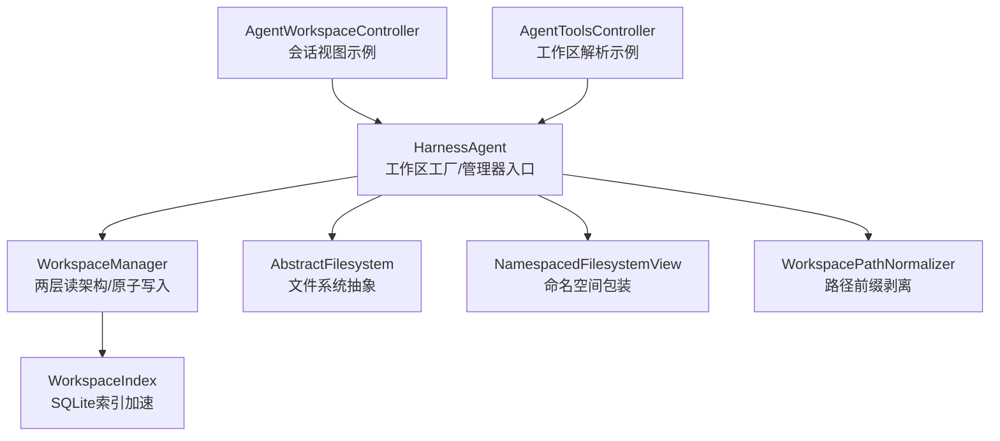
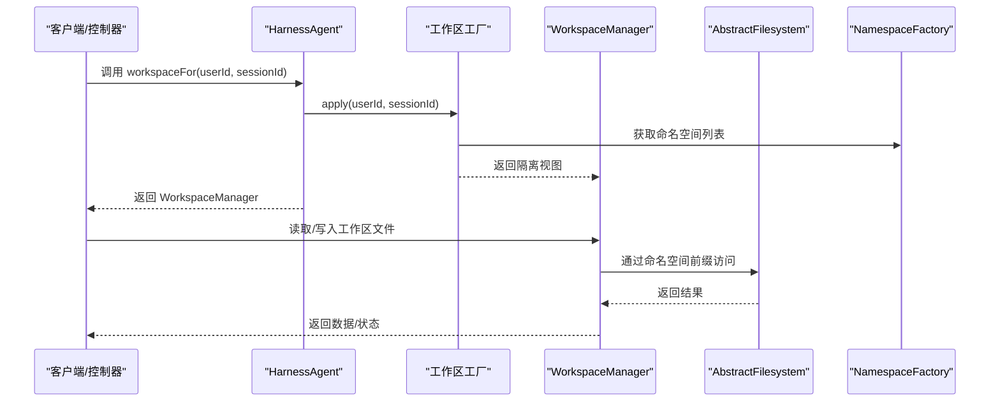
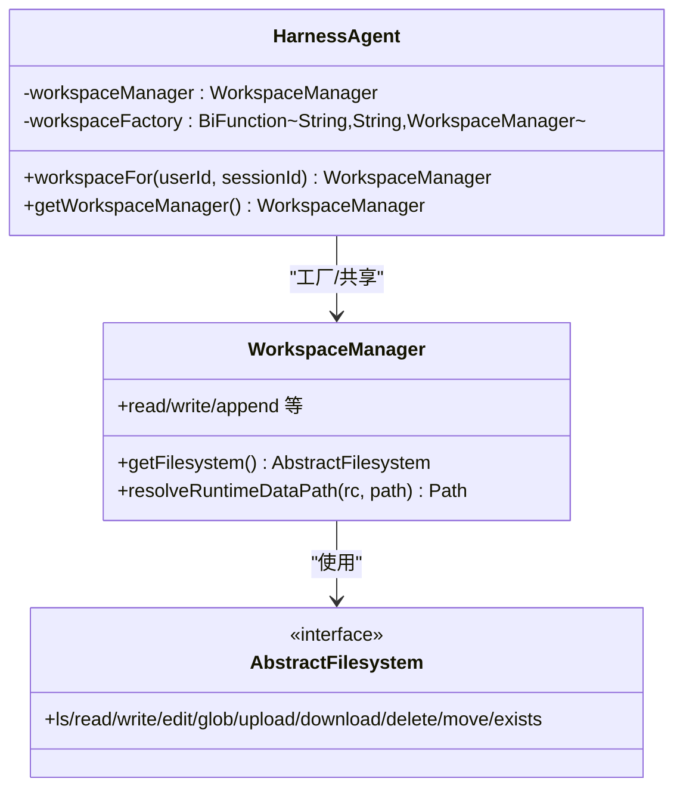
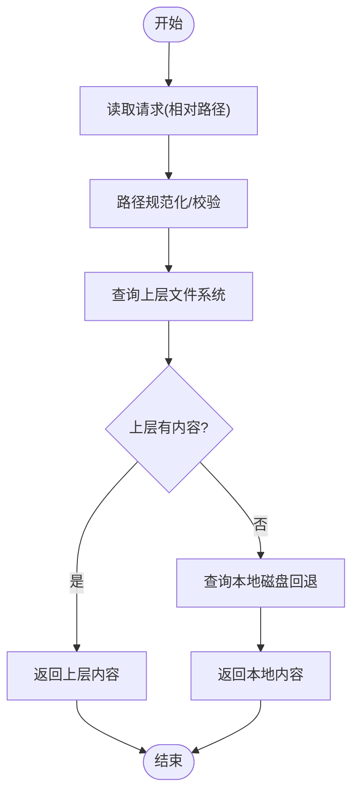
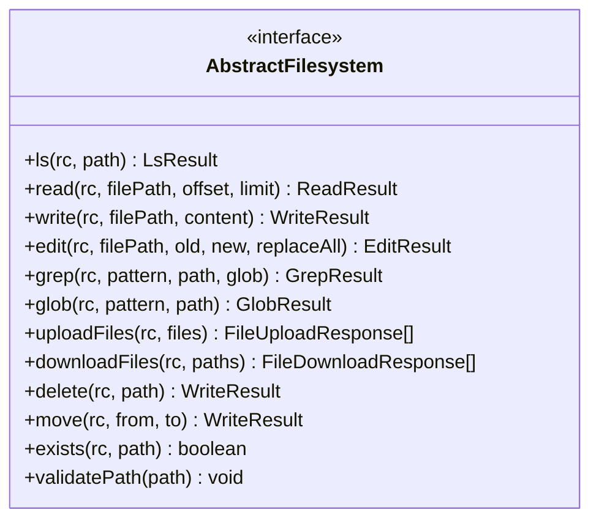
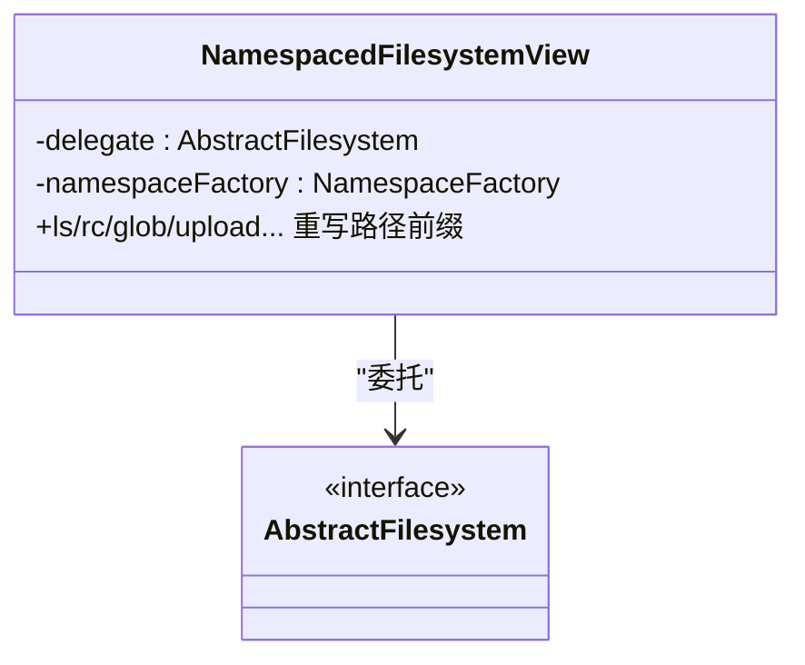
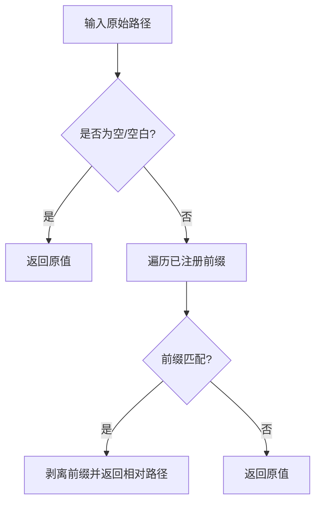
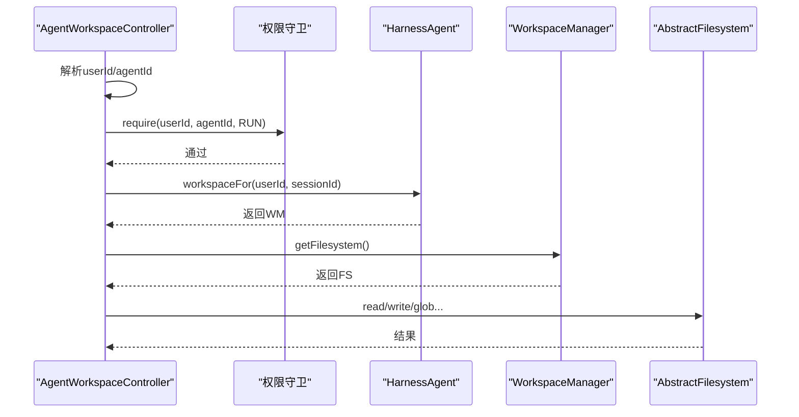
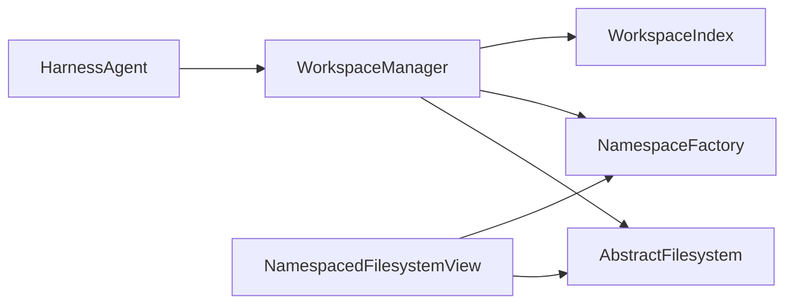

# 工作区API

<cite>
**本文引用的文件**
- [HarnessAgent.java](file://agentscope-harness/src/main/java/io/agentscope/harness/agent/HarnessAgent.java)
- [WorkspaceManager.java](file://agentscope-harness/src/main/java/io/agentscope/harness/agent/workspace/WorkspaceManager.java)
- [AbstractFilesystem.java](file://agentscope-harness/src/main/java/io/agentscope/harness/agent/filesystem/AbstractFilesystem.java)
- [WorkspacePathNormalizer.java](file://agentscope-harness/src/main/java/io/agentscope/harness/agent/workspace/WorkspacePathNormalizer.java)
- [NamespacedFilesystemView.java](file://agentscope-examples/agents/agentscope-builder/src/main/java/io/agentscope/builder/web/workspace/NamespacedFilesystemView.java)
- [WorkspaceIndex.java](file://agentscope-harness/src/main/java/io/agentscope/harness/agent/workspace/WorkspaceIndex.java)
- [AgentWorkspaceController.java](file://agentscope-examples/agents/agentscope-builder/src/main/java/io/agentscope/builder/web/api/AgentWorkspaceController.java)
- [AgentToolsController.java](file://agentscope-examples/agents/agentscope-paw/src/main/java/io/agentscope/claw2/web/api/AgentToolsController.java)
</cite>

## 目录
1. [简介](#简介)
2. [项目结构](#项目结构)
3. [核心组件](#核心组件)
4. [架构总览](#架构总览)
5. [详细组件分析](#详细组件分析)
6. [依赖关系分析](#依赖关系分析)
7. [性能考量](#性能考量)
8. [故障排查指南](#故障排查指南)
9. [结论](#结论)
10. [附录](#附录)

## 简介
本文件面向HarnessAgent的工作区API，系统性阐述以下主题：
- workspaceFor()方法：按会话（用户+会话）返回工作区视图，确保每次调用都基于当前RuntimeContext进行命名空间隔离与文件系统抽象。
- getWorkspaceManager()：返回绑定到Agent实例的共享工作区管理器，适用于无需会话隔离的场景或批处理任务。
- 工作区工厂模式与命名空间隔离：通过BiFunction<userId, sessionId, WorkspaceManager>工厂函数，结合NamespaceFactory，实现对不同用户、会话的透明隔离。
- 路径规范化与文件系统抽象：WorkspacePathNormalizer负责跨运行模式（本地/沙箱等）的路径前缀剥离；AbstractFilesystem定义统一的文件操作接口，屏蔽底层存储差异。
- 实际使用示例：展示如何为不同用户与会话获取独立工作区视图，并说明工作区在代理调用中的作用。
- 工作区与沙箱、文件系统的集成：通过OverlayFilesystem、SandboxBackedFilesystem等实现多后端融合。

## 项目结构
围绕工作区API的关键模块如下：
- 核心类
  - HarnessAgent：对外暴露workspaceFor()与getWorkspaceManager()，封装ReActAgent并提供工作区、沙箱、子代理、技能等能力。
  - WorkspaceManager：工作区读写入口，两层读架构（文件系统优先，回退到本地磁盘），提供会话、任务、知识库、内存等目录解析与原子写入。
  - AbstractFilesystem：文件系统抽象接口，支持ls/read/write/edit/glob/upload/download/delete/move/exist等操作。
- 支撑组件
  - WorkspacePathNormalizer：根据当前运行模式剥离前缀，保证路径在不同后端下的一致性。
  - NamespacedFilesystemView：对任意AbstractFilesystem进行命名空间包装，自动为所有路径添加由NamespaceFactory生成的前缀，实现用户/会话隔离。
  - WorkspaceIndex：基于SQLite的最佳努力索引，加速远程后端下的枚举与存在性检查。
- 控制器示例
  - AgentWorkspaceController：演示如何在Web控制器中使用workspaceFor()获取会话级工作区视图。
  - AgentToolsController：演示如何解析工作区路径与上下文，构建WorkspaceContext并执行文件操作。

**图表来源**
- [HarnessAgent.java:237-242](file://agentscope-harness/src/main/java/io/agentscope/harness/agent/HarnessAgent.java#L237-L242)
- [WorkspaceManager.java:66-96](file://agentscope-harness/src/main/java/io/agentscope/harness/agent/workspace/WorkspaceManager.java#L66-L96)
- [AbstractFilesystem.java:44-186](file://agentscope-harness/src/main/java/io/agentscope/harness/agent/filesystem/AbstractFilesystem.java#L44-L186)
- [NamespacedFilesystemView.java:52-216](file://agentscope-examples/agents/agentscope-builder/src/main/java/io/agentscope/builder/web/workspace/NamespacedFilesystemView.java#L52-L216)
- [WorkspaceIndex.java:50-373](file://agentscope-harness/src/main/java/io/agentscope/harness/agent/workspace/WorkspaceIndex.java#L50-L373)
- [WorkspacePathNormalizer.java:32-108](file://agentscope-harness/src/main/java/io/agentscope/harness/agent/workspace/WorkspacePathNormalizer.java#L32-L108)
- [AgentWorkspaceController.java:122-131](file://agentscope-examples/agents/agentscope-builder/src/main/java/io/agentscope/builder/web/api/AgentWorkspaceController.java#L122-L131)
- [AgentToolsController.java:357-393](file://agentscope-examples/agents/agentscope-paw/src/main/java/io/agentscope/claw2/web/api/AgentToolsController.java#L357-L393)

**章节来源**
- [HarnessAgent.java:153-242](file://agentscope-harness/src/main/java/io/agentscope/harness/agent/HarnessAgent.java#L153-L242)
- [WorkspaceManager.java:97-188](file://agentscope-harness/src/main/java/io/agentscope/harness/agent/workspace/WorkspaceManager.java#L97-L188)
- [AbstractFilesystem.java:44-186](file://agentscope-harness/src/main/java/io/agentscope/harness/agent/filesystem/AbstractFilesystem.java#L44-L186)
- [WorkspacePathNormalizer.java:32-108](file://agentscope-harness/src/main/java/io/agentscope/harness/agent/workspace/WorkspacePathNormalizer.java#L32-L108)
- [NamespacedFilesystemView.java:52-216](file://agentscope-examples/agents/agentscope-builder/src/main/java/io/agentscope/builder/web/workspace/NamespacedFilesystemView.java#L52-L216)
- [WorkspaceIndex.java:50-373](file://agentscope-harness/src/main/java/io/agentscope/harness/agent/workspace/WorkspaceIndex.java#L50-L373)
- [AgentWorkspaceController.java:122-131](file://agentscope-examples/agents/agentscope-builder/src/main/java/io/agentscope/builder/web/api/AgentWorkspaceController.java#L122-L131)
- [AgentToolsController.java:357-393](file://agentscope-examples/agents/agentscope-paw/src/main/java/io/agentscope/claw2/web/api/AgentToolsController.java#L357-L393)

## 核心组件
- workspaceFor(userId, sessionId)
  - 功能：按会话返回工作区管理器视图，确保每次调用均基于当前RuntimeContext进行命名空间隔离与文件系统抽象。
  - 返回：WorkspaceManager实例，其内部的AbstractFilesystem已通过NamespaceFactory绑定到(userId, sessionId)。
  - 并发安全：该方法不修改Agent共享状态，可并发调用，适合HTTP请求级别的按次隔离。
- getWorkspaceManager()
  - 功能：返回Agent绑定的共享工作区管理器，适用于不需要会话隔离的场景（如批处理、后台任务）。
  - 注意：若未配置工厂，则直接返回共享管理器；否则建议优先使用workspaceFor()以获得会话隔离。

**章节来源**
- [HarnessAgent.java:226-242](file://agentscope-harness/src/main/java/io/agentscope/harness/agent/HarnessAgent.java#L226-L242)

## 架构总览
工作区API通过“工厂+命名空间”的组合实现会话级隔离与跨后端一致性：
- 工厂模式：HarnessAgent持有BiFunction<String, String, WorkspaceManager>工厂，按(userId, sessionId)动态生成隔离视图。
- 命名空间隔离：NamespacedFilesystemView在每个文件系统操作前，将NamespaceFactory生成的前缀注入到绝对路径，确保不同用户/会话的数据互不可见。
- 文件系统抽象：AbstractFilesystem屏蔽本地、沙箱、远程等后端差异，统一提供读写接口。
- 路径规范化：WorkspacePathNormalizer根据当前运行模式剥离前缀，避免路径在不同后端间产生歧义。

**图表来源**
- [HarnessAgent.java:237-242](file://agentscope-harness/src/main/java/io/agentscope/harness/agent/HarnessAgent.java#L237-L242)
- [WorkspaceManager.java:235-244](file://agentscope-harness/src/main/java/io/agentscope/harness/agent/workspace/WorkspaceManager.java#L235-L244)
- [AbstractFilesystem.java:44-186](file://agentscope-harness/src/main/java/io/agentscope/harness/agent/filesystem/AbstractFilesystem.java#L44-L186)
- [NamespacedFilesystemView.java:194-215](file://agentscope-examples/agents/agentscope-builder/src/main/java/io/agentscope/builder/web/workspace/NamespacedFilesystemView.java#L194-L215)

## 详细组件分析

### 组件一：HarnessAgent（工作区工厂与会话隔离）
- 关键点
  - 持有workspaceFactory（BiFunction<String, String, WorkspaceManager>）与workspaceManager（共享）。
  - workspaceFor()通过工厂按(userId, sessionId)生成隔离视图；getWorkspaceManager()返回共享管理器。
  - 内部通过WorkspaceContextMiddleware、SandboxLifecycleMiddleware等中间件保障调用期间的沙箱生命周期与上下文一致。
- 使用建议
  - Web控制器应优先使用workspaceFor()获取会话视图，避免跨用户/会话污染。
  - 批处理或后台任务可直接使用getWorkspaceManager()，但需自行处理并发与隔离。

**图表来源**
- [HarnessAgent.java:153-242](file://agentscope-harness/src/main/java/io/agentscope/harness/agent/HarnessAgent.java#L153-L242)
- [WorkspaceManager.java:97-192](file://agentscope-harness/src/main/java/io/agentscope/harness/agent/workspace/WorkspaceManager.java#L97-L192)
- [AbstractFilesystem.java:44-186](file://agentscope-harness/src/main/java/io/agentscope/harness/agent/filesystem/AbstractFilesystem.java#L44-L186)

**章节来源**
- [HarnessAgent.java:153-242](file://agentscope-harness/src/main/java/io/agentscope/harness/agent/HarnessAgent.java#L153-L242)

### 组件二：WorkspaceManager（两层读架构与原子写入）
- 两层读架构
  - 读取时优先从AbstractFilesystem（上层覆盖），若为空则回退到本地磁盘（下层后备）。
  - 列表合并：文件系统层与本地磁盘层的结果去重合并，保证可见性。
- 原子写入
  - 所有写入（内存、会话、任务等）均通过AbstractFilesystem进行，内部采用按路径锁保证进程内并发安全。
  - 对于跨节点部署，需依赖后端提供CAS/乐观锁以保证一致性。
- 目录解析
  - 提供resolveRuntimeDataPath()、getSessionDir()、resolveSessionContextFile()/resolveSessionLogFile()等，用于生成会话/任务/记忆等路径。
- 索引加速
  - 可选的WorkspaceIndex基于SQLite记录部分路径的存在性与元信息，加速远程后端的枚举与存在性判断。

**图表来源**
- [WorkspaceManager.java:246-278](file://agentscope-harness/src/main/java/io/agentscope/harness/agent/workspace/WorkspaceManager.java#L246-L278)

**章节来源**
- [WorkspaceManager.java:66-96](file://agentscope-harness/src/main/java/io/agentscope/harness/agent/workspace/WorkspaceManager.java#L66-L96)
- [WorkspaceManager.java:235-244](file://agentscope-harness/src/main/java/io/agentscope/harness/agent/workspace/WorkspaceManager.java#L235-L244)
- [WorkspaceManager.java:367-394](file://agentscope-harness/src/main/java/io/agentscope/harness/agent/workspace/WorkspaceManager.java#L367-L394)
- [WorkspaceManager.java:403-434](file://agentscope-harness/src/main/java/io/agentscope/harness/agent/workspace/WorkspaceManager.java#L403-L434)
- [WorkspaceIndex.java:50-373](file://agentscope-harness/src/main/java/io/agentscope/harness/agent/workspace/WorkspaceIndex.java#L50-L373)

### 组件三：AbstractFilesystem（文件系统抽象）
- 统一接口
  - 支持目录列举(ls)、文件读取(read)、新建写入(write)、行编辑(edit)、全文检索(grep)、通配匹配(glob)、批量上传(uploadFiles)、批量下载(downloadFiles)、删除(delete)、移动(move)、存在性检查(exists)。
- 运行时上下文
  - 所有操作接受RuntimeContext，以便后端实现按用户/会话/沙箱进行作用域控制。
- 安全校验
  - 提供validatePath()防止路径穿越（..）。

**图表来源**
- [AbstractFilesystem.java:44-186](file://agentscope-harness/src/main/java/io/agentscope/harness/agent/filesystem/AbstractFilesystem.java#L44-L186)

**章节来源**
- [AbstractFilesystem.java:44-186](file://agentscope-harness/src/main/java/io/agentscope/harness/agent/filesystem/AbstractFilesystem.java#L44-L186)

### 组件四：命名空间隔离（NamespacedFilesystemView）
- 作用
  - 包装任意AbstractFilesystem，在每个操作前自动为路径添加由NamespaceFactory生成的前缀，形成逻辑子树隔离。
  - 在不改动调用方的前提下，实现用户/会话/代理维度的多租户隔离。
- 安全
  - 先通过AbstractFilesystem.validatePath()拒绝路径穿越，再拼接命名空间，确保安全性。
- 适配性
  - 可叠加在LocalFilesystem、SandboxBackedFilesystem、RemoteFilesystem之上，便于切换后端。

**图表来源**
- [NamespacedFilesystemView.java:52-216](file://agentscope-examples/agents/agentscope-builder/src/main/java/io/agentscope/builder/web/workspace/NamespacedFilesystemView.java#L52-L216)

**章节来源**
- [NamespacedFilesystemView.java:52-216](file://agentscope-examples/agents/agentscope-builder/src/main/java/io/agentscope/builder/web/workspace/NamespacedFilesystemView.java#L52-L216)

### 组件五：路径规范化（WorkspacePathNormalizer）
- 作用
  - 根据当前运行模式（本地/沙箱/远程）剥离工作区前缀，将绝对路径转换为工作区内相对路径，避免跨后端歧义。
- 行为
  - 支持单前缀与多前缀注册；对未匹配前缀的路径原样返回，保留访问非工作区文件的能力。
- 适用场景
  - 本地开发与沙箱运行模式切换时，确保工具链与代理感知到一致的相对路径。

**图表来源**
- [WorkspacePathNormalizer.java:77-107](file://agentscope-harness/src/main/java/io/agentscope/harness/agent/workspace/WorkspacePathNormalizer.java#L77-L107)

**章节来源**
- [WorkspacePathNormalizer.java:32-108](file://agentscope-harness/src/main/java/io/agentscope/harness/agent/workspace/WorkspacePathNormalizer.java#L32-L108)

### 组件六：工作区索引（WorkspaceIndex）
- 作用
  - 基于SQLite记录部分路径的存在性与元信息，加速远程后端下的枚举与存在性检查。
- 范围
  - 仅跟踪agents/*/sessions/**与memory/**两类前缀，避免索引膨胀。
- 一致性
  - 最佳努力（best-effort），远程写入仍具权威；索引更新失败静默记录，不影响主流程。

**章节来源**
- [WorkspaceIndex.java:50-373](file://agentscope-harness/src/main/java/io/agentscope/harness/agent/workspace/WorkspaceIndex.java#L50-L373)

### 实际使用示例（控制器侧）
- 会话视图示例
  - 在控制器中，先解析用户身份与agentId，再通过workspaceFor()获取会话级WorkspaceManager，随后调用WorkspaceManager.getFilesystem()执行读写。
- 工作区解析示例
  - 解析工作区路径时，先确定是内置Agent还是自定义Agent，再决定使用bootstrap.resolveWorkspace()或自定义工作区目录，并通过newWorkspaceManager()构造WorkspaceContext。

**图表来源**
- [AgentWorkspaceController.java:122-131](file://agentscope-examples/agents/agentscope-builder/src/main/java/io/agentscope/builder/web/api/AgentWorkspaceController.java#L122-L131)
- [AgentWorkspaceController.java:715-716](file://agentscope-examples/agents/agentscope-builder/src/main/java/io/agentscope/builder/web/api/AgentWorkspaceController.java#L715-L716)

**章节来源**
- [AgentWorkspaceController.java:122-131](file://agentscope-examples/agents/agentscope-builder/src/main/java/io/agentscope/builder/web/api/AgentWorkspaceController.java#L122-L131)
- [AgentWorkspaceController.java:679-679](file://agentscope-examples/agents/agentscope-builder/src/main/java/io/agentscope/builder/web/api/AgentWorkspaceController.java#L679-L679)
- [AgentToolsController.java:357-393](file://agentscope-examples/agents/agentscope-paw/src/main/java/io/agentscope/claw2/web/api/AgentToolsController.java#L357-L393)

## 依赖关系分析
- 组件耦合
  - HarnessAgent依赖WorkspaceManager与AbstractFilesystem；WorkspaceManager依赖AbstractFilesystem与NamespaceFactory；NamespacedFilesystemView依赖AbstractFilesystem与NamespaceFactory。
- 外部依赖
  - WorkspaceIndex依赖SQLite驱动；AbstractFilesystem实现可对接本地、沙箱、远程等多种后端。
- 循环依赖
  - 未发现循环依赖；各组件职责清晰，接口边界明确。

**图表来源**
- [HarnessAgent.java:153-242](file://agentscope-harness/src/main/java/io/agentscope/harness/agent/HarnessAgent.java#L153-L242)
- [WorkspaceManager.java:97-192](file://agentscope-harness/src/main/java/io/agentscope/harness/agent/workspace/WorkspaceManager.java#L97-L192)
- [NamespacedFilesystemView.java:52-216](file://agentscope-examples/agents/agentscope-builder/src/main/java/io/agentscope/builder/web/workspace/NamespacedFilesystemView.java#L52-L216)
- [WorkspaceIndex.java:50-373](file://agentscope-harness/src/main/java/io/agentscope/harness/agent/workspace/WorkspaceIndex.java#L50-L373)

**章节来源**
- [HarnessAgent.java:153-242](file://agentscope-harness/src/main/java/io/agentscope/harness/agent/HarnessAgent.java#L153-L242)
- [WorkspaceManager.java:97-192](file://agentscope-harness/src/main/java/io/agentscope/harness/agent/workspace/WorkspaceManager.java#L97-L192)
- [NamespacedFilesystemView.java:52-216](file://agentscope-examples/agents/agentscope-builder/src/main/java/io/agentscope/builder/web/workspace/NamespacedFilesystemView.java#L52-L216)
- [WorkspaceIndex.java:50-373](file://agentscope-harness/src/main/java/io/agentscope/harness/agent/workspace/WorkspaceIndex.java#L50-L373)

## 性能考量
- 读取路径优化
  - 两层读架构在上层有覆盖时可避免本地磁盘I/O；WorkspaceIndex可显著降低远程后端的枚举与存在性检查成本。
- 写入并发
  - WorkspaceManager对每个相对路径维护进程内锁，避免竞态；跨节点需依赖后端CAS/乐观锁。
- 路径规范化
  - WorkspacePathNormalizer仅做前缀剥离，开销极低；合理配置前缀集合可减少无效匹配。
- 命名空间包装
  - NamespacedFilesystemView在每次操作前拼接前缀与校验，建议在批量操作时尽量复用同一命名空间上下文。

## 故障排查指南
- 权限与隔离问题
  - 确认调用是否使用workspaceFor()而非getWorkspaceManager()，避免跨会话/跨用户数据串扰。
  - 检查NamespaceFactory返回的命名空间段是否包含非法字符（/、\、..）。
- 路径异常
  - 若出现路径无法访问或被拒绝，检查AbstractFilesystem.validatePath()是否触发（路径包含..）。
  - 确认WorkspacePathNormalizer是否正确注册了当前运行模式的前缀。
- 写入冲突
  - 观察WorkspaceManager的路径锁是否导致长时间阻塞；在高并发场景考虑后端CAS能力或降级策略。
- 索引失效
  - WorkspaceIndex为最佳努力，若发现枚举/存在性检查异常，检查数据库连接与权限；必要时重建索引。

**章节来源**
- [AbstractFilesystem.java:178-185](file://agentscope-harness/src/main/java/io/agentscope/harness/agent/filesystem/AbstractFilesystem.java#L178-L185)
- [WorkspacePathNormalizer.java:77-107](file://agentscope-harness/src/main/java/io/agentscope/harness/agent/workspace/WorkspacePathNormalizer.java#L77-L107)
- [WorkspaceManager.java:367-394](file://agentscope-harness/src/main/java/io/agentscope/harness/agent/workspace/WorkspaceManager.java#L367-L394)
- [WorkspaceIndex.java:309-338](file://agentscope-harness/src/main/java/io/agentscope/harness/agent/workspace/WorkspaceIndex.java#L309-L338)

## 结论
HarnessAgent的工作区API通过“工厂+命名空间+文件系统抽象”实现了：
- 会话级隔离：workspaceFor()确保每次调用均基于当前RuntimeContext进行命名空间绑定。
- 共享与隔离兼顾：getWorkspaceManager()满足批处理与共享场景，同时推荐优先使用workspaceFor()。
- 跨后端一致性：AbstractFilesystem屏蔽差异，WorkspacePathNormalizer统一路径语义。
- 可扩展与可观测：WorkspaceIndex提升远程后端性能，WorkspaceManager提供原子写入与目录解析。

## 附录
- 术语
  - 工作区：代理运行时的持久化根目录，包含AGENTS.md、MEMORY.md、skills、knowledge、agents/<agentId>/sessions等约定目录。
  - 命名空间：由NamespaceFactory生成的分段前缀，用于在共享后端中实现用户/会话/代理维度的隔离。
  - 两层读架构：上层文件系统覆盖优先，下层本地磁盘作为回退，读取时合并结果并去重。
- 最佳实践
  - Web控制器一律使用workspaceFor()获取会话视图。
  - 批量写入时尽量合并请求，减少路径锁竞争。
  - 在远程后端下启用WorkspaceIndex以提升枚举性能。
  - 避免在路径中使用..，严格依赖validatePath()进行安全校验。