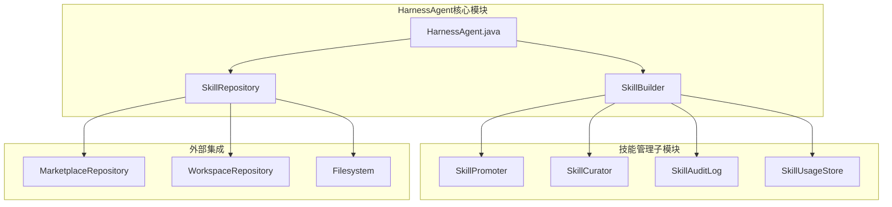
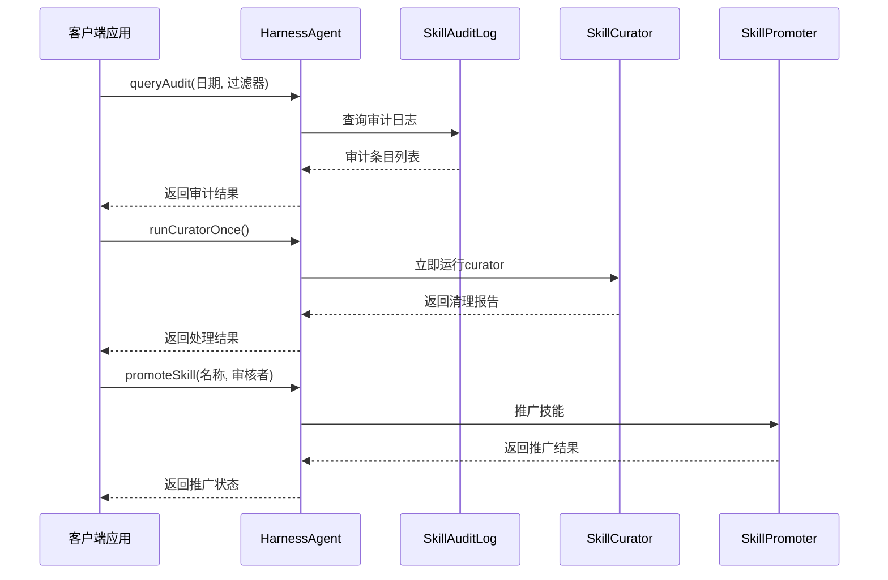
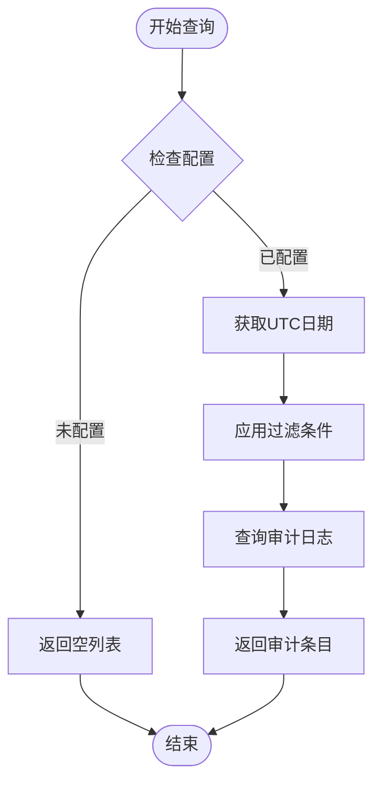
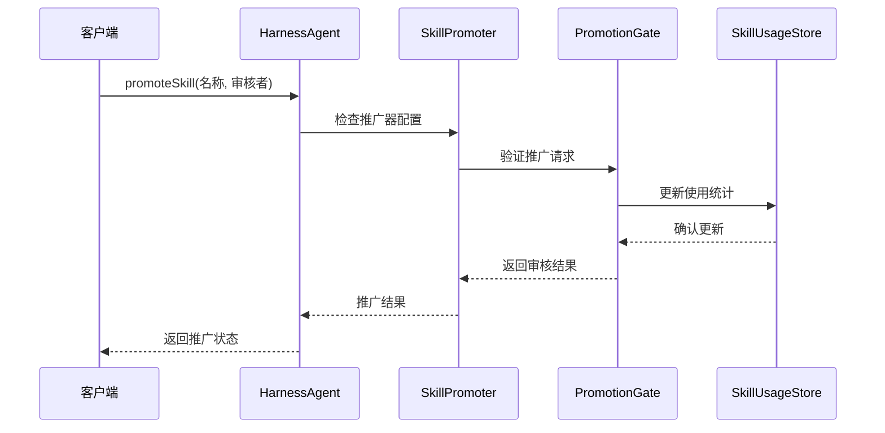
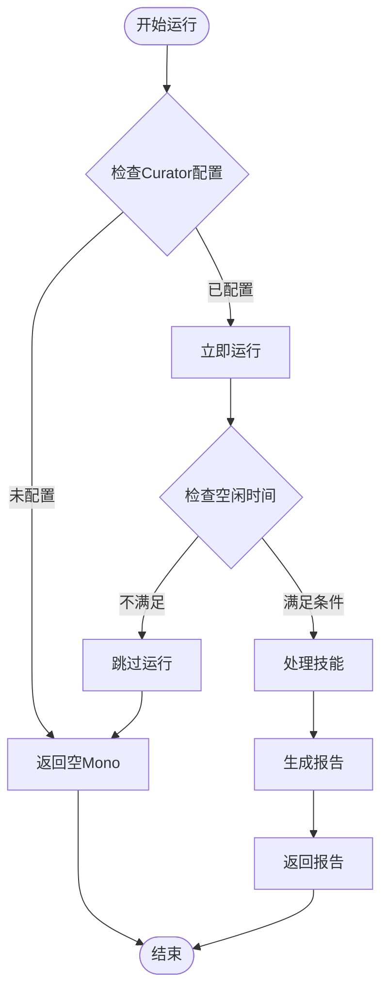
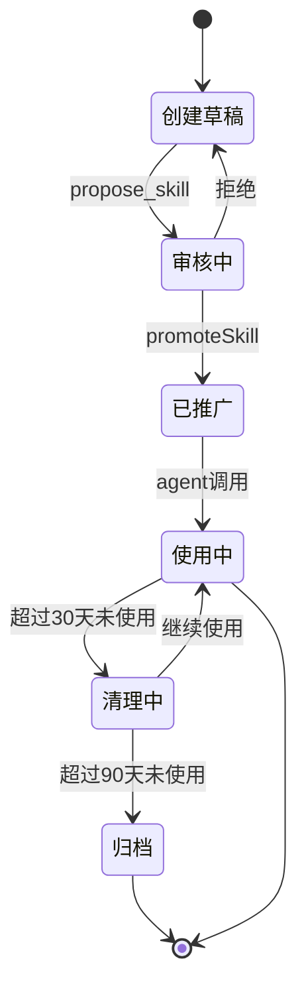
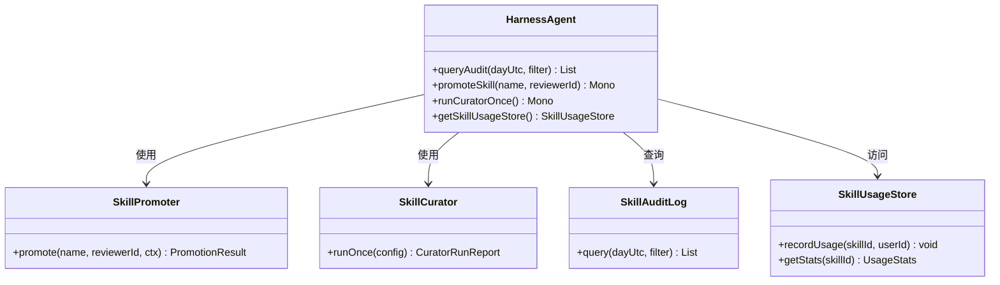
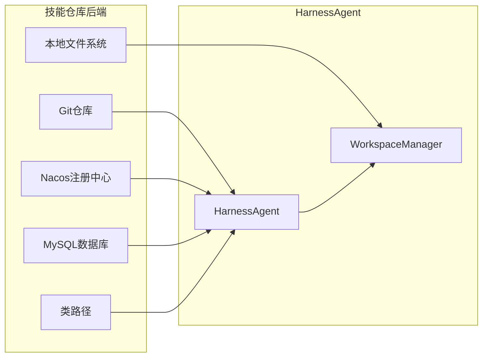

# 技能管理API

<cite>
**本文档引用的文件**
- [HarnessAgent.java](file://agentscope-harness/src/main/java/io/agentscope/harness/agent/HarnessAgent.java)
- [skill.md](file://docs/v2/zh/docs/harness/skill.md)
- [AgentSkillsController.java](file://agentscope-examples/agents/agentscope-builder/src/main/java/io/agentscope/builder/web/api/AgentSkillsController.java)
</cite>

## 目录
1. [简介](#简介)
2. [项目结构](#项目结构)
3. [核心组件](#核心组件)
4. [架构概览](#架构概览)
5. [详细组件分析](#详细组件分析)
6. [依赖关系分析](#依赖关系分析)
7. [性能考虑](#性能考虑)
8. [故障排除指南](#故障排除指南)
9. [结论](#结论)
10. [附录](#附录)

## 简介
本文档详细说明HarnessAgent的技能管理API，包括技能审计日志查询(queryAudit)、技能推广(promoteSkill)和技能curator运行(runCuratorOnce)等方法。文档还解释了技能自学习循环和技能审核机制，记录了技能使用统计和技能仓库的集成方式，并提供了实际代码示例展示如何查询技能使用情况、手动推广技能以及触发技能curator运行。

## 项目结构
HarnessAgent位于agentscope-harness模块中，采用分层架构设计，将核心代理功能与工作区、文件系统、沙箱、子代理、技能管理等功能模块分离。



**图表来源**
- [HarnessAgent.java:128-153](file://agentscope-harness/src/main/java/io/agentscope/harness/agent/HarnessAgent.java#L128-L153)

**章节来源**
- [HarnessAgent.java:128-153](file://agentscope-harness/src/main/java/io/agentscope/harness/agent/HarnessAgent.java#L128-L153)

## 核心组件
HarnessAgent作为主要的技能管理API入口，提供了以下核心功能：

### 主要API方法
1. **queryAudit()** - 查询技能审计日志
2. **promoteSkill()** - 手动推广技能
3. **runCuratorOnce()** - 立即运行技能curator

### 技能管理组件
- **SkillPromoter**: 处理技能推广流程
- **SkillCurator**: 管理技能生命周期和清理
- **SkillAuditLog**: 记录技能使用和变更历史
- **SkillUsageStore**: 统计技能使用情况

**章节来源**
- [HarnessAgent.java:263-298](file://agentscope-harness/src/main/java/io/agentscope/harness/agent/HarnessAgent.java#L263-L298)

## 架构概览
HarnessAgent采用插件化架构，支持多种技能仓库后端和自学习循环。



**图表来源**
- [HarnessAgent.java:267-298](file://agentscope-harness/src/main/java/io/agentscope/harness/agent/HarnessAgent.java#L267-L298)

## 详细组件分析

### 技能审计日志查询 (queryAudit)
queryAudit方法提供技能使用情况的审计功能，支持按日期和条件过滤。



**图表来源**
- [HarnessAgent.java:267-273](file://agentscope-harness/src/main/java/io/agentscope/harness/agent/HarnessAgent.java#L267-L273)

**章节来源**
- [HarnessAgent.java:267-273](file://agentscope-harness/src/main/java/io/agentscope/harness/agent/HarnessAgent.java#L267-L273)

### 技能推广 (promoteSkill)
promoteSkill方法用于手动推广草稿技能，通过配置的推广门进行审核。



**图表来源**
- [HarnessAgent.java:290-298](file://agentscope-harness/src/main/java/io/agentscope/harness/agent/HarnessAgent.java#L290-L298)

**章节来源**
- [HarnessAgent.java:290-298](file://agentscope-harness/src/main/java/io/agentscope/harness/agent/HarnessAgent.java#L290-L298)

### 技能Curator运行 (runCuratorOnce)
runCuratorOnce提供立即运行技能清理和维护的能力。



**图表来源**
- [HarnessAgent.java:279-284](file://agentscope-harness/src/main/java/io/agentscope/harness/agent/HarnessAgent.java#L279-L284)

**章节来源**
- [HarnessAgent.java:279-284](file://agentscope-harness/src/main/java/io/agentscope/harness/agent/HarnessAgent.java#L279-L284)

### 技能自学习循环
HarnessAgent实现了完整的技能自学习闭环，包括技能创建、审核和清理三个阶段。



**图表来源**
- [skill.md:209-271](file://docs/v2/zh/docs/harness/skill.md#L209-L271)

**章节来源**
- [skill.md:209-271](file://docs/v2/zh/docs/harness/skill.md#L209-L271)

## 依赖关系分析

### 技能管理API依赖图


**图表来源**
- [HarnessAgent.java:164-224](file://agentscope-harness/src/main/java/io/agentscope/harness/agent/HarnessAgent.java#L164-L224)

**章节来源**
- [HarnessAgent.java:164-224](file://agentscope-harness/src/main/java/io/agentscope/harness/agent/HarnessAgent.java#L164-L224)

### 技能仓库集成
HarnessAgent支持多种技能仓库后端，包括Git、Nacos、MySQL、Classpath等。



**图表来源**
- [skill.md:56-138](file://docs/v2/zh/docs/harness/skill.md#L56-L138)

**章节来源**
- [skill.md:56-138](file://docs/v2/zh/docs/harness/skill.md#L56-L138)

## 性能考虑
- **异步处理**: 所有技能管理操作都基于Reactor的Mono和Flux，支持非阻塞异步处理
- **缓存机制**: 技能使用统计和审计日志采用内存缓存，减少I/O操作
- **节流控制**: Curator运行支持节流控制，避免频繁的文件系统操作
- **并发安全**: HarnessAgent是线程安全的，支持多用户并发访问

## 故障排除指南

### 常见问题及解决方案
1. **技能推广失败**: 检查推广门配置和审核者权限
2. **审计日志为空**: 确认已启用技能管理工具和正确配置使用统计
3. **Curator未运行**: 验证Curator配置和运行权限

**章节来源**
- [HarnessAgent.java:267-298](file://agentscope-harness/src/main/java/io/agentscope/harness/agent/HarnessAgent.java#L267-L298)

## 结论
HarnessAgent的技能管理API提供了完整的技能生命周期管理功能，包括审计、推广和清理等核心操作。通过灵活的配置选项和多种仓库后端支持，用户可以根据需求构建个性化的技能管理体系。建议按照"技能创建→审核→清理"的顺序启用相关功能，以获得最佳的使用体验。

## 附录

### API使用示例
以下示例展示了如何使用HarnessAgent的技能管理API：

#### 查询技能使用情况
```java
// 查询当天的技能审计日志
List<SkillAuditLog.Entry> entries = agent.queryAudit(
    LocalDate.now(), 
    entry -> entry.getSkillId().contains("code-reviewer")
);

// 查询指定日期范围
List<SkillAuditLog.Entry> recentEntries = agent.queryAudit(
    "2024-01-15", 
    entry -> entry.getTimestamp() > startTime
);
```

#### 手动推广技能
```java
// 手动推广草稿技能
agent.promoteSkill("notes-taker", "alice")
    .subscribe(result -> {
        if (result.isValid()) {
            System.out.println("技能推广成功: " + result.getSkillId());
        } else {
            System.err.println("推广失败: " + result.getErrorMessage());
        }
    });
```

#### 触发技能Curator运行
```java
// 立即运行技能清理
agent.runCuratorOnce()
    .subscribe(report -> {
        System.out.println("清理完成，处理了 " + report.getProcessedCount() + " 个技能");
    });
```

### 配置最佳实践
1. **分阶段启用**: 先启用技能管理工具，再添加推广门，最后配置Curator
2. **环境隔离**: 使用环境过滤器控制不同环境下的技能可见性
3. **灰度发布**: 通过金丝雀过滤器控制技能的逐步推广
4. **监控告警**: 定期检查Curator运行报告，及时发现异常技能

**章节来源**
- [skill.md:231-271](file://docs/v2/zh/docs/harness/skill.md#L231-L271)