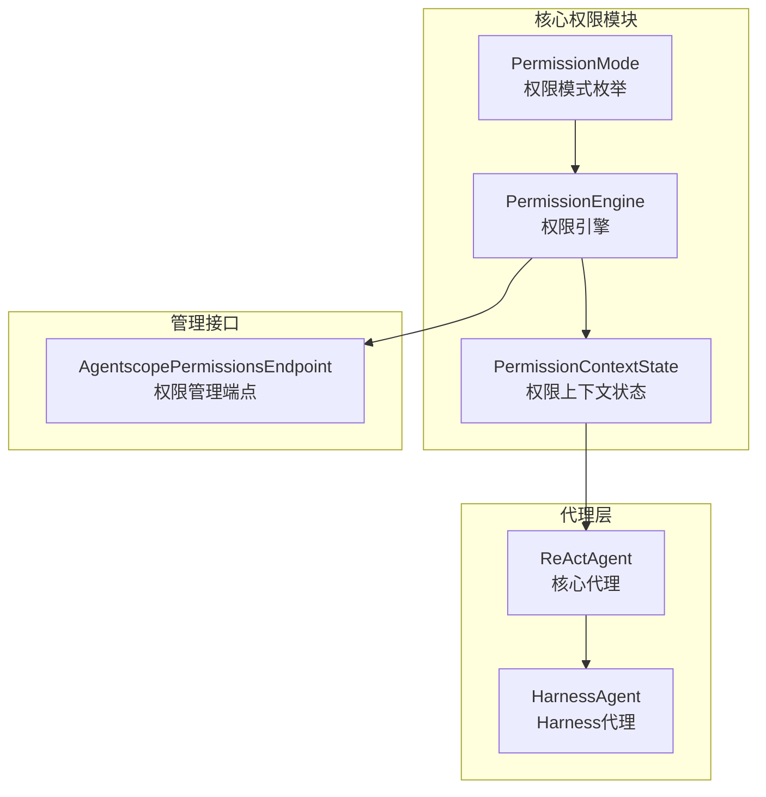
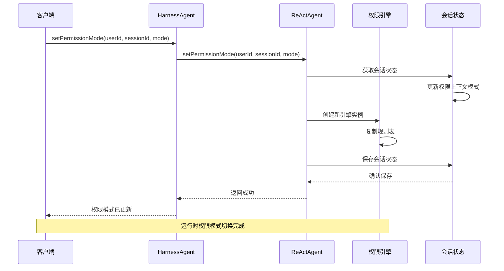
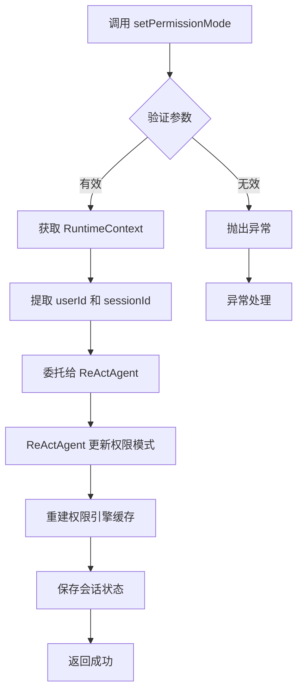
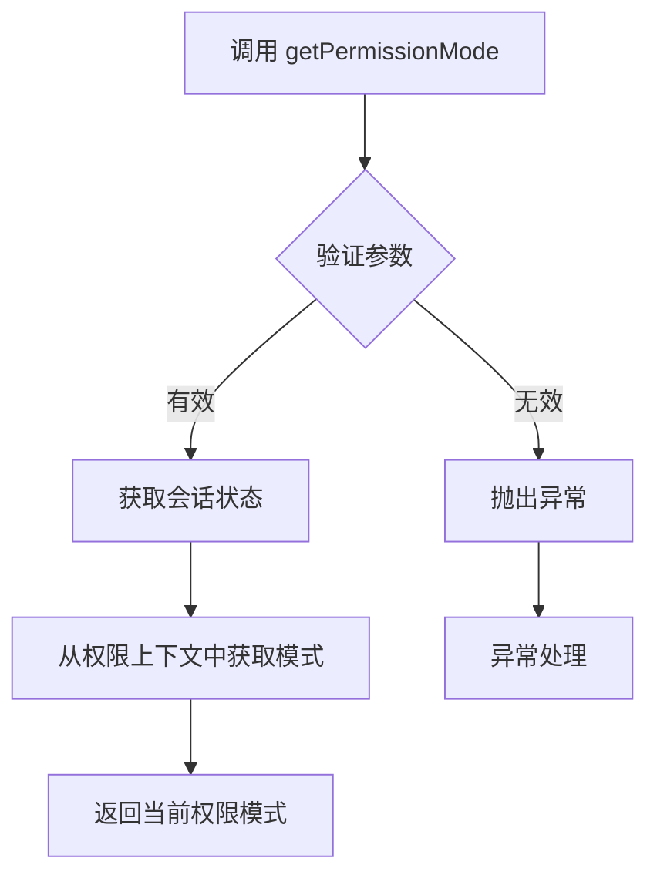
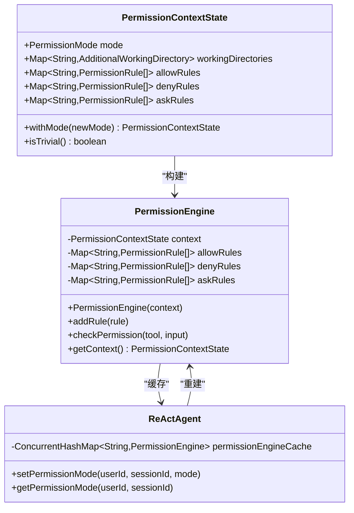
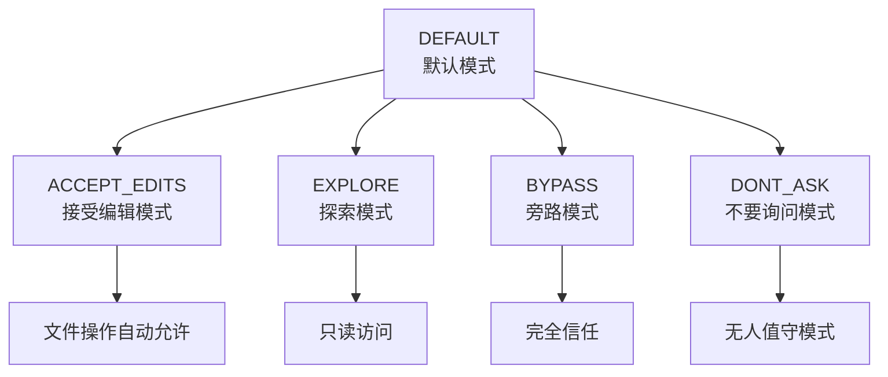
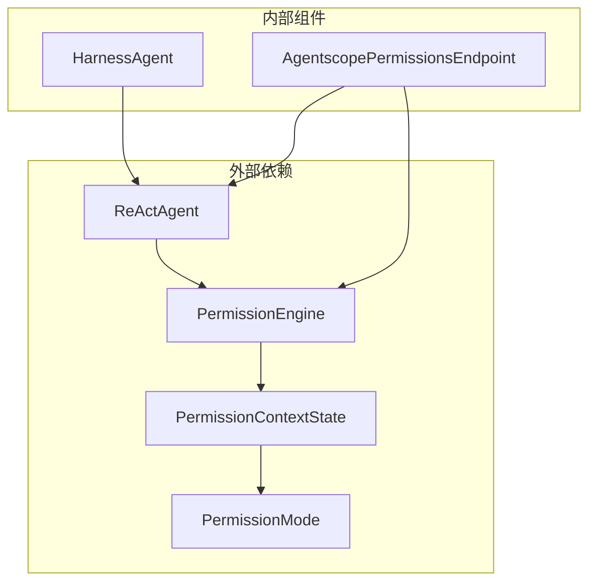

# 权限管理API

<cite>
**本文档引用的文件**
- [HarnessAgent.java](file://agentscope-harness/src/main/java/io/agentscope/harness/agent/HarnessAgent.java)
- [ReActAgent.java](file://agentscope-core/src/main/java/io/agentscope/core/ReActAgent.java)
- [PermissionMode.java](file://agentscope-core/src/main/java/io/agentscope/core/permission/PermissionMode.java)
- [PermissionEngine.java](file://agentscope-core/src/main/java/io/agentscope/core/permission/PermissionEngine.java)
- [PermissionContextState.java](file://agentscope-core/src/main/java/io/agentscope/core/permission/PermissionContextState.java)
- [AgentscopePermissionsEndpoint.java](file://agentscope-extensions/agentscope-spring-boot-starters/agentscope-admin-spring-boot-starter/src/main/java/io/agentscope/spring/boot/admin/endpoint/AgentscopePermissionsEndpoint.java)
- [permission-system.md](file://docs/v2/zh/docs/building-blocks/permission-system.md)
</cite>

## 目录
1. [简介](#简介)
2. [项目结构](#项目结构)
3. [核心组件](#核心组件)
4. [架构概览](#架构概览)
5. [详细组件分析](#详细组件分析)
6. [依赖关系分析](#依赖关系分析)
7. [性能考虑](#性能考虑)
8. [故障排除指南](#故障排除指南)
9. [结论](#结论)

## 简介

本文档详细介绍了HarnessAgent的权限管理API，重点涵盖`setPermissionMode()`和`getPermissionMode()`方法的使用。这些API允许在运行时动态调整不同会话的权限级别，并提供了完整的权限模式切换机制和会话隔离功能。

权限管理系统基于ReActAgent的权限引擎，支持多种权限模式，包括默认模式、接受编辑模式、探索模式、旁路模式和不要询问模式。系统确保每个会话的权限状态相互隔离，不会影响其他用户的操作。

## 项目结构

权限管理功能主要分布在以下模块中：

**图表来源**
- [PermissionMode.java:33-71](file://agentscope-core/src/main/java/io/agentscope/core/permission/PermissionMode.java#L33-L71)
- [PermissionEngine.java:47-84](file://agentscope-core/src/main/java/io/agentscope/core/permission/PermissionEngine.java#L47-L84)
- [ReActAgent.java:255-270](file://agentscope-core/src/main/java/io/agentscope/core/ReActAgent.java#L255-L270)
- [HarnessAgent.java:157-224](file://agentscope-harness/src/main/java/io/agentscope/harness/agent/HarnessAgent.java#L157-L224)

**章节来源**
- [HarnessAgent.java:128-152](file://agentscope-harness/src/main/java/io/agentscope/harness/agent/HarnessAgent.java#L128-L152)
- [ReActAgent.java:201-331](file://agentscope-core/src/main/java/io/agentscope/core/ReActAgent.java#L201-L331)

## 核心组件

### 权限模式枚举

权限模式定义了代理在执行工具调用时的行为准则：

| 模式 | 行为 | 使用场景 |
|------|------|----------|
| `DEFAULT` | 所有操作都需要显式规则或用户确认 | 最安全，默认值 |
| `ACCEPT_EDITS` | 自动放行工作目录内的文件操作 | 用户在场的活跃开发 |
| `EXPLORE` | 只读：放行读、拒绝所有写与命令 | 代码探索、规划 |
| `BYPASS` | 放行一切（deny/ask规则仍生效） | 完全可信的沙箱 |
| `DONT_ASK` | 把所有ASK转为DENY | 无人值守/计划任务 |

### 权限引擎

权限引擎负责评估工具执行请求，遵循以下优先级顺序：

1. 工具级拒绝规则（最高优先级）
2. 工具级询问规则
3. 工具特定检查（绕过免疫）
4. 工具级允许规则
5. `BYPASS`回退
6. 默认询问（在`DONT_ASK`模式下转换为拒绝）

### 权限上下文状态

权限上下文状态包含模式、工作目录和三个规则表，用于控制权限决策：

- `mode`: 当前权限模式
- `working_directories`: 工作目录映射
- `allow_rules`: 允许规则表
- `deny_rules`: 拒绝规则表  
- `ask_rules`: 询问规则表

**章节来源**
- [PermissionMode.java:22-71](file://agentscope-core/src/main/java/io/agentscope/core/permission/PermissionMode.java#L22-L71)
- [PermissionEngine.java:28-46](file://agentscope-core/src/main/java/io/agentscope/core/permission/PermissionEngine.java#L28-L46)
- [PermissionContextState.java:29-133](file://agentscope-core/src/main/java/io/agentscope/core/permission/PermissionContextState.java#L29-L133)

## 架构概览

**图表来源**
- [HarnessAgent.java:355-368](file://agentscope-harness/src/main/java/io/agentscope/harness/agent/HarnessAgent.java#L355-L368)
- [ReActAgent.java:3488-3496](file://agentscope-core/src/main/java/io/agentscope/core/ReActAgent.java#L3488-L3496)

## 详细组件分析

### HarnessAgent权限管理API

HarnessAgent提供了两个主要的权限管理方法：

#### setPermissionMode() 方法

**图表来源**
- [HarnessAgent.java:355-368](file://agentscope-harness/src/main/java/io/agentscope/harness/agent/HarnessAgent.java#L355-L368)
- [ReActAgent.java:3488-3496](file://agentscope-core/src/main/java/io/agentscope/core/ReActAgent.java#L3488-L3496)

#### getPermissionMode() 方法

该方法用于查询当前会话的权限模式：

**图表来源**
- [HarnessAgent.java:370-374](file://agentscope-harness/src/main/java/io/agentscope/harness/agent/HarnessAgent.java#L370-L374)
- [ReActAgent.java:3518-3521](file://agentscope-core/src/main/java/io/agentscope/core/ReActAgent.java#L3518-L3521)

### 权限引擎重建过程

当权限模式发生变化时，系统会执行以下重建过程：

**图表来源**
- [PermissionContextState.java:148-159](file://agentscope-core/src/main/java/io/agentscope/core/permission/PermissionContextState.java#L148-L159)
- [PermissionEngine.java:59-64](file://agentscope-core/src/main/java/io/agentscope/core/permission/PermissionEngine.java#L59-L64)
- [ReActAgent.java:269-270](file://agentscope-core/src/main/java/io/agentscope/core/ReActAgent.java#L269-L270)

### 会话隔离机制

系统通过以下机制确保会话间的权限隔离：

1. **槽键生成**: 使用`(userId/sessionId)`组合生成唯一槽键
2. **独立状态缓存**: 每个会话维护独立的AgentState缓存
3. **权限引擎缓存**: 每个会话拥有独立的权限引擎实例
4. **持久化隔离**: 通过AgentStateStore确保状态持久化隔离

**章节来源**
- [ReActAgent.java:337-350](file://agentscope-core/src/main/java/io/agentscope/core/ReActAgent.java#L337-L350)
- [ReActAgent.java:438-479](file://agentscope-core/src/main/java/io/agentscope/core/ReActAgent.java#L438-L479)

### 权限模式继承关系

权限模式具有以下继承关系：

**图表来源**
- [PermissionMode.java:33-38](file://agentscope-core/src/main/java/io/agentscope/core/permission/PermissionMode.java#L33-L38)
- [permission-system.md:84-94](file://docs/v2/zh/docs/building-blocks/permission-system.md#L84-L94)

### 默认值设置

权限系统的默认配置：

- **默认模式**: `DEFAULT`（最安全）
- **默认工作目录**: 空映射
- **默认规则表**: 空列表
- **默认行为**: 当所有字段为空时，系统使用轻量级路径进行权限检查

**章节来源**
- [PermissionContextState.java:46-52](file://agentscope-core/src/main/java/io/agentscope/core/permission/PermissionContextState.java#L46-L52)
- [PermissionContextState.java:107-113](file://agentscope-core/src/main/java/io/agentscope/core/permission/PermissionContextState.java#L107-L113)

## 依赖关系分析

**图表来源**
- [HarnessAgent.java:18-44](file://agentscope-harness/src/main/java/io/agentscope/harness/agent/HarnessAgent.java#L18-L44)
- [AgentscopePermissionsEndpoint.java:42-46](file://agentscope-extensions/agentscope-spring-boot-starters/agentscope-admin-spring-boot-starter/src/main/java/io/agentscope/spring/boot/admin/endpoint/AgentscopePermissionsEndpoint.java#L42-L46)

**章节来源**
- [AgentscopePermissionsEndpoint.java:32-113](file://agentscope-extensions/agentscope-spring-boot-starters/agentscope-admin-spring-boot-starter/src/main/java/io/agentscope/spring/boot/admin/endpoint/AgentscopePermissionsEndpoint.java#L32-L113)

## 性能考虑

权限管理API在设计时考虑了以下性能因素：

1. **缓存策略**: 权限引擎和会话状态都使用并发缓存，避免重复计算
2. **延迟初始化**: 权限引擎仅在需要时创建和重建
3. **内存优化**: 使用不可变数据结构减少内存占用
4. **线程安全**: 所有操作都是线程安全的，支持高并发场景

## 故障排除指南

### 常见问题及解决方案

1. **权限模式切换不生效**
   - 检查会话标识符是否正确传递
   - 确认AgentStateStore配置正确
   - 验证权限引擎缓存重建是否成功

2. **会话间权限冲突**
   - 检查槽键生成逻辑
   - 确认状态缓存隔离机制
   - 验证持久化存储隔离

3. **权限引擎性能问题**
   - 监控缓存命中率
   - 检查规则表大小
   - 优化权限模式选择

**章节来源**
- [ReActAgent.java:438-479](file://agentscope-core/src/main/java/io/agentscope/core/ReActAgent.java#L438-L479)
- [ReActAgent.java:3488-3496](file://agentscope-core/src/main/java/io/agentscope/core/ReActAgent.java#L3488-L3496)

## 结论

HarnessAgent的权限管理API提供了强大而灵活的运行时权限控制能力。通过`setPermissionMode()`和`getPermissionMode()`方法，开发者可以轻松地在不同会话之间动态调整权限级别，同时确保严格的会话隔离和安全性。

系统的设计充分考虑了性能、可扩展性和易用性，适用于各种生产环境中的权限管理需求。权限模式的丰富性和灵活性使得系统能够适应从开发环境到生产环境的各种使用场景。