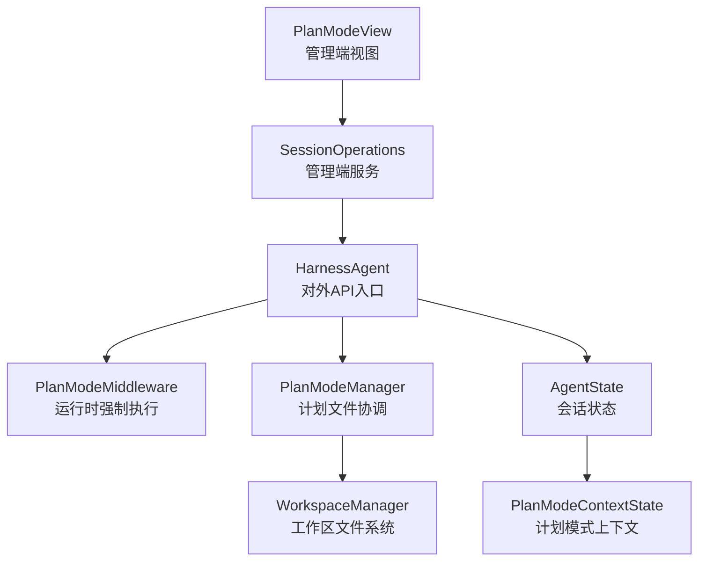
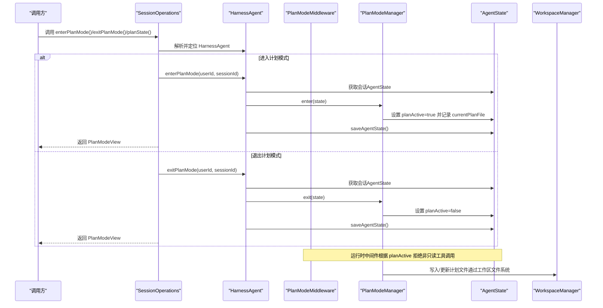
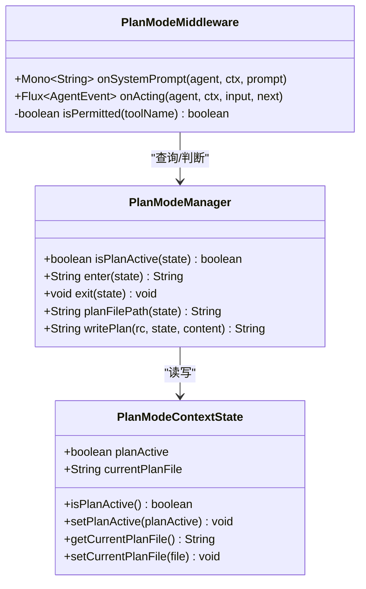
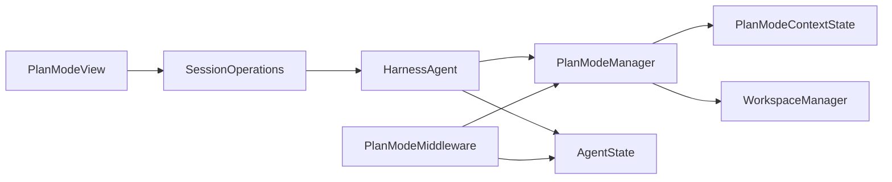

# 计划模式API

<cite>
**本文档引用的文件**
- [HarnessAgent.java](file://agentscope-harness/src/main/java/io/agentscope/harness/agent/HarnessAgent.java)
- [PlanModeContextState.java](file://agentscope-core/src/main/java/io/agentscope/core/state/PlanModeContextState.java)
- [PlanModeMiddleware.java](file://agentscope-harness/src/main/java/io/agentscope/harness/agent/middleware/PlanModeMiddleware.java)
- [PlanModeManager.java](file://agentscope-harness/src/main/java/io/agentscope/harness/agent/workspace/plan/PlanModeManager.java)
- [PlanModeView.java](file://agentscope-extensions/agentscope-spring-boot-starters/agentscope-admin-spring-boot-starter/src/main/java/io/agentscope/spring/boot/admin/dto/PlanModeView.java)
- [SessionOperations.java](file://agentscope-extensions/agentscope-spring-boot-starters/agentscope-admin-spring-boot-starter/src/main/java/io/agentscope/spring/boot/admin/service/SessionOperations.java)
- [PlanModeAutoExample.java](file://agentscope-examples/documentation/src/main/java/io/agentscope/examples/documentation2/harness/planmode/PlanModeAutoExample.java)
- [PlanModeManualExample.java](file://agentscope-examples/documentation/src/main/java/io/agentscope/examples/documentation2/harness/planmode/PlanModeManualExample.java)
</cite>

## 目录
1. [简介](#简介)
2. [项目结构](#项目结构)
3. [核心组件](#核心组件)
4. [架构总览](#架构总览)
5. [详细组件分析](#详细组件分析)
6. [依赖关系分析](#依赖关系分析)
7. [性能考虑](#性能考虑)
8. [故障排除指南](#故障排除指南)
9. [结论](#结论)
10. [附录](#附录)

## 简介
本文件面向HarnessAgent的“计划模式”（Plan Mode）API，系统性说明以下能力：
- 计划模式的进入、退出与状态查询接口：enterPlanMode()、exitPlanMode()、isPlanModeActive()
- 计划模式的工作原理与状态管理机制
- 与RuntimeContext的交互方式与会话级持久化
- 在不同场景下的使用示例与最佳实践
- 计划模式与工具链、中间件、工作区等模块的集成关系

计划模式是一种“先设计后执行”的只读设计阶段：在此期间，代理仅允许只读工具调用与计划编辑工具，禁止任何可能改变环境或数据的写入操作，直到用户批准并退出计划模式后，才回到可变更的构建模式。

## 项目结构
围绕计划模式的关键代码分布在以下模块中：
- 核心状态模型：PlanModeContextState（会话级持久化）
- 运行时中间件：PlanModeMiddleware（动态强制执行只读策略）
- 工作区协调器：PlanModeManager（计划文件路径与写入）
- 外部控制入口：HarnessAgent（对外暴露API）
- 管理端视图：PlanModeView（用于前端/管理端展示）
- 管理端服务：SessionOperations（提供enter/exit/查询计划模式的管理接口）

图表来源
- [HarnessAgent.java:304-348](file://agentscope-harness/src/main/java/io/agentscope/harness/agent/HarnessAgent.java#L304-L348)
- [PlanModeMiddleware.java:58-166](file://agentscope-harness/src/main/java/io/agentscope/harness/agent/middleware/PlanModeMiddleware.java#L58-L166)
- [PlanModeManager.java:39-115](file://agentscope-harness/src/main/java/io/agentscope/harness/agent/workspace/plan/PlanModeManager.java#L39-L115)
- [PlanModeContextState.java:37-97](file://agentscope-core/src/main/java/io/agentscope/core/state/PlanModeContextState.java#L37-L97)
- [PlanModeView.java:29-43](file://agentscope-extensions/agentscope-spring-boot-starters/agentscope-admin-spring-boot-starter/src/main/java/io/agentscope/spring/boot/admin/dto/PlanModeView.java#L29-L43)
- [SessionOperations.java:285-341](file://agentscope-extensions/agentscope-spring-boot-starters/agentscope-admin-spring-boot-starter/src/main/java/io/agentscope/spring/boot/admin/service/SessionOperations.java#L285-L341)

章节来源
- [HarnessAgent.java:128-152](file://agentscope-harness/src/main/java/io/agentscope/harness/agent/HarnessAgent.java#L128-L152)
- [PlanModeContextState.java:23-35](file://agentscope-core/src/main/java/io/agentscope/core/state/PlanModeContextState.java#L23-L35)

## 核心组件
- PlanModeContextState：会话级持久化的计划模式标志与当前计划文件路径
- PlanModeMiddleware：在运行时根据AgentState中的计划模式标志，拒绝非只读与非计划控制工具的调用，并注入提示词横幅
- PlanModeManager：负责设置计划模式开关、维护默认计划文件路径、通过工作区文件系统写入计划内容
- HarnessAgent：对外暴露enterPlanMode()/exitPlanMode()/isPlanModeActive()，并与AgentState持久化配合
- PlanModeView：管理端视图对象，封装sessionId、planActive、currentPlanFile、planMiddlewareEnabled
- SessionOperations：管理端服务，提供enterPlanMode()/exitPlanMode()/planState()等操作

章节来源
- [PlanModeContextState.java:37-97](file://agentscope-core/src/main/java/io/agentscope/core/state/PlanModeContextState.java#L37-L97)
- [PlanModeMiddleware.java:58-243](file://agentscope-harness/src/main/java/io/agentscope/harness/agent/middleware/PlanModeMiddleware.java#L58-L243)
- [PlanModeManager.java:39-115](file://agentscope-harness/src/main/java/io/agentscope/harness/agent/workspace/plan/PlanModeManager.java#L39-L115)
- [HarnessAgent.java:304-348](file://agentscope-harness/src/main/java/io/agentscope/harness/agent/HarnessAgent.java#L304-L348)
- [PlanModeView.java:29-43](file://agentscope-extensions/agentscope-spring-boot-starters/agentscope-admin-spring-boot-starter/src/main/java/io/agentscope/spring/boot/admin/dto/PlanModeView.java#L29-L43)
- [SessionOperations.java:285-341](file://agentscope-extensions/agentscope-spring-boot-starters/agentscope-admin-spring-boot-starter/src/main/java/io/agentscope/spring/boot/admin/service/SessionOperations.java#L285-L341)

## 架构总览
计划模式的调用链路如下：

图表来源
- [SessionOperations.java:301-341](file://agentscope-extensions/agentscope-spring-boot-starters/agentscope-admin-spring-boot-starter/src/main/java/io/agentscope/spring/boot/admin/service/SessionOperations.java#L301-L341)
- [HarnessAgent.java:323-342](file://agentscope-harness/src/main/java/io/agentscope/harness/agent/HarnessAgent.java#L323-L342)
- [PlanModeMiddleware.java:144-233](file://agentscope-harness/src/main/java/io/agentscope/harness/agent/middleware/PlanModeMiddleware.java#L144-L233)
- [PlanModeManager.java:69-110](file://agentscope-harness/src/main/java/io/agentscope/harness/agent/workspace/plan/PlanModeManager.java#L69-L110)

## 详细组件分析

### API方法详解
- enterPlanMode(RuntimeContext ctx)
  - 功能：将当前会话切换至计划模式；变更会持久化，后续调用可见
  - 实现要点：委托到按userId/sessionId解析的AgentState，调用PlanModeManager.enter或回退到直接设置PlanModeContextState
  - 线程安全：通过AgentState按会话隔离，不同会话并发安全
- exitPlanMode(RuntimeContext ctx)
  - 功能：退出计划模式，回到构建模式
  - 实现要点：同样持久化变更
- isPlanModeActive(RuntimeContext ctx)
  - 功能：查询当前会话是否处于计划模式
  - 实现要点：读取AgentState中的PlanModeContextState

章节来源
- [HarnessAgent.java:304-316](file://agentscope-harness/src/main/java/io/agentscope/harness/agent/HarnessAgent.java#L304-L316)
- [HarnessAgent.java:318-348](file://agentscope-harness/src/main/java/io/agentscope/harness/agent/HarnessAgent.java#L318-L348)

### 状态管理机制
- PlanModeContextState
  - 字段：planActive（布尔）、currentPlanFile（字符串）
  - 存储位置：位于AgentState内，随会话状态持久化
  - 设计目标：支持分布式重启与跨节点恢复，确保计划模式状态不丢失
- PlanModeManager
  - enter(state)：设置planActive=true，若未设置currentPlanFile则生成默认路径
  - exit(state)：设置planActive=false
  - writePlan(rc, state, content)：通过WorkspaceManager写入计划文件，同时更新currentPlanFile
  - planFilePath(state)：返回当前关联的计划文件路径（默认为“plans/PLAN.md”）
- 中间件强制
  - onSystemPrompt：当处于计划模式时注入横幅提示，明确限制与可用工具
  - onActing：遍历工具调用，仅允许“总是被允许”的工具、额外允许列表、或由readOnlyResolver判定为只读的工具；其余调用将被拒绝并产生事件

图表来源
- [PlanModeContextState.java:37-97](file://agentscope-core/src/main/java/io/agentscope/core/state/PlanModeContextState.java#L37-L97)
- [PlanModeManager.java:60-110](file://agentscope-harness/src/main/java/io/agentscope/harness/agent/workspace/plan/PlanModeManager.java#L60-L110)
- [PlanModeMiddleware.java:144-242](file://agentscope-harness/src/main/java/io/agentscope/harness/agent/middleware/PlanModeMiddleware.java#L144-L242)

章节来源
- [PlanModeContextState.java:23-35](file://agentscope-core/src/main/java/io/agentscope/core/state/PlanModeContextState.java#L23-L35)
- [PlanModeManager.java:69-110](file://agentscope-harness/src/main/java/io/agentscope/harness/agent/workspace/plan/PlanModeManager.java#L69-L110)
- [PlanModeMiddleware.java:144-233](file://agentscope-harness/src/main/java/io/agentscope/harness/agent/middleware/PlanModeMiddleware.java#L144-L233)

### 与RuntimeContext的交互与会话级持久化
- RuntimeContext用于标识会话（userId, sessionId），HarnessAgent的所有计划模式API均支持传入RuntimeContext或显式传入(userId, sessionId)
- PlanModeContextState存储于AgentState，每次enter/exit后立即调用saveAgentState进行持久化，确保跨请求、跨进程、跨节点一致
- 中间件在每次调用前从RuntimeContext解析AgentState，从而保证动态切换生效

章节来源
- [HarnessAgent.java:304-348](file://agentscope-harness/src/main/java/io/agentscope/harness/agent/HarnessAgent.java#L304-L348)
- [PlanModeContextState.java:31-34](file://agentscope-core/src/main/java/io/agentscope/core/state/PlanModeContextState.java#L31-L34)

### 管理端集成与视图
- SessionOperations提供管理端API：planState()读取当前状态；enterPlanMode()/exitPlanMode()在管理端触发切换，并返回PlanModeView
- PlanModeView包含：sessionId、planActive、currentPlanFile、planMiddlewareEnabled（用于诊断中间件是否启用）
- 管理端服务在执行切换前会检查是否为HarnessAgent实例，否则抛出异常

章节来源
- [SessionOperations.java:285-341](file://agentscope-extensions/agentscope-spring-boot-starters/agentscope-admin-spring-boot-starter/src/main/java/io/agentscope/spring/boot/admin/service/SessionOperations.java#L285-L341)
- [PlanModeView.java:29-43](file://agentscope-extensions/agentscope-spring-boot-starters/agentscope-admin-spring-boot-starter/src/main/java/io/agentscope/spring/boot/admin/dto/PlanModeView.java#L29-L43)

### 使用示例与场景
以下示例展示了在不同场景下如何切换计划模式。请参考对应示例文件以获取完整用法。

- 自动化计划模式示例
  - 场景：在特定任务开始前自动进入计划模式，完成后退出
  - 参考路径：[PlanModeAutoExample.java](file://agentscope-examples/documentation/src/main/java/io/agentscope/examples/documentation2/harness/planmode/PlanModeAutoExample.java)
- 手动计划模式示例
  - 场景：由用户手动触发进入/退出计划模式
  - 参考路径：[PlanModeManualExample.java](file://agentscope-examples/documentation/src/main/java/io/agentscope/examples/documentation2/harness/planmode/PlanModeManualExample.java)

章节来源
- [PlanModeAutoExample.java](file://agentscope-examples/documentation/src/main/java/io/agentscope/examples/documentation2/harness/planmode/PlanModeAutoExample.java)
- [PlanModeManualExample.java](file://agentscope-examples/documentation/src/main/java/io/agentscope/examples/documentation2/harness/planmode/PlanModeManualExample.java)

### 计划模式对代理行为的影响
- 只读约束：在计划模式下，非只读工具调用会被拒绝，系统会生成“DENIED”结果并输出事件
- 提示词注入：中间件会在系统提示词中加入计划模式横幅，提醒模型当前处于只读设计阶段
- 计划文件写入：通过PlanModeManager.writePlan将计划内容写入工作区文件系统，路径由PlanModeManager维护
- 与子代理/任务：计划模式下仍允许与子代理/任务相关的工具（如agent_spawn、task_output等）正常工作

章节来源
- [PlanModeMiddleware.java:72-109](file://agentscope-harness/src/main/java/io/agentscope/harness/agent/middleware/PlanModeMiddleware.java#L72-L109)
- [PlanModeMiddleware.java:168-233](file://agentscope-harness/src/main/java/io/agentscope/harness/agent/middleware/PlanModeMiddleware.java#L168-L233)
- [PlanModeManager.java:96-110](file://agentscope-harness/src/main/java/io/agentscope/harness/agent/workspace/plan/PlanModeManager.java#L96-L110)

## 依赖关系分析
- 组件耦合
  - HarnessAgent依赖PlanModeManager与AgentState进行状态切换与持久化
  - PlanModeMiddleware依赖PlanModeManager与ReadOnly工具解析器进行运行时强制
  - PlanModeManager依赖WorkspaceManager进行计划文件写入
- 外部依赖
  - 管理端通过SessionOperations与HarnessAgent交互，返回PlanModeView供前端/管理端展示
- 循环依赖
  - 不存在循环依赖：各模块职责清晰，PlanModeMiddleware仅做运行时决策，不反向依赖HarnessAgent

图表来源
- [HarnessAgent.java:304-348](file://agentscope-harness/src/main/java/io/agentscope/harness/agent/HarnessAgent.java#L304-L348)
- [PlanModeMiddleware.java:111-142](file://agentscope-harness/src/main/java/io/agentscope/harness/agent/middleware/PlanModeMiddleware.java#L111-L142)
- [PlanModeManager.java:44-58](file://agentscope-harness/src/main/java/io/agentscope/harness/agent/workspace/plan/PlanModeManager.java#L44-L58)
- [SessionOperations.java:285-341](file://agentscope-extensions/agentscope-spring-boot-starters/agentscope-admin-spring-boot-starter/src/main/java/io/agentscope/spring/boot/admin/service/SessionOperations.java#L285-L341)
- [PlanModeView.java:29-43](file://agentscope-extensions/agentscope-spring-boot-starters/agentscope-admin-spring-boot-starter/src/main/java/io/agentscope/spring/boot/admin/dto/PlanModeView.java#L29-L43)

## 性能考虑
- 状态持久化：每次切换都会调用saveAgentState，建议在高频切换场景下合并操作，避免频繁IO
- 中间件开销：onActing对每个工具调用进行判定，建议合理配置readOnlyResolver与additionalAllowed集合，减少判定成本
- 文件写入：writePlan通过WorkspaceManager写入，具体性能取决于底层文件系统（本地/沙箱/远程）

## 故障排除指南
- 非HarnessAgent实例
  - 现象：管理端调用enterPlanMode()/exitPlanMode()报错
  - 原因：SessionOperations要求目标Agent必须为HarnessAgent
  - 处理：确认Agent构建时启用了计划模式支持（Builder.enablePlanMode）
  - 参考：[SessionOperations.java:305-307](file://agentscope-extensions/agentscope-spring-boot-starters/agentscope-admin-spring-boot-starter/src/main/java/io/agentscope/spring/boot/admin/service/SessionOperations.java#L305-L307)
- 切换后未生效
  - 现象：调用已返回，但工具仍被拒绝或提示未进入计划模式
  - 原因：中间件未启用或Agent未正确构建
  - 处理：检查PlanModeMiddleware是否已装配；查看PlanModeView的planMiddlewareEnabled字段
  - 参考：[PlanModeView.java:35-42](file://agentscope-extensions/agentscope-spring-boot-starters/agentscope-admin-spring-boot-starter/src/main/java/io/agentscope/spring/boot/admin/dto/PlanModeView.java#L35-L42)
- 计划文件未写入
  - 现象：调用plan_write后未看到文件变化
  - 原因：WorkspaceManager后端配置问题或权限不足
  - 处理：确认工作区文件系统配置与权限；检查writePlan返回的路径是否正确
  - 参考：[PlanModeManager.java:102-110](file://agentscope-harness/src/main/java/io/agentscope/harness/agent/workspace/plan/PlanModeManager.java#L102-L110)

章节来源
- [SessionOperations.java:343-347](file://agentscope-extensions/agentscope-spring-boot-starters/agentscope-admin-spring-boot-starter/src/main/java/io/agentscope/spring/boot/admin/service/SessionOperations.java#L343-L347)
- [PlanModeView.java:29-43](file://agentscope-extensions/agentscope-spring-boot-starters/agentscope-admin-spring-boot-starter/src/main/java/io/agentscope/spring/boot/admin/dto/PlanModeView.java#L29-L43)
- [PlanModeManager.java:102-110](file://agentscope-harness/src/main/java/io/agentscope/harness/agent/workspace/plan/PlanModeManager.java#L102-L110)

## 结论
HarnessAgent的计划模式通过“状态持久化+运行时强制”的双层机制，实现了跨会话、跨节点的动态计划模式切换。开发者可通过HarnessAgent提供的API在不同场景下灵活启用/禁用计划模式，并结合管理端服务进行统一治理。中间件确保了在计划模式下的只读约束，而PlanModeManager与WorkspaceManager协同保障了计划文件的可靠落盘与路径一致性。

## 附录
- 关键API速查
  - enterPlanMode(RuntimeContext ctx)：进入计划模式
  - exitPlanMode(RuntimeContext ctx)：退出计划模式
  - isPlanModeActive(RuntimeContext ctx)：查询计划模式状态
- 相关文件参考
  - [HarnessAgent.java](file://agentscope-harness/src/main/java/io/agentscope/harness/agent/HarnessAgent.java)
  - [PlanModeMiddleware.java](file://agentscope-harness/src/main/java/io/agentscope/harness/agent/middleware/PlanModeMiddleware.java)
  - [PlanModeManager.java](file://agentscope-harness/src/main/java/io/agentscope/harness/agent/workspace/plan/PlanModeManager.java)
  - [PlanModeContextState.java](file://agentscope-core/src/main/java/io/agentscope/core/state/PlanModeContextState.java)
  - [PlanModeView.java](file://agentscope-extensions/agentscope-spring-boot-starters/agentscope-admin-spring-boot-starter/src/main/java/io/agentscope/spring/boot/admin/dto/PlanModeView.java)
  - [SessionOperations.java](file://agentscope-extensions/agentscope-spring-boot-starters/agentscope-admin-spring-boot-starter/src/main/java/io/agentscope/spring/boot/admin/service/SessionOperations.java)
  - 示例：[PlanModeAutoExample.java](file://agentscope-examples/documentation/src/main/java/io/agentscope/examples/documentation2/harness/planmode/PlanModeAutoExample.java)，[PlanModeManualExample.java](file://agentscope-examples/documentation/src/main/java/io/agentscope/examples/documentation2/harness/planmode/PlanModeManualExample.java)