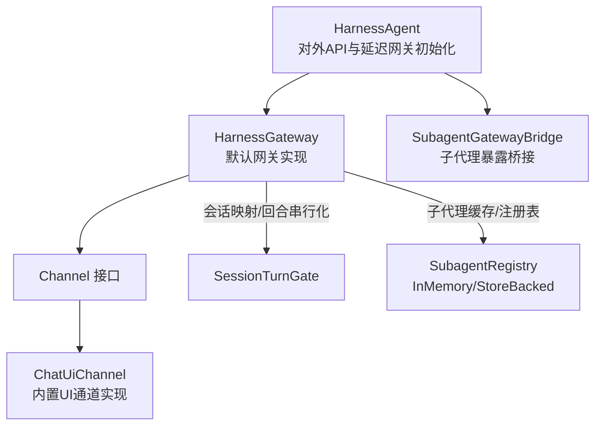
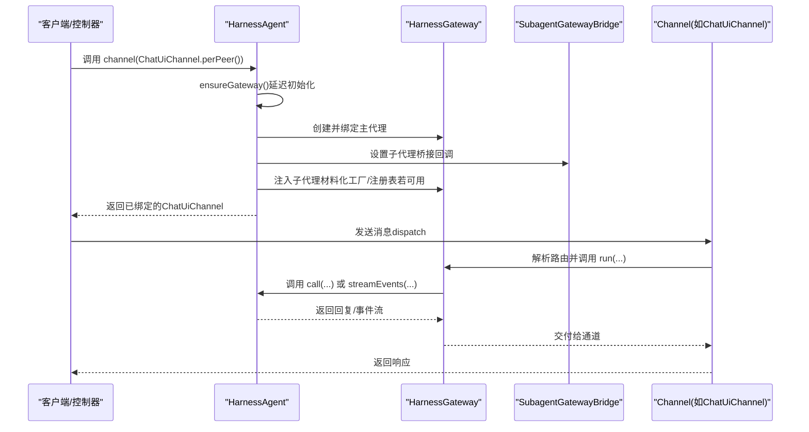
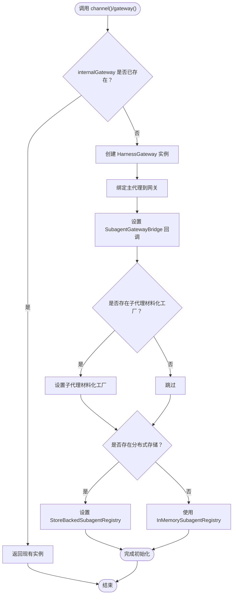
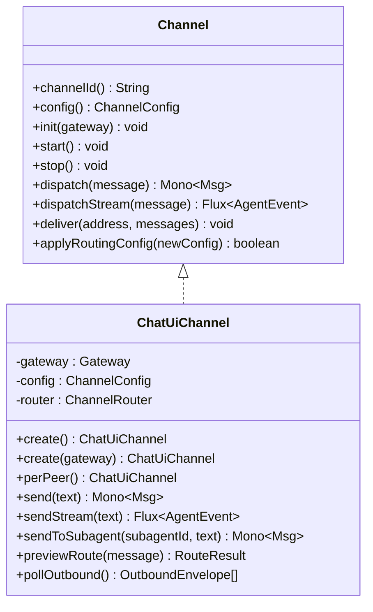
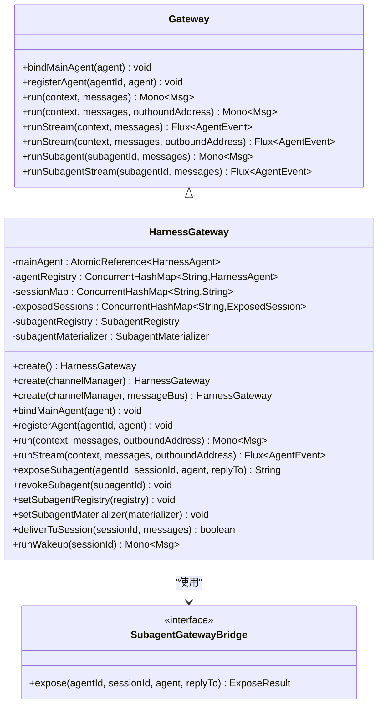
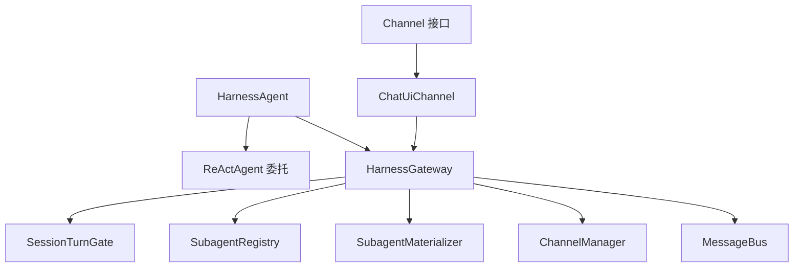

# 通道与网关API

<cite>
**本文档引用的文件**
- [HarnessAgent.java](file://agentscope-harness/src/main/java/io/agentscope/harness/agent/HarnessAgent.java)
- [Channel.java](file://agentscope-harness/src/main/java/io/agentscope/harness/agent/gateway/channel/Channel.java)
- [ChatUiChannel.java](file://agentscope-harness/src/main/java/io/agentscope/harness/agent/gateway/channel/chatui/ChatUiChannel.java)
- [SubagentGatewayBridge.java](file://agentscope-harness/src/main/java/io/agentscope/harness/agent/gateway/SubagentGatewayBridge.java)
- [HarnessGateway.java](file://agentscope-harness/src/main/java/io/agentscope/harness/agent/gateway/HarnessGateway.java)
- [Gateway.java](file://agentscope-harness/src/main/java/io/agentscope/harness/agent/gateway/Gateway.java)
- [HarnessGatewaySessionIdTest.java](file://agentscope-harness/src/test/java/io/agentscope/harness/agent/gateway/HarnessGatewaySessionIdTest.java)
- [HarnessAgentIntegrationExampleTest.java](file://agentscope-harness/src/test/java/io/agentscope/harness/agent/HarnessAgentIntegrationExampleTest.java)
</cite>

## 目录
1. [简介](#简介)
2. [项目结构](#项目结构)
3. [核心组件](#核心组件)
4. [架构总览](#架构总览)
5. [详细组件分析](#详细组件分析)
6. [依赖关系分析](#依赖关系分析)
7. [性能考虑](#性能考虑)
8. [故障排查指南](#故障排查指南)
9. [结论](#结论)
10. [附录](#附录)

## 简介
本文件面向HarnessAgent的通道与网关API，系统性阐述以下主题：
- channel()方法：将外部通道绑定到内部网关，并在首次调用时进行延迟初始化。
- gateway()方法：获取内部网关实例，用于高级用法（如直接运行子代理）。
- 延迟初始化机制ensureGateway：按需创建并配置内部网关、注册主代理、建立子代理桥接与恢复能力。
- 网关桥接功能SubagentGatewayBridge：允许子代理暴露为用户可直接寻址的入口点。
- 生命周期管理：通道的初始化、启动、停止与消息分发；会话键稳定映射与并发回合串行化。
- 跨节点子代理恢复：通过分布式存储与持久化注册表实现跨节点/重启后的子代理重放。

本指南提供从基础到进阶的使用路径，包括实际代码示例的文件定位与步骤说明，帮助开发者快速上手并正确扩展。

## 项目结构
围绕通道与网关的核心模块位于agentscope-harness模块中，关键文件如下：
- 核心类：HarnessAgent（对外API）、HarnessGateway（默认网关实现）
- 通道接口与实现：Channel接口、ChatUiChannel（内置UI通道）
- 桥接接口：SubagentGatewayBridge（子代理暴露桥接）
- 测试样例：HarnessGatewaySessionIdTest、HarnessAgentIntegrationExampleTest

图表来源
- [HarnessAgent.java:512-562](file://agentscope-harness/src/main/java/io/agentscope/harness/agent/HarnessAgent.java#L512-L562)
- [HarnessGateway.java:57-100](file://agentscope-harness/src/main/java/io/agentscope/harness/agent/gateway/HarnessGateway.java#L57-L100)
- [SubagentGatewayBridge.java:29-50](file://agentscope-harness/src/main/java/io/agentscope/harness/agent/gateway/SubagentGatewayBridge.java#L29-L50)
- [Channel.java:54-137](file://agentscope-harness/src/main/java/io/agentscope/harness/agent/gateway/channel/Channel.java#L54-L137)
- [ChatUiChannel.java:64-341](file://agentscope-harness/src/main/java/io/agentscope/harness/agent/gateway/channel/chatui/ChatUiChannel.java#L64-L341)

章节来源
- [HarnessAgent.java:492-562](file://agentscope-harness/src/main/java/io/agentscope/harness/agent/HarnessAgent.java#L492-L562)
- [HarnessGateway.java:57-127](file://agentscope-harness/src/main/java/io/agentscope/harness/agent/gateway/HarnessGateway.java#L57-L127)

## 核心组件
- HarnessAgent
  - 对外提供channel()与gateway()方法，封装ReActAgent并扩展工作区、文件系统、沙箱、子代理、技能、计划模式等能力。
  - 内部维护一个延迟初始化的HarnessGateway实例，首次调用channel或gateway时创建并绑定主代理。
- Channel接口
  - 定义通道适配器的生命周期与消息分发协议：init、start、stop、dispatch、dispatchStream、deliver、applyRoutingConfig。
- ChatUiChannel
  - 内置的UI通道实现，支持程序化发送文本消息、流式事件、子代理直连等。
- SubagentGatewayBridge
  - 子代理暴露桥接接口，将子代理实例映射为用户可寻址的subagentId。
- HarnessGateway
  - 默认网关实现，负责路由、会话映射、回合串行化、子代理暴露与恢复、主动推送等。

章节来源
- [HarnessAgent.java:492-562](file://agentscope-harness/src/main/java/io/agentscope/harness/agent/HarnessAgent.java#L492-L562)
- [Channel.java:25-137](file://agentscope-harness/src/main/java/io/agentscope/harness/agent/gateway/channel/Channel.java#L25-L137)
- [ChatUiChannel.java:38-341](file://agentscope-harness/src/main/java/io/agentscope/harness/agent/gateway/channel/chatui/ChatUiChannel.java#L38-L341)
- [SubagentGatewayBridge.java:21-50](file://agentscope-harness/src/main/java/io/agentscope/harness/agent/gateway/SubagentGatewayBridge.java#L21-L50)
- [HarnessGateway.java:43-127](file://agentscope-harness/src/main/java/io/agentscope/harness/agent/gateway/HarnessGateway.java#L43-L127)

## 架构总览
下图展示了HarnessAgent与通道、网关之间的交互关系，以及延迟初始化与子代理暴露/恢复的关键流程。

图表来源
- [HarnessAgent.java:512-562](file://agentscope-harness/src/main/java/io/agentscope/harness/agent/HarnessAgent.java#L512-L562)
- [ChatUiChannel.java:148-153](file://agentscope-harness/src/main/java/io/agentscope/harness/agent/gateway/channel/chatui/ChatUiChannel.java#L148-L153)
- [HarnessGateway.java:154-189](file://agentscope-harness/src/main/java/io/agentscope/harness/agent/gateway/HarnessGateway.java#L154-L189)

## 详细组件分析

### 组件A：HarnessAgent 的通道与网关API
- channel(T channel)
  - 功能：将传入的通道实例绑定到内部网关；若尚未初始化则触发ensureGateway。
  - 行为：调用channel.init(gateway)完成注入；返回同一通道实例以便链式使用。
  - 典型用法：Spring控制器中创建ChatUiChannel并绑定到HarnessAgent。
- gateway()
  - 功能：获取内部网关实例；若尚未初始化则触发ensureGateway。
  - 典型用法：高级场景下直接调用网关的run/runStream/runSubagent等方法。
- ensureGateway()
  - 功能：延迟初始化内部网关，设置主代理、子代理桥接、材料化工厂与注册表。
  - 关键点：根据是否存在分布式存储决定是否启用跨节点子代理恢复；根据子代理中间件类型注入桥接与材料化逻辑。

图表来源
- [HarnessAgent.java:527-562](file://agentscope-harness/src/main/java/io/agentscope/harness/agent/HarnessAgent.java#L527-L562)

章节来源
- [HarnessAgent.java:512-562](file://agentscope-harness/src/main/java/io/agentscope/harness/agent/HarnessAgent.java#L512-L562)

### 组件B：Channel 接口与 ChatUiChannel 实现
- Channel接口
  - 定义通道生命周期与消息处理契约：init、start、stop、dispatch、dispatchStream、deliver、applyRoutingConfig。
  - 通道负责将InboundMessage经由ChannelRouter解析为RouteResult，再调用Gateway执行。
- ChatUiChannel
  - 无外部传输的UI通道实现，适合嵌入式Web聊天、CLI工具与单代理单会话场景。
  - 提供多种构造方式：perPeer()按对端隔离会话、带预置Gateway的构造、应用路由配置等。
  - 支持普通消息与流式事件两种发送方式；支持子代理直连发送。

图表来源
- [Channel.java:54-137](file://agentscope-harness/src/main/java/io/agentscope/harness/agent/gateway/channel/Channel.java#L54-L137)
- [ChatUiChannel.java:64-341](file://agentscope-harness/src/main/java/io/agentscope/harness/agent/gateway/channel/chatui/ChatUiChannel.java#L64-L341)

章节来源
- [Channel.java:25-137](file://agentscope-harness/src/main/java/io/agentscope/harness/agent/gateway/channel/Channel.java#L25-L137)
- [ChatUiChannel.java:38-341](file://agentscope-harness/src/main/java/io/agentscope/harness/agent/gateway/channel/chatui/ChatUiChannel.java#L38-L341)

### 组件C：HarnessGateway 网关实现
- 路由与会话
  - 依据MsgContext.canonicalKey()稳定映射会话ID，确保相同逻辑对话始终使用同一内存与上下文。
  - 使用SessionTurnGate对同一会话的并发回合进行公平串行化，避免竞态。
- 主代理与多代理注册
  - bindMainAgent绑定主代理并作为默认目标；registerAgent可注册命名代理以支持按agentId路由。
- 子代理暴露与恢复
  - exposeSubagent生成subagentId并写入注册表；resolveExposed优先命中本地缓存，否则通过SubagentMaterializer重建。
  - 支持InMemory与StoreBacked两种注册表，后者在分布式部署下实现跨节点/重启恢复。
- 主动推送
  - deliverToSession基于会话最后记录的OutboundAddress向通道主动投递消息（如子代理完成通知）。

图表来源
- [Gateway.java:26-96](file://agentscope-harness/src/main/java/io/agentscope/harness/agent/gateway/Gateway.java#L26-L96)
- [HarnessGateway.java:43-127](file://agentscope-harness/src/main/java/io/agentscope/harness/agent/gateway/HarnessGateway.java#L43-L127)
- [SubagentGatewayBridge.java:21-50](file://agentscope-harness/src/main/java/io/agentscope/harness/agent/gateway/SubagentGatewayBridge.java#L21-L50)

章节来源
- [HarnessGateway.java:128-320](file://agentscope-harness/src/main/java/io/agentscope/harness/agent/gateway/HarnessGateway.java#L128-L320)

### 组件D：SubagentGatewayBridge 桥接接口
- 角色：在子代理暴露阶段，将子代理实例映射为用户可寻址的subagentId，同时保留回复地址以便主动推送。
- 用法：HarnessAgent.ensureGateway中注入桥接回调，使子代理中间件能够调用网关暴露逻辑。

章节来源
- [SubagentGatewayBridge.java:21-50](file://agentscope-harness/src/main/java/io/agentscope/harness/agent/gateway/SubagentGatewayBridge.java#L21-L50)
- [HarnessAgent.java:534-538](file://agentscope-harness/src/main/java/io/agentscope/harness/agent/HarnessAgent.java#L534-L538)

### 组件E：会话ID稳定性与回合串行化
- 会话ID生成：基于MsgContext.canonicalKey()的确定性哈希，保证跨进程/重启的一致性。
- 回合串行化：SessionTurnGate确保同一会话的并发请求按序执行，避免竞态与状态冲突。
- 测试验证：HarnessGatewaySessionIdTest验证了相同gateKey产生相同sessionID、不同gateKey产生不同sessionID、以及sessionID格式安全。

章节来源
- [HarnessGateway.java:409-449](file://agentscope-harness/src/main/java/io/agentscope/harness/agent/gateway/HarnessGateway.java#L409-L449)
- [HarnessGatewaySessionIdTest.java:32-62](file://agentscope-harness/src/test/java/io/agentscope/harness/agent/gateway/HarnessGatewaySessionIdTest.java#L32-L62)

## 依赖关系分析
- HarnessAgent依赖
  - 内部持有ReActAgent委托对象与工作区/沙箱/中间件等组件。
  - 通过ensureGateway创建并配置HarnessGateway，注入SubagentGatewayBridge与材料化工厂/注册表。
- HarnessGateway依赖
  - ChannelManager（可选）用于主动推送；MessageBus（可选）用于事件发布。
  - SessionTurnGate保障回合串行；ConcurrentHashMap维护会话映射与暴露会话缓存。
  - SubagentRegistry与SubagentMaterializer支持跨节点/重启恢复。
- Channel与ChatUiChannel
  - Channel接口定义统一契约；ChatUiChannel实现程序化消息发送与流式事件。

图表来源
- [HarnessAgent.java:157-224](file://agentscope-harness/src/main/java/io/agentscope/harness/agent/HarnessAgent.java#L157-L224)
- [HarnessGateway.java:57-127](file://agentscope-harness/src/main/java/io/agentscope/harness/agent/gateway/HarnessGateway.java#L57-L127)
- [Channel.java:54-137](file://agentscope-harness/src/main/java/io/agentscope/harness/agent/gateway/channel/Channel.java#L54-L137)
- [ChatUiChannel.java:64-109](file://agentscope-harness/src/main/java/io/agentscope/harness/agent/gateway/channel/chatui/ChatUiChannel.java#L64-L109)

章节来源
- [HarnessAgent.java:157-224](file://agentscope-harness/src/main/java/io/agentscope/harness/agent/HarnessAgent.java#L157-L224)
- [HarnessGateway.java:57-127](file://agentscope-harness/src/main/java/io/agentscope/harness/agent/gateway/HarnessGateway.java#L57-L127)

## 性能考虑
- 延迟初始化：仅在首次使用channel()或gateway()时创建网关，避免不必要的资源占用。
- 回合串行化：SessionTurnGate通过有界弹性线程池调度，减少锁竞争；建议合理设置并发度与队列长度。
- 主动推送：deliverToSession仅在存在ChannelManager与有效OutboundAddress时生效，避免无效IO。
- 子代理恢复：跨节点/重启恢复依赖注册表与材料化工厂，建议在分布式部署中启用StoreBackedSubagentRegistry以降低恢复失败率。

## 故障排查指南
- 通道未绑定网关
  - 现象：ChatUiChannel抛出未设置网关的异常。
  - 处理：通过GatewayBootstrap或显式构造ChatUiChannel.create(gateway)传入网关。
  - 参考：[ChatUiChannel.java:316-324](file://agentscope-harness/src/main/java/io/agentscope/harness/agent/gateway/channel/chatui/ChatUiChannel.java#L316-L324)
- 网关未绑定主代理
  - 现象：HarnessGateway在run/runStream时提示必须先绑定主代理。
  - 处理：在构建网关后调用bindMainAgent(HarnessAgent)。
  - 参考：[HarnessGateway.java:165-169](file://agentscope-harness/src/main/java/io/agentscope/harness/agent/gateway/HarnessGateway.java#L165-L169)
- 子代理ID未知
  - 现象：runSubagent返回非法参数错误。
  - 处理：确认子代理已通过SubagentGatewayBridge.expose成功暴露且未被撤销；检查注册表与材料化工厂是否可用。
  - 参考：[HarnessGateway.java:360-363](file://agentscope-harness/src/main/java/io/agentscope/harness/agent/gateway/HarnessGateway.java#L360-L363)
- 会话ID不一致
  - 现象：同一逻辑对话在重启后出现不同会话。
  - 处理：确保MsgContext.canonicalKey()稳定且一致；验证SessionIdUtils的哈希逻辑。
  - 参考：[HarnessGateway.java:409-411](file://agentscope-harness/src/main/java/io/agentscope/harness/agent/gateway/HarnessGateway.java#L409-L411)，[HarnessGatewaySessionIdTest.java:32-62](file://agentscope-harness/src/test/java/io/agentscope/harness/agent/gateway/HarnessGatewaySessionIdTest.java#L32-L62)

章节来源
- [ChatUiChannel.java:316-324](file://agentscope-harness/src/main/java/io/agentscope/harness/agent/gateway/channel/chatui/ChatUiChannel.java#L316-L324)
- [HarnessGateway.java:165-169](file://agentscope-harness/src/main/java/io/agentscope/harness/agent/gateway/HarnessGateway.java#L165-L169)
- [HarnessGateway.java:360-363](file://agentscope-harness/src/main/java/io/agentscope/harness/agent/gateway/HarnessGateway.java#L360-L363)
- [HarnessGatewaySessionIdTest.java:32-62](file://agentscope-harness/src/test/java/io/agentscope/harness/agent/gateway/HarnessGatewaySessionIdTest.java#L32-L62)

## 结论
HarnessAgent的通道与网关API通过延迟初始化与清晰的契约设计，提供了灵活而强大的多通道接入与子代理编排能力。借助HarnessGateway的回合串行化、会话稳定映射与子代理暴露/恢复机制，可在分布式环境下实现可靠的跨节点协作。开发者可通过Channel接口扩展新的通道类型，或直接使用ChatUiChannel进行快速原型开发；通过SubagentGatewayBridge实现子代理的即插即用与跨节点恢复。

## 附录

### 实际代码示例（文件定位与步骤）
- 在Spring控制器中创建并绑定ChatUiChannel
  - 步骤：构建HarnessAgent；调用agent.channel(ChatUiChannel.perPeer())；随后通过ChatUiChannel发送消息。
  - 参考：[HarnessAgent.java:512-516](file://agentscope-harness/src/main/java/io/agentscope/harness/agent/HarnessAgent.java#L512-L516)，[ChatUiChannel.java:94-98](file://agentscope-harness/src/main/java/io/agentscope/harness/agent/gateway/channel/chatui/ChatUiChannel.java#L94-L98)
- 获取内部网关实例进行高级用法
  - 步骤：调用agent.gateway()；可用于直接run/runStream/runSubagent。
  - 参考：[HarnessAgent.java:522-525](file://agentscope-harness/src/main/java/io/agentscope/harness/agent/HarnessAgent.java#L522-L525)，[HarnessGateway.java:154-189](file://agentscope-harness/src/main/java/io/agentscope/harness/agent/gateway/HarnessGateway.java#L154-L189)
- 自定义通道实现
  - 步骤：实现Channel接口（至少覆盖init、dispatch、channelId、config），并在需要时实现applyRoutingConfig以支持热更新。
  - 参考：[Channel.java:54-137](file://agentscope-harness/src/main/java/io/agentscope/harness/agent/gateway/channel/Channel.java#L54-L137)
- 高级用法：子代理直连与流式事件
  - 步骤：使用ChatUiChannel.sendToSubagent或sendToSubagentStream；或通过HarnessGateway.runSubagent/runSubagentStream。
  - 参考：[ChatUiChannel.java:219-225](file://agentscope-harness/src/main/java/io/agentscope/harness/agent/gateway/channel/chatui/ChatUiChannel.java#L219-L225)，[HarnessGateway.java:358-377](file://agentscope-harness/src/main/java/io/agentscope/harness/agent/gateway/HarnessGateway.java#L358-L377)

章节来源
- [HarnessAgent.java:512-525](file://agentscope-harness/src/main/java/io/agentscope/harness/agent/HarnessAgent.java#L512-L525)
- [ChatUiChannel.java:94-98](file://agentscope-harness/src/main/java/io/agentscope/harness/agent/gateway/channel/chatui/ChatUiChannel.java#L94-L98)
- [Channel.java:54-137](file://agentscope-harness/src/main/java/io/agentscope/harness/agent/gateway/channel/Channel.java#L54-L137)
- [HarnessGateway.java:358-377](file://agentscope-harness/src/main/java/io/agentscope/harness/agent/gateway/HarnessGateway.java#L358-L377)