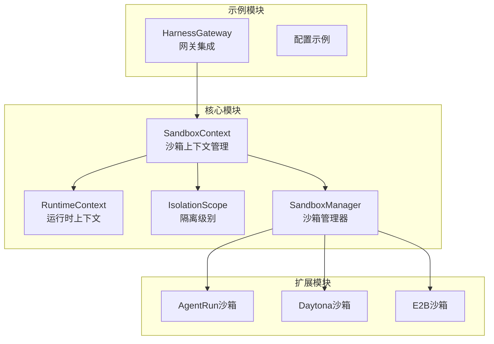
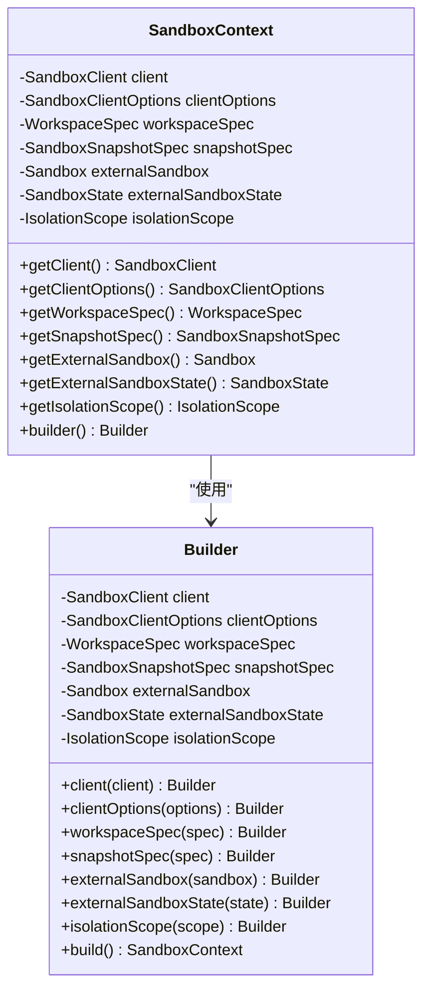
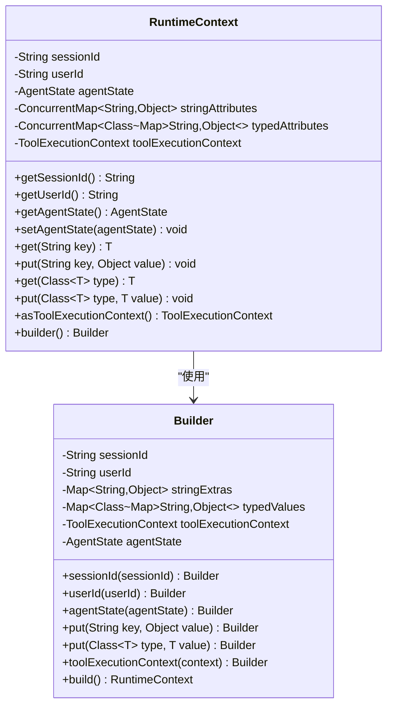
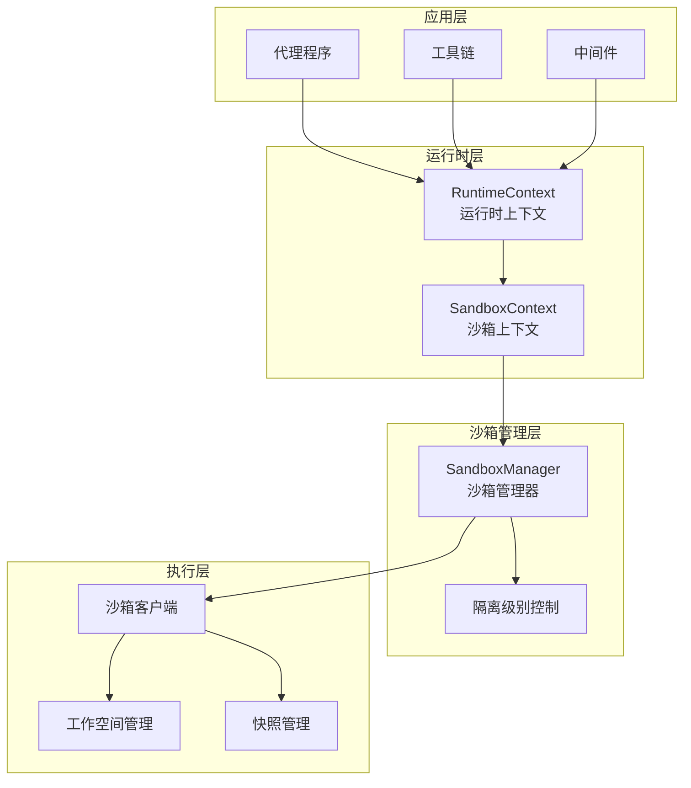
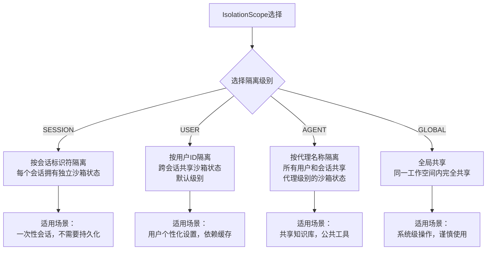
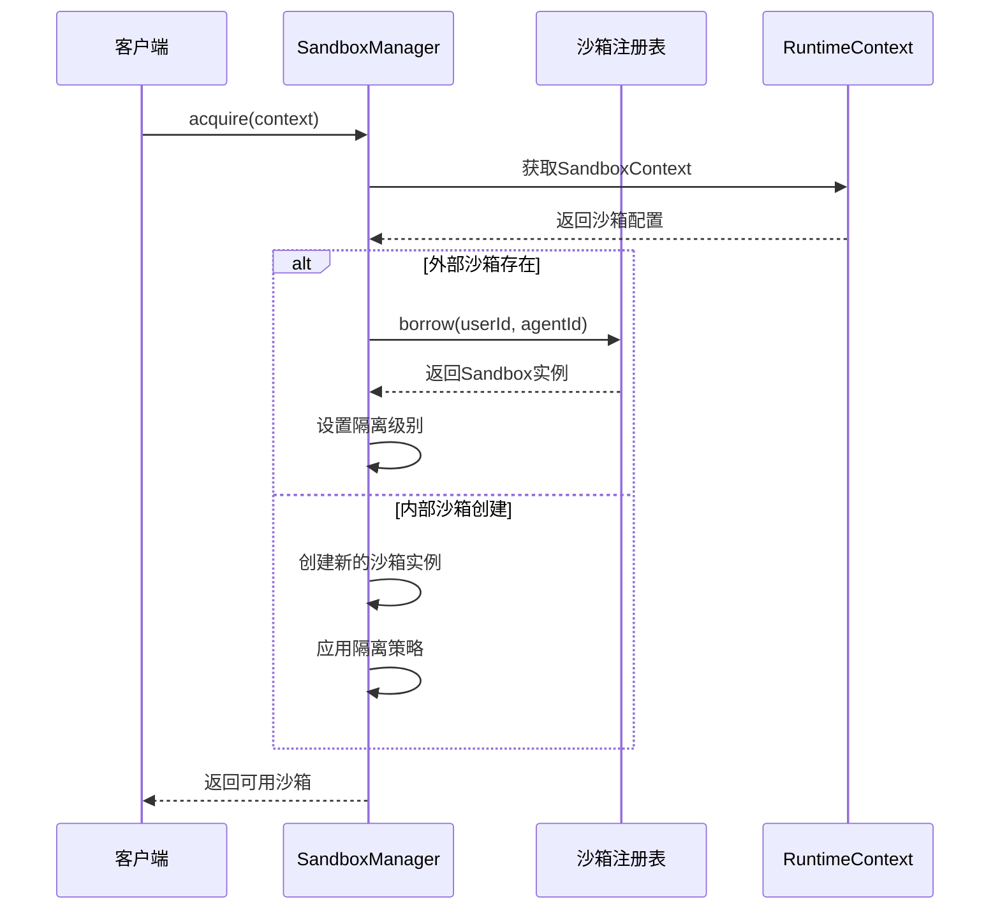
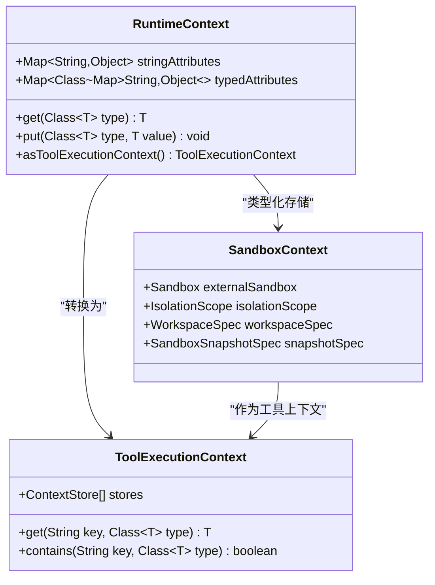
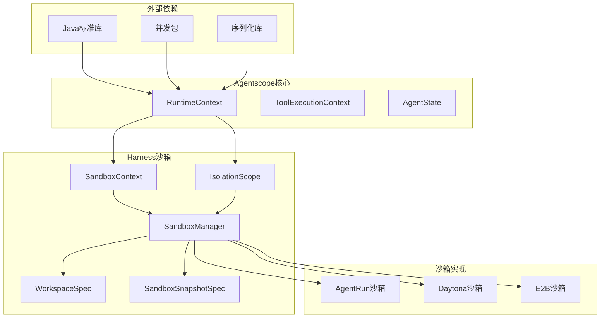

# Sandbox上下文管理

<cite>
**本文档引用的文件**
- [SandboxContext.java](file://agentscope-harness/src/main/java/io/agentscope/harness/agent/sandbox/SandboxContext.java)
- [RuntimeContext.java](file://agentscope-core/src/main/java/io/agentscope/core/agent/RuntimeContext.java)
- [IsolationScope.java](file://agentscope-harness/src/main/java/io/agentscope/harness/agent/IsolationScope.java)
- [SandboxManager.java](file://agentscope-harness/src/main/java/io/agentscope/harness/agent/sandbox/SandboxManager.java)
- [HarnessGateway.java](file://agentscope-examples/agents/agentscope-dataagent/src/main/java/io/agentscope/dataagent/runtime/gateway/HarnessGateway.java)
- [filesystem.md](file://docs/v2/zh/docs/harness/filesystem.md)
</cite>

## 目录
1. [简介](#简介)
2. [项目结构](#项目结构)
3. [核心组件](#核心组件)
4. [架构概览](#架构概览)
5. [详细组件分析](#详细组件分析)
6. [依赖关系分析](#依赖关系分析)
7. [性能考虑](#性能考虑)
8. [故障排除指南](#故障排除指南)
9. [结论](#结论)

## 简介

SandboxContext是Agentscope框架中用于管理沙箱环境上下文的核心组件。它负责在沙箱环境中传递运行时上下文信息，确保代理程序能够在隔离的执行环境中正确运行。

SandboxContext的主要设计目的是：
- 提供沙箱环境的配置和管理
- 支持多种隔离级别（用户级、会话级、代理级、全局级）
- 实现会话状态管理和用户身份验证
- 支持外部沙箱的集成和管理
- 提供快照和状态持久化机制

## 项目结构

Sandbox上下文管理涉及以下关键模块：

**图表来源**
- [SandboxContext.java:21-27](file://agentscope-harness/src/main/java/io/agentscope/harness/agent/sandbox/SandboxContext.java#L21-L27)
- [RuntimeContext.java:26-33](file://agentscope-core/src/main/java/io/agentscope/core/agent/RuntimeContext.java#L26-L33)
- [IsolationScope.java:23-53](file://agentscope-harness/src/main/java/io/agentscope/harness/agent/IsolationScope.java#L23-L53)

**章节来源**
- [SandboxContext.java:1-131](file://agentscope-harness/src/main/java/io/agentscope/harness/agent/sandbox/SandboxContext.java#L1-L131)
- [RuntimeContext.java:1-449](file://agentscope-core/src/main/java/io/agentscope/core/agent/RuntimeContext.java#L1-L449)

## 核心组件

### SandboxContext类分析

SandboxContext是一个不可变的配置类，用于定义沙箱行为的完整配置信息：

**图表来源**
- [SandboxContext.java:27-131](file://agentscope-harness/src/main/java/io/agentscope/harness/agent/sandbox/SandboxContext.java#L27-L131)

### RuntimeContext类分析

RuntimeContext是每个调用的元数据容器，包含会话范围的字段和线程安全的属性包：

**图表来源**
- [RuntimeContext.java:33-449](file://agentscope-core/src/main/java/io/agentscope/core/agent/RuntimeContext.java#L33-L449)

**章节来源**
- [SandboxContext.java:27-131](file://agentscope-harness/src/main/java/io/agentscope/harness/agent/sandbox/SandboxContext.java#L27-L131)
- [RuntimeContext.java:33-449](file://agentscope-core/src/main/java/io/agentscope/core/agent/RuntimeContext.java#L33-L449)

## 架构概览

Sandbox上下文管理系统采用分层架构设计，实现了沙箱环境的灵活配置和管理：

**图表来源**
- [SandboxContext.java:21-27](file://agentscope-harness/src/main/java/io/agentscope/harness/agent/sandbox/SandboxContext.java#L21-L27)
- [RuntimeContext.java:26-33](file://agentscope-core/src/main/java/io/agentscope/core/agent/RuntimeContext.java#L26-L33)
- [IsolationScope.java:23-53](file://agentscope-harness/src/main/java/io/agentscope/harness/agent/IsolationScope.java#L23-L53)

## 详细组件分析

### 隔离级别管理

IsolationScope定义了四种隔离级别，每种级别都有特定的使用场景和行为特征：

**图表来源**
- [IsolationScope.java:53-88](file://agentscope-harness/src/main/java/io/agentscope/harness/agent/IsolationScope.java#L53-L88)

### 沙箱生命周期管理

SandboxManager负责沙箱的创建、获取、销毁等生命周期管理：

**图表来源**
- [SandboxManager.java](file://agentscope-harness/src/main/java/io/agentscope/harness/agent/sandbox/SandboxManager.java)
- [HarnessGateway.java:498-527](file://agentscope-examples/agents/agentscope-dataagent/src/main/java/io/agentscope/dataagent/runtime/gateway/HarnessGateway.java#L498-L527)

### 上下文传递机制

RuntimeContext和SandboxContext之间的数据传递通过类型化属性系统实现：

**图表来源**
- [RuntimeContext.java:164-224](file://agentscope-core/src/main/java/io/agentscope/core/agent/RuntimeContext.java#L164-L224)
- [RuntimeContext.java:308-319](file://agentscope-core/src/main/java/io/agentscope/core/agent/RuntimeContext.java#L308-L319)

**章节来源**
- [IsolationScope.java:23-128](file://agentscope-harness/src/main/java/io/agentscope/harness/agent/IsolationScope.java#L23-L128)
- [SandboxManager.java](file://agentscope-harness/src/main/java/io/agentscope/harness/agent/sandbox/SandboxManager.java)
- [HarnessGateway.java:498-527](file://agentscope-examples/agents/agentscope-dataagent/src/main/java/io/agentscope/dataagent/runtime/gateway/HarnessGateway.java#L498-L527)

## 依赖关系分析

Sandbox上下文管理系统具有清晰的依赖层次结构：

**图表来源**
- [SandboxContext.java:18-20](file://agentscope-harness/src/main/java/io/agentscope/harness/agent/sandbox/SandboxContext.java#L18-L20)
- [RuntimeContext.java:18-25](file://agentscope-core/src/main/java/io/agentscope/core/agent/RuntimeContext.java#L18-L25)

**章节来源**
- [SandboxContext.java:1-131](file://agentscope-harness/src/main/java/io/agentscope/harness/agent/sandbox/SandboxContext.java#L1-L131)
- [RuntimeContext.java:1-449](file://agentscope-core/src/main/java/io/agentscope/core/agent/RuntimeContext.java#L1-L449)

## 性能考虑

### 并发处理策略

沙箱模式下的并发行为采用顺序复用共享机制：
- 同一隔离级别的并发调用各自启动独立容器
- 每次调用结束时，最后写入的快照胜出
- 对于多用户共享的AGNET/GLOBAL级别，建议使用执行守卫进行并发控制

### 内存管理优化

- 使用不可变配置对象减少内存占用
- 通过类型化属性系统避免不必要的对象创建
- 支持快照机制实现状态的增量保存

## 故障排除指南

### 常见问题及解决方案

1. **沙箱获取失败**
   - 检查外部沙箱注册表配置
   - 验证用户ID和代理ID的有效性
   - 查看沙箱客户端连接状态

2. **隔离级别异常**
   - 确认IsolationScope的正确配置
   - 检查RuntimeContext中的用户ID和会话ID
   - 验证沙箱状态的持久化机制

3. **上下文传递错误**
   - 确保SandboxContext正确添加到RuntimeContext
   - 检查类型化属性的序列化配置
   - 验证工具执行上下文的构建过程

**章节来源**
- [filesystem.md:386-424](file://docs/v2/zh/docs/harness/filesystem.md#L386-L424)

## 结论

SandboxContext为Agentscope框架提供了完整的沙箱环境上下文管理能力。通过精心设计的架构，它实现了：

- **灵活的隔离策略**：支持多种隔离级别满足不同业务需求
- **高效的上下文传递**：通过类型化属性系统实现轻量级的数据传递
- **可靠的生命周期管理**：完善的沙箱创建、获取、销毁流程
- **良好的扩展性**：支持多种沙箱实现和自定义配置

该系统的设计充分考虑了生产环境的需求，在保证功能完整性的同时，也注重了性能和可靠性。通过合理的配置和使用，可以为代理程序提供安全、隔离的执行环境。