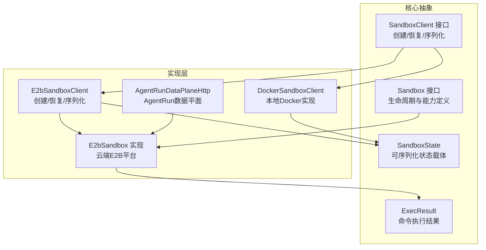
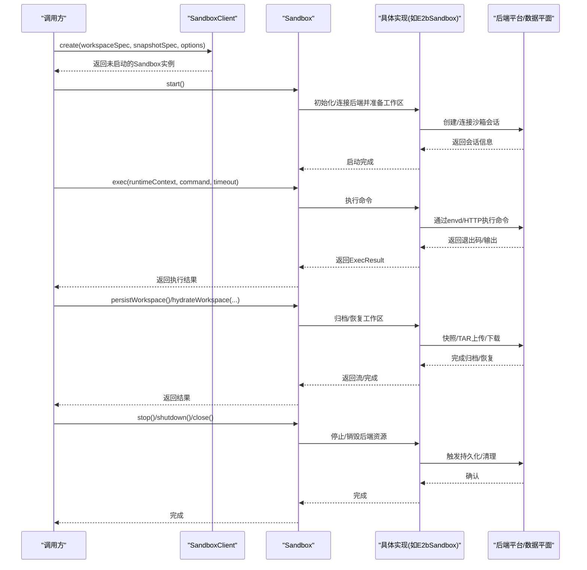
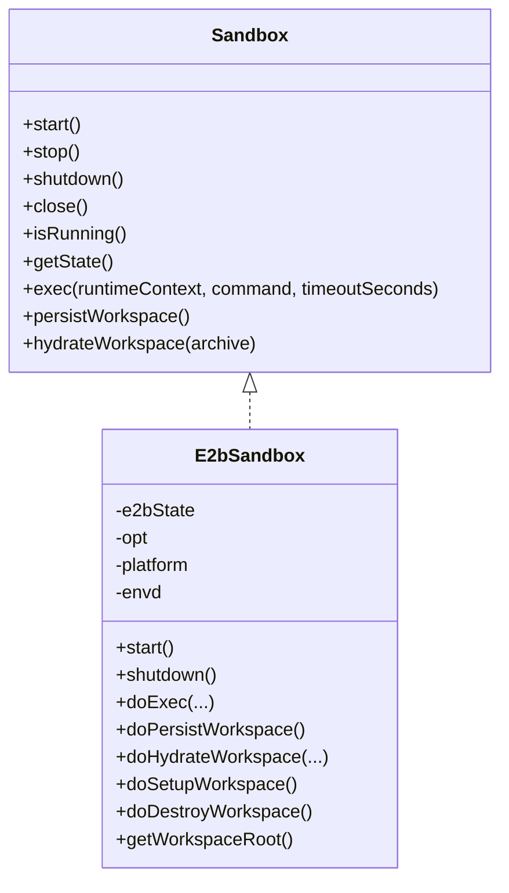
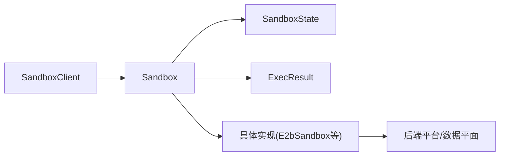

# Sandbox接口

<cite>
**本文档引用的文件**
- [Sandbox.java](file://agentscope-harness/src/main/java/io/agentscope/harness/agent/sandbox/Sandbox.java)
- [SandboxClient.java](file://agentscope-harness/src/main/java/io/agentscope/harness/agent/sandbox/SandboxClient.java)
- [SandboxState.java](file://agentscope-harness/src/main/java/io/agentscope/harness/agent/sandbox/SandboxState.java)
- [ExecResult.java](file://agentscope-harness/src/main/java/io/agentscope/harness/agent/sandbox/ExecResult.java)
- [E2bSandbox.java](file://agentscope-extensions/agentscope-extensions-sandbox/agentscope-extensions-sandbox-e2b/src/main/java/io/agentscope/extensions/sandbox/e2b/E2bSandbox.java)
- [E2bSandboxClient.java](file://agentscope-extensions/agentscope-extensions-sandbox/agentscope-extensions-sandbox-e2b/src/main/java/io/agentscope/extensions/sandbox/e2b/E2bSandboxClient.java)
- [DockerSandboxClient.java](file://agentscope-harness/src/main/java/io/agentscope/harness/agent/sandbox/impl/docker/DockerSandboxClient.java)
- [AgentRunDataPlaneHttp.java](file://agentscope-extensions/agentscope-extensions-sandbox/agentscope-extensions-sandbox-agentrun/src/main/java/io/agentscope/extensions/sandbox/agentrun/AgentRunDataPlaneHttp.java)
</cite>

## 目录
1. [简介](#简介)
2. [项目结构](#项目结构)
3. [核心组件](#核心组件)
4. [架构总览](#架构总览)
5. [详细组件分析](#详细组件分析)
6. [依赖关系分析](#依赖关系分析)
7. [性能考虑](#性能考虑)
8. [故障排除指南](#故障排除指南)
9. [结论](#结论)

## 简介
本文件为Sandbox接口的详细API文档，覆盖以下方面：
- 核心方法：生命周期管理（start、stop、shutdown、close）、状态查询（isRunning、getState）、命令执行（exec）、工作区操作（persistWorkspace、hydrateWorkspace）
- 方法参数、返回值、异常处理与典型使用场景
- 沙箱生命周期的完整流程：创建、启动、运行、停止、销毁
- 基于仓库中具体实现的示例路径，展示如何正确使用Sandbox接口进行安全的命令执行与工作区管理

## 项目结构
Sandbox接口位于agentscope-harness模块中，作为统一抽象；具体实现分布在多个扩展模块中（如e2b云沙箱、Docker本地沙箱、AgentRun数据平面等）。下图展示了关键文件在项目中的位置与职责：

图表来源
- [Sandbox.java:42-77](file://agentscope-harness/src/main/java/io/agentscope/harness/agent/sandbox/Sandbox.java#L42-L77)
- [SandboxClient.java:25-44](file://agentscope-harness/src/main/java/io/agentscope/harness/agent/sandbox/SandboxClient.java#L25-L44)
- [SandboxState.java:34-85](file://agentscope-harness/src/main/java/io/agentscope/harness/agent/sandbox/SandboxState.java#L34-L85)
- [ExecResult.java:18-50](file://agentscope-harness/src/main/java/io/agentscope/harness/agent/sandbox/ExecResult.java#L18-L50)
- [E2bSandbox.java:40-241](file://agentscope-extensions/agentscope-extensions-sandbox/agentscope-extensions-sandbox-e2b/src/main/java/io/agentscope/extensions/sandbox/e2b/E2bSandbox.java#L40-L241)
- [E2bSandboxClient.java:54-113](file://agentscope-extensions/agentscope-extensions-sandbox/agentscope-extensions-sandbox-e2b/src/main/java/io/agentscope/extensions/sandbox/e2b/E2bSandboxClient.java#L54-L113)
- [DockerSandboxClient.java:92-133](file://agentscope-harness/src/main/java/io/agentscope/harness/agent/sandbox/impl/docker/DockerSandboxClient.java#L92-L133)
- [AgentRunDataPlaneHttp.java:96-119](file://agentscope-extensions/agentscope-extensions-sandbox/agentscope-extensions-sandbox-agentrun/src/main/java/io/agentscope/extensions/sandbox/agentrun/AgentRunDataPlaneHttp.java#L96-L119)

章节来源
- [Sandbox.java:42-77](file://agentscope-harness/src/main/java/io/agentscope/harness/agent/sandbox/Sandbox.java#L42-L77)
- [SandboxClient.java:25-44](file://agentscope-harness/src/main/java/io/agentscope/harness/agent/sandbox/SandboxClient.java#L25-L44)
- [SandboxState.java:34-85](file://agentscope-harness/src/main/java/io/agentscope/harness/agent/sandbox/SandboxState.java#L34-L85)
- [ExecResult.java:18-50](file://agentscope-harness/src/main/java/io/agentscope/harness/agent/sandbox/ExecResult.java#L18-L50)

## 核心组件
本节对Sandbox接口及其相关类型进行逐项说明，包括方法签名、语义、参数与返回值、异常处理与使用场景。

- 生命周期管理
  - start(): 初始化或恢复工作区，准备执行环境。抛出异常时需确保调用方妥善处理。
  - stop(): 持久化快照（不销毁后端资源），适合自管/托管沙箱的安全停机。
  - shutdown(): 销毁后端资源（如容器、临时目录），仅用于自管沙箱。
  - close(): 默认顺序为先stop再shutdown，随后释放资源；建议在try-with-resources中使用以保证清理。

- 状态查询
  - isRunning(): 返回当前沙箱是否处于运行态。
  - getState(): 返回可序列化的SandboxState，便于后续恢复或持久化。

- 命令执行
  - exec(runtimeContext, command, timeoutSeconds): 在沙箱工作区内执行shell命令，返回ExecResult。支持传入运行上下文与超时秒数（null表示实现默认）。

- 工作区操作
  - persistWorkspace(): 将工作区打包为输入流，便于外部存储或传输。
  - hydrateWorkspace(archive): 从归档流恢复工作区，支持原生快照或tar归档。

章节来源
- [Sandbox.java:42-77](file://agentscope-harness/src/main/java/io/agentscope/harness/agent/sandbox/Sandbox.java#L42-L77)
- [ExecResult.java:26-49](file://agentscope-harness/src/main/java/io/agentscope/harness/agent/sandbox/ExecResult.java#L26-L49)

## 架构总览
Sandbox接口定义了统一的能力边界，具体实现由SandboxClient负责创建与恢复，并通过SandboxState承载可序列化状态。不同后端（如E2B云沙箱、Docker本地沙箱、AgentRun数据平面）提供各自的实现细节。

图表来源
- [Sandbox.java:42-77](file://agentscope-harness/src/main/java/io/agentscope/harness/agent/sandbox/Sandbox.java#L42-L77)
- [SandboxClient.java:25-44](file://agentscope-harness/src/main/java/io/agentscope/harness/agent/sandbox/SandboxClient.java#L25-L44)
- [E2bSandbox.java:60-196](file://agentscope-extensions/agentscope-extensions-sandbox/agentscope-extensions-sandbox-e2b/src/main/java/io/agentscope/extensions/sandbox/e2b/E2bSandbox.java#L60-L196)
- [AgentRunDataPlaneHttp.java:96-119](file://agentscope-extensions/agentscope-extensions-sandbox/agentscope-extensions-sandbox-agentrun/src/main/java/io/agentscope/extensions/sandbox/agentrun/AgentRunDataPlaneHttp.java#L96-L119)

## 详细组件分析

### Sandbox接口
- 能力边界
  - 生命周期：start/stop/shutdown/close
  - 查询：isRunning/getState
  - 执行：exec
  - 工作区：persistWorkspace/hydrateWorkspace
- 设计要点
  - 明确区分stop与shutdown：前者仅持久化，后者销毁后端资源
  - close默认顺序：stop → shutdown，便于资源回收
  - exec支持运行上下文与超时控制，提升安全性与可控性

章节来源
- [Sandbox.java:21-77](file://agentscope-harness/src/main/java/io/agentscope/harness/agent/sandbox/Sandbox.java#L21-L77)

### SandboxClient接口
- create：根据工作区规格与快照规格创建新沙箱（预启动状态）
- resume：从已序列化的SandboxState恢复沙箱
- delete：删除沙箱（实现可选择是否清理）
- serializeState/deserializeState：状态序列化与反序列化

章节来源
- [SandboxClient.java:25-44](file://agentscope-harness/src/main/java/io/agentscope/harness/agent/sandbox/SandboxClient.java#L25-L44)

### SandboxState
- 字段
  - sessionId：会话标识
  - workspaceSpec：工作区规格
  - snapshot：沙盒快照
  - workspaceProjectionHash：工作区投影哈希
  - workspaceRootReady：工作区根是否就绪
- 用途：承载可序列化状态，用于恢复与持久化

章节来源
- [SandboxState.java:34-85](file://agentscope-harness/src/main/java/io/agentscope/harness/agent/sandbox/SandboxState.java#L34-L85)

### ExecResult
- 字段：exitCode、stdout、stderr、truncated
- 方法：ok()判断成功、combinedOutput()合并输出
- 语义：标准化命令执行结果，便于上层处理

章节来源
- [ExecResult.java:26-49](file://agentscope-harness/src/main/java/io/agentscope/harness/agent/sandbox/ExecResult.java#L26-L49)

### E2bSandbox实现
- 启动流程：ensureSandbox负责创建或重连沙箱，必要时重建并应用默认域
- 命令执行：doExec委托envd客户端执行shell命令
- 工作区持久化：支持原生快照与tar归档两种模式
- 工作区恢复：识别原生快照ID或按tar流进行解包
- 资源销毁：shutdown仅在沙箱被拥有时调用后端终止

图表来源
- [Sandbox.java:42-77](file://agentscope-harness/src/main/java/io/agentscope/harness/agent/sandbox/Sandbox.java#L42-L77)
- [E2bSandbox.java:40-241](file://agentscope-extensions/agentscope-extensions-sandbox/agentscope-extensions-sandbox-e2b/src/main/java/io/agentscope/extensions/sandbox/e2b/E2bSandbox.java#L40-L241)

章节来源
- [E2bSandbox.java:60-196](file://agentscope-extensions/agentscope-extensions-sandbox/agentscope-extensions-sandbox-e2b/src/main/java/io/agentscope/extensions/sandbox/e2b/E2bSandbox.java#L60-L196)
- [E2bSandbox.java:87-142](file://agentscope-extensions/agentscope-extensions-sandbox/agentscope-extensions-sandbox-e2b/src/main/java/io/agentscope/extensions/sandbox/e2b/E2bSandbox.java#L87-L142)
- [E2bSandbox.java:144-164](file://agentscope-extensions/agentscope-extensions-sandbox/agentscope-extensions-sandbox-e2b/src/main/java/io/agentscope/extensions/sandbox/e2b/E2bSandbox.java#L144-L164)

### E2bSandboxClient
- create：生成sessionId，填充状态字段（模板ID、工作区根、持久化模式、编解码器、域），可选构建快照
- resume：校验状态类型，合并配置并构造实现
- serializeState/deserializeState：基于ObjectMapper进行JSON序列化/反序列化
- delete：空实现（清理交由实现类）

章节来源
- [E2bSandboxClient.java:54-113](file://agentscope-extensions/agentscope-extensions-sandbox/agentscope-extensions-sandbox-e2b/src/main/java/io/agentscope/extensions/sandbox/e2b/E2bSandboxClient.java#L54-L113)

### DockerSandboxClient
- create：创建DockerSandbox实例并记录日志
- resume：校验状态类型并恢复
- serializeState/deserializeState：JSON序列化/反序列化
- delete：空实现（清理交由DockerSandbox.shutdown）

章节来源
- [DockerSandboxClient.java:92-133](file://agentscope-harness/src/main/java/io/agentscope/harness/agent/sandbox/impl/docker/DockerSandboxClient.java#L92-L133)

### AgentRun数据平面交互
- 删除沙箱：deleteSandbox在非2xx且非404时抛出SandboxRuntimeException，错误码WORKSPACE_STOP_ERROR

章节来源
- [AgentRunDataPlaneHttp.java:109-119](file://agentscope-extensions/agentscope-extensions-sandbox/agentscope-extensions-sandbox-agentrun/src/main/java/io/agentscope/extensions/sandbox/agentrun/AgentRunDataPlaneHttp.java#L109-L119)

## 依赖关系分析
- Sandbox接口是统一抽象，具体实现类（如E2bSandbox）依赖其状态对象（SandboxState）与后端平台（E2B/AgentRun/Docker）
- SandboxClient负责创建与恢复，将抽象与实现解耦
- ExecResult为跨实现的统一结果载体

图表来源
- [Sandbox.java:42-77](file://agentscope-harness/src/main/java/io/agentscope/harness/agent/sandbox/Sandbox.java#L42-L77)
- [SandboxClient.java:25-44](file://agentscope-harness/src/main/java/io/agentscope/harness/agent/sandbox/SandboxClient.java#L25-L44)
- [SandboxState.java:34-85](file://agentscope-harness/src/main/java/io/agentscope/harness/agent/sandbox/SandboxState.java#L34-L85)
- [ExecResult.java:26-49](file://agentscope-harness/src/main/java/io/agentscope/harness/agent/sandbox/ExecResult.java#L26-L49)
- [E2bSandbox.java:40-241](file://agentscope-extensions/agentscope-extensions-sandbox/agentscope-extensions-sandbox-e2b/src/main/java/io/agentscope/extensions/sandbox/e2b/E2bSandbox.java#L40-L241)

## 性能考虑
- 命令执行超时：exec支持timeoutSeconds，避免长时间阻塞
- 工作区归档：E2bSandbox支持原生快照与tar归档，原生快照通常更高效
- 输出截断：ExecResult提供truncated标记，便于上层控制输出大小
- 连接复用：E2bSandbox内部对envd客户端采用延迟初始化与同步块保护，减少重复创建开销

## 故障排除指南
- 启动失败重试：E2bSandbox在连接失败时会尝试重建沙箱并重置工作区就绪标志
- 删除沙箱异常：AgentRun数据平面删除非2xx且非404时抛出SandboxRuntimeException，错误码为WORKSPACE_STOP_ERROR
- 关闭/销毁条件：E2bSandbox的shutdown仅在沙箱被拥有时才调用后端终止
- 序列化异常：SandboxClient在序列化/反序列化状态时捕获异常并包装为SandboxConfigurationException

章节来源
- [E2bSandbox.java:181-194](file://agentscope-extensions/agentscope-extensions-sandbox/agentscope-extensions-sandbox-e2b/src/main/java/io/agentscope/extensions/sandbox/e2b/E2bSandbox.java#L181-L194)
- [AgentRunDataPlaneHttp.java:113-117](file://agentscope-extensions/agentscope-extensions-sandbox/agentscope-extensions-sandbox-agentrun/src/main/java/io/agentscope/extensions/sandbox/agentrun/AgentRunDataPlaneHttp.java#L113-L117)
- [E2bSandbox.java:71-79](file://agentscope-extensions/agentscope-extensions-sandbox/agentscope-extensions-sandbox-e2b/src/main/java/io/agentscope/extensions/sandbox/e2b/E2bSandbox.java#L71-L79)
- [E2bSandboxClient.java:96-113](file://agentscope-extensions/agentscope-extensions-sandbox/agentscope-extensions-sandbox-e2b/src/main/java/io/agentscope/extensions/sandbox/e2b/E2bSandboxClient.java#L96-L113)

## 结论
Sandbox接口提供了统一的沙箱生命周期与能力边界，结合SandboxClient与SandboxState实现了可插拔的多后端实现。通过明确的start/stop/shutdown/close语义与标准的ExecResult，开发者可以在不同环境中安全地执行命令与管理工作区。推荐在生产中：
- 使用try-with-resources确保close正确调用
- 对长耗时命令设置合理超时
- 优先使用原生快照以提升工作区归档/恢复效率
- 对序列化状态进行容错处理与版本兼容性管理