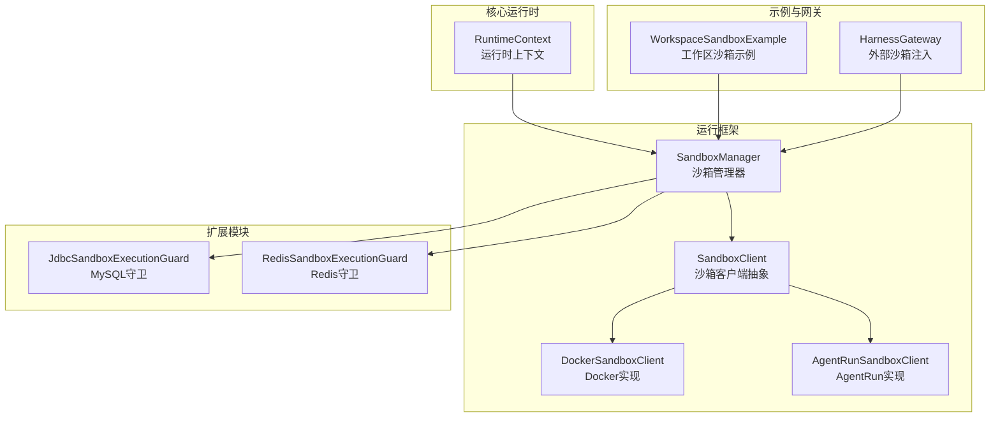
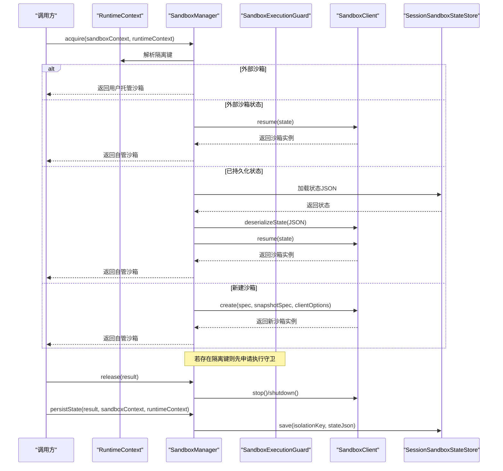
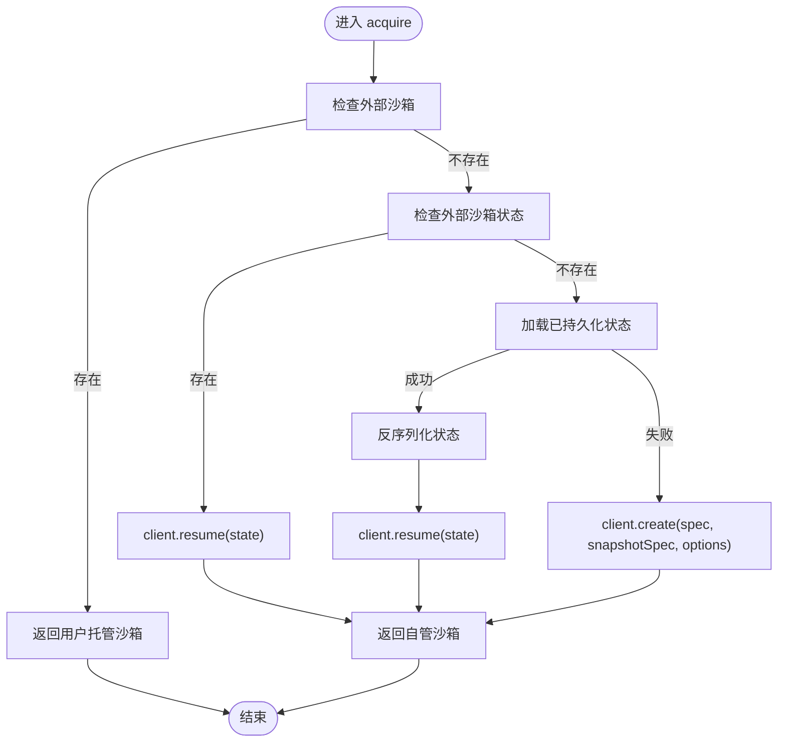
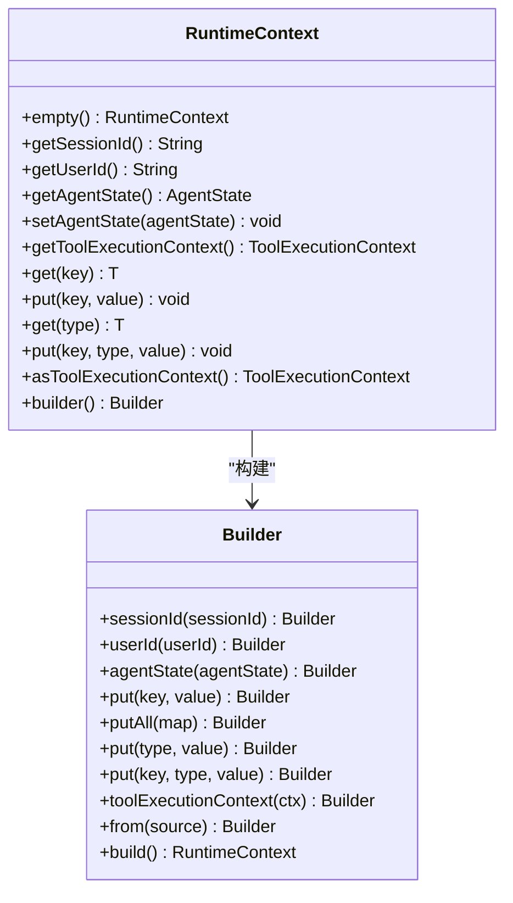
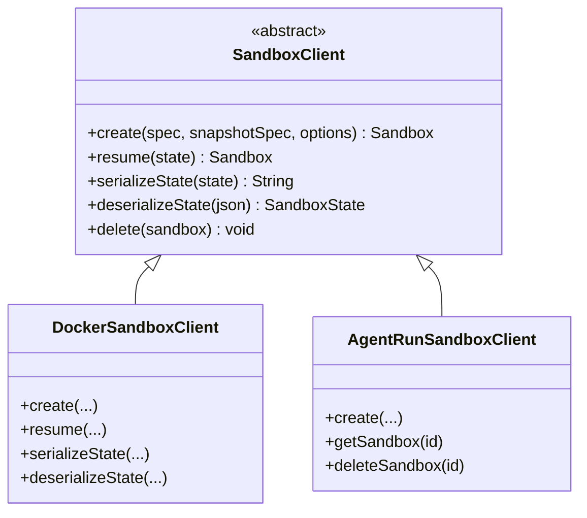
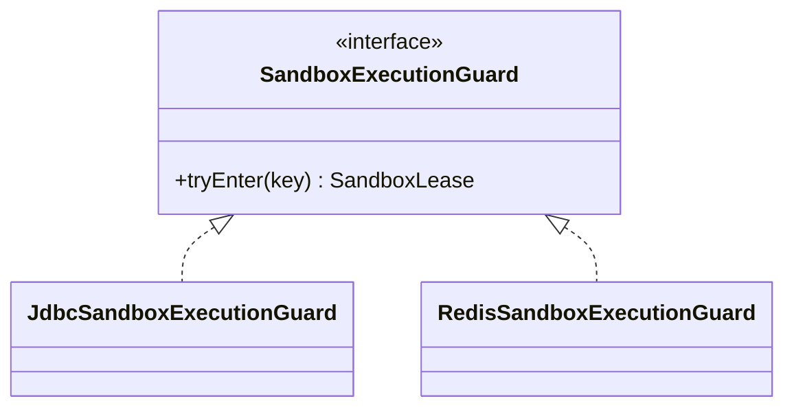
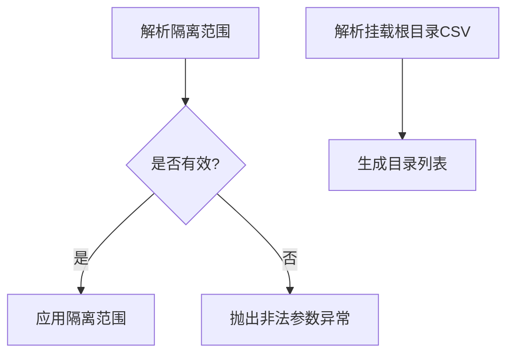
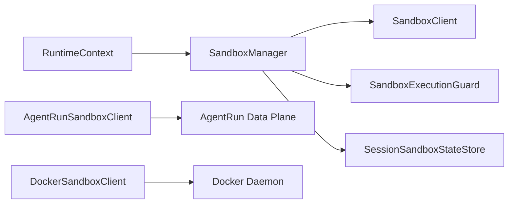

# Sandbox沙箱API

<cite>
**本文引用的文件**
- [SandboxManager.java](file://agentscope-harness/src/main/java/io/agentscope/harness/agent/sandbox/SandboxManager.java)
- [RuntimeContext.java](file://agentscope-core/src/main/java/io/agentscope/core/agent/RuntimeContext.java)
- [WorkspaceSandboxExample.java](file://agentscope-examples/documentation/src/main/java/io/agentscope/examples/documentation2/harness/workspace/WorkspaceSandboxExample.java)
- [DockerSandboxClient.java](file://agentscope-harness/src/main/java/io/agentscope/harness/agent/sandbox/impl/docker/DockerSandboxClient.java)
- [AgentRunSandboxClient.java](file://agentscope-extensions/agentscope-extensions-sandbox/agentscope-extensions-sandbox-agentrun/src/main/java/io/agentscope/extensions/sandbox/agentrun/AgentRunSandboxClient.java)
- [AgentRunSandboxClientOptions.java](file://agentscope-extensions/agentscope-extensions-sandbox/agentscope-extensions-sandbox-agentrun/src/main/java/io/agentscope/extensions/sandbox/agentrun/AgentRunSandboxClientOptions.java)
- [AgentRunDataPlaneHttp.java](file://agentscope-extensions/agentscope-extensions-sandbox/agentscope-extensions-sandbox-agentrun/src/main/java/io/agentscope/extensions/sandbox/agentrun/AgentRunDataPlaneHttp.java)
- [JdbcSandboxExecutionGuard.java](file://agentscope-extensions/agentscope-extensions-mysql/src/main/java/io/agentscope/extensions/mysql/sandbox/JdbcSandboxExecutionGuard.java)
- [RedisSandboxExecutionGuard.java](file://agentscope-extensions/agentscope-extensions-redis/src/main/java/io/agentscope/extensions/redis/sandbox/RedisSandboxExecutionGuard.java)
- [BuilderSandboxConfig.java](file://agentscope-examples/agents/agentscope-paw/src/main/java/io/agentscope/claw2/web/config/BuilderSandboxConfig.java)
- [HarnessGateway.java](file://agentscope-examples/agents/agentscope-dataagent/src/main/java/io/agentscope/dataagent/runtime/gateway/HarnessGateway.java)
</cite>

## 目录
1. [简介](#简介)
2. [项目结构](#项目结构)
3. [核心组件](#核心组件)
4. [架构总览](#架构总览)
5. [详细组件分析](#详细组件分析)
6. [依赖分析](#依赖分析)
7. [性能考虑](#性能考虑)
8. [故障排查指南](#故障排查指南)
9. [结论](#结论)
10. [附录：示例与最佳实践](#附录示例与最佳实践)

## 简介
本文件为Sandbox沙箱系统的详细API参考文档，覆盖沙箱生命周期管理、执行保护机制、上下文管理（SandboxContext与RuntimeContext）、隔离策略、资源限制与安全控制接口、配置项、性能监控与故障恢复等主题，并通过实际示例展示如何在Agent运行时中安全地创建与使用沙箱。

## 项目结构
Sandbox能力由核心运行时（agentscope-core）与运行框架（agentscope-harness）共同提供，同时通过扩展模块（agentscope-extensions）支持多种后端实现（如Docker、AgentRun、Daytona、E2B等），并提供针对不同存储后端的安全守卫（ExecutionGuard）以实现跨调用状态持久化与并发隔离。

**图示来源**
- [SandboxManager.java:40-229](file://agentscope-harness/src/main/java/io/agentscope/harness/agent/sandbox/SandboxManager.java#L40-L229)
- [RuntimeContext.java:33-449](file://agentscope-core/src/main/java/io/agentscope/core/agent/RuntimeContext.java#L33-L449)
- [DockerSandboxClient.java:92-133](file://agentscope-harness/src/main/java/io/agentscope/harness/agent/sandbox/impl/docker/DockerSandboxClient.java#L92-L133)
- [AgentRunSandboxClient.java](file://agentscope-extensions/agentscope-extensions-sandbox/agentscope-extensions-sandbox-agentrun/src/main/java/io/agentscope/extensions/sandbox/agentrun/AgentRunSandboxClient.java)
- [JdbcSandboxExecutionGuard.java](file://agentscope-extensions/agentscope-extensions-mysql/src/main/java/io/agentscope/extensions/mysql/sandbox/JdbcSandboxExecutionGuard.java)
- [RedisSandboxExecutionGuard.java](file://agentscope-extensions/agentscope-extensions-redis/src/main/java/io/agentscope/extensions/redis/sandbox/RedisSandboxExecutionGuard.java)
- [WorkspaceSandboxExample.java:73-167](file://agentscope-examples/documentation/src/main/java/io/agentscope/examples/documentation2/harness/workspace/WorkspaceSandboxExample.java#L73-L167)
- [HarnessGateway.java:498-527](file://agentscope-examples/agents/agentscope-dataagent/src/main/java/io/agentscope/dataagent/runtime/gateway/HarnessGateway.java#L498-L527)

**章节来源**
- [SandboxManager.java:40-229](file://agentscope-harness/src/main/java/io/agentscope/harness/agent/sandbox/SandboxManager.java#L40-L229)
- [RuntimeContext.java:33-449](file://agentscope-core/src/main/java/io/agentscope/core/agent/RuntimeContext.java#L33-L449)

## 核心组件
- SandboxManager：负责沙箱实例的获取、释放、状态持久化与清理；根据隔离范围与优先级路径选择沙箱来源；在需要时申请执行守卫（lease）确保并发隔离。
- RuntimeContext：单次调用的运行时上下文，承载会话ID、用户ID、工具执行上下文以及类型化/字符串键值属性，用于向沙箱与工具传递运行期元数据。
- SandboxClient族：抽象沙箱客户端接口，具体实现（如Docker、AgentRun）负责创建、恢复、序列化/反序列化沙箱状态。
- ExecutionGuard族：在分布式或高并发场景下对同一隔离键进行互斥/排队控制，保障跨调用一致性与隔离性。
- 配置与示例：BuilderSandboxConfig解析隔离范围与挂载根目录；WorkspaceSandboxExample演示Docker沙箱的工作流；HarnessGateway可将外部沙箱注入到RuntimeContext。

**章节来源**
- [SandboxManager.java:40-229](file://agentscope-harness/src/main/java/io/agentscope/harness/agent/sandbox/SandboxManager.java#L40-L229)
- [RuntimeContext.java:33-449](file://agentscope-core/src/main/java/io/agentscope/core/agent/RuntimeContext.java#L33-L449)
- [DockerSandboxClient.java:92-133](file://agentscope-harness/src/main/java/io/agentscope/harness/agent/sandbox/impl/docker/DockerSandboxClient.java#L92-L133)
- [AgentRunSandboxClientOptions.java:60-86](file://agentscope-extensions/agentscope-extensions-sandbox/agentscope-extensions-sandbox-agentrun/src/main/java/io/agentscope/extensions/sandbox/agentrun/AgentRunSandboxClientOptions.java#L60-L86)
- [BuilderSandboxConfig.java:117-139](file://agentscope-examples/agents/agentscope-paw/src/main/java/io/agentscope/claw2/web/config/BuilderSandboxConfig.java#L117-L139)
- [WorkspaceSandboxExample.java:73-167](file://agentscope-examples/documentation/src/main/java/io/agentscope/examples/documentation2/harness/workspace/WorkspaceSandboxExample.java#L73-L167)
- [HarnessGateway.java:498-527](file://agentscope-examples/agents/agentscope-dataagent/src/main/java/io/agentscope/dataagent/runtime/gateway/HarnessGateway.java#L498-L527)

## 架构总览
Sandbox体系围绕“运行时上下文 + 沙箱管理器 + 客户端实现 + 执行守卫”的分层设计展开。调用流程从RuntimeContext出发，经由SandboxManager按优先级路径获取沙箱，必要时通过ExecutionGuard进行并发控制，最终在调用结束后完成沙箱停止与状态持久化。

**图示来源**
- [SandboxManager.java:66-210](file://agentscope-harness/src/main/java/io/agentscope/harness/agent/sandbox/SandboxManager.java#L66-L210)

## 详细组件分析

### SandboxManager（沙箱管理器）
- 职责
  - 按优先级路径获取沙箱：外部沙箱 > 外部沙箱状态 > 已持久化状态 > 新建沙箱
  - 在存在隔离键时申请执行守卫（lease），确保并发隔离
  - 释放沙箱时调用stop/shutdown
  - 将沙箱状态序列化并写入会话状态存储
  - 清理指定隔离键下的持久化状态
- 关键方法
  - acquire：获取沙箱实例与执行守卫
  - release：停止并关闭沙箱
  - persistState：保存沙箱状态
  - clearState：删除沙箱状态
- 并发与隔离
  - 通过SandboxExecutionGuard的tryEnter返回的lease在完整调用窗口内生效
  - 用户托管沙箱不进行持久化与关闭，避免破坏外部生命周期

**图示来源**
- [SandboxManager.java:66-140](file://agentscope-harness/src/main/java/io/agentscope/harness/agent/sandbox/SandboxManager.java#L66-L140)

**章节来源**
- [SandboxManager.java:40-229](file://agentscope-harness/src/main/java/io/agentscope/harness/agent/sandbox/SandboxManager.java#L40-L229)

### RuntimeContext（运行时上下文）
- 角色
  - 单次调用的上下文容器，携带会话ID、用户ID、工具执行上下文与类型化/字符串键值属性
  - 提供类型安全的属性访问与合并为工具执行上下文的能力
- 关键点
  - 支持线程安全的并发访问
  - 可作为工具栈的最高优先级存储源
  - 与SandboxManager配合解析隔离键

**图示来源**
- [RuntimeContext.java:33-449](file://agentscope-core/src/main/java/io/agentscope/core/agent/RuntimeContext.java#L33-L449)

**章节来源**
- [RuntimeContext.java:33-449](file://agentscope-core/src/main/java/io/agentscope/core/agent/RuntimeContext.java#L33-L449)

### SandboxClient族（沙箱客户端）
- DockerSandboxClient
  - 创建/恢复沙箱，序列化/反序列化状态
  - 异常处理：序列化/反序列化失败抛出配置异常
- AgentRunSandboxClient
  - 基于AgentRun数据平面的沙箱生命周期操作（创建、查询、删除）
  - 通过重试机制提升可靠性

**图示来源**
- [DockerSandboxClient.java:92-133](file://agentscope-harness/src/main/java/io/agentscope/harness/agent/sandbox/impl/docker/DockerSandboxClient.java#L92-L133)
- [AgentRunSandboxClient.java](file://agentscope-extensions/agentscope-extensions-sandbox/agentscope-extensions-sandbox-agentrun/src/main/java/io/agentscope/extensions/sandbox/agentrun/AgentRunSandboxClient.java)

**章节来源**
- [DockerSandboxClient.java:92-133](file://agentscope-harness/src/main/java/io/agentscope/harness/agent/sandbox/impl/docker/DockerSandboxClient.java#L92-L133)
- [AgentRunSandboxClient.java](file://agentscope-extensions/agentscope-extensions-sandbox/agentscope-extensions-sandbox-agentrun/src/main/java/io/agentscope/extensions/sandbox/agentrun/AgentRunSandboxClient.java)

### ExecutionGuard族（执行守卫）
- JdbcSandboxExecutionGuard
  - 基于数据库的执行守卫实现，用于跨节点隔离
- RedisSandboxExecutionGuard
  - 基于Redis的执行守卫实现，适合分布式部署

**图示来源**
- [JdbcSandboxExecutionGuard.java](file://agentscope-extensions/agentscope-extensions-mysql/src/main/java/io/agentscope/extensions/mysql/sandbox/JdbcSandboxExecutionGuard.java)
- [RedisSandboxExecutionGuard.java](file://agentscope-extensions/agentscope-extensions-redis/src/main/java/io/agentscope/extensions/redis/sandbox/RedisSandboxExecutionGuard.java)

**章节来源**
- [JdbcSandboxExecutionGuard.java](file://agentscope-extensions/agentscope-extensions-mysql/src/main/java/io/agentscope/extensions/mysql/sandbox/JdbcSandboxExecutionGuard.java)
- [RedisSandboxExecutionGuard.java](file://agentscope-extensions/agentscope-extensions-redis/src/main/java/io/agentscope/extensions/redis/sandbox/RedisSandboxExecutionGuard.java)

### 配置与隔离策略
- BuilderSandboxConfig
  - 解析隔离范围（SESSION/USER/AGENT/GLOBAL）
  - 解析挂载根目录列表
- WorkspaceSandboxExample
  - 展示Docker沙箱的文件系统模式与跨调用持久化
  - 使用IsolationScope.USER实现用户级隔离
- HarnessGateway
  - 将外部沙箱注入RuntimeContext，使后续调用复用同一容器

**图示来源**
- [BuilderSandboxConfig.java:117-139](file://agentscope-examples/agents/agentscope-paw/src/main/java/io/agentscope/claw2/web/config/BuilderSandboxConfig.java#L117-L139)
- [WorkspaceSandboxExample.java:73-167](file://agentscope-examples/documentation/src/main/java/io/agentscope/examples/documentation2/harness/workspace/WorkspaceSandboxExample.java#L73-L167)
- [HarnessGateway.java:498-527](file://agentscope-examples/agents/agentscope-dataagent/src/main/java/io/agentscope/dataagent/runtime/gateway/HarnessGateway.java#L498-L527)

**章节来源**
- [BuilderSandboxConfig.java:117-139](file://agentscope-examples/agents/agentscope-paw/src/main/java/io/agentscope/claw2/web/config/BuilderSandboxConfig.java#L117-L139)
- [WorkspaceSandboxExample.java:73-167](file://agentscope-examples/documentation/src/main/java/io/agentscope/examples/documentation2/harness/workspace/WorkspaceSandboxExample.java#L73-L167)
- [HarnessGateway.java:498-527](file://agentscope-examples/agents/agentscope-dataagent/src/main/java/io/agentscope/dataagent/runtime/gateway/HarnessGateway.java#L498-L527)

## 依赖分析
- 组件耦合
  - SandboxManager依赖SandboxClient、SessionSandboxStateStore与SandboxExecutionGuard
  - RuntimeContext作为轻量上下文被广泛使用，贯穿工具链
  - ExecutionGuard实现与存储后端解耦，便于替换
- 外部集成
  - AgentRunSandboxClient通过HTTP与数据平面交互，具备重试与错误码映射
  - DockerSandboxClient负责本地容器生命周期管理

**图示来源**
- [SandboxManager.java:44-64](file://agentscope-harness/src/main/java/io/agentscope/harness/agent/sandbox/SandboxManager.java#L44-L64)
- [AgentRunSandboxClient.java](file://agentscope-extensions/agentscope-extensions-sandbox/agentscope-extensions-sandbox-agentrun/src/main/java/io/agentscope/extensions/sandbox/agentrun/AgentRunSandboxClient.java)
- [DockerSandboxClient.java:92-133](file://agentscope-harness/src/main/java/io/agentscope/harness/agent/sandbox/impl/docker/DockerSandboxClient.java#L92-L133)

**章节来源**
- [SandboxManager.java:44-64](file://agentscope-harness/src/main/java/io/agentscope/harness/agent/sandbox/SandboxManager.java#L44-L64)
- [AgentRunSandboxClient.java](file://agentscope-extensions/agentscope-extensions-sandbox/agentscope-extensions-sandbox-agentrun/src/main/java/io/agentscope/extensions/sandbox/agentrun/AgentRunSandboxClient.java)
- [DockerSandboxClient.java:92-133](file://agentscope-harness/src/main/java/io/agentscope/harness/agent/sandbox/impl/docker/DockerSandboxClient.java#L92-L133)

## 性能考虑
- 状态持久化与恢复
  - 利用已持久化的沙箱状态可显著减少冷启动时间
  - 序列化/反序列化开销应尽量控制在可接受范围内
- 并发隔离
  - 在高并发场景下启用ExecutionGuard，避免争用导致的抖动
  - 合理设置隔离范围（如USER级别）以平衡隔离强度与性能
- 远程沙箱
  - AgentRun等远程沙箱需关注网络延迟与重试策略
  - 对删除/查询等操作采用幂等与退避重试

## 故障排查指南
- 状态加载失败
  - SandboxManager在加载持久化状态失败时会回退到新建沙箱，并记录警告日志
- 删除沙箱异常
  - AgentRunSandboxClientOptions.validate对必填项进行校验，非法配置会抛出配置异常
  - AgentRunDataPlaneHttp在非2xx且非404时抛出运行时异常
- 序列化/反序列化异常
  - DockerSandboxClient在序列化/反序列化失败时抛出配置异常

**章节来源**
- [SandboxManager.java:109-116](file://agentscope-harness/src/main/java/io/agentscope/harness/agent/sandbox/SandboxManager.java#L109-L116)
- [AgentRunSandboxClientOptions.java:65-86](file://agentscope-extensions/agentscope-extensions-sandbox/agentscope-extensions-sandbox-agentrun/src/main/java/io/agentscope/extensions/sandbox/agentrun/AgentRunSandboxClientOptions.java#L65-L86)
- [AgentRunDataPlaneHttp.java:109-119](file://agentscope-extensions/agentscope-extensions-sandbox/agentscope-extensions-sandbox-agentrun/src/main/java/io/agentscope/extensions/sandbox/agentrun/AgentRunDataPlaneHttp.java#L109-L119)
- [DockerSandboxClient.java:115-132](file://agentscope-harness/src/main/java/io/agentscope/harness/agent/sandbox/impl/docker/DockerSandboxClient.java#L115-L132)

## 结论
Sandbox沙箱系统通过清晰的分层设计与可插拔的客户端实现，提供了灵活的隔离与执行保护能力。结合RuntimeContext与SandboxManager，可在保证安全性的同时实现高效的跨调用状态恢复与并发隔离。通过ExecutionGuard与分布式存储，系统可适配多副本部署场景。建议在生产环境中合理配置隔离范围、启用持久化与守卫，并对远程沙箱实施重试与监控策略。

## 附录：示例与最佳实践
- 使用Docker沙箱进行文件系统隔离与跨调用持久化
  - 示例入口：[WorkspaceSandboxExample.java:73-167](file://agentscope-examples/documentation/src/main/java/io/agentscope/examples/documentation2/harness/workspace/WorkspaceSandboxExample.java#L73-L167)
  - 关键点：IsolationScope.USER、Docker镜像、工作区同步
- 注入外部沙箱以复用容器
  - 入口：[HarnessGateway.java:498-527](file://agentscope-examples/agents/agentscope-dataagent/src/main/java/io/agentscope/dataagent/runtime/gateway/HarnessGateway.java#L498-L527)
  - 场景：浏览器工作区控制器与Agent回合间共享容器
- AgentRun沙箱客户端配置与重试
  - 配置校验：[AgentRunSandboxClientOptions.java:65-86](file://agentscope-extensions/agentscope-extensions-sandbox/agentscope-extensions-sandbox-agentrun/src/main/java/io/agentscope/extensions/sandbox/agentrun/AgentRunSandboxClientOptions.java#L65-L86)
  - 数据平面调用：[AgentRunDataPlaneHttp.java:96-119](file://agentscope-extensions/agentscope-extensions-sandbox/agentscope-extensions-sandbox-agentrun/src/main/java/io/agentscope/extensions/sandbox/agentrun/AgentRunDataPlaneHttp.java#L96-L119)