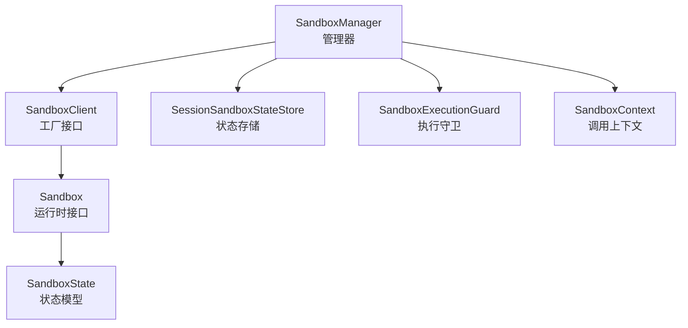
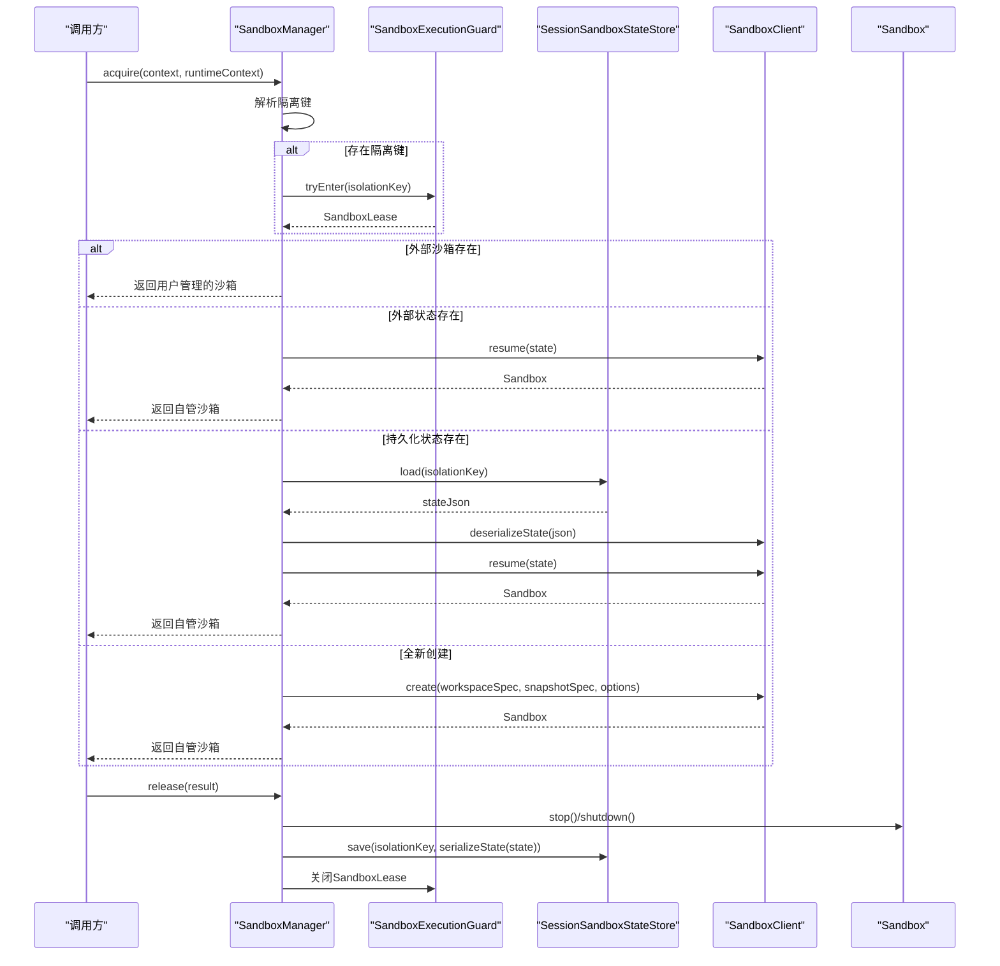
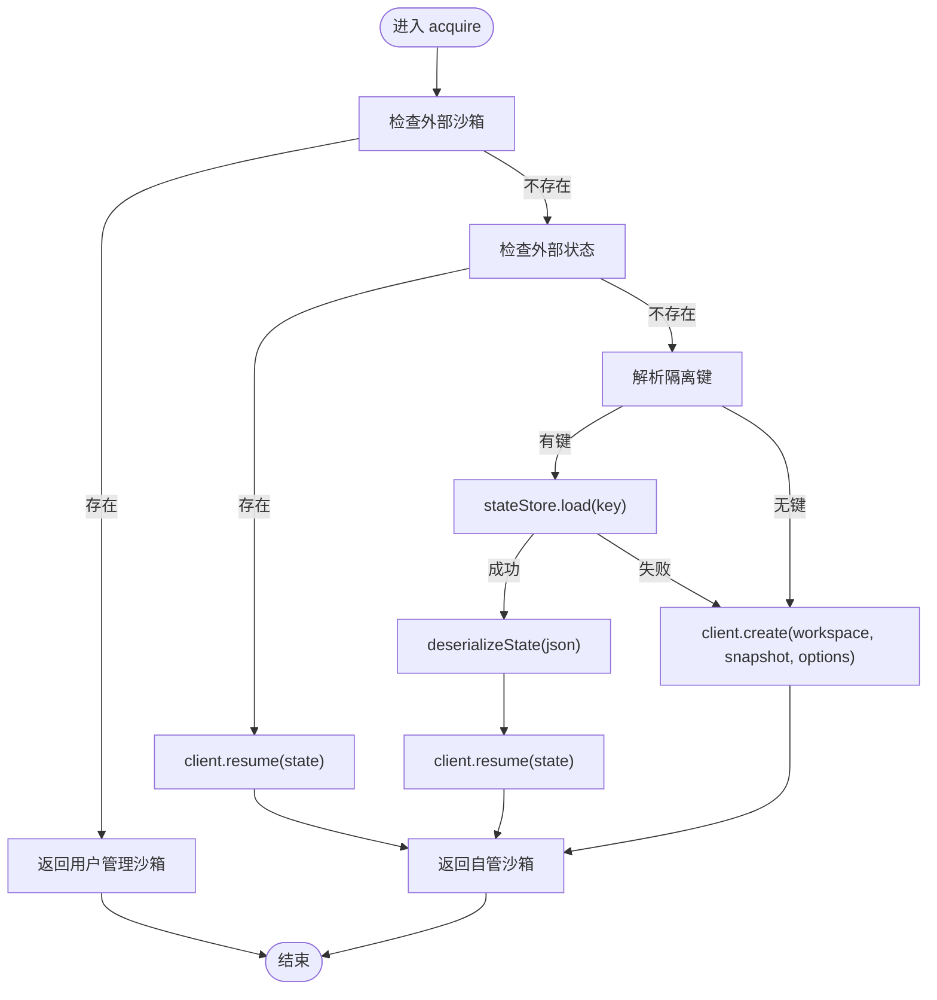
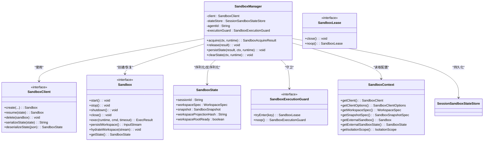

# Sandbox管理器

<cite>
**本文档引用的文件**
- [SandboxManager.java](file://agentscope-harness/src/main/java/io/agentscope/harness/agent/sandbox/SandboxManager.java)
- [SandboxClient.java](file://agentscope-harness/src/main/java/io/agentscope/harness/agent/sandbox/SandboxClient.java)
- [Sandbox.java](file://agentscope-harness/src/main/java/io/agentscope/harness/agent/sandbox/Sandbox.java)
- [SandboxState.java](file://agentscope-harness/src/main/java/io/agentscope/harness/agent/sandbox/SandboxState.java)
- [SandboxExecutionGuard.java](file://agentscope-harness/src/main/java/io/agentscope/harness/agent/sandbox/SandboxExecutionGuard.java)
- [SandboxLease.java](file://agentscope-harness/src/main/java/io/agentscope/harness/agent/sandbox/SandboxLease.java)
- [SandboxContext.java](file://agentscope-harness/src/main/java/io/agentscope/harness/agent/sandbox/SandboxContext.java)
- [SessionSandboxStateStore.java](file://agentscope-harness/src/main/java/io/agentscope/harness/agent/sandbox/SessionSandboxStateStore.java)
- [SandboxManagerIsolationTest.java](file://agentscope-harness/src/test/java/io/agentscope/harness/agent/sandbox/SandboxManagerIsolationTest.java)
</cite>

## 目录
1. [简介](#简介)
2. [项目结构](#项目结构)
3. [核心组件](#核心组件)
4. [架构概览](#架构概览)
5. [详细组件分析](#详细组件分析)
6. [依赖关系分析](#依赖关系分析)
7. [性能考虑](#性能考虑)
8. [故障排除指南](#故障排除指南)
9. [结论](#结论)
10. [附录：使用示例与最佳实践](#附录使用示例与最佳实践)

## 简介
本文件为SandboxManager管理器提供全面的API文档，涵盖其职责、初始化流程、沙箱实例的创建与恢复、生命周期管理、并发隔离与资源分配策略，并给出配置选项与性能调优建议。SandboxManager负责在单次调用窗口内管理沙箱实例的获取、启动、持久化与释放，确保多实例场景下的隔离与一致性。

## 项目结构
SandboxManager位于agentscope-harness模块中，围绕沙箱生命周期管理的关键接口协作：
- SandboxClient：抽象沙箱工厂，支持创建与恢复
- Sandbox：沙箱运行时接口，定义启动、停止、关闭与命令执行等能力
- SandboxState：可序列化的沙箱状态，用于跨调用恢复
- SandboxExecutionGuard/SandboxLease：并发执行守卫与租约，保障隔离
- SandboxContext：每次调用的不可变沙箱配置上下文
- SessionSandboxStateStore：会话级沙箱状态存储

图表来源
- [SandboxManager.java:40-229](file://agentscope-harness/src/main/java/io/agentscope/harness/agent/sandbox/SandboxManager.java#L40-L229)
- [SandboxClient.java:25-44](file://agentscope-harness/src/main/java/io/agentscope/harness/agent/sandbox/SandboxClient.java#L25-L44)
- [Sandbox.java:42-77](file://agentscope-harness/src/main/java/io/agentscope/harness/agent/sandbox/Sandbox.java#L42-L77)
- [SandboxState.java:34-85](file://agentscope-harness/src/main/java/io/agentscope/harness/agent/sandbox/SandboxState.java#L34-L85)
- [SandboxExecutionGuard.java:58-94](file://agentscope-harness/src/main/java/io/agentscope/harness/agent/sandbox/SandboxExecutionGuard.java#L58-L94)
- [SandboxContext.java:27-130](file://agentscope-harness/src/main/java/io/agentscope/harness/agent/sandbox/SandboxContext.java#L27-L130)
- [SessionSandboxStateStore.java](file://agentscope-harness/src/main/java/io/agentscope/harness/agent/sandbox/SessionSandboxStateStore.java)

章节来源
- [SandboxManager.java:24-40](file://agentscope-harness/src/main/java/io/agentscope/harness/agent/sandbox/SandboxManager.java#L24-L40)
- [SandboxClient.java:20-44](file://agentscope-harness/src/main/java/io/agentscope/harness/agent/sandbox/SandboxClient.java#L20-L44)
- [Sandbox.java:21-77](file://agentscope-harness/src/main/java/io/agentscope/harness/agent/sandbox/Sandbox.java#L21-L77)
- [SandboxState.java:22-85](file://agentscope-harness/src/main/java/io/agentscope/harness/agent/sandbox/SandboxState.java#L22-L85)
- [SandboxExecutionGuard.java:20-94](file://agentscope-harness/src/main/java/io/agentscope/harness/agent/sandbox/SandboxExecutionGuard.java#L20-L94)
- [SandboxContext.java:21-130](file://agentscope-harness/src/main/java/io/agentscope/harness/agent/sandbox/SandboxContext.java#L21-L130)

## 核心组件
- SandboxManager：管理单次调用内的沙箱生命周期，按优先级选择外部沙箱、外部状态或从持久化状态恢复，最终创建新沙箱；负责释放与状态持久化。
- SandboxClient：抽象工厂，提供create/resume/delete与状态序列化/反序列化能力。
- Sandbox：运行时接口，定义start/stop/shutdown/close/exec/persistWorkspace/hydrateWorkspace等方法。
- SandboxState：可序列化状态，包含会话ID、工作区规格、快照、工作区投影哈希与根目录就绪标记。
- SandboxExecutionGuard/SandboxLease：并发控制扩展点，默认无操作，可通过Redis/JDBC等实现分布式锁。
- SandboxContext：不可变配置，包含客户端、工作区规格、快照规格、外部沙箱/状态、隔离范围。
- SessionSandboxStateStore：会话级状态存取，支持保存、加载、删除。

章节来源
- [SandboxManager.java:49-229](file://agentscope-harness/src/main/java/io/agentscope/harness/agent/sandbox/SandboxManager.java#L49-L229)
- [SandboxClient.java:25-44](file://agentscope-harness/src/main/java/io/agentscope/harness/agent/sandbox/SandboxClient.java#L25-L44)
- [Sandbox.java:42-77](file://agentscope-harness/src/main/java/io/agentscope/harness/agent/sandbox/Sandbox.java#L42-L77)
- [SandboxState.java:34-85](file://agentscope-harness/src/main/java/io/agentscope/harness/agent/sandbox/SandboxState.java#L34-L85)
- [SandboxExecutionGuard.java:58-94](file://agentscope-harness/src/main/java/io/agentscope/harness/agent/sandbox/SandboxExecutionGuard.java#L58-L94)
- [SandboxContext.java:27-130](file://agentscope-harness/src/main/java/io/agentscope/harness/agent/sandbox/SandboxContext.java#L27-L130)
- [SessionSandboxStateStore.java](file://agentscope-harness/src/main/java/io/agentscope/harness/agent/sandbox/SessionSandboxStateStore.java)

## 架构概览
SandboxManager在单次调用中协调以下流程：
- 解析隔离键（IsolationKey），决定是否需要执行守卫
- 按优先级获取沙箱：用户提供的外部沙箱 > 外部状态恢复 > 持久化状态恢复 > 新建沙箱
- 在调用结束时释放沙箱并持久化状态（仅自管沙箱）
- 执行守卫贯穿acquire→start→(调用)→stop→release→lease.close的完整窗口

图表来源
- [SandboxManager.java:66-140](file://agentscope-harness/src/main/java/io/agentscope/harness/agent/sandbox/SandboxManager.java#L66-L140)
- [SandboxManager.java:142-170](file://agentscope-harness/src/main/java/io/agentscope/harness/agent/sandbox/SandboxManager.java#L142-L170)
- [SandboxManager.java:172-210](file://agentscope-harness/src/main/java/io/agentscope/harness/agent/sandbox/SandboxManager.java#L172-L210)
- [SandboxExecutionGuard.java:58-72](file://agentscope-harness/src/main/java/io/agentscope/harness/agent/sandbox/SandboxExecutionGuard.java#L58-L72)
- [SessionSandboxStateStore.java](file://agentscope-harness/src/main/java/io/agentscope/harness/agent/sandbox/SessionSandboxStateStore.java)
- [SandboxClient.java:25-44](file://agentscope-harness/src/main/java/io/agentscope/harness/agent/sandbox/SandboxClient.java#L25-L44)

## 详细组件分析

### SandboxManager：生命周期与优先级策略
- 初始化：接收SandboxClient、SessionSandboxStateStore、agentId与可选的SandboxExecutionGuard
- acquire优先级：
  1) 用户提供的外部沙箱（不应用执行守卫）
  2) 用户提供的外部状态（不应用执行守卫）
  3) 从持久化状态恢复（应用执行守卫，若存在隔离键）
  4) 创建全新沙箱（应用执行守卫，若存在隔离键）
- release：仅对自管沙箱执行stop/shutdown；用户管理的沙箱由调用方持有
- persistState：仅对自管沙箱持久化状态；根据隔离键写入SessionSandboxStateStore
- clearState：清理指定隔离键的状态

图表来源
- [SandboxManager.java:66-140](file://agentscope-harness/src/main/java/io/agentscope/harness/agent/sandbox/SandboxManager.java#L66-L140)
- [SandboxManager.java:172-210](file://agentscope-harness/src/main/java/io/agentscope/harness/agent/sandbox/SandboxManager.java#L172-L210)

章节来源
- [SandboxManager.java:49-64](file://agentscope-harness/src/main/java/io/agentscope/harness/agent/sandbox/SandboxManager.java#L49-L64)
- [SandboxManager.java:66-140](file://agentscope-harness/src/main/java/io/agentscope/harness/agent/sandbox/SandboxManager.java#L66-L140)
- [SandboxManager.java:142-170](file://agentscope-harness/src/main/java/io/agentscope/harness/agent/sandbox/SandboxManager.java#L142-L170)
- [SandboxManager.java:172-210](file://agentscope-harness/src/main/java/io/agentscope/harness/agent/sandbox/SandboxManager.java#L172-L210)
- [SandboxManager.java:212-227](file://agentscope-harness/src/main/java/io/agentscope/harness/agent/sandbox/SandboxManager.java#L212-L227)

### SandboxClient：工厂接口
- create：创建预启动状态的新沙箱
- resume：从SandboxState恢复沙箱
- delete：删除沙箱
- serializeState/deserializeState：状态序列化与反序列化

章节来源
- [SandboxClient.java:25-44](file://agentscope-harness/src/main/java/io/agentscope/harness/agent/sandbox/SandboxClient.java#L25-L44)

### Sandbox：运行时接口
- 生命周期：start → 使用 → stop → shutdown 或 close
- 区分stop与shutdown：前者仅持久化快照，后者销毁后端资源
- exec：在沙箱工作区内执行命令，支持超时
- persistWorkspace/hydrateWorkspace：归档与还原工作区

章节来源
- [Sandbox.java:42-77](file://agentscope-harness/src/main/java/io/agentscope/harness/agent/sandbox/Sandbox.java#L42-L77)

### SandboxState：可序列化状态
- 字段：sessionId、workspaceSpec、snapshot、workspaceProjectionHash、workspaceRootReady
- 用途：跨调用恢复沙箱工作区与状态

章节来源
- [SandboxState.java:34-85](file://agentscope-harness/src/main/java/io/agentscope/harness/agent/sandbox/SandboxState.java#L34-L85)

### SandboxExecutionGuard 与 SandboxLease：并发隔离
- SandboxExecutionGuard：可插拔的执行守卫，针对隔离键提供互斥保护
- SandboxLease：租约接口，自动关闭以释放执行权
- 默认实现noop：不施加限制，保持向后兼容

章节来源
- [SandboxExecutionGuard.java:58-94](file://agentscope-harness/src/main/java/io/agentscope/harness/agent/sandbox/SandboxExecutionGuard.java#L58-L94)
- [SandboxLease.java:27-55](file://agentscope-harness/src/main/java/io/agentscope/harness/agent/sandbox/SandboxLease.java#L27-L55)

### SandboxContext：调用上下文
- 不可变配置：SandboxClient、SandboxClientOptions、WorkspaceSpec、SandboxSnapshotSpec、外部沙箱/状态、IsolationScope
- 通过Builder构建

章节来源
- [SandboxContext.java:27-130](file://agentscope-harness/src/main/java/io/agentscope/harness/agent/sandbox/SandboxContext.java#L27-L130)

### SessionSandboxStateStore：状态存储
- 提供save/load/delete能力，用于持久化与清理SandboxState

章节来源
- [SessionSandboxStateStore.java](file://agentscope-harness/src/main/java/io/agentscope/harness/agent/sandbox/SessionSandboxStateStore.java)

## 依赖关系分析
SandboxManager与各组件的耦合关系如下：

图表来源
- [SandboxManager.java:49-229](file://agentscope-harness/src/main/java/io/agentscope/harness/agent/sandbox/SandboxManager.java#L49-L229)
- [SandboxClient.java:25-44](file://agentscope-harness/src/main/java/io/agentscope/harness/agent/sandbox/SandboxClient.java#L25-L44)
- [Sandbox.java:42-77](file://agentscope-harness/src/main/java/io/agentscope/harness/agent/sandbox/Sandbox.java#L42-L77)
- [SandboxState.java:34-85](file://agentscope-harness/src/main/java/io/agentscope/harness/agent/sandbox/SandboxState.java#L34-L85)
- [SandboxExecutionGuard.java:58-94](file://agentscope-harness/src/main/java/io/agentscope/harness/agent/sandbox/SandboxExecutionGuard.java#L58-L94)
- [SandboxLease.java:27-55](file://agentscope-harness/src/main/java/io/agentscope/harness/agent/sandbox/SandboxLease.java#L27-L55)
- [SandboxContext.java:27-130](file://agentscope-harness/src/main/java/io/agentscope/harness/agent/sandbox/SandboxContext.java#L27-L130)

## 性能考虑
- 并发隔离成本：启用SandboxExecutionGuard会在高并发下引入阻塞/等待，需评估后端（如Redis/JDBC）延迟与可用性
- 状态持久化开销：频繁的序列化/反序列化与I/O可能影响吞吐，建议合理设置快照策略与清理周期
- 沙箱创建成本：新建沙箱通常较慢，应尽量复用已存在的沙箱或从持久化状态恢复
- 资源回收：及时调用release以避免资源泄漏；对于用户管理的沙箱，遵循调用方生命周期策略
- 隔离粒度：IsolationScope越细（如USER/AGENT），冲突概率越高但隔离性越好；越粗（GLOBAL）则冲突低但风险高

## 故障排除指南
- acquire失败：当从持久化状态恢复或创建沙箱失败时，管理器会自动关闭租约并抛出异常；检查状态存储可用性与客户端实现
- release失败：stop/shutdown异常会被记录为警告；确认沙箱实现的幂等性与资源状态
- 状态未持久化：若未提供隔离键或沙箱无状态，将跳过持久化；检查SandboxState与隔离键解析
- 并发冲突：若出现长时间等待，检查SandboxExecutionGuard实现与后端锁服务健康状况

章节来源
- [SandboxManager.java:135-139](file://agentscope-harness/src/main/java/io/agentscope/harness/agent/sandbox/SandboxManager.java#L135-L139)
- [SandboxManager.java:160-169](file://agentscope-harness/src/main/java/io/agentscope/harness/agent/sandbox/SandboxManager.java#L160-L169)
- [SandboxManager.java:207-209](file://agentscope-harness/src/main/java/io/agentscope/harness/agent/sandbox/SandboxManager.java#L207-L209)

## 结论
SandboxManager通过明确的优先级策略与可插拔的执行守卫，在保证隔离与一致性的前提下，高效管理沙箱生命周期。结合合理的隔离范围与状态持久化策略，可在高并发场景中稳定运行。建议在生产环境根据业务负载选择合适的执行守卫实现与调优参数。

## 附录：使用示例与最佳实践
- 基本用法
  - 通过SandboxContext.Builder配置SandboxClient、工作区规格、快照规格与隔离范围
  - 在每次调用前调用acquire获取沙箱，结束后调用release释放并持久化状态
- 并发隔离
  - 对USER/AGENT/GLOBAL等隔离范围启用SandboxExecutionGuard，避免竞态
  - 使用Redis/JDBC实现的分布式锁作为执行守卫，确保跨进程一致性
- 资源管理
  - 对于用户管理的沙箱（外部沙箱/外部状态），遵循调用方生命周期，避免重复stop/shutdown
  - 定期清理不再使用的持久化状态，降低I/O压力
- 性能优化
  - 尽量复用现有沙箱或从持久化状态恢复
  - 合理设置快照策略，平衡恢复速度与磁盘占用
  - 监控执行守卫后端的延迟与错误率，必要时扩容或切换实现

章节来源
- [SandboxContext.java:75-130](file://agentscope-harness/src/main/java/io/agentscope/harness/agent/sandbox/SandboxContext.java#L75-L130)
- [SandboxExecutionGuard.java:36-50](file://agentscope-harness/src/main/java/io/agentscope/harness/agent/sandbox/SandboxExecutionGuard.java#L36-L50)
- [SandboxManagerIsolationTest.java](file://agentscope-harness/src/test/java/io/agentscope/harness/agent/sandbox/SandboxManagerIsolationTest.java)