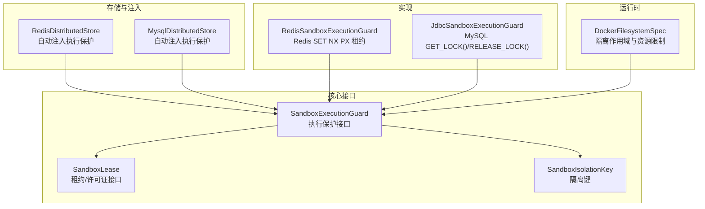
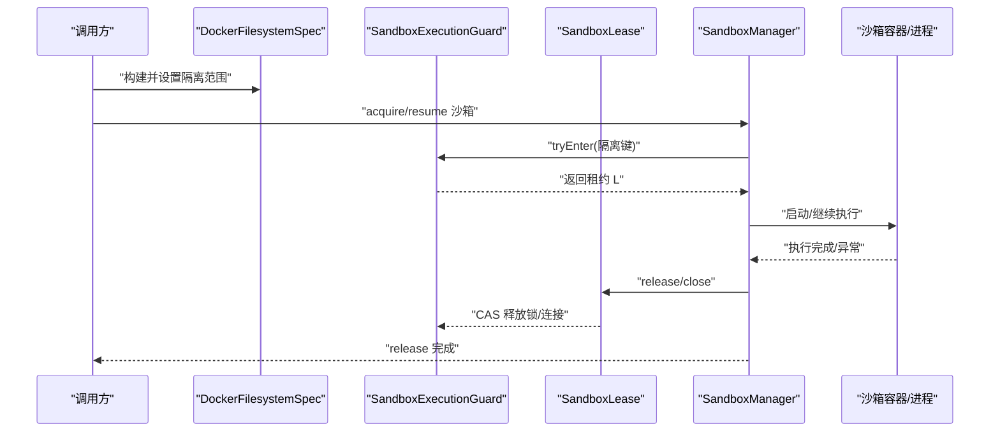
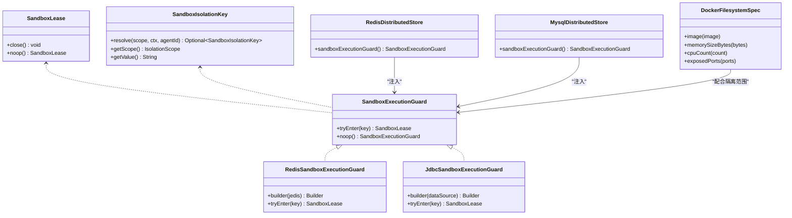

# 沙箱执行保护

<cite>
**本文引用的文件**
- [SandboxExecutionGuard.java](file://agentscope-harness/src/main/java/io/agentscope/harness/agent/sandbox/SandboxExecutionGuard.java)
- [SandboxLease.java](file://agentscope-harness/src/main/java/io/agentscope/harness/agent/sandbox/SandboxLease.java)
- [SandboxIsolationKey.java](file://agentscope-harness/src/main/java/io/agentscope/harness/agent/sandbox/SandboxIsolationKey.java)
- [RedisSandboxExecutionGuard.java](file://agentscope-extensions/agentscope-extensions-redis/src/main/java/io/agentscope/extensions/redis/sandbox/RedisSandboxExecutionGuard.java)
- [JdbcSandboxExecutionGuard.java](file://agentscope-extensions/agentscope-extensions-mysql/src/main/java/io/agentscope/extensions/mysql/sandbox/JdbcSandboxExecutionGuard.java)
- [RedisDistributedStore.java](file://agentscope-extensions/agentscope-extensions-redis/src/main/java/io/agentscope/extensions/redis/RedisDistributedStore.java)
- [MysqlDistributedStore.java](file://agentscope-extensions/agentscope-extensions-mysql/src/main/java/io/agentscope/extensions/mysql/MysqlDistributedStore.java)
- [DockerFilesystemSpec.java](file://agentscope-harness/src/main/java/io/agentscope/harness/agent/sandbox/impl/docker/DockerFilesystemSpec.java)
- [going-to-production.md](file://docs/v2/en/docs/others/going-to-production.md)
</cite>

## 目录
1. [简介](#简介)
2. [项目结构](#项目结构)
3. [核心组件](#核心组件)
4. [架构总览](#架构总览)
5. [组件详解](#组件详解)
6. [依赖关系分析](#依赖关系分析)
7. [性能考量](#性能考量)
8. [故障排查指南](#故障排查指南)
9. [结论](#结论)
10. [附录](#附录)

## 简介
本文件面向“沙箱执行保护”（SandboxExecutionGuard）的API与实践，系统阐述其设计原理、安全目标、配置与实施方式，以及与沙箱隔离机制的协同工作模式。重点包括：
- 如何通过分布式锁或本地并发控制，避免多副本或多线程对同一沙箱槽位的竞争冲突；
- 命令白名单、资源限制与权限控制在沙箱中的落地建议；
- 执行保护与沙箱隔离（IsolationScope）的配合方式；
- 常见威胁检测与阻断策略；
- 自定义与扩展保护策略的方法与最佳实践。

## 项目结构
围绕沙箱执行保护的关键模块分布如下：
- 核心接口与契约：SandboxExecutionGuard、SandboxLease、SandboxIsolationKey
- Redis实现：RedisSandboxExecutionGuard
- MySQL实现：JdbcSandboxExecutionGuard
- 存储与注入：RedisDistributedStore、MysqlDistributedStore
- 文件系统与隔离：DockerFilesystemSpec
- 生产部署与使用示例：going-to-production 文档

图示来源
- [SandboxExecutionGuard.java:59-94](file://agentscope-harness/src/main/java/io/agentscope/harness/agent/sandbox/SandboxExecutionGuard.java#L59-L94)
- [SandboxLease.java:27-55](file://agentscope-harness/src/main/java/io/agentscope/harness/agent/sandbox/SandboxLease.java#L27-L55)
- [SandboxIsolationKey.java:33-141](file://agentscope-harness/src/main/java/io/agentscope/harness/agent/sandbox/SandboxIsolationKey.java#L33-L141)
- [RedisSandboxExecutionGuard.java:95-263](file://agentscope-extensions/agentscope-extensions-redis/src/main/java/io/agentscope/extensions/redis/sandbox/RedisSandboxExecutionGuard.java#L95-L263)
- [JdbcSandboxExecutionGuard.java:45-177](file://agentscope-extensions/agentscope-extensions-mysql/src/main/java/io/agentscope/extensions/mysql/sandbox/JdbcSandboxExecutionGuard.java#L45-L177)
- [RedisDistributedStore.java:105-106](file://agentscope-extensions/agentscope-extensions-redis/src/main/java/io/agentscope/extensions/redis/RedisDistributedStore.java#L105-L106)
- [MysqlDistributedStore.java:87-88](file://agentscope-extensions/agentscope-extensions-mysql/src/main/java/io/agentscope/extensions/mysql/MysqlDistributedStore.java#L87-L88)
- [DockerFilesystemSpec.java:28-72](file://agentscope-harness/src/main/java/io/agentscope/harness/agent/sandbox/impl/docker/DockerFilesystemSpec.java#L28-L72)

章节来源
- [SandboxExecutionGuard.java:20-57](file://agentscope-harness/src/main/java/io/agentscope/harness/agent/sandbox/SandboxExecutionGuard.java#L20-L57)
- [going-to-production.md:319-355](file://docs/v2/en/docs/others/going-to-production.md#L319-L355)

## 核心组件
- SandboxExecutionGuard：可插拔的沙箱执行保护接口，负责在给定隔离键上串行化并发执行，返回一个租约对象；默认提供无操作实现。
- SandboxLease：持有者持有的执行许可，需幂等关闭；释放失败应静默记录日志，不抛出异常。
- SandboxIsolationKey：根据隔离范围（SESSION/USER/AGENT/GLOBAL）与运行时上下文解析出唯一槽位标识，用于区分不同隔离维度下的沙箱实例。
- RedisSandboxExecutionGuard：基于 Redis SET NX PX 的租约机制，支持租约 TTL 与重试间隔配置。
- JdbcSandboxExecutionGuard：基于 MySQL GET_LOCK()/RELEASE_LOCK() 的命名锁，连接关闭即自动释放。

章节来源
- [SandboxExecutionGuard.java:59-94](file://agentscope-harness/src/main/java/io/agentscope/harness/agent/sandbox/SandboxExecutionGuard.java#L59-L94)
- [SandboxLease.java:27-55](file://agentscope-harness/src/main/java/io/agentscope/harness/agent/sandbox/SandboxLease.java#L27-L55)
- [SandboxIsolationKey.java:33-141](file://agentscope-harness/src/main/java/io/agentscope/harness/agent/sandbox/SandboxIsolationKey.java#L33-L141)
- [RedisSandboxExecutionGuard.java:95-263](file://agentscope-extensions/agentscope-extensions-redis/src/main/java/io/agentscope/extensions/redis/sandbox/RedisSandboxExecutionGuard.java#L95-L263)
- [JdbcSandboxExecutionGuard.java:45-177](file://agentscope-extensions/agentscope-extensions-mysql/src/main/java/io/agentscope/extensions/mysql/sandbox/JdbcSandboxExecutionGuard.java#L45-L177)

## 架构总览
沙箱执行保护在“分布式状态存储 + 沙箱文件系统”的组合下，通过隔离键将并发访问串行化，避免多副本或多线程对同一持久化槽位的竞争写入导致的数据损坏或状态错乱。

图示来源
- [SandboxExecutionGuard.java:54-56](file://agentscope-harness/src/main/java/io/agentscope/harness/agent/sandbox/SandboxExecutionGuard.java#L54-L56)
- [SandboxLease.java:34-35](file://agentscope-harness/src/main/java/io/agentscope/harness/agent/sandbox/SandboxLease.java#L34-L35)
- [DockerFilesystemSpec.java:28-72](file://agentscope-harness/src/main/java/io/agentscope/harness/agent/sandbox/impl/docker/DockerFilesystemSpec.java#L28-L72)

## 组件详解

### SandboxExecutionGuard 接口与生命周期
- 设计目标：在 SESSION/USER/AGENT/GLOBAL 等隔离范围内，串行化对同一沙箱槽位的并发执行，避免竞态与最后写入覆盖问题。
- 生命周期：在获取/恢复沙箱后进入保护区域，在释放完成后归还租约；保护窗口覆盖 acquire → start → (call) → stop → release → lease.close。
- 默认实现：noop() 提供无限制的空实现，便于开发与测试场景。

章节来源
- [SandboxExecutionGuard.java:20-57](file://agentscope-harness/src/main/java/io/agentscope/harness/agent/sandbox/SandboxExecutionGuard.java#L20-L57)
- [SandboxExecutionGuard.java:74-80](file://agentscope-harness/src/main/java/io/agentscope/harness/agent/sandbox/SandboxExecutionGuard.java#L74-L80)

### SandboxLease 幂等释放与错误处理
- 要求：close() 必须幂等且不可抛出异常；释放失败应记录警告日志，保证后续流程不受影响。
- 用途：由执行保护返回并在释放阶段自动关闭，无需外部管理。

章节来源
- [SandboxLease.java:18-35](file://agentscope-harness/src/main/java/io/agentscope/harness/agent/sandbox/SandboxLease.java#L18-L35)

### SandboxIsolationKey 解析与回退策略
- 支持范围：SESSION（必须有 sessionId）、USER（优先 userId，缺失则回退到 sessionId，均缺失则跳过查找）、AGENT（使用 agentId）、GLOBAL（全局常量值）。
- 作用：为每个调用生成唯一的隔离键，作为执行保护的粒度边界。

章节来源
- [SandboxIsolationKey.java:47-104](file://agentscope-harness/src/main/java/io/agentscope/harness/agent/sandbox/SandboxIsolationKey.java#L47-L104)

### RedisSandboxExecutionGuard：租约与重试
- 机制：SET NX PX 租约 + Lua CAS 删除，避免误删他人持有的锁；支持租约 TTL 与重试间隔配置。
- 键格式：keyPrefix + scope_lower + ":" + value，便于多环境/多租户隔离。
- 使用建议：租约 TTL 应大于最坏情况下的调用时长（含 LLM 调用、重试、快照等），以减少过期导致的并发风险。

章节来源
- [RedisSandboxExecutionGuard.java:30-94](file://agentscope-extensions/agentscope-extensions-redis/src/main/java/io/agentscope/extensions/redis/sandbox/RedisSandboxExecutionGuard.java#L30-L94)
- [RedisSandboxExecutionGuard.java:138-159](file://agentscope-extensions/agentscope-extensions-redis/src/main/java/io/agentscope/extensions/redis/sandbox/RedisSandboxExecutionGuard.java#L138-L159)
- [RedisSandboxExecutionGuard.java:161-179](file://agentscope-extensions/agentscope-extensions-redis/src/main/java/io/agentscope/extensions/redis/sandbox/RedisSandboxExecutionGuard.java#L161-L179)
- [RedisSandboxExecutionGuard.java:181-183](file://agentscope-extensions/agentscope-extensions-redis/src/main/java/io/agentscope/extensions/redis/sandbox/RedisSandboxExecutionGuard.java#L181-L183)
- [RedisSandboxExecutionGuard.java:190-261](file://agentscope-extensions/agentscope-extensions-redis/src/main/java/io/agentscope/extensions/redis/sandbox/RedisSandboxExecutionGuard.java#L190-L261)

### JdbcSandboxExecutionGuard：数据库命名锁
- 机制：GET_LOCK(timeout) 阻塞等待，RELEASE_LOCK() 释放；连接关闭自动释放，避免泄漏。
- 键长度：MySQL 命名锁最大 64 字符，超长时采用前缀+十六进制哈希的方式截断。
- 使用建议：为避免与其他应用冲突，务必设置独立的 keyPrefix。

章节来源
- [JdbcSandboxExecutionGuard.java:31-44](file://agentscope-extensions/agentscope-extensions-mysql/src/main/java/io/agentscope/extensions/mysql/sandbox/JdbcSandboxExecutionGuard.java#L31-L44)
- [JdbcSandboxExecutionGuard.java:65-97](file://agentscope-extensions/agentscope-extensions-mysql/src/main/java/io/agentscope/extensions/mysql/sandbox/JdbcSandboxExecutionGuard.java#L65-L97)
- [JdbcSandboxExecutionGuard.java:99-107](file://agentscope-extensions/agentscope-extensions-mysql/src/main/java/io/agentscope/extensions/mysql/sandbox/JdbcSandboxExecutionGuard.java#L99-L107)
- [JdbcSandboxExecutionGuard.java:109-141](file://agentscope-extensions/agentscope-extensions-mysql/src/main/java/io/agentscope/extensions/mysql/sandbox/JdbcSandboxExecutionGuard.java#L109-L141)
- [JdbcSandboxExecutionGuard.java:143-175](file://agentscope-extensions/agentscope-extensions-mysql/src/main/java/io/agentscope/extensions/mysql/sandbox/JdbcSandboxExecutionGuard.java#L143-L175)

### 存储与注入：自动装配执行保护
- RedisDistributedStore：自动注入 RedisSandboxExecutionGuard，支持自定义 keyPrefix。
- MysqlDistributedStore：自动注入 JdbcSandboxExecutionGuard，支持自定义 keyPrefix 与锁超时。
- 使用建议：优先通过分布式存储自动注入，仅在需要定制租约 TTL 或锁超时时显式覆盖。

章节来源
- [RedisDistributedStore.java:105-106](file://agentscope-extensions/agentscope-extensions-redis/src/main/java/io/agentscope/extensions/redis/RedisDistributedStore.java#L105-L106)
- [MysqlDistributedStore.java:87-88](file://agentscope-extensions/agentscope-extensions-mysql/src/main/java/io/agentscope/extensions/mysql/MysqlDistributedStore.java#L87-L88)
- [going-to-production.md:328-355](file://docs/v2/en/docs/others/going-to-production.md#L328-L355)

### 与沙箱隔离机制的配合
- 在 SESSION/USER 范围内，天然按会话/用户分桶，通常不会发生并发冲突；但在 AGENT/GLOBAL 范围且多副本部署时，多个节点可能同时对同一槽位执行，此时需要执行保护。
- DockerFilesystemSpec 可设置隔离范围（如 IsolationScope.GLOBAL），结合执行保护实现跨节点串行化。

章节来源
- [going-to-production.md:321-326](file://docs/v2/en/docs/others/going-to-production.md#L321-L326)
- [DockerFilesystemSpec.java:28-72](file://agentscope-harness/src/main/java/io/agentscope/harness/agent/sandbox/impl/docker/DockerFilesystemSpec.java#L28-L72)

### 命令白名单、资源限制与权限控制
- 命令白名单：在沙箱容器层面限制可执行命令，仅允许受控工具链；结合工具函数与技能仓库的治理策略，避免任意命令执行。
- 资源限制：通过 DockerFilesystemSpec 设置 CPU/内存/暴露端口等，防止资源滥用；必要时在宿主机侧限制网络与磁盘 IO。
- 权限控制：最小权限原则，限制容器内文件系统读写范围；结合 Workspace 投影与只读挂载，降低持久化风险。

章节来源
- [DockerFilesystemSpec.java:43-72](file://agentscope-harness/src/main/java/io/agentscope/harness/agent/sandbox/impl/docker/DockerFilesystemSpec.java#L43-L72)

### 威胁检测与阻断
- 并发冲突：通过执行保护的租约与 CAS 释放，阻断多副本同时写入同一槽位。
- 过期与泄漏：Redis/TTL 与数据库连接自动释放机制作为安全阀，避免永久阻塞；日志记录释放失败以便审计。
- 异常传播：执行保护释放阶段不抛异常，确保调用后流程稳定完成。

章节来源
- [RedisSandboxExecutionGuard.java:161-179](file://agentscope-extensions/agentscope-extensions-redis/src/main/java/io/agentscope/extensions/redis/sandbox/RedisSandboxExecutionGuard.java#L161-L179)
- [JdbcSandboxExecutionGuard.java:120-139](file://agentscope-extensions/agentscope-extensions-mysql/src/main/java/io/agentscope/extensions/mysql/sandbox/JdbcSandboxExecutionGuard.java#L120-L139)
- [SandboxLease.java:32-35](file://agentscope-harness/src/main/java/io/agentscope/harness/agent/sandbox/SandboxLease.java#L32-L35)

### 自定义与扩展
- 实现 SandboxExecutionGuard：遵循 tryEnter 阻塞直至获取、返回幂等可关闭租约的原则；释放失败静默记录日志。
- 典型扩展：Zookeeper/etcd 的分布式锁、Consul KV 租约、基于网关的令牌桶限流等。
- 注意事项：保持线程安全、避免死锁、合理设置超时与重试；确保租约 TTL 覆盖最坏情况。

章节来源
- [SandboxExecutionGuard.java:33-34](file://agentscope-harness/src/main/java/io/agentscope/harness/agent/sandbox/SandboxExecutionGuard.java#L33-L34)
- [SandboxExecutionGuard.java:82-93](file://agentscope-harness/src/main/java/io/agentscope/harness/agent/sandbox/SandboxExecutionGuard.java#L82-L93)
- [going-to-production.md:355-355](file://docs/v2/en/docs/others/going-to-production.md#L355-L355)

### 实际使用示例
- 通过 RedisDistributedStore 自动注入执行保护：
  - 参考路径：[RedisDistributedStore.java:105-106](file://agentscope-extensions/agentscope-extensions-redis/src/main/java/io/agentscope/extensions/redis/RedisDistributedStore.java#L105-L106)
- 自定义租约 TTL：
  - 参考路径：[RedisSandboxExecutionGuard.java:231-238](file://agentscope-extensions/agentscope-extensions-redis/src/main/java/io/agentscope/extensions/redis/sandbox/RedisSandboxExecutionGuard.java#L231-L238)
- 通过 MysqlDistributedStore 注入：
  - 参考路径：[MysqlDistributedStore.java:87-88](file://agentscope-extensions/agentscope-extensions-mysql/src/main/java/io/agentscope/extensions/mysql/MysqlDistributedStore.java#L87-L88)

章节来源
- [going-to-production.md:328-355](file://docs/v2/en/docs/others/going-to-production.md#L328-L355)

## 依赖关系分析

图示来源
- [SandboxExecutionGuard.java:59-94](file://agentscope-harness/src/main/java/io/agentscope/harness/agent/sandbox/SandboxExecutionGuard.java#L59-L94)
- [SandboxLease.java:27-55](file://agentscope-harness/src/main/java/io/agentscope/harness/agent/sandbox/SandboxLease.java#L27-L55)
- [SandboxIsolationKey.java:33-141](file://agentscope-harness/src/main/java/io/agentscope/harness/agent/sandbox/SandboxIsolationKey.java#L33-L141)
- [RedisSandboxExecutionGuard.java:95-263](file://agentscope-extensions/agentscope-extensions-redis/src/main/java/io/agentscope/extensions/redis/sandbox/RedisSandboxExecutionGuard.java#L95-L263)
- [JdbcSandboxExecutionGuard.java:45-177](file://agentscope-extensions/agentscope-extensions-mysql/src/main/java/io/agentscope/extensions/mysql/sandbox/JdbcSandboxExecutionGuard.java#L45-L177)
- [RedisDistributedStore.java:105-106](file://agentscope-extensions/agentscope-extensions-redis/src/main/java/io/agentscope/extensions/redis/RedisDistributedStore.java#L105-L106)
- [MysqlDistributedStore.java:87-88](file://agentscope-extensions/agentscope-extensions-mysql/src/main/java/io/agentscope/extensions/mysql/MysqlDistributedStore.java#L87-L88)
- [DockerFilesystemSpec.java:28-72](file://agentscope-harness/src/main/java/io/agentscope/harness/agent/sandbox/impl/docker/DockerFilesystemSpec.java#L28-L72)

## 性能考量
- Redis 实现
  - 租约 TTL：应覆盖最坏调用时长，避免频繁过期导致的并发竞争。
  - 重试间隔：较低值可降低排队延迟，但增加 Redis 轮询开销；较高值减少负载但延长等待时间。
- MySQL 实现
  - 锁超时：应大于最坏调用时长；注意 MySQL 命名锁长度限制，必要时进行哈希截断。
  - 连接池与超时：合理配置数据源连接池与查询超时，避免长时间占用连接。
- 沙箱资源
  - CPU/内存限制：防止资源滥用；结合宿主机级限制与网络策略，降低逃逸风险。

## 故障排查指南
- 获取锁超时
  - Redis：检查租约 TTL 是否过短、重试间隔是否过大；确认 Redis 可用性与网络延迟。
  - MySQL：检查锁超时配置、数据库连接池与锁冲突情况。
- 释放失败
  - 查看执行保护实现的日志输出，定位释放阶段异常；确保实现幂等与静默处理。
- 键冲突
  - Redis：确认 keyPrefix 是否与其他环境共享导致冲突。
  - MySQL：确认 keyPrefix 是否唯一，避免与其他应用命名锁冲突。
- 隔离范围误配
  - 确认 IsolationScope 与运行时上下文（userId/sessionId/agentId）匹配；避免在 USER 范围缺失必需字段时回退到 SESSION 导致状态混淆。

章节来源
- [RedisSandboxExecutionGuard.java:161-179](file://agentscope-extensions/agentscope-extensions-redis/src/main/java/io/agentscope/extensions/redis/sandbox/RedisSandboxExecutionGuard.java#L161-L179)
- [JdbcSandboxExecutionGuard.java:120-139](file://agentscope-extensions/agentscope-extensions-mysql/src/main/java/io/agentscope/extensions/mysql/sandbox/JdbcSandboxExecutionGuard.java#L120-L139)
- [SandboxIsolationKey.java:78-104](file://agentscope-harness/src/main/java/io/agentscope/harness/agent/sandbox/SandboxIsolationKey.java#L78-L104)

## 结论
SandboxExecutionGuard 通过“隔离键 + 并发控制”的方式，有效解决了多副本与多线程环境下沙箱槽位的竞争问题。结合 Redis/MySQL 等后端实现，可在生产环境中提供高可用、可扩展的串行化保障。配合命令白名单、资源限制与权限控制，可进一步提升沙箱环境的整体安全性与稳定性。

## 附录
- 关键实现参考路径
  - [RedisSandboxExecutionGuard.tryEnter:138-159](file://agentscope-extensions/agentscope-extensions-redis/src/main/java/io/agentscope/extensions/redis/sandbox/RedisSandboxExecutionGuard.java#L138-L159)
  - [JdbcSandboxExecutionGuard.tryEnter:65-97](file://agentscope-extensions/agentscope-extensions-mysql/src/main/java/io/agentscope/extensions/mysql/sandbox/JdbcSandboxExecutionGuard.java#L65-L97)
  - [RedisDistributedStore.sandboxExecutionGuard:105-106](file://agentscope-extensions/agentscope-extensions-redis/src/main/java/io/agentscope/extensions/redis/RedisDistributedStore.java#L105-L106)
  - [MysqlDistributedStore.sandboxExecutionGuard:87-88](file://agentscope-extensions/agentscope-extensions-mysql/src/main/java/io/agentscope/extensions/mysql/MysqlDistributedStore.java#L87-L88)
  - [DockerFilesystemSpec 资源限制:43-72](file://agentscope-harness/src/main/java/io/agentscope/harness/agent/sandbox/impl/docker/DockerFilesystemSpec.java#L43-L72)