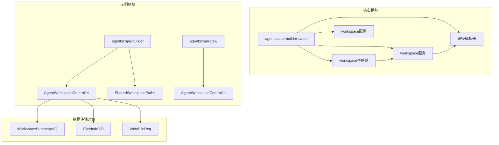
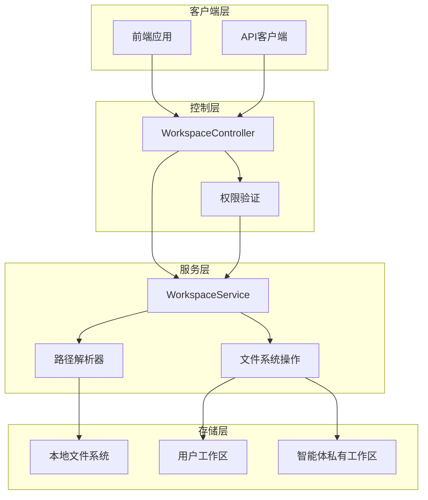
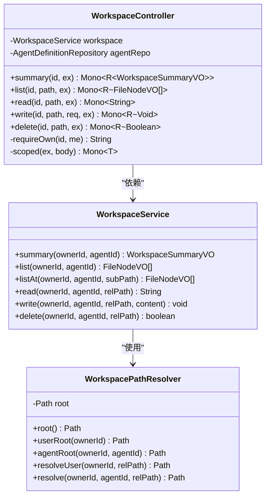
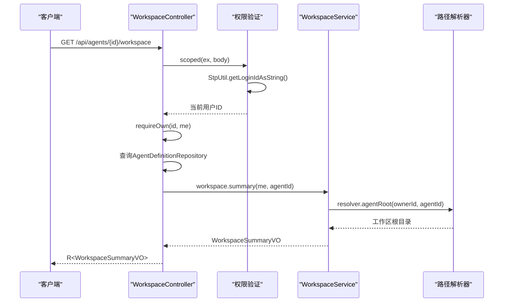
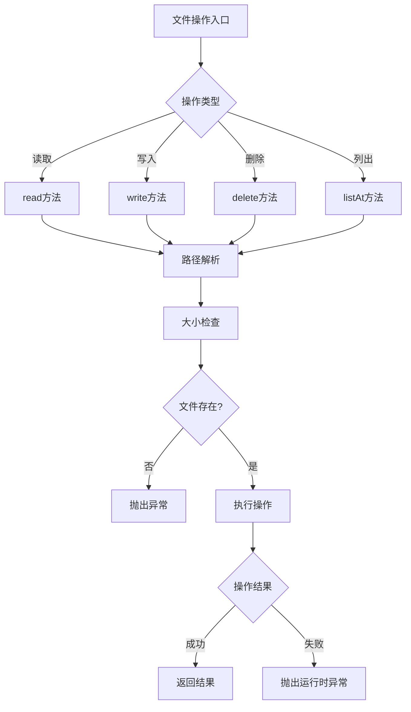
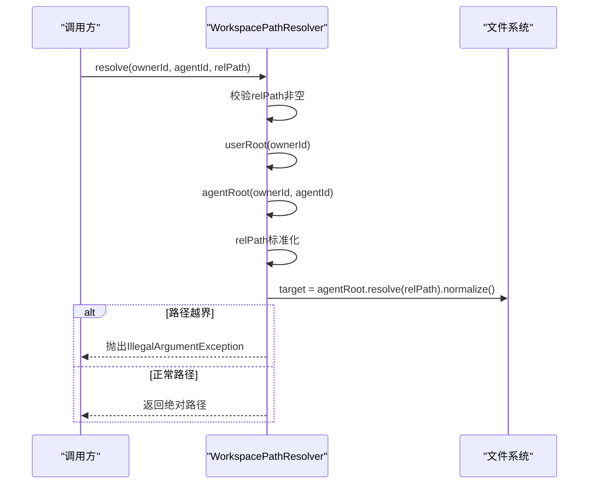
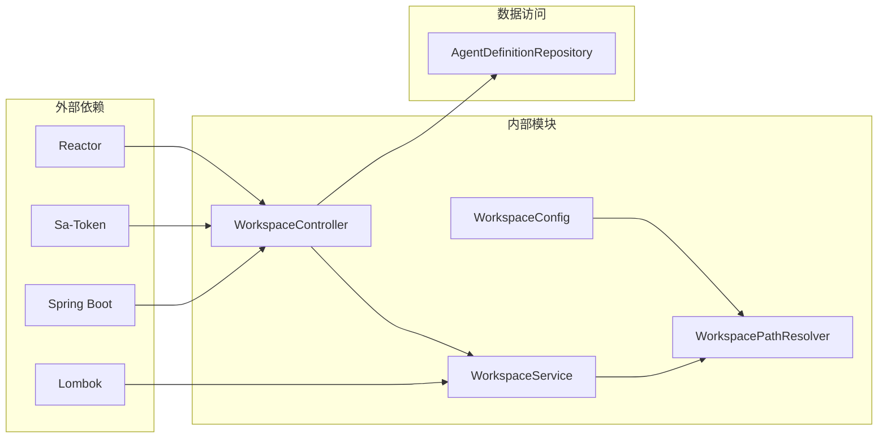

# Workspace工作区API

<cite>
**本文档引用的文件**
- [WorkspaceController.java](file://agentscope-builder-saton/src/main/java/io/agentscope/builder/saton/workspace/controller/WorkspaceController.java)
- [WorkspaceService.java](file://agentscope-builder-saton/src/main/java/io/agentscope/builder/saton/workspace/service/WorkspaceService.java)
- [WorkspaceConfig.java](file://agentscope-builder-saton/src/main/java/io/agentscope/builder/saton/workspace/service/WorkspaceConfig.java)
- [WorkspacePathResolver.java](file://agentscope-builder-saton/src/main/java/io/agentscope/builder/saton/workspace/service/WorkspacePathResolver.java)
- [WorkspaceSummaryVO.java](file://agentscope-builder-saton/src/main/java/io/agentscope/builder/saton/workspace/orm/dto/WorkspaceSummaryVO.java)
- [FileNodeVO.java](file://agentscope-builder-saton/src/main/java/io/agentscope/builder/saton/workspace/orm/dto/FileNodeVO.java)
- [WriteFileReq.java](file://agentscope-builder-saton/src/main/java/io/agentscope/builder/saton/workspace/orm/dto/WriteFileReq.java)
- [AgentWorkspaceController.java](file://agentscope-examples/agents/agentscope-builder/src/main/java/io/agentscope/builder/web/api/AgentWorkspaceController.java)
- [SharedWorkspacePaths.java](file://agentscope-examples/agents/agentscope-builder/src/main/java/io/agentscope/builder/web/workspace/SharedWorkspacePaths.java)
- [AgentWorkspaceController.java](file://agentscope-examples/agents/agentscope-paw/src/main/java/io/agentscope/claw2/web/api/AgentWorkspaceController.java)
</cite>

## 目录
1. [简介](#简介)
2. [项目结构](#项目结构)
3. [核心组件](#核心组件)
4. [架构概览](#架构概览)
5. [详细组件分析](#详细组件分析)
6. [依赖关系分析](#依赖关系分析)
7. [性能考虑](#性能考虑)
8. [故障排除指南](#故障排除指南)
9. [结论](#结论)

## 简介

Workspace工作区系统是AgentScope 2.0的核心组件，为智能体提供统一的执行环境抽象。该系统通过WorkspaceManager管理器实现对不同执行存储（本地文件系统、Docker容器、E2B云沙箱）的统一接口，确保相同智能体可以在任何环境中运行而无需更改其运行时逻辑。

本API参考文档详细说明了WorkspaceSpec规格定义、WorkspaceManager管理器接口、WorkspaceIndex索引管理以及路径规范化机制。文档涵盖了工作区配置、文件系统操作和路径解析的完整接口定义，并提供了工作区生命周期管理、权限控制和缓存策略的API说明。

## 项目结构

Workspace工作区系统主要分布在两个模块中：



**图表来源**
- [WorkspaceController.java:1-106](file://agentscope-builder-saton/src/main/java/io/agentscope/builder/saton/workspace/controller/WorkspaceController.java#L1-L106)
- [WorkspaceService.java:1-152](file://agentscope-builder-saton/src/main/java/io/agentscope/builder/saton/workspace/service/WorkspaceService.java#L1-L152)
- [WorkspaceConfig.java:1-19](file://agentscope-builder-saton/src/main/java/io/agentscope/builder/saton/workspace/service/WorkspaceConfig.java#L1-L19)

**章节来源**
- [WorkspaceController.java:1-106](file://agentscope-builder-saton/src/main/java/io/agentscope/builder/saton/workspace/controller/WorkspaceController.java#L1-L106)
- [WorkspaceService.java:1-152](file://agentscope-builder-saton/src/main/java/io/agentscope/builder/saton/workspace/service/WorkspaceService.java#L1-L152)
- [WorkspaceConfig.java:1-19](file://agentscope-builder-saton/src/main/java/io/agentscope/builder/saton/workspace/service/WorkspaceConfig.java#L1-L19)

## 核心组件

### WorkspaceManager管理器

WorkspaceManager是工作区系统的核心管理器，负责智能体执行环境的生命周期管理。它提供了以下关键功能：

- **统一接口抽象**：为不同执行存储提供一致的接口
- **资源发现**：动态发现和管理执行资源
- **上下文卸载**：支持上下文持久化和恢复
- **动态资源管理**：支持资源的动态分配和回收

### WorkspaceSpec规格定义

WorkspaceSpec定义了工作区的标准规格，包括：

- **身份标识**：唯一的工作区标识符
- **生命周期**：工作区的创建、运行和销毁流程
- **资源配置**：内存、存储、网络等资源规格
- **权限模型**：访问控制和安全策略

### WorkspaceIndex索引管理

工作区索引管理系统负责维护文件和目录的元数据信息，提供高效的查询和检索能力。

**章节来源**
- [WorkspaceService.java:19-28](file://agentscope-builder-saton/src/main/java/io/agentscope/builder/saton/workspace/service/WorkspaceService.java#L19-L28)

## 架构概览



**图表来源**
- [WorkspaceController.java:20-31](file://agentscope-builder-saton/src/main/java/io/agentscope/builder/saton/workspace/controller/WorkspaceController.java#L20-L31)
- [WorkspaceService.java:33-37](file://agentscope-builder-saton/src/main/java/io/agentscope/builder/saton/workspace/service/WorkspaceService.java#L33-L37)
- [WorkspacePathResolver.java:33-44](file://agentscope-builder-saton/src/main/java/io/agentscope/builder/saton/workspace/service/WorkspacePathResolver.java#L33-L44)

## 详细组件分析

### WorkspaceController API

WorkspaceController提供RESTful API接口，用于智能体工作区的管理。

#### 控制器类结构



**图表来源**
- [WorkspaceController.java:20-31](file://agentscope-builder-saton/src/main/java/io/agentscope/builder/saton/workspace/controller/WorkspaceController.java#L20-L31)
- [WorkspaceService.java:28-37](file://agentscope-builder-saton/src/main/java/io/agentscope/builder/saton/workspace/service/WorkspaceService.java#L28-L37)
- [WorkspacePathResolver.java:33-44](file://agentscope-builder-saton/src/main/java/io/agentscope/builder/saton/workspace/service/WorkspacePathResolver.java#L33-L44)

#### API端点定义

| 方法 | 端点 | 请求参数 | 响应类型 | 描述 |
|------|------|----------|----------|------|
| GET | `/api/agents/{id}/workspace` | id: Long | WorkspaceSummaryVO | 获取工作区摘要信息 |
| GET | `/api/agents/{id}/workspace/files` | id: Long, path: String | List~FileNodeVO~ | 列出指定路径下的文件和目录 |
| GET | `/api/agents/{id}/workspace/file` | id: Long, path: String | String | 读取文件内容 |
| PUT | `/api/agents/{id}/workspace/file` | id: Long, path: String, content: String | Void | 写入文件内容 |
| DELETE | `/api/agents/{id}/workspace/file` | id: Long, path: String | Boolean | 删除文件 |

#### 权限控制机制



**图表来源**
- [WorkspaceController.java:32-38](file://agentscope-builder-saton/src/main/java/io/agentscope/builder/saton/workspace/controller/WorkspaceController.java#L32-L38)
- [WorkspaceService.java:39-50](file://agentscope-builder-saton/src/main/java/io/agentscope/builder/saton/workspace/service/WorkspaceService.java#L39-L50)

**章节来源**
- [WorkspaceController.java:20-106](file://agentscope-builder-saton/src/main/java/io/agentscope/builder/saton/workspace/controller/WorkspaceController.java#L20-L106)

### WorkspaceService 文件操作

WorkspaceService提供工作区文件系统的完整操作接口，基于JDK NIO实现。

#### 文件操作方法



**图表来源**
- [WorkspaceService.java:76-100](file://agentscope-builder-saton/src/main/java/io/agentscope/builder/saton/workspace/service/WorkspaceService.java#L76-L100)

#### 文件大小限制

系统实现了统一的文件大小限制机制：

- **单文件最大大小**：512KB
- **超大文件处理**：返回截断提示信息
- **统一行为**：用户级和智能体级文件操作具有一致的行为

**章节来源**
- [WorkspaceService.java:30-31](file://agentscope-builder-saton/src/main/java/io/agentscope/builder/saton/workspace/service/WorkspaceService.java#L30-L31)
- [WorkspaceService.java:82-89](file://agentscope-builder-saton/src/main/java/io/agentscope/builder/saton/workspace/service/WorkspaceService.java#L82-L89)

### WorkspacePathResolver 路径解析

WorkspacePathResolver负责将相对路径解析为绝对路径，并进行安全性校验。

#### 目录结构规范

```mermaid
graph TD
A[工作区根目录] --> B[用户级工作区]
A --> C[智能体私有工作区]
B --> D[AGENTS.md - 人格约定]
B --> E[MEMORY.md - 长期记忆]
B --> F[memory/ - 日流水账]
B --> G[skills/ - 可复用技能]
C --> H[agents/{agentId}/]
H --> I[sessions/ - 会话数据]
H --> J[tasks/ - 任务数据]
style A fill:#e1f5fe
style B fill:#f3e5f5
style C fill:#e8f5e8
```

**图表来源**
- [WorkspacePathResolver.java:10-32](file://agentscope-builder-saton/src/main/java/io/agentscope/builder/saton/workspace/service/WorkspacePathResolver.java#L10-L32)

#### 路径解析流程



**图表来源**
- [WorkspacePathResolver.java:79-90](file://agentscope-builder-saton/src/main/java/io/agentscope/builder/saton/workspace/service/WorkspacePathResolver.java#L79-L90)

**章节来源**
- [WorkspacePathResolver.java:33-92](file://agentscope-builder-saton/src/main/java/io/agentscope/builder/saton/workspace/service/WorkspacePathResolver.java#L33-L92)

### 数据传输对象

#### WorkspaceSummaryVO

工作区摘要信息的数据传输对象，包含工作区根目录路径和文件数量统计。

#### FileNodeVO

文件节点信息的数据传输对象，描述单个文件或目录的基本信息。

#### WriteFileReq

文件写入请求的数据传输对象，包含文件内容字段。

**章节来源**
- [WorkspaceSummaryVO.java:1-5](file://agentscope-builder-saton/src/main/java/io/agentscope/builder/saton/workspace/orm/dto/WorkspaceSummaryVO.java#L1-L5)
- [FileNodeVO.java:1-5](file://agentscope-builder-saton/src/main/java/io/agentscope/builder/saton/workspace/orm/dto/FileNodeVO.java#L1-L5)
- [WriteFileReq.java:1-5](file://agentscope-builder-saton/src/main/java/io/agentscope/builder/saton/workspace/orm/dto/WriteFileReq.java#L1-L5)

## 依赖关系分析



**图表来源**
- [WorkspaceController.java:3-18](file://agentscope-builder-saton/src/main/java/io/agentscope/builder/saton/workspace/controller/WorkspaceController.java#L3-L18)
- [WorkspaceService.java:3-17](file://agentscope-builder-saton/src/main/java/io/agentscope/builder/saton/workspace/service/WorkspaceService.java#L3-L17)

### 外部依赖说明

- **Spring Boot**：提供Web框架和依赖注入功能
- **Sa-Token**：提供认证和授权功能
- **Lombok**：简化Java代码，减少样板代码
- **Reactor**：提供响应式编程支持

**章节来源**
- [WorkspaceController.java:3-18](file://agentscope-builder-saton/src/main/java/io/agentscope/builder/saton/workspace/controller/WorkspaceController.java#L3-L18)
- [WorkspaceService.java:3-17](file://agentscope-builder-saton/src/main/java/io/agentscope/builder/saton/workspace/service/WorkspaceService.java#L3-L17)

## 性能考虑

### 缓存策略

系统采用多层缓存策略来优化性能：

1. **路径解析缓存**：缓存已解析的路径，避免重复计算
2. **文件内容缓存**：对于频繁访问的小文件，提供内存缓存
3. **目录列表缓存**：缓存目录结构信息，减少文件系统查询

### 并发处理

- **单文件操作**：当前实现为单文件单调用，无并发原子性保证
- **线程安全**：基于Spring的单例模式，确保线程安全
- **异步处理**：使用Reactor提供响应式异步操作支持

### 资源管理

- **连接池**：文件系统操作使用连接池管理
- **内存管理**：合理控制内存使用，避免内存泄漏
- **资源清理**：及时清理临时文件和资源

## 故障排除指南

### 常见错误及解决方案

#### 路径越界错误

**错误信息**：`path escapes workspace: {path}`

**原因**：尝试访问工作区根目录之外的文件

**解决方案**：
- 确保所有路径都是相对于工作区根目录的相对路径
- 使用`resolve`方法进行路径解析，避免直接拼接路径

#### 文件不存在错误

**错误信息**：`file not found: {path}`

**原因**：目标文件不存在

**解决方案**：
- 先检查文件是否存在，再进行读取操作
- 使用`listAt`方法获取文件列表确认文件存在性

#### 权限不足错误

**错误信息**：`agent not found: {agentId}`

**原因**：用户没有访问指定智能体的权限

**解决方案**：
- 确认当前登录用户是否拥有该智能体的所有权
- 检查智能体定义中的所有者信息

### 调试技巧

1. **启用详细日志**：查看`WorkspaceService`的日志输出
2. **路径验证**：使用`WorkspacePathResolver`的调试功能
3. **文件系统检查**：直接检查文件系统中的实际文件位置

**章节来源**
- [WorkspaceService.java:78-89](file://agentscope-builder-saton/src/main/java/io/agentscope/builder/saton/workspace/service/WorkspaceService.java#L78-L89)
- [WorkspaceController.java:87-91](file://agentscope-builder-saton/src/main/java/io/agentscope/builder/saton/workspace/controller/WorkspaceController.java#L87-L91)

## 结论

Workspace工作区系统通过统一的API接口和严格的权限控制，为AgentScope 2.0提供了强大而灵活的智能体执行环境。系统的设计充分考虑了安全性、可扩展性和易用性，能够满足不同场景下的工作区管理需求。

通过本文档的API参考，开发者可以快速理解和使用Workspace工作区系统，实现智能体的文件管理、路径解析和权限控制等功能。建议在实际使用中遵循最佳实践，合理配置工作区参数，确保系统的稳定性和安全性。