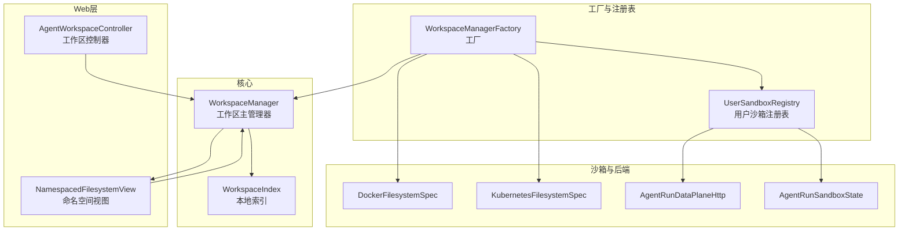
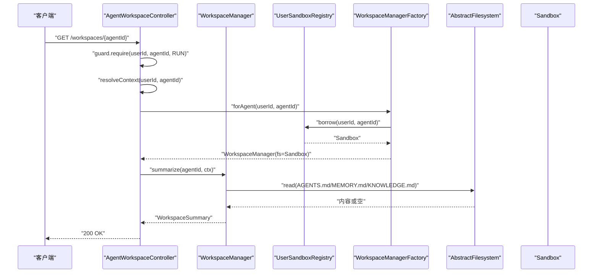
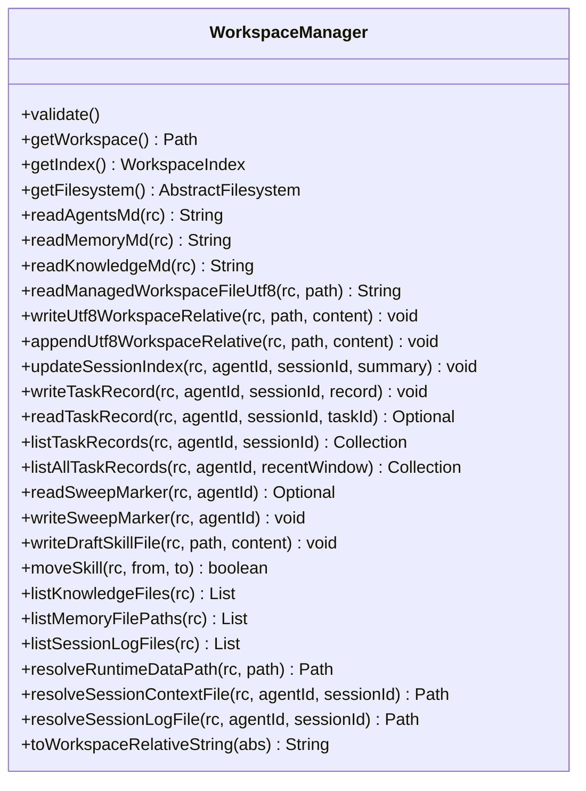
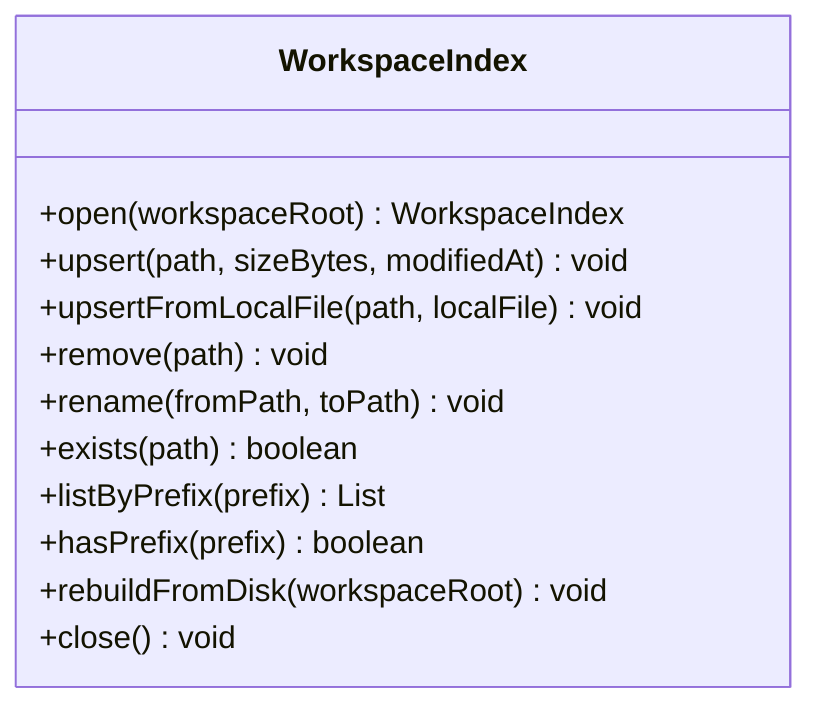
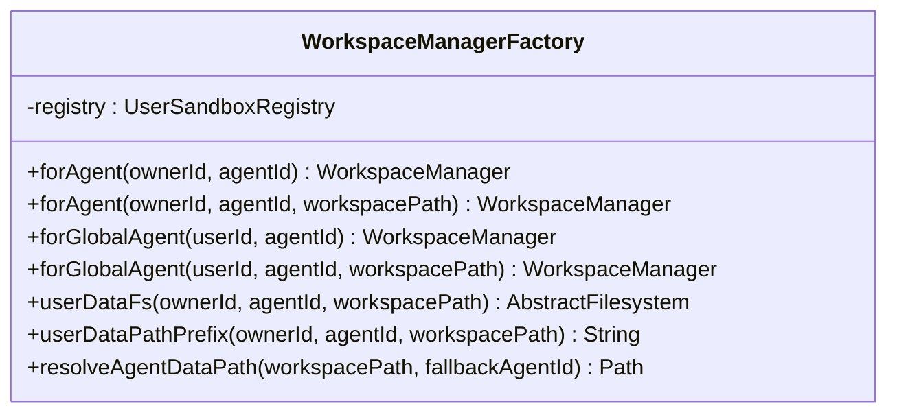
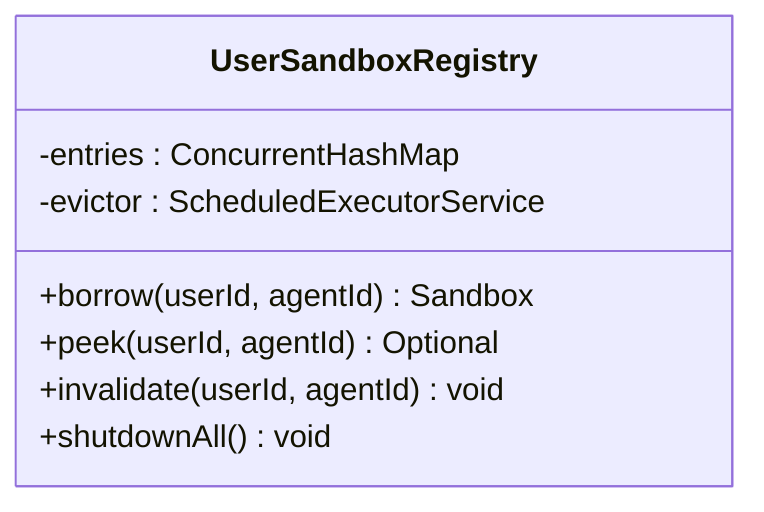
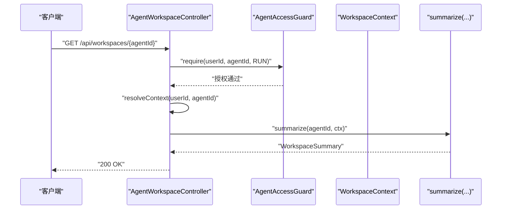
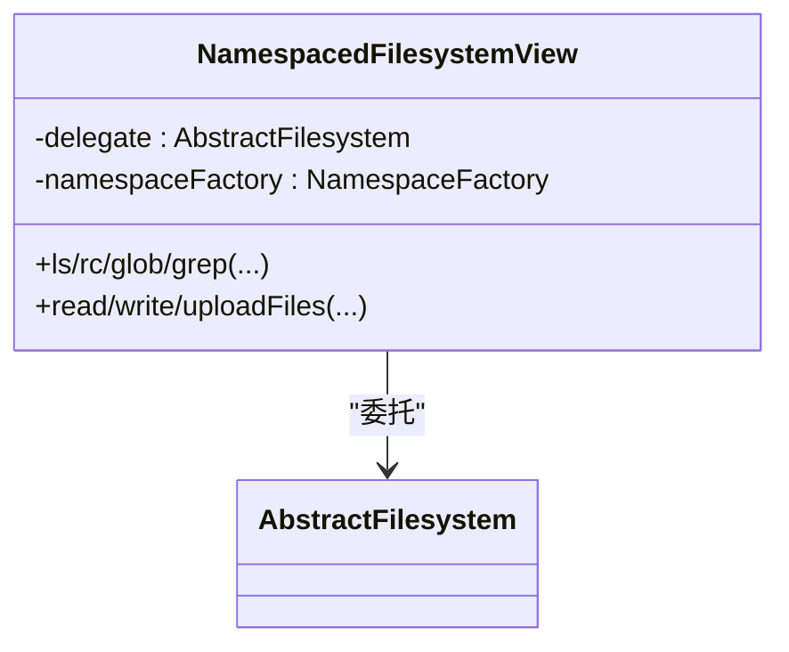
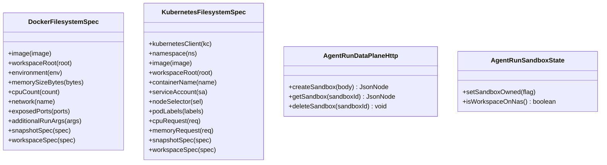
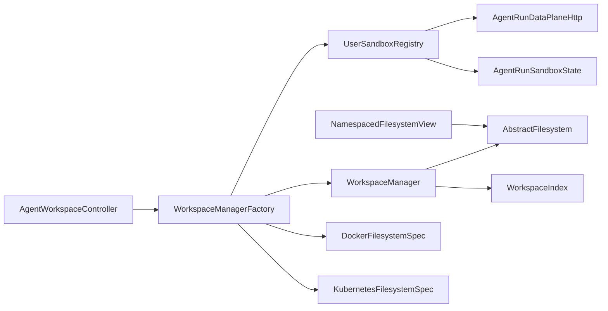

# Workspace管理器API

<cite>
**本文档引用的文件**
- [WorkspaceManager.java](file://agentscope-harness/src/main/java/io/agentscope/harness/agent/workspace/WorkspaceManager.java)
- [WorkspaceIndex.java](file://agentscope-harness/src/main/java/io/agentscope/harness/agent/workspace/WorkspaceIndex.java)
- [WorkspaceManagerFactory.java](file://agentscope-examples/agents/agentscope-dataagent/src/main/java/io/agentscope/dataagent/web/workspace/WorkspaceManagerFactory.java)
- [UserSandboxRegistry.java](file://agentscope-examples/agents/agentscope-dataagent/src/main/java/io/agentscope/dataagent/web/workspace/UserSandboxRegistry.java)
- [AgentWorkspaceController.java](file://agentscope-examples/agents/agentscope-builder/src/main/java/io/agentscope/builder/web/api/AgentWorkspaceController.java)
- [SharedWorkspacePaths.java](file://agentscope-examples/agents/agentscope-builder/src/main/java/io/agentscope/builder/web/workspace/SharedWorkspacePaths.java)
- [NamespacedFilesystemView.java](file://agentscope-examples/agents/agentscope-builder/src/main/java/io/agentscope/builder/web/workspace/NamespacedFilesystemView.java)
- [DockerFilesystemSpec.java](file://agentscope-extensions/agentscope-extensions-sandbox/agentscope-extensions-sandbox-docker/src/main/java/io/agentscope/extensions/sandbox/docker/DockerFilesystemSpec.java)
- [KubernetesFilesystemSpec.java](file://agentscope-extensions/agentscope-extensions-sandbox/agentscope-extensions-sandbox-kubernetes/src/main/java/io/agentscope/extensions/sandbox/kubernetes/KubernetesFilesystemSpec.java)
- [AgentRunDataPlaneHttp.java](file://agentscope-extensions/agentscope-extensions-sandbox/agentscope-extensions-sandbox-agentrun/src/main/java/io/agentscope/extensions/sandbox/agentrun/AgentRunDataPlaneHttp.java)
- [AgentRunSandboxState.java](file://agentscope-extensions/agentscope-extensions-sandbox/agentscope-extensions-sandbox-agentrun/src/main/java/io/agentscope/extensions/sandbox/agentrun/AgentRunSandboxState.java)
</cite>

## 目录
1. [简介](#简介)
2. [项目结构](#项目结构)
3. [核心组件](#核心组件)
4. [架构总览](#架构总览)
5. [详细组件分析](#详细组件分析)
6. [依赖分析](#依赖分析)
7. [性能考虑](#性能考虑)
8. [故障排查指南](#故障排查指南)
9. [结论](#结论)
10. [附录：API参考与使用示例](#附录api参考与使用示例)

## 简介
本文件面向Workspace管理器系统，提供完整的API文档与实现解析，覆盖以下主题：
- WorkspaceManager主管理器的生命周期管理、资源分配与状态监控
- WorkspaceLifecycleManager生命周期控制器的工作原理与管理策略（概念性说明）
- WorkspaceRegistry注册表的注册、查询与注销机制
- 工作区创建、启动、停止与销毁的完整API接口说明
- 多工作区实例管理、并发访问控制与状态监控的实际用法

本指南以代码级分析为基础，配合图示帮助读者快速理解系统架构与调用流程。

## 项目结构
Workspace管理器相关代码主要分布在以下模块：
- 核心管理与索引：agentscope-harness 中的 WorkspaceManager 与 WorkspaceIndex
- Web层工作区控制器：agentscope-builder 示例中的 AgentWorkspaceController
- 工作区工厂与沙箱注册表：agentscope-dataagent 示例中的 WorkspaceManagerFactory 与 UserSandboxRegistry
- 沙箱与文件系统适配：agentscope-extensions 下的 Docker/Kubernetes/AgentRun 等实现
- 命名空间视图：agentscope-builder 示例中的 NamespacedFilesystemView
- 共享工作区路径工具：agentscope-builder 示例中的 SharedWorkspacePaths

**图表来源**
- [WorkspaceManager.java:97-188](file://agentscope-harness/src/main/java/io/agentscope/harness/agent/workspace/WorkspaceManager.java#L97-L188)
- [WorkspaceIndex.java:50-100](file://agentscope-harness/src/main/java/io/agentscope/harness/agent/workspace/WorkspaceIndex.java#L50-L100)
- [AgentWorkspaceController.java:109-130](file://agentscope-examples/agents/agentscope-builder/src/main/java/io/agentscope/builder/web/api/AgentWorkspaceController.java#L109-L130)
- [WorkspaceManagerFactory.java:40-106](file://agentscope-examples/agents/agentscope-dataagent/src/main/java/io/agentscope/dataagent/web/workspace/WorkspaceManagerFactory.java#L40-L106)
- [UserSandboxRegistry.java:67-118](file://agentscope-examples/agents/agentscope-dataagent/src/main/java/io/agentscope/dataagent/web/workspace/UserSandboxRegistry.java#L67-L118)
- [DockerFilesystemSpec.java:28-118](file://agentscope-extensions/agentscope-extensions-sandbox/agentscope-extensions-sandbox-docker/src/main/java/io/agentscope/extensions/sandbox/docker/DockerFilesystemSpec.java#L28-L118)
- [KubernetesFilesystemSpec.java:26-119](file://agentscope-extensions/agentscope-extensions-sandbox/agentscope-extensions-sandbox-kubernetes/src/main/java/io/agentscope/extensions/sandbox/kubernetes/KubernetesFilesystemSpec.java#L26-L119)
- [AgentRunDataPlaneHttp.java:96-119](file://agentscope-extensions/agentscope-extensions-sandbox/agentscope-extensions-sandbox-agentrun/src/main/java/io/agentscope/extensions/sandbox/agentrun/AgentRunDataPlaneHttp.java#L96-L119)
- [AgentRunSandboxState.java:87-107](file://agentscope-extensions/agentscope-extensions-sandbox/agentscope-extensions-sandbox-agentrun/src/main/java/io/agentscope/extensions/sandbox/agentrun/AgentRunSandboxState.java#L87-L107)

**章节来源**
- [WorkspaceManager.java:97-188](file://agentscope-harness/src/main/java/io/agentscope/harness/agent/workspace/WorkspaceManager.java#L97-L188)
- [WorkspaceIndex.java:50-100](file://agentscope-harness/src/main/java/io/agentscope/harness/agent/workspace/WorkspaceIndex.java#L50-L100)
- [AgentWorkspaceController.java:109-130](file://agentscope-examples/agents/agentscope-builder/src/main/java/io/agentscope/builder/web/api/AgentWorkspaceController.java#L109-L130)
- [WorkspaceManagerFactory.java:40-106](file://agentscope-examples/agents/agentscope-dataagent/src/main/java/io/agentscope/dataagent/web/workspace/WorkspaceManagerFactory.java#L40-L106)
- [UserSandboxRegistry.java:67-118](file://agentscope-examples/agents/agentscope-dataagent/src/main/java/io/agentscope/dataagent/web/workspace/UserSandboxRegistry.java#L67-L118)

## 核心组件
- WorkspaceManager：工作区主管理器，负责两层读写路径（文件系统优先、本地回退）、会话与任务记录、知识与记忆文件列表、技能草稿与移动等。
- WorkspaceIndex：基于SQLite的最佳努力索引，加速远程后端下的路径枚举与存在性检查。
- WorkspaceManagerFactory：根据用户与代理生成隔离的 WorkspaceManager 实例，底层通过沙箱文件系统实现多租户隔离。
- UserSandboxRegistry：按用户+代理维度缓存并复用沙箱实例，支持空闲淘汰与失效刷新。
- AgentWorkspaceController：Web层控制器，提供工作区摘要、上下文解析与资源回收。
- NamespacedFilesystemView：对任意文件系统进行命名空间包装，透明地在每个路径前缀上加上命名空间段。
- Docker/Kubernetes/AgentRun 文件系统规格：定义不同后端的沙箱与工作区配置参数。

**章节来源**
- [WorkspaceManager.java:97-188](file://agentscope-harness/src/main/java/io/agentscope/harness/agent/workspace/WorkspaceManager.java#L97-L188)
- [WorkspaceIndex.java:50-100](file://agentscope-harness/src/main/java/io/agentscope/harness/agent/workspace/WorkspaceIndex.java#L50-L100)
- [WorkspaceManagerFactory.java:40-106](file://agentscope-examples/agents/agentscope-dataagent/src/main/java/io/agentscope/dataagent/web/workspace/WorkspaceManagerFactory.java#L40-L106)
- [UserSandboxRegistry.java:67-118](file://agentscope-examples/agents/agentscope-dataagent/src/main/java/io/agentscope/dataagent/web/workspace/UserSandboxRegistry.java#L67-L118)
- [AgentWorkspaceController.java:109-130](file://agentscope-examples/agents/agentscope-builder/src/main/java/io/agentscope/builder/web/api/AgentWorkspaceController.java#L109-L130)
- [NamespacedFilesystemView.java:52-61](file://agentscope-examples/agents/agentscope-builder/src/main/java/io/agentscope/builder/web/workspace/NamespacedFilesystemView.java#L52-L61)

## 架构总览
下图展示了从Web请求到工作区管理器与沙箱后端的整体交互：

**图表来源**
- [AgentWorkspaceController.java:122-130](file://agentscope-examples/agents/agentscope-builder/src/main/java/io/agentscope/builder/web/api/AgentWorkspaceController.java#L122-L130)
- [WorkspaceManagerFactory.java:52-67](file://agentscope-examples/agents/agentscope-dataagent/src/main/java/io/agentscope/dataagent/web/workspace/WorkspaceManagerFactory.java#L52-L67)
- [UserSandboxRegistry.java:125-140](file://agentscope-examples/agents/agentscope-dataagent/src/main/java/io/agentscope/dataagent/web/workspace/UserSandboxRegistry.java#L125-L140)
- [WorkspaceManager.java:247-259](file://agentscope-harness/src/main/java/io/agentscope/harness/agent/workspace/WorkspaceManager.java#L247-L259)

## 详细组件分析

### WorkspaceManager 主管理器
职责与能力：
- 两层读取：优先从抽象文件系统读取，失败则回退到本地磁盘
- 写入统一走抽象文件系统，保证跨节点一致性
- 列表合并：知识、记忆、会话日志等文件列表合并本地与远程结果并去重
- 并发控制：按路径加锁，保证同一文件的读→合并→写是原子的
- 任务与会话：提供任务记录的增删改查、会话索引更新、清扫标记维护
- 技能草稿与移动：针对远程后端的草稿写入与目录移动优化
- 路径解析：支持运行时命名空间解析与相对路径规范化

关键方法与行为（节选）：
- 读取与回退：readWithOverride、readTextThroughFilesystem、readFileQuietly
- 写入与追加：writeUtf8WorkspaceRelative、appendUtf8WorkspaceRelative
- 会话索引：updateSessionIndex
- 任务记录：writeTaskRecord、readTaskRecord、listTaskRecords、listAllTaskRecords
- 清扫标记：readSweepMarker、writeSweepMarker
- 技能草稿与移动：writeDraftSkillFile、moveSkill
- 列表聚合：listKnowledgeFiles、listMemoryFilePaths、listSessionLogFiles
- 路径解析：resolveRuntimeDataPath、resolveSessionContextFile、resolveSessionLogFile
- 辅助：toWorkspaceRelativeString、normalizeRelativePath

**图表来源**
- [WorkspaceManager.java:198-227](file://agentscope-harness/src/main/java/io/agentscope/harness/agent/workspace/WorkspaceManager.java#L198-L227)
- [WorkspaceManager.java:367-394](file://agentscope-harness/src/main/java/io/agentscope/harness/agent/workspace/WorkspaceManager.java#L367-L394)
- [WorkspaceManager.java:403-434](file://agentscope-harness/src/main/java/io/agentscope/harness/agent/workspace/WorkspaceManager.java#L403-L434)
- [WorkspaceManager.java:445-525](file://agentscope-harness/src/main/java/io/agentscope/harness/agent/workspace/WorkspaceManager.java#L445-L525)
- [WorkspaceManager.java:605-629](file://agentscope-harness/src/main/java/io/agentscope/harness/agent/workspace/WorkspaceManager.java#L605-L629)
- [WorkspaceManager.java:770-790](file://agentscope-harness/src/main/java/io/agentscope/harness/agent/workspace/WorkspaceManager.java#L770-L790)
- [WorkspaceManager.java:937-1015](file://agentscope-harness/src/main/java/io/agentscope/harness/agent/workspace/WorkspaceManager.java#L937-L1015)

**章节来源**
- [WorkspaceManager.java:198-227](file://agentscope-harness/src/main/java/io/agentscope/harness/agent/workspace/WorkspaceManager.java#L198-L227)
- [WorkspaceManager.java:367-394](file://agentscope-harness/src/main/java/io/agentscope/harness/agent/workspace/WorkspaceManager.java#L367-L394)
- [WorkspaceManager.java:403-434](file://agentscope-harness/src/main/java/io/agentscope/harness/agent/workspace/WorkspaceManager.java#L403-L434)
- [WorkspaceManager.java:445-525](file://agentscope-harness/src/main/java/io/agentscope/harness/agent/workspace/WorkspaceManager.java#L445-L525)
- [WorkspaceManager.java:605-629](file://agentscope-harness/src/main/java/io/agentscope/harness/agent/workspace/WorkspaceManager.java#L605-L629)
- [WorkspaceManager.java:770-790](file://agentscope-harness/src/main/java/io/agentscope/harness/agent/workspace/WorkspaceManager.java#L770-L790)
- [WorkspaceManager.java:937-1015](file://agentscope-harness/src/main/java/io/agentscope/harness/agent/workspace/WorkspaceManager.java#L937-L1015)

### WorkspaceIndex 本地索引
职责与能力：
- 最佳努力的SQLite索引，跟踪特定前缀下的文件存在性与元数据
- 提供 exists/listByPrefix/hasPrefix 等高效查询，避免远程全量扫描
- 支持重建、重命名、删除等维护操作
- 线程安全：由SQLite内部事务序列化并发写入

**图表来源**
- [WorkspaceIndex.java:82-96](file://agentscope-harness/src/main/java/io/agentscope/harness/agent/workspace/WorkspaceIndex.java#L82-L96)
- [WorkspaceIndex.java:142-187](file://agentscope-harness/src/main/java/io/agentscope/harness/agent/workspace/WorkspaceIndex.java#L142-L187)
- [WorkspaceIndex.java:235-294](file://agentscope-harness/src/main/java/io/agentscope/harness/agent/workspace/WorkspaceIndex.java#L235-L294)
- [WorkspaceIndex.java:309-338](file://agentscope-harness/src/main/java/io/agentscope/harness/agent/workspace/WorkspaceIndex.java#L309-L338)
- [WorkspaceIndex.java:344-351](file://agentscope-harness/src/main/java/io/agentscope/harness/agent/workspace/WorkspaceIndex.java#L344-L351)

**章节来源**
- [WorkspaceIndex.java:82-96](file://agentscope-harness/src/main/java/io/agentscope/harness/agent/workspace/WorkspaceIndex.java#L82-L96)
- [WorkspaceIndex.java:142-187](file://agentscope-harness/src/main/java/io/agentscope/harness/agent/workspace/WorkspaceIndex.java#L142-L187)
- [WorkspaceIndex.java:235-294](file://agentscope-harness/src/main/java/io/agentscope/harness/agent/workspace/WorkspaceIndex.java#L235-L294)
- [WorkspaceIndex.java:309-338](file://agentscope-harness/src/main/java/io/agentscope/harness/agent/workspace/WorkspaceIndex.java#L309-L338)
- [WorkspaceIndex.java:344-351](file://agentscope-harness/src/main/java/io/agentscope/harness/agent/workspace/WorkspaceIndex.java#L344-L351)

### WorkspaceManagerFactory 工厂
职责与能力：
- 为指定用户与代理返回隔离的 WorkspaceManager
- 通过 UserSandboxRegistry 借用/启动沙箱，确保容器级隔离
- 支持全局代理与用户代理两种入口
- 路径解析兼容旧版本行为，保持审计与显示一致性

**图表来源**
- [WorkspaceManagerFactory.java:40-106](file://agentscope-examples/agents/agentscope-dataagent/src/main/java/io/agentscope/dataagent/web/workspace/WorkspaceManagerFactory.java#L40-L106)
- [WorkspaceManagerFactory.java:121-141](file://agentscope-examples/agents/agentscope-dataagent/src/main/java/io/agentscope/dataagent/web/workspace/WorkspaceManagerFactory.java#L121-L141)

**章节来源**
- [WorkspaceManagerFactory.java:40-106](file://agentscope-examples/agents/agentscope-dataagent/src/main/java/io/agentscope/dataagent/web/workspace/WorkspaceManagerFactory.java#L40-L106)
- [WorkspaceManagerFactory.java:121-141](file://agentscope-examples/agents/agentscope-dataagent/src/main/java/io/agentscope/dataagent/web/workspace/WorkspaceManagerFactory.java#L121-L141)

### UserSandboxRegistry 注册表
职责与能力：
- 按用户+代理维度缓存并复用沙箱实例
- 支持空闲淘汰、失效刷新、优雅关闭
- 并发安全：键值计算采用线程安全的映射与调度器
- 多副本部署需粘性负载均衡，避免跨节点重复创建

**图表来源**
- [UserSandboxRegistry.java:125-140](file://agentscope-examples/agents/agentscope-dataagent/src/main/java/io/agentscope/dataagent/web/workspace/UserSandboxRegistry.java#L125-L140)
- [UserSandboxRegistry.java:171-195](file://agentscope-examples/agents/agentscope-dataagent/src/main/java/io/agentscope/dataagent/web/workspace/UserSandboxRegistry.java#L171-L195)
- [UserSandboxRegistry.java:222-229](file://agentscope-examples/agents/agentscope-dataagent/src/main/java/io/agentscope/dataagent/web/workspace/UserSandboxRegistry.java#L222-L229)

**章节来源**
- [UserSandboxRegistry.java:125-140](file://agentscope-examples/agents/agentscope-dataagent/src/main/java/io/agentscope/dataagent/web/workspace/UserSandboxRegistry.java#L125-L140)
- [UserSandboxRegistry.java:171-195](file://agentscope-examples/agents/agentscope-dataagent/src/main/java/io/agentscope/dataagent/web/workspace/UserSandboxRegistry.java#L171-L195)
- [UserSandboxRegistry.java:222-229](file://agentscope-examples/agents/agentscope-dataagent/src/main/java/io/agentscope/dataagent/web/workspace/UserSandboxRegistry.java#L222-L229)

### AgentWorkspaceController 控制器
职责与能力：
- 提供工作区摘要接口，校验权限后解析上下文并汇总关键指标
- 解析工作区路径与上下文，确保资源在使用后正确关闭

**图表来源**
- [AgentWorkspaceController.java:122-130](file://agentscope-examples/agents/agentscope-builder/src/main/java/io/agentscope/builder/web/api/AgentWorkspaceController.java#L122-L130)
- [AgentWorkspaceController.java:675-696](file://agentscope-examples/agents/agentscope-builder/src/main/java/io/agentscope/builder/web/api/AgentWorkspaceController.java#L675-L696)

**章节来源**
- [AgentWorkspaceController.java:122-130](file://agentscope-examples/agents/agentscope-builder/src/main/java/io/agentscope/builder/web/api/AgentWorkspaceController.java#L122-L130)
- [AgentWorkspaceController.java:675-696](file://agentscope-examples/agents/agentscope-builder/src/main/java/io/agentscope/builder/web/api/AgentWorkspaceController.java#L675-L696)

### NamespacedFilesystemView 命名空间视图
职责与能力：
- 对任意 AbstractFilesystem 进行包装，在所有路径前自动添加命名空间段
- 通过 NamespaceFactory 在运行时注入用户/会话标识，实现逻辑子树隔离
- 防止路径穿越，所有输入均经过路径合法性校验

**图表来源**
- [NamespacedFilesystemView.java:52-61](file://agentscope-examples/agents/agentscope-builder/src/main/java/io/agentscope/builder/web/workspace/NamespacedFilesystemView.java#L52-L61)

**章节来源**
- [NamespacedFilesystemView.java:52-61](file://agentscope-examples/agents/agentscope-builder/src/main/java/io/agentscope/builder/web/workspace/NamespacedFilesystemView.java#L52-L61)

### 沙箱与后端适配
- DockerFilesystemSpec：定义Docker沙箱的镜像、资源、网络、工作区根等参数
- KubernetesFilesystemSpec：定义Kubernetes Pod沙箱的命名空间、镜像、资源请求、标签等参数
- AgentRunDataPlaneHttp：与AgentRun数据平面交互，创建/查询/删除沙箱
- AgentRunSandboxState：沙箱状态，包含持久化模式、工作区根、域等

**图表来源**
- [DockerFilesystemSpec.java:28-118](file://agentscope-extensions/agentscope-extensions-sandbox/agentscope-extensions-sandbox-docker/src/main/java/io/agentscope/extensions/sandbox/docker/DockerFilesystemSpec.java#L28-L118)
- [KubernetesFilesystemSpec.java:26-119](file://agentscope-extensions/agentscope-extensions-sandbox/agentscope-extensions-sandbox-kubernetes/src/main/java/io/agentscope/extensions/sandbox/kubernetes/KubernetesFilesystemSpec.java#L26-L119)
- [AgentRunDataPlaneHttp.java:96-119](file://agentscope-extensions/agentscope-extensions-sandbox/agentscope-extensions-sandbox-agentrun/src/main/java/io/agentscope/extensions/sandbox/agentrun/AgentRunDataPlaneHttp.java#L96-L119)
- [AgentRunSandboxState.java:87-107](file://agentscope-extensions/agentscope-extensions-sandbox/agentscope-extensions-sandbox-agentrun/src/main/java/io/agentscope/extensions/sandbox/agentrun/AgentRunSandboxState.java#L87-L107)

**章节来源**
- [DockerFilesystemSpec.java:28-118](file://agentscope-extensions/agentscope-extensions-sandbox/agentscope-extensions-sandbox-docker/src/main/java/io/agentscope/extensions/sandbox/docker/DockerFilesystemSpec.java#L28-L118)
- [KubernetesFilesystemSpec.java:26-119](file://agentscope-extensions/agentscope-extensions-sandbox/agentscope-extensions-sandbox-kubernetes/src/main/java/io/agentscope/extensions/sandbox/kubernetes/KubernetesFilesystemSpec.java#L26-L119)
- [AgentRunDataPlaneHttp.java:96-119](file://agentscope-extensions/agentscope-extensions-sandbox/agentscope-extensions-sandbox-agentrun/src/main/java/io/agentscope/extensions/sandbox/agentrun/AgentRunDataPlaneHttp.java#L96-L119)
- [AgentRunSandboxState.java:87-107](file://agentscope-extensions/agentscope-extensions-sandbox/agentscope-extensions-sandbox-agentrun/src/main/java/io/agentscope/extensions/sandbox/agentrun/AgentRunSandboxState.java#L87-L107)

## 依赖分析
- WorkspaceManager 依赖 AbstractFilesystem 作为统一读写后端，并通过 WorkspaceIndex 提升远程场景下的枚举效率
- WorkspaceManagerFactory 依赖 UserSandboxRegistry 获取沙箱实例，再封装为 WorkspaceManager
- AgentWorkspaceController 依赖 WorkspaceManagerFactory 与权限守卫，负责对外暴露工作区摘要
- NamespacedFilesystemView 依赖 NamespaceFactory，为任意文件系统注入命名空间
- 沙箱适配器（Docker/Kubernetes/AgentRun）为工厂与注册表提供后端能力

**图表来源**
- [WorkspaceManager.java:118-124](file://agentscope-harness/src/main/java/io/agentscope/harness/agent/workspace/WorkspaceManager.java#L118-L124)
- [WorkspaceManagerFactory.java:64-66](file://agentscope-examples/agents/agentscope-dataagent/src/main/java/io/agentscope/dataagent/web/workspace/WorkspaceManagerFactory.java#L64-L66)
- [UserSandboxRegistry.java:234-251](file://agentscope-examples/agents/agentscope-dataagent/src/main/java/io/agentscope/dataagent/web/workspace/UserSandboxRegistry.java#L234-L251)
- [AgentWorkspaceController.java:109-116](file://agentscope-examples/agents/agentscope-builder/src/main/java/io/agentscope/builder/web/api/AgentWorkspaceController.java#L109-L116)
- [NamespacedFilesystemView.java:57-61](file://agentscope-examples/agents/agentscope-builder/src/main/java/io/agentscope/builder/web/workspace/NamespacedFilesystemView.java#L57-L61)
- [DockerFilesystemSpec.java:100-102](file://agentscope-extensions/agentscope-extensions-sandbox/agentscope-extensions-sandbox-docker/src/main/java/io/agentscope/extensions/sandbox/docker/DockerFilesystemSpec.java#L100-L102)
- [KubernetesFilesystemSpec.java:101-103](file://agentscope-extensions/agentscope-extensions-sandbox/agentscope-extensions-sandbox-kubernetes/src/main/java/io/agentscope/extensions/sandbox/kubernetes/KubernetesFilesystemSpec.java#L101-L103)
- [AgentRunDataPlaneHttp.java:96-103](file://agentscope-extensions/agentscope-extensions-sandbox/agentscope-extensions-sandbox-agentrun/src/main/java/io/agentscope/extensions/sandbox/agentrun/AgentRunDataPlaneHttp.java#L96-L103)

**章节来源**
- [WorkspaceManager.java:118-124](file://agentscope-harness/src/main/java/io/agentscope/harness/agent/workspace/WorkspaceManager.java#L118-L124)
- [WorkspaceManagerFactory.java:64-66](file://agentscope-examples/agents/agentscope-dataagent/src/main/java/io/agentscope/dataagent/web/workspace/WorkspaceManagerFactory.java#L64-L66)
- [UserSandboxRegistry.java:234-251](file://agentscope-examples/agents/agentscope-dataagent/src/main/java/io/agentscope/dataagent/web/workspace/UserSandboxRegistry.java#L234-L251)
- [AgentWorkspaceController.java:109-116](file://agentscope-examples/agents/agentscope-builder/src/main/java/io/agentscope/builder/web/api/AgentWorkspaceController.java#L109-L116)
- [NamespacedFilesystemView.java:57-61](file://agentscope-examples/agents/agentscope-builder/src/main/java/io/agentscope/builder/web/workspace/NamespacedFilesystemView.java#L57-L61)
- [DockerFilesystemSpec.java:100-102](file://agentscope-extensions/agentscope-extensions-sandbox/agentscope-extensions-sandbox-docker/src/main/java/io/agentscope/extensions/sandbox/docker/DockerFilesystemSpec.java#L100-L102)
- [KubernetesFilesystemSpec.java:101-103](file://agentscope-extensions/agentscope-extensions-sandbox/agentscope-extensions-sandbox-kubernetes/src/main/java/io/agentscope/extensions/sandbox/kubernetes/KubernetesFilesystemSpec.java#L101-L103)
- [AgentRunDataPlaneHttp.java:96-103](file://agentscope-extensions/agentscope-extensions-sandbox/agentscope-extensions-sandbox-agentrun/src/main/java/io/agentscope/extensions/sandbox/agentrun/AgentRunDataPlaneHttp.java#L96-L103)

## 性能考虑
- 两层读取与写入：优先使用抽象文件系统，减少本地磁盘IO；索引仅存储路径与元数据，不存储内容，避免额外带宽
- 并发控制：按路径加锁，避免竞态；远程后端还需服务端CAS/乐观锁保障跨进程一致性
- 列表合并：对知识、记忆、会话日志等进行去重与合并，降低重复遍历成本
- 索引重建：在本地磁盘重建索引时批量写入，减少事务开销
- 沙箱复用：UserSandboxRegistry 缓存沙箱，避免冷启动与重复创建

[本节为通用指导，无需具体文件分析]

## 故障排查指南
常见问题与定位建议：
- 工作区不存在或关键文件缺失：调用 validate() 后查看日志警告
- 写入失败或路径越界：检查 writeUtf8WorkspaceRelative/appendUtf8WorkspaceRelative 的路径规范化与越界保护
- 会话索引更新异常：确认 updateSessionIndex 的JSON解析与序列化错误日志
- 任务记录损坏：readTaskMapLocked 在解析失败时返回空视图并记录错误，避免污染
- 清扫标记写入失败：writeSweepMarker 记录警告，检查后端可写性
- 沙箱创建/删除异常：查看 AgentRunDataPlaneHttp 的HTTP响应码与消息

**章节来源**
- [WorkspaceManager.java:198-222](file://agentscope-harness/src/main/java/io/agentscope/harness/agent/workspace/WorkspaceManager.java#L198-L222)
- [WorkspaceManager.java:367-394](file://agentscope-harness/src/main/java/io/agentscope/harness/agent/workspace/WorkspaceManager.java#L367-L394)
- [WorkspaceManager.java:403-434](file://agentscope-harness/src/main/java/io/agentscope/harness/agent/workspace/WorkspaceManager.java#L403-L434)
- [WorkspaceManager.java:645-662](file://agentscope-harness/src/main/java/io/agentscope/harness/agent/workspace/WorkspaceManager.java#L645-L662)
- [WorkspaceManager.java:619-629](file://agentscope-harness/src/main/java/io/agentscope/harness/agent/workspace/WorkspaceManager.java#L619-L629)
- [AgentRunDataPlaneHttp.java:109-119](file://agentscope-extensions/agentscope-extensions-sandbox/agentscope-extensions-sandbox-agentrun/src/main/java/io/agentscope/extensions/sandbox/agentrun/AgentRunDataPlaneHttp.java#L109-L119)

## 结论
Workspace管理器通过“抽象文件系统 + 命名空间 + 沙箱隔离 + 本地索引”的组合，实现了高可用、可扩展且多租户友好的工作区管理能力。结合工厂与注册表，系统在Web层与运行时之间提供了清晰的边界与一致的语义，适合在分布式与多副本环境下稳定运行。

[本节为总结性内容，无需具体文件分析]

## 附录：API参考与使用示例

### 工作区生命周期与状态监控
- 创建与验证
  - validate()：校验工作区目录与关键文件是否存在，必要时发出警告
  - getWorkspace()：返回工作区根路径（用于显示/审计）
- 生命周期结束
  - close()：当管理器拥有索引时释放SQLite连接

**章节来源**
- [WorkspaceManager.java:198-227](file://agentscope-harness/src/main/java/io/agentscope/harness/agent/workspace/WorkspaceManager.java#L198-L227)
- [WorkspaceManager.java:174-179](file://agentscope-harness/src/main/java/io/agentscope/harness/agent/workspace/WorkspaceManager.java#L174-L179)

### 资源分配与命名空间
- 命名空间解析
  - resolveRuntimeDataPath(rc, relativePath)：按运行时上下文生成命名空间路径
- 文件系统访问
  - getFilesystem()：获取抽象文件系统实例
  - getNamespaceFactory()：获取命名空间工厂

**章节来源**
- [WorkspaceManager.java:235-244](file://agentscope-harness/src/main/java/io/agentscope/harness/agent/workspace/WorkspaceManager.java#L235-L244)
- [WorkspaceManager.java:181-192](file://agentscope-harness/src/main/java/io/agentscope/harness/agent/workspace/WorkspaceManager.java#L181-L192)

### 读写与并发控制
- 读取
  - readAgentsMd(rc)/readMemoryMd(rc)/readKnowledgeMd(rc)
  - readManagedWorkspaceFileUtf8(rc, path)
- 写入
  - writeUtf8WorkspaceRelative(rc, path, content)
  - appendUtf8WorkspaceRelative(rc, path, content)
- 并发
  - 按路径加锁，保证同一文件的读→合并→写原子性

**章节来源**
- [WorkspaceManager.java:247-259](file://agentscope-harness/src/main/java/io/agentscope/harness/agent/workspace/WorkspaceManager.java#L247-L259)
- [WorkspaceManager.java:265-278](file://agentscope-harness/src/main/java/io/agentscope/harness/agent/workspace/WorkspaceManager.java#L265-L278)
- [WorkspaceManager.java:367-394](file://agentscope-harness/src/main/java/io/agentscope/harness/agent/workspace/WorkspaceManager.java#L367-L394)
- [WorkspaceManager.java:376-393](file://agentscope-harness/src/main/java/io/agentscope/harness/agent/workspace/WorkspaceManager.java#L376-L393)

### 会话与任务记录
- 会话索引
  - updateSessionIndex(rc, agentId, sessionId, summary)
- 任务记录
  - writeTaskRecord(rc, agentId, sessionId, record)
  - readTaskRecord(rc, agentId, sessionId, taskId)
  - listTaskRecords(rc, agentId, sessionId)
  - listAllTaskRecords(rc, agentId, recentWindow)
- 清扫标记
  - readSweepMarker(rc, agentId)
  - writeSweepMarker(rc, agentId)

**章节来源**
- [WorkspaceManager.java:403-434](file://agentscope-harness/src/main/java/io/agentscope/harness/agent/workspace/WorkspaceManager.java#L403-L434)
- [WorkspaceManager.java:445-525](file://agentscope-harness/src/main/java/io/agentscope/harness/agent/workspace/WorkspaceManager.java#L445-L525)
- [WorkspaceManager.java:605-629](file://agentscope-harness/src/main/java/io/agentscope/harness/agent/workspace/WorkspaceManager.java#L605-L629)

### 技能草稿与移动
- 草稿写入
  - writeDraftSkillFile(rc, relativePath, content)
- 目录移动
  - moveSkill(rc, fromRelative, toRelative)

**章节来源**
- [WorkspaceManager.java:770-790](file://agentscope-harness/src/main/java/io/agentscope/harness/agent/workspace/WorkspaceManager.java#L770-L790)
- [WorkspaceManager.java:797-816](file://agentscope-harness/src/main/java/io/agentscope/harness/agent/workspace/WorkspaceManager.java#L797-L816)

### 列表与路径工具
- 列表
  - listKnowledgeFiles(rc)
  - listMemoryFilePaths(rc)
  - listSessionLogFiles(rc)
- 路径
  - resolveSessionContextFile/rc/LogFile
  - toWorkspaceRelativeString(abs)

**章节来源**
- [WorkspaceManager.java:293-330](file://agentscope-harness/src/main/java/io/agentscope/harness/agent/workspace/WorkspaceManager.java#L293-L330)
- [WorkspaceManager.java:937-1015](file://agentscope-harness/src/main/java/io/agentscope/harness/agent/workspace/WorkspaceManager.java#L937-L1015)
- [WorkspaceManager.java:347-356](file://agentscope-harness/src/main/java/io/agentscope/harness/agent/workspace/WorkspaceManager.java#L347-L356)
- [WorkspaceManager.java:1018-1023](file://agentscope-harness/src/main/java/io/agentscope/harness/agent/workspace/WorkspaceManager.java#L1018-L1023)

### 工作区工厂与注册表
- 工厂
  - forAgent/forGlobalAgent：返回隔离的 WorkspaceManager
  - userDataFs：直接返回用户数据的文件系统视图
  - resolveAgentDataPath：解析宿主机数据根路径
- 注册表
  - borrow/peek/invalidate/shutdownAll：借出/窥视/失效/关闭

**章节来源**
- [WorkspaceManagerFactory.java:52-82](file://agentscope-examples/agents/agentscope-dataagent/src/main/java/io/agentscope/dataagent/web/workspace/WorkspaceManagerFactory.java#L52-L82)
- [WorkspaceManagerFactory.java:90-106](file://agentscope-examples/agents/agentscope-dataagent/src/main/java/io/agentscope/dataagent/web/workspace/WorkspaceManagerFactory.java#L90-L106)
- [WorkspaceManagerFactory.java:121-141](file://agentscope-examples/agents/agentscope-dataagent/src/main/java/io/agentscope/dataagent/web/workspace/WorkspaceManagerFactory.java#L121-L141)
- [UserSandboxRegistry.java:125-156](file://agentscope-examples/agents/agentscope-dataagent/src/main/java/io/agentscope/dataagent/web/workspace/UserSandboxRegistry.java#L125-L156)
- [UserSandboxRegistry.java:171-195](file://agentscope-examples/agents/agentscope-dataagent/src/main/java/io/agentscope/dataagent/web/workspace/UserSandboxRegistry.java#L171-L195)
- [UserSandboxRegistry.java:222-229](file://agentscope-examples/agents/agentscope-dataagent/src/main/java/io/agentscope/dataagent/web/workspace/UserSandboxRegistry.java#L222-L229)

### Web层摘要接口
- 摘要
  - GET /api/workspaces/{agentId}：返回 WorkspaceSummary，包含关键文件存在性与计数

**章节来源**
- [AgentWorkspaceController.java:122-130](file://agentscope-examples/agents/agentscope-builder/src/main/java/io/agentscope/builder/web/api/AgentWorkspaceController.java#L122-L130)
- [AgentWorkspaceController.java:933-959](file://agentscope-examples/agents/agentscope-builder/src/main/java/io/agentscope/builder/web/api/AgentWorkspaceController.java#L933-L959)

### 命名空间与共享路径
- 命名空间视图
  - NamespacedFilesystemView：透明注入命名空间
- 共享工作区路径
  - SharedWorkspacePaths：解析平台级共享根路径

**章节来源**
- [NamespacedFilesystemView.java:52-61](file://agentscope-examples/agents/agentscope-builder/src/main/java/io/agentscope/builder/web/workspace/NamespacedFilesystemView.java#L52-L61)
- [SharedWorkspacePaths.java:31-43](file://agentscope-examples/agents/agentscope-builder/src/main/java/io/agentscope/builder/web/workspace/SharedWorkspacePaths.java#L31-L43)

### 沙箱与后端配置
- Docker
  - image/workspaceRoot/environment/memorySizeBytes/cpuCount/network/exposedPorts/additionalRunArgs/snapshotSpec/workspaceSpec
- Kubernetes
  - kubernetesClient/namespace/image/workspaceRoot/containerName/serviceAccount/nodeSelector/podLabels/cpuRequest/memoryRequest/snapshotSpec/workspaceSpec
- AgentRun
  - create/get/delete 沙箱；SandboxState 包含持久化模式与NAS标志

**章节来源**
- [DockerFilesystemSpec.java:43-97](file://agentscope-extensions/agentscope-extensions-sandbox/agentscope-extensions-sandbox-docker/src/main/java/io/agentscope/extensions/sandbox/docker/DockerFilesystemSpec.java#L43-L97)
- [KubernetesFilesystemSpec.java:40-98](file://agentscope-extensions/agentscope-extensions-sandbox/agentscope-extensions-sandbox-kubernetes/src/main/java/io/agentscope/extensions/sandbox/kubernetes/KubernetesFilesystemSpec.java#L40-L98)
- [AgentRunDataPlaneHttp.java:96-119](file://agentscope-extensions/agentscope-extensions-sandbox/agentscope-extensions-sandbox-agentrun/src/main/java/io/agentscope/extensions/sandbox/agentrun/AgentRunDataPlaneHttp.java#L96-L119)
- [AgentRunSandboxState.java:87-107](file://agentscope-extensions/agentscope-extensions-sandbox/agentscope-extensions-sandbox-agentrun/src/main/java/io/agentscope/extensions/sandbox/agentrun/AgentRunSandboxState.java#L87-L107)