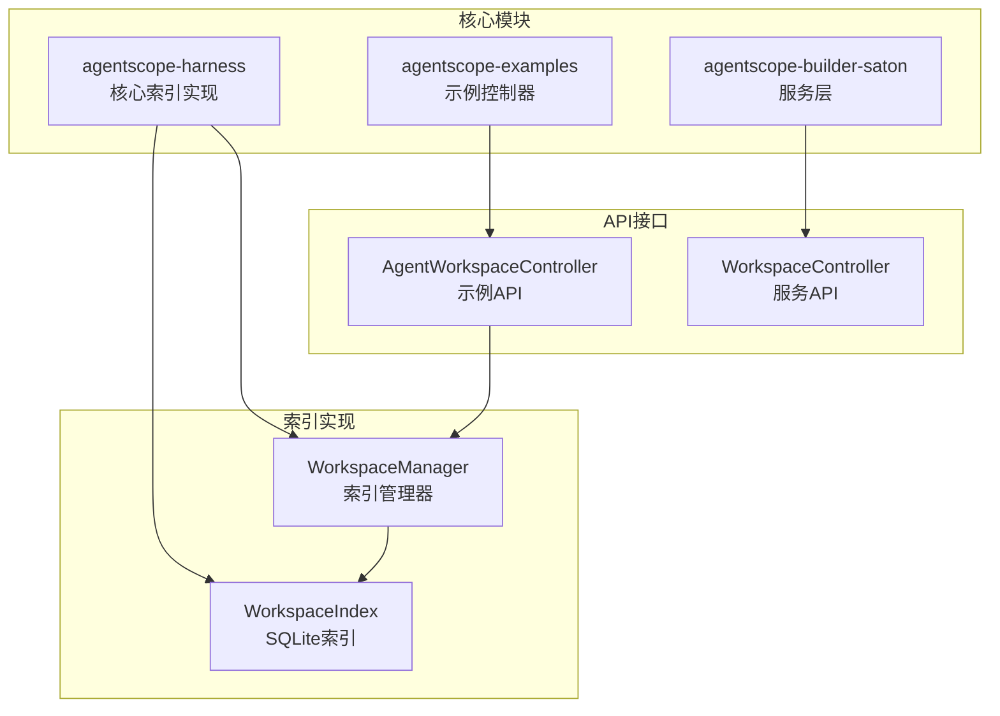
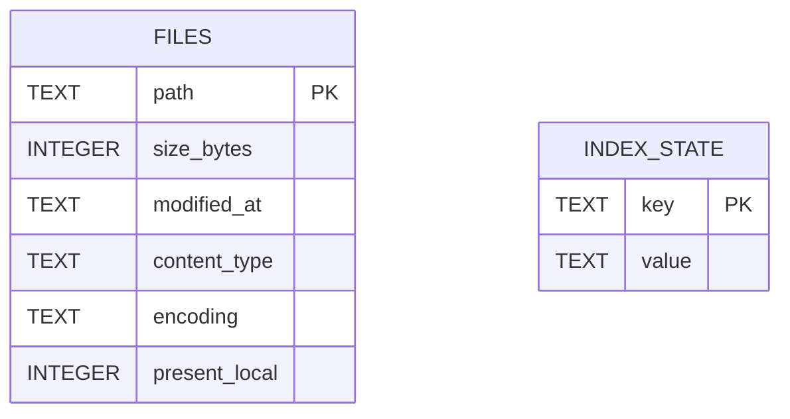
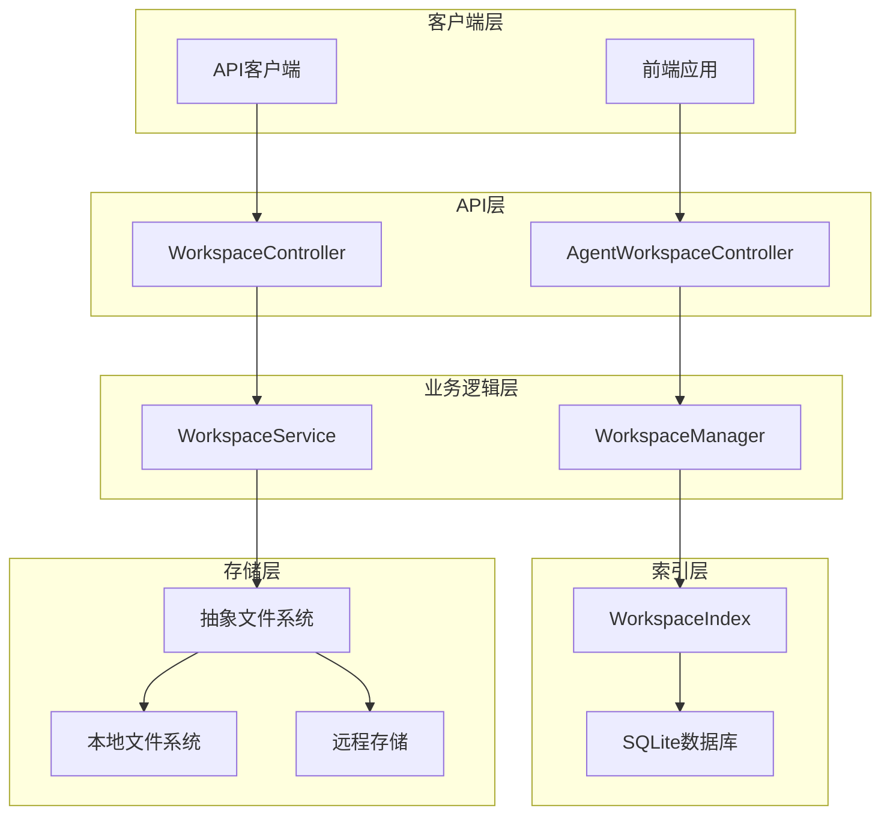
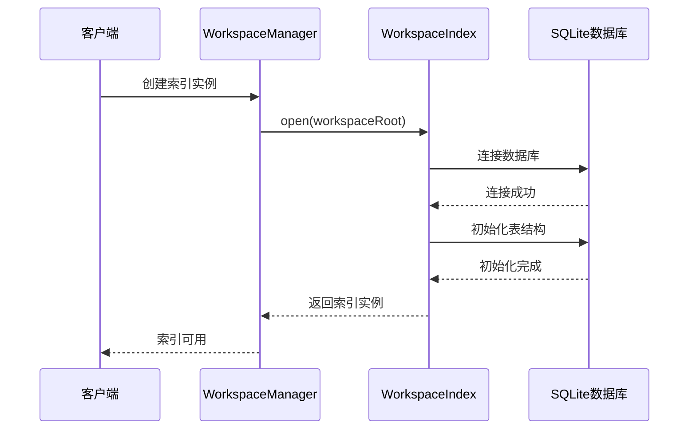
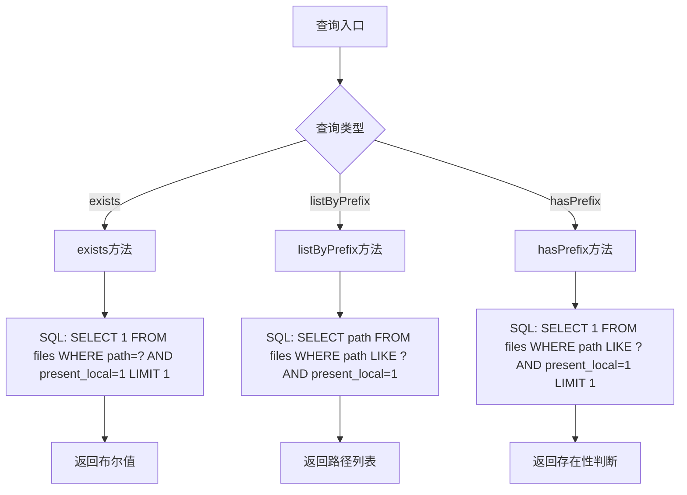
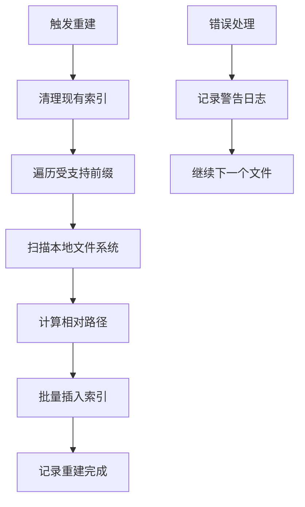
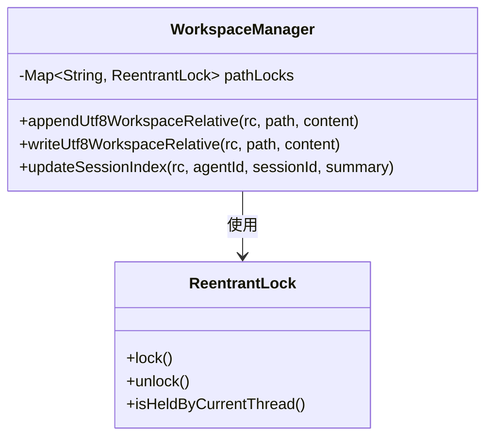
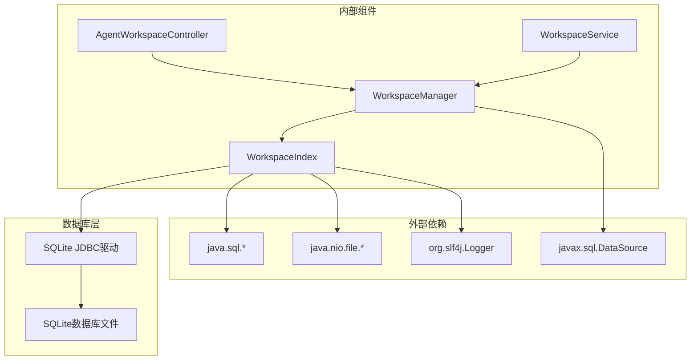

# Workspace索引管理API

<cite>
**本文档引用的文件**
- [WorkspaceIndex.java](file://agentscope-harness/src/main/java/io/agentscope/harness/agent/workspace/WorkspaceIndex.java)
- [WorkspaceManager.java](file://agentscope-harness/src/main/java/io/agentscope/harness/agent/workspace/WorkspaceManager.java)
- [AgentWorkspaceController.java](file://agentscope-examples/agents/agentscope-builder/src/main/java/io/agentscope/builder/web/api/AgentWorkspaceController.java)
- [WorkspaceService.java](file://agentscope-builder-saton/src/main/java/io/agentscope/builder/saton/workspace/service/WorkspaceService.java)
- [WorkspaceController.java](file://agentscope-builder-saton/src/main/java/io/agentscope/builder/saton/workspace/controller/WorkspaceController.java)
</cite>

## 目录
1. [简介](#简介)
2. [项目结构](#项目结构)
3. [核心组件](#核心组件)
4. [架构概览](#架构概览)
5. [详细组件分析](#详细组件分析)
6. [依赖关系分析](#依赖关系分析)
7. [性能考虑](#性能考虑)
8. [故障排除指南](#故障排除指南)
9. [结论](#结论)

## 简介

Workspace索引管理系统是Agentscope Java项目中一个关键的基础设施组件，负责为工作区文件提供高性能的索引和查询能力。该系统通过SQLite数据库实现了一个本地文件索引，专门针对工作区中的特定目录（agents/和memory/）进行优化，以支持快速的文件存在性检查、前缀匹配和文件列表操作。

该系统采用"最佳努力"（best-effort）的一致性模型，确保在远程存储模式下也能提供快速的文件枚举和查询能力，同时保持与远程存储的最终一致性。

## 项目结构

Workspace索引管理系统主要分布在以下模块中：

**图表来源**
- [WorkspaceIndex.java:1-373](file://agentscope-harness/src/main/java/io/agentscope/harness/agent/workspace/WorkspaceIndex.java#L1-L373)
- [WorkspaceManager.java:1-1025](file://agentscope-harness/src/main/java/io/agentscope/harness/agent/workspace/WorkspaceManager.java#L1-L1025)

**章节来源**
- [WorkspaceIndex.java:1-373](file://agentscope-harness/src/main/java/io/agentscope/harness/agent/workspace/WorkspaceIndex.java#L1-L373)
- [WorkspaceManager.java:1-1025](file://agentscope-harness/src/main/java/io/agentscope/harness/agent/workspace/WorkspaceManager.java#L1-L1025)

## 核心组件

### WorkspaceIndex - 工作区索引核心

WorkspaceIndex是整个索引系统的核心类，基于SQLite数据库实现，提供了完整的索引生命周期管理。

#### 数据结构设计

索引系统使用两个核心表来存储文件信息：

**图表来源**
- [WorkspaceIndex.java:106-128](file://agentscope-harness/src/main/java/io/agentscope/harness/agent/workspace/WorkspaceIndex.java#L106-L128)

#### 索引范围限制

系统仅对特定的工作区目录进行索引，当前支持的前缀包括：
- `agents/*/sessions/` - 会话文件
- `memory/` - 内存文件

这种限制确保了索引的针对性和高效性。

**章节来源**
- [WorkspaceIndex.java:64-66](file://agentscope-harness/src/main/java/io/agentscope/harness/agent/workspace/WorkspaceIndex.java#L64-L66)

### WorkspaceManager - 索引管理器

WorkspaceManager作为索引系统的协调者，负责索引的生命周期管理和与其他组件的集成。

#### 关键特性

1. **双重读取架构**：结合文件系统层和本地磁盘的两层读取模式
2. **并发控制**：使用可重入锁防止并发读写冲突
3. **命名空间支持**：透明地处理用户和会话作用域
4. **索引生命周期管理**：自动创建、维护和关闭索引实例

**章节来源**
- [WorkspaceManager.java:97-188](file://agentscope-harness/src/main/java/io/agentscope/harness/agent/workspace/WorkspaceManager.java#L97-L188)

## 架构概览

**图表来源**
- [AgentWorkspaceController.java:1-1150](file://agentscope-examples/agents/agentscope-builder/src/main/java/io/agentscope/builder/web/api/AgentWorkspaceController.java#L1-L1150)
- [WorkspaceController.java:1-106](file://agentscope-builder-saton/src/main/java/io/agentscope/builder/saton/workspace/controller/WorkspaceController.java#L1-L106)
- [WorkspaceManager.java:1-1025](file://agentscope-harness/src/main/java/io/agentscope/harness/agent/workspace/WorkspaceManager.java#L1-L1025)

## 详细组件分析

### WorkspaceIndex API详解

#### 建立索引连接

**图表来源**
- [WorkspaceIndex.java:82-96](file://agentscope-harness/src/main/java/io/agentscope/harness/agent/workspace/WorkspaceIndex.java#L82-L96)

#### 文件索引操作

WorkspaceIndex提供了完整的CRUD操作：

| 操作类型 | 方法名称 | 功能描述 | 复杂度 |
|---------|----------|----------|--------|
| 创建/更新 | `upsert(path, size, modifiedAt)` | 插入或更新文件条目 | O(log n) |
| 从本地文件同步 | `upsertFromLocalFile(path, localFile)` | 同步本地文件状态 | O(log n) |
| 删除 | `remove(path)` | 移除文件条目 | O(log n) |
| 重命名 | `rename(fromPath, toPath)` | 移动文件索引 | O(log n) |

**章节来源**
- [WorkspaceIndex.java:142-225](file://agentscope-harness/src/main/java/io/agentscope/harness/agent/workspace/WorkspaceIndex.java#L142-L225)

#### 查询机制

**图表来源**
- [WorkspaceIndex.java:235-294](file://agentscope-harness/src/main/java/io/agentscope/harness/agent/workspace/WorkspaceIndex.java#L235-L294)

**章节来源**
- [WorkspaceIndex.java:235-294](file://agentscope-harness/src/main/java/io/agentscope/harness/agent/workspace/WorkspaceIndex.java#L235-L294)

### WorkspaceManager 维护功能

#### 自动重建机制

**图表来源**
- [WorkspaceIndex.java:309-338](file://agentscope-harness/src/main/java/io/agentscope/harness/agent/workspace/WorkspaceIndex.java#L309-L338)

**章节来源**
- [WorkspaceIndex.java:309-338](file://agentscope-harness/src/main/java/io/agentscope/harness/agent/workspace/WorkspaceIndex.java#L309-L338)

#### 并发控制机制

WorkspaceManager使用可重入锁确保线程安全：

**图表来源**
- [WorkspaceManager.java:116-117](file://agentscope-harness/src/main/java/io/agentscope/harness/agent/workspace/WorkspaceManager.java#L116-L117)

**章节来源**
- [WorkspaceManager.java:367-394](file://agentscope-harness/src/main/java/io/agentscope/harness/agent/workspace/WorkspaceManager.java#L367-L394)

### API接口规范

#### 文件操作API

| HTTP方法 | 路径 | 功能描述 | 请求参数 | 响应类型 |
|---------|------|----------|----------|----------|
| GET | `/api/agents/{agentId}/workspace` | 获取工作区摘要 | - | WorkspaceSummary |
| GET | `/api/agents/{agentId}/workspace/files` | 获取文件树 | recursive: boolean | List<FileNode> |
| GET | `/api/agents/{agentId}/workspace/file` | 读取文件内容 | path: string | string |
| PUT | `/api/agents/{agentId}/workspace/file` | 写入文件 | path: string, content: string | FileNode |
| POST | `/api/agents/{agentId}/workspace/file` | 创建文件 | path: string, type: string | FileNode |
| POST | `/api/agents/{agentId}/workspace/file/move` | 移动/重命名文件 | from: string, to: string | FileNode |
| DELETE | `/api/agents/{agentId}/workspace/file` | 删除文件 | path: string | boolean |

**章节来源**
- [AgentWorkspaceController.java:71-96](file://agentscope-examples/agents/agentscope-builder/src/main/java/io/agentscope/builder/web/api/AgentWorkspaceController.java#L71-L96)

#### 服务层API

| HTTP方法 | 路径 | 功能描述 | 请求参数 | 响应类型 |
|---------|------|----------|----------|----------|
| GET | `/api/agents/{id}/workspace` | 获取工作区摘要 | - | WorkspaceSummaryVO |
| GET | `/api/agents/{id}/workspace/files` | 获取文件列表 | path: string | List<FileNodeVO> |
| GET | `/api/agents/{id}/workspace/file` | 读取文件内容 | path: string | string |
| PUT | `/api/agents/{id}/workspace/file` | 写入文件 | path: string, content: string | void |
| DELETE | `/api/agents/{id}/workspace/file` | 删除文件 | path: string | boolean |

**章节来源**
- [WorkspaceController.java:32-81](file://agentscope-builder-saton/src/main/java/io/agentscope/builder/saton/workspace/controller/WorkspaceController.java#L32-L81)

## 依赖关系分析

**图表来源**
- [WorkspaceIndex.java:18-31](file://agentscope-harness/src/main/java/io/agentscope/harness/agent/workspace/WorkspaceIndex.java#L18-L31)
- [WorkspaceManager.java:34-64](file://agentscope-harness/src/main/java/io/agentscope/harness/agent/workspace/WorkspaceManager.java#L34-L64)

**章节来源**
- [WorkspaceIndex.java:18-31](file://agentscope-harness/src/main/java/io/agentscope/harness/agent/workspace/WorkspaceIndex.java#L18-L31)
- [WorkspaceManager.java:34-64](file://agentscope-harness/src/main/java/io/agentscope/harness/agent/workspace/WorkspaceManager.java#L34-L64)

## 性能考虑

### 索引性能特征

1. **查询性能**：基于SQLite的B-tree索引，提供O(log n)的查询性能
2. **存储开销**：每个文件约占用100-200字节的索引存储
3. **内存使用**：索引在内存中缓存，避免重复的数据库连接
4. **并发处理**：SQLite通过内置事务机制处理并发写入

### 最佳实践建议

1. **索引范围优化**：仅索引必要的目录（agents/和memory/）
2. **定期重建**：在大规模文件变更后执行重建操作
3. **错误处理**：索引失败不影响整体功能，系统自动降级
4. **监控指标**：关注索引命中率和重建频率

## 故障排除指南

### 常见问题及解决方案

#### 索引不可用
**症状**：WorkspaceIndex返回null
**原因**：SQLite数据库初始化失败
**解决方案**：
1. 检查工作区目录权限
2. 验证磁盘空间充足
3. 确认SQLite驱动可用

#### 查询结果不准确
**症状**：文件存在性检查与实际不符
**原因**：索引与实际文件不同步
**解决方案**：
1. 执行索引重建操作
2. 检查文件系统权限
3. 验证命名空间配置

#### 性能问题
**症状**：查询响应时间过长
**原因**：索引过大或查询条件不当
**解决方案**：
1. 优化查询前缀
2. 定期清理不需要的文件
3. 考虑分片策略

**章节来源**
- [WorkspaceIndex.java:92-95](file://agentscope-harness/src/main/java/io/agentscope/harness/agent/workspace/WorkspaceIndex.java#L92-L95)
- [WorkspaceManager.java:175-179](file://agentscope-harness/src/main/java/io/agentscope/harness/agent/workspace/WorkspaceManager.java#L175-L179)

## 结论

Workspace索引管理系统通过精心设计的架构实现了高效的工作区文件索引和查询功能。其核心优势包括：

1. **高性能查询**：基于SQLite的索引提供快速的文件存在性和前缀匹配查询
2. **最佳努力一致性**：在远程存储环境下保持最终一致性
3. **灵活的API设计**：提供RESTful API和编程接口两种使用方式
4. **健壮的错误处理**：索引失败不影响整体系统功能

该系统为Agentscope项目提供了可靠的工作区文件管理基础设施，支持大规模的文件操作和复杂的查询需求。通过合理的配置和维护，可以确保系统在各种部署环境中稳定运行。